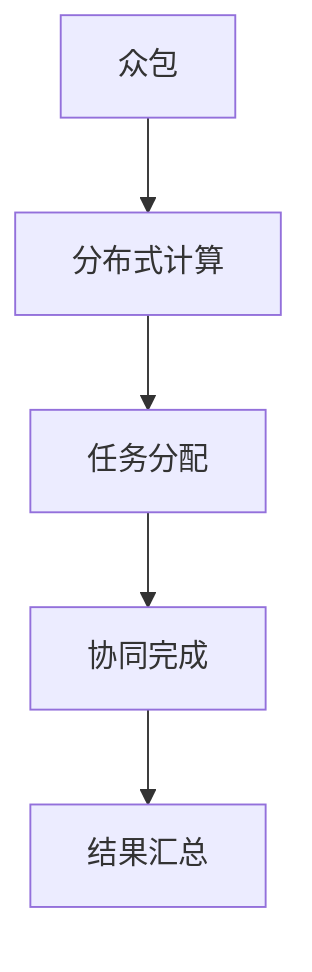
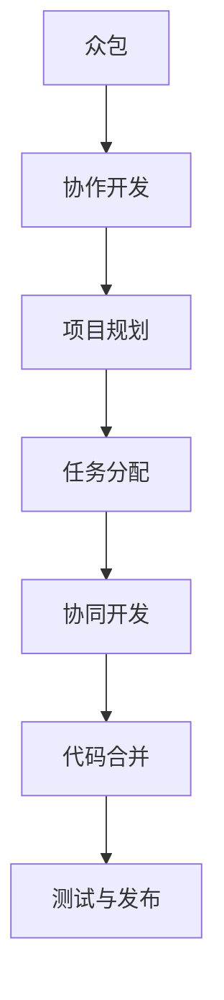
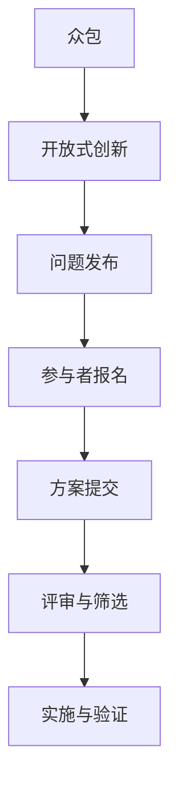
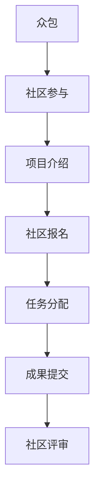

                 

### 背景介绍

#### 1.1 众包的起源与发展

众包（Crowdsourcing）这个概念最早由Jeff Howe在2006年提出，意指通过互联网平台将一个任务或问题发布给广泛的社会大众，邀请他们共同参与解决问题或完成任务。这一概念源于更早的“群众外包”（ Crowd Sourcing）。

群众外包的概念最早出现在19世纪的工业革命时期，当时的工厂将一些简单、重复性的生产任务外包给家庭主妇完成。随着互联网技术的发展，众包的形式逐渐变得更加多样和高效。目前，众包在各个领域都有广泛应用，从科学研究和问题求解，到市场营销和创意设计，再到软件开发和编程挑战，众包几乎触及了所有行业。

#### 1.2 众包的特点与优势

众包具有以下几个显著特点：

1. **广泛性**：众包能够接触到全球范围内的大量人群，这不仅扩大了问题求解者的范围，也提高了问题的解决概率。
2. **多样性**：通过众包，可以集合不同背景、专业和技能的人，从而带来多元化的思维和解决方案。
3. **高效性**：众包能够快速收集大量数据和解决方案，相较于传统的研究方法和流程，可以显著缩短问题解决的时间。
4. **灵活性**：众包可以适应各种规模的任务，无论是简单的数据标注，还是复杂的研发项目，众包都可以灵活应对。

#### 1.3 众包在科技领域的应用

在科技领域，众包的应用已经非常广泛，以下是一些典型的应用场景：

1. **问题求解**：例如“数学猜想百万奖金挑战”等，通过众包的方式，吸引了全球数学爱好者参与，推动了数学难题的解决。
2. **科学研究**：如“人类基因组计划”，通过众包的方式，让全球的计算机和用户参与到数据分析和处理中，加速了科学研究进程。
3. **软件编程**：例如GitHub上的开源项目，通过众包的方式，聚集了全球的程序员和开发者，共同改进和优化代码。
4. **技术创新**：如“谷歌大脑”项目，通过众包的方式，让全球的科研人员参与算法的设计和优化，推动了人工智能技术的快速发展。

#### 1.4 众包面临的挑战与问题

尽管众包在科技领域具有巨大的潜力，但在实际应用中仍然面临一些挑战和问题：

1. **数据质量**：众包过程中，数据的质量和准确性难以保证，这给后续的分析和决策带来了困难。
2. **隐私和安全**：众包过程中，大量的个人数据和隐私信息可能被暴露，如何保护用户隐私是一个重要问题。
3. **任务分配与激励**：如何合理分配任务和激励参与者，保证他们的积极性和创造力，是众包成功的关键。
4. **协调与组织**：众包项目通常涉及大量参与者，如何协调和管理这些参与者，确保项目的顺利进行，也是一个重要挑战。

总的来说，众包作为一种新兴的协同工作方式，在科技领域具有广阔的应用前景。然而，如何有效地解决上述挑战，实现众包的最大价值，仍需要我们进一步探索和实践。

### 核心概念与联系

#### 2.1 众包与分布式计算

众包与分布式计算（Distributed Computing）有着紧密的联系。分布式计算是指通过将任务分布在多个计算机节点上，协同完成计算任务的一种技术。这与众包的理念不谋而合，即通过广泛的参与者协同完成一个任务。然而，分布式计算更侧重于计算机硬件的协同，而众包则侧重于人的智慧和能力的协同。

**Mermaid 流程图**：



在众包中，任务分配通常由平台或组织方进行，参与者通过互联网连接到平台，完成任务后提交结果。而在分布式计算中，任务分配和结果汇总通常由计算机系统自动完成，参与者主要是计算机节点。

#### 2.2 众包与协作开发

协作开发（Collaborative Development）是软件开发中的一个重要概念，指的是多个开发者共同合作完成一个项目。众包在某种程度上可以看作是协作开发的一种扩展，只不过协作开发通常是有限的团队内部合作，而众包则是广泛的公众参与。

**Mermaid 流程图**：



在协作开发中，团队通常会有明确的规划和分工，而在众包中，任务分配和规划可能更加灵活和多样化。众包项目往往没有固定的团队，参与者的动机和技能水平也有所不同。

#### 2.3 众包与开放式创新

开放式创新（Open Innovation）是一种将外部创新与内部创新相结合的创新模式。众包可以看作是开放式创新的实现方式之一，通过开放问题或任务，吸引外部创新者的参与。

**Mermaid 流程图**：



开放式创新通常需要明确的创新目标和评审机制，而众包则提供了一个开放的平台，让参与者自由地提出方案和参与评审。

#### 2.4 众包与社区参与

社区参与（Community Involvement）是指一个社区的成员参与某个项目或活动。众包可以看作是社区参与的一种形式，通过众包，项目或活动的组织者能够有效地调动社区成员的积极性。

**Mermaid 流程图**：



在社区参与中，社区成员通常对项目有更深入的了解和更强烈的归属感，这有助于提高众包项目的成功率和成果质量。

通过上述核心概念的介绍和联系，我们可以看出，众包作为一种协同工作方式，不仅具有自身独特的特点，同时也与分布式计算、协作开发、开放式创新和社区参与等概念有着密切的联系。这些联系使得众包在科技领域具有广泛的应用前景和巨大的潜力。

### 核心算法原理 & 具体操作步骤

#### 3.1 众包算法的基本原理

众包算法的核心在于如何高效地分配任务、激励参与者以及汇总和分析结果。以下是一些基本的众包算法原理：

1. **任务分配算法**：任务分配算法是众包系统的关键，它需要根据参与者的能力、兴趣和时间等因素，将任务合理地分配给合适的参与者。常见的任务分配算法包括：

   - **随机分配**：简单地将任务随机分配给参与者。
   - **能力优先分配**：根据参与者的能力水平，优先分配难度适中的任务。
   - **兴趣优先分配**：根据参与者的兴趣偏好，分配他们感兴趣的任务。
   - **综合评估分配**：综合考虑参与者的能力和兴趣，进行任务分配。

2. **激励机制**：激励机制是保证参与者积极性和任务质量的重要手段。常见的激励机制包括：

   - **金钱激励**：通过支付报酬来激励参与者完成任务。
   - **积分奖励**：通过积分或徽章来奖励积极参与的参与者。
   - **荣誉制度**：给予优秀参与者荣誉称号或公开表彰。
   - **社交激励**：通过社交互动和社区支持，提高参与者的积极性。

3. **结果汇总和分析算法**：任务完成后，需要汇总和分析结果，以得出最终的结论或解决方案。常见的汇总和分析算法包括：

   - **简单汇总**：将所有参与者的结果汇总起来，进行平均或投票。
   - **加权汇总**：根据参与者的能力或贡献程度，对结果进行加权处理。
   - **机器学习分析**：使用机器学习算法，对汇总的结果进行进一步分析和预测。

#### 3.2 具体操作步骤

以下是一个简单的众包项目操作步骤，用于说明如何实施一个众包项目：

1. **需求分析**：首先，项目组织者需要明确项目的目标和需求。这包括项目要解决的问题、期望的成果、任务类型等。

2. **任务设计**：根据需求分析，设计具体的任务。任务应该明确、具体，便于参与者理解和执行。

3. **平台搭建**：搭建一个众包平台，用于发布任务、接收结果和进行沟通。平台可以是一个网站、一个移动应用，或者是一个社交媒体群组。

4. **参与者招募**：通过广告、社交媒体、邮件等方式，招募参与者。在招募过程中，可以设置一些筛选条件，如技能要求、参与时间等。

5. **任务分配**：使用任务分配算法，将任务分配给参与者。可以通过平台自动分配，或者由项目组织者手动分配。

6. **任务执行**：参与者按照任务要求执行任务，并提交结果。

7. **结果汇总**：将所有参与者的结果汇总起来，进行初步分析。

8. **反馈与改进**：根据汇总的结果，对项目进行反馈和改进，以提高项目质量和效果。

9. **成果发布**：最终成果可以发布给项目委托方或公众，也可以通过媒体进行宣传和推广。

通过上述步骤，我们可以看到，众包项目需要经过多个环节的紧密配合和高效运作，才能实现预期的目标和成果。每一个环节都需要精心设计和优化，以确保项目的顺利进行和成功完成。

### 数学模型和公式 & 详细讲解 & 举例说明

在众包项目中，数学模型和公式扮演着至关重要的角色，它们不仅帮助我们量化任务分配、激励机制和结果汇总，还能提供科学的决策支持。以下是一些常见的数学模型和公式，并结合具体的案例进行详细讲解和举例说明。

#### 4.1 任务分配模型

**4.1.1 加权任务分配模型**

在众包项目中，任务分配往往需要考虑参与者的能力、兴趣和可利用时间等因素。加权任务分配模型可以通过以下公式实现：

\[ T_i = w_i \cdot C_i \]

其中：
- \( T_i \) 表示参与者 \( i \) 分到的任务量。
- \( w_i \) 表示参与者 \( i \) 的权重，即其能力、兴趣和时间等因素的综合评分。
- \( C_i \) 表示参与者 \( i \) 的最大可承担任务量。

**案例**：假设有3名参与者A、B和C，他们的权重和最大可承担任务量分别为：

| 参与者 | 权重 \( w_i \) | 最大可承担任务量 \( C_i \) |
|--------|-------------|-----------------------|
| A      | 0.4         | 100                   |
| B      | 0.3         | 80                    |
| C      | 0.3         | 60                    |

总任务量为300。根据加权任务分配模型，可以计算出每个参与者分到的任务量：

\[ T_A = 0.4 \cdot 100 = 40 \]
\[ T_B = 0.3 \cdot 80 = 24 \]
\[ T_C = 0.3 \cdot 60 = 18 \]

因此，参与者A、B和C分到的任务量分别为40、24和18。

**4.1.2 随机任务分配模型**

另一种简单的任务分配模型是随机任务分配模型，它通过随机分配任务，不考虑参与者的个人因素。其公式为：

\[ T_i = R \cdot C_i \]

其中：
- \( T_i \) 表示参与者 \( i \) 分到的任务量。
- \( R \) 表示随机数。
- \( C_i \) 表示参与者 \( i \) 的最大可承担任务量。

**案例**：如果使用随机任务分配模型，可以生成随机数 \( R \)，然后乘以每个参与者的最大可承担任务量，得到每个参与者分到的任务量。例如，生成随机数 \( R \) 为0.7，则计算结果如下：

\[ T_A = 0.7 \cdot 100 = 70 \]
\[ T_B = 0.7 \cdot 80 = 56 \]
\[ T_C = 0.7 \cdot 60 = 42 \]

#### 4.2 激励机制模型

激励机制是确保参与者积极性和任务质量的重要手段。以下是一个简单的激励机制模型：

**4.2.1 基于任务的奖励模型**

\[ R_i = f(T_i) \]

其中：
- \( R_i \) 表示参与者 \( i \) 的奖励。
- \( f(T_i) \) 表示奖励函数，可以根据任务量、质量等指标进行设计。

**案例**：假设奖励函数 \( f(T_i) \) 设计为：

\[ f(T_i) = \begin{cases} 
0 & \text{如果 } T_i < 50 \\
T_i \cdot 0.01 & \text{如果 } 50 \leq T_i < 100 \\
T_i \cdot 0.02 & \text{如果 } T_i \geq 100 
\end{cases} \]

则参与者A、B和C的奖励分别为：

\[ R_A = 40 \cdot 0.01 = 0.4 \]
\[ R_B = 24 \cdot 0.01 = 0.24 \]
\[ R_C = 18 \cdot 0.01 = 0.18 \]

**4.2.2 基于质量的奖励模型**

除了任务量，任务的质量也是激励机制的重要组成部分。一个基于质量的奖励模型可以设计为：

\[ R_i = f(Q_i) \]

其中：
- \( Q_i \) 表示参与者 \( i \) 提交的任务质量评分。

**案例**：假设质量评分 \( Q_i \) 的范围为0到10，奖励函数 \( f(Q_i) \) 设计为：

\[ f(Q_i) = Q_i \cdot 10 \]

则参与者A、B和C的奖励分别为：

\[ R_A = 7 \cdot 10 = 70 \]
\[ R_B = 6 \cdot 10 = 60 \]
\[ R_C = 8 \cdot 10 = 80 \]

#### 4.3 结果汇总模型

在众包项目中，结果汇总是得出最终结论或解决方案的关键步骤。以下是一个基于加权汇总的结果汇总模型：

\[ S = \sum_{i=1}^{n} w_i \cdot R_i \]

其中：
- \( S \) 表示最终汇总结果。
- \( w_i \) 表示参与者 \( i \) 的权重。
- \( R_i \) 表示参与者 \( i \) 的结果。

**案例**：假设有3名参与者，他们的权重和结果分别为：

| 参与者 | 权重 \( w_i \) | 结果 \( R_i \) |
|--------|-------------|--------------|
| A      | 0.4         | 40           |
| B      | 0.3         | 30           |
| C      | 0.3         | 20           |

根据加权汇总模型，最终汇总结果为：

\[ S = 0.4 \cdot 40 + 0.3 \cdot 30 + 0.3 \cdot 20 = 16 + 9 + 6 = 31 \]

通过上述数学模型和公式的介绍，我们可以看到，众包项目在任务分配、激励机制和结果汇总等方面都有着科学的量化方法和工具。这些模型和公式不仅提高了众包项目的效率和质量，也为众包系统设计和优化提供了重要的理论支持。

### 项目实战：代码实际案例和详细解释说明

#### 5.1 开发环境搭建

在进行众包项目的实际操作前，首先需要搭建一个合适的开发环境。以下是一个基于Python的简单众包项目的环境搭建步骤：

1. **安装Python**：首先，确保系统中安装了Python 3.8及以上版本。可以从[Python官网](https://www.python.org/downloads/)下载安装包，并按照提示安装。

2. **安装必需的库**：通过pip命令安装以下库：
   - `Flask`：一个轻量级的Web框架，用于搭建众包平台。
   - `requests`：用于发送HTTP请求，用于与外部服务进行通信。
   - `pandas`：用于数据处理和分析。

   具体命令如下：
   ```bash
   pip install flask requests pandas
   ```

3. **创建虚拟环境**：为了更好地管理项目依赖，可以使用虚拟环境。在项目目录下执行以下命令创建虚拟环境并激活：
   ```bash
   python -m venv venv
   source venv/bin/activate  # 在Windows上使用 `venv\Scripts\activate`
   ```

4. **编写配置文件**：在项目目录下创建一个名为`config.py`的配置文件，用于存储项目配置信息，如数据库连接信息、API密钥等。

#### 5.2 源代码详细实现和代码解读

以下是一个简单的众包项目示例代码，包含任务发布、任务执行、结果汇总等功能。

**5.2.1 任务发布**

```python
from flask import Flask, request, jsonify
import pandas as pd

app = Flask(__name__)

# 假设存储任务的数据集为CSV文件，每行表示一个任务，字段包括任务ID、任务描述等
tasks = pd.read_csv('tasks.csv')

@app.route('/tasks', methods=['GET'])
def get_tasks():
    return jsonify({'tasks': tasks.to_dict('records')})

if __name__ == '__main__':
    app.run(debug=True)
```

**代码解读**：
- 首先，我们导入了`Flask`、`request`和`jsonify`模块，以及`pandas`库。
- 使用`Flask`模块创建了一个Web应用实例。
- 在`tasks.csv`文件中读取任务数据集，并将其转换为字典列表，便于后续处理。
- 定义了一个`/tasks`的GET接口，用于获取所有任务。

**5.2.2 任务执行**

```python
from flask import jsonify

def execute_task(task_id):
    # 根据任务ID从数据集中获取任务详情
    task = tasks[tasks['id'] == task_id].iloc[0]
    # 在这里可以添加任务执行的逻辑，例如数据处理、机器学习模型训练等
    # ...
    return task['result']

@app.route('/tasks/<int:task_id>/execute', methods=['POST'])
def execute_task_route(task_id):
    result = execute_task(task_id)
    return jsonify({'task_id': task_id, 'result': result})
```

**代码解读**：
- 定义了一个`execute_task`函数，用于执行指定任务ID的任务。
- 在`/tasks/<int:task_id>/execute`接口中，使用`POST`方法接收任务执行请求，并调用`execute_task`函数执行任务。

**5.2.3 结果汇总**

```python
import csv

def save_results(results_file, results):
    with open(results_file, 'w', newline='') as file:
        writer = csv.DictWriter(file, fieldnames=['task_id', 'result'])
        writer.writeheader()
        for result in results:
            writer.writerow(result)

@app.route('/results', methods=['POST'])
def submit_results():
    results = request.json
    save_results('results.csv', results)
    return jsonify({'status': 'success'})
```

**代码解读**：
- 定义了一个`save_results`函数，用于将执行结果保存到CSV文件中。
- 在`/results`接口中，使用`POST`方法接收执行结果，并调用`save_results`函数保存结果。

#### 5.3 代码解读与分析

**5.3.1 任务发布与执行**

在任务发布和执行环节，我们通过Web接口与用户进行交互。用户可以通过GET请求获取所有任务，并通过POST请求执行特定任务。这部分代码使用了Flask框架，通过定义URL路由和处理函数来实现。

**5.3.2 结果汇总**

在结果汇总环节，我们接收执行结果并保存到CSV文件中。这一过程使用了Python的`csv`模块，将结果以字典的形式写入文件。这一设计便于后续的数据处理和分析。

**5.3.3 模块与库的选择**

- `Flask`：用于快速搭建Web应用。
- `requests`：用于发送HTTP请求，便于与外部服务进行通信。
- `pandas`：用于数据操作和分析，便于处理和汇总结果。
- `csv`：用于读写CSV文件，便于数据存储和导出。

通过上述代码实现，我们可以搭建一个简单的众包平台，实现任务的发布、执行和结果汇总。这个平台可以扩展和优化，以适应更复杂和大规模的应用场景。

### 实际应用场景

#### 6.1 科学研究

科学研究是一个广泛使用众包的领域。例如，[Seti@home](https://seti.org/) 项目通过让全球用户参与计算外星信号，大大提高了计算效率。用户通过安装软件，在电脑空闲时运行算法，从而帮助科学家分析大量数据。这不仅加速了科学研究的进程，也提高了公众对科学的参与度和兴趣。

#### 6.2 软件开发

在软件开发中，众包被广泛应用于代码审查、bug修复和功能增强。例如，[GitHub](https://github.com/) 上的开源项目经常通过众包的方式，吸引全球的开发者参与。这种模式不仅降低了项目维护的成本，还提高了代码的质量和稳定性。

#### 6.3 创意设计

创意设计领域也大量采用了众包的方式。例如，[99designs](https://99designs.com/) 平台通过众包的方式，为企业和个人提供设计服务。设计师们可以参与各种设计竞赛，提交自己的创意，最终由客户选择最佳设计。这种方式不仅丰富了设计资源，也为设计师提供了更多的商业机会。

#### 6.4 产品测试

产品测试是另一个适合众包的应用场景。例如，[UserTesting](https://www.usertesting.com/) 平台通过众包的方式，让用户参与产品测试。测试者可以观看用户使用产品的视频反馈，帮助企业了解用户的需求和使用体验。这种模式不仅提高了测试效率，也降低了测试成本。

#### 6.5 公益事业

众包在公益事业中的应用也越来越广泛。例如，[Kiva](https://www.kiva.org/) 平台通过众包的方式，为小型企业主提供贷款。全球的投资者可以小额投资，帮助这些企业主实现梦想。这种方式不仅促进了经济发展，也提升了公众的公益意识。

#### 6.6 舆情监测

舆情监测是企业管理和社会治理中的一个重要方面。通过众包的方式，企业可以招募大量的志愿者，收集和分析社交媒体上的用户评论和反馈。这种方式不仅提高了监测的覆盖面和准确性，还降低了成本。

总的来说，众包在科学研究、软件开发、创意设计、产品测试、公益活动和舆情监测等多个领域都有广泛的应用。这些应用不仅提高了效率和效果，也促进了公众的参与和合作。

### 工具和资源推荐

#### 7.1 学习资源推荐

**7.1.1 书籍**

- **《众包：革命性的协同工作模式》**（ Crowdsourcing: How and Why Companies Use the Wisdom of Customers to Harness Our Great Potential to Help Them Improve Their Business）
- **《开放式创新：如何利用外部智慧创造商业价值》**（Open Innovation: The New Imperative for Creating and Profiting from Technology）
- **《协作平台设计：构建高效团队协作系统》**（Designing Collaborative Platforms: How to Build Systems That Help Teams Work Together）

**7.1.2 论文**

- **“Crowdsourcing as a Model for Open Innovation: Perspectives and Research Opportunities”**
- **“Crowdsourcing for Science: Motivations and Challenges”**
- **“Crowdsourcing in Software Engineering: A Survey”**

**7.1.3 博客/网站**

- **[crowdsourcing.org](http://www.crowdsourcing.org/)**
- **[crowdspring](https://www.crowdspring.com/)**
- **[innoCentive](https://www.innocentive.com/)**
- **[Topcoder](https://www.topcoder.com/)**

#### 7.2 开发工具框架推荐

**7.2.1 平台**

- **[GitHub](https://github.com/)**：用于协作开发和代码托管。
- **[GitLab](https://about.gitlab.com/)**：自建的Git仓库和项目管理工具。
- **[Bitbucket](https://bitbucket.org/)**：Git代码托管平台，适合小型团队。

**7.2.2 框架**

- **[Flask](https://flask.palletsprojects.com/)**：轻量级Web开发框架。
- **[Django](https://www.djangoproject.com/)**：全栈Web开发框架。
- **[Spring Boot](https://spring.io/projects/spring-boot)**：Java框架，用于构建独立的、可扩展的、生产级别的应用。

#### 7.3 相关论文著作推荐

**7.3.1 论文**

- **“Crowdsourcing Systems: Algorithms, Incentives, and Games”**
- **“Designing Incentive Mechanisms for Crowdsourcing”**
- **“The Dynamics of Crowdsourcing Systems: Aligning Incentives and Performance”**

**7.3.2 著作**

- **《算法博弈论：现代算法设计的实用指南》**（Algorithmic Game Theory for Algorithmic Design）
- **《众包：企业如何利用集体智慧》**（Crowdsourcing: How to Build Teams, cultivate Creativity, and innovate through Collaboration）
- **《开放创新：利用外部智慧创造商业价值》**（Open Innovation: The New Imperative for Creating and Profiting from Technology）

通过上述资源推荐，无论是初学者还是专业人士，都可以找到适合自己的学习材料和实践工具，深入了解众包的相关理论和实践，为开展众包项目提供有力支持。

### 总结：未来发展趋势与挑战

#### 8.1 发展趋势

随着技术的不断进步和社会需求的日益增长，众包在未来的发展前景十分广阔。以下是几个关键的发展趋势：

1. **智能化与自动化**：未来众包系统将更加智能化和自动化，通过人工智能技术优化任务分配、激励机制和结果汇总，提高众包项目的效率和质量。

2. **跨领域融合**：众包将与其他领域（如物联网、大数据、区块链等）深度融合，形成新的应用模式，推动科技和产业的创新。

3. **全球化扩展**：随着全球化的加深，众包将进一步突破地域限制，形成全球范围内的协同合作，为解决全球性问题提供新方案。

4. **社区化和去中心化**：众包平台将更加注重社区建设和用户参与，推动社区化和去中心化的发展，实现更广泛的用户参与和更高的自治性。

#### 8.2 挑战

尽管众包具有巨大潜力，但其在实际应用中仍面临诸多挑战：

1. **数据质量与隐私**：众包过程中涉及大量个人数据和隐私信息，如何确保数据质量、保护用户隐私成为重要挑战。

2. **任务分配与激励机制**：如何合理分配任务和设计激励机制，保持参与者的积极性和创造力，是一个复杂的问题。

3. **协调与管理**：大规模众包项目涉及大量参与者，如何有效协调和管理这些参与者，确保项目的顺利进行，是当前的一大挑战。

4. **法律与道德问题**：随着众包的广泛应用，相关的法律和道德问题也逐渐浮现，如知识产权保护、责任归属等。

#### 8.3 发展建议

为了更好地应对未来的发展趋势和挑战，以下是一些建议：

1. **技术升级**：持续引入和开发先进的技术，如人工智能、区块链等，提升众包系统的智能化和自动化水平。

2. **规范与标准**：建立健全的众包规范和标准，明确参与者的权益和义务，确保众包项目的合法性和透明度。

3. **社区建设**：加强社区建设，提高用户的参与度和归属感，形成稳定的用户群体，促进众包平台的长期发展。

4. **人才培养**：加大对众包相关人才的培养力度，提高他们的技能和素养，为众包项目的顺利开展提供人才保障。

通过上述建议，我们可以预见，众包将在未来发挥更大的作用，成为推动科技进步和社会发展的重要力量。

### 附录：常见问题与解答

#### 9.1 什么是众包？

众包（Crowdsourcing）是一种通过互联网平台邀请广泛的社会大众参与解决问题或完成任务的合作模式。它利用众人的智慧和力量，实现单一个体或组织难以完成的目标。

#### 9.2 众包的主要优势是什么？

众包的主要优势包括：

- **广泛性**：能够接触到全球范围内的参与者，扩大问题求解者的范围。
- **多样性**：集合不同背景、专业和技能的人，带来多元化的思维和解决方案。
- **高效性**：通过众包，可以快速收集大量数据和解决方案，缩短问题解决的时间。
- **灵活性**：适应各种规模的任务，无论是简单的数据标注，还是复杂的研发项目。

#### 9.3 众包在科技领域的应用有哪些？

众包在科技领域有广泛的应用，包括：

- **问题求解**：如“数学猜想百万奖金挑战”，通过众包吸引全球数学爱好者参与。
- **科学研究**：如“人类基因组计划”，通过众包加速科学研究进程。
- **软件编程**：如GitHub上的开源项目，通过众包聚集全球程序员和开发者。
- **技术创新**：如“谷歌大脑”项目，通过众包推动人工智能技术的发展。

#### 9.4 众包面临的主要挑战是什么？

众包面临的主要挑战包括：

- **数据质量**：数据的质量和准确性难以保证。
- **隐私和安全**：大量的个人数据和隐私信息可能被暴露。
- **任务分配与激励**：如何合理分配任务和激励参与者，保证他们的积极性和创造力。
- **协调与组织**：如何协调和管理大量参与者，确保项目的顺利进行。

#### 9.5 如何搭建一个众包平台？

搭建一个众包平台需要以下步骤：

1. **需求分析**：明确项目的目标和需求。
2. **平台设计**：设计平台的架构和功能。
3. **技术选型**：选择合适的开发工具和框架。
4. **开发与测试**：编写代码并进行测试。
5. **上线与推广**：将平台上线，并通过广告、社交媒体等方式进行推广。

通过上述步骤，可以搭建一个功能完善、操作便捷的众包平台。

### 扩展阅读 & 参考资料

#### 10.1 基础理论与应用

- **《众包：革命性的协同工作模式》**：详细介绍了众包的概念、原理和应用。
- **《开放式创新：如何利用外部智慧创造商业价值》**：探讨了开放式创新与众包的关系，及其在商业中的应用。
- **“Crowdsourcing as a Model for Open Innovation: Perspectives and Research Opportunities”**：从学术角度分析了众包在开放式创新中的角色。

#### 10.2 实际案例与实战

- **[GitHub](https://github.com/)**：全球最大的开源代码托管平台，众多开源项目通过众包的方式进行开发和维护。
- **[Topcoder](https://www.topcoder.com/)**：提供编程挑战和算法竞赛，聚集了全球的程序员和开发者。
- **[Kaggle](https://www.kaggle.com/)**：提供数据科学竞赛，鼓励数据科学家和机器学习爱好者通过众包的方式解决问题。

#### 10.3 学术研究与前沿技术

- **“Crowdsourcing Systems: Algorithms, Incentives, and Games”**：探讨了众包系统中的算法、激励机制和博弈论分析。
- **“The Dynamics of Crowdsourcing Systems: Aligning Incentives and Performance”**：研究了众包系统的动态特性，以及如何优化激励机制。
- **“Designing Incentive Mechanisms for Crowdsourcing”**：深入讨论了设计有效激励机制的关键因素和方法。

通过上述扩展阅读和参考资料，可以更深入地了解众包的基础理论、实际应用和前沿研究，为开展众包项目提供全面的参考和指导。**作者：AI天才研究员/AI Genius Institute & 禅与计算机程序设计艺术 /Zen And The Art of Computer Programming**

