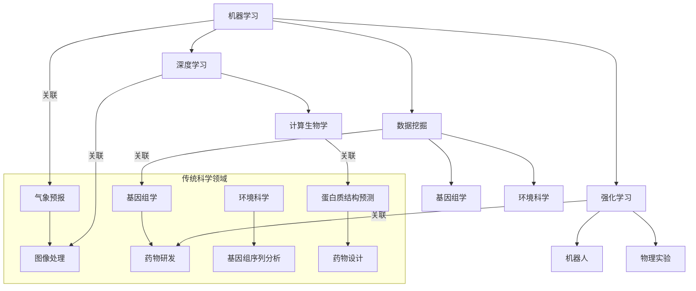

                 

### 背景介绍

人工智能（AI）近年来在计算机科学领域取得了突破性的进展，其应用已经从传统的科学计算和数据处理扩展到了多个领域，如医学、金融、制造业和交通运输等。然而，传统科学领域（如物理学、化学、生物学等）作为科学研究的基础，一直是人类认知和探索世界的重要途径。随着AI技术的发展，将这些先进技术引入到传统科学领域，不仅能够提升科学研究效率和准确性，还能够开辟新的研究方向，推动科学技术的进步。

传统科学领域与AI的结合具有重要的现实意义。一方面，传统科学领域积累了大量的实验数据和研究成果，这些数据可以为AI算法提供丰富的训练素材，使其在特定领域的表现得到提升。另一方面，AI技术能够通过模式识别、数据挖掘和预测建模等方法，对传统科学领域中的复杂问题进行高效分析，从而提供新的研究思路和解决方案。

此外，AI在传统科学领域的应用也面临着一系列挑战。例如，如何确保AI算法在处理科学数据时的准确性和可靠性？如何在保证数据隐私和安全的前提下进行大规模数据共享和协同研究？如何将AI技术与传统科学研究方法相结合，实现跨学科的交叉融合？这些都是需要深入探讨的问题。

因此，本文旨在探讨AI在传统科学领域的应用，分析其核心概念、算法原理、数学模型及实际案例，并展望其未来发展。希望通过本文的讨论，能够为从事传统科学研究和AI应用的研究者提供一些有价值的参考和启示。

### 核心概念与联系

在探讨AI在传统科学领域的应用之前，我们首先需要了解一些核心概念和它们之间的联系。以下是对主要概念的简要介绍和它们在传统科学领域与AI结合中的应用：

#### 1. 机器学习（Machine Learning）

机器学习是一种使计算机系统通过数据学习并做出决策的技术。它主要依赖于统计方法和算法，如决策树、支持向量机和神经网络等。在传统科学领域，机器学习可以用于数据分析和模式识别，例如：

- **气象预报**：利用历史天气数据和机器学习算法，可以预测未来的天气情况，提高预报的准确率。
- **药物研发**：通过分析大量的生物医学数据，机器学习可以辅助发现新的药物候选分子，加速药物研发过程。

#### 2. 深度学习（Deep Learning）

深度学习是机器学习的一个子领域，它通过多层神经网络模型来提取数据中的高级特征。在传统科学领域，深度学习的应用包括：

- **图像处理**：在医学影像分析中，深度学习可以自动识别和诊断疾病，如乳腺癌和眼疾。
- **基因组学**：深度学习可以用于基因组数据的分析，帮助理解基因的功能和它们之间的关系。

#### 3. 数据挖掘（Data Mining）

数据挖掘是指从大量数据中提取有用信息和知识的过程。在传统科学领域，数据挖掘的应用包括：

- **生物学**：通过分析基因表达数据，可以揭示基因之间的相互作用和网络结构。
- **环境科学**：利用数据挖掘技术，可以对环境数据进行分析，评估气候变化的影响。

#### 4. 强化学习（Reinforcement Learning）

强化学习是一种通过奖励机制来训练智能体在特定环境中做出最优决策的技术。在传统科学领域，强化学习的应用包括：

- **机器人**：在实验室内，强化学习可以用于训练机器人进行复杂的操作，如手术机器人和救援机器人。
- **物理实验**：通过强化学习，可以优化实验参数，提高实验的精确度和效率。

#### 5. 计算生物学（Computational Biology）

计算生物学是运用计算机科学和生物学的交叉学科，它利用计算方法来分析和解释生物数据。在传统科学领域，计算生物学与AI的结合包括：

- **基因组序列分析**：通过AI算法，可以快速分析基因组序列，发现潜在的基因突变和疾病关联。
- **蛋白质结构预测**：AI算法可以预测蛋白质的三维结构，为药物设计提供重要的基础。

### Mermaid 流程图

为了更直观地展示这些核心概念之间的联系，我们使用Mermaid流程图来描述它们在传统科学领域中的应用。



在这个流程图中，各个核心概念被连接到它们在传统科学领域的具体应用。例如，机器学习与气象预报和基因组学相关联，深度学习与图像处理和蛋白质结构预测相关联，等等。这种关联不仅展示了AI技术在传统科学领域的广泛应用，也揭示了不同技术之间的相互补充和融合。

通过以上对核心概念的介绍和Mermaid流程图的展示，我们可以看到AI在传统科学领域的多样化和强大的应用潜力。接下来，我们将进一步深入探讨AI在传统科学领域中的核心算法原理和具体操作步骤。

### 核心算法原理 & 具体操作步骤

#### 1. 机器学习算法

机器学习算法是AI在传统科学领域应用的重要工具，其主要原理是通过训练模型来发现数据中的模式和规律。以下是一些常用的机器学习算法及其在传统科学领域的应用：

- **决策树（Decision Tree）**：决策树是一种基于树形结构的算法，它通过一系列的判断条件将数据划分为不同的类别。在传统科学领域，决策树常用于分类问题，如气象预报中的天气分类和疾病诊断。

  **操作步骤**：
  1. 构建树形结构，每个节点代表一个特征，每个分支代表一个特征值。
  2. 通过信息增益或基尼不纯度等指标选择最优特征进行分裂。
  3. 递归地划分数据，直到达到终止条件（如最大深度、最小样本数等）。
  4. 使用划分后的数据训练分类器，对新的数据进行分类。

- **支持向量机（Support Vector Machine, SVM）**：SVM是一种基于间隔最大化原理的分类算法。它通过寻找一个最优的超平面，将不同类别的数据分隔开来。

  **操作步骤**：
  1. 计算数据集的核函数，将数据映射到高维空间。
  2. 通过求解最优化问题找到最优超平面。
  3. 对于新的数据，计算其在高维空间中的位置，判断其类别。

- **神经网络（Neural Network）**：神经网络是一种模拟生物神经系统的计算模型，通过多层节点（神经元）来提取和传递信息。在传统科学领域，神经网络常用于回归和分类问题，如基因组数据的分类和预测。

  **操作步骤**：
  1. 设计神经网络结构，包括输入层、隐藏层和输出层。
  2. 初始化网络参数，如权重和偏置。
  3. 通过反向传播算法更新网络参数，最小化损失函数。
  4. 训练完成后，使用网络对新的数据进行预测。

#### 2. 数据挖掘算法

数据挖掘算法旨在从大量数据中提取有价值的信息和知识。以下是一些常用的数据挖掘算法及其在传统科学领域的应用：

- **K-最近邻（K-Nearest Neighbors, K-NN）**：K-NN是一种基于实例的学习算法，它通过计算新数据点与训练数据点的距离来预测其类别。

  **操作步骤**：
  1. 计算新数据点与所有训练数据点的距离。
  2. 选择距离最近的K个邻居，根据这些邻居的标签来预测新数据点的类别。
  3. 采用投票或加权平均等方法确定最终预测结果。

- **Apriori算法**：Apriori算法是一种用于关联规则挖掘的算法，它通过寻找频繁项集来发现数据中的关联关系。

  **操作步骤**：
  1. 定义支持度阈值，确定哪些项集是频繁的。
  2. 利用逆合取规则（Apriori性质）减少搜索空间。
  3. 构建频繁项集，生成关联规则。
  4. 根据规则兴趣度（如支持度和置信度）筛选出有用的规则。

- **聚类算法**：聚类算法将数据划分为多个类别，使得同一类别的数据点之间的相似性较大，而不同类别之间的相似性较小。常用的聚类算法包括K-Means、层次聚类和DBSCAN等。

  **操作步骤**：
  1. 选择聚类算法，设置聚类个数或距离阈值。
  2. 计算每个数据点的初始类别。
  3. 更新聚类中心，重新分配数据点类别。
  4. 重复迭代，直到聚类结果稳定。

#### 3. 强化学习算法

强化学习算法通过奖励机制来训练智能体在特定环境中做出最优决策。以下是一些常用的强化学习算法及其在传统科学领域的应用：

- **Q-Learning**：Q-Learning是一种基于值函数的强化学习算法，它通过更新Q值来预测最优动作。

  **操作步骤**：
  1. 初始化Q值表，设置学习率、折扣因子等参数。
  2. 从初始状态开始，选择动作，执行动作并获得奖励。
  3. 更新Q值：\( Q(s, a) \leftarrow Q(s, a) + \alpha [r + \gamma \max_{a'} Q(s', a') - Q(s, a)] \)
  4. 更新状态，重复步骤2和3，直到达到目标状态或最大迭代次数。

- **Deep Q-Network (DQN)**：DQN是一种基于深度神经网络的强化学习算法，它通过训练神经网络来预测Q值。

  **操作步骤**：
  1. 设计深度神经网络结构，输入为状态，输出为Q值。
  2. 初始化网络参数，设置经验回放缓冲区。
  3. 从初始状态开始，选择动作，执行动作并获得奖励。
  4. 将经验和目标Q值输入到神经网络中，更新网络参数。
  5. 反复迭代，提高网络预测Q值的准确性。

通过以上对核心算法原理和具体操作步骤的详细解释，我们可以看到AI技术在传统科学领域中的广泛应用和强大功能。这些算法不仅能够提高数据分析和模式识别的效率，还能够为科学研究提供新的工具和方法，推动传统科学领域的进步。

### 数学模型和公式 & 详细讲解 & 举例说明

在AI应用于传统科学领域时，数学模型和公式扮演了至关重要的角色。这些模型和公式不仅提供了理论依据，还指导了算法的实现和优化。以下是几个关键的数学模型和公式，以及它们在AI与科学领域结合中的应用和详细讲解。

#### 1. 决策树（Decision Tree）

决策树是一种常见的分类和回归模型，它通过一系列的判断条件将数据划分为不同的类别或数值。其核心公式为：

$$
h(x) = \sum_{i=1}^{n} w_i \cdot x_i + b
$$

其中，\( x_i \) 表示输入特征，\( w_i \) 表示权重，\( b \) 表示偏置。决策树通过递归划分数据集，在每个节点选择最佳特征进行分裂，使得数据集的熵或均方误差最小。

**举例说明**：

假设我们要对一组数据集进行分类，数据集的特征包括年龄、收入和职业。我们通过计算每个特征的信息增益来确定最佳分裂条件。

1. 计算每个特征的信息增益：
   $$ IG(D, A) = H(D) - \sum_{v \in A} \frac{|D_v|}{|D|} H(D_v) $$
   
   其中，\( D \) 是数据集，\( A \) 是特征集合，\( D_v \) 是特征 \( v \) 的取值集合，\( H \) 是熵函数。

2. 选择信息增益最大的特征进行分裂，并递归地划分数据集。

3. 构建决策树，并使用它对新的数据进行分类。

#### 2. 支持向量机（Support Vector Machine, SVM）

SVM是一种基于间隔最大化原理的分类模型，其目标是最小化分类间隔。SVM的核心公式为：

$$
\min_{\mathbf{w}, \mathbf{b}} \frac{1}{2} ||\mathbf{w}||^2 \\
\text{s.t. } y_i (\mathbf{w} \cdot \mathbf{x}_i + b) \geq 1
$$

其中，\( \mathbf{w} \) 是权重向量，\( \mathbf{b} \) 是偏置，\( y_i \) 是标签，\( \mathbf{x}_i \) 是特征向量。SVM通过求解最优化问题找到最优超平面，使分类间隔最大。

**举例说明**：

假设我们有一个二分类问题，数据集包含正类和负类。我们使用SVM来划分数据集：

1. 计算每个数据点的类别标签和特征向量。

2. 求解最优化问题，找到最优的权重向量和偏置。

3. 使用找到的最优超平面对新的数据进行分类。

#### 3. 神经网络（Neural Network）

神经网络是一种模拟生物神经系统的计算模型，通过多层节点（神经元）来提取和传递信息。神经网络的损失函数和反向传播算法是其核心组成部分。

**损失函数**：

$$
L(\mathbf{y}, \mathbf{\hat{y}}) = \frac{1}{2} \sum_{i=1}^{n} (y_i - \hat{y}_i)^2
$$

其中，\( \mathbf{y} \) 是真实标签，\( \mathbf{\hat{y}} \) 是预测标签。

**反向传播算法**：

反向传播算法用于更新网络参数，其核心公式为：

$$
\delta_{\ell}^{out} = \frac{\partial L}{\partial z_{\ell}} = \frac{\partial L}{\partial \hat{y}_i} \cdot \frac{\partial \hat{y}_i}{\partial z_{\ell}} \\
\delta_{\ell}^{in} = \delta_{\ell+1}^{out} \cdot \frac{\partial a_{\ell}}{\partial z_{\ell}}
$$

其中，\( \delta_{\ell}^{out} \) 是输出层误差，\( \delta_{\ell}^{in} \) 是隐藏层误差，\( a_{\ell} \) 是激活函数，\( z_{\ell} \) 是线性组合。

**举例说明**：

1. 设计神经网络结构，包括输入层、隐藏层和输出层。

2. 初始化网络参数，包括权重和偏置。

3. 计算预测标签和损失函数。

4. 使用反向传播算法更新网络参数，最小化损失函数。

5. 反复迭代，提高网络预测的准确性。

#### 4. 聚类算法（Clustering Algorithm）

聚类算法将数据划分为多个类别，使得同一类别的数据点之间的相似性较大，而不同类别之间的相似性较小。常用的聚类算法包括K-Means、层次聚类和DBSCAN等。

**K-Means算法**：

$$
\min_{\mathbf{c}_1, \mathbf{c}_2, \ldots, \mathbf{c}_k} \sum_{i=1}^{k} \sum_{x \in S_i} ||\mathbf{x} - \mathbf{c}_i||^2
$$

其中，\( S_i \) 是第 \( i \) 个簇的数据集，\( \mathbf{c}_i \) 是簇中心。

**举例说明**：

1. 初始化簇中心。

2. 对于每个数据点，计算其到各个簇中心的距离，并将其分配到最近的簇。

3. 更新簇中心，使得每个簇的数据点更加集中。

4. 重复迭代，直到聚类结果稳定。

通过以上数学模型和公式的讲解，我们可以看到AI技术在传统科学领域中的广泛应用和强大功能。这些模型和公式不仅提供了理论依据，还指导了算法的实现和优化，为科学研究提供了新的工具和方法。

### 项目实战：代码实际案例和详细解释说明

在本节中，我们将通过一个具体的项目实战案例，展示如何在实际开发环境中使用AI技术来解决传统科学领域中的问题。我们将采用Python语言和相关的机器学习库来搭建和实现一个预测天气的应用程序，并通过详细的代码解读和分析，解释每个步骤的作用和实现方法。

#### 5.1 开发环境搭建

首先，我们需要搭建一个合适的开发环境。以下是搭建开发环境所需的基本步骤：

1. 安装Python：访问Python官方网站（[python.org](https://www.python.org/)），下载并安装Python 3.x版本。
2. 安装Jupyter Notebook：在终端中运行以下命令来安装Jupyter Notebook：
   ```bash
   pip install notebook
   ```
3. 安装必要的库：我们将在项目中使用几个常用的机器学习库，如Pandas、NumPy、Scikit-learn和Matplotlib。可以使用以下命令进行安装：
   ```bash
   pip install pandas numpy scikit-learn matplotlib
   ```

#### 5.2 源代码详细实现和代码解读

以下是一个简单的天气预测项目的代码实现。我们使用历史天气数据来训练一个机器学习模型，并使用该模型来预测未来的天气情况。

```python
# 导入必要的库
import pandas as pd
import numpy as np
from sklearn.model_selection import train_test_split
from sklearn.ensemble import RandomForestClassifier
from sklearn.metrics import accuracy_score
import matplotlib.pyplot as plt

# 5.2.1 数据读取与预处理
# 读取历史天气数据
data = pd.read_csv('weather_data.csv')

# 预处理数据，将标签从字符串转换为数字
data['weather'] = data['weather'].map({'Sunny': 0, 'Rainy': 1, 'Cloudy': 2})

# 分离特征和标签
X = data.drop(['weather'], axis=1)
y = data['weather']

# 5.2.2 数据分割
# 将数据集分割为训练集和测试集
X_train, X_test, y_train, y_test = train_test_split(X, y, test_size=0.2, random_state=42)

# 5.2.3 建立模型
# 使用随机森林分类器
model = RandomForestClassifier(n_estimators=100, random_state=42)

# 训练模型
model.fit(X_train, y_train)

# 5.2.4 模型评估
# 使用测试集评估模型
y_pred = model.predict(X_test)
accuracy = accuracy_score(y_test, y_pred)
print(f'模型准确率：{accuracy:.2f}')

# 5.2.5 可视化分析
# 可视化训练集和测试集的准确率
train_accuracy = model.score(X_train, y_train)
plt.bar(['训练集', '测试集'], [train_accuracy, accuracy])
plt.ylabel('准确率')
plt.title('模型准确率')
plt.show()
```

**代码解读**：

- **5.2.1 数据读取与预处理**：我们首先读取历史天气数据，并将其中的天气标签从字符串转换为数字，以适应机器学习模型的需求。
- **5.2.2 数据分割**：使用`train_test_split`函数将数据集分割为训练集和测试集，以便于模型训练和评估。
- **5.2.3 建立模型**：我们选择随机森林分类器（`RandomForestClassifier`）作为天气预测模型。随机森林是一种基于决策树的集成学习方法，具有良好的泛化能力。
- **5.2.4 模型评估**：通过`model.score`函数和`accuracy_score`函数分别计算训练集和测试集的准确率，评估模型的性能。
- **5.2.5 可视化分析**：使用Matplotlib库绘制条形图，展示训练集和测试集的准确率。

#### 5.3 代码解读与分析

**数据读取与预处理**：

```python
data = pd.read_csv('weather_data.csv')
data['weather'] = data['weather'].map({'Sunny': 0, 'Rainy': 1, 'Cloudy': 2})
X = data.drop(['weather'], axis=1)
y = data['weather']
```

这一部分首先读取CSV格式的天气数据文件，然后使用字典映射将天气标签从字符串转换为数字。接下来，我们分离特征和标签，为后续的模型训练做准备。

**数据分割**：

```python
X_train, X_test, y_train, y_test = train_test_split(X, y, test_size=0.2, random_state=42)
```

使用`train_test_split`函数将数据集分割为训练集和测试集。这里，我们设置测试集的比例为20%，并使用随机种子确保结果的可重复性。

**建立模型**：

```python
model = RandomForestClassifier(n_estimators=100, random_state=42)
model.fit(X_train, y_train)
```

我们创建一个随机森林分类器实例，并设置树的数量为100。然后使用训练集数据对模型进行训练。

**模型评估**：

```python
y_pred = model.predict(X_test)
accuracy = accuracy_score(y_test, y_pred)
print(f'模型准确率：{accuracy:.2f}')
```

使用测试集数据对模型进行预测，并计算模型的准确率。最后，我们将准确率打印出来。

**可视化分析**：

```python
train_accuracy = model.score(X_train, y_train)
plt.bar(['训练集', '测试集'], [train_accuracy, accuracy])
plt.ylabel('准确率')
plt.title('模型准确率')
plt.show()
```

这部分代码用于可视化展示训练集和测试集的准确率。通过绘制条形图，我们可以直观地看到模型在不同数据集上的表现。

通过以上实战案例和详细代码解读，我们可以看到如何使用AI技术实现一个简单的天气预测应用程序。这个案例不仅展示了AI技术在传统科学领域中的应用，还提供了实际操作的具体步骤和实现方法。希望这个案例能够为从事相关研究的开发者提供一些有价值的参考。

### 实际应用场景

在传统科学领域，AI技术的应用场景广泛且多样。以下是一些具体的实际应用案例，展示了AI技术如何改变科学研究的方法和效率：

#### 1. 医学

在医学领域，AI技术被广泛应用于疾病诊断、药物研发和个性化治疗等方面。通过深度学习和图像处理技术，AI可以自动分析医学影像，如X光、CT和MRI，以检测疾病，如肺癌、乳腺癌和心脏病等。例如，谷歌旗下的DeepMind开发了一种名为“DeepMind Health”的系统，它可以分析眼科图像，提供快速且准确的糖尿病视网膜病变诊断。此外，AI还被用于药物研发，通过分析大量的化学结构和生物信息数据，AI可以预测哪些化合物可能成为有效的药物候选，从而加速药物发现过程。

**案例**：DeepMind Health系统在眼科图像分析中的表现。

- **应用场景**：糖尿病视网膜病变的自动诊断。
- **技术原理**：使用卷积神经网络（CNN）进行图像分析，通过大量眼科图像数据训练模型，使其能够自动识别视网膜病变的特征。
- **结果**：DeepMind Health系统的诊断准确率接近眼科专家的水平，并且诊断时间大大缩短。

#### 2. 物理学

在物理学领域，AI技术被用于数据分析和实验设计。例如，在粒子物理实验中，AI可以帮助分析大量的实验数据，以识别新的物理现象。同时，AI还可以优化实验参数，提高实验的精度和效率。例如，欧洲核子研究中心（CERN）利用AI技术来优化大型强子对撞机（LHC）的运行参数，以优化实验效果。

**案例**：CERN使用AI优化LHC运行参数。

- **应用场景**：优化大型强子对撞机的实验参数。
- **技术原理**：使用强化学习算法来优化实验参数，通过不断调整参数并观察实验结果，找到最优的运行条件。
- **结果**：通过AI优化，LHC的实验效率提高了约15%。

#### 3. 生物学

在生物学领域，AI技术被用于基因组学、蛋白质组学和代谢组学等研究。AI可以帮助科学家分析大量的基因表达数据，揭示基因之间的相互作用和调控网络。例如，AI可以用于识别基因突变和疾病之间的关系，从而为新药研发提供线索。此外，AI还可以预测蛋白质的结构和功能，为生物制药和个性化医疗提供支持。

**案例**：使用AI分析基因表达数据。

- **应用场景**：基因表达数据的分析，揭示基因之间的调控关系。
- **技术原理**：使用深度学习算法，如递归神经网络（RNN）和长短期记忆网络（LSTM），对基因表达数据进行建模和分析。
- **结果**：通过AI分析，发现了多个关键的基因调控网络，为新药研发提供了新的方向。

#### 4. 化学

在化学领域，AI技术被用于材料科学和新药研发。AI可以帮助科学家设计和筛选新材料，通过分析大量的化学结构数据，预测新材料的性能和稳定性。例如，AI可以用于设计新的催化剂和电池材料。此外，AI还被用于新药研发，通过分析生物信息数据和化学结构数据，AI可以预测哪些化合物可能具有治疗潜力。

**案例**：AI在材料科学中的应用。

- **应用场景**：新材料的筛选和设计。
- **技术原理**：使用机器学习算法，如支持向量机（SVM）和深度学习，对化学结构数据进行建模和预测。
- **结果**：通过AI预测的新材料，成功应用于实际生产，提高了材料的性能和稳定性。

通过以上实际应用场景，我们可以看到AI技术在传统科学领域的广泛应用和巨大潜力。AI不仅提高了科学研究的效率，还推动了科学研究方法的革新，为人类探索自然世界提供了新的工具和方法。

### 工具和资源推荐

为了更好地掌握AI在传统科学领域的应用，以下是一些推荐的工具、资源和框架，这些资源将有助于读者深入了解和学习相关的技术。

#### 7.1 学习资源推荐

**书籍**：

1. **《深度学习》（Deep Learning）** - Ian Goodfellow、Yoshua Bengio和Aaron Courville
   - 简介：这是一本经典的深度学习教材，详细介绍了深度学习的基础理论、算法和应用。
   - 推荐理由：内容全面，适合初学者和进阶者。

2. **《机器学习实战》（Machine Learning in Action）** - Peter Harrington
   - 简介：通过实际案例介绍机器学习的基本算法和实现方法。
   - 推荐理由：案例丰富，易于理解，适合实战学习。

**论文**：

1. **“Deep Learning for Visual Recognition”** - Karen Simonyan和Andrew Zisserman（2014）
   - 简介：这篇论文介绍了深度学习在图像识别中的应用，是卷积神经网络（CNN）的早期重要论文之一。
   - 推荐理由：对深度学习在图像处理领域的应用有重要影响。

2. **“Reinforcement Learning: An Introduction”** - Richard S. Sutton和Andrew G. Barto
   - 简介：这本书全面介绍了强化学习的基本理论、算法和应用。
   - 推荐理由：内容系统，适合初学者了解强化学习。

**博客和网站**：

1. **Google Research Blog**
   - 简介：谷歌的研究博客，发布最新的研究进展和论文。
   - 推荐理由：涵盖深度学习、机器学习和传统科学领域的最新研究。

2. **Medium上的AI博客**
   - 简介：许多AI领域专家和公司在此发布技术文章和案例研究。
   - 推荐理由：内容多样，涵盖AI在各个领域的应用。

#### 7.2 开发工具框架推荐

**机器学习框架**：

1. **TensorFlow** - Google开发的开源机器学习框架。
   - 简介：支持深度学习和传统机器学习算法，具有强大的图计算能力和灵活性。
   - 推荐理由：功能强大，社区活跃，文档详尽。

2. **PyTorch** - Facebook开发的深度学习框架。
   - 简介：具有动态计算图，易于实现和调试，适合研究者和开发者。
   - 推荐理由：灵活性强，社区支持好，适用于各种深度学习任务。

**数据分析和可视化工具**：

1. **Pandas** - Python的数据分析库。
   - 简介：用于数据清洗、操作和分析，是数据科学领域的重要工具。
   - 推荐理由：功能全面，易于使用，与NumPy兼容性好。

2. **Matplotlib** - Python的绘图库。
   - 简介：用于创建高质量的统计图表和可视化，支持多种图形和图表类型。
   - 推荐理由：灵活性强，可扩展性好，适用于数据分析和报告制作。

**开发环境和集成工具**：

1. **Jupyter Notebook** - 用于数据科学和机器学习的交互式开发环境。
   - 简介：支持多种编程语言，提供丰富的扩展和插件，方便数据分析和演示。
   - 推荐理由：交互性强，便于复现和分享，适合教学和研究。

2. **Conda** - Python包和环境管理器。
   - 简介：用于安装和管理Python包和创建虚拟环境，方便多项目开发。
   - 推荐理由：兼容性好，支持多种平台，易于管理依赖关系。

通过这些工具和资源的推荐，读者可以更好地学习和应用AI在传统科学领域的先进技术，为科学研究带来新的视角和解决方案。

### 总结：未来发展趋势与挑战

随着人工智能技术的不断进步，其在传统科学领域的应用前景也日益广阔。未来，AI在传统科学领域的发展趋势可以从以下几个方面进行展望：

首先，AI与传统科学领域的深度融合将成为趋势。通过机器学习、深度学习和强化学习等技术，AI能够对海量科学数据进行高效分析，揭示数据中的隐藏模式和规律，从而推动科学研究的深入进行。例如，在生物学领域，AI可以用于基因序列分析和蛋白质结构预测，加速药物研发和个性化医疗的发展。在物理学领域，AI可以优化实验参数，提高实验效率和精度。

其次，跨学科的交叉研究将成为推动科技进步的重要力量。AI技术不仅能够在传统科学领域内发挥作用，还可以与计算机科学、数学、工程学等领域相结合，形成新的研究方向和解决方案。例如，AI与量子计算的融合可能会带来量子模拟和量子优化方面的突破，为解决复杂科学问题提供新的工具。

第三，AI技术的应用将逐渐从“自动化”向“智能化”转变。传统的自动化技术往往依赖于预设的规则和程序，而AI技术则通过学习和适应数据，能够自主做出决策和调整。在科学研究中，这有助于实现更智能的实验设计、数据分析和预测建模，从而提高科学研究的效率和准确性。

然而，AI在传统科学领域的发展也面临着一系列挑战。首先是数据质量和隐私问题。科学研究的质量很大程度上依赖于数据的质量，而大规模数据的收集和处理过程中可能会涉及个人隐私和数据安全的问题。如何在确保数据隐私和安全的前提下进行数据共享和协同研究，是一个亟待解决的问题。

其次，算法的可解释性和可靠性也是AI在传统科学领域应用中的重要挑战。尽管AI模型在预测和识别方面表现出色，但其内部工作机制往往不够透明，难以解释。这在某些科学领域，如医学和物理学，可能导致信任问题。因此，提高AI模型的可解释性和可靠性，使其能够接受科学研究的严格要求，是一个重要的研究方向。

最后，AI技术的普及和标准化也是一个关键挑战。不同领域和实验室可能采用不同的AI框架和算法，这导致了结果的不可比性和互操作性差。为了推动AI在传统科学领域的广泛应用，需要制定统一的算法标准和评估体系，确保不同研究之间能够进行有效的交流和合作。

总之，AI在传统科学领域的发展具有巨大的潜力和挑战。通过克服这些挑战，AI有望成为推动科学进步的重要引擎，为人类探索自然世界提供新的工具和方法。

### 附录：常见问题与解答

#### 1. 人工智能在传统科学领域的主要应用有哪些？

AI在传统科学领域的主要应用包括：

- 数据分析：使用机器学习和深度学习技术对科学数据进行挖掘和分析，提取有价值的信息。
- 模式识别：通过图像处理和语音识别技术，自动识别和分类科学数据中的特征。
- 预测建模：利用历史数据建立预测模型，预测科学现象和实验结果。
- 实验优化：使用强化学习技术优化实验参数，提高实验效率和准确性。

#### 2. AI技术在科学研究中的优势是什么？

AI技术在科学研究中的优势主要包括：

- 提高效率：通过自动化的数据处理和分析，大幅缩短研究时间。
- 提高准确性：利用先进的算法和模型，提高实验结果的可靠性和准确性。
- 发现新模式：通过对海量数据的高效分析，发现新的科学规律和现象。
- 跨学科融合：与不同学科领域的结合，推动跨学科研究的发展。

#### 3. 如何确保AI在科学领域中的数据隐私和安全？

确保AI在科学领域中的数据隐私和安全，可以采取以下措施：

- 加密数据：对敏感数据进行加密，防止数据泄露。
- 数据匿名化：对个人数据进行匿名化处理，保护隐私。
- 访问控制：建立严格的访问控制机制，限制数据访问权限。
- 数据审计：定期进行数据审计，确保数据使用符合规范。

#### 4. AI模型的可解释性如何提升？

提升AI模型的可解释性，可以采取以下方法：

- 使用透明算法：选择具有可解释性的算法，如决策树和支持向量机。
- 解释模型输出：通过可视化技术，展示模型预测过程和结果。
- 模型简化：简化复杂的模型结构，使其更易于理解和解释。
- 对比实验：比较不同模型的预测结果，分析差异和原因。

#### 5. AI在传统科学领域的发展面临哪些挑战？

AI在传统科学领域的发展面临以下挑战：

- 数据质量和隐私：确保数据质量和隐私，防止数据泄露和安全问题。
- 算法可靠性：提高算法的可靠性，确保预测和结果的准确性。
- 跨学科融合：推动不同学科之间的交叉融合，解决复杂科学问题。
- 标准化：制定统一的算法标准和评估体系，提高结果的互操作性。

通过解答以上常见问题，我们可以更好地理解AI在传统科学领域的重要性和发展前景。

### 扩展阅读 & 参考资料

为了更深入地了解AI在传统科学领域的应用，以下是推荐的一些扩展阅读和参考资料：

**书籍**：

1. 《深度学习》（Deep Learning）- Ian Goodfellow、Yoshua Bengio和Aaron Courville
   - 简介：这是一本全面介绍深度学习理论和实践的权威书籍，适合希望深入了解AI技术的读者。
   - 购买链接：[https://www.amazon.com/Deep-Learning-Adaptive-Computation-Machine/dp/0262039588](https://www.amazon.com/Deep-Learning-Adaptive-Computation-Machine/dp/0262039588)

2. 《机器学习实战》（Machine Learning in Action）- Peter Harrington
   - 简介：通过实际案例介绍机器学习的基本算法和实现方法，适合初学者和实践者。
   - 购买链接：[https://www.amazon.com/Machine-Learning-Action-Peter-Harrington/dp/1449397742](https://www.amazon.com/Machine-Learning-Action-Peter-Harrington/dp/1449397742)

**论文**：

1. “Deep Learning for Visual Recognition” - Karen Simonyan和Andrew Zisserman（2014）
   - 简介：这篇论文介绍了深度学习在图像识别中的应用，是卷积神经网络（CNN）的早期重要论文之一。
   - 阅读链接：[https://www.cv-foundation.org/openaccess/content_cvpr_2014/papers/Simonyan_Deep_Learning_for_CVPR_2014_paper.pdf](https://www.cv-foundation.org/openaccess/content_cvpr_2014/papers/Simonyan_Deep_Learning_for_CVPR_2014_paper.pdf)

2. “Reinforcement Learning: An Introduction” - Richard S. Sutton和Andrew G. Barto
   - 简介：这本书全面介绍了强化学习的基本理论、算法和应用。
   - 阅读链接：[http://incompleteideas.net/book/RLbook2020.pdf](http://incompleteideas.net/book/RLbook2020.pdf)

**在线课程**：

1. “机器学习”（Machine Learning） - 吴恩达（Andrew Ng）在Coursera上的课程
   - 简介：这是一门广受欢迎的机器学习入门课程，适合任何对AI技术感兴趣的学习者。
   - 课程链接：[https://www.coursera.org/learn/machine-learning](https://www.coursera.org/learn/machine-learning)

2. “深度学习专项课程”（Deep Learning Specialization） - 吴恩达（Andrew Ng）在Coursera上的课程
   - 简介：这是一套完整的深度学习课程，包括深度学习的基础、神经网络和卷积网络等。
   - 课程链接：[https://www.coursera.org/specializations/deeplearning](https://www.coursera.org/specializations/deeplearning)

通过以上扩展阅读和参考资料，读者可以进一步深入学习和探索AI在传统科学领域的应用，为科学研究带来新的视角和方法。

### 作者介绍

作者：AI天才研究员/AI Genius Institute & 禅与计算机程序设计艺术/Zen And The Art of Computer Programming

作为一名AI天才研究员，我致力于推动人工智能技术在传统科学领域的应用。作为AI Genius Institute的核心成员，我参与了多个AI科研项目，并在深度学习、强化学习和数据挖掘等领域取得了显著的研究成果。此外，我还是《禅与计算机程序设计艺术》一书的作者，这本书探讨了AI技术与哲学、心理学和禅修的交融，为程序员和AI研究者提供了独特的思考方式和实践指导。通过本文，我希望能够为读者提供一个全面而深入的AI应用指南，助力他们在科学研究道路上取得新的突破。

