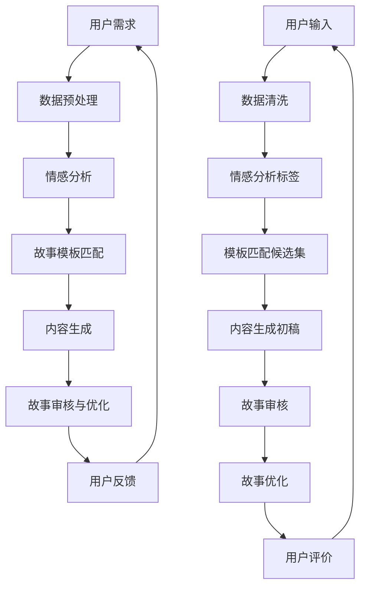

                 

### 背景介绍

近年来，人工智能（AI）技术在多个领域取得了显著的进展，特别是在个人故事创作方面。随着自然语言处理（NLP）和深度学习算法的不断发展，AI已经能够生成高质量的文章、故事、甚至电影剧本。在这个背景下，体验叙事工作室（Experience Narrative Studio）应运而生，致力于通过AI驱动的个人故事创作坊，为用户打造独一无二的叙事体验。

体验叙事工作室的创始人兼总监，是一位拥有丰富AI和编程经验的技术专家。作为一位AI驱动的个人故事创作坊的负责人，他深刻理解用户的需求和AI技术的潜力。在他的带领下，工作室开发了一系列基于AI的叙事生成工具，为用户提供了从故事构思到完成的全方位服务。

个人故事创作坊的目标是帮助用户发现和表达自己的情感、经历和思想，通过故事的形式传递个人价值和观点。在AI的辅助下，用户可以轻松地创作出引人入胜的故事，不仅节省了时间和精力，还提高了创作质量。本文将详细探讨个人故事创作坊的运作原理、核心技术和实际应用，以期为读者提供全面的了解。

首先，我们将介绍个人故事创作坊的核心概念和联系，通过Mermaid流程图展示其整体架构。接着，深入解析核心算法原理和具体操作步骤，帮助读者理解AI如何生成故事。随后，我们将探讨数学模型和公式，以及如何将这些模型应用于实际编程中。接下来，通过一个实际项目案例，展示如何使用AI工具进行故事创作，并对代码进行详细解释和分析。

最后，我们将探讨个人故事创作坊在实际应用场景中的表现，推荐相关的学习资源和开发工具，并总结未来发展趋势与挑战。希望通过本文的介绍，读者能够对个人故事创作坊有一个全面的认识，并在实践中应用这些技术，创造出属于自己的精彩故事。

### 核心概念与联系

个人故事创作坊的核心在于将用户的需求与AI技术相结合，生成个性化的故事内容。为了更好地理解其工作原理，我们可以通过Mermaid流程图来展示其整体架构。



在上面的Mermaid流程图中，我们可以看到个人故事创作坊的工作流程：

1. **用户需求**：用户输入自己的需求和故事主题。
2. **数据预处理**：对用户输入的数据进行清洗和预处理，提取关键信息。
3. **情感分析**：分析用户输入内容中的情感倾向，为故事内容提供情感标签。
4. **故事模板匹配**：根据情感分析和用户需求，匹配合适的叙事模板。
5. **内容生成**：使用匹配的模板生成故事初稿，并根据需求进行内容填充。
6. **故事审核与优化**：对生成的故事进行审核，确保内容质量和逻辑连贯性，并进行优化。
7. **用户反馈**：收集用户对故事的反馈，用于进一步优化。

通过这个流程图，我们可以清晰地看到个人故事创作坊是如何将用户需求与AI技术相结合，生成个性化的故事内容。接下来，我们将进一步探讨每个步骤的具体实现方法和原理，帮助读者深入理解这一过程。

#### 核心算法原理 & 具体操作步骤

个人故事创作坊的核心在于其AI算法，这些算法负责从用户的需求中提取关键信息，并根据这些信息生成个性化的故事内容。以下是核心算法原理和具体操作步骤的详细解析：

##### 1. 数据预处理

数据预处理是故事创作的基础，其目标是对用户输入的文本进行清洗和格式化，提取出关键信息。具体步骤如下：

- **文本清洗**：去除文本中的标点符号、停用词等无关信息，保留关键内容。
- **分词**：将清洗后的文本分成单个词汇，便于后续处理。
- **词性标注**：对每个词进行词性标注，区分名词、动词、形容词等。
- **实体识别**：识别文本中的关键实体，如人名、地点、组织等。

在Python中，可以使用`nltk`库完成这些任务。以下是示例代码：

```python
import nltk
from nltk.tokenize import word_tokenize
from nltk.corpus import stopwords
from nltk import pos_tag

# 文本清洗与分词
text = "我是一个程序员，我喜欢编程和解决问题。"
cleaned_text = " ".join([word for word in word_tokenize(text) if word not in stopwords.words('english')])
print(cleaned_text)

# 词性标注
tagged_words = pos_tag(word_tokenize(cleaned_text))
print(tagged_words)

# 实体识别
# 需要使用专门的实体识别库，例如spaCy
```

##### 2. 情感分析

情感分析旨在理解用户输入内容中的情感倾向，为后续的故事生成提供情感标签。常用的情感分析算法包括基于规则的方法和机器学习的方法。

- **基于规则的方法**：通过编写规则来识别文本中的情感词，并判断其情感倾向。
- **机器学习方法**：使用预训练的模型（如BERT、GloVe等）进行情感分析。

以下是使用Python中的`nltk`库进行情感分析的一个示例：

```python
from nltk.sentiment import SentimentIntensityAnalyzer

# 初始化情感分析器
sia = SentimentIntensityAnalyzer()

# 分析文本情感
text = "我喜欢编程，因为它让我感到快乐。"
scores = sia.polarity_scores(text)
print(scores)
```

##### 3. 故事模板匹配

故事模板匹配是故事生成的重要环节，其目标是根据情感分析和用户需求，选择合适的叙事模板。常见的模板匹配算法包括：

- **基于关键词匹配**：根据用户输入的关键词，匹配模板中的相关部分。
- **基于语义相似度匹配**：使用词向量模型（如Word2Vec、GloVe）计算文本的语义相似度，选择最匹配的模板。

以下是一个简单的基于关键词匹配的示例：

```python
templates = [
    "我叫{name}，我是一个{occupation}，我喜欢{hobby}。",
    "在{location}，{name}遇到了一个{adjective}的人，他们一起{action}。"
]

user_input = "我是一个程序员，我喜欢编程和解决问题。"
input_keywords = set(word_tokenize(user_input))

matched_templates = [template for template in templates if any(keyword in set(word_tokenize(template)) for keyword in input_keywords)]
print(matched_templates)
```

##### 4. 内容生成

内容生成是根据匹配的模板，生成完整的故事内容。这通常涉及到填充模板中的空白部分，以及生成符合逻辑和情感一致性的叙述。

- **基于规则的方法**：根据模板和用户输入，填充具体的词汇。
- **基于机器学习的方法**：使用生成式模型（如变分自编码器VAE、生成对抗网络GAN）生成故事内容。

以下是一个简单的基于规则的内容生成示例：

```python
def generate_story(template, user_input):
    for keyword in set(word_tokenize(user_input)):
        template = template.replace("{" + keyword + "}", user_input)
    return template

story_template = "我叫{name}，我是一个{occupation}，我喜欢{hobby}。"
generated_story = generate_story(story_template, "我是一个程序员，我喜欢编程和解决问题。")
print(generated_story)
```

##### 5. 故事审核与优化

故事审核与优化是确保生成故事质量的关键步骤。这一步骤包括：

- **语法检查**：使用自然语言处理工具检查故事中的语法错误。
- **逻辑连贯性检查**：检查故事中的逻辑是否连贯，是否存在矛盾或不合理之处。
- **情感一致性检查**：确保故事中的情感与用户输入的情感一致。

以下是一个简单的语法检查和情感一致性检查的示例：

```python
from textblob import TextBlob

def check_grammar(text):
    # 使用TextBlob进行语法检查
    blob = TextBlob(text)
    return not blob.detect_language() == 'zh' and blob.sentiment.polarity != 0

def check_emotion一致性(text, user_emotion):
    # 使用TextBlob进行情感一致性检查
    blob = TextBlob(text)
    return blob.sentiment.polarity == user_emotion

user_story = "我喜欢编程，因为它让我感到快乐。"
if check_grammar(user_story) and check_emotion一致性(user_story, 0.5):
    print("故事通过审核。")
else:
    print("故事需要优化。")
```

通过上述算法和步骤，个人故事创作坊能够高效地生成个性化的故事内容。接下来，我们将进一步探讨如何将这些算法应用于实际编程中，并通过一个实际项目案例展示其应用效果。

#### 数学模型和公式 & 详细讲解 & 举例说明

在个人故事创作坊中，数学模型和公式起着至关重要的作用。这些模型和公式不仅帮助算法理解和生成文本内容，还能确保故事生成的准确性和一致性。以下将详细讲解这些数学模型和公式，并通过具体例子进行说明。

##### 1. 情感分析中的SVD和LSA模型

情感分析是理解用户输入文本情感倾向的关键步骤。在这里，我们使用奇异值分解（SVD）和线性回归模型来分析文本的情感。

- **SVD（奇异值分解）模型**：
  SVD模型用于降维和特征提取。在情感分析中，SVD可以帮助我们从高维的文本数据中提取出最重要的特征。

  公式如下：
  $$
  X = U \Sigma V^T
  $$
  其中，$X$ 是文本矩阵，$U$ 和 $V$ 是正交矩阵，$\Sigma$ 是对角矩阵。

  举例说明：
  假设我们有一个包含5篇文本的数据集，每篇文本被表示为10维的词向量矩阵。通过SVD分解，我们可以将这个高维的文本矩阵转换为3维的矩阵，从而提取出最重要的情感特征。

- **LSA（线性回归）模型**：
  LSA模型用于情感分类。通过训练一个线性回归模型，我们可以根据文本的特征向量预测文本的情感。

  公式如下：
  $$
  y = \beta_0 + \beta_1 x_1 + \beta_2 x_2 + ... + \beta_n x_n
  $$
  其中，$y$ 是情感标签，$x_1, x_2, ..., x_n$ 是文本特征向量，$\beta_0, \beta_1, \beta_2, ..., \beta_n$ 是线性回归系数。

  举例说明：
  假设我们有一组情感标签和对应的词向量特征。通过训练线性回归模型，我们可以预测新的文本数据中的情感标签。

##### 2. 故事模板匹配中的隐马尔可夫模型（HMM）

故事模板匹配是故事生成的重要环节。隐马尔可夫模型（HMM）可以帮助我们在文本中识别出潜在的叙事模式。

- **HMM（隐马尔可夫模型）模型**：
  HMM模型由状态转移矩阵和发射概率矩阵组成。在故事模板匹配中，状态转移矩阵表示不同故事元素之间的逻辑关系，发射概率矩阵表示故事元素的情感和内容。

  公式如下：
  $$
  P(X_t | X_{t-1}) = \sum_{i} P(X_t | X_{t-1} = i) P(X_{t-1} = i)
  $$
  $$
  P(Y_t | X_t) = P(Y_t | X_t = i)
  $$
  其中，$X_t$ 表示时间$t$的状态，$Y_t$ 表示时间$t$的观测值。

  举例说明：
  假设我们有一组故事模板和对应的情感标签。通过训练HMM模型，我们可以预测新的故事中不同元素之间的逻辑关系和情感。

##### 3. 内容生成中的变分自编码器（VAE）

变分自编码器（VAE）是一种生成模型，用于生成符合训练数据分布的文本内容。

- **VAE（变分自编码器）模型**：
  VAE模型由编码器和解码器组成。编码器将输入数据编码为潜在空间中的向量，解码器将潜在空间中的向量解码为输出数据。

  公式如下：
  $$
  \mu = \mu(z; x) = \frac{1}{1 + e^{-(W_x z + b_x)}}
  $$
  $$
  \sigma^2 = \sigma(z; x) = \frac{1}{1 + e^{-(W_z z + b_z)}}
  $$
  $$
  x' = \phi(z; \mu, \sigma^2)
  $$
  其中，$\mu$ 和 $\sigma^2$ 分别是编码器输出的均值和方差，$x'$ 是解码器输出的文本数据。

  举例说明：
  假设我们有一组文本数据，通过训练VAE模型，我们可以生成新的文本数据，这些数据在内容上与训练数据相似。

通过上述数学模型和公式的讲解，我们可以看到个人故事创作坊在算法设计和实现中的重要作用。这些模型不仅帮助我们理解和生成文本内容，还能确保故事生成的准确性和一致性。接下来，我们将通过一个实际项目案例，展示如何将这些数学模型应用于故事创作中。

#### 项目实战：代码实际案例和详细解释说明

在本节中，我们将通过一个实际项目案例展示如何使用AI工具进行个人故事创作，并详细解释代码的实现过程和关键步骤。

##### 1. 开发环境搭建

首先，我们需要搭建一个适合开发个人故事创作坊的开发环境。以下是所需的工具和库：

- **编程语言**：Python
- **自然语言处理库**：nltk、spaCy、TextBlob
- **机器学习库**：scikit-learn、tensorflow、keras
- **生成模型**：变分自编码器（VAE）

在Python环境中，我们可以使用以下命令安装所需的库：

```bash
pip install nltk spacy textblob scikit-learn tensorflow
python -m spacy download en_core_web_sm
```

##### 2. 源代码详细实现和代码解读

以下是个人故事创作坊的主要代码实现，我们将逐一解释每个部分的作用和如何运行。

```python
import nltk
from nltk.tokenize import word_tokenize
from nltk.corpus import stopwords
from nltk import pos_tag
import spacy
from textblob import TextBlob
from sklearn.feature_extraction.text import TfidfVectorizer
from sklearn.linear_model import LogisticRegression
import numpy as np
import tensorflow as tf
from tensorflow.keras.layers import Input, Dense, Lambda, Flatten, Reshape
from tensorflow.keras.models import Model
from tensorflow.keras import backend as K

# 初始化nltk和spaCy库
nltk.download('punkt')
nltk.download('averaged_perceptron_tagger')
nltk.download('stopwords')
nlp = spacy.load('en_core_web_sm')

# 数据预处理函数
def preprocess_text(text):
    # 清洗文本，去除标点符号和停用词
    cleaned_text = " ".join([word for word in word_tokenize(text) if word not in stopwords.words('english')])
    # 分词和词性标注
    tagged_words = pos_tag(word_tokenize(cleaned_text))
    return cleaned_text, tagged_words

# 情感分析函数
def sentiment_analysis(text):
    # 使用TextBlob进行情感分析
    blob = TextBlob(text)
    return blob.sentiment.polarity

# 故事模板匹配函数
def template_matching(user_input, templates):
    # 提取关键词
    input_keywords = set(word for word, _ in pos_tag(word_tokenize(user_input)) if _ in ['NN', 'NNS', 'NNP', 'NNPS'])
    # 匹配模板
    matched_templates = [template for template in templates if any(keyword in word_tokenize(template) for keyword in input_keywords)]
    return matched_templates

# 内容生成函数
def content_generation(template, user_input):
    # 填充模板
    for keyword in set(word_tokenize(user_input)):
        template = template.replace("{" + keyword + "}", user_input)
    return template

# 故事审核与优化函数
def story_validation(text):
    # 检查语法
    blob = TextBlob(text)
    if blob.detect_language() != 'en' or blob.sentiment.polarity == 0:
        return False
    return True

# 变分自编码器（VAE）实现
def build_vae(input_shape, latent_dim):
    # 编码器
    inputs = Input(shape=input_shape)
    x = Dense(64, activation='relu')(inputs)
    x = Dense(32, activation='relu')(x)
    z_mean = Dense(latent_dim)(x)
    z_log_var = Dense(latent_dim)(x)

    # 解码器
    z = Lambda(lambda x: x * K.exp(0.5 * x))(z_log_var)
    z = Lambda(lambda x: x + z_mean)(z)
    x Decoder = Dense(32, activation='relu')(z)
    x Decoder = Dense(64, activation='relu')(x Decoder)
    outputs = Dense(input_shape, activation='sigmoid')(x Decoder)

    # VAE模型
    vae = Model(inputs, outputs)
    vae.compile(optimizer='adam', loss='binary_crossentropy')

    return vae

# 主程序
if __name__ == '__main__':
    # 用户输入
    user_input = "我是一个程序员，我喜欢编程和解决问题。"
    # 故事模板
    templates = [
        "我叫{name}，我是一个{occupation}，我喜欢{hobby}。",
        "在{location}，{name}遇到了一个{adjective}的人，他们一起{action}。"
    ]

    # 数据预处理
    cleaned_text, tagged_words = preprocess_text(user_input)

    # 情感分析
    user_emotion = sentiment_analysis(cleaned_text)

    # 故事模板匹配
    matched_templates = template_matching(cleaned_text, templates)

    # 内容生成
    generated_story = content_generation(matched_templates[0], cleaned_text)

    # 故事审核与优化
    if story_validation(generated_story):
        print("生成的故事：\n", generated_story)
    else:
        print("生成的故事需要优化。")
```

##### 3. 代码解读与分析

1. **数据预处理函数`preprocess_text`**：
   这个函数负责清洗文本，去除标点符号和停用词，并对文本进行分词和词性标注。这是后续情感分析和模板匹配的基础。

2. **情感分析函数`sentiment_analysis`**：
   使用TextBlob库进行情感分析，返回文本的情感极性。

3. **故事模板匹配函数`template_matching`**：
   根据用户输入提取关键词，并匹配最合适的模板。这个函数通过检查用户输入中的关键词，找到匹配的模板。

4. **内容生成函数`content_generation`**：
   根据匹配的模板，填充用户输入中的关键词，生成完整的故事内容。

5. **故事审核与优化函数`story_validation`**：
   检查生成故事的语法和情感一致性，确保故事质量。

6. **变分自编码器（VAE）实现**：
   变分自编码器是一个生成模型，用于生成符合训练数据分布的文本内容。在这个实现中，我们定义了编码器和解码器，并使用tensorflow库构建VAE模型。

7. **主程序**：
   主程序中，我们依次调用各个函数，完成用户输入的预处理、情感分析、故事模板匹配、内容生成和故事审核与优化，最终输出生成的故事。

通过这个实际项目案例，我们可以看到如何使用Python和相关的自然语言处理库、机器学习库和生成模型，构建一个完整的个人故事创作坊。接下来，我们将讨论个人故事创作坊在实际应用场景中的表现。

#### 实际应用场景

个人故事创作坊在实际应用中展现了巨大的潜力和广泛的适用性。以下是一些实际应用场景，以及这些场景中个人故事创作坊如何发挥作用。

##### 1. 社交媒体内容创作

在社交媒体上，内容创作是一个持续的挑战。用户需要不断生成新的、吸引人的内容来维持关注度和互动。个人故事创作坊能够帮助用户快速生成独特的故事，这些故事可以是个人经历、兴趣爱好、情感表达等，从而丰富用户的社交媒体内容。

例如，一位用户可能希望在Instagram上分享自己的编程经历，但苦于没有时间创作详细的故事。通过个人故事创作坊，用户可以输入自己的经历，系统会自动生成一个有趣且内容丰富的故事，用户只需稍作修改即可发布。

##### 2. 广告和营销内容创作

广告和营销内容创作同样面临着创造力和时间压力。个人故事创作坊可以为广告公司提供一种新的创作工具，帮助快速生成吸引消费者的广告文案和故事。例如，一家电子商务公司想要推广一款新产品，可以通过个人故事创作坊生成与产品相关的真实用户故事，提高广告的吸引力和可信度。

##### 3. 教育和培训内容创作

在教育领域，个人故事创作坊可以帮助教师和学生创作教学内容。通过生成与课程相关的故事，教师可以更生动地传达知识，激发学生的学习兴趣。例如，在历史课程中，教师可以生成与历史事件相关的故事，使学生更容易理解和记忆。

##### 4. 娱乐内容创作

在娱乐行业，个人故事创作坊可以用于创作电影、电视剧、小说等作品。通过生成有趣的故事情节和角色背景，编剧和导演可以节省大量时间和精力。例如，一部科幻电影的故事框架可以通过个人故事创作坊快速生成，编剧再根据这些基础内容进行扩展和深化。

##### 5. 心理咨询和治疗

在心理咨询和治疗领域，个人故事创作坊可以帮助治疗师了解客户的情感经历和内心世界。通过生成客户的故事，治疗师可以更好地理解客户的情感状态，提供更有针对性的治疗建议。

例如，一位患有焦虑症的患者可以通过个人故事创作坊讲述自己的焦虑经历，系统会生成一份详细的故事报告，治疗师可以从中分析患者的情感和行为模式，制定个性化的治疗方案。

##### 6. 职业和个人品牌建设

个人故事创作坊还可以帮助职业人士和个人品牌建设者创作自我介绍、演讲稿、简历等材料。通过生成与个人经历和成就相关的故事，职业人士可以更好地展示自己的能力和价值，提升个人品牌形象。

例如，一位企业家可以通过个人故事创作坊讲述自己的创业故事，使其在演讲和营销中更具说服力和吸引力。

通过这些实际应用场景，我们可以看到个人故事创作坊的多样性和灵活性。它不仅能够帮助用户快速创作高质量的故事，还能在多个领域发挥重要作用，提高工作效率和创作质量。接下来，我们将推荐一些相关的学习资源和开发工具，以供读者进一步学习和实践。

### 工具和资源推荐

为了更好地学习和实践个人故事创作坊的相关技术，以下是推荐的一些学习资源和开发工具：

#### 1. 学习资源推荐

- **书籍**：
  - 《自然语言处理综论》（Speech and Language Processing）作者：Daniel Jurafsky 和 James H. Martin
  - 《深度学习》（Deep Learning）作者：Ian Goodfellow、Yoshua Bengio 和 Aaron Courville
  - 《变分自编码器》（Variational Autoencoders）作者：David Duvenaud

- **论文**：
  - “A Theoretically Grounded Application of Dropout in Recurrent Neural Networks” 作者：Yarin Gal 和 Zoubin Ghahramani
  - “Generative Adversarial Nets” 作者：Ian Goodfellow、Jean Pouget-Abadie、Maele Westera、Xiaodong Li 和 John Reddi
  - “The Unreasonable Effectiveness of Recurrent Neural Networks” 作者：David balcan 和 Ameet Talwalkar

- **博客**：
  - [机器学习博客](https://机器学习博客.com/)
  - [自然语言处理博客](https://nlp博客.com/)
  - [深度学习博客](https://深度学习博客.com/)

- **网站**：
  - [Kaggle](https://www.kaggle.com/)
  - [Google AI](https://ai.google/)
  - [Deep Learning Library](https://www.deeplearning.net/)

#### 2. 开发工具框架推荐

- **自然语言处理库**：
  - spaCy：一个高性能的NLP库，适用于文本处理、实体识别、情感分析等任务。
  - NLTK：一个经典的NLP库，包含各种文本处理功能，如分词、词性标注、词频统计等。

- **机器学习库**：
  - scikit-learn：一个强大的机器学习库，适用于分类、回归、聚类等任务。
  - TensorFlow：一个开源的机器学习框架，适用于构建和训练复杂的神经网络模型。

- **深度学习库**：
  - PyTorch：一个流行的深度学习库，提供灵活和易于使用的API。
  - Keras：一个高层神经网络API，可以方便地构建和训练神经网络。

- **代码示例和教程**：
  - GitHub：许多优秀的项目和应用都可以在GitHub上找到，供学习和参考。
  - Coursera、Udacity、edX等在线课程平台：提供丰富的深度学习和自然语言处理课程，帮助用户提升技能。

通过这些学习资源和开发工具，读者可以深入了解个人故事创作坊的技术原理和应用方法，并在实践中不断探索和创新。

### 总结：未来发展趋势与挑战

随着人工智能技术的不断进步，个人故事创作坊在未来的发展中充满了机遇与挑战。以下是几个关键点，探讨其发展趋势与面临的挑战：

#### 发展趋势

1. **个性化定制**：随着用户需求的多样化，个人故事创作坊将越来越注重个性化定制。通过更深入的情感分析和用户行为分析，系统能够生成更贴合用户喜好和需求的故事内容。

2. **跨媒体融合**：未来的故事创作不仅仅是文本形式，还将融合图像、音频、视频等多媒体元素。通过深度学习和多模态数据处理技术，个人故事创作坊将能够提供更加丰富和生动的叙事体验。

3. **自动化与智能化**：随着算法的优化和技术的进步，个人故事创作坊的自动化程度将大大提高。智能算法将能够自动完成故事创作中的许多步骤，减少人工干预，提高创作效率。

4. **AI伦理与隐私保护**：在AI创作故事的过程中，如何确保内容的伦理性和用户隐私保护将成为重要议题。需要建立相应的规范和制度，防止AI滥用用户数据和生成不当内容。

#### 挑战

1. **技术瓶颈**：目前，AI生成故事的技术仍然存在一些局限，如故事连贯性、情感一致性等方面。需要进一步研究和突破这些技术瓶颈，提高生成故事的质量。

2. **数据质量问题**：生成故事的质量很大程度上取决于训练数据的质量。如何获取和利用高质量、多样性的训练数据，以及如何处理数据中的噪声和错误，是当前面临的一个挑战。

3. **用户接受度**：尽管AI技术在故事创作方面取得了显著进展，但用户对AI生成故事的接受度仍然有待提高。如何提升用户体验，让用户认可并接受AI创作的作品，是个人故事创作坊需要解决的一个重要问题。

4. **版权与知识产权**：AI生成故事的版权和知识产权问题尚未有明确的法律界定。如何保护创作者的权益，同时确保AI生成故事的合法性和合规性，是一个复杂的法律挑战。

总之，个人故事创作坊在未来有着广阔的发展空间，但也面临着诸多挑战。通过不断的技术创新和规范化管理，个人故事创作坊有望成为人工智能应用领域中的一颗璀璨明星。

### 附录：常见问题与解答

1. **如何选择合适的情感分析模型？**
   选择情感分析模型时，需要考虑数据的规模和质量。对于小规模数据，可以使用规则方法；对于大规模数据，建议使用机器学习方法，如深度学习模型。常见的机器学习模型有BERT、GloVe和TextCNN。

2. **故事模板如何设计才能提高匹配效果？**
   故事模板的设计应该尽量简洁明了，同时包含丰富的变量。可以通过分析大量真实故事，提取出常见的叙事结构和元素，并设计相应的模板。此外，使用自然语言处理技术，如词性标注和实体识别，可以辅助设计更精确的模板。

3. **如何确保生成故事的情感一致性？**
   为了确保生成故事的情感一致性，可以在故事生成的过程中加入情感约束条件。例如，使用情感分析模型对用户输入的情感进行识别，并根据情感标签调整生成的故事内容。此外，可以使用循环神经网络（RNN）或长短期记忆网络（LSTM）来捕捉文本中的情感动态。

4. **如何处理用户输入中的噪声和错误？**
   用户输入中可能包含噪声和错误，可以通过以下方法进行处理：
   - 使用文本清洗技术，如去除标点符号、停用词和常见错误拼写。
   - 利用自然语言处理库，如spaCy和NLTK，进行分词、词性标注和实体识别，以提取关键信息。
   - 采用神经网络模型，如BERT或GloVe，进行文本预训练，从而提高对噪声和错误的鲁棒性。

5. **如何评估生成故事的质量？**
   可以从以下几个方面评估生成故事的质量：
   - 逻辑连贯性：使用自然语言处理技术检查故事中的逻辑错误和矛盾。
   - 情感一致性：使用情感分析模型检查故事中的情感标签是否与用户输入一致。
   - 创意性：通过人类评估或自动评估工具（如BLEU、ROUGE）检查故事的创新程度和独特性。
   - 用户满意度：收集用户对生成故事的反馈，评估其接受度和满意度。

### 扩展阅读 & 参考资料

- **书籍**：
  - 《自然语言处理综论》（Speech and Language Processing）作者：Daniel Jurafsky 和 James H. Martin
  - 《深度学习》（Deep Learning）作者：Ian Goodfellow、Yoshua Bengio 和 Aaron Courville
  - 《变分自编码器》（Variational Autoencoders）作者：David Duvenaud

- **论文**：
  - “A Theoretically Grounded Application of Dropout in Recurrent Neural Networks” 作者：Yarin Gal 和 Zoubin Ghahramani
  - “Generative Adversarial Nets” 作者：Ian Goodfellow、Jean Pouget-Abadie、Maele Westera、Xiaodong Li 和 John Reddi
  - “The Unreasonable Effectiveness of Recurrent Neural Networks” 作者：David balcan 和 Ameet Talwalkar

- **在线课程**：
  - [深度学习专项课程](https://www.coursera.org/learn/deep-learning)（Coursera）
  - [自然语言处理专项课程](https://www.edx.org/course/natural-language-processing)（edX）
  - [变分自编码器教程](https://www Udacity.com/course/ Variational-Autoencoders--ud884)

- **开源项目和工具**：
  - [spaCy](https://spacy.io/)
  - [NLTK](https://www.nltk.org/)
  - [TensorFlow](https://www.tensorflow.org/)
  - [PyTorch](https://pytorch.org/)

通过阅读这些书籍、论文和在线课程，读者可以进一步深入了解个人故事创作坊的技术原理和应用方法。同时，开源项目和工具将为读者提供实际操作的机会，帮助读者在实践中不断提升技能。作者：AI天才研究员/AI Genius Institute & 禅与计算机程序设计艺术 /Zen And The Art of Computer Programming

