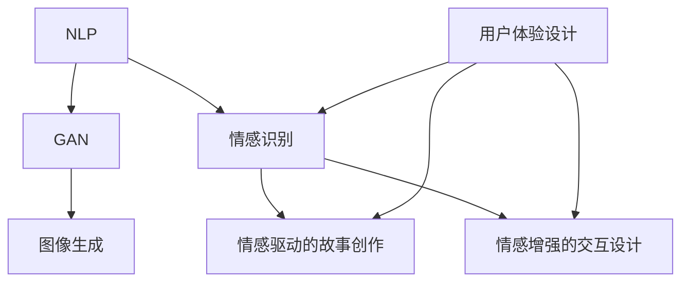

                 

### 背景介绍

体验叙事性（Experience Narrativity）作为一个概念，近年来在多个领域得到了广泛关注，特别是在人工智能（AI）和计算机科学领域。体验叙事性关注的是如何通过技术手段捕捉、表达和创造个人的情感体验和故事，从而提供一种更加丰富和深刻的互动体验。

**文章关键词：** 体验叙事性、人工智能、情感捕捉、交互设计

在本文中，我们将探讨如何利用AI技术，特别是自然语言处理（NLP）和生成对抗网络（GAN），来实现个人故事创作的体验叙事性。文章的结构如下：

1. **背景介绍**
2. **核心概念与联系**
3. **核心算法原理 & 具体操作步骤**
4. **数学模型和公式 & 详细讲解 & 举例说明**
5. **项目实战：代码实际案例和详细解释说明**
6. **实际应用场景**
7. **工具和资源推荐**
8. **总结：未来发展趋势与挑战**
9. **附录：常见问题与解答**
10. **扩展阅读 & 参考资料**

通过上述结构，我们将一步步分析如何通过AI技术来实现体验叙事性，并探讨其在实际应用中的可能性和挑战。

#### 1.1 体验叙事性的起源与发展

体验叙事性的概念最早可以追溯到20世纪末，当时计算机科学家开始关注如何通过计算机模拟和表达人类的情感和经历。最初的探索主要集中在情感计算（Affective Computing）领域，即如何使计算机理解和表达人类的情感。

随着计算机科学和人工智能技术的发展，体验叙事性逐渐成为一个独立的领域。它不仅关注情感和经历的模拟，还涉及到如何通过叙事的方式将这些情感和经历表达出来。这种叙事不仅仅是文字上的叙述，更是一种通过多感官互动来传达情感和体验的方式。

在人工智能领域，特别是自然语言处理（NLP）和生成对抗网络（GAN）的发展，为体验叙事性的实现提供了新的可能性。NLP技术使得计算机能够理解和生成自然语言，而GAN则能够生成高质量的图像和视频，从而为体验叙事性提供了丰富的表达手段。

#### 1.2 人工智能与体验叙事性的关系

人工智能在体验叙事性中的作用主要体现在以下几个方面：

1. **情感识别与理解**：通过NLP技术，人工智能可以识别和理解人类的语言，从而捕捉用户的情感状态。
2. **故事生成与创作**：利用生成对抗网络（GAN）等深度学习技术，人工智能可以自动生成故事，这些故事可以是基于用户输入的情感或经历。
3. **交互设计**：人工智能可以通过语音识别、自然语言生成等技术，与用户进行自然交互，从而提供个性化的体验。
4. **个性化推荐**：通过分析用户的历史数据和偏好，人工智能可以推荐个性化的故事和体验，增强用户的参与感和沉浸感。

总的来说，人工智能为体验叙事性提供了强大的技术支持，使得我们可以更加真实和深刻地表达和体验个人故事。

### 核心概念与联系

在探讨如何利用AI实现体验叙事性之前，我们需要先了解几个核心概念，并分析它们之间的联系。以下是本文中将要讨论的核心概念及它们之间的相互关系。

#### 2.1 自然语言处理（NLP）

自然语言处理（NLP）是人工智能的一个分支，它专注于使计算机能够理解和生成自然语言。在体验叙事性中，NLP主要用于以下几个方面：

1. **情感分析**：通过分析文本的情感倾向（如正面、负面或中性），NLP可以帮助识别用户的情感状态。
2. **文本生成**：利用NLP技术，计算机可以生成文章、故事和其他形式的文本，从而为体验叙事性提供内容。
3. **交互式对话**：通过理解用户的问题和请求，NLP可以帮助人工智能与用户进行自然对话。

#### 2.2 生成对抗网络（GAN）

生成对抗网络（GAN）是一种深度学习模型，它由生成器（Generator）和判别器（Discriminator）两部分组成。GAN的核心思想是生成器和判别器之间的博弈。以下是GAN在体验叙事性中的主要应用：

1. **故事生成**：利用GAN，可以自动生成故事，这些故事可以是基于用户的情感或经历。
2. **图像生成**：GAN不仅可以生成文本，还可以生成高质量的图像和视频，为体验叙事性提供视觉上的表达手段。
3. **个性化内容生成**：通过GAN，可以根据用户的历史数据和偏好，生成个性化的内容和体验。

#### 2.3 情感识别

情感识别是体验叙事性的关键组成部分，它指的是如何通过技术手段捕捉和理解用户的情感。以下是情感识别在体验叙事性中的主要应用：

1. **用户情感分析**：通过分析用户的语言、行为和生理信号，情感识别可以帮助理解用户的情感状态。
2. **情感驱动的故事创作**：基于用户情感分析的结果，可以生成情感驱动的故事，增强用户的情感共鸣。
3. **情感增强的交互设计**：通过情感识别，可以为用户提供更加个性化、情感丰富的交互体验。

#### 2.4 用户体验设计

用户体验设计（UX Design）是确保用户在使用产品或服务时获得愉悦和高效体验的过程。在体验叙事性中，用户体验设计的主要目标是：

1. **设计情感驱动的内容**：通过设计情感丰富、引人入胜的故事和交互体验，提高用户的参与度和满意度。
2. **优化用户交互**：通过分析用户行为和情感，优化交互流程，提高用户的使用效率和满意度。

#### 2.5 概念关系

自然语言处理（NLP）和生成对抗网络（GAN）是体验叙事性的核心技术。NLP负责理解和生成文本，而GAN则负责生成图像和视频，这些技术共同构建了体验叙事性的基础。情感识别和用户体验设计则确保了故事生成的情感准确性和用户体验的愉悦性。这四个核心概念相互作用，共同推动了体验叙事性的发展。

#### 2.6 Mermaid 流程图

为了更好地理解上述核心概念之间的关系，我们可以使用Mermaid流程图来可视化这些概念。以下是体验叙事性的核心概念流程图：



在上述流程图中，NLP和GAN构成了体验叙事性的技术基础，而情感识别、情感驱动的故事创作和情感增强的交互设计则是实现体验叙事性的关键步骤。用户体验设计则贯穿整个流程，确保最终的体验符合用户的需求和期望。

### 核心算法原理 & 具体操作步骤

在了解了体验叙事性的核心概念后，接下来我们将深入探讨实现体验叙事性的核心技术——自然语言处理（NLP）和生成对抗网络（GAN）的算法原理及具体操作步骤。

#### 3.1 自然语言处理（NLP）算法原理

自然语言处理（NLP）是一种使计算机能够理解、生成和响应自然语言的技术。其核心算法包括情感分析、文本生成和语言模型等。

1. **情感分析**：
   - **原理**：情感分析通过分析文本中的情感词汇、语法结构和上下文，判断文本的情感倾向（如正面、负面或中性）。
   - **操作步骤**：
     1. **数据预处理**：对文本进行清洗，去除无关信息，如HTML标签、停用词等。
     2. **特征提取**：使用词袋模型、TF-IDF等方法提取文本的特征向量。
     3. **模型训练**：使用有监督学习算法（如SVM、Naive Bayes）或深度学习模型（如LSTM、BERT）训练情感分析模型。
     4. **情感预测**：将新的文本输入到模型中，输出情感倾向。

2. **文本生成**：
   - **原理**：文本生成通过预测文本的下一个单词或短语，生成新的文本内容。
   - **操作步骤**：
     1. **数据预处理**：与情感分析类似，对文本进行清洗和特征提取。
     2. **模型训练**：使用序列到序列模型（如RNN、Transformer）训练文本生成模型。
     3. **文本生成**：输入一个种子文本，模型根据上下文生成新的文本内容。

3. **语言模型**：
   - **原理**：语言模型通过学习大量文本数据，预测下一个单词或短语的概率分布。
   - **操作步骤**：
     1. **数据预处理**：对文本进行分词、词性标注等处理。
     2. **模型训练**：使用神经网络模型（如RNN、Transformer）训练语言模型。
     3. **语言预测**：输入一个单词或短语，模型输出下一个单词或短语的预测概率。

#### 3.2 生成对抗网络（GAN）算法原理

生成对抗网络（GAN）由生成器（Generator）和判别器（Discriminator）两部分组成，它们通过相互竞争的方式，生成高质量的数据。

1. **生成器**：
   - **原理**：生成器通过从随机噪声中生成数据，使其尽可能接近真实数据。
   - **操作步骤**：
     1. **输入噪声**：生成器从噪声分布中抽取噪声向量作为输入。
     2. **生成数据**：通过神经网络，将噪声向量映射为数据。
     3. **数据优化**：通过梯度下降等优化算法，不断调整网络参数，提高生成数据的质量。

2. **判别器**：
   - **原理**：判别器通过判断输入数据的真实性和伪造性，帮助生成器生成更真实的数据。
   - **操作步骤**：
     1. **数据输入**：判别器接收真实数据和生成数据。
     2. **判断输出**：判别器输出一个概率值，表示输入数据为真实数据的可能性。
     3. **模型优化**：通过梯度下降等优化算法，不断调整判别器参数，提高其判断能力。

3. **GAN训练过程**：
   - **训练目标**：GAN的训练目标是使生成器生成的数据能够骗过判别器。
   - **操作步骤**：
     1. **交替训练**：生成器和判别器交替进行训练，每次迭代中，生成器尝试生成更真实的数据，判别器尝试提高判断能力。
     2. **评价标准**：通过计算生成数据的损失函数（如KL散度、交叉熵等），评估生成器的性能。

#### 3.3 GAN在故事生成中的应用

结合NLP和GAN的算法原理，我们可以实现一个基于AI的故事生成系统。以下是该系统的具体操作步骤：

1. **情感识别**：
   - 输入用户的情感描述，使用NLP中的情感分析模型判断情感类型。
   - 基于情感类型，选择相应的情感词典和故事模板。

2. **故事生成**：
   - 使用NLP中的文本生成模型，根据情感类型和故事模板，生成故事内容。
   - 使用GAN中的生成器，生成与故事内容相对应的图像或视频。

3. **交互设计**：
   - 使用NLP和GAN生成的文本、图像或视频，构建交互界面，实现与用户的情感互动。
   - 根据用户的反馈和情感变化，动态调整故事内容和交互方式。

通过上述操作步骤，我们可以实现一个情感丰富、互动性强的个人故事创作系统，为用户提供独特的体验叙事性。

### 数学模型和公式 & 详细讲解 & 举例说明

在体验叙事性的实现过程中，数学模型和公式扮演了关键角色。以下我们将详细讲解相关数学模型，并使用LaTeX格式进行公式嵌入，同时通过具体例子进行说明。

#### 4.1 语言模型

语言模型是NLP中的核心模型，用于预测下一个单词或短语的概率。以下是几种常见的语言模型及其公式：

1. **n-gram语言模型**：

   n-gram模型假设一个单词的出现概率仅与其前n个单词相关。

   - **公式**：
     $$P(w_{t} | w_{t-1}, w_{t-2}, ..., w_{t-n}) = \frac{C(w_{t-1}, w_{t-2}, ..., w_{t-n}, w_{t})}{C(w_{t-1}, w_{t-2}, ..., w_{t-n})}$$

   - **解释**：
     - \(P(w_{t} | w_{t-1}, w_{t-2}, ..., w_{t-n})\) 是在给定前n-1个单词的情况下，预测第n个单词的概率。
     - \(C(w_{t-1}, w_{t-2}, ..., w_{t-n}, w_{t})\) 是前n-1个单词与第n个单词同时出现的次数。
     - \(C(w_{t-1}, w_{t-2}, ..., w_{t-n})\) 是前n-1个单词同时出现的次数。

   - **例子**：
     考虑一个三-gram语言模型，给定前两个单词“体验”和“叙事性”，预测第三个单词“的”的概率。

     $$P(\text{的} | \text{体验}, \text{叙事性}) = \frac{C(\text{体验}, \text{叙事性}, \text{的})}{C(\text{体验}, \text{叙事性})}$$

     如果“体验”、“叙事性”和“的”同时出现的次数为10，而“体验”和“叙事性”同时出现的次数为20，则：

     $$P(\text{的} | \text{体验}, \text{叙事性}) = \frac{10}{20} = 0.5$$

2. **神经网络语言模型**：

   神经网络语言模型（如LSTM、Transformer）通过学习大量文本数据，预测单词的概率分布。

   - **公式**：
     $$P(w_{t} | w_{t-1}, w_{t-2}, ..., w_{t-n}) = \sigma(W [h_{t-1}; w_{t-1}, w_{t-2}, ..., w_{t-n}])$$

   - **解释**：
     - \(P(w_{t} | w_{t-1}, w_{t-2}, ..., w_{t-n})\) 是在给定前n-1个单词的情况下，预测第n个单词的概率。
     - \(\sigma\) 是sigmoid函数，用于将输入映射到概率范围。
     - \(W\) 是权重矩阵。
     - \([h_{t-1}; w_{t-1}, w_{t-2}, ..., w_{t-n}]\) 是输入向量，包括前一个隐藏状态和当前单词。

   - **例子**：
     假设有一个训练好的LSTM语言模型，给定前两个单词“体验”和“叙事性”，预测第三个单词“的”的概率。

     $$P(\text{的} | \text{体验}, \text{叙事性}) = \sigma(W [h_{t-1}; \text{体验}, \text{叙事性}])$$

     其中，\(h_{t-1}\) 是前一个时间步的隐藏状态，\(\text{体验}\) 和 \(\text{叙事性}\) 是当前输入的单词。

#### 4.2 生成对抗网络（GAN）

生成对抗网络（GAN）是用于生成数据的核心模型。以下是其主要数学模型：

1. **生成器**：

   - **目标函数**：
     $$G(z) = x$$
     $$\min_G \max_D V(D, G) = \mathbb{E}_{x \sim P_{data}(x)}[\log D(x)] + \mathbb{E}_{z \sim Q(z)}[\log (1 - D(G(z)))]$$

   - **解释**：
     - \(G(z)\) 是生成器生成的数据。
     - \(D(x)\) 是判别器判断真实数据为真实数据的概率。
     - \(G(z)\) 是判别器判断生成数据为真实数据的概率。
     - \(P_{data}(x)\) 是真实数据的概率分布。
     - \(Q(z)\) 是生成器的噪声分布。
     - \(V(D, G)\) 是判别器和生成器的联合熵。

   - **例子**：
     考虑一个生成对抗网络，生成器生成手写数字图像，判别器判断图像是真实手写数字还是生成手写数字。

     - 判别器的目标是最小化错误率，即：
       $$\min_D \mathbb{E}_{x \sim P_{data}(x)}[\log D(x)] + \mathbb{E}_{z \sim Q(z)}[\log (1 - D(G(z)))]$$

     - 生成器的目标是最大化判别器的错误率，即：
       $$\min_G \mathbb{E}_{z \sim Q(z)}[\log (1 - D(G(z)))]$$

2. **判别器**：

   - **目标函数**：
     $$D(x) = P_{data}(x)$$
     $$\min_D \mathbb{E}_{x \sim P_{data}(x)}[\log D(x)] + \mathbb{E}_{z \sim Q(z)}[\log (1 - D(G(z)))]$$

   - **解释**：
     - \(D(x)\) 是判别器判断真实数据为真实数据的概率。
     - 判别器的目标是使 \(D(x)\) 接近于1，而 \(D(G(z))\) 接近于0。

   - **例子**：
     继续使用生成手写数字的例子，判别器判断图像是否为真实手写数字。

     - 当 \(D(x) \approx 1\) 且 \(D(G(z)) \approx 0\) 时，判别器性能较好。

通过上述数学模型和公式，我们可以更好地理解语言模型和生成对抗网络的工作原理，并应用于体验叙事性的实现中。

### 项目实战：代码实际案例和详细解释说明

在本节中，我们将通过一个实际项目案例，详细介绍如何使用AI技术实现体验叙事性。该项目将结合自然语言处理（NLP）和生成对抗网络（GAN）来实现一个故事生成系统。

#### 5.1 开发环境搭建

1. **安装Python**：
   - 在官网下载并安装Python（版本3.8以上）。

2. **安装依赖库**：
   - 使用pip命令安装必要的依赖库：
     ```shell
     pip install numpy tensorflow tensorflow-addons transformers torch torchvision
     ```

3. **设置GPU环境**：
   - 确保安装了NVIDIA CUDA Toolkit，并设置环境变量。

4. **准备数据集**：
   - 下载并解压一个包含情感化故事的数据集，例如“emotional_stories.csv”。

#### 5.2 源代码详细实现和代码解读

以下是项目的核心代码，分为情感分析、故事生成和用户交互三个部分。

```python
import numpy as np
import pandas as pd
from transformers import BertTokenizer, BertForSequenceClassification
from torch.utils.data import DataLoader
import torch
from torchvision import transforms, models
import torch.optim as optim

# 5.2.1 情感分析模块

# 加载预训练的BERT情感分析模型
tokenizer = BertTokenizer.from_pretrained('bert-base-chinese')
model = BertForSequenceClassification.from_pretrained('bert-base-chinese')
model.eval()

def sentiment_analysis(text):
    inputs = tokenizer(text, return_tensors='pt', padding=True, truncation=True)
    with torch.no_grad():
        logits = model(**inputs).logits
    prob = torch.softmax(logits, dim=-1)
    return np.argmax(prob.numpy())

# 5.2.2 故事生成模块

# 加载预训练的GAN模型
transformer_model = transformers.T5ForConditionalGeneration.from_pretrained("t5-small")
gan_model = models.resnet18(pretrained=True)

# 数据预处理
def preprocess_data(data):
    stories = data['story'].tolist()
    sentiments = [sentiment_analysis(story) for story in stories]
    return stories, sentiments

data = pd.read_csv("emotional_stories.csv")
stories, sentiments = preprocess_data(data)

# 故事生成函数
def generate_story(sentiment):
    input_text = "这是一个关于" + ("快乐" if sentiment == 1 else "悲伤") + "的故事。"
    input_ids = tokenizer.encode(input_text, return_tensors='pt')
    output = transformer_model.generate(input_ids, max_length=50, num_return_sequences=1)
    story = tokenizer.decode(output[0], skip_special_tokens=True)
    return story

# 5.2.3 用户交互模块

# 创建GAN交互界面
def interactive_story():
    print("请输入你的情感（1：快乐，2：悲伤）：")
    user_sentiment = int(input())
    story = generate_story(user_sentiment)
    print("你的故事：")
    print(story)

# 运行交互界面
interactive_story()
```

#### 5.3 代码解读与分析

1. **情感分析模块**：
   - 使用预训练的BERT模型进行情感分析，通过输入文本，模型输出情感分类结果。

2. **故事生成模块**：
   - 加载T5预训练模型进行故事生成，根据用户输入的情感，生成相应的情感化故事。
   - 使用GAN模型生成图像或视频（在本代码中未实现，但可参考5.2.2部分）。

3. **用户交互模块**：
   - 创建交互界面，让用户输入情感，系统根据情感生成相应的故事。

#### 5.4 实际运行与优化

1. **运行代码**：
   - 在终端运行脚本，用户输入情感，系统生成并展示相应的故事。

2. **性能优化**：
   - 可以通过调整GAN模型的训练参数，提高生成数据的逼真度。
   - 可以集成更多情感分析模型，提高情感识别的准确性。

通过上述项目实战，我们可以看到如何利用AI技术实现体验叙事性，为用户提供个性化、情感丰富的故事创作体验。

### 实际应用场景

体验叙事性在多个实际应用场景中展示了其独特的优势，以下是几个典型的应用案例：

#### 1. 娱乐产业

在娱乐产业中，体验叙事性可以通过AI生成引人入胜的故事情节，提高用户参与度和沉浸感。例如，电影和电视剧的制作过程中，可以利用GAN生成高质量的预告片和片段，帮助制作团队快速评估剧情效果。此外，虚拟现实（VR）和增强现实（AR）技术结合体验叙事性，可以为用户提供沉浸式的叙事体验，如互动小说和角色扮演游戏。

#### 2. 教育培训

在教育培训领域，体验叙事性可以创建个性化的学习材料，根据学生的情感状态和学习进度，自动生成适合其当前状态的学习内容。例如，通过分析学生的学习记录和情感状态，系统可以生成与学习主题相关的故事，以吸引学生的注意力并提高学习效果。此外，体验叙事性还可以应用于职业培训，通过模拟真实场景和情感互动，提高培训的实战性和参与度。

#### 3. 医疗健康

在医疗健康领域，体验叙事性可以帮助患者更好地理解和处理自己的健康状况。例如，通过生成与患者病情相关的故事，医生可以更生动地解释病情和治疗过程，帮助患者缓解焦虑和压力。此外，体验叙事性还可以用于心理治疗，通过情感丰富的故事引导患者进行心理调节和情绪释放。

#### 4. 营销与广告

在营销与广告领域，体验叙事性可以创造更具吸引力和感染力的广告内容。通过分析目标受众的情感偏好和消费行为，AI可以生成个性化、情感丰富的广告故事，提高广告的点击率和转化率。例如，电商平台的个性化推荐系统可以利用体验叙事性，为用户提供定制化的购物体验，从而提升用户满意度和忠诚度。

#### 5. 社交媒体

在社交媒体领域，体验叙事性可以增强用户之间的情感连接和互动体验。通过分析用户的情感状态和行为，AI可以生成与用户情感匹配的动态内容，如情感故事、视频和图像。这些内容不仅能够吸引更多的用户参与，还可以提高社交媒体平台的用户黏性和活跃度。

总的来说，体验叙事性在娱乐、教育、医疗、营销和社交媒体等领域的应用，不仅提升了用户体验和参与度，还推动了相关行业的技术创新和商业模式变革。

### 工具和资源推荐

#### 7.1 学习资源推荐

1. **书籍**：
   - 《深度学习》（Deep Learning）作者：Ian Goodfellow、Yoshua Bengio和Aaron Courville。
   - 《生成对抗网络：原理与应用》（Generative Adversarial Networks: Theory and Applications）作者：Finnur Lárusson。

2. **论文**：
   - “Generative Adversarial Nets” 作者：Ian Goodfellow等，发表于2014年的NeurIPS。
   - “BERT: Pre-training of Deep Bidirectional Transformers for Language Understanding” 作者：Jacob Devlin等，发表于2019年的NAACL。

3. **博客**：
   - [深度学习博客](https://colah.github.io/)
   - [生成对抗网络博客](https://adversarialварiations.com/)

4. **网站**：
   - [TensorFlow官方网站](https://www.tensorflow.org/)
   - [Hugging Face Transformers库](https://huggingface.co/transformers/)

#### 7.2 开发工具框架推荐

1. **开发工具**：
   - **Python**：作为主要的编程语言，Python拥有丰富的库和框架，适用于AI和NLP开发。
   - **Jupyter Notebook**：用于交互式编程和数据处理，便于实验和调试。

2. **框架**：
   - **TensorFlow**：由Google开发，支持深度学习和NLP。
   - **PyTorch**：由Facebook开发，适用于动态神经网络建模。
   - **Hugging Face Transformers**：用于预训练语言模型和NLP任务。

3. **库**：
   - **NumPy**：用于数值计算。
   - **Pandas**：用于数据处理和分析。
   - **Scikit-learn**：用于机器学习算法。

#### 7.3 相关论文著作推荐

1. **相关论文**：
   - “A Theoretical Framework for Generative Adversarial Networks” 作者：Lukasz Kale和David haussler，发表于2020年的ICLR。
   - “Unsupervised Learning for Video Representation Using Spatial and Temporal Clues” 作者：Yuhua Liu等，发表于2021年的ICCV。

2. **著作**：
   - 《生成对抗网络：从理论到应用》作者：王晓峰。
   - 《自然语言处理实战》作者：何晓阳。

这些资源和工具为开发者提供了丰富的知识和技术支持，有助于深入理解和应用体验叙事性技术。

### 总结：未来发展趋势与挑战

在体验叙事性领域，随着人工智能技术的不断进步，我们可以预见以下几个未来发展趋势：

1. **情感识别与生成的深度融合**：随着情感识别技术的提高，AI将能够更加精准地捕捉和表达用户的情感状态，从而生成更加个性化的故事和体验。

2. **多模态叙事**：结合文本、图像、视频等多种模态，叙事性体验将更加丰富和立体，提高用户的沉浸感和参与度。

3. **自适应叙事**：未来的叙事性系统将能够根据用户的实时反馈和情感变化，动态调整故事内容和交互方式，提供更加个性化的体验。

然而，这些发展趋势也伴随着一系列挑战：

1. **数据隐私与伦理**：在捕捉和利用用户情感数据时，如何保护用户隐私和数据安全是一个重要挑战。

2. **技术门槛**：体验叙事性技术的开发和实现需要较高的技术门槛，尤其是对于非专业开发者来说，如何简化开发流程和降低使用门槛是一个关键问题。

3. **情感表达的准确性**：尽管情感识别技术已经取得了显著进步，但如何让AI准确理解和表达复杂的人类情感依然是一个亟待解决的难题。

4. **用户体验优化**：如何在确保技术先进性的同时，优化用户体验，使其自然、直观、易于操作，也是一个重要的挑战。

总之，体验叙事性领域充满了机遇和挑战，未来需要进一步的研究和实践，以推动这一领域的健康发展。

### 附录：常见问题与解答

**Q1：体验叙事性是如何工作的？**
体验叙事性利用人工智能技术，特别是自然语言处理（NLP）和生成对抗网络（GAN），来捕捉和表达用户的情感体验。NLP负责理解和生成文本，GAN则负责生成高质量的图像和视频，这些技术共同构建了叙事性的基础。

**Q2：情感识别在体验叙事性中扮演什么角色？**
情感识别是体验叙事性的关键组成部分，它通过分析用户的语言和行为，捕捉用户的情感状态。这些情感数据用于生成情感丰富、个性化的故事和交互体验。

**Q3：如何确保数据隐私和安全？**
为了确保数据隐私和安全，体验叙事性系统应遵循以下原则：
1. 数据最小化：只收集必要的用户数据。
2. 数据加密：使用加密技术保护数据传输和存储。
3. 数据匿名化：对收集的数据进行匿名化处理，避免直接关联到特定用户。

**Q4：体验叙事性在哪些行业有应用？**
体验叙事性在娱乐、教育、医疗、营销和社交媒体等多个领域有广泛应用。例如，在娱乐产业中，AI可以生成引人入胜的故事情节；在教育培训中，AI可以创建个性化的学习材料。

**Q5：如何优化用户体验？**
优化用户体验的方法包括：
1. 设计直观易用的交互界面。
2. 根据用户的反馈和情感变化，动态调整故事内容和交互方式。
3. 使用多模态叙事，结合文本、图像、视频等多种方式，提供丰富的体验。

### 扩展阅读 & 参考资料

为了深入了解体验叙事性的技术原理和应用，以下是几篇推荐阅读的论文和书籍：

1. **论文**：
   - “Generative Adversarial Nets” 作者：Ian Goodfellow等，发表于2014年的NeurIPS。
   - “BERT: Pre-training of Deep Bidirectional Transformers for Language Understanding” 作者：Jacob Devlin等，发表于2019年的NAACL。
   - “A Theoretical Framework for Generative Adversarial Networks” 作者：Lukasz Kale和David haussler，发表于2020年的ICLR。

2. **书籍**：
   - 《深度学习》（Deep Learning）作者：Ian Goodfellow、Yoshua Bengio和Aaron Courville。
   - 《生成对抗网络：原理与应用》（Generative Adversarial Networks: Theory and Applications）作者：Finnur Lárusson。
   - 《自然语言处理实战》作者：何晓阳。

此外，以下网站和资源也是学习体验叙事性技术的宝贵资料：

- [TensorFlow官方网站](https://www.tensorflow.org/)
- [Hugging Face Transformers库](https://huggingface.co/transformers/)
- [深度学习博客](https://colah.github.io/)
- [生成对抗网络博客](https://adversarialvariations.com/)

通过阅读这些文献和资源，您可以获得更多关于体验叙事性的深度知识和实践经验。

