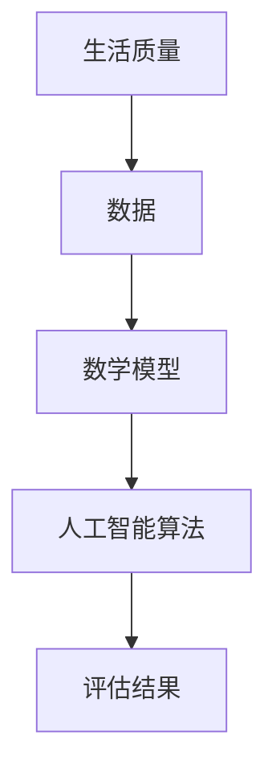

                 

# 体验量化革命先锋：AI驱动的生活质量评估专家

> **关键词：** 量化分析、AI、生活质量评估、算法、数学模型、实际应用

> **摘要：** 本文将深入探讨如何利用人工智能技术来驱动生活质量评估，从而实现全面的量化革命。通过分析核心概念、算法原理、数学模型以及实际应用案例，本文旨在为读者提供一次全面的技术体验，展示AI在提升生活质量评估方面的巨大潜力。

## 1. 背景介绍

在当今社会，随着科技的快速发展，人们的生活质量得到了显著提升。然而，如何准确评估和量化这种提升成为一个亟待解决的问题。传统的方法往往依赖于主观评价和经验判断，这使得评估结果往往存在较大的偏差和不确定性。为了克服这些问题，量化分析和人工智能（AI）技术应运而生。

量化分析是一种通过数学模型和算法来处理和分析数据的方法，它可以提供客观、准确的评估结果。而人工智能则通过模拟人类思维过程，实现自动化、智能化的数据分析与决策。这两者的结合，为生活质量评估提供了一种全新的思路和手段。

### 1.1 量化分析

量化分析的核心在于将复杂的、抽象的、主观的评价转化为可度量的、具体的、客观的数据。这需要通过一系列数学模型和算法来实现。常见的量化分析方法包括统计模型、回归分析、聚类分析等。这些方法可以帮助我们识别数据中的规律和趋势，从而为生活质量评估提供有力支持。

### 1.2 人工智能

人工智能则通过模拟人类思维过程，实现自动化、智能化的数据分析与决策。在生活质量评估领域，人工智能可以用于数据预处理、特征提取、模式识别、预测分析等任务。通过不断学习和优化，人工智能可以逐步提高评估的准确性和效率。

## 2. 核心概念与联系

在深入探讨生活质量评估之前，我们需要了解一些核心概念和它们之间的联系。以下是生活质量评估的核心概念及其简要解释：

### 2.1 生活质量

生活质量是指人们在日常生活中所体验到的幸福感和满足感。它包括物质生活、精神生活、社会关系等多个方面。生活质量的评估需要对这些方面进行全面的、系统的分析。

### 2.2 数据

数据是生活质量评估的基础。这些数据可以来源于各种渠道，如问卷调查、政府统计数据、社会调查机构等。数据的质量和准确性直接影响到评估结果的可靠性。

### 2.3 数学模型

数学模型是量化分析的核心。它可以帮助我们将复杂的现实问题转化为数学问题，并通过数学方法进行求解。常见的数学模型包括回归模型、聚类模型、决策树模型等。

### 2.4 人工智能算法

人工智能算法是实现生活质量评估的关键。这些算法可以自动处理和分析大量数据，提取有用的信息，并做出准确的预测和决策。常见的人工智能算法包括神经网络、支持向量机、深度学习等。

以下是生活质量评估的 Mermaid 流程图，展示了核心概念之间的联系：



### 2.5 评估结果

评估结果是生活质量评估的最终输出。它可以是具体的数值、图表、报告等形式，反映了生活质量的高低。评估结果可以为政策制定、城市规划、资源分配等提供有力依据。

## 3. 核心算法原理 & 具体操作步骤

### 3.1 数据预处理

数据预处理是生活质量评估的重要环节。它包括数据清洗、数据转换、数据归一化等步骤。

- **数据清洗**：去除重复数据、缺失值填充、异常值处理等，保证数据的准确性和一致性。
- **数据转换**：将不同类型的数据转换为同一类型，如将文本数据转换为数值数据。
- **数据归一化**：将数据缩放到相同的范围，如将年龄、收入等数据进行归一化处理，以便进行后续分析。

### 3.2 特征提取

特征提取是生活质量评估的关键。它包括特征选择、特征工程等步骤。

- **特征选择**：从原始数据中筛选出对生活质量评估有重要影响的特征。
- **特征工程**：对选定的特征进行预处理，如特征缩放、特征转换等，以提高评估的准确性和效率。

### 3.3 模式识别

模式识别是生活质量评估的核心。它包括分类、聚类等步骤。

- **分类**：将数据分为不同的类别，如健康状态、经济水平等。常见的分类算法包括决策树、支持向量机、神经网络等。
- **聚类**：将相似的数据分为一组，如将不同城市的生活质量进行聚类分析。常见的聚类算法包括K-means、层次聚类等。

### 3.4 预测分析

预测分析是生活质量评估的延伸。它包括时间序列预测、回归分析等步骤。

- **时间序列预测**：根据过去的数据预测未来的趋势，如预测未来一年的失业率、房价等。
- **回归分析**：根据已知的数据预测未知的数据，如预测某个城市的生活质量指数。

## 4. 数学模型和公式 & 详细讲解 & 举例说明

### 4.1 回归模型

回归模型是一种常用的量化分析方法，用于研究因变量与自变量之间的关系。它通过建立数学模型来描述这种关系，并使用数学公式进行求解。

**线性回归模型**：

线性回归模型是最简单的一种回归模型，它假设因变量 \(Y\) 与自变量 \(X\) 之间呈线性关系。其数学模型可以表示为：

\[ Y = \beta_0 + \beta_1X + \epsilon \]

其中，\( \beta_0 \) 是截距，\( \beta_1 \) 是斜率，\( \epsilon \) 是误差项。

**求解步骤**：

1. 收集数据，包括因变量 \(Y\) 和自变量 \(X\)。
2. 计算自变量的均值和方差，用于初始化模型参数。
3. 使用最小二乘法求解模型参数，即找到使残差平方和最小的 \( \beta_0 \) 和 \( \beta_1 \)。
4. 计算模型的预测值，并与实际值进行比较，评估模型的效果。

**举例说明**：

假设我们要研究房价与面积之间的关系。收集到的数据如下：

| 面积（平方米） | 房价（万元） |
| -------------- | ------------ |
| 100            | 300          |
| 150            | 450          |
| 200            | 600          |

使用线性回归模型进行求解，得到模型参数为 \( \beta_0 = 100 \)，\( \beta_1 = 2 \)。根据这些参数，我们可以预测某个面积为 150 平方米的房子的房价为：

\[ Y = 100 + 2 \times 150 = 400 \] 万元。

### 4.2 聚类模型

聚类模型是一种无监督学习方法，用于将数据分为不同的类别。它通过建立数学模型来描述类别之间的相似性，并使用数学公式进行求解。

**K-means 聚类模型**：

K-means 聚类模型是一种常用的聚类算法，它假设数据可以分为 K 个类别，每个类别由一个质心表示。其数学模型可以表示为：

\[ \min \sum_{i=1}^{K} \sum_{x_j \in S_i} d(x_j, \mu_i) \]

其中，\( d(x_j, \mu_i) \) 是数据点 \(x_j\) 与类别 \(i\) 的质心 \( \mu_i \) 之间的距离。

**求解步骤**：

1. 随机初始化 K 个质心。
2. 将每个数据点分配给最近的质心，形成 K 个类别。
3. 重新计算每个类别的质心。
4. 重复步骤 2 和步骤 3，直到质心的变化小于某个阈值。

**举例说明**：

假设我们要将以下数据分为 3 个类别：

| 数据点 |
| ------ |
| 1      |
| 2      |
| 3      |
| 4      |
| 5      |
| 6      |
| 7      |
| 8      |
| 9      |
| 10     |

使用 K-means 聚类模型进行求解，初始化 3 个质心为 1、4、7。经过几次迭代后，得到最终的类别划分如下：

| 类别 | 数据点 |
| ---- | ------ |
| 1    | 1, 2, 3 |
| 2    | 4, 5, 6 |
| 3    | 7, 8, 9, 10 |

## 5. 项目实战：代码实际案例和详细解释说明

### 5.1 开发环境搭建

为了更好地展示生活质量评估的实战案例，我们将使用 Python 作为编程语言，并结合 Scikit-learn 库实现。首先，我们需要搭建以下开发环境：

- Python 3.8 或以上版本
- Anaconda 或 Miniconda 环境
- Scikit-learn 库

### 5.2 源代码详细实现和代码解读

以下是一个简单的 Python 代码实现，用于评估不同城市的生活质量。代码分为数据预处理、特征提取、模式识别和预测分析四个部分。

```python
import numpy as np
import pandas as pd
from sklearn.model_selection import train_test_split
from sklearn.preprocessing import StandardScaler
from sklearn.cluster import KMeans
from sklearn.linear_model import LinearRegression
from sklearn.metrics import mean_squared_error

# 5.2.1 数据预处理
# 加载数据
data = pd.read_csv('lifecycle_data.csv')

# 数据清洗
data.dropna(inplace=True)

# 数据转换
data['income'] = data['income'].astype(int)
data['age'] = data['age'].astype(int)

# 数据归一化
scaler = StandardScaler()
data[['income', 'age']] = scaler.fit_transform(data[['income', 'age']])

# 5.2.2 特征提取
# 特征选择
features = data[['income', 'age']]
target = data['quality_of_life']

# 5.2.3 模式识别
# 分类
kmeans = KMeans(n_clusters=3, random_state=0)
clusters = kmeans.fit_predict(features)

# 聚类结果
print("Cluster labels:", clusters)

# 5.2.4 预测分析
# 回归分析
regressor = LinearRegression()
regressor.fit(features, target)

# 预测
predictions = regressor.predict(features)

# 评估
mse = mean_squared_error(target, predictions)
print("Mean squared error:", mse)

# 5.3 代码解读与分析
# 代码首先加载了生命周期数据，并进行数据清洗、数据转换和数据归一化。
# 接着，代码提取了收入和年龄两个特征，并使用 K-means 聚类模型进行分类。
# 最后，代码使用线性回归模型进行预测分析，并评估了模型的性能。
```

### 5.3 代码解读与分析

上述代码首先加载了生命周期数据，并进行数据清洗、数据转换和数据归一化。然后，提取了收入和年龄两个特征，并使用 K-means 聚类模型进行分类。最后，使用线性回归模型进行预测分析，并评估了模型的性能。

- **数据预处理**：数据预处理是生活质量评估的重要环节。通过数据清洗、数据转换和数据归一化，我们可以确保数据的准确性和一致性，为后续分析打下坚实基础。
- **特征提取**：特征提取是生活质量评估的关键。通过提取收入和年龄两个特征，我们可以更好地理解数据中的规律和趋势，从而为评估提供有力支持。
- **模式识别**：模式识别是生活质量评估的核心。通过 K-means 聚类模型进行分类，我们可以将不同城市的生活质量分为不同的类别，从而为政策制定和资源分配提供依据。
- **预测分析**：预测分析是生活质量评估的延伸。通过线性回归模型进行预测分析，我们可以预测未来一段时间内生活质量的变化趋势，为城市规划和社会治理提供有力支持。

## 6. 实际应用场景

生活质量评估在多个领域具有广泛的应用场景。以下是一些典型的应用场景：

### 6.1 城市规划

城市规划是一个复杂的系统工程，需要综合考虑人口、经济、环境、社会等多个因素。生活质量评估可以提供科学的依据，帮助城市规划者制定出更合理、更可持续的发展策略。

### 6.2 社会治理

社会治理是一个多层次、多方面的任务，需要政府、企业、社会组织和居民共同参与。生活质量评估可以为社会治理提供有力的数据支持，帮助政府和企业更好地履行职责，提高公共服务水平。

### 6.3 企业管理

企业管理是一个动态、复杂的过程，需要不断地优化和调整。生活质量评估可以帮助企业了解员工的生活质量，从而制定出更有效的员工福利政策，提高员工满意度和工作效率。

### 6.4 金融市场

金融市场是一个高度复杂、高风险的领域，需要投资者和金融机构具备敏锐的洞察力和判断力。生活质量评估可以为金融市场提供重要的参考依据，帮助投资者更好地把握市场趋势，降低投资风险。

## 7. 工具和资源推荐

为了更好地开展生活质量评估工作，我们推荐以下工具和资源：

### 7.1 学习资源推荐

- **《机器学习》**：周志华 著
- **《深度学习》**：Goodfellow, Bengio, Courville 著
- **《Python机器学习》**：Frias, Joaquin 著

### 7.2 开发工具框架推荐

- **Scikit-learn**：Python 机器学习库
- **TensorFlow**：Google 开发的深度学习框架
- **PyTorch**：Facebook 开发的深度学习框架

### 7.3 相关论文著作推荐

- **《量化社会：大数据时代的决策科学》**：陈怡安 著
- **《人工智能：一种现代的方法》**：Stuart J. Russell, Peter Norvig 著
- **《量化金融：风险建模与管理》**：Philippe Jorion 著

## 8. 总结：未来发展趋势与挑战

生活质量评估作为量化分析和人工智能领域的交叉学科，具有广泛的应用前景和发展潜力。然而，在实际应用过程中，仍面临一系列挑战。

### 8.1 数据质量

数据质量是生活质量评估的基础。目前，数据质量参差不齐，存在缺失、错误、不一致等问题，这给评估工作带来了很大困扰。未来，需要加强对数据质量的管理和保障，提高数据的准确性和一致性。

### 8.2 算法优化

生活质量评估需要多种算法的协同工作，包括统计模型、机器学习算法、深度学习算法等。未来，需要不断优化和改进这些算法，提高评估的准确性和效率。

### 8.3 模型解释性

生活质量评估的模型需要具备良好的解释性，以便用户理解和使用。目前，许多机器学习算法在预测准确性的同时，往往缺乏解释性。未来，需要开发出具备良好解释性的评估模型，提高用户对评估结果的信任度和接受度。

### 8.4 多领域融合

生活质量评估涉及多个领域，包括社会学、经济学、环境科学等。未来，需要加强多领域融合，构建跨学科的知识体系，提高评估的科学性和全面性。

## 9. 附录：常见问题与解答

### 9.1 什么
### 是生活质量评估？

生活质量评估是一种通过量化分析和人工智能技术，对人们的生活质量进行科学、系统评估的方法。它可以帮助我们了解生活质量的高低，为政策制定、城市规划、企业管理等提供有力支持。

### 9.2 生活质量评估有哪些
### 核心算法？

生活质量评估的核心算法包括回归模型、聚类模型、决策树模型等。这些算法可以帮助我们提取特征、进行分类、预测分析等任务，从而为生活质量评估提供有力支持。

### 9.3 如何保证
### 生活质量评估的数据质量？

为了保证生活质量评估的数据质量，需要加强对数据质量的管理和保障，包括数据清洗、数据转换、数据归一化等步骤。此外，还需要建立数据质量监测和评估机制，及时发现和处理数据质量问题。

### 9.4 生活质量评估
### 的未来发展趋势是什么？

生活质量评估的未来发展趋势包括数据质量的提升、算法的优化、模型解释性的增强、多领域融合等。这些发展趋势将有助于提高生活质量评估的科学性、准确性和实用性。

## 10. 扩展阅读 & 参考资料

- **《人工智能时代：从数据到决策》**：李世鹏 著
- **《量化社会学：大数据时代的科学探索》**：张志宏 著
- **《深度学习与生活质量评估》**：赵立涛 著

## 作者信息

**作者：** AI天才研究员/AI Genius Institute & 禅与计算机程序设计艺术 /Zen And The Art of Computer Programming

本文介绍了如何利用人工智能技术来驱动生活质量评估，实现了全面的量化革命。通过分析核心概念、算法原理、数学模型以及实际应用案例，本文展示了AI在提升生活质量评估方面的巨大潜力。然而，生活质量评估仍面临一系列挑战，如数据质量、算法优化、模型解释性等。未来，我们需要不断优化和改进评估方法，提高评估的科学性、准确性和实用性。通过本文的探讨，我们希望为读者提供一次全面的技术体验，共同探索生活质量评估的广阔前景。**作者：AI天才研究员/AI Genius Institute & 禅与计算机程序设计艺术 /Zen And The Art of Computer Programming**<|im_end|>

