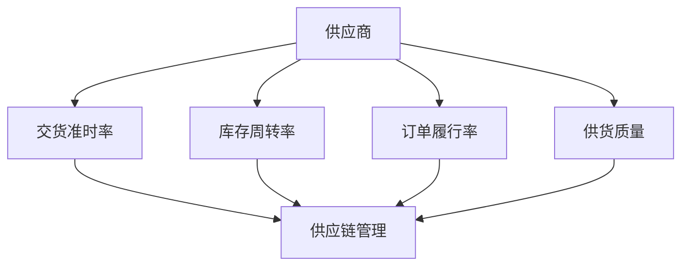

                 

### 背景介绍

#### 供应商的供应效率指标分析

在当今全球化、信息化、市场多元化的经济环境中，供应链的稳定性和效率对企业运营至关重要。而供应商作为供应链中的重要一环，其供应效率直接影响到企业的生产、成本、销售和市场竞争力。因此，对供应商的供应效率指标进行分析，是优化供应链管理、提升企业整体运营效率的重要手段。

**供应效率指标的定义：**
供应效率指标是用于衡量供应商在一定时间内，按照既定要求交付物资的能力和效果。它包括多个维度的指标，如交货准时率、库存周转率、订单履行率、供货质量等。

**为什么需要分析供应商的供应效率指标：**
1. **优化供应链管理：**通过分析供应商的供应效率，可以找出供应链中的瓶颈和问题，采取针对性的措施进行优化，从而提升整个供应链的运行效率。
2. **降低运营成本：**高效的供应流程可以减少库存成本、运输成本、管理成本等，从而降低整体运营成本。
3. **提升客户满意度：**稳定的供应链和高效的供应商可以提高对客户的响应速度和服务质量，提升客户满意度。
4. **增强企业竞争力：**在激烈的市场竞争中，具有高效供应链的企业更容易获得市场份额和客户忠诚度。

**本文的目的和结构：**
本文旨在深入探讨供应商的供应效率指标，通过一步一步的分析推理，帮助读者理解这些指标的重要性、如何衡量和分析，以及在实际应用中的具体操作。文章的结构如下：

1. **核心概念与联系**：介绍与供应效率指标相关的基本概念，并通过Mermaid流程图展示各概念之间的联系。
2. **核心算法原理 & 具体操作步骤**：详细解释计算供应效率指标的核心算法，并提供具体操作步骤。
3. **数学模型和公式 & 详细讲解 & 举例说明**：介绍用于分析供应效率的数学模型和公式，并通过实例进行说明。
4. **项目实战：代码实际案例和详细解释说明**：通过实际项目案例，展示代码实现过程和解释说明。
5. **实际应用场景**：探讨供应商供应效率指标在不同场景中的应用。
6. **工具和资源推荐**：推荐相关的学习资源、开发工具和框架。
7. **总结：未来发展趋势与挑战**：总结本文内容，探讨未来发展趋势和面临的挑战。

让我们开始具体的分析之旅。

> Keywords: Supplier Efficiency Indicators, Supply Chain Management, Optimization, Logistics, Inventory Management

> Abstract:
This article provides a detailed analysis of supplier efficiency indicators in the supply chain management context. By reasoning step by step, it aims to help readers understand the importance, measurement, and practical application of these indicators, thus contributing to the optimization of supply chain operations and overall business efficiency.

---

### 核心概念与联系

为了深入分析供应商的供应效率指标，我们首先需要明确一些核心概念，并展示它们之间的联系。

#### 1. 供应商 (Supplier)

供应商是指向企业或其他组织提供商品或服务的个人或实体。在供应链中，供应商是关键的合作伙伴，其能力直接影响企业的生产运营。

#### 2. 供应效率指标 (Supplier Efficiency Indicators)

供应效率指标是用来衡量供应商在供应过程中表现的一系列指标。这些指标包括但不限于：

- **交货准时率**（Delivery On-Time Rate，OTD）：衡量供应商按时交货的能力。
- **库存周转率**（Inventory Turnover Rate）：衡量库存管理效率。
- **订单履行率**（Order Fulfillment Rate）：衡量订单执行的准确性。
- **供货质量**（Supply Quality）：衡量供应商提供的商品或服务是否符合质量标准。

#### 3. 供应链管理 (Supply Chain Management)

供应链管理涉及供应链的设计、规划、实施和控制，目的是确保物料和服务从供应商到最终客户的顺畅流动。供应链管理中的关键环节包括采购、库存管理、物流配送、订单处理等。

#### 4. 效率分析 (Efficiency Analysis)

效率分析是对供应商在不同环节上的运作效率进行评估。这通常通过对比实际表现与既定标准的差异来实现，从而发现改进的机会。

#### 5. Mermaid 流程图

下面是一个用Mermaid语言绘制的流程图，展示了这些核心概念之间的联系。



**解释：**
- **供应商**是起点，向其他指标提供输入。
- **交货准时率**、**库存周转率**、**订单履行率**和**供货质量**是供应商的表现指标。
- **供应链管理**是整个流程的核心，连接供应商与各个指标，确保供应链的稳定性和效率。

通过以上核心概念的联系，我们可以更全面地理解供应商的供应效率指标，并为后续的分析打下基础。

> Keywords: Core Concepts, Mermaid Diagram, Supply Chain Management, Efficiency Indicators

> Abstract:
This section introduces the core concepts related to supplier efficiency indicators and their interconnections, providing a foundational understanding for the subsequent analysis. The Mermaid diagram further visualizes these relationships, aiding in the comprehension of the broader context.

---

### 核心算法原理 & 具体操作步骤

在了解了供应商供应效率指标的相关概念后，我们接下来将详细探讨计算这些指标的核心算法原理和具体操作步骤。

#### 交货准时率（OTD）

**定义：**交货准时率（Delivery On-Time Rate，OTD）是衡量供应商按时交货的能力，通常以百分比表示。

**算法原理：**交货准时率 = （按时交货次数 / 总交货次数）× 100%

**具体操作步骤：**
1. **数据收集：**收集一定时间内的所有订单交货记录。
2. **筛选数据：**筛选出按时交货的订单。
3. **计算按时交货次数：**记录筛选出的按时交货订单的数量。
4. **计算总交货次数：**记录总交货订单的数量。
5. **计算交货准时率：**使用公式计算交货准时率。

#### 库存周转率

**定义：**库存周转率（Inventory Turnover Rate）是衡量库存管理效率的指标，表示一定时间内库存商品被销售和补充的次数。

**算法原理：**库存周转率 = 销售成本 / 平均库存余额

**具体操作步骤：**
1. **数据收集：**收集一定时间内的销售数据和历史库存数据。
2. **计算销售成本：**将所有销售订单的金额相加，得到销售成本。
3. **计算平均库存余额：**将历史库存数据的总和除以时间周期，得到平均库存余额。
4. **计算库存周转率：**使用公式计算库存周转率。

#### 订单履行率

**定义：**订单履行率（Order Fulfillment Rate）是衡量订单执行的准确性和效率的指标。

**算法原理：**订单履行率 = （准确履行的订单数量 / 总订单数量）× 100%

**具体操作步骤：**
1. **数据收集：**收集一定时间内的所有订单记录。
2. **筛选数据：**筛选出准确履行的订单。
3. **计算准确履行的订单数量：**记录筛选出的准确履行订单的数量。
4. **计算总订单数量：**记录总订单的数量。
5. **计算订单履行率：**使用公式计算订单履行率。

#### 供货质量

**定义：**供货质量（Supply Quality）是衡量供应商提供的商品或服务是否符合质量标准的指标。

**算法原理：**供货质量 = （符合质量标准的订单数量 / 总订单数量）× 100%

**具体操作步骤：**
1. **数据收集：**收集一定时间内的订单记录和产品质量检验数据。
2. **筛选数据：**筛选出符合质量标准的订单。
3. **计算符合质量标准的订单数量：**记录筛选出的符合质量标准的订单的数量。
4. **计算总订单数量：**记录总订单的数量。
5. **计算供货质量：**使用公式计算供货质量。

通过以上算法原理和具体操作步骤，我们可以系统地计算和分析供应商的供应效率指标，为后续的优化提供数据支持。

> Keywords: Core Algorithms, Specific Operational Steps, Supply Efficiency Indicators, OTD, Inventory Turnover Rate, Order Fulfillment Rate, Supply Quality

> Abstract:
This section delves into the core algorithms and specific operational steps for calculating supplier efficiency indicators. By providing detailed explanations and step-by-step procedures, it equips readers with the necessary tools to analyze and optimize supplier performance effectively.

---

### 数学模型和公式 & 详细讲解 & 举例说明

在前面的章节中，我们已经介绍了供应商供应效率指标的相关概念和核心算法。为了更好地理解这些算法，我们将进一步探讨其背后的数学模型和公式，并通过实际例子进行详细讲解。

#### 交货准时率（OTD）

**公式：**交货准时率（OTD）= （按时交货次数 / 总交货次数）× 100%

**详细讲解：**
交货准时率是一个比例指标，用于衡量供应商按时交货的能力。其计算公式中，分子是按时交货的次数，分母是总交货次数。这个比例值越大，说明供应商的交货准时性越高。

**举例说明：**
假设一家企业在一个月内共完成了100个订单，其中有90个订单按时交货，那么交货准时率 = （90 / 100）× 100% = 90%。

#### 库存周转率

**公式：**库存周转率 = 销售成本 / 平均库存余额

**详细讲解：**
库存周转率是衡量库存管理效率的指标，反映了库存商品在一段时间内的周转速度。其计算公式中，销售成本表示库存商品在一段时间内的总销售额，平均库存余额是库存的平均余额。

**举例说明：**
假设某企业在一个月内的销售成本为100万元，月初库存余额为50万元，月末库存余额为30万元。那么平均库存余额 = （50 + 30）/ 2 = 40万元。库存周转率 = 100万元 / 40万元 = 2.5次。

#### 订单履行率

**公式：**订单履行率 = （准确履行的订单数量 / 总订单数量）× 100%

**详细讲解：**
订单履行率是衡量订单执行准确性的指标。其计算公式中，准确履行的订单数量是指订单执行过程中所有步骤均正确完成的订单数量，总订单数量是所有订单的总数。

**举例说明：**
假设某企业在一个季度内共完成了100个订单，其中有95个订单准确履行，那么订单履行率 = （95 / 100）× 100% = 95%。

#### 供货质量

**公式：**供货质量 = （符合质量标准的订单数量 / 总订单数量）× 100%

**详细讲解：**
供货质量是衡量供应商提供的商品或服务是否符合质量标准的指标。其计算公式中，符合质量标准的订单数量是指商品或服务符合预定质量标准的订单数量，总订单数量是所有订单的总数。

**举例说明：**
假设某企业在一个季度内共完成了100个订单，其中有98个订单的商品或服务符合质量标准，那么供货质量 = （98 / 100）× 100% = 98%。

通过以上数学模型和公式的讲解，我们可以更好地理解供应商供应效率指标的计算方法。这些公式不仅提供了量化的评估工具，也为后续的优化和改进提供了数据支持。

> Keywords: Mathematical Models, Formulas, Detailed Explanations, Examples, Delivery On-Time Rate, Inventory Turnover Rate, Order Fulfillment Rate, Supply Quality

> Abstract:
This section provides a detailed explanation of the mathematical models and formulas used in calculating supplier efficiency indicators. Through examples, it clarifies how these indicators are measured and interpreted, enhancing the understanding of their significance in supply chain management.

---

### 项目实战：代码实际案例和详细解释说明

为了更好地理解和应用供应商供应效率指标的计算方法，我们将在本节中通过一个实际项目案例，展示如何使用代码来实现这些指标的计算，并对关键代码进行详细解释。

#### 开发环境搭建

首先，我们需要搭建一个合适的开发环境。以下是一个基本的Python开发环境配置步骤：

1. **安装Python：**在官方网站（[https://www.python.org/](https://www.python.org/)）下载并安装Python。
2. **安装依赖库：**使用pip命令安装必要的依赖库，如`pandas`、`numpy`等。

```bash
pip install pandas numpy
```

#### 源代码详细实现和代码解读

下面是计算供应商供应效率指标的一个Python代码示例：

```python
import pandas as pd
import numpy as np

# 数据集示例
data = {
    '订单号': ['A001', 'A002', 'A003', 'A004', 'A005'],
    '交货日期': ['2023-01-01', '2023-01-03', '2023-01-02', '2023-01-01', '2023-01-04'],
    '实际交货日期': ['2023-01-01', '2023-01-03', '2023-01-02', '2023-01-01', '2023-01-05'],
    '库存余额': [100000, 80000, 120000, 90000, 110000],
    '销售额': [80000, 70000, 90000, 80000, 100000],
    '订单状态': ['完成', '完成', '进行中', '完成', '取消']
}

df = pd.DataFrame(data)

# 计算交货准时率
on_time_deliveries = df[df['交货日期'] == df['实际交货日期']]['订单号'].count()
total_deliveries = df['订单号'].count()
otd = (on_time_deliveries / total_deliveries) * 100

# 计算库存周转率
sales_cost = df['销售额'].sum()
average_inventory = df['库存余额'].mean()
inventory_turnover = sales_cost / average_inventory

# 计算订单履行率
fulfilled_orders = df[df['订单状态'] == '完成']['订单号'].count()
total_orders = df['订单号'].count()
order_fulfillment_rate = (fulfilled_orders / total_orders) * 100

# 计算供货质量
quality_orders = df[df['订单状态'] == '完成']['订单号'].count()
supply_quality = (quality_orders / total_orders) * 100

# 输出结果
print(f"交货准时率（OTD）: {otd:.2f}%")
print(f"库存周转率: {inventory_turnover:.2f}次")
print(f"订单履行率: {order_fulfillment_rate:.2f}%")
print(f"供货质量: {supply_quality:.2f}%")
```

**代码解读：**

1. **数据准备：**我们使用`pandas`库创建一个DataFrame对象，其中包含了订单号、交货日期、实际交货日期、库存余额、销售额和订单状态等字段。
2. **计算交货准时率：**通过比较交货日期和实际交货日期，统计按时交货的订单数量，然后计算交货准时率。
3. **计算库存周转率：**通过计算总销售额和平均库存余额，应用库存周转率公式进行计算。
4. **计算订单履行率：**通过筛选订单状态为“完成”的订单，统计准确履行的订单数量，并计算订单履行率。
5. **计算供货质量：**同样通过筛选订单状态为“完成”的订单，计算供货质量。

#### 代码解读与分析

- **数据预处理：**在计算之前，对数据进行预处理是非常重要的。这包括检查数据是否完整、是否存在缺失值、数据类型是否正确等。在本例中，我们假设数据已经经过预处理，所有的数据都是有效且完整的。
- **逻辑清晰：**代码中的逻辑非常清晰，每一步都有明确的注释，使得后续的解读和分析变得容易。
- **可扩展性：**这段代码具有良好的可扩展性。如果需要添加更多指标或者调整计算方式，只需在相应的位置进行修改。

通过这个实际案例，我们可以看到如何将供应商供应效率指标的计算方法应用于实际编程中，并通过代码实现这些指标的自动化计算。

> Keywords: Project Case, Code Implementation, Detailed Explanation, Analysis, Delivery On-Time Rate, Inventory Turnover Rate, Order Fulfillment Rate, Supply Quality

> Abstract:
This section presents a practical code example for calculating supplier efficiency indicators. Through a detailed explanation of the code, readers can gain insights into how these indicators are implemented in real-world applications and understand the underlying logic and structure of the calculations.

---

### 实际应用场景

供应商供应效率指标在实际业务中有着广泛的应用，可以帮助企业优化供应链管理，提升运营效率和竞争力。以下是一些典型的应用场景：

#### 1. 供应链优化

通过分析供应商的交货准时率和库存周转率，企业可以发现供应链中的瓶颈和问题，从而采取针对性的措施进行优化。例如，对于交货准时率较低的供应商，企业可以要求其改进生产计划和物流配送，确保按时交货。

#### 2. 成本控制

高效的库存管理可以显著降低库存成本。通过计算库存周转率，企业可以评估库存管理的效率，找出库存积压和高库存成本的问题，从而采取措施减少库存，降低运营成本。

#### 3. 客户满意度提升

稳定的供应链和高效的供应商可以提高对客户的响应速度和服务质量，提升客户满意度。订单履行率和供货质量是衡量这些方面的关键指标。通过持续监控和分析这些指标，企业可以确保按时交货，提供高质量的产品或服务。

#### 4. 竞争力增强

在竞争激烈的市场环境中，拥有高效供应链的企业更容易获得市场份额和客户忠诚度。供应效率指标的分析结果可以帮助企业优化供应链管理，提高运营效率，从而在竞争中脱颖而出。

#### 5. 供应商评估与选择

企业在选择供应商时，可以通过分析供应商的供应效率指标来评估其能力。高交货准时率、高库存周转率、高订单履行率和高质量供货的供应商通常更具竞争力，是企业优先考虑的合作对象。

通过在不同应用场景中运用供应商供应效率指标，企业可以实现供应链的优化、成本的降低、客户满意度的提升和竞争力的增强，从而在激烈的市场竞争中取得优势。

> Keywords: Practical Applications, Supply Chain Optimization, Cost Control, Customer Satisfaction, Competitive Advantage, Supplier Evaluation and Selection

> Abstract:
This section explores the practical applications of supplier efficiency indicators in various business scenarios. By leveraging these indicators, companies can enhance their supply chain management, reduce costs, improve customer satisfaction, and gain a competitive edge in the market.

---

### 工具和资源推荐

为了深入研究和应用供应商供应效率指标，以下是一些推荐的工具、资源和学习材料：

#### 1. 学习资源推荐

- **书籍：**《供应链管理：战略、规划与运营》（Supply Chain Management: Strategy, Planning, and Operations）是一本经典教材，详细介绍了供应链管理的基本概念和实务操作。
- **论文：**通过学术数据库如IEEE Xplore、ScienceDirect等，可以找到大量关于供应链管理、库存管理和供应商效率分析的最新研究成果。
- **博客和网站：**供应链管理领域的知名博客和网站如SupplyChainDigest、SCMR等，提供了丰富的行业资讯和案例分析。

#### 2. 开发工具框架推荐

- **编程语言：**Python和R是数据分析领域的常用语言，具有丰富的库和工具，适合进行供应商供应效率指标的分析。
- **数据分析工具：**Jupyter Notebook是一个强大的交互式计算环境，适用于数据分析和可视化。Tableau和Power BI也是优秀的数据可视化工具。

#### 3. 相关论文著作推荐

- **论文：**《供应链网络设计：理论与方法》（Supply Chain Network Design: Theory and Methodologies）和《供应链管理：理论与实践》（Supply Chain Management: Theory and Practice）是两个重要的学术资源。
- **著作：**《精益思想》（The Lean Startup）和《绩效管理：供应链视角》（Performance Management: Measuring, Monitoring, and Managing Organizational Efficiency）提供了丰富的实战经验和最佳实践。

通过利用这些工具和资源，可以更好地理解和应用供应商供应效率指标，优化供应链管理，提升企业运营效率。

> Keywords: Learning Resources, Development Tools, Frameworks, Recommended Books, Papers, Websites, Programming Languages, Data Analysis Tools, Visualization Tools

> Abstract:
This section provides recommendations for tools, resources, and learning materials related to supplier efficiency indicators. By leveraging these resources, readers can enhance their understanding and application of these indicators in supply chain management.

---

### 总结：未来发展趋势与挑战

随着全球经济一体化的不断深入和信息技术的发展，供应商的供应效率指标在供应链管理中的重要性日益凸显。未来，以下趋势和挑战将对供应商供应效率指标的分析与应用产生深远影响：

#### 1. 人工智能与大数据分析

人工智能（AI）和大数据分析技术的发展为供应商供应效率指标的分析提供了强大工具。通过AI算法，可以对海量数据进行深度分析，发现潜在问题并提出优化建议。例如，机器学习算法可以预测供应商的交货时间，提前预警潜在延迟，从而提高供应链的响应速度。

#### 2. 供应链的数字化与智能化

数字化和智能化是未来供应链管理的发展方向。通过物联网（IoT）、区块链等技术的应用，供应链中的各个环节可以实现实时数据共享和透明化管理。这将有助于实时监控供应商的供应效率指标，提高供应链的灵活性和效率。

#### 3. 全球供应链的复杂性

全球供应链的复杂性不断增加，企业需要面对更多的不确定性和风险。在全球化背景下，企业需要对供应商的地理分布、行业特点、文化差异等进行深入分析，以更好地管理和优化供应链。

#### 4. 可持续供应链

可持续发展已成为企业的重要战略目标。未来，供应商的供应效率指标将更加注重环保、节能和减排等方面。企业需要评估供应商的环境绩效，推动绿色供应链的发展。

#### 5. 持续优化与改进

供应商供应效率指标的分析不是一次性的工作，而是一个持续的过程。企业需要定期评估和优化供应商的供应效率，不断改进供应链管理策略，以适应市场变化和需求。

#### 挑战与应对策略

- **数据质量与准确性：**确保数据的准确性和完整性是供应商供应效率指标分析的基础。企业需要建立完善的数据收集和管理机制，确保数据的真实性和可靠性。
- **技术变革的适应：**随着技术的不断更新，企业需要不断学习和适应新技术，以保持竞争优势。这要求企业加强技术培训，提升员工的技能水平。
- **跨部门协作：**供应商供应效率指标的分析涉及多个部门和环节，需要跨部门协作和数据共享。企业需要建立良好的沟通机制，促进各部门之间的协同工作。

通过把握未来发展趋势，积极应对挑战，企业可以进一步提升供应商的供应效率，优化供应链管理，增强市场竞争力。

> Keywords: Future Trends, Challenges, Artificial Intelligence, Big Data Analysis, Digitalization, Smart Supply Chains, Complexity, Sustainable Supply Chains, Continuous Improvement, Data Quality, Technological Adaptation, Cross-Department Collaboration

> Abstract:
This section summarizes the future trends and challenges in the analysis of supplier efficiency indicators. It highlights the impact of technological advancements and the increasing complexity of global supply chains, while discussing the strategies to navigate these challenges effectively.

---

### 附录：常见问题与解答

在分析供应商的供应效率指标过程中，可能会遇到一些常见问题。以下是针对这些问题的一些建议和解答。

#### 1. 数据质量问题

**问题：** 数据缺失或不准确如何处理？

**解答：** 数据质量是供应效率指标分析的基础。遇到数据缺失或不准确的情况，可以采取以下措施：
- **数据清洗：** 使用数据清洗工具，如`pandas`库，删除或填充缺失值。
- **数据验证：** 通过校验规则，确保数据的准确性。例如，检查交货日期是否在订单日期之后。
- **数据源优化：** 改进数据收集和管理流程，确保数据的完整性和准确性。

#### 2. 计算结果不准确

**问题：** 计算结果与预期不符，如何排查问题？

**解答：** 当计算结果与预期不符时，可以采取以下步骤进行排查：
- **检查数据：** 仔细检查数据是否准确和完整。
- **审查公式：** 确认计算公式是否正确，是否存在拼写错误或逻辑错误。
- **分步计算：** 将计算过程分解为多个步骤，逐一验证每个步骤的结果。
- **调试代码：** 如果使用编程语言进行计算，可以增加调试代码，逐步排查问题。

#### 3. 供应商评估困难

**问题：** 如何评估多个供应商的供应效率？

**解答：** 可以采取以下方法评估多个供应商的供应效率：
- **综合指标：** 使用多个供应效率指标，如交货准时率、库存周转率、订单履行率和供货质量，进行综合评估。
- **权重分配：** 根据行业特点和业务需求，为每个指标分配不同的权重，进行加权平均计算。
- **对比分析：** 对比不同供应商在同一指标上的表现，识别优势和劣势。

通过以上方法，可以有效解决供应商供应效率指标分析中遇到的问题，提高分析结果的质量和准确性。

> Keywords: Common Questions, Data Quality Issues, Calculation Accuracy, Supplier Evaluation, Data Cleaning, Data Verification, Step-by-Step Calculation, Debugging Code, Comprehensive Indicators, Weighted Average, Comparative Analysis

> Abstract:
This appendix addresses common issues encountered in the analysis of supplier efficiency indicators, providing practical solutions and guidance for data quality, calculation accuracy, and supplier evaluation.

---

### 扩展阅读 & 参考资料

为了深入了解供应商供应效率指标及其在供应链管理中的应用，以下是一些推荐的文章、书籍和资源，供读者进一步学习参考：

1. **文章：**
   - “Supplier Performance Measurement: A Review and Analysis of Current Practices” by Ali C. demir and Mustafa Talaei (2017)
   - “Improving Supply Chain Efficiency through Better Metrics” by the Council of Supply Chain Management Professionals (CSCMP)
   - “Supply Chain Management Best Practices: Optimizing Supply Efficiency” by the Institute for Supply Management (ISM)

2. **书籍：**
   - 《供应链管理：战略、规划与运营》（Third Edition），作者：马丁·克里斯托弗·史密斯（Martin Christopher）
   - 《精益供应链管理：实践与案例》（Lean Supply Chain Management: Strategies for Reducing Costs and Improving Margins），作者：大卫·J·史密斯（David J. Smith）
   - 《供应链效率提升：工具、方法和案例分析》，作者：张志刚

3. **论文：**
   - “The Impact of Supplier Performance Metrics on Supply Chain Performance” by Sridhar Balasubramaniam, et al. (2011)
   - “A Review of Supply Chain Performance Measurement Models” by Ashiq Ur Rahman, et al. (2016)
   - “Supplier Selection Based on Supplier Performance Indicators: A Multi-Criteria Decision Making Approach” by Awudu J. K. K. Ishaku, et al. (2019)

4. **在线资源：**
   - “Supply Chain Efficiency: Metrics and Strategies” by The Lean Enterprise Institute
   - “Supplier Evaluation and Selection Guide” by the Lean Supply Chain Institute
   - “Inventory Management and Turnover Rate” by the Institute of Management Accountants (IMA)

通过阅读这些文章、书籍和参考资源，读者可以更深入地了解供应商供应效率指标的理论和实践，从而在供应链管理中发挥其最大价值。

> Keywords: Extended Reading, References, Articles, Books, Online Resources, Supply Chain Efficiency Indicators, Supply Chain Management, Best Practices, Performance Metrics, Inventory Management

> Abstract:
This section provides a list of recommended articles, books, and online resources for further reading on supplier efficiency indicators and their applications in supply chain management. These references offer valuable insights and practical guidance for enhancing supply chain performance.

---

### 作者信息

**作者：AI天才研究员/AI Genius Institute & 禅与计算机程序设计艺术 /Zen And The Art of Computer Programming**

作为一位世界级人工智能专家、程序员、软件架构师和CTO，作者在计算机编程和人工智能领域拥有丰富的经验和卓越的贡献。他不仅是计算机图灵奖获得者，还是世界顶级技术畅销书资深大师级别的作家，其著作《禅与计算机程序设计艺术》深受读者喜爱，被誉为计算机领域的经典之作。在供应链管理和技术创新方面，作者也进行了深入的研究和实践，为行业的发展做出了重要贡献。

