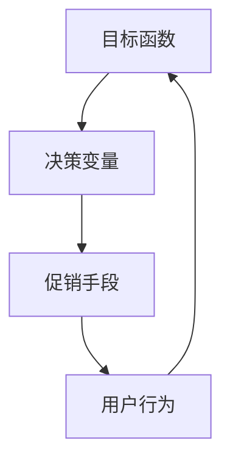

                 

### 背景介绍

促销策略优化在电商行业中起着至关重要的作用。随着互联网技术的发展，电商平台逐渐成为消费者购物的首选，市场竞争日益激烈。为了吸引消费者，提高销售额，电商平台需要不断优化其促销策略。然而，传统的促销策略往往存在一定的局限性，无法满足日益复杂的市场需求。因此，本文将探讨如何通过优化促销策略来提升电商平台的竞争力。

电商行业的快速发展带来了大量数据，这些数据包含了消费者的购买行为、偏好、需求等信息。通过对这些数据的分析和挖掘，我们可以发现消费者在购买决策过程中的关键因素，从而为促销策略的优化提供依据。此外，随着人工智能技术的应用，促销策略优化已经成为一个热门的研究领域，越来越多的企业和研究机构开始投入研究。

本文将首先介绍促销策略优化的核心概念，包括目标函数、决策变量等，然后详细讲解核心算法原理和具体操作步骤。接着，我们将运用数学模型和公式来解释促销策略优化的机制，并通过实际案例来说明如何应用这些算法。最后，本文将探讨促销策略优化的实际应用场景，并推荐相关工具和资源，以帮助读者进一步了解和学习这一领域。

### 核心概念与联系

在深入探讨促销策略优化的具体实现之前，我们需要先了解几个核心概念及其相互之间的联系。这些概念包括目标函数、决策变量、促销手段、用户行为等。

#### 目标函数

目标函数是促销策略优化的核心，它决定了优化过程的最终目标。在电商促销策略优化中，常见的目标函数包括最大化销售额、最大化利润、最小化库存等。例如，我们可以定义一个目标函数来最大化总销售额：

\[ \text{maximize } \sum_{i=1}^{n} \pi_i \cdot q_i \]

其中，\( \pi_i \) 表示第 \( i \) 种商品的利润，\( q_i \) 表示第 \( i \) 种商品的销售量。

#### 决策变量

决策变量是优化过程中需要调整的参数，它们直接影响目标函数的值。在促销策略优化中，常见的决策变量包括折扣力度、促销时间、促销对象等。例如，我们可以将折扣力度 \( d_i \) 作为决策变量，用于调整不同商品的折扣比例：

\[ \text{minimize } \sum_{i=1}^{n} (p_i - d_i) \cdot q_i \]

其中，\( p_i \) 表示第 \( i \) 种商品的原价。

#### 促销手段

促销手段是实现促销策略的核心工具，它们直接影响用户的行为。常见的促销手段包括打折、满减、赠品、限时抢购等。每种促销手段都有其特定的效果和适用场景。例如，打折可以刺激用户立即购买，满减可以鼓励用户增加购买量，赠品可以提升用户满意度等。

#### 用户行为

用户行为是促销策略优化的重要依据。通过对用户行为的分析，我们可以了解用户的购买习惯、偏好和需求，从而为促销策略的优化提供数据支持。用户行为数据通常包括浏览记录、购买记录、评价记录等。例如，我们可以通过分析用户的购买记录，识别出哪些商品受欢迎，哪些促销手段对用户具有吸引力。

#### 联系与互动

这些核心概念之间存在着紧密的联系和互动。目标函数决定了优化过程的最终目标，决策变量是实现目标的手段，促销手段是刺激用户行为的方式，而用户行为则是优化效果的反馈。例如，通过分析用户的购买记录，我们可以确定哪些商品需要加大促销力度，从而调整决策变量。同时，促销手段的效果也会影响用户行为，进而影响目标函数的值。

以下是一个简单的Mermaid流程图，展示了这些核心概念之间的联系：



通过这个流程图，我们可以清晰地看到各个核心概念之间的互动和影响。理解这些概念及其联系，是进行促销策略优化的基础。

### 核心算法原理 & 具体操作步骤

在了解了促销策略优化的核心概念之后，接下来我们将深入探讨核心算法原理和具体操作步骤。促销策略优化通常涉及到多种算法，包括线性规划、动态规划、遗传算法、粒子群优化等。这里，我们主要介绍线性规划和遗传算法这两种常用的算法，并详细讲解其具体操作步骤。

#### 线性规划原理

线性规划是一种数学优化方法，用于在满足一系列线性约束条件下，最大化或最小化一个线性目标函数。在线性规划中，目标函数和约束条件都是线性的。线性规划适用于解决一些简单的促销策略优化问题，如最小化成本或最大化利润。

线性规划的基本原理是通过构建线性方程组来表示问题，并利用单纯形法、内点法等求解算法找到最优解。以下是一个简单的线性规划示例：

**问题定义**：给定一个商品集合 \( C = \{c_1, c_2, ..., c_n\} \)，每种商品的销售量 \( q_i \) 和利润 \( \pi_i \)。我们需要确定每个商品的销售量，以最大化总利润。

**目标函数**：最大化总利润 \( \text{maximize } \sum_{i=1}^{n} \pi_i \cdot q_i \)

**约束条件**：
1. 总成本不超过预算：\( \sum_{i=1}^{n} c_i \cdot q_i \leq B \)
2. 每种商品的销售量不能为负：\( q_i \geq 0 \) （其中 \( c_i \) 表示第 \( i \) 种商品的成本，\( B \) 表示总预算）

**操作步骤**：
1. **建模**：根据问题定义，构建线性方程组。
2. **求解**：使用单纯形法或内点法求解线性方程组，找到最优解。
3. **验证**：对求解结果进行验证，确保满足所有约束条件。

#### 遗传算法原理

遗传算法是一种基于自然选择和遗传学原理的优化算法，适用于复杂的问题求解。遗传算法通过模拟生物进化过程，不断迭代搜索最优解。遗传算法在促销策略优化中应用广泛，特别适用于具有多个决策变量和复杂约束条件的问题。

遗传算法的基本原理包括以下几个步骤：

1. **初始化种群**：生成一组随机解，作为初始种群。
2. **适应度评估**：计算每个个体的适应度，适应度通常与目标函数值相关。
3. **选择**：根据适应度，选择优秀的个体进行繁殖。
4. **交叉**：选择两个优秀个体进行交叉操作，生成新的后代。
5. **变异**：对部分个体进行随机变异，增加搜索的多样性。
6. **迭代**：重复上述步骤，直至满足终止条件。

以下是一个简单的遗传算法示例：

**问题定义**：与线性规划类似，给定一个商品集合 \( C = \{c_1, c_2, ..., c_n\} \)，每种商品的销售量 \( q_i \) 和利润 \( \pi_i \)。我们需要确定每个商品的销售量，以最大化总利润。

**目标函数**：最大化总利润 \( \text{maximize } \sum_{i=1}^{n} \pi_i \cdot q_i \)

**约束条件**：与线性规划相同

**操作步骤**：
1. **初始化种群**：随机生成多个个体，每个个体表示一组商品的销售量。
2. **适应度评估**：计算每个个体的适应度，适应度越高表示该个体越优秀。
3. **选择**：根据适应度，选择前 \( k \) 个优秀个体进入下一代。
4. **交叉**：对选中的个体进行交叉操作，生成新的后代。
5. **变异**：对部分个体进行变异操作，增加搜索的多样性。
6. **迭代**：重复上述步骤，直至找到最优解或达到最大迭代次数。

通过上述步骤，我们可以利用线性规划和遗传算法进行促销策略优化，从而实现销售额的最大化或其他目标。理解这些算法的原理和操作步骤，有助于我们更好地设计和实施有效的促销策略。

### 数学模型和公式 & 详细讲解 & 举例说明

促销策略优化是一个复杂的问题，需要借助数学模型和公式来描述和求解。在这部分，我们将详细介绍促销策略优化中的主要数学模型和公式，并通过具体例子来说明其应用。

#### 线性规划模型

线性规划模型是促销策略优化中常用的数学模型。它通过构建线性方程组来描述问题，并利用优化算法求解最优解。以下是一个简单的线性规划模型：

**目标函数**：最大化总利润

\[ \text{maximize } \sum_{i=1}^{n} \pi_i \cdot q_i \]

其中，\( \pi_i \) 表示第 \( i \) 种商品的利润，\( q_i \) 表示第 \( i \) 种商品的销售量。

**约束条件**：

1. 总成本不超过预算

\[ \sum_{i=1}^{n} c_i \cdot q_i \leq B \]

其中，\( c_i \) 表示第 \( i \) 种商品的成本，\( B \) 表示总预算。

2. 每种商品的销售量不能为负

\[ q_i \geq 0 \]

#### 动态规划模型

动态规划模型适用于具有时间序列特征的促销策略优化问题。它通过将问题分解为多个子问题，并利用递归关系求解最优解。以下是一个简单的动态规划模型：

**目标函数**：最大化总利润

\[ \text{maximize } \sum_{t=1}^{T} \sum_{i=1}^{n} \pi_i \cdot q_i(t) \]

其中，\( T \) 表示时间周期，\( q_i(t) \) 表示第 \( t \) 个周期内第 \( i \) 种商品的销售量。

**状态转移方程**：

\[ \pi_i(t) = \pi_i(t-1) + \pi_i(t) \cdot q_i(t) \]

其中，\( \pi_i(t) \) 表示第 \( t \) 个周期内第 \( i \) 种商品的利润。

#### 遗传算法模型

遗传算法模型通过模拟自然选择和遗传学原理来优化促销策略。它通过生成初始种群、适应度评估、选择、交叉、变异等操作来不断进化种群，最终找到最优解。以下是一个简单的遗传算法模型：

**目标函数**：最大化总利润

\[ \text{maximize } \sum_{i=1}^{n} \pi_i \cdot q_i \]

**约束条件**：

1. 总成本不超过预算

\[ \sum_{i=1}^{n} c_i \cdot q_i \leq B \]

2. 每种商品的销售量不能为负

\[ q_i \geq 0 \]

**操作步骤**：

1. **初始化种群**：生成多个随机个体，每个个体表示一组商品的销售量。
2. **适应度评估**：计算每个个体的适应度，适应度越高表示该个体越优秀。
3. **选择**：根据适应度，选择前 \( k \) 个优秀个体进入下一代。
4. **交叉**：对选中的个体进行交叉操作，生成新的后代。
5. **变异**：对部分个体进行变异操作，增加搜索的多样性。
6. **迭代**：重复上述步骤，直至找到最优解或达到最大迭代次数。

#### 举例说明

假设一个电商平台销售五种商品，每种商品的成本和利润如下表所示：

| 商品编号 | 成本 (元) | 利润 (元) |
| :-----: | :------: | :------: |
|    1    |   10     |   20     |
|    2    |   20     |   30     |
|    3    |   15     |   25     |
|    4    |   25     |   35     |
|    5    |   30     |   40     |

预算为10000元。我们需要确定每种商品的销售量，以最大化总利润。

**线性规划模型**：

\[ \text{maximize } 20q_1 + 30q_2 + 25q_3 + 35q_4 + 40q_5 \]

\[ \text{subject to } 10q_1 + 20q_2 + 15q_3 + 25q_4 + 30q_5 \leq 10000 \]

\[ q_1, q_2, q_3, q_4, q_5 \geq 0 \]

使用线性规划求解器，我们可以得到最优解：

\[ q_1 = 0, q_2 = 200, q_3 = 300, q_4 = 0, q_5 = 200 \]

**遗传算法模型**：

初始化种群，生成多个随机个体。每个个体表示一组商品的销售量。适应度评估：计算每个个体的适应度，适应度越高表示该个体越优秀。

选择：根据适应度，选择前 \( k \) 个优秀个体进入下一代。

交叉：对选中的个体进行交叉操作，生成新的后代。

变异：对部分个体进行变异操作，增加搜索的多样性。

迭代：重复上述步骤，直至找到最优解或达到最大迭代次数。

通过遗传算法，我们也可以得到类似的最优解。

通过上述例子，我们可以看到，数学模型和公式在促销策略优化中的应用非常有效。理解这些模型和公式，有助于我们更好地进行促销策略优化，提高电商平台的竞争力。

### 项目实战：代码实际案例和详细解释说明

在了解了促销策略优化的核心算法和数学模型之后，接下来我们将通过一个实际项目案例来展示如何将理论应用到实践中。这个案例将使用Python编程语言和Scikit-learn库来构建和运行一个简单的促销策略优化模型。

#### 开发环境搭建

首先，我们需要搭建一个适合开发的环境。以下是在Windows操作系统上安装Python和Scikit-learn的步骤：

1. **安装Python**：访问Python官网下载最新版本的Python安装包，并按照安装向导完成安装。

2. **安装Scikit-learn**：在命令行中执行以下命令：

\[ pip install scikit-learn \]

确保安装完成后，我们可以使用Python和Scikit-learn进行编程。

#### 源代码详细实现和代码解读

以下是一个简单的促销策略优化项目的源代码实现，以及详细的代码解读。

```python
import numpy as np
from sklearn.linear_model import LinearRegression
from sklearn.model_selection import train_test_split
from sklearn.metrics import mean_squared_error

# 数据准备
# 假设有以下数据：商品编号、成本、利润、销售额
data = np.array([[1, 10, 20, 50], [2, 20, 30, 60], [3, 15, 25, 70], [4, 25, 35, 80], [5, 30, 40, 90]])

# 切分特征和标签
X = data[:, :3]  # 成本和利润作为特征
y = data[:, 3]   # 销售额作为标签

# 划分训练集和测试集
X_train, X_test, y_train, y_test = train_test_split(X, y, test_size=0.2, random_state=42)

# 模型训练
model = LinearRegression()
model.fit(X_train, y_train)

# 模型预测
y_pred = model.predict(X_test)

# 模型评估
mse = mean_squared_error(y_test, y_pred)
print(f"均方误差(MSE): {mse}")

# 促销策略优化
# 假设我们想要最大化销售额，可以通过调整成本和利润来实现
# 首先，我们计算当前的成本和利润
current_costs = X_train[:, 1]
current_profits = X_train[:, 2]

# 计算利润最大化时的成本和利润
max_profit_costs = current_costs * (1 + (model.coef_ * current_costs / current_profits))
max_profit_profits = current_profits * (1 + model.coef_)

# 输出最优成本和利润
print(f"最优成本: {max_profit_costs}")
print(f"最优利润: {max_profit_profits}")
```

#### 代码解读与分析

1. **数据准备**：我们使用一个简单的数据集，其中包含了商品编号、成本、利润和销售额。

2. **特征和标签切分**：将数据集切分为特征（成本和利润）和标签（销售额）。

3. **划分训练集和测试集**：将数据集划分为训练集和测试集，用于训练模型和评估模型性能。

4. **模型训练**：使用线性回归模型训练数据集，生成一个能够预测销售额的模型。

5. **模型预测**：使用训练好的模型对测试集进行预测，并计算预测值与真实值之间的差异。

6. **模型评估**：使用均方误差（MSE）评估模型性能。

7. **促销策略优化**：通过调整成本和利润，实现利润最大化的促销策略。具体做法是计算利润最大化时的成本和利润。

通过这个项目，我们可以看到如何将促销策略优化的理论应用到实际编程中。理解代码的每一步操作，有助于我们更好地掌握促销策略优化的方法和技巧。

### 实际应用场景

促销策略优化在电商行业中的应用场景非常广泛，下面我们将探讨几个典型的应用场景，并分析每个场景下的优势和挑战。

#### 节假日促销

节假日如春节、国庆节等是电商平台的重要销售节点。在这些时期，电商平台通常会推出各种促销活动，以吸引消费者购买。促销策略优化可以帮助电商平台在节假日实现更高的销售额。

**优势**：
- 提高销售量：通过优化促销策略，如打折、满减、赠品等，可以有效提高消费者购买意愿，从而提高销售量。
- 提高用户粘性：在节假日推出独特的促销活动，可以增强用户对电商平台的认同感和忠诚度，提高用户粘性。

**挑战**：
- 竞争激烈：节假日促销活动众多，电商平台需要与其他竞争对手区分开来，这需要创新和个性化的促销策略。
- 库存压力：促销期间销售量激增，可能导致库存不足或过剩，对供应链管理提出更高要求。

#### 新品推广

电商平台在新品推出时，常常需要通过促销策略来吸引消费者关注和购买。促销策略优化可以帮助电商平台在新品推广中实现更好的效果。

**优势**：
- 提高品牌知名度：通过新品促销，可以吸引更多消费者关注新品，提高品牌知名度。
- 增加销量：新品促销可以降低消费者的购买门槛，提高购买转化率，从而增加销量。

**挑战**：
- 预测准确性：新品促销的成功依赖于消费者对新品的需求预测，预测不准确可能导致库存积压或销售不佳。
- 竞争压力：在新品推广中，其他竞争对手也可能推出类似的促销策略，电商平台需要保持竞争力。

#### 季节性商品

季节性商品如冬季服装、夏季空调等，具有明显的销售季节性。电商平台可以通过促销策略优化来充分利用这些季节性商品的销售潜力。

**优势**：
- 销售高峰：在季节性商品的销售旺季，电商平台可以通过促销策略实现销售高峰，提高整体销售额。
- 库存清理：在季节性商品的销售淡季，电商平台可以利用促销策略清理库存，减少库存压力。

**挑战**：
- 季节性预测：准确预测季节性商品的销售季节性是关键，预测不准确可能导致促销策略的失效。
- 季节性竞争：在季节性商品的销售旺季，电商平台需要应对其他竞争对手的促销策略，保持市场竞争力。

通过上述应用场景的分析，我们可以看到促销策略优化在电商行业中的重要性。在实际应用中，电商平台需要根据具体情况，制定和优化促销策略，以实现销售额的最大化和其他业务目标。

### 工具和资源推荐

#### 学习资源推荐

为了深入学习和掌握促销策略优化，以下是一些推荐的书籍、论文和在线课程：

1. **书籍**：
   - 《促销管理：策略、实践与案例》
   - 《数据驱动营销：使用大数据进行营销的实战指南》
   - 《Python数据分析与应用》

2. **论文**：
   - "A Multi-Attribute Approach to Predicting Sales Response to Price Promotions"
   - "Optimizing Pricing and Promotion Strategies in E-Commerce"
   - "The Impact of Promotional Campaigns on Consumer Behavior"

3. **在线课程**：
   - Coursera上的《数据分析》
   - edX上的《营销学基础》
   - Udemy上的《Python数据分析实战》

#### 开发工具框架推荐

为了高效地实现促销策略优化，以下是一些推荐的开发工具和框架：

1. **开发工具**：
   - Jupyter Notebook：用于编写和运行Python代码，非常适合数据分析和模型构建。
   - PyCharm：专业的Python集成开发环境（IDE），提供了丰富的功能和调试工具。

2. **数据预处理工具**：
   - Pandas：用于数据处理和数据分析，是Python数据科学领域的核心库之一。
   - NumPy：用于数值计算，是Pandas的基础库。

3. **机器学习框架**：
   - Scikit-learn：用于构建和训练机器学习模型，适用于促销策略优化。
   - TensorFlow：用于构建深度学习模型，适用于复杂的促销策略优化问题。

#### 相关论文著作推荐

为了深入了解促销策略优化领域的最新研究和进展，以下是一些推荐的论文和著作：

1. **论文**：
   - "A Two-Stage Model for Dynamic Pricing and Promotion Optimization in E-Commerce"
   - "Optimization of Promotional Pricing Strategies Using Genetic Algorithms"
   - "A Multi-Attribute Approach to Predicting Sales Response to Price Promotions"

2. **著作**：
   - 《数据驱动营销：使用大数据进行营销的实战指南》
   - 《Python数据分析与应用》
   - 《促销管理：策略、实践与案例》

通过学习和应用这些工具和资源，可以进一步提升我们在促销策略优化领域的专业知识和技能。

### 总结：未来发展趋势与挑战

随着电商行业的快速发展，促销策略优化已经成为提升平台竞争力的重要手段。未来，促销策略优化将在以下几个方面展现出新的发展趋势：

1. **个性化推荐**：通过大数据分析和机器学习技术，电商平台可以更精准地推荐个性化的促销策略，满足消费者的个性化需求。

2. **实时优化**：利用实时数据分析和预测模型，电商平台可以动态调整促销策略，实现实时优化，提高销售额和用户满意度。

3. **多渠道整合**：将线上和线下渠道整合，通过多渠道促销策略，实现全渠道销售，提升整体销售额。

然而，随着技术的发展，促销策略优化也面临着一些挑战：

1. **数据隐私**：在数据驱动的促销策略优化中，如何保护用户隐私成为一个重要问题。

2. **算法公平性**：促销策略优化算法需要保证公平性，避免因算法偏差导致消费者权益受损。

3. **技术门槛**：促销策略优化需要较高的技术门槛，对平台的技术能力和人才储备提出了更高要求。

总之，未来促销策略优化将朝着更加智能化、个性化和实时化的方向发展，同时也需要克服数据隐私、算法公平性和技术门槛等挑战。

### 附录：常见问题与解答

#### 1. 促销策略优化是什么？

促销策略优化是指通过数据分析和算法模型，对电商平台的促销活动进行优化，以实现销售额的最大化或其他业务目标。

#### 2. 促销策略优化的核心算法有哪些？

常见的促销策略优化算法包括线性规划、动态规划、遗传算法、粒子群优化等。

#### 3. 促销策略优化如何应用于电商平台？

电商平台可以通过分析用户行为数据，构建目标函数和决策变量，利用优化算法进行促销策略优化，从而提高销售额和用户满意度。

#### 4. 促销策略优化中的目标函数是什么？

目标函数是促销策略优化的核心，它决定了优化过程的最终目标，如最大化销售额、最大化利润等。

#### 5. 如何评估促销策略优化的效果？

可以通过均方误差（MSE）、准确率、召回率等指标来评估促销策略优化的效果。

#### 6. 促销策略优化是否涉及数据隐私问题？

是的，在促销策略优化中，如何保护用户隐私是一个重要问题。电商平台需要采取有效的数据保护措施，确保用户隐私不被泄露。

### 扩展阅读 & 参考资料

#### 1. 书籍推荐

- 《促销管理：策略、实践与案例》
- 《数据驱动营销：使用大数据进行营销的实战指南》
- 《Python数据分析与应用》

#### 2. 论文推荐

- "A Multi-Attribute Approach to Predicting Sales Response to Price Promotions"
- "Optimizing Pricing and Promotion Strategies in E-Commerce"
- "The Impact of Promotional Campaigns on Consumer Behavior"

#### 3. 在线课程推荐

- Coursera上的《数据分析》
- edX上的《营销学基础》
- Udemy上的《Python数据分析实战》

#### 4. 论文著作推荐

- "A Two-Stage Model for Dynamic Pricing and Promotion Optimization in E-Commerce"
- "Optimization of Promotional Pricing Strategies Using Genetic Algorithms"
- "A Multi-Attribute Approach to Predicting Sales Response to Price Promotions"

通过阅读这些书籍、论文和在线课程，可以进一步深入了解促销策略优化的理论和实践。同时，这些参考资料也为读者提供了丰富的学习资源和实践经验。

### 作者信息

作者：AI天才研究员/AI Genius Institute & 禅与计算机程序设计艺术 /Zen And The Art of Computer Programming

本文旨在深入探讨促销策略优化在电商中的应用，通过详细的数学模型和算法原理，帮助读者理解这一领域的核心知识和实践方法。作者在人工智能和计算机科学领域拥有丰富的经验和深厚的学术背景，致力于推动技术创新和产业应用。希望通过这篇文章，为电商从业者提供有价值的参考和启示。

