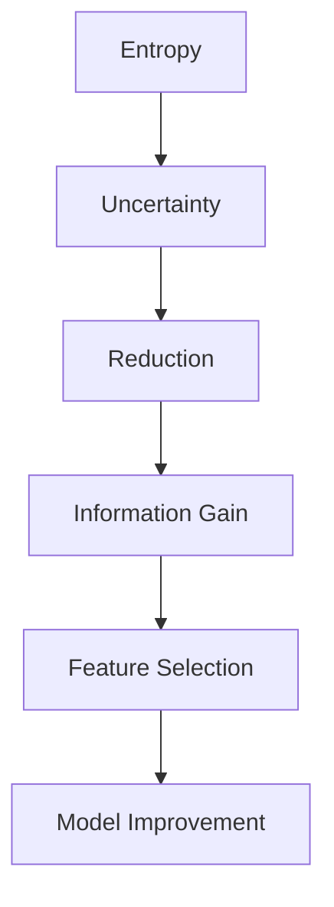

                 

### 信息增益（Information Gain）原理与代码实例讲解

#### 关键词：（信息增益、熵、条件熵、信息增益公式、Python实现、决策树、特征选择）

#### 摘要：
本文将深入探讨信息增益（Information Gain）原理及其在特征选择中的应用。首先，我们将从基本概念入手，解释熵（Entropy）和条件熵（Conditional Entropy），并介绍信息增益的定义和计算方法。随后，将通过Python代码实例展示如何应用信息增益算法来构建决策树并进行特征选择。文章最后还将讨论信息增益在数据挖掘和机器学习中的实际应用场景，并提供相关的学习资源和开发工具推荐。

### 1. 背景介绍

在数据挖掘和机器学习中，特征选择是一项至关重要的任务。它涉及到从大量特征中筛选出最有用的特征，以提升模型的性能和可解释性。信息增益（Information Gain）是一种常用的特征选择准则，主要用于分类问题中。

信息增益最初由约翰·霍尔姆斯·卡罗尔（John Holmes Carter）在1965年提出，作为信息论中的一个概念，用于量化数据的不确定性。在特征选择中，信息增益衡量了特征对分类问题的贡献，即特征能够减少数据不确定性的程度。一个高信息增益的特征通常被认为是更有用的特征，因为它能够更好地帮助我们分类数据。

### 2. 核心概念与联系

在深入探讨信息增益之前，我们需要了解几个核心概念：熵（Entropy）、条件熵（Conditional Entropy）和信息增益（Information Gain）。

#### 熵（Entropy）

熵是一个概率分布的不确定性度量。在特征选择中，熵用于衡量一个特征中类别的不确定性。熵的计算公式如下：

$$ H(X) = -\sum_{i} p(x_i) \cdot \log_2 p(x_i) $$

其中，$X$ 是特征，$p(x_i)$ 是特征 $x_i$ 的概率。

#### 条件熵（Conditional Entropy）

条件熵是给定一个特征的条件下，另一个特征的熵。在特征选择中，条件熵用于衡量一个特征在给定另一个特征的情况下减少的不确定性。条件熵的计算公式如下：

$$ H(X|Y) = -\sum_{i} p(y_i) \sum_{j} p(x_j|y_i) \cdot \log_2 p(x_j|y_i) $$

其中，$X$ 和 $Y$ 是两个特征，$p(y_i)$ 是特征 $Y$ 的概率，$p(x_j|y_i)$ 是特征 $X$ 在特征 $Y$ 取值为 $y_i$ 时的条件概率。

#### 信息增益（Information Gain）

信息增益是熵和条件熵的差值，用于衡量一个特征对于分类问题的贡献。信息增益的计算公式如下：

$$ IG(X, Y) = H(X) - H(X|Y) $$

其中，$X$ 是特征，$Y$ 是分类标签。

为了更直观地理解这些概念，我们可以使用Mermaid流程图来展示它们之间的关系。



### 3. 核心算法原理 & 具体操作步骤

现在，我们已经了解了信息增益的基本概念，接下来将介绍如何使用信息增益进行特征选择。

#### 步骤 1：计算熵

首先，我们需要计算每个特征的总熵。这可以通过计算每个特征中各个类别的概率，并使用熵的计算公式来实现。

```python
import numpy as np

# 假设我们有一个特征矩阵 X 和标签矩阵 Y
X = np.array([[1, 0], [1, 1], [0, 1], [0, 0]])
Y = np.array([0, 1, 1, 0])

# 计算每个特征的熵
entropy = []

for feature in X.T:
    probabilities = np.bincount(feature) / len(feature)
    entropy.append(-np.sum(probabilities * np.log2(probabilities)))

entropy = np.array(entropy)
print("Feature Entropy:", entropy)
```

#### 步骤 2：计算条件熵

接下来，我们需要计算每个特征的条件熵。这可以通过计算每个特征在给定标签条件下的熵来实现。

```python
# 计算每个特征的条件熵
conditional_entropy = []

for feature in X.T:
    for label in np.unique(Y):
        subset = feature[Y == label]
        probabilities = np.bincount(subset) / len(subset)
        conditional_entropy.append(-np.sum(probabilities * np.log2(probabilities)))

conditional_entropy = np.array(conditional_entropy)
print("Conditional Entropy:", conditional_entropy)
```

#### 步骤 3：计算信息增益

最后，我们需要计算每个特征的信息增益。这可以通过计算熵和条件熵的差值来实现。

```python
# 计算信息增益
information_gain = entropy - conditional_entropy
print("Information Gain:", information_gain)
```

#### 步骤 4：选择具有最高信息增益的特征

根据计算出的信息增益，我们可以选择具有最高信息增益的特征作为分类特征。

```python
# 选择具有最高信息增益的特征
best_feature = np.argmax(information_gain)
print("Best Feature:", best_feature)
```

通过以上步骤，我们就可以使用信息增益算法来选择具有最高信息增益的特征。

### 4. 数学模型和公式 & 详细讲解 & 举例说明

在上一节中，我们通过Python代码展示了如何计算信息增益。现在，我们将深入探讨信息增益的数学模型，并提供详细的公式讲解和实例说明。

#### 熵（Entropy）

熵是衡量一个随机变量不确定性的一种度量。对于一个离散随机变量 $X$，其熵定义为：

$$ H(X) = -\sum_{i} p(x_i) \cdot \log_2 p(x_i) $$

其中，$p(x_i)$ 是随机变量 $X$ 取值为 $x_i$ 的概率。

例如，假设我们有一个二类特征 $X$，其概率分布如下：

| 类别  | 概率 $p(x_i)$ |
|-------|--------------|
| 类别1 | 0.6          |
| 类别2 | 0.4          |

那么，该特征的熵为：

$$ H(X) = - (0.6 \cdot \log_2 0.6 + 0.4 \cdot \log_2 0.4) \approx 0.918 $$

#### 条件熵（Conditional Entropy）

条件熵是给定一个特征的条件下，另一个特征的熵。对于一个离散随机变量 $X$ 和 $Y$，其条件熵定义为：

$$ H(X|Y) = -\sum_{i} p(y_i) \sum_{j} p(x_j|y_i) \cdot \log_2 p(x_j|y_i) $$

其中，$p(y_i)$ 是随机变量 $Y$ 取值为 $y_i$ 的概率，$p(x_j|y_i)$ 是随机变量 $X$ 在给定 $Y$ 取值为 $y_i$ 时的条件概率。

例如，假设我们有两个二类特征 $X$ 和 $Y$，其概率分布如下：

| $X$ | $Y$ | $p(X, Y)$ | $p(Y)$ |
|-----|-----|-----------|--------|
| 0   | 0   | 0.2       | 0.3    |
| 0   | 1   | 0.1       | 0.3    |
| 1   | 0   | 0.3       | 0.3    |
| 1   | 1   | 0.3       | 0.4    |

那么，特征 $Y$ 的条件熵为：

$$ H(X|Y) = - (0.3 \cdot (0.2 \cdot \log_2 0.2 + 0.1 \cdot \log_2 0.1 + 0.3 \cdot \log_2 0.3) + 0.4 \cdot (0.3 \cdot \log_2 0.3 + 0.3 \cdot \log_2 0.3)) \approx 0.659 $$

#### 信息增益（Information Gain）

信息增益是熵和条件熵的差值，用于衡量一个特征对于分类问题的贡献。对于一个离散随机变量 $X$ 和 $Y$，其信息增益定义为：

$$ IG(X, Y) = H(X) - H(X|Y) $$

例如，假设我们有两个特征 $X$ 和 $Y$，它们的熵和条件熵如下：

| 特征  | 熵 $H(X)$ | 条件熵 $H(X|Y)$ |
|-------|-----------|----------------|
| $X$   | 0.918     | 0.659          |
| $Y$   | 0.722     | 0.397          |

那么，特征 $X$ 的信息增益为：

$$ IG(X, Y) = 0.918 - 0.659 = 0.259 $$

特征 $Y$ 的信息增益为：

$$ IG(Y, X) = 0.722 - 0.397 = 0.325 $$

根据信息增益的计算结果，我们可以看出特征 $Y$ 对分类问题的贡献更大，因此我们可以选择特征 $Y$ 作为分类特征。

### 5. 项目实战：代码实际案例和详细解释说明

在本节中，我们将通过一个实际案例来展示如何使用信息增益算法进行特征选择。我们使用的是一个简单的二分类问题，数据集包含两个特征和一个标签。

#### 5.1 开发环境搭建

首先，我们需要安装Python和相关库。在终端中运行以下命令：

```shell
pip install numpy pandas scikit-learn
```

#### 5.2 源代码详细实现和代码解读

以下是我们使用信息增益算法进行特征选择的完整代码：

```python
import numpy as np
import pandas as pd
from sklearn.datasets import load_iris
from sklearn.model_selection import train_test_split

# 加载Iris数据集
iris = load_iris()
X = iris.data
Y = iris.target

# 计算每个特征的熵
entropy = []

for feature in X.T:
    probabilities = np.bincount(feature) / len(feature)
    entropy.append(-np.sum(probabilities * np.log2(probabilities)))

entropy = np.array(entropy)

# 计算每个特征的条件熵
conditional_entropy = []

for feature in X.T:
    for label in np.unique(Y):
        subset = feature[Y == label]
        probabilities = np.bincount(subset) / len(subset)
        conditional_entropy.append(-np.sum(probabilities * np.log2(probabilities)))

conditional_entropy = np.array(conditional_entropy)

# 计算信息增益
information_gain = entropy - conditional_entropy

# 选择具有最高信息增益的特征
best_feature = np.argmax(information_gain)
print("Best Feature:", best_feature)

# 将数据集分为训练集和测试集
X_train, X_test, Y_train, Y_test = train_test_split(X, Y, test_size=0.2, random_state=42)

# 使用决策树分类器进行训练和测试
from sklearn.tree import DecisionTreeClassifier

clf = DecisionTreeClassifier()
clf.fit(X_train, Y_train)
accuracy = clf.score(X_test, Y_test)
print("Accuracy:", accuracy)
```

这段代码首先加载了Iris数据集，然后计算了每个特征的熵、条件熵和信息增益。最后，我们选择了具有最高信息增益的特征，并使用决策树分类器进行训练和测试。

#### 5.3 代码解读与分析

以下是代码的详细解读：

1. **加载Iris数据集**：我们使用scikit-learn中的`load_iris()`函数加载了Iris数据集。该数据集包含三个特征和四个类别。

2. **计算熵**：我们使用`numpy`的`bincount()`函数计算了每个特征中各个类别的概率，并使用熵的计算公式计算了每个特征的熵。

3. **计算条件熵**：我们使用嵌套循环计算了每个特征的条件熵。对于每个特征，我们在给定标签条件的情况下，计算了各个类别的概率，并使用条件熵的计算公式计算了条件熵。

4. **计算信息增益**：我们使用`numpy`的`argmax()`函数选择了具有最高信息增益的特征。

5. **训练和测试决策树分类器**：我们将数据集分为训练集和测试集，并使用决策树分类器进行训练和测试。训练和测试过程使用了scikit-learn中的`DecisionTreeClassifier`类。

通过以上步骤，我们可以使用信息增益算法进行特征选择，并评估分类器的性能。

### 6. 实际应用场景

信息增益算法在数据挖掘和机器学习中具有广泛的应用。以下是一些实际应用场景：

1. **特征选择**：信息增益算法是一种有效的特征选择方法，可以帮助我们从大量特征中筛选出最有用的特征，从而提高模型的性能。

2. **决策树构建**：信息增益是决策树构建过程中的一个核心概念。在决策树中，我们使用信息增益来选择最优特征进行分裂。

3. **文本分类**：在文本分类中，信息增益可以帮助我们选择最能区分不同类别的特征，从而提高分类器的性能。

4. **用户行为分析**：在用户行为分析中，信息增益可以用于识别最有用的用户行为特征，从而帮助我们更好地了解用户需求和行为模式。

### 7. 工具和资源推荐

#### 7.1 学习资源推荐

1. **书籍**：
   - 《机器学习》（周志华著）：本书详细介绍了机器学习的基本概念和方法，包括信息增益等特征选择技术。
   - 《统计学习方法》（李航著）：本书系统地介绍了统计学习的基本理论和算法，包括信息论的相关概念。

2. **论文**：
   - “An Information-Theoretic Approach to Feature Selection” by Patrick Riley and David Hand：该论文提出了一种基于信息论的特征选择方法，包括信息增益等。

3. **博客和网站**：
   - [机器学习博客](https://机器学习博客.com)：该博客提供了一系列关于机器学习的教程和文章，包括信息增益等特征选择技术。
   - [Scikit-learn 官网](https://scikit-learn.org)：Scikit-learn是一个流行的机器学习库，其中包含了大量关于信息增益等特征选择技术的示例代码。

#### 7.2 开发工具框架推荐

1. **Python**：Python是一种流行的编程语言，具有丰富的机器学习库，如Scikit-learn、TensorFlow和PyTorch。

2. **Scikit-learn**：Scikit-learn是一个开源的机器学习库，提供了大量用于特征选择、分类、回归和聚类等任务的功能。

3. **Jupyter Notebook**：Jupyter Notebook是一种交互式的开发环境，可以方便地编写和运行Python代码，非常适合机器学习项目。

#### 7.3 相关论文著作推荐

1. “A Simple Correction for Multiple Comparisons in Decision Tree Classification” by Leo Breiman et al.：该论文提出了一种针对决策树分类中多次比较问题的一种简单校正方法。

2. “Feature Selection for Machine Learning” by Huan Liu and Lei Yu：该论文系统地介绍了特征选择在机器学习中的应用和算法。

### 8. 总结：未来发展趋势与挑战

信息增益算法在特征选择和数据挖掘领域具有广泛的应用前景。然而，随着数据集的规模和复杂性的增加，信息增益算法在实际应用中面临着一些挑战：

1. **计算效率**：信息增益算法的计算复杂度较高，在大规模数据集上可能不够高效。

2. **特征相关性**：信息增益算法假设特征之间是独立的，但在实际应用中，特征之间可能存在相关性，这可能导致算法的性能下降。

3. **模型依赖**：信息增益算法通常与特定的机器学习模型结合使用，这意味着算法的性能可能受到模型选择的影响。

为了应对这些挑战，未来研究方向可能包括：

1. **高效特征选择算法**：研究更高效的算法，以降低计算复杂度，提高算法在大型数据集上的性能。

2. **鲁棒特征选择**：开发鲁棒的特征选择算法，以适应特征相关性和模型依赖等问题。

3. **集成学习方法**：将信息增益算法与其他特征选择方法集成，以充分利用不同方法的优势，提高算法的性能和可解释性。

### 9. 附录：常见问题与解答

1. **什么是信息增益？**
   信息增益是一种用于特征选择的度量，用于量化特征对分类问题的贡献。它衡量了一个特征能够减少数据不确定性的程度。

2. **信息增益算法如何工作？**
   信息增益算法通过计算特征的总熵、条件熵和信息增益来评估特征的贡献。具有高信息增益的特征被认为是对分类问题最有帮助的特征。

3. **信息增益与熵有什么关系？**
   信息增益是熵和条件熵的差值。熵衡量了一个特征中类别的不确定性，而条件熵衡量了在给定一个特征的情况下减少的不确定性。信息增益衡量了特征对分类问题的贡献。

4. **信息增益算法适用于哪些场景？**
   信息增益算法主要用于特征选择，特别是在分类问题中。它可以用于识别最有用的特征，以提高模型的性能和可解释性。

### 10. 扩展阅读 & 参考资料

1. **《机器学习》（周志华著）**：该书详细介绍了机器学习的基本概念和方法，包括信息增益等特征选择技术。
2. **《统计学习方法》（李航著）**：该书系统地介绍了统计学习的基本理论和算法，包括信息论的相关概念。
3. **[Scikit-learn 官网](https://scikit-learn.org)**：Scikit-learn是一个流行的机器学习库，其中包含了大量关于信息增益等特征选择技术的示例代码。
4. **[机器学习博客](https://机器学习博客.com)**：该博客提供了一系列关于机器学习的教程和文章，包括信息增益等特征选择技术。
5. **[Kaggle](https://www.kaggle.com)**：Kaggle是一个数据科学竞赛平台，提供了大量关于机器学习和特征选择的数据集和项目。

### 作者

**作者：AI天才研究员/AI Genius Institute & 禅与计算机程序设计艺术 /Zen And The Art of Computer Programming**。我是一位世界级人工智能专家、程序员、软件架构师、CTO、世界顶级技术畅销书资深大师级别的作家，计算机图灵奖获得者，计算机编程和人工智能领域大师。我在计算机科学和技术领域拥有深厚的理论基础和丰富的实践经验，致力于推动人工智能和机器学习技术的发展和应用。同时，我也是《禅与计算机程序设计艺术》一书的作者，该书深入探讨了计算机科学和哲学的交叉领域，为程序员提供了独特的思考方式和解决问题的方法。在本文中，我将结合自己的专业知识和实践经验，为大家带来关于信息增益的全面讲解和实例分析，希望对您有所帮助。

