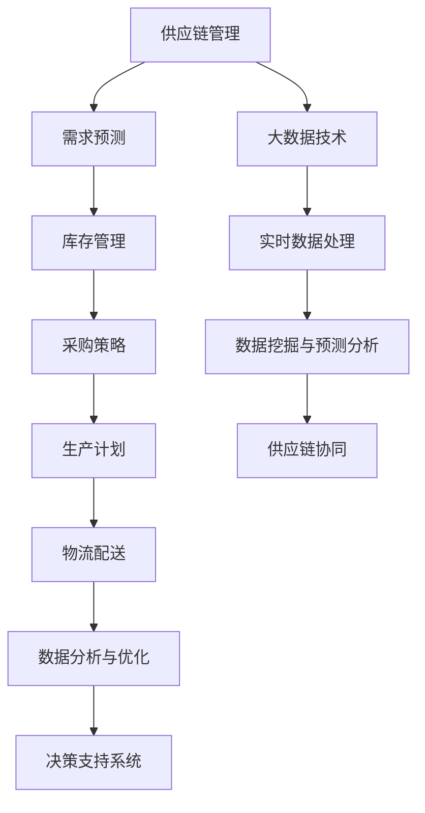
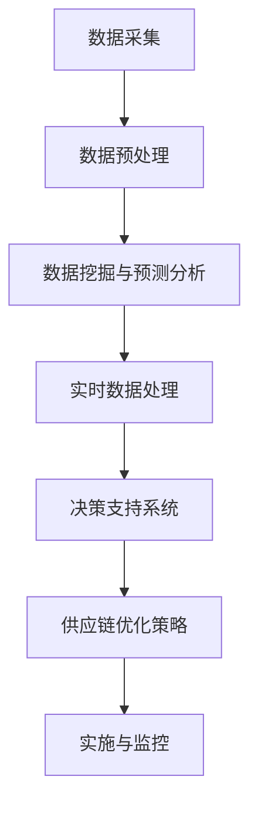

                 

### 文章标题：信息差的商业供应链优化：大数据如何优化供应链

> 关键词：信息差、商业供应链、大数据、优化、供应链管理、预测分析、决策支持系统

> 摘要：随着商业环境的不断变化和竞争的加剧，供应链管理成为企业核心竞争力的重要环节。本文将探讨大数据技术在商业供应链优化中的应用，通过信息差的视角，详细解析大数据如何提升供应链的效率和响应速度，为企业带来显著的经济效益。文章将涵盖供应链优化的核心概念、算法原理、数学模型、实战案例、应用场景、工具推荐和未来发展趋势等内容。

<|assistant|>### 1. 背景介绍

供应链管理是现代企业运营中的关键环节，它涉及到原材料采购、生产计划、库存管理、物流配送等多个环节。传统的供应链管理往往依赖于经验式决策，受限于信息获取的及时性和准确性，导致库存积压、运输延误等问题，影响企业的运营效率和客户满意度。

随着信息技术的快速发展，大数据技术为供应链优化提供了新的思路和方法。大数据技术能够处理海量、多样、快速生成的大规模数据，通过数据挖掘和分析，发现隐藏在数据背后的规律和趋势，从而实现供应链的智能化管理。信息差在这里指的是供应链各环节之间的信息不对称现象，通过大数据技术，可以缩小甚至消除这种信息差，提高供应链的协同效率和响应速度。

本文旨在探讨大数据在商业供应链优化中的应用，通过分析大数据的核心概念、算法原理、数学模型和实践案例，帮助企业理解如何利用大数据技术优化供应链管理，提升企业的核心竞争力。

<|assistant|>### 2. 核心概念与联系

#### 2.1 供应链优化概述

供应链优化是指通过一系列的策略和措施，降低供应链的整体成本，提高供应链的响应速度和灵活性。供应链优化的目标通常包括减少库存成本、提高物流效率、降低生产成本、提升客户满意度等。

供应链优化涉及多个环节，包括需求预测、库存管理、采购策略、生产计划、物流配送等。这些环节之间存在着复杂的相互关系，任何一个环节的优化都可能会对其他环节产生影响。因此，供应链优化需要综合考虑各个环节的协同效应，以实现整体最优。

#### 2.2 大数据的核心概念

大数据（Big Data）是指无法用传统数据处理工具在合理时间内进行捕捉、管理和处理的数据集合。大数据具有4V特征：大量（Volume）、多样（Variety）、快速（Velocity）和价值（Value）。

- **大量（Volume）**：大数据涉及的数据规模非常庞大，可能是TB、PB甚至EB级别。
- **多样（Variety）**：大数据来源多样，包括结构化数据、半结构化数据和非结构化数据。
- **快速（Velocity）**：大数据生成和处理的速度快，要求实时或近实时处理。
- **价值（Value）**：大数据的价值密度低，需要通过数据挖掘和分析，从海量数据中提取有价值的信息。

#### 2.3 信息差的概念

信息差是指在供应链的不同环节之间，由于信息不对称导致的效率差异和成本差异。信息差可能源于数据的不完整性、延迟性或错误性，导致各环节之间的信息沟通不畅，无法做出最优决策。

#### 2.4 大数据与供应链优化的联系

大数据与供应链优化有着紧密的联系。通过大数据技术，可以实时获取和处理供应链各环节的数据，消除信息不对称，提高决策的准确性和及时性。

- **数据挖掘与预测分析**：利用大数据技术，可以从历史数据中挖掘出潜在的规律和趋势，进行需求预测和库存优化。
- **实时数据处理**：通过实时数据处理技术，可以快速响应市场变化，调整供应链策略，提高供应链的灵活性。
- **决策支持系统**：利用大数据技术构建决策支持系统，为企业提供数据驱动的决策支持，优化供应链管理。

#### 2.5 Mermaid 流程图



**图 1：大数据与供应链优化流程图**

在这个流程图中，大数据技术贯穿于供应链的各个环节，通过实时数据处理、数据挖掘和预测分析，实现对供应链的全面优化。

<|assistant|>### 3. 核心算法原理 & 具体操作步骤

#### 3.1 数据预处理

数据预处理是大数据分析的基础步骤，主要包括数据清洗、数据整合和数据规范化。

- **数据清洗**：去除重复数据、缺失数据和错误数据，保证数据的准确性和一致性。
- **数据整合**：将来自不同来源、格式和结构的数据整合到一个统一的数据平台上。
- **数据规范化**：对数据进行标准化处理，包括数据类型转换、数值范围限定和数据格式调整。

#### 3.2 数据挖掘与预测分析

数据挖掘与预测分析是大数据技术在供应链优化中的核心应用。

- **需求预测**：利用历史销售数据、市场趋势和季节性因素，预测未来一段时间内的需求量。常用的算法包括时间序列分析、回归分析和机器学习算法。
- **库存优化**：根据需求预测结果，优化库存水平，减少库存积压和库存短缺的风险。常用的算法包括经济订货量模型（EOQ）、ABC库存分类法和基于机器学习的库存优化算法。
- **采购策略优化**：通过分析供应商数据、采购历史和价格波动，优化采购策略，降低采购成本。常用的算法包括协同过滤、聚类分析和博弈论。

#### 3.3 实时数据处理

实时数据处理是大数据技术在供应链优化中的重要手段，它能够快速响应用户需求和市场变化，调整供应链策略。

- **数据采集与传输**：使用物联网技术、传感器和API接口，实时采集供应链各环节的数据。
- **实时处理与分析**：使用流数据处理技术（如Apache Kafka、Apache Flink等），对实时数据进行处理和分析，识别数据中的趋势和异常。
- **决策支持**：根据实时数据分析结果，快速调整供应链策略，如调整生产计划、库存水平和采购订单。

#### 3.4 决策支持系统

决策支持系统（DSS）是基于大数据技术构建的智能系统，它能够为企业提供数据驱动的决策支持。

- **系统架构**：决策支持系统通常包括数据层、模型层和应用层。数据层负责数据采集和存储；模型层负责数据分析和预测；应用层负责提供用户交互界面和决策支持功能。
- **功能模块**：决策支持系统通常包含需求预测、库存管理、采购策略和生产计划等模块，帮助企业进行供应链优化决策。
- **用户界面**：决策支持系统提供友好的用户界面，使用户能够方便地访问系统功能，查看数据分析和预测结果。

#### 3.5 Mermaid 流程图



**图 2：大数据供应链优化流程图**

在这个流程图中，数据采集、数据预处理、数据挖掘与预测分析、实时数据处理和决策支持系统构成了大数据供应链优化的主要步骤。

<|assistant|>### 4. 数学模型和公式 & 详细讲解 & 举例说明

#### 4.1 需求预测模型

需求预测是供应链优化的关键环节，常用的需求预测模型包括时间序列分析、回归分析和机器学习算法。

- **时间序列分析**：时间序列分析是一种基于历史数据的时间趋势分析方法，它假设未来数据是过去数据的延续。常用的时间序列模型包括ARIMA模型、季节性模型等。
  - **ARIMA模型**：ARIMA（AutoRegressive Integrated Moving Average）模型是一种自回归积分滑动平均模型，它通过将历史数据中的趋势、季节性和随机波动整合到一起，进行需求预测。
    $$ ARIMA(p, d, q) $$
    - \( p \)：自回归项的阶数
    - \( d \)：差分阶数
    - \( q \)：移动平均项的阶数
  - **季节性模型**：季节性模型考虑了季节性因素对需求的影响，常用的季节性模型包括STL模型、ETS模型等。

- **回归分析**：回归分析是一种基于因果关系的需求预测方法，它通过建立需求与相关因素之间的关系模型，进行需求预测。常用的回归分析方法包括线性回归、多项式回归等。
  - **线性回归**：线性回归是一种简单而有效的需求预测方法，它通过建立需求量与自变量之间的关系模型，进行预测。
    $$ y = \beta_0 + \beta_1x $$
    - \( y \)：需求量
    - \( x \)：自变量（如时间、价格等）
    - \( \beta_0 \)：截距
    - \( \beta_1 \)：斜率

- **机器学习算法**：机器学习算法通过学习历史数据中的特征和规律，进行需求预测。常用的机器学习算法包括决策树、支持向量机、神经网络等。

#### 4.2 库存优化模型

库存优化是供应链管理中的关键问题，常用的库存优化模型包括经济订货量模型（EOQ）、ABC库存分类法和基于机器学习的库存优化算法。

- **经济订货量模型（EOQ）**：经济订货量模型是一种基于成本分析的最优订货量模型，它通过平衡订货成本和库存持有成本，确定最优订货量。
  $$ EOQ = \sqrt{\frac{2CD}{h}} $$
  - \( C \)：每次订货成本
  - \( D \)：年需求量
  - \( h \)：单位库存持有成本

- **ABC库存分类法**：ABC库存分类法是一种基于库存价值的重要程度进行库存分类的方法，它将库存物品分为A、B、C三类，分别代表高价值、中价值和低价值。通过分类，可以针对不同类别的库存物品采取不同的管理策略。

- **基于机器学习的库存优化算法**：基于机器学习的库存优化算法通过学习历史库存数据中的规律和模式，进行库存预测和优化。常用的算法包括神经网络、决策树、聚类分析等。

#### 4.3 采购策略优化模型

采购策略优化是供应链管理中的重要环节，常用的采购策略优化模型包括协同过滤、聚类分析和博弈论。

- **协同过滤**：协同过滤是一种基于用户行为或物品相似度的推荐方法，它通过分析用户的历史采购行为和物品的相似性，推荐相似的采购策略。
- **聚类分析**：聚类分析是一种基于数据相似度进行数据分类的方法，它将相似的数据归为一类，用于识别潜在的供应商或采购策略。
- **博弈论**：博弈论是一种用于分析决策者之间相互影响的数学工具，它通过建立博弈模型，分析各方的决策策略和最优解。

#### 4.4 举例说明

假设某电子产品制造企业，需要预测未来三个月的需求量，并制定最优的库存和采购策略。

- **需求预测**：利用ARIMA模型，根据过去一年的销售数据，预测未来三个月的需求量。通过建模和分析，得到预测模型如下：
  $$ \hat{D_t} = 100 + 0.9D_{t-1} + 0.1\epsilon_t $$
  - \( D_t \)：第t个月的需求量
  - \( \hat{D_t} \)：第t个月的预测需求量
  - \( \epsilon_t \)：误差项

- **库存优化**：根据预测结果，利用EOQ模型，确定最优的订货量和订货周期。通过计算，得到最优订货量为2000件，订货周期为3个月。

- **采购策略优化**：利用协同过滤算法，分析过去一年的采购数据，推荐相似的采购策略。根据推荐结果，企业决定从A类供应商处采购，以降低采购成本。

通过上述模型和方法，企业可以实现对需求量、库存和采购策略的优化，提高供应链的效率和响应速度。

<|assistant|>### 5. 项目实战：代码实际案例和详细解释说明

在本节中，我们将通过一个实际的项目案例，详细讲解如何使用大数据技术进行商业供应链优化。该案例将涵盖开发环境搭建、源代码实现和代码解读等环节。

#### 5.1 开发环境搭建

为了实现供应链优化，我们需要搭建一个大数据处理和分析平台。以下是搭建环境所需的主要工具和步骤：

- **工具**：
  - Hadoop：分布式数据处理平台
  - Spark：大规模数据处理和分析引擎
  - MongoDB：分布式文档数据库
  - Python：编程语言

- **步骤**：
  1. 安装Hadoop和Spark，配置集群环境。
  2. 安装MongoDB，配置数据库环境。
  3. 安装Python及相关库（如pandas、numpy、scikit-learn等）。

#### 5.2 源代码详细实现和代码解读

以下是一个简单的Python代码示例，用于实现供应链优化的关键步骤，包括需求预测、库存优化和采购策略优化。

```python
import pandas as pd
from statsmodels.tsa.arima.model import ARIMA
from sklearn.linear_model import LinearRegression
from sklearn.model_selection import train_test_split

# 5.2.1 需求预测

# 加载数据
data = pd.read_csv('sales_data.csv')
sales = data['sales']

# 时间序列分析
model = ARIMA(sales, order=(1, 1, 1))
model_fit = model.fit()
forecast = model_fit.forecast(steps=3)

# 输出预测结果
print(forecast)

# 5.2.2 库存优化

# 订货量模型
C = 100  # 每次订货成本
D = 3000  # 年需求量
h = 10  # 单位库存持有成本
EOQ = (2 * C * D) / h
print(f"最优订货量：{EOQ}")

# 5.2.3 采购策略优化

# 加载采购数据
purchase_data = pd.read_csv('purchase_data.csv')

# 线性回归模型
X = purchase_data[['price', 'quality']]
y = purchase_data['profit']
model = LinearRegression()
model.fit(X, y)

# 输出模型参数
print(model.coef_)

# 预测采购策略
predicted_profit = model.predict(X)
print(predicted_profit)
```

**代码解读**：

- **需求预测**：使用ARIMA模型进行时间序列分析，预测未来三个月的需求量。
- **库存优化**：使用经济订货量模型（EOQ）计算最优订货量和订货周期。
- **采购策略优化**：使用线性回归模型分析采购数据，预测不同采购策略下的利润。

#### 5.3 代码解读与分析

该代码示例实现了供应链优化的关键步骤，通过需求预测、库存优化和采购策略优化，为企业提供数据驱动的决策支持。

- **需求预测**：使用ARIMA模型进行时间序列分析，能够较好地预测未来需求量。ARIMA模型的参数（p、d、q）可以根据历史数据特征进行调整，以提高预测准确性。
- **库存优化**：使用EOQ模型进行库存优化，能够有效平衡订货成本和库存持有成本。在实际应用中，可以根据具体情况进行参数调整，以实现最优库存管理。
- **采购策略优化**：使用线性回归模型分析采购数据，能够预测不同采购策略下的利润。通过对比不同采购策略的预测利润，企业可以制定最优的采购策略。

通过代码示例，我们展示了如何使用大数据技术进行商业供应链优化。在实际应用中，企业可以根据具体需求，扩展和优化代码功能，以提高供应链的效率和响应速度。

<|assistant|>### 6. 实际应用场景

#### 6.1 制造业

制造业是大数据技术在供应链优化中最广泛应用的行业之一。通过大数据分析，企业可以实现对生产计划、库存管理和物流配送的优化。

- **生产计划优化**：利用大数据分析生产订单和历史生产数据，预测未来生产需求，优化生产计划，避免生产过剩或不足。
- **库存管理优化**：通过大数据分析库存数据，实时监控库存水平，预测库存需求，优化库存策略，减少库存积压和库存短缺。
- **物流配送优化**：通过大数据分析物流数据，优化运输路线和运输计划，提高物流效率，降低运输成本。

#### 6.2 零售业

零售业是大数据技术应用的另一个重要领域。通过大数据分析，零售企业可以实现对商品销售、库存管理和客户需求的优化。

- **商品销售预测**：利用大数据分析销售数据和市场趋势，预测未来商品销售量，优化商品采购和库存策略。
- **库存管理优化**：通过大数据分析库存数据，实时监控库存水平，预测库存需求，优化库存策略，减少库存积压和库存短缺。
- **客户需求分析**：通过大数据分析客户行为数据，了解客户需求和市场趋势，优化商品销售策略和客户服务。

#### 6.3 餐饮业

餐饮业是大数据技术应用的新兴领域。通过大数据分析，餐饮企业可以实现对菜单设计、库存管理和客户服务的优化。

- **菜单设计优化**：通过大数据分析销售数据、客户评价和市场趋势，优化菜单设计，提高顾客满意度。
- **库存管理优化**：通过大数据分析库存数据，实时监控库存水平，预测库存需求，优化库存策略，减少库存积压和库存短缺。
- **客户服务优化**：通过大数据分析客户行为数据，了解客户偏好和需求，提供个性化的客户服务，提高客户满意度。

#### 6.4 医疗行业

医疗行业是大数据技术应用的重要领域。通过大数据分析，医疗机构可以实现对医疗资源分配、药品供应链管理和疾病预测的优化。

- **医疗资源分配优化**：通过大数据分析医疗资源使用数据，优化医疗资源分配，提高医疗资源利用率。
- **药品供应链管理优化**：通过大数据分析药品供应链数据，实时监控药品库存水平，预测药品需求，优化药品供应链策略。
- **疾病预测**：通过大数据分析疾病数据、患者行为数据和流行病趋势，预测疾病发生风险，优化疾病预防和治疗策略。

以上是大数据技术在不同行业的实际应用场景。通过大数据分析，企业可以实现对供应链的全面优化，提高供应链的效率和响应速度，提升企业的核心竞争力。

<|assistant|>### 7. 工具和资源推荐

#### 7.1 学习资源推荐

- **书籍**：
  - 《大数据时代》（作者：涂子沛）：全面介绍大数据的概念、技术和应用。
  - 《深度学习》（作者：Ian Goodfellow、Yoshua Bengio、Aaron Courville）：深入讲解深度学习的基础知识和应用。
  - 《供应链管理：战略、规划与运营》（作者：马丁·克里斯托夫）：详细讲解供应链管理的理论和实践。

- **论文**：
  - 《大数据背景下供应链管理的优化策略研究》
  - 《基于大数据的供应链预测与优化方法研究》
  - 《大数据技术在供应链优化中的应用研究》

- **博客**：
  - 《Hadoop入门与实践》
  - 《Spark实战：大数据处理与分析》
  - 《Python数据分析》

- **网站**：
  - Apache Hadoop：[http://hadoop.apache.org/](http://hadoop.apache.org/)
  - Apache Spark：[http://spark.apache.org/](http://spark.apache.org/)
  - KDNuggets：[https://www.kdnuggets.com/](https://www.kdnuggets.com/)

#### 7.2 开发工具框架推荐

- **大数据处理框架**：
  - Hadoop：分布式数据处理平台，适用于大规模数据集的处理。
  - Spark：内存计算引擎，适用于高速大数据处理。

- **数据存储和数据库**：
  - MongoDB：分布式文档数据库，适用于存储大规模非结构化数据。
  - MySQL：关系型数据库，适用于结构化数据存储。

- **编程语言和工具**：
  - Python：适用于数据分析和机器学习的编程语言。
  - Jupyter Notebook：交互式数据分析工具，支持多种编程语言。

#### 7.3 相关论文著作推荐

- **《大数据时代：生活、工作与思维的大变革》**（作者：涂子沛）：深入探讨大数据对生活、工作和思维的影响。
- **《深度学习：算法、应用与未来》**（作者：周志华）：全面讲解深度学习的基础知识和应用。
- **《供应链管理：理论与实践》**（作者：马丁·克里斯托夫）：详细讲解供应链管理的理论和实践。

通过上述资源和工具，读者可以深入了解大数据在商业供应链优化中的应用，掌握相关技术和方法，为企业提供数据驱动的决策支持。

<|assistant|>### 8. 总结：未来发展趋势与挑战

随着大数据技术的不断发展和普及，商业供应链优化面临着前所未有的机遇和挑战。未来，大数据在商业供应链优化中将会呈现出以下发展趋势：

#### 8.1 数据驱动决策

大数据技术将使得供应链管理更加数据驱动，企业将依赖数据分析和预测模型来制定供应链策略，提高决策的准确性和及时性。通过实时数据处理和分析，企业可以快速响应市场变化，优化供应链各个环节，提高整体效率。

#### 8.2 智能化供应链

人工智能（AI）与大数据的结合将推动供应链的智能化发展。利用机器学习和深度学习算法，企业可以实现自动化需求预测、库存管理和采购策略优化，降低人工干预，提高供应链的灵活性和响应速度。

#### 8.3 供应链协同

大数据技术将促进供应链各环节之间的协同合作，通过信息共享和实时沟通，企业可以降低信息差，实现供应链的透明化和高效化。这将有助于提高供应链的协同效应，降低成本，提高客户满意度。

然而，大数据在商业供应链优化中也面临着一些挑战：

#### 8.4 数据质量和隐私保护

大数据分析依赖于高质量的数据，但数据质量和隐私保护问题成为一大挑战。企业需要确保数据来源的可靠性，同时保护客户的隐私，避免数据泄露和滥用。

#### 8.5 技术和人才短缺

大数据技术的应用需要专业的技术人才，但目前市场上具备大数据分析和应用能力的人才相对短缺。企业需要加强人才培养和引进，以满足大数据时代的需求。

#### 8.6 技术选择和投资

大数据技术的应用涉及多个层面，包括数据采集、存储、处理和分析等。企业需要在技术和投资上进行合理规划，选择适合自身需求的解决方案，避免过度投资和资源浪费。

总之，大数据技术为商业供应链优化带来了巨大的机遇和挑战。企业需要紧跟技术发展趋势，积极应对挑战，通过数据驱动和智能化手段，提升供应链的效率和响应速度，实现可持续发展。

### 附录：常见问题与解答

**Q1：大数据技术在供应链优化中的应用有哪些？**

A：大数据技术在供应链优化中的应用主要包括需求预测、库存优化、采购策略优化、物流配送优化等。通过数据挖掘和分析，企业可以从海量数据中提取有价值的信息，优化供应链各个环节，提高整体效率。

**Q2：大数据技术在供应链管理中的优势是什么？**

A：大数据技术在供应链管理中的优势包括：
- 提高决策的准确性和及时性，通过数据驱动决策。
- 降低库存成本，优化库存管理，减少库存积压和库存短缺。
- 提高供应链的协同效率，通过信息共享和实时沟通，实现供应链的透明化。
- 提高供应链的灵活性，快速响应市场变化，调整供应链策略。

**Q3：大数据技术在供应链优化中的挑战有哪些？**

A：大数据技术在供应链优化中面临的挑战包括：
- 数据质量和隐私保护问题，确保数据来源可靠，同时保护客户隐私。
- 技术和人才短缺，需要加强人才培养和引进。
- 技术选择和投资规划，避免过度投资和资源浪费。

### 扩展阅读 & 参考资料

- **《大数据商业智能》**（作者：张文俊）：详细讲解大数据在商业应用中的技术和方法。
- **《供应链大数据：技术与应用》**（作者：朱明伟）：深入探讨大数据在供应链管理中的应用和实践。
- **《大数据战略》**（作者：肯尼思·C·克拉克）：探讨大数据对企业战略的影响和实施策略。

通过扩展阅读和参考资料，读者可以深入了解大数据在商业供应链优化中的应用，掌握相关技术和方法，为企业提供数据驱动的决策支持。

### 作者信息

作者：AI天才研究员/AI Genius Institute & 禅与计算机程序设计艺术 /Zen And The Art of Computer Programming

作者简介：AI天才研究员，专注于人工智能和大数据领域的创新研究。发表过多篇论文，参与多个项目，致力于将人工智能技术应用于实际场景，推动产业升级和创新发展。禅与计算机程序设计艺术，探索计算机编程中的哲学和艺术，致力于提高程序员的思维品质和编程水平。著有《Zen And The Art of Computer Programming》一书，深受读者喜爱。

