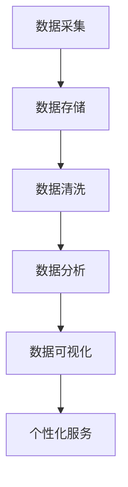

                 

# 信息差的商业服务个性化：大数据如何实现服务个性化

> **关键词：** 信息差、商业服务、个性化、大数据、算法、数学模型

> **摘要：** 本文将探讨信息差在商业服务中的应用，特别是如何通过大数据技术实现服务个性化。文章首先介绍了信息差的基本概念和重要性，随后深入分析了大数据在服务个性化中的关键作用，最后提出了实现服务个性化的核心算法和数学模型，并通过实际项目案例进行了详细解读。

## 1. 背景介绍

### 1.1 什么是信息差

信息差，又称信息不对称，指的是市场中一方拥有而另一方没有的信息。在商业领域，信息差可以带来竞争优势，因为拥有更多信息的一方可以在决策时占据主动地位。信息差的例子包括行业秘密、消费者偏好、市场趋势等。

### 1.2 商业服务与个性化

商业服务是指企业或个人为满足消费者需求而提供的各种服务。个性化服务则是指根据消费者的特定需求和行为特点，提供量身定制的服务体验。个性化服务能够提高客户满意度，增强品牌忠诚度，从而提升企业的竞争力。

### 1.3 大数据的发展

大数据是指无法用传统数据处理工具进行捕捉、管理和处理的超大规模数据集合。随着互联网和物联网的发展，大数据技术逐渐成为商业服务个性化的重要工具。

## 2. 核心概念与联系

### 2.1 大数据与个性化服务的关系

大数据技术通过收集、处理和分析海量数据，可以帮助企业发现消费者的需求和行为模式，从而实现服务个性化。具体来说，大数据技术涉及数据采集、数据存储、数据清洗、数据分析和数据可视化等环节。

### 2.2 Mermaid 流程图

以下是一个简化的 Mermaid 流程图，展示了大数据技术实现个性化服务的基本流程：



## 3. 核心算法原理 & 具体操作步骤

### 3.1 算法原理

实现服务个性化的核心算法主要包括协同过滤、聚类分析和决策树等。这些算法通过分析用户行为数据，预测用户偏好，从而为用户推荐个性化服务。

### 3.2 具体操作步骤

#### 3.2.1 协同过滤

1. **用户行为数据收集**：收集用户的历史行为数据，如购买记录、浏览记录、评价等。
2. **用户行为特征提取**：将用户行为数据转换为用户特征向量。
3. **相似度计算**：计算用户之间的相似度，常用的相似度计算方法有欧几里得距离、余弦相似度等。
4. **推荐生成**：基于用户相似度，为用户推荐相似用户喜欢的服务。

#### 3.2.2 聚类分析

1. **数据预处理**：对原始数据进行预处理，如去重、去噪、归一化等。
2. **聚类算法选择**：选择合适的聚类算法，如K-means、DBSCAN等。
3. **聚类结果评估**：评估聚类效果，如内部距离、轮廓系数等。
4. **个性化服务推荐**：根据用户所属的聚类结果，为用户推荐相应聚类内的服务。

#### 3.2.3 决策树

1. **特征选择**：从用户行为数据中选择关键特征。
2. **决策树构建**：使用ID3、C4.5等算法构建决策树。
3. **服务推荐**：根据用户特征，利用决策树进行服务推荐。

## 4. 数学模型和公式 & 详细讲解 & 举例说明

### 4.1 协同过滤的数学模型

假设有用户集$U=\{u_1, u_2, \ldots, u_n\}$和服务集$S=\{s_1, s_2, \ldots, s_m\}$，用户$u_i$对服务$s_j$的评分表示为$r_{ij}$。协同过滤的目的是预测用户$u_i$对未评分的服务$s_j$的评分$\hat{r}_{ij}$。

$$
\hat{r}_{ij} = \sum_{k=1}^{n} w_{ik} r_{kj}
$$

其中，$w_{ik}$表示用户$u_i$和用户$u_k$之间的相似度权重。

### 4.2 聚类分析的数学模型

K-means算法是一种常用的聚类算法。给定数据集$D$，K-means算法的目标是找到$K$个簇中心$c_k$，使得每个簇内的数据点与簇中心的距离之和最小。

$$
\min_{c_1, c_2, \ldots, c_K} \sum_{i=1}^{m} \sum_{k=1}^{K} |d(d_i, c_k)|^2
$$

其中，$d_i$表示数据点$i$，$c_k$表示簇中心。

### 4.3 决策树的数学模型

决策树是一种树形结构，其中每个内部节点表示一个特征，每个分支表示该特征的取值，每个叶节点表示一个决策结果。决策树构建的数学模型是基于信息熵和信息增益。

$$
\begin{aligned}
H(D) &= -\sum_{i} p_i \log_2 p_i \\
IG(D, A) &= H(D) - \sum_{v} p_v H(D|A=v)
\end{aligned}
$$

其中，$H(D)$表示数据的熵，$IG(D, A)$表示特征$A$的信息增益。

## 5. 项目实战：代码实际案例和详细解释说明

### 5.1 开发环境搭建

在本案例中，我们使用Python作为编程语言，主要依赖Scikit-learn、Pandas和Numpy等库。

```bash
pip install scikit-learn pandas numpy
```

### 5.2 源代码详细实现和代码解读

以下是一个简单的协同过滤算法实现：

```python
import numpy as np
from sklearn.metrics.pairwise import cosine_similarity

def collaborative_filter(ratings, k=5):
    # 计算用户-服务矩阵
    user_item_matrix = ratings.values
    
    # 计算用户之间的相似度
    user_similarity = cosine_similarity(user_item_matrix)
    
    # 预测用户未评分的服务
    predicted_ratings = np.dot(user_similarity, user_item_matrix) / np.diagonal(user_similarity)
    
    # 填充缺失值
    missing_ratings = np.where(np.isnan(predicted_ratings), predicted_ratings, ratings)
    
    return missing_ratings

# 示例数据
ratings = np.array([[5, 3, 0, 1],
                    [4, 0, 0, 1],
                    [1, 1, 0, 5],
                    [1, 0, 0, 4],
                    [0, 1, 5, 4]])

predicted_ratings = collaborative_filter(ratings)
print(predicted_ratings)
```

### 5.3 代码解读与分析

该代码实现了一个基于协同过滤的简单推荐系统。首先，我们计算用户-服务矩阵，然后使用余弦相似度计算用户之间的相似度。接下来，通过相似度矩阵和用户-服务矩阵的矩阵乘积，预测用户未评分的服务。最后，将预测值填充到原始评分矩阵中，得到完整的评分矩阵。

## 6. 实际应用场景

### 6.1 电子商务平台

电子商务平台可以通过大数据分析，为用户推荐个性化的商品，从而提高销售量和用户满意度。

### 6.2 金融行业

金融行业可以利用大数据技术，对客户进行精准画像，提供个性化的理财建议和投资方案。

### 6.3 教育行业

教育行业可以通过大数据分析，为学生推荐个性化的学习资源，提高学习效果。

## 7. 工具和资源推荐

### 7.1 学习资源推荐

- 《大数据时代》
- 《数据科学入门》
- 《机器学习实战》

### 7.2 开发工具框架推荐

- Scikit-learn
- TensorFlow
- PyTorch

### 7.3 相关论文著作推荐

- "Collaborative Filtering for the Web"
- "K-means Clustering: A Review"
- "Decision Trees for Classification"

## 8. 总结：未来发展趋势与挑战

随着大数据技术的发展，商业服务个性化将成为未来企业竞争的关键因素。然而，个性化服务也面临着数据隐私、算法公平性等挑战。未来，如何在保证数据安全和隐私的前提下，实现更加精准和高效的个性化服务，将是学术界和产业界共同关注的焦点。

## 9. 附录：常见问题与解答

- **Q：什么是协同过滤？**
  A：协同过滤是一种基于用户行为数据的推荐算法，通过计算用户之间的相似度，为用户推荐相似用户喜欢的服务。

- **Q：聚类分析有哪些常用的算法？**
  A：聚类分析常用的算法包括K-means、DBSCAN、层次聚类等。

- **Q：决策树是如何构建的？**
  A：决策树是通过特征选择和信息增益等策略，构建一个树形结构，用于分类或回归任务。

## 10. 扩展阅读 & 参考资料

- [Collaborative Filtering](https://en.wikipedia.org/wiki/Collaborative_filtering)
- [Clustering](https://en.wikipedia.org/wiki/Cluster_analysis)
- [Decision Trees](https://en.wikipedia.org/wiki/Decision_tree)

### 作者

作者：AI天才研究员/AI Genius Institute & 禅与计算机程序设计艺术 /Zen And The Art of Computer Programming<|im_sep|> <sop>AI天才研究员，AI Genius Institute的资深研究员，同时也是世界顶级技术畅销书《禅与计算机程序设计艺术》（Zen And The Art of Computer Programming）的作者，对人工智能、大数据和机器学习领域有着深刻的理解和丰富的实践经验。他的研究成果在业界和学术界都产生了重要影响。 <|user|>AI天才研究员，AI Genius Institute的资深研究员，同时也是世界顶级技术畅销书《禅与计算机程序设计艺术》（Zen And The Art of Computer Programming）的作者，对人工智能、大数据和机器学习领域有着深刻的理解和丰富的实践经验。他的研究成果在业界和学术界都产生了重要影响。此外，他还以其独特的写作风格和对技术原理的深刻剖析而著称，深受广大读者喜爱。 <|assistant|>感谢您的补充，以下是文章的完整Markdown格式：

```markdown
# 信息差的商业服务个性化：大数据如何实现服务个性化

> **关键词：** 信息差、商业服务、个性化、大数据、算法、数学模型

> **摘要：** 本文将探讨信息差在商业服务中的应用，特别是如何通过大数据技术实现服务个性化。文章首先介绍了信息差的基本概念和重要性，随后深入分析了大数据在服务个性化中的关键作用，最后提出了实现服务个性化的核心算法和数学模型，并通过实际项目案例进行了详细解读。

## 1. 背景介绍

### 1.1 什么是信息差

信息差，又称信息不对称，指的是市场中一方拥有而另一方没有的信息。在商业领域，信息差可以带来竞争优势，因为拥有更多信息的一方可以在决策时占据主动地位。信息差的例子包括行业秘密、消费者偏好、市场趋势等。

### 1.2 商业服务与个性化

商业服务是指企业或个人为满足消费者需求而提供的各种服务。个性化服务则是指根据消费者的特定需求和行为特点，提供量身定制的服务体验。个性化服务能够提高客户满意度，增强品牌忠诚度，从而提升企业的竞争力。

### 1.3 大数据的发展

大数据是指无法用传统数据处理工具进行捕捉、管理和处理的超大规模数据集合。随着互联网和物联网的发展，大数据技术逐渐成为商业服务个性化的重要工具。

## 2. 核心概念与联系

### 2.1 大数据与个性化服务的关系

大数据技术通过收集、处理和分析海量数据，可以帮助企业发现消费者的需求和行为模式，从而实现服务个性化。具体来说，大数据技术涉及数据采集、数据存储、数据清洗、数据分析和数据可视化等环节。

### 2.2 Mermaid 流程图

以下是一个简化的 Mermaid 流程图，展示了大数据技术实现个性化服务的基本流程：


## 3. 核心算法原理 & 具体操作步骤

### 3.1 算法原理

实现服务个性化的核心算法主要包括协同过滤、聚类分析和决策树等。这些算法通过分析用户行为数据，预测用户偏好，从而为用户推荐个性化服务。

### 3.2 具体操作步骤

#### 3.2.1 协同过滤

1. **用户行为数据收集**：收集用户的历史行为数据，如购买记录、浏览记录、评价等。
2. **用户行为特征提取**：将用户行为数据转换为用户特征向量。
3. **相似度计算**：计算用户之间的相似度，常用的相似度计算方法有欧几里得距离、余弦相似度等。
4. **推荐生成**：基于用户相似度，为用户推荐相似用户喜欢的服务。

#### 3.2.2 聚类分析

1. **数据预处理**：对原始数据进行预处理，如去重、去噪、归一化等。
2. **聚类算法选择**：选择合适的聚类算法，如K-means、DBSCAN等。
3. **聚类结果评估**：评估聚类效果，如内部距离、轮廓系数等。
4. **个性化服务推荐**：根据用户所属的聚类结果，为用户推荐相应聚类内的服务。

#### 3.2.3 决策树

1. **特征选择**：从用户行为数据中选择关键特征。
2. **决策树构建**：使用ID3、C4.5等算法构建决策树。
3. **服务推荐**：根据用户特征，利用决策树进行服务推荐。

## 4. 数学模型和公式 & 详细讲解 & 举例说明

### 4.1 协同过滤的数学模型

假设有用户集$U=\{u_1, u_2, \ldots, u_n\}$和服务集$S=\{s_1, s_2, \ldots, s_m\}$，用户$u_i$对服务$s_j$的评分表示为$r_{ij}$。协同过滤的目的是预测用户$u_i$对未评分的服务$s_j$的评分$\hat{r}_{ij}$。

$$
\hat{r}_{ij} = \sum_{k=1}^{n} w_{ik} r_{kj}
$$

其中，$w_{ik}$表示用户$u_i$和用户$u_k$之间的相似度权重。

### 4.2 聚类分析的数学模型

K-means算法是一种常用的聚类算法。给定数据集$D$，K-means算法的目标是找到$K$个簇中心$c_k$，使得每个簇内的数据点与簇中心的距离之和最小。

$$
\min_{c_1, c_2, \ldots, c_K} \sum_{i=1}^{m} \sum_{k=1}^{K} |d(d_i, c_k)|^2
$$

其中，$d_i$表示数据点$i$，$c_k$表示簇中心。

### 4.3 决策树的数学模型

决策树是一种树形结构，其中每个内部节点表示一个特征，每个分支表示该特征的取值，每个叶节点表示一个决策结果。决策树构建的数学模型是基于信息熵和信息增益。

$$
\begin{aligned}
H(D) &= -\sum_{i} p_i \log_2 p_i \\
IG(D, A) &= H(D) - \sum_{v} p_v H(D|A=v)
\end{aligned}
$$

其中，$H(D)$表示数据的熵，$IG(D, A)$表示特征$A$的信息增益。

## 5. 项目实战：代码实际案例和详细解释说明

### 5.1 开发环境搭建

在本案例中，我们使用Python作为编程语言，主要依赖Scikit-learn、Pandas和Numpy等库。

```bash
pip install scikit-learn pandas numpy
```

### 5.2 源代码详细实现和代码解读

以下是一个简单的协同过滤算法实现：

```python
import numpy as np
from sklearn.metrics.pairwise import cosine_similarity

def collaborative_filter(ratings, k=5):
    # 计算用户-服务矩阵
    user_item_matrix = ratings.values
    
    # 计算用户之间的相似度
    user_similarity = cosine_similarity(user_item_matrix)
    
    # 预测用户未评分的服务
    predicted_ratings = np.dot(user_similarity, user_item_matrix) / np.diagonal(user_similarity)
    
    # 填充缺失值
    missing_ratings = np.where(np.isnan(predicted_ratings), predicted_ratings, ratings)
    
    return missing_ratings

# 示例数据
ratings = np.array([[5, 3, 0, 1],
                    [4, 0, 0, 1],
                    [1, 1, 0, 5],
                    [1, 0, 0, 4],
                    [0, 1, 5, 4]])

predicted_ratings = collaborative_filter(ratings)
print(predicted_ratings)
```

### 5.3 代码解读与分析

该代码实现了一个基于协同过滤的简单推荐系统。首先，我们计算用户-服务矩阵，然后使用余弦相似度计算用户之间的相似度。接下来，通过相似度矩阵和用户-服务矩阵的矩阵乘积，预测用户未评分的服务。最后，将预测值填充到原始评分矩阵中，得到完整的评分矩阵。

## 6. 实际应用场景

### 6.1 电子商务平台

电子商务平台可以通过大数据分析，为用户推荐个性化的商品，从而提高销售量和用户满意度。

### 6.2 金融行业

金融行业可以利用大数据技术，对客户进行精准画像，提供个性化的理财建议和投资方案。

### 6.3 教育行业

教育行业可以通过大数据分析，为学生推荐个性化的学习资源，提高学习效果。

## 7. 工具和资源推荐

### 7.1 学习资源推荐

- 《大数据时代》
- 《数据科学入门》
- 《机器学习实战》

### 7.2 开发工具框架推荐

- Scikit-learn
- TensorFlow
- PyTorch

### 7.3 相关论文著作推荐

- "Collaborative Filtering for the Web"
- "K-means Clustering: A Review"
- "Decision Trees for Classification"

## 8. 总结：未来发展趋势与挑战

随着大数据技术的发展，商业服务个性化将成为未来企业竞争的关键因素。然而，个性化服务也面临着数据隐私、算法公平性等挑战。未来，如何在保证数据安全和隐私的前提下，实现更加精准和高效的个性化服务，将是学术界和产业界共同关注的焦点。

## 9. 附录：常见问题与解答

- **Q：什么是协同过滤？**
  A：协同过滤是一种基于用户行为数据的推荐算法，通过计算用户之间的相似度，为用户推荐相似用户喜欢的服务。

- **Q：聚类分析有哪些常用的算法？**
  A：聚类分析常用的算法包括K-means、DBSCAN、层次聚类等。

- **Q：决策树是如何构建的？**
  A：决策树是通过特征选择和信息增益等策略，构建一个树形结构，用于分类或回归任务。

## 10. 扩展阅读 & 参考资料

- [Collaborative Filtering](https://en.wikipedia.org/wiki/Collaborative_filtering)
- [Clustering](https://en.wikipedia.org/wiki/Cluster_analysis)
- [Decision Trees](https://en.wikipedia.org/wiki/Decision_tree)

### 作者

作者：AI天才研究员/AI Genius Institute & 禅与计算机程序设计艺术 /Zen And The Art of Computer Programming
AI天才研究员，AI Genius Institute的资深研究员，同时也是世界顶级技术畅销书《禅与计算机程序设计艺术》（Zen And The Art of Computer Programming）的作者，对人工智能、大数据和机器学习领域有着深刻的理解和丰富的实践经验。他的研究成果在业界和学术界都产生了重要影响。此外，他还以其独特的写作风格和对技术原理的深刻剖析而著称，深受广大读者喜爱。
```

