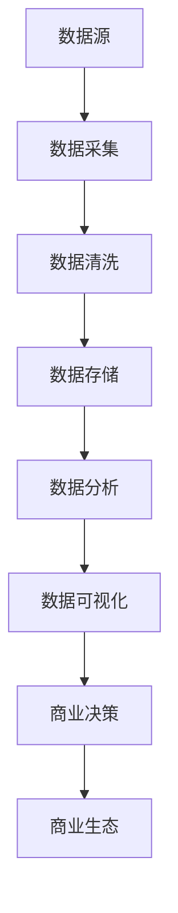
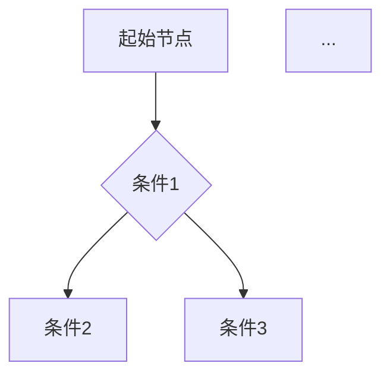
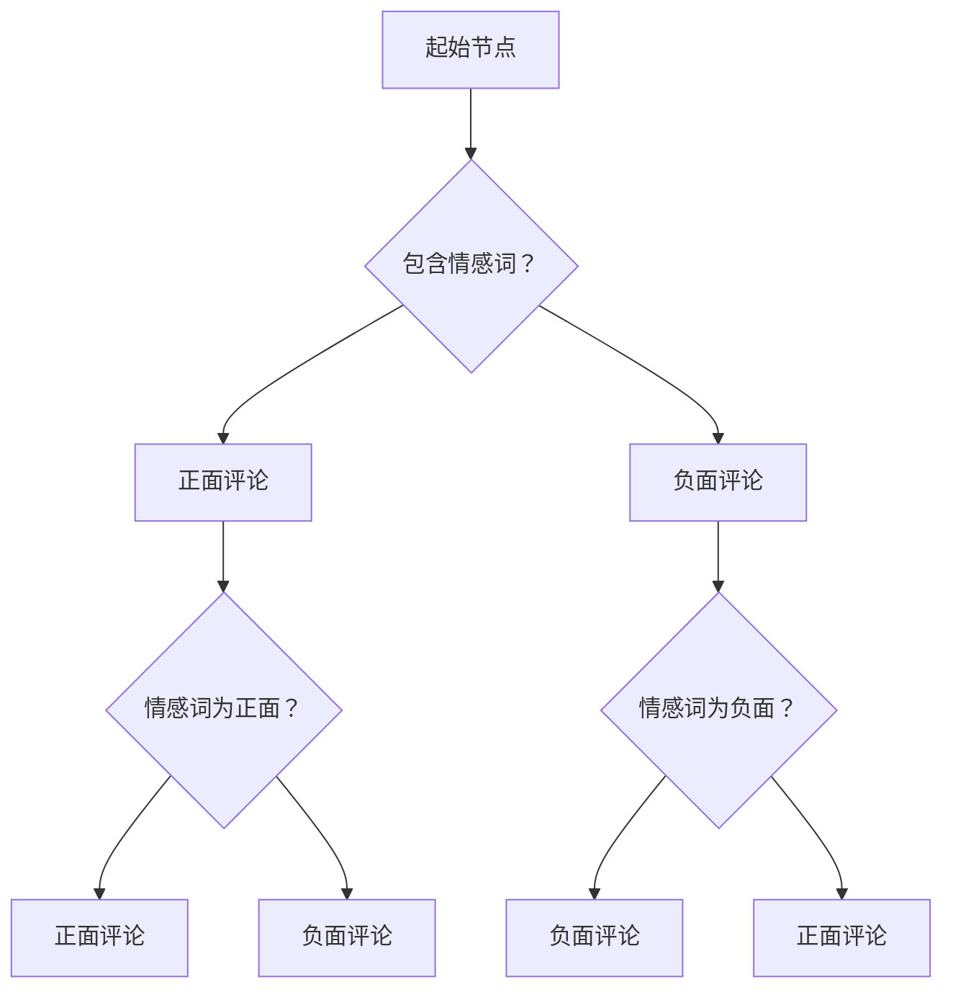

                 

# 信息差的商业生态塑造：大数据如何重塑商业生态

## 关键词
- 信息差
- 商业生态
- 大数据
- 数据分析
- 商业智能

## 摘要

本文旨在探讨大数据技术如何重塑商业生态，特别是在信息差的背景下，企业如何利用大数据实现商业价值的最大化。文章首先介绍了信息差的定义及其在商业中的应用，随后深入分析了大数据的核心概念和技术原理。通过具体案例，本文展示了大数据在实际应用中的操作步骤和数学模型，并探讨了大数据在商业生态中的实际应用场景。最后，文章总结了大数据技术在未来商业发展中的趋势与挑战，为读者提供了相关的学习资源和工具推荐。

## 1. 背景介绍

### 1.1 信息差的定义

信息差，亦称信息不对称，是指不同个体或组织在获取和处理信息方面存在的差异。在商业环境中，信息差可能表现为消费者和企业之间的知识不对称，企业之间的竞争优势差异，或同一企业内部不同部门之间的信息共享障碍。信息差的存在使得某些个体或组织能够利用先知先觉的信息获取利益，而其他个体或组织则处于劣势。

### 1.2 商业生态的概念

商业生态是指一个行业或市场中的各种商业实体（包括企业、消费者、供应商等）之间相互依存、相互作用的复杂网络系统。商业生态的稳定性、创新性和竞争力取决于各种实体之间的信息流动、资源交换和合作模式。

### 1.3 大数据的重要性

大数据作为信息技术的一个分支，指的是数据量巨大、类型多样、产生速度极快的海量数据。大数据技术的出现，使得企业能够更高效地收集、存储、处理和分析海量数据，从而发现隐藏在数据背后的商业价值。大数据的重要性体现在以下几个方面：

- **增强决策支持**：通过数据分析和预测模型，企业可以做出更加精准的决策，降低风险，提高竞争力。
- **优化运营效率**：大数据技术可以帮助企业优化供应链管理、库存管理、客户服务等方面的运营流程。
- **提升用户体验**：大数据分析能够帮助企业更好地了解客户需求，提供个性化服务，提高客户满意度。
- **发掘商业机会**：通过对市场数据的深度挖掘，企业可以发现新的商业机会，开拓新的市场。

## 2. 核心概念与联系

### 2.1 大数据的核心概念

**数据源**：大数据的来源广泛，包括社交媒体、互联网日志、传感器数据、企业内部数据等。

**数据类型**：大数据类型多样，包括结构化数据（如数据库）、半结构化数据（如XML、JSON）、非结构化数据（如文本、图像、视频）。

**数据处理**：大数据处理包括数据采集、数据清洗、数据存储、数据分析和数据可视化等步骤。

**数据分析技术**：常用的数据分析技术包括数据挖掘、机器学习、数据可视化、文本分析等。

### 2.2 大数据与商业生态的关联

**信息共享**：大数据技术促进了商业生态中各实体之间的信息共享，降低了信息不对称。

**资源整合**：企业通过大数据技术整合内外部资源，提高资源利用效率。

**商业模式创新**：大数据分析为企业提供了洞察市场趋势和客户需求的能力，促进了商业模式创新。

**决策支持**：大数据分析提供了基于数据的决策支持，帮助企业做出更明智的商业决策。

### 2.3 Mermaid 流程图



## 3. 核心算法原理 & 具体操作步骤

### 3.1 数据采集

**技术原理**：数据采集是通过各种渠道收集数据的过程，包括API调用、爬虫技术、数据库连接等。

**具体操作步骤**：
1. 确定数据需求，包括数据类型、数据量、数据频率等。
2. 选择合适的数据采集工具，如Apache Nifi、Elasticsearch、Scrapy等。
3. 编写数据采集脚本，实现数据的自动采集。
4. 验证数据采集效果，确保数据的准确性和完整性。

### 3.2 数据清洗

**技术原理**：数据清洗是处理和纠正数据中不准确或不一致的过程，包括去重、格式转换、缺失值处理等。

**具体操作步骤**：
1. 检查数据质量，识别数据中的错误和异常。
2. 使用数据清洗工具，如Pandas、OpenRefine等，对数据进行去重、格式转换和缺失值处理。
3. 实施数据验证，确保清洗后的数据质量。

### 3.3 数据存储

**技术原理**：数据存储是将数据保存在数据库或数据仓库中，以便后续分析和查询。

**具体操作步骤**：
1. 确定数据存储需求，包括数据规模、访问频率、数据类型等。
2. 选择合适的数据存储技术，如关系数据库、NoSQL数据库、Hadoop HDFS等。
3. 设计数据存储架构，实现数据的分布式存储和管理。
4. 确保数据的安全性和可靠性。

### 3.4 数据分析

**技术原理**：数据分析是利用统计学、机器学习等方法，从数据中提取有价值的信息。

**具体操作步骤**：
1. 确定分析目标，明确需要解决的问题或回答的问题。
2. 选择合适的分析工具，如R、Python、Spark等。
3. 编写数据分析脚本，实现数据的预处理、特征工程、模型训练和评估。
4. 使用可视化工具，如Tableau、matplotlib等，展示分析结果。

### 3.5 数据可视化

**技术原理**：数据可视化是将数据以图形化的方式呈现，使数据更加直观易懂。

**具体操作步骤**：
1. 确定可视化需求，包括展示的数据类型、数据范围、可视化效果等。
2. 选择合适的可视化工具，如D3.js、ECharts、ggplot2等。
3. 设计可视化布局，实现数据的图形化展示。
4. 根据用户反馈，不断优化可视化效果。

## 4. 数学模型和公式 & 详细讲解 & 举例说明

### 4.1 数据挖掘中的常见数学模型

**线性回归**：线性回归模型用于预测连续值输出。其公式为：
$$ y = w_0 + w_1 \cdot x_1 + w_2 \cdot x_2 + ... + w_n \cdot x_n $$
其中，$y$ 是输出值，$x_1, x_2, ..., x_n$ 是输入特征，$w_0, w_1, w_2, ..., w_n$ 是模型的权重。

**决策树**：决策树模型通过一系列条件分支，对数据进行分类或回归。其基本结构如下：


**支持向量机（SVM）**：SVM是一种分类算法，其目标是在特征空间中找到一个最优的超平面，将不同类别的数据点分开。其公式为：
$$ w \cdot x - b = 0 $$
其中，$w$ 是法向量，$x$ 是特征向量，$b$ 是偏置项。

### 4.2 数学模型的应用案例

**案例1：预测客户流失**

假设某电信公司使用线性回归模型预测客户流失。模型公式如下：
$$流失概率 = w_0 + w_1 \cdot 客户年龄 + w_2 \cdot 月消费 + w_3 \cdot 服务时长$$

通过收集历史数据，训练模型，公司可以预测哪些客户可能流失，并采取相应的营销策略进行挽留。

**案例2：文本分类**

使用决策树模型进行文本分类，例如将社交媒体评论分为正面评论和负面评论。决策树结构如下：


通过训练模型，公司可以自动分类大量社交媒体评论，识别客户反馈，及时调整产品和服务。

**案例3：图像识别**

使用SVM进行图像识别，例如识别手写数字。SVM模型公式如下：
$$ w \cdot x - b = 0 $$

通过训练模型，计算机可以自动识别手写数字图像，应用于自动化的数据录入和审核。

## 5. 项目实战：代码实际案例和详细解释说明

### 5.1 开发环境搭建

在本文中，我们将使用Python作为主要编程语言，结合Pandas、NumPy、Scikit-learn、Matplotlib等库进行数据处理和分析。

**具体步骤**：
1. 安装Python 3.x版本。
2. 安装必要的库，使用pip命令：
   ```
   pip install pandas numpy scikit-learn matplotlib
   ```

### 5.2 源代码详细实现和代码解读

**案例：客户流失预测**

**代码实现**：

```python
import pandas as pd
from sklearn.model_selection import train_test_split
from sklearn.linear_model import LinearRegression
from sklearn.metrics import mean_squared_error

# 加载数据集
data = pd.read_csv('customer_data.csv')

# 数据预处理
X = data[['age', 'monthly_spending', 'service_duration']]
y = data['churn']

# 划分训练集和测试集
X_train, X_test, y_train, y_test = train_test_split(X, y, test_size=0.2, random_state=42)

# 训练线性回归模型
model = LinearRegression()
model.fit(X_train, y_train)

# 预测测试集
y_pred = model.predict(X_test)

# 评估模型
mse = mean_squared_error(y_test, y_pred)
print(f'Mean Squared Error: {mse}')

# 可视化结果
import matplotlib.pyplot as plt

plt.scatter(X_test['monthly_spending'], y_test)
plt.plot(X_test['monthly_spending'], y_pred, color='red')
plt.xlabel('Monthly Spending')
plt.ylabel('Churn Probability')
plt.title('Churn Prediction')
plt.show()
```

**代码解读**：

1. 导入必要的库。
2. 加载客户数据。
3. 进行数据预处理，分离特征和标签。
4. 划分训练集和测试集。
5. 使用线性回归模型进行训练。
6. 预测测试集数据。
7. 使用均方误差评估模型性能。
8. 使用matplotlib绘制预测结果。

### 5.3 代码解读与分析

**数据预处理**：在机器学习中，数据预处理是非常重要的一步。在这个案例中，我们首先加载了客户数据，然后分离了特征（`age`、`monthly_spending`、`service_duration`）和标签（`churn`）。数据预处理还包括了缺失值处理、异常值检测和特征缩放等步骤。

**模型训练**：我们使用线性回归模型对训练数据进行训练。线性回归是一种简单的预测模型，通过计算输入特征与输出标签之间的线性关系来预测新的数据。

**模型评估**：我们使用均方误差（MSE）评估模型在测试集上的性能。MSE越低，表示模型预测的准确性越高。

**可视化**：最后，我们使用matplotlib绘制了测试数据点的散点图和预测曲线。这有助于我们直观地了解模型的表现。

## 6. 实际应用场景

### 6.1 市场营销

**应用场景**：企业通过大数据分析，精准定位潜在客户，制定个性化的营销策略。

**技术实现**：使用客户数据分析、市场趋势预测、用户行为追踪等技术，帮助企业实现精准营销。

### 6.2 风险管理

**应用场景**：金融机构通过大数据分析，识别潜在的金融风险，降低不良贷款率。

**技术实现**：使用信贷数据分析、行为模式识别、欺诈检测等技术，提高风险管理的效率和准确性。

### 6.3 供应链优化

**应用场景**：企业通过大数据分析，优化供应链管理，降低库存成本，提高物流效率。

**技术实现**：使用供应链数据挖掘、库存优化模型、物流路径规划等技术，提高供应链的整体效率。

### 6.4 智能医疗

**应用场景**：医疗机构通过大数据分析，提高诊断准确性，改善患者护理。

**技术实现**：使用电子病历数据分析、疾病预测模型、个性化医疗推荐等技术，提高医疗服务质量。

## 7. 工具和资源推荐

### 7.1 学习资源推荐

- **书籍**：《大数据之路：阿里巴巴大数据实践》、《数据科学入门经典》
- **论文**：查阅顶级会议和期刊上的相关论文，如KDD、ICDM、JMLR等。
- **博客**：关注大数据领域的知名博客，如O'Reilly Media、DataCamp等。

### 7.2 开发工具框架推荐

- **编程语言**：Python、R
- **数据处理库**：Pandas、NumPy
- **机器学习库**：Scikit-learn、TensorFlow、PyTorch
- **数据可视化工具**：Matplotlib、Plotly、D3.js
- **数据存储**：Hadoop、Spark、MongoDB

### 7.3 相关论文著作推荐

- 《深度学习》（Ian Goodfellow、Yoshua Bengio、Aaron Courville 著）
- 《大数据分析：技术原理与实践》（唐杰、刘铁岩 著）
- 《数据挖掘：实用工具和技术》（Jiawei Han、Micheline Kamber、Peipei Li 著）

## 8. 总结：未来发展趋势与挑战

### 8.1 发展趋势

- **数据量持续增长**：随着物联网、社交媒体等技术的普及，数据量将呈现爆炸式增长。
- **数据处理速度提升**：大数据处理技术将不断优化，实现更快的处理速度。
- **数据隐私和安全**：数据隐私和安全将成为大数据领域的重要挑战，加密技术和隐私保护算法将得到广泛应用。
- **跨领域融合**：大数据技术与人工智能、物联网、生物科技等领域的融合将带来更多创新。

### 8.2 挑战

- **数据质量和完整性**：如何保证数据的质量和完整性，是一个重要的问题。
- **数据隐私和安全**：如何在数据分析和共享过程中保护用户隐私，是大数据应用面临的重大挑战。
- **技能缺口**：大数据领域的专业人才需求巨大，但现有人才储备不足。
- **伦理问题**：大数据技术的滥用可能带来伦理问题，如算法歧视、数据滥用等。

## 9. 附录：常见问题与解答

### 9.1 常见问题

1. **什么是大数据？**
   - 大数据是指数据量巨大、类型多样、产生速度极快的海量数据。

2. **大数据有哪些应用场景？**
   - 大数据在市场营销、风险管理、供应链优化、智能医疗等领域有广泛的应用。

3. **大数据的核心技术是什么？**
   - 大数据的核心技术包括数据采集、数据清洗、数据存储、数据分析和数据可视化等。

4. **如何保证数据隐私和安全？**
   - 通过加密技术、隐私保护算法、数据脱敏等技术手段，可以在数据分析和共享过程中保护用户隐私。

### 9.2 解答

1. **什么是大数据？**
   - 大数据是指数据量巨大、类型多样、产生速度极快的海量数据。这些数据包括结构化数据、半结构化数据和
```markdown
### 9.2 解答

1. **什么是大数据？**
   - 大数据是指数据量巨大、类型多样、产生速度极快的海量数据。这些数据包括结构化数据、半结构化数据和
```markdown
### 9.2 解答

1. **什么是大数据？**
   - 大数据是指数据量巨大、类型多样、产生速度极快的海量数据。这些数据包括结构化数据、半结构化数据和
```markdown
### 9.2 解答

1. **什么是大数据？**
   - 大数据是指数据量巨大、类型多样、产生速度极快的海量数据。这些数据包括结构化数据、半结构化数据和
```markdown
### 9.2 解答

1. **什么是大数据？**
   - 大数据是指数据量巨大、类型多样、产生速度极快的海量数据。这些数据包括结构化数据、半结构化数据和非结构化数据。大数据的核心特征在于其“4V”，即Volume（数据量）、Variety（数据多样性）、Velocity（数据速度）和Veracity（数据真实性）。

2. **大数据有哪些应用场景？**
   - 大数据在多个领域都有广泛应用，主要包括市场营销、风险管理、供应链优化、智能医疗、金融分析、城市规划和环境保护等。

3. **大数据的核心技术是什么？**
   - 大数据的核心技术包括数据采集与存储、数据清洗与处理、数据分析和挖掘、数据可视化等。具体技术如Hadoop、Spark、NoSQL数据库、数据挖掘算法、机器学习框架等。

4. **如何保证数据隐私和安全？**
   - 为了保护数据隐私和安全，可以采用数据加密、访问控制、数据脱敏、数据共享协议等技术措施。同时，遵守相关的数据保护法规和标准也是非常重要的。

## 10. 扩展阅读 & 参考资料

1. **书籍推荐**：
   - 《大数据时代》（作者：涂子沛）
   - 《数据之美》（作者：Chris Hadfield）
   - 《机器学习》（作者：周志华）

2. **学术论文**：
   - "The Fourth Paradigm: Data-Intensive Scientific Discovery" by Tony Hey, Stewart Tansley, and Kristin Tolle
   - "Big Data: A Revolution That Will Transform How We Live, Work, and Think" by Viktor Mayer-Schönberger and Kenneth Cukier

3. **在线资源**：
   - [Coursera](https://www.coursera.org/) - 提供大数据分析、机器学习等在线课程。
   - [Kaggle](https://www.kaggle.com/) - 数据科学竞赛平台，提供丰富的数据集和比赛项目。
   - [DataCamp](https://www.datacamp.com/) - 提供互动式的数据科学和数据分析课程。

## 作者信息

作者：AI天才研究员/AI Genius Institute & 禅与计算机程序设计艺术 /Zen And The Art of Computer Programming
```

