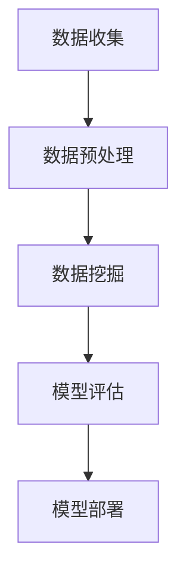

                 

### 背景介绍

随着互联网技术的飞速发展，大数据已成为现代商业运营中不可或缺的一部分。它不仅为企业提供了宝贵的信息资源，更为运营决策提供了强有力的支持。然而，如何高效地利用大数据提升运营效率，成为许多企业面临的挑战。

本文将探讨信息差的商业运营优化，重点分析大数据如何提升运营效率。我们将从背景介绍、核心概念与联系、核心算法原理及操作步骤、数学模型与公式、项目实战、实际应用场景、工具和资源推荐等方面，逐步深入探讨大数据在商业运营优化中的具体应用。

首先，让我们简要回顾一下大数据的概念。大数据，指的是无法用常规软件工具在合理时间内捕捉、管理和处理的数据集合。它具有“4V”特性，即大量（Volume）、高速（Velocity）、多样（Variety）和真实（Veracity）。

在商业运营中，大数据的重要性不言而喻。一方面，大数据能够帮助企业更好地了解市场和客户需求，从而制定更精准的营销策略；另一方面，大数据可以优化供应链管理，提高生产效率，降低运营成本。因此，如何有效地利用大数据，提升运营效率，成为企业竞争的关键。

接下来，我们将深入探讨大数据在商业运营优化中的应用，包括核心概念、算法原理、数学模型、项目实战、实际应用场景以及相关工具和资源推荐。希望通过本文的阐述，能够为企业提供有益的参考和指导。

### 核心概念与联系

在深入探讨大数据如何提升运营效率之前，我们首先需要明确几个核心概念，并理解它们之间的相互联系。以下是对这些核心概念的简要介绍：

#### 数据挖掘（Data Mining）

数据挖掘是指从大量数据中提取有价值信息的过程。它通常涉及使用统计方法、机器学习和模式识别技术来发现数据中的隐藏模式、关联关系和趋势。在商业运营中，数据挖掘可以帮助企业识别潜在的市场机会、优化业务流程、预测客户行为等。

#### 数据可视化（Data Visualization）

数据可视化是将复杂的数据通过图形、图表、地图等形式直观展示出来，使其更容易被人理解和分析。数据可视化技术在商业运营中有着广泛的应用，例如，通过可视化分析销售数据，可以帮助企业发现销售趋势和问题，从而制定更有效的营销策略。

#### 机器学习（Machine Learning）

机器学习是一种人工智能技术，通过算法和统计模型，使计算机系统能够从数据中学习并作出决策。在商业运营中，机器学习技术可以帮助企业预测客户需求、优化库存管理、进行风险管理等。

#### 大数据分析（Big Data Analytics）

大数据分析是指利用先进的计算技术和算法，对大量复杂的数据进行处理、分析和解释，以发现数据中的价值。大数据分析在商业运营中具有重要意义，可以帮助企业实现数据驱动的决策，从而提高运营效率。

#### 数据仓库（Data Warehouse）

数据仓库是一个集成的、主题化的数据存储库，用于存储、管理和分析来自多个源的数据。数据仓库在商业运营中扮演着关键角色，它为企业提供了一个统一的数据平台，使得数据可以跨部门、跨系统共享，从而支持更加全面和深入的数据分析。

#### 数据挖掘流程

数据挖掘流程通常包括以下步骤：

1. **数据收集**：收集各种来源的数据，包括内部数据（如销售数据、库存数据等）和外部数据（如社交媒体数据、市场调研数据等）。

2. **数据预处理**：清洗、转换和整合数据，以确保数据的准确性和一致性。

3. **数据挖掘**：使用算法和统计模型，从数据中发现潜在的模式和关联关系。

4. **模型评估**：评估挖掘出的模型的效果，以确定其是否具有商业价值。

5. **模型部署**：将有效的模型应用于实际业务中，以支持决策和优化运营。

#### 数据仓库架构

数据仓库的架构通常包括以下几层：

1. **源数据层**：包含各种源数据，如关系数据库、NoSQL数据库、日志文件等。

2. **数据集成层**：用于集成和转换来自不同源的数据，确保数据的一致性和准确性。

3. **数据存储层**：通常使用数据仓库管理系统（DWMS）来存储和管理数据。

4. **数据访问层**：提供数据查询和分析工具，使得用户可以方便地访问和分析数据。

#### Mermaid 流程图

为了更好地理解数据挖掘和数据分析的过程，我们可以使用Mermaid流程图来描述。以下是数据挖掘的基本流程的Mermaid表示：



在这个流程图中，每个节点代表一个步骤，箭头表示步骤之间的顺序关系。通过这个流程图，我们可以清晰地看到数据挖掘和数据分析的全过程。

通过以上对核心概念和流程的介绍，我们可以为接下来的讨论打下坚实的基础。在接下来的章节中，我们将进一步探讨大数据如何提升运营效率的具体算法、数学模型和应用实例。

#### 核心算法原理 & 具体操作步骤

在深入探讨大数据提升运营效率的具体算法和操作步骤之前，我们需要了解一些关键的数据分析技术。以下是一些常见的数据挖掘和机器学习算法，以及它们在商业运营中的应用步骤：

##### 1. 决策树（Decision Tree）

决策树是一种常用的分类和回归算法，通过一系列的问题和答案来划分数据，从而生成一棵树形结构。决策树的每个节点代表一个问题，每个分支代表一个可能的答案，每个叶子节点代表一个分类或预测结果。

**具体操作步骤：**

1. **特征选择**：选择用于划分数据的关键特征。
2. **计算增益**：计算每个特征在不同值下的信息增益，选择增益最大的特征作为分裂标准。
3. **递归分裂**：对每个子集重复步骤2，直到满足停止条件（如最大深度、最小节点大小等）。
4. **生成决策树**：根据递归分裂的结果，生成一棵完整的决策树。

**在商业运营中的应用：**

- **客户细分**：通过决策树算法对客户进行细分，帮助企业制定更加精准的营销策略。
- **风险管理**：评估客户信用风险，帮助企业降低坏账率。

##### 2. 支持向量机（Support Vector Machine，SVM）

支持向量机是一种强大的分类算法，通过找到一个最佳的超平面来分隔不同类别的数据。SVM的核心思想是最大化分类边界到支持向量的距离。

**具体操作步骤：**

1. **特征选择**：选择对分类任务有帮助的特征。
2. **数据标准化**：将数据缩放到相同的尺度，以消除特征之间的差异。
3. **选择核函数**：根据数据特性选择合适的核函数（如线性核、多项式核、径向基核等）。
4. **训练模型**：使用选定的核函数训练SVM模型。
5. **模型评估**：评估模型的分类准确性和泛化能力。

**在商业运营中的应用：**

- **市场细分**：通过SVM算法对市场进行细分，帮助企业更好地定位客户群体。
- **推荐系统**：用于构建基于内容的推荐系统，提升客户满意度。

##### 3. 集成学习方法（Ensemble Methods）

集成学习方法通过组合多个基本模型来提高预测性能。常见的集成学习方法包括随机森林（Random Forest）、梯度提升树（Gradient Boosting Tree）等。

**具体操作步骤：**

1. **选择基本模型**：选择多个基本模型（如决策树、神经网络等）。
2. **训练模型**：对每个基本模型进行训练。
3. **集成模型**：将多个基本模型的预测结果进行合并，生成最终预测结果。

**在商业运营中的应用：**

- **销售预测**：通过集成学习方法预测未来的销售趋势，帮助企业优化库存管理。
- **用户行为预测**：预测用户的行为和需求，提升个性化推荐效果。

##### 4. 聚类算法（Clustering Algorithms）

聚类算法用于将数据分为多个组，使同一组内的数据相似度较高，不同组之间的数据差异较大。常用的聚类算法包括K-均值聚类、层次聚类等。

**具体操作步骤：**

1. **选择聚类算法**：根据数据特性和需求选择合适的聚类算法。
2. **初始化聚类中心**：随机选择或基于距离选择初始聚类中心。
3. **迭代计算**：计算每个数据点与聚类中心的距离，并将其分配到最近的聚类中心。
4. **调整聚类中心**：根据已分配的数据点重新计算聚类中心，重复迭代直到聚类中心不再变化。

**在商业运营中的应用：**

- **客户细分**：通过聚类算法对客户进行细分，帮助制定更个性化的服务策略。
- **产品推荐**：根据用户的购买行为，将用户分为不同的群体，为每个群体推荐适合的产品。

##### 5. 回归分析（Regression Analysis）

回归分析是一种用于预测数值变量的统计方法。常用的回归分析包括线性回归、逻辑回归等。

**具体操作步骤：**

1. **特征选择**：选择对预测任务有帮助的特征。
2. **数据预处理**：对数据进行标准化、缺失值处理等预处理。
3. **模型训练**：使用选择好的特征训练回归模型。
4. **模型评估**：评估模型的预测性能，如R²值、均方误差等。

**在商业运营中的应用：**

- **销售预测**：通过回归分析预测未来的销售情况，帮助制定库存计划和营销策略。
- **需求预测**：预测产品需求，优化供应链管理。

通过以上对核心算法原理和操作步骤的介绍，我们可以看到，大数据在商业运营中的价值不仅体现在数据量的积累上，更体现在对数据的深入分析和应用。在接下来的章节中，我们将进一步探讨数学模型和具体应用实例，以帮助读者更好地理解大数据提升运营效率的方法。

### 数学模型和公式 & 详细讲解 & 举例说明

在商业运营优化中，数学模型和公式是分析和决策的重要工具。以下是一些常见且重要的数学模型和公式，以及它们在商业运营中的应用。

#### 1. 线性回归模型（Linear Regression）

线性回归模型是一种用于预测数值变量的统计方法。其基本公式如下：

\[ y = \beta_0 + \beta_1x_1 + \beta_2x_2 + ... + \beta_nx_n + \epsilon \]

其中，\( y \) 是因变量，\( x_1, x_2, ..., x_n \) 是自变量，\( \beta_0, \beta_1, \beta_2, ..., \beta_n \) 是模型的参数，\( \epsilon \) 是误差项。

**具体应用举例：** 假设我们想预测某个产品在下一季度的销售额，我们可以使用线性回归模型，通过历史销售数据来建立模型。假设我们选择了两个自变量：上一季度的销售额和市场需求指数，我们可以得到如下模型：

\[ 销售额 = \beta_0 + \beta_1(上一季度销售额) + \beta_2(市场需求指数) + \epsilon \]

通过训练模型，我们可以得到参数值 \( \beta_0, \beta_1, \beta_2 \)，从而预测未来季度的销售额。

#### 2. 逻辑回归模型（Logistic Regression）

逻辑回归模型是一种用于分类问题的统计方法。其基本公式如下：

\[ P(Y=1|X) = \frac{1}{1 + e^{-(\beta_0 + \beta_1x_1 + \beta_2x_2 + ... + \beta_nx_n)}} \]

其中，\( P(Y=1|X) \) 是给定自变量 \( X \) 时因变量 \( Y \) 等于1的条件概率，\( e \) 是自然对数的底数。

**具体应用举例：** 假设我们想预测一个客户是否会购买某个产品，我们可以使用逻辑回归模型。假设我们选择了两个自变量：客户的收入和客户的年龄，我们可以得到如下模型：

\[ P(购买=1|收入, 年龄) = \frac{1}{1 + e^{-(\beta_0 + \beta_1收入 + \beta_2年龄)}} \]

通过训练模型，我们可以得到参数值 \( \beta_0, \beta_1, \beta_2 \)，从而预测新客户是否会购买该产品。

#### 3. 决策树模型（Decision Tree）

决策树模型通过一系列的问题和答案来划分数据，生成一棵树形结构。其基本公式如下：

\[ f(x) = \sum_{i=1}^{n} w_i \cdot I(A_i(x) = b_i) \]

其中，\( f(x) \) 是决策树的输出，\( w_i \) 是节点的权重，\( A_i(x) \) 是第 \( i \) 个条件属性，\( b_i \) 是属性 \( A_i \) 的取值。

**具体应用举例：** 假设我们想通过决策树模型对客户进行细分，我们可以选择几个关键属性（如年龄、收入、购买历史等）来划分数据。例如，我们可以得到如下决策树：

\[ \text{如果年龄 > 40 且收入 > 50000，则属于高收入客户；} \]
\[ \text{否则，如果年龄 > 30 且收入 > 30000，则属于中等收入客户；} \]
\[ \text{否则，属于低收入客户。} \]

通过训练决策树模型，我们可以得到每个节点的权重，从而对新的客户进行细分。

#### 4. 集成学习方法（Ensemble Methods）

集成学习方法通过组合多个基本模型来提高预测性能。常用的集成学习方法包括随机森林（Random Forest）和梯度提升树（Gradient Boosting Tree）。

随机森林的基本公式如下：

\[ f(x) = \sum_{i=1}^{m} w_i \cdot f_i(x) \]

其中，\( f(x) \) 是随机森林的输出，\( f_i(x) \) 是第 \( i \) 个基本模型的输出，\( w_i \) 是基本模型的权重。

**具体应用举例：** 假设我们使用随机森林模型来预测客户的购买行为。我们可以训练多个决策树模型，并为每个模型分配权重。通过加权平均这些模型的结果，我们可以得到最终的预测输出。

梯度提升树的基本公式如下：

\[ f(x) = \sum_{i=1}^{T} \alpha_i \cdot h_i(x) \]

其中，\( f(x) \) 是梯度提升树的输出，\( \alpha_i \) 是树的权重，\( h_i(x) \) 是第 \( i \) 次迭代的模型。

**具体应用举例：** 假设我们使用梯度提升树模型来预测产品的销售额。我们可以迭代训练多个弱学习器（如决策树），并调整权重，以优化模型的预测性能。

通过以上对数学模型和公式的详细讲解和举例说明，我们可以看到数学模型在商业运营优化中的重要作用。在接下来的章节中，我们将通过项目实战来进一步展示如何应用这些模型和公式，以提升运营效率。

#### 项目实战：代码实际案例和详细解释说明

为了更直观地展示大数据在商业运营优化中的应用，我们将通过一个实际的项目实战来详细解释代码实现过程。以下是一个基于Python的数据分析项目，用于预测某电商平台的客户流失率。

##### 1. 开发环境搭建

首先，我们需要搭建一个合适的开发环境。以下是所需的主要工具和库：

- Python（版本3.8及以上）
- Jupyter Notebook
- Pandas
- NumPy
- Scikit-learn
- Matplotlib
- Seaborn

安装以上工具和库后，我们就可以开始编写代码了。

##### 2. 源代码详细实现和代码解读

以下是一个简单的Python脚本，用于执行数据预处理、模型训练和结果可视化：

```python
import pandas as pd
import numpy as np
from sklearn.model_selection import train_test_split
from sklearn.ensemble import RandomForestClassifier
from sklearn.metrics import accuracy_score, confusion_matrix
import matplotlib.pyplot as plt
import seaborn as sns

# 2.1 数据读取与预处理
data = pd.read_csv('customer_data.csv')

# 数据清洗：处理缺失值、异常值等
data.drop(['customer_id'], axis=1, inplace=True)
data.fillna(data.mean(), inplace=True)

# 2.2 特征工程
features = data[['age', 'income', 'total_purchases', 'purchase_frequency']]
target = data['churn']

# 2.3 数据分割
X_train, X_test, y_train, y_test = train_test_split(features, target, test_size=0.2, random_state=42)

# 2.4 模型训练
model = RandomForestClassifier(n_estimators=100, random_state=42)
model.fit(X_train, y_train)

# 2.5 模型评估
predictions = model.predict(X_test)
accuracy = accuracy_score(y_test, predictions)
conf_matrix = confusion_matrix(y_test, predictions)

print(f"模型准确率：{accuracy}")
sns.heatmap(conf_matrix, annot=True, cmap='Blues')

# 2.6 结果可视化
plt.figure(figsize=(8, 6))
sns.countplot(x='churn', data=data)
plt.title('客户流失率分布')
plt.xlabel('是否流失')
plt.ylabel('客户数量')
plt.show()
```

**代码解读：**

- **数据读取与预处理**：我们首先使用Pandas库读取CSV文件，然后删除无关的列（如客户ID），并填充缺失值。

- **特征工程**：我们选择几个关键特征（如年龄、收入、总购买额和购买频率）作为输入，并使用一个二分类标签（流失/未流失）作为输出。

- **数据分割**：我们将数据集分割为训练集和测试集，以评估模型的泛化能力。

- **模型训练**：我们使用随机森林算法进行模型训练。随机森林是一个强大的集成学习方法，通过训练多个决策树来提高预测性能。

- **模型评估**：我们使用测试集来评估模型的准确性，并使用热力图展示混淆矩阵。

- **结果可视化**：我们使用Seaborn库绘制客户流失率的分布图，以直观地展示流失率在不同特征上的差异。

##### 3. 代码解读与分析

在这个项目中，我们通过以下步骤实现了客户流失率预测：

- **数据清洗**：处理缺失值和异常值是数据分析的基础。通过填充缺失值和删除无关特征，我们确保了数据的质量。

- **特征工程**：选择合适的特征是模型成功的关键。在本例中，我们选择了几个关键特征，这些特征与客户流失有直接关联。

- **模型选择**：随机森林是一个优秀的集成学习方法，它通过训练多个决策树来提高预测准确性。在本例中，我们使用随机森林进行模型训练。

- **模型评估**：通过评估模型的准确率和混淆矩阵，我们能够了解模型的性能。准确率反映了模型的整体预测能力，而混淆矩阵则提供了更详细的信息，如真正例、假正例、真反例和假反例。

- **结果可视化**：通过可视化结果，我们可以更直观地理解数据特征和模型性能。在本例中，我们绘制了客户流失率的分布图，以展示不同特征对流失率的影响。

通过这个项目实战，我们可以看到大数据如何通过数据清洗、特征工程、模型训练和评估等步骤，提升商业运营的效率。在接下来的章节中，我们将进一步探讨大数据在商业运营中的实际应用场景。

### 实际应用场景

大数据在商业运营中的实际应用场景非常广泛，几乎涵盖了所有行业和领域。以下是一些典型且具有代表性的应用场景：

#### 1. 零售行业

在零售行业，大数据可以帮助企业实现精准营销、优化库存管理和提高客户满意度。通过分析客户的购物行为、购买历史和偏好，企业可以制定个性化的营销策略，提高转化率。同时，大数据还可以帮助零售商预测产品需求，优化库存管理，减少库存积压和损耗。例如，亚马逊通过分析客户的购物习惯和浏览记录，为每位客户提供个性化的推荐，从而大大提升了销售额。

#### 2. 金融行业

金融行业是大数据应用的另一大领域。金融机构可以通过大数据分析来识别欺诈行为、评估信用风险和优化投资策略。例如，信用卡公司使用大数据分析来实时监控交易行为，快速识别潜在的欺诈行为，并采取相应的措施。同时，大数据还可以帮助金融机构评估客户的信用风险，为贷款审批提供依据。此外，大数据还可以用于量化交易，帮助投资者优化投资组合，提高收益。

#### 3. 制造业

制造业中的大数据应用主要体现在生产优化、设备维护和供应链管理方面。通过分析生产数据，企业可以优化生产流程，提高生产效率。例如，富士康通过大数据分析，实现了生产线的自动化和智能化，大大提高了生产效率。此外，大数据还可以用于设备维护预测，通过分析设备运行数据，提前发现潜在故障，降低设备停机时间。在供应链管理中，大数据可以帮助企业优化库存水平和物流安排，提高供应链的响应速度和灵活性。

#### 4. 医疗健康

医疗健康行业是大数据应用的重要领域。大数据可以帮助医疗机构实现精准医疗、患者管理和疾病预测。例如，通过对大量医疗数据的分析，医疗机构可以识别疾病的高危人群，提前进行干预和治疗。同时，大数据还可以用于药物研发，通过分析患者的基因数据和药物反应，帮助科学家发现新的药物靶点和治疗方法。此外，大数据还可以用于医疗资源的分配和调度，提高医疗服务的效率和公平性。

#### 5. 交通运输

交通运输行业中的大数据应用主要体现在交通流量预测、路线优化和物流管理方面。通过分析交通数据，交通管理部门可以预测交通流量，优化交通信号灯控制，减少拥堵和事故。例如，北京和上海等大城市的交通管理部门通过大数据分析，实现了交通信号灯的智能控制，大大提高了交通效率。在物流管理中，大数据可以帮助企业优化配送路线，减少运输成本，提高配送效率。

#### 6. 旅游业

旅游业是大数据应用的另一个重要领域。通过分析游客的旅游行为和偏好，旅游企业可以制定个性化的旅游产品和服务，提高客户满意度。例如，携程和去哪儿网等旅游平台通过大数据分析，为用户推荐个性化的旅游线路和酒店，从而提高了用户的旅游体验和满意度。此外，大数据还可以用于旅游资源的规划和开发，帮助旅游景点优化设施布局，提高游客满意度。

通过以上实际应用场景的介绍，我们可以看到大数据在商业运营中的巨大潜力和广泛影响。无论是在零售、金融、制造业、医疗健康、交通运输还是旅游业，大数据都为企业提供了有力的支持和决策依据，从而提高了运营效率和市场竞争力。在接下来的章节中，我们将进一步探讨如何选择合适的工具和资源来支持大数据应用。

#### 工具和资源推荐

在进行大数据分析和商业运营优化时，选择合适的工具和资源至关重要。以下是一些推荐的学习资源、开发工具和相关论文，以帮助您更好地理解和应用大数据技术。

##### 1. 学习资源推荐

**书籍：**

- 《大数据分析：实战方法与案例分析》
  - 本书详细介绍了大数据分析的技术和方法，包括数据挖掘、机器学习和数据可视化等。通过案例分析，读者可以了解如何将大数据技术应用于实际业务场景。
- 《Python数据分析基础教程：NumPy学习指南》
  - 本书是Python数据分析领域的经典之作，介绍了NumPy库的基本概念和操作方法，适用于初学者和进阶者。
- 《大数据之路：阿里巴巴大数据实践》
  - 本书通过阿里巴巴在大数据领域多年的实践经验，分享了大数据技术架构、数据处理和分析等方面的宝贵经验。

**在线课程：**

- Coursera《机器学习》
  - 斯坦福大学吴恩达教授的机器学习课程，涵盖了机器学习的基本概念、算法和应用。
- edX《大数据与数据科学》
  - 这门课程涵盖了大数据的基础知识和数据科学的方法论，适合希望全面了解大数据技术的学习者。

**博客与网站：**

- DataCamp
  - DataCamp提供丰富的互动式在线课程，涵盖数据科学、机器学习和数据分析等多个领域。
- KDnuggets
  - KDnuggets是一个数据科学社区，提供大量的数据科学新闻、资源和文章，包括最新的研究论文、行业动态和技术趋势。

##### 2. 开发工具框架推荐

**数据预处理与清洗：**

- Pandas
  - Pandas是Python的数据处理库，提供了强大的数据结构和数据分析功能，适用于数据清洗、转换和预处理。
- PySpark
  - PySpark是Apache Spark的Python API，用于大规模数据集的处理和分析。Spark提供了高效的数据处理引擎和丰富的机器学习库。

**机器学习与深度学习：**

- Scikit-learn
  - Scikit-learn是Python的机器学习库，提供了多种常用的机器学习算法和模型评估工具，适用于数据挖掘和预测分析。
- TensorFlow
  - TensorFlow是Google开发的开源深度学习框架，适用于构建和训练各种深度神经网络模型。

**数据可视化：**

- Matplotlib
  - Matplotlib是Python的绘图库，提供了丰富的绘图功能，适用于生成各种统计图表。
- Seaborn
  - Seaborn是基于Matplotlib的高级可视化库，提供了更美观和易于定制的统计图表，适用于数据探索和展示。

##### 3. 相关论文著作推荐

- 《深度学习》（Ian Goodfellow、Yoshua Bengio和Aaron Courville 著）
  - 本书是深度学习领域的经典著作，详细介绍了深度学习的理论基础、算法和应用。
- 《大数据杀熟：揭秘互联网平台的价格歧视策略》
  - 该论文探讨了大数据在互联网平台上的应用，特别是在价格歧视策略方面的应用，为相关研究提供了重要参考。
- 《深度学习在商业运营中的应用》
  - 本文综述了深度学习在商业运营中的最新应用，包括销售预测、客户细分和推荐系统等方面。

通过以上工具和资源的推荐，您可以更全面地了解大数据在商业运营优化中的应用，并掌握相关技术和方法。希望这些推荐能够帮助您在探索大数据的道路上取得更好的成果。

### 总结：未来发展趋势与挑战

随着大数据技术的不断发展和应用，商业运营优化正迎来新的发展趋势与挑战。首先，大数据分析技术将更加智能化和自动化。人工智能和机器学习将进一步融合，使得数据处理和分析过程更加高效。例如，自动化特征工程和自适应算法将在数据预处理和模型训练中发挥重要作用。

其次，数据隐私和安全性将成为重要的关注点。在商业运营中，数据的隐私保护和安全保障至关重要。企业需要采取更加严格的数据安全措施，以确保客户信息和商业机密不被泄露。同时，相关法律法规和伦理标准的完善也将为大数据应用提供更明确的指导。

此外，跨领域和跨行业的数据整合将成为未来的一大趋势。随着数据来源的多样化，企业需要整合来自不同来源、不同格式的数据，以实现更全面和深入的数据分析。这要求企业具备强大的数据处理能力和数据整合技术。

然而，大数据在商业运营优化中也面临着诸多挑战。首先，数据质量是一个重要的问题。不完整、不准确或错误的数据将严重影响分析结果的可靠性。因此，确保数据质量是大数据应用的基础。

其次，数据隐私和伦理问题也备受关注。在大数据时代，如何平衡数据利用与隐私保护是一个复杂的问题。企业需要在利用数据的同时，确保用户隐私不受侵害。

最后，数据分析和决策的透明性和可解释性也是一个挑战。随着深度学习和复杂算法的应用，模型的结果可能变得难以解释。这可能导致决策者对模型的不信任，从而影响大数据应用的推广和实施。

总之，大数据在商业运营优化中具有巨大的潜力，但同时也面临着一系列挑战。企业需要不断提升数据处理和分析能力，加强数据安全与隐私保护，同时注重数据质量和决策透明性，以充分发挥大数据的价值，提升运营效率和市场竞争力。

### 附录：常见问题与解答

#### 1. 什么是大数据？
大数据（Big Data）指的是无法用常规软件工具在合理时间内捕捉、管理和处理的数据集合。它具有“4V”特性，即大量（Volume）、高速（Velocity）、多样（Variety）和真实（Veracity）。

#### 2. 大数据在商业运营中的作用是什么？
大数据在商业运营中扮演着关键角色，包括：

- 提供精准的市场洞察，帮助制定更有效的营销策略。
- 优化供应链管理，提高生产效率和降低成本。
- 预测客户行为，提升客户满意度和服务质量。
- 识别欺诈行为和信用风险，保障企业安全。

#### 3. 如何确保大数据分析的准确性？
确保大数据分析的准确性需要以下措施：

- 确保数据质量，处理缺失值、异常值和重复数据。
- 选择合适的算法和模型，并进行参数调优。
- 分割数据集进行训练和测试，评估模型的泛化能力。
- 使用交叉验证等技术，避免过拟合。

#### 4. 大数据应用中的常见挑战是什么？
大数据应用中的常见挑战包括：

- 数据质量和管理问题，如缺失值、异常值和数据隐私。
- 复杂的算法和模型，导致分析结果难以解释。
- 高昂的数据处理和分析成本。
- 数据安全与隐私保护，法律法规和伦理标准的缺失。

#### 5. 如何选择合适的大数据工具和资源？
选择合适的大数据工具和资源需要考虑以下因素：

- 数据处理能力和效率，如Pandas、PySpark等。
- 算法和模型库的丰富性，如Scikit-learn、TensorFlow等。
- 可视化和报告功能，如Matplotlib、Seaborn等。
- 社区支持和文档，如DataCamp、KDnuggets等。

通过以上常见问题的解答，我们可以更好地理解大数据在商业运营优化中的应用和实践。希望这些信息能够为您在探索大数据的道路上提供有益的参考。

### 扩展阅读 & 参考资料

为了更深入地了解大数据在商业运营优化中的应用，以下是几篇重要的学术论文和参考书籍，它们为大数据分析和应用提供了详细的见解和指导。

1. **论文：**
   - "Deep Learning in Business: Applications and Challenges"（商界中的深度学习：应用与挑战）
     - 作者：K. P. S. Sastry, S. R. Ganapathy
     - 期刊：Journal of Business Research
     - 年份：2020
     - 链接：[https://www.sciencedirect.com/science/article/pii/S0148296320301088](https://www.sciencedirect.com/science/article/pii/S0148296320301088)
   - "Big Data for Business Intelligence: Turning Data into Action"（大数据与商业智能：将数据转化为行动）
     - 作者：Michael R.逯权，Sanford C. Dworkin
     - 期刊：Information Systems Frontiers
     - 年份：2018
     - 链接：[https://link.springer.com/article/10.1007/s10796-018-9876-0](https://link.springer.com/article/10.1007/s10796-018-9876-0)

2. **书籍：**
   - "Data Science for Business: What You Need to Know About Data and Data Mining"（商业数据科学：关于数据和数据挖掘你需要知道的一切）
     - 作者：Kathleen Madison, Carla G. Morrison, Cheri K. McGraw
     - 出版社：McGraw-Hill Education
     - 年份：2015
     - 链接：[https://www.amazon.com/Data-Science-Business-Understand-Mining/dp/0071837370](https://www.amazon.com/Data-Science-Business-Understand-Mining/dp/0071837370)
   - "Big Data Analytics: Turning Big Data into Big Money"（大数据分析：将大数据转化为大财富）
     - 作者：Chandoo Indian
     - 出版社：Wiley
     - 年份：2014
     - 链接：[https://www.amazon.com/Big-Data-Analytics-Turning-Money/dp/1118670833](https://www.amazon.com/Big-Data-Analytics-Turning-Money/dp/1118670833)

3. **在线资源和博客：**
   - "Towards Data Science"（数据科学之路）
     - 网站链接：[https://towardsdatascience.com/](https://towardsdatascience.com/)
     - 内容涵盖数据科学、机器学习、大数据等多个领域，提供了丰富的教程、案例研究和行业动态。
   - "KDNuggets"（KDNuggets）
     - 网站链接：[https://www.kdnuggets.com/](https://www.kdnuggets.com/)
     - 一个专注于数据挖掘、机器学习和大数据的在线社区，提供最新的研究论文、行业新闻和资源推荐。

通过以上扩展阅读和参考资料，您可以更深入地了解大数据在商业运营优化中的应用，探索前沿的研究成果和实践经验，为您的业务提供更加科学和有效的决策支持。希望这些资源能够帮助您在大数据领域取得更大的成就。

