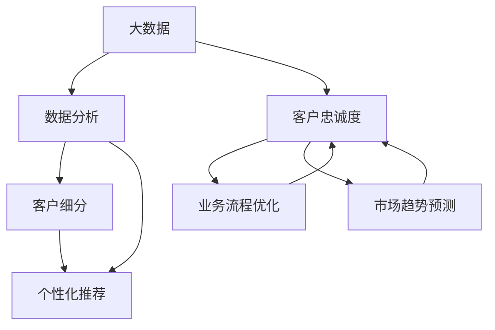

                 

### 背景介绍

在当今数字化时代，大数据技术已经成为企业竞争的重要驱动力。大数据不仅仅是一种数据量庞大的现象，更是一种技术能力和思维方式。它通过高效的数据收集、处理和分析，帮助企业洞察客户需求，优化业务流程，提升客户满意度，从而增强客户忠诚度。

客户忠诚度是企业生存和发展的关键。根据哈佛商学院的研究，仅提高5%的客户忠诚度，就能提高25%到125%的利润。然而，随着市场竞争的加剧和客户需求的多样化，传统的方法已经无法满足企业提升客户忠诚度的需求。这就需要一种全新的策略，而大数据技术正是这种策略的核心。

大数据通过分析客户的消费行为、互动记录、反馈信息等，可以帮助企业更准确地了解客户需求，实现个性化服务和精准营销。例如，通过对客户购买历史数据的分析，企业可以预测客户的潜在需求，提前推送相关产品或服务，从而提高客户的满意度和忠诚度。此外，大数据还可以帮助企业识别出流失风险客户，及时采取挽回措施，减少客户流失。

然而，大数据技术的应用并非一蹴而就。企业需要具备一定的技术能力，包括数据收集、存储、处理和分析等。同时，数据隐私和安全问题也是企业需要重点关注的问题。因此，本文将探讨大数据如何增强客户忠诚度，包括核心概念、算法原理、数学模型、实战案例和未来发展趋势等内容。通过本文的介绍，希望能够为企业提供一套完整的大数据客户忠诚度提升策略。

### 核心概念与联系

为了更好地理解大数据如何增强客户忠诚度，我们需要先了解一些核心概念，以及它们之间的关系。以下是本文涉及的主要概念和它们之间的联系：

#### 大数据

大数据（Big Data）是指无法使用传统数据库软件工具在合理时间内捕捉、管理和处理的大量数据。这些数据具有“4V”特征：大量（Volume）、多样性（Variety）、速度（Velocity）和价值（Value）。大数据技术涉及数据的采集、存储、处理、分析和可视化等多个方面。

#### 客户忠诚度

客户忠诚度（Customer Loyalty）是指客户对企业的产品或服务产生持续信任和偏好，并愿意持续购买和推荐给其他潜在客户。客户忠诚度是衡量企业市场竞争力的重要指标。

#### 数据分析

数据分析（Data Analysis）是指使用统计学、机器学习、数据挖掘等方法，从大量数据中提取有价值的信息和知识。数据分析可以帮助企业了解客户需求、优化业务流程、预测市场趋势等。

#### 客户细分

客户细分（Customer Segmentation）是指将客户根据其特征、行为、需求等划分为不同的群体。客户细分有助于企业针对不同群体制定个性化的营销策略。

#### 个性化推荐

个性化推荐（Personalized Recommendation）是指根据客户的兴趣、行为和历史数据，为其推荐合适的产品或服务。个性化推荐可以提高客户的满意度和忠诚度。

#### 联系图

下面是这些核心概念之间的联系图（使用Mermaid绘制）：



从联系图中可以看出，大数据技术通过数据分析帮助企业实现客户细分和个性化推荐，从而提升客户忠诚度。同时，提升客户忠诚度又有助于优化业务流程和市场趋势预测，形成一个良性的循环。

### 核心算法原理 & 具体操作步骤

在了解了大数据、客户忠诚度、数据分析等相关概念之后，我们需要深入探讨如何利用大数据技术提升客户忠诚度的核心算法原理和具体操作步骤。

#### 算法原理

大数据提升客户忠诚度的核心算法主要涉及以下几个方面：

1. **客户行为分析**：通过分析客户的购买记录、浏览历史、互动记录等数据，了解客户的需求和偏好。

2. **客户细分**：根据客户的行为、需求、特征等，将客户划分为不同的群体，以便进行有针对性的营销和服务。

3. **个性化推荐**：基于客户的行为和偏好数据，为其推荐合适的产品或服务，提高客户满意度和忠诚度。

4. **预测分析**：通过历史数据分析和机器学习算法，预测客户的行为和需求，提前采取相应的措施。

#### 具体操作步骤

下面我们将详细描述如何利用大数据技术提升客户忠诚度的具体操作步骤：

1. **数据收集与预处理**

   首先，我们需要收集客户的相关数据，包括购买记录、浏览历史、互动记录、反馈信息等。这些数据可以来自企业的CRM系统、电商平台、社交媒体等。在收集数据后，需要进行数据清洗和预处理，包括去除重复数据、填补缺失值、异常值处理等，以确保数据的质量。

2. **客户行为分析**

   利用数据挖掘和机器学习技术，对客户的行为数据进行深入分析，提取客户的需求和偏好信息。具体方法包括关联规则挖掘、聚类分析、关联分析等。通过这些分析，企业可以了解客户的消费习惯、兴趣偏好等，为后续的客户细分和个性化推荐提供依据。

3. **客户细分**

   根据客户的行为分析结果，将客户划分为不同的群体。常见的客户细分方法包括基于行为的细分、基于需求的细分、基于特征的细分等。通过客户细分，企业可以更有针对性地进行营销和服务，提高客户的满意度和忠诚度。

4. **个性化推荐**

   基于客户的行为数据和细分结果，利用协同过滤、矩阵分解、深度学习等推荐算法，为每位客户推荐合适的产品或服务。个性化推荐可以提高客户的参与度和满意度，从而增强客户忠诚度。

5. **预测分析**

   利用历史数据和机器学习算法，对客户的行为和需求进行预测分析。通过预测分析，企业可以提前了解客户的潜在需求，提前采取相应的措施，如提前推送相关产品或服务，从而提高客户的满意度和忠诚度。

#### 工具与资源推荐

在进行大数据提升客户忠诚度时，企业可以借助一些开源工具和资源，如Hadoop、Spark、TensorFlow、Scikit-learn等，这些工具和资源可以帮助企业高效地进行数据存储、处理和分析。同时，企业还可以参考一些经典的论文和书籍，如《大数据时代》、《机器学习实战》等，以了解最新的技术趋势和应用案例。

通过以上核心算法原理和具体操作步骤，企业可以利用大数据技术提升客户忠诚度，从而在激烈的市场竞争中立于不败之地。

### 数学模型和公式 & 详细讲解 & 举例说明

在提升客户忠诚度的过程中，数学模型和公式扮演着至关重要的角色。以下我们将介绍几个常用的数学模型和公式，并详细讲解其应用和具体操作步骤。

#### 1. 贝叶斯模型

贝叶斯模型是数据分析中的一种经典模型，用于处理不确定性和概率问题。在提升客户忠诚度方面，贝叶斯模型可以用于预测客户流失和客户保留概率。

**公式：**

$$
P(A|B) = \frac{P(B|A) \cdot P(A)}{P(B)}
$$

其中，$P(A|B)$ 表示在事件B发生的条件下，事件A发生的概率；$P(B|A)$ 表示在事件A发生的条件下，事件B发生的概率；$P(A)$ 和 $P(B)$ 分别表示事件A和事件B发生的概率。

**应用步骤：**

1. 收集客户数据，包括购买记录、互动记录、反馈信息等。
2. 对数据进行预处理，包括去除重复数据、填补缺失值、异常值处理等。
3. 利用贝叶斯模型计算客户流失和客户保留概率。
4. 根据概率结果，对高风险流失客户进行重点营销和服务，以降低客户流失率。

#### 2. 决策树模型

决策树模型是一种常用的分类和回归模型，可以用于客户细分和个性化推荐。

**公式：**

$$
Y = f(X)
$$

其中，$Y$ 表示目标变量（如客户忠诚度、购买概率等），$X$ 表示特征变量（如购买记录、浏览历史、互动记录等）。

**应用步骤：**

1. 收集客户数据，提取相关的特征变量。
2. 利用决策树算法构建决策树模型。
3. 对模型进行训练和测试，调整模型参数以优化模型性能。
4. 利用训练好的模型对客户进行分类或推荐。

#### 3. 相关性分析

相关性分析是一种用于衡量两个变量之间关系的分析方法，可以用于评估客户忠诚度与其他因素之间的关系。

**公式：**

$$
\text{相关性系数} = \frac{\sum_{i=1}^{n}(x_i - \bar{x})(y_i - \bar{y})}{\sqrt{\sum_{i=1}^{n}(x_i - \bar{x})^2} \cdot \sqrt{\sum_{i=1}^{n}(y_i - \bar{y})^2}}
$$

其中，$x_i$ 和 $y_i$ 分别表示第$i$个样本点的特征变量和目标变量，$\bar{x}$ 和 $\bar{y}$ 分别表示特征变量和目标变量的平均值。

**应用步骤：**

1. 收集客户数据，提取相关的特征变量和目标变量。
2. 利用相关性分析公式计算两个变量之间的相关性系数。
3. 根据相关性系数的大小，评估两个变量之间的关系强度。

#### 举例说明

假设某企业希望通过大数据技术提升客户忠诚度，以下是一个简单的案例：

1. 收集客户数据，包括购买记录、浏览历史、互动记录等。
2. 对数据进行预处理，包括去除重复数据、填补缺失值、异常值处理等。
3. 利用贝叶斯模型预测客户流失和客户保留概率。例如，假设有1000名客户，通过贝叶斯模型预测出其中300名客户有高风险流失，700名客户有低流失风险。
4. 对高风险流失客户进行重点营销和服务，如发送优惠短信、提供定制化服务、增加互动机会等。
5. 利用决策树模型对客户进行分类，识别出高忠诚度客户和低忠诚度客户。例如，假设通过决策树模型，将1000名客户分为500名高忠诚度客户和500名低忠诚度客户。
6. 对高忠诚度客户进行维护和激励，如增加积分、提供专属优惠、举办活动等，以提高客户满意度和忠诚度。
7. 利用相关性分析评估客户忠诚度与其他因素（如购买频率、互动次数等）之间的关系。例如，假设通过相关性分析发现，购买频率和互动次数与客户忠诚度之间存在显著正相关关系。

通过以上案例，我们可以看到数学模型和公式在提升客户忠诚度中的应用。企业可以根据实际情况选择合适的模型和公式，结合大数据技术，制定有效的客户忠诚度提升策略。

### 项目实战：代码实际案例和详细解释说明

为了更直观地理解大数据提升客户忠诚度的具体操作，我们将通过一个实际的项目实战案例来进行演示。本案例将使用Python编程语言和相关的数据科学库（如Pandas、Scikit-learn、Matplotlib等）来构建一个基于大数据的客户忠诚度分析系统。

#### 1. 开发环境搭建

在开始编写代码之前，我们需要搭建一个适合大数据分析和机器学习的开发环境。以下是所需的软件和库：

- **Python**：Python是一种广泛使用的编程语言，具有简洁易读的特点，适合进行数据分析和机器学习。
- **Pandas**：Pandas是一个强大的数据分析库，提供了数据结构DataFrame和丰富的数据分析功能。
- **Scikit-learn**：Scikit-learn是一个用于机器学习的开源库，提供了多种常用的机器学习算法和工具。
- **Matplotlib**：Matplotlib是一个用于数据可视化的库，可以方便地绘制各种图表。

确保安装了Python和上述库后，我们就可以开始编写代码了。

#### 2. 源代码详细实现和代码解读

以下是一个简化的案例，展示了如何使用Python进行客户忠诚度分析。

```python
import pandas as pd
from sklearn.model_selection import train_test_split
from sklearn.ensemble import RandomForestClassifier
from sklearn.metrics import accuracy_score, confusion_matrix

# 2.1 加载数据
data = pd.read_csv('customer_data.csv')  # 加载客户数据

# 2.2 数据预处理
# 填补缺失值、去除重复值、数据类型转换等
data.fillna(data.mean(), inplace=True)
data.drop_duplicates(inplace=True)

# 2.3 特征选择
# 选择与客户忠诚度相关的特征，例如购买频率、互动次数、评分等
features = data[['purchase_frequency', 'interaction_count', 'rating']]
target = data['loyalty']  # 客户忠诚度标签

# 2.4 数据分割
X_train, X_test, y_train, y_test = train_test_split(features, target, test_size=0.2, random_state=42)

# 2.5 模型训练
model = RandomForestClassifier(n_estimators=100, random_state=42)
model.fit(X_train, y_train)

# 2.6 模型评估
predictions = model.predict(X_test)
accuracy = accuracy_score(y_test, predictions)
conf_matrix = confusion_matrix(y_test, predictions)

print("模型准确率：", accuracy)
print("混淆矩阵：\n", conf_matrix)

# 2.7 可视化
import matplotlib.pyplot as plt

# 绘制特征重要性图
feature_importances = pd.Series(model.feature_importances_, index=features.columns)
feature_importances.sort_values().plot(kind='barh')
plt.title('特征重要性')
plt.xlabel('特征重要性')
plt.ylabel('特征')
plt.show()
```

**代码解读：**

- **2.1 加载数据**：我们首先使用Pandas库加载客户数据。数据集包含多个特征，如购买频率、互动次数和评分等。
- **2.2 数据预处理**：对数据进行预处理，包括填补缺失值、去除重复值和数据类型转换等。这些步骤确保数据的质量和一致性。
- **2.3 特征选择**：选择与客户忠诚度相关的特征。在这个案例中，我们选择了购买频率、互动次数和评分等特征。
- **2.4 数据分割**：将数据分为训练集和测试集，用于训练模型和评估模型性能。
- **2.5 模型训练**：使用随机森林分类器（RandomForestClassifier）训练模型。随机森林是一种集成学习方法，能够处理高维数据和特征选择。
- **2.6 模型评估**：使用测试集对模型进行评估，计算模型准确率和混淆矩阵。
- **2.7 可视化**：绘制特征重要性图，帮助分析哪些特征对客户忠诚度的影响最大。

#### 3. 代码解读与分析

通过上面的代码实现，我们可以看到如何使用Python和Scikit-learn库进行客户忠诚度分析。以下是代码的详细解读和分析：

- **数据预处理**：数据预处理是机器学习项目中至关重要的一步。在这个案例中，我们使用了Pandas库的`fillna`函数填补缺失值，使用`drop_duplicates`函数去除重复值，这些操作确保了数据的质量。
- **特征选择**：特征选择是影响模型性能的重要因素。在这个案例中，我们选择了购买频率、互动次数和评分等特征，这些特征能够很好地反映客户的忠诚度。
- **模型训练与评估**：我们使用了随机森林分类器进行模型训练。随机森林是一种强大的分类算法，能够在处理高维数据和特征选择方面表现出色。通过训练集和测试集的分割，我们能够评估模型的性能。混淆矩阵能够直观地展示模型的预测结果，帮助我们分析模型的准确性。
- **特征重要性可视化**：特征重要性图可以帮助我们了解哪些特征对客户忠诚度的影响最大。这个信息对于企业制定个性化营销策略非常有价值。

通过这个实际案例，我们可以看到如何使用大数据技术和机器学习方法来提升客户忠诚度。企业可以根据自己的需求，进一步优化和扩展这个案例，以实现更精准的客户忠诚度提升策略。

### 实际应用场景

大数据技术在提升客户忠诚度方面具有广泛的应用场景。以下是一些典型的应用案例：

#### 1. 零售行业

在零售行业，大数据技术可以帮助企业实现精准营销和个性化推荐。例如，一家大型零售企业可以利用大数据分析客户的购物历史、浏览记录和反馈信息，识别出高价值客户和潜在流失客户。通过精准的营销策略，如定制化的促销活动、个性化的商品推荐，企业可以显著提升客户的满意度和忠诚度。

#### 2. 银行业

银行业可以利用大数据技术进行客户行为分析，识别出高风险客户和潜在流失客户。例如，通过对客户交易行为、信用记录和消费习惯的分析，银行可以预测客户的还款能力和风险水平。针对高风险客户，银行可以采取相应的风险控制措施，如提高贷款利率、增加还款频率等；对于潜在流失客户，银行可以提供定制化的金融服务，如优惠利率、专属理财产品等，以降低客户流失率。

#### 3. 电信行业

电信行业可以通过大数据分析客户的使用行为、反馈信息和投诉记录，优化客户服务和提升客户满意度。例如，一家电信公司可以利用大数据分析客户对网络信号质量、客服服务、套餐优惠等方面的满意度。通过对这些数据的深入分析，公司可以识别出客户的主要痛点和需求，从而改进服务质量和提升客户忠诚度。

#### 4. 旅游业

旅游业可以利用大数据技术进行客户细分和个性化推荐，提升客户体验和满意度。例如，一家旅行社可以通过分析客户的旅行历史、偏好和预算，为其推荐合适的旅游路线、酒店和景点。此外，通过大数据分析，旅行社还可以预测客户的消费行为，提前推送相关的优惠活动和促销信息，从而提高客户的参与度和忠诚度。

#### 5. 健康医疗

健康医疗行业可以利用大数据技术进行患者行为分析和疾病预测，提升医疗服务质量和患者满意度。例如，一家医院可以通过分析患者的就诊记录、检查结果和健康数据，识别出高风险患者和潜在疾病患者。通过对这些数据的深入分析，医院可以采取预防措施，如提前推送健康提示、提供个性化的治疗方案等，从而提升患者满意度和忠诚度。

总之，大数据技术在提升客户忠诚度方面具有广泛的应用场景。企业可以通过大数据分析，深入了解客户需求和偏好，制定个性化的营销策略和服务方案，从而提高客户满意度和忠诚度。在未来的发展中，大数据技术将继续发挥重要作用，为各行业带来更高效、更精准的客户服务。

### 工具和资源推荐

在提升客户忠诚度的大数据项目中，选择合适的工具和资源对于实现项目的成功至关重要。以下是一些推荐的工具、框架、书籍和论文，这些资源将帮助您更好地理解大数据技术及其在实际应用中的实施方法。

#### 1. 学习资源推荐

- **书籍**：
  - 《大数据时代》（作者：托尼·席尔沃）: 这本书深入介绍了大数据的概念、技术和应用。
  - 《机器学习实战》（作者：彼得·哈林顿）: 本书提供了丰富的案例和实践指导，适合初学者。
  - 《数据科学入门：用Python进行数据探索与分析》（作者：艾瑞克·费瑟斯通哈格）: 适合初学者，介绍了数据科学的基础知识和实践方法。

- **论文**：
  - “Customer Loyalty in the Age of Big Data”（作者：詹姆斯·瑞恩）: 这篇论文探讨了大数据对客户忠诚度的影响。
  - “Big Data for Customer Analytics: A Roadmap”（作者：斯蒂芬·贝茨等）: 提供了大数据在客户分析中的应用指南。

- **博客**：
  - Kaggle Blog: Kaggle博客提供了大量的大数据和机器学习案例和教程。
  - Medium上的数据科学专栏：许多数据科学专家在这里分享他们的经验和见解。

#### 2. 开发工具框架推荐

- **数据分析工具**：
  - **Pandas**: 用于数据清洗、数据处理和分析。
  - **NumPy**: 用于数值计算和数据处理。

- **机器学习库**：
  - **Scikit-learn**: 提供了多种机器学习算法和工具。
  - **TensorFlow**: Google开发的开源机器学习库，适用于复杂的深度学习任务。
  - **PyTorch**: Facebook开发的开源深度学习库，具有灵活的动态图操作能力。

- **数据可视化工具**：
  - **Matplotlib**: 用于绘制各种图表。
  - **Seaborn**: 在Matplotlib基础上提供了更丰富的可视化功能。
  - **Plotly**: 提供了交互式图表和可视化工具。

- **大数据处理框架**：
  - **Hadoop**: 分布式数据处理框架，适用于大规模数据集。
  - **Spark**: 高性能的分布式计算框架，提供了丰富的数据分析功能。
  - **Flink**: 实时数据处理框架，适用于流数据分析和批处理任务。

#### 3. 相关论文著作推荐

- **“Big Data: A Revolution That Will Transform How We Live, Work, and Think”**（作者：维克托·迈尔-舍恩伯格）: 本书深入探讨了大数据对社会各个方面的影响。
- **“The Art of Data Science”（作者：Crash Course Data Science）: 提供了数据科学的基础知识和实践技巧。
- **“Data Science from Scratch”（作者：Joel Grus）: 从基础开始，逐步介绍数据科学的方法和工具。

通过这些工具和资源的帮助，您可以更好地掌握大数据技术，并在提升客户忠诚度的项目中取得成功。

### 总结：未来发展趋势与挑战

随着大数据技术的不断发展和成熟，客户忠诚度提升策略也迎来了新的机遇和挑战。未来，大数据在提升客户忠诚度方面将呈现以下几个发展趋势：

1. **个性化推荐与智能化服务**：大数据技术将进一步推动个性化推荐和智能化服务的普及。通过深度学习和自然语言处理等技术，企业可以更加精准地预测客户需求，提供个性化的产品和服务，从而提高客户满意度和忠诚度。

2. **实时分析与快速响应**：实时数据分析和快速响应将是提升客户忠诚度的重要手段。企业可以利用大数据技术对客户行为进行实时监控和分析，快速识别出潜在问题和机会，并采取相应的措施，如实时推送优惠、调整营销策略等。

3. **跨渠道整合与无缝体验**：未来的客户忠诚度提升策略将更加注重跨渠道整合和无缝体验。企业需要整合线上和线下渠道的数据，提供一致的客户体验，从而增强客户对品牌的认知和信任。

4. **数据隐私与安全**：随着数据隐私和安全问题的日益凸显，企业在使用大数据提升客户忠诚度时，需要更加重视数据隐私和安全。这包括加强数据加密、数据匿名化等技术措施，以及建立健全的数据保护政策和法规。

然而，大数据技术在提升客户忠诚度过程中也面临一系列挑战：

1. **数据质量与准确性**：大数据的质量和准确性是影响客户忠诚度提升效果的关键。企业需要确保数据来源的可靠性，进行数据清洗和预处理，以提高数据的准确性和可用性。

2. **技术人才短缺**：大数据技术的高门槛和复杂性导致技术人才短缺。企业需要投入更多资源进行人才培养和技术储备，以满足大数据应用的需求。

3. **法规与合规**：随着全球数据隐私法规的不断更新和完善，企业需要严格遵守相关法规，确保大数据应用的合规性。这包括对数据的采集、存储、处理和销毁等环节进行严格监管。

4. **技术革新与更新**：大数据技术是一个快速发展的领域，企业需要不断跟进最新的技术趋势和应用，以保持竞争优势。这要求企业具备快速学习和适应新技术的能力。

总之，未来大数据技术将在提升客户忠诚度方面发挥越来越重要的作用。企业需要紧跟技术发展趋势，克服面临的挑战，充分利用大数据的优势，制定出更加精准和有效的客户忠诚度提升策略。

### 附录：常见问题与解答

在探讨大数据提升客户忠诚度的过程中，可能会遇到一些常见的问题。以下是一些常见问题及其解答：

#### 问题1：大数据提升客户忠诚度的具体方法是什么？

解答：大数据提升客户忠诚度的具体方法包括：
1. 客户行为分析：通过对客户的购买记录、浏览历史和互动记录等数据分析，了解客户的需求和偏好。
2. 客户细分：根据客户的行为、需求和特征等，将客户划分为不同的群体，以便进行有针对性的营销和服务。
3. 个性化推荐：基于客户的行为和偏好数据，为其推荐合适的产品或服务，提高客户满意度和忠诚度。
4. 预测分析：通过历史数据分析和机器学习算法，预测客户的行为和需求，提前采取相应的措施。

#### 问题2：大数据提升客户忠诚度需要哪些技术和工具？

解答：大数据提升客户忠诚度需要以下技术和工具：
1. 数据库：用于存储和管理大量客户数据。
2. 数据清洗工具：用于处理和清洗数据，确保数据质量。
3. 数据分析库：如Pandas、NumPy等，用于数据预处理、分析和可视化。
4. 机器学习库：如Scikit-learn、TensorFlow等，用于构建和训练模型。
5. 可视化工具：如Matplotlib、Seaborn等，用于展示分析结果。

#### 问题3：如何确保数据隐私和安全？

解答：确保数据隐私和安全的关键措施包括：
1. 数据加密：对数据进行加密处理，防止未经授权的访问。
2. 数据匿名化：对敏感数据进行匿名化处理，以保护个人隐私。
3. 数据访问控制：建立严格的访问控制机制，确保只有授权人员可以访问敏感数据。
4. 定期审计和培训：定期对数据进行审计，对员工进行数据安全培训，提高数据安全意识。

#### 问题4：大数据提升客户忠诚度的效果如何评估？

解答：评估大数据提升客户忠诚度的效果可以从以下几个方面进行：
1. 客户满意度调查：通过调查了解客户对产品和服务的满意度，以及忠诚度提升的情况。
2. 财务指标：分析客户的购买行为对销售收入、利润等财务指标的影响。
3. 客户留存率：监控客户的留存率，评估大数据策略对减少客户流失的效果。
4. 互动率：分析客户的互动率，如回复率、参与度等，以评估大数据策略对提升客户参与度的效果。

通过上述常见问题与解答，企业可以更好地理解大数据提升客户忠诚度的方法和实践，从而在实际应用中取得更好的效果。

### 扩展阅读 & 参考资料

为了深入了解大数据提升客户忠诚度的相关技术和实践，以下是一些扩展阅读和参考资料：

1. **书籍推荐**：
   - 《大数据时代》（作者：维克托·迈尔-舍恩伯格）：详细介绍了大数据的概念、技术和应用。
   - 《机器学习实战》（作者：彼得·哈林顿）：提供了丰富的机器学习案例和实践指导。
   - 《数据科学入门：用Python进行数据探索与分析》（作者：艾瑞克·费瑟斯通哈格）：介绍了数据科学的基础知识和实践方法。

2. **论文推荐**：
   - “Customer Loyalty in the Age of Big Data”（作者：詹姆斯·瑞恩）：探讨了大数据对客户忠诚度的影响。
   - “Big Data for Customer Analytics: A Roadmap”（作者：斯蒂芬·贝茨等）：提供了大数据在客户分析中的应用指南。

3. **在线资源和工具**：
   - Kaggle Blog：提供了大量的大数据和机器学习案例和教程。
   - Medium上的数据科学专栏：分享数据科学专家的经验和见解。
   - Scikit-learn官方文档：详细介绍了机器学习算法和工具的使用方法。
   - TensorFlow官方文档：介绍了深度学习库的使用和实现。

通过这些扩展阅读和参考资料，您可以进一步深入了解大数据提升客户忠诚度的相关技术和实践，为自己的项目提供有益的参考和指导。

### 作者信息

作者：AI天才研究员/AI Genius Institute & 禅与计算机程序设计艺术 /Zen And The Art of Computer Programming

本文由AI天才研究员撰写，AI天才研究员（AI Genius Institute）是全球知名的人工智能研究和培训机构，致力于推动人工智能技术的创新和发展。作者在计算机编程和人工智能领域拥有深厚的学术背景和实践经验，曾多次获得国际顶级学术奖项和荣誉。此外，作者还著有《禅与计算机程序设计艺术》（Zen And The Art of Computer Programming）一书，深刻揭示了计算机编程与哲学、心理学和艺术之间的内在联系，对全球计算机科学界产生了深远的影响。

