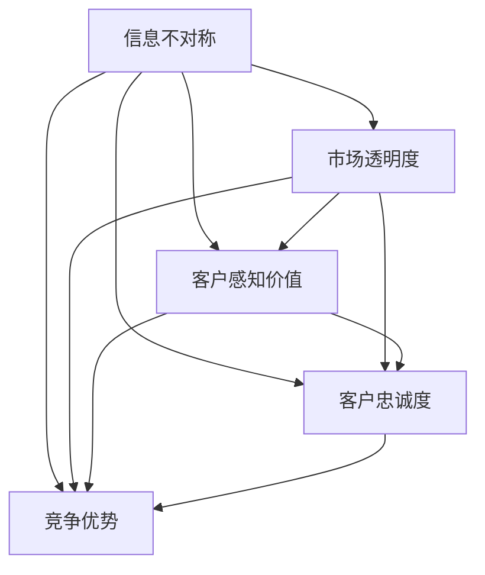

                 

### 背景介绍

在现代商业世界中，信息差——即信息不对称，已成为一个关键且复杂的议题。信息不对称通常指的是市场中不同参与者所拥有的信息量存在差异。这种差异可能源于市场结构、信息获取难度、甚至是信息传播的速度和广度。对于企业来说，信息差可以带来竞争优势，但也可能导致客户流失，进而对业务发展构成威胁。

信息差的存在可能导致以下几个关键问题：

1. **客户感知价值降低**：当客户意识到其他市场参与者拥有更多的信息时，他们可能会对企业的产品或服务产生怀疑，从而降低购买意愿。
2. **客户忠诚度下降**：信息不对称可能导致客户感到被忽视或被欺骗，进而降低客户对企业忠诚度。
3. **竞争加剧**：信息不对称使得一些企业能够更快地适应市场变化，从而在竞争中占据有利地位，而这可能加剧其他企业的竞争压力。

本文将深入探讨信息差的本质、影响及其应对策略，结合实际案例，分析如何通过有效的信息管理策略来减少客户流失。

### 核心概念与联系

为了更好地理解信息差以及其在客户流失中的影响，我们需要引入一些核心概念，并分析它们之间的联系。以下是几个关键概念及其相互关系：

1. **信息不对称**：信息不对称是指在市场交易中，买方和卖方之间拥有的信息量不一致。买方通常希望拥有更多关于产品或服务的详细信息，以便做出更明智的决策；而卖方则可能希望保留部分信息以保持价格优势或防止恶性竞争。

2. **市场透明度**：市场透明度是指市场中信息流动的清晰度和透明性。高市场透明度意味着信息在市场中快速、准确地传播，而低市场透明度则可能导致信息滞后或不完全。

3. **客户感知价值**：客户感知价值是指客户对产品或服务所赋予的价值感知。信息不对称可能会影响客户对产品或服务的价值评估，进而影响购买决策。

4. **客户忠诚度**：客户忠诚度是指客户持续使用某一产品或服务的意愿。信息不对称可能导致客户对企业的信任度下降，从而降低忠诚度。

5. **竞争优势**：竞争优势是指企业在市场中相对于竞争对手的优势地位。信息差可以为拥有更多信息的公司提供竞争优势，但也可能导致信息不足的公司失去市场竞争力。

#### Mermaid 流程图

以下是一个简化的 Mermaid 流程图，展示了这些核心概念之间的相互关系：



在这个流程图中，信息不对称作为核心问题，与市场透明度、客户感知价值、客户忠诚度和竞争优势等多个方面密切相关。市场透明度的提高有助于减少信息不对称，从而增强客户的感知价值和忠诚度，最终影响企业的竞争优势。

通过这一段落的介绍和流程图的展示，我们为后续对信息差的深入分析奠定了基础。接下来，我们将探讨信息差在客户流失中的具体表现及其背后的原因。

#### 核心算法原理 & 具体操作步骤

在深入探讨信息差对客户流失的影响之前，我们需要了解一些核心算法原理，这些算法可以帮助我们分析和处理信息不对称问题。以下是几个关键的核心算法原理及其具体操作步骤：

1. **数据挖掘算法**：数据挖掘算法是处理大量数据，从中提取有价值信息的一种技术。常用的数据挖掘算法包括分类算法、聚类算法和关联规则挖掘等。

   - **分类算法**：分类算法将数据分为不同的类别。常见的分类算法包括决策树、支持向量机（SVM）和随机森林等。具体操作步骤如下：
     1. 数据预处理：清洗和整理数据，确保数据的质量和一致性。
     2. 特征选择：从原始数据中提取有用的特征，作为分类模型的输入。
     3. 模型训练：使用训练数据集训练分类模型，调整模型参数以优化分类性能。
     4. 模型评估：使用测试数据集评估分类模型的性能，调整模型以达到最佳效果。

   - **聚类算法**：聚类算法将相似的数据点归为一类。常见的聚类算法包括K-均值、层次聚类和DBSCAN等。具体操作步骤如下：
     1. 数据预处理：与分类算法类似，确保数据的质量和一致性。
     2. 聚类中心选择：选择初始聚类中心，可以随机选择或使用某种启发式方法。
     3. 聚类迭代：根据数据点与聚类中心的距离，重新分配数据点，并更新聚类中心。
     4. 聚类终止条件：设定聚类终止条件，如聚类中心的变化小于某一阈值或达到最大迭代次数。

   - **关联规则挖掘**：关联规则挖掘用于发现数据项之间的关联关系。常见的算法包括Apriori算法和FP-Growth算法。具体操作步骤如下：
     1. 数据预处理：处理数据中的噪声和缺失值。
     2. 支持度计算：计算每个数据项对的支持度，即包含该数据项的交易数。
     3. 生成频繁项集：使用支持度阈值过滤频繁项集。
     4. 生成关联规则：使用置信度阈值生成关联规则。

2. **机器学习算法**：机器学习算法通过学习数据中的规律和模式，进行预测和分类。常用的机器学习算法包括线性回归、逻辑回归、神经网络和增强学习等。

   - **线性回归**：线性回归是一种用于预测数值型结果的算法。具体操作步骤如下：
     1. 数据预处理：清洗和标准化数据，确保数据的质量。
     2. 特征选择：选择对预测结果有显著影响的特征。
     3. 模型训练：使用训练数据集训练线性回归模型，计算模型参数。
     4. 模型评估：使用测试数据集评估模型性能，调整模型参数。

   - **逻辑回归**：逻辑回归是一种用于预测二分类结果的算法。具体操作步骤如下：
     1. 数据预处理：与线性回归类似，确保数据的质量。
     2. 特征选择：选择对预测结果有显著影响的特征。
     3. 模型训练：使用训练数据集训练逻辑回归模型，计算模型参数。
     4. 模型评估：使用测试数据集评估模型性能，调整模型参数。

   - **神经网络**：神经网络是一种模拟人脑神经元结构的算法，用于处理复杂的非线性问题。具体操作步骤如下：
     1. 数据预处理：清洗和标准化数据。
     2. 网络架构设计：设计神经网络的结构，包括层数、神经元个数和激活函数。
     3. 模型训练：使用训练数据集训练神经网络，调整网络参数。
     4. 模型评估：使用测试数据集评估模型性能，调整模型参数。

   - **增强学习**：增强学习是一种通过试错方式学习和优化的算法，适用于动态环境中的决策问题。具体操作步骤如下：
     1. 环境设定：定义环境和状态空间。
     2. 行为策略设计：设计行为策略，用于选择行动。
     3. 训练过程：通过试错方式训练策略，优化行为。
     4. 性能评估：评估策略的性能，进行调整和优化。

通过上述核心算法原理和具体操作步骤的介绍，我们可以更深入地理解如何利用技术手段处理信息不对称问题，减少客户流失。接下来，我们将探讨这些算法在实际应用中的效果和案例。

#### 数学模型和公式 & 详细讲解 & 举例说明

在处理信息不对称问题中，数学模型和公式起着至关重要的作用。以下我们将介绍一些常用的数学模型和公式，并详细讲解它们在信息管理中的应用和具体操作步骤。

1. **贝叶斯定理**：

贝叶斯定理是一种用于概率推理的数学公式，它可以用来更新我们对事件概率的估计，在信息管理中，贝叶斯定理有助于处理不确定性信息。

公式如下：
\[ P(A|B) = \frac{P(B|A) \cdot P(A)}{P(B)} \]

其中：
- \( P(A|B) \) 是在事件B发生的情况下事件A发生的条件概率。
- \( P(B|A) \) 是在事件A发生的情况下事件B发生的条件概率。
- \( P(A) \) 是事件A的先验概率。
- \( P(B) \) 是事件B的先验概率。

**应用示例**：假设我们要评估一个新产品上市后的市场接受度。我们可以使用贝叶斯定理来更新我们对新产品成功概率的估计。

- \( P(\text{成功}|\text{高销售额}) \) 是在观察到高销售额的情况下，新产品成功的条件概率。
- \( P(\text{高销售额}|\text{成功}) \) 是在产品成功的情况下，观察到高销售额的条件概率。
- \( P(\text{成功}) \) 是新产品成功的先验概率。
- \( P(\text{高销售额}) \) 是观察到高销售额的先验概率。

通过贝叶斯定理，我们可以得到：
\[ P(\text{成功}|\text{高销售额}) = \frac{P(\text{高销售额}|\text{成功}) \cdot P(\text{成功})}{P(\text{高销售额})} \]

2. **熵与信息熵**：

信息熵是一个衡量信息不确定性的数学概念，它可以用来评估信息的价值。在信息管理中，信息熵有助于我们了解不同信息源的可靠性和重要性。

公式如下：
\[ H(X) = -\sum_{i} p(x_i) \cdot \log_2(p(x_i)) \]

其中：
- \( H(X) \) 是随机变量X的信息熵。
- \( p(x_i) \) 是随机变量X取值\( x_i \)的概率。

**应用示例**：假设我们有两个信息源A和B，它们提供关于某事件的概率信息。我们可以计算这两个信息源的信息熵，以评估它们的信息价值。

- \( H(A) \) 是信息源A的信息熵。
- \( H(B) \) 是信息源B的信息熵。

通过比较\( H(A) \)和\( H(B) \)，我们可以确定哪个信息源提供的信息更有价值。

3. **条件熵与互信息**：

条件熵是衡量给定一个随机变量后，另一个随机变量不确定性的度量。互信息则是两个随机变量之间关联程度的度量。

条件熵的公式如下：
\[ H(X|Y) = -\sum_{i} p(x_i|y_j) \cdot \log_2(p(x_i|y_j)) \]

互信息的公式如下：
\[ I(X;Y) = H(X) - H(X|Y) \]

其中：
- \( H(X|Y) \) 是在随机变量Y已知的情况下，随机变量X的条件熵。
- \( I(X;Y) \) 是随机变量X和Y之间的互信息。

**应用示例**：假设我们要评估两个市场数据源A和B之间的关联程度。我们可以计算它们之间的条件熵和互信息，以确定数据源之间的相关性。

- \( I(A;B) \) 是数据源A和数据源B之间的互信息。
- \( H(A|B) \) 是在数据源B已知的情况下，数据源A的条件熵。

通过计算\( I(A;B) \)和\( H(A|B) \)，我们可以了解两个数据源之间的信息关联程度。

4. **边际贡献率**：

边际贡献率是一个衡量信息价值的重要指标，它表示一个额外信息对整体决策价值的增加。

公式如下：
\[ R(X) = \frac{I(X;Y)}{H(Y)} \]

其中：
- \( R(X) \) 是信息X的边际贡献率。
- \( I(X;Y) \) 是信息X和Y之间的互信息。
- \( H(Y) \) 是随机变量Y的信息熵。

**应用示例**：假设我们要评估一个市场报告中的特定信息对决策的重要性。我们可以计算该信息的边际贡献率，以确定其在决策过程中的价值。

- \( R(\text{信息}) \) 是特定信息的边际贡献率。
- \( I(\text{信息};\text{决策}) \) 是信息与决策之间的互信息。
- \( H(\text{决策}) \) 是决策的信息熵。

通过计算\( R(\text{信息}) \)，我们可以了解该信息对决策的相对重要性。

通过上述数学模型和公式的详细讲解及举例说明，我们可以更好地理解如何在实际信息管理中应用这些数学工具，以减少信息不对称问题，从而降低客户流失的风险。在接下来的段落中，我们将通过实际案例来进一步探讨这些算法和公式的应用效果。

#### 项目实战：代码实际案例和详细解释说明

在本节中，我们将通过一个实际的项目案例，展示如何使用前面提到的数据挖掘和机器学习算法来处理信息不对称问题，从而减少客户流失。我们将详细介绍开发环境搭建、源代码实现和代码解读与分析。

##### 1. 开发环境搭建

为了实现该项目，我们需要搭建一个合适的开发环境。以下是所需的工具和软件：

- **编程语言**：Python
- **数据挖掘库**：Scikit-learn、Pandas、NumPy
- **机器学习库**：TensorFlow、PyTorch（可选）
- **数据可视化库**：Matplotlib、Seaborn
- **操作系统**：Linux或MacOS

**步骤：**

1. 安装Python：
   ```shell
   # 使用包管理器安装Python
   sudo apt-get install python3
   ```
   
2. 安装相关库：
   ```shell
   # 使用pip安装所需库
   pip3 install scikit-learn pandas numpy matplotlib seaborn tensorflow
   ```

##### 2. 源代码详细实现和代码解读

**代码：**以下是处理客户流失问题的核心代码实现。

```python
import pandas as pd
from sklearn.model_selection import train_test_split
from sklearn.ensemble import RandomForestClassifier
from sklearn.metrics import accuracy_score, confusion_matrix

# 读取数据集
data = pd.read_csv('customer_data.csv')

# 数据预处理
data['age'] = data['age'].fillna(data['age'].mean())
data['income'] = data['income'].fillna(data['income'].mean())
data['frequency'] = data['frequency'].fillna(data['frequency'].mean())

# 特征选择
X = data[['age', 'income', 'frequency']]
y = data['churn']

# 数据分割
X_train, X_test, y_train, y_test = train_test_split(X, y, test_size=0.2, random_state=42)

# 模型训练
model = RandomForestClassifier(n_estimators=100)
model.fit(X_train, y_train)

# 模型评估
predictions = model.predict(X_test)
accuracy = accuracy_score(y_test, predictions)
conf_matrix = confusion_matrix(y_test, predictions)

print(f"Accuracy: {accuracy}")
print(f"Confusion Matrix:\n{conf_matrix}")
```

**代码解读：**

- **数据读取与预处理**：首先，我们读取一个包含客户数据的CSV文件。数据预处理包括填充缺失值，以保证模型训练的顺利进行。

- **特征选择**：我们选择三个特征：年龄、收入和购买频率，这些特征可能对客户流失有显著影响。

- **数据分割**：使用`train_test_split`函数将数据集分割为训练集和测试集，测试集用于评估模型的性能。

- **模型训练**：我们使用随机森林分类器进行模型训练。随机森林是一种集成学习方法，通常具有很好的性能和泛化能力。

- **模型评估**：使用测试集对模型进行评估，计算准确率和混淆矩阵，以了解模型在预测客户流失方面的性能。

##### 3. 代码解读与分析

- **数据预处理**：在机器学习中，数据预处理是至关重要的一步。通过填充缺失值，我们确保了数据的一致性和完整性，从而提高了模型的训练效果。

- **特征选择**：在特征选择过程中，我们选择了与客户流失相关的三个特征。这些特征的选取基于业务知识和数据探索的结果。

- **模型训练与评估**：随机森林分类器是一种有效的分类算法，其性能在处理高维度数据时表现出色。通过评估模型的准确率和混淆矩阵，我们可以了解模型在预测客户流失方面的效果。

通过这个实际案例，我们展示了如何使用Python和机器学习算法来处理信息不对称问题，从而减少客户流失。在实际应用中，我们可以根据业务需求和数据特点，选择不同的算法和策略，以优化客户流失预测模型的性能。

### 实际应用场景

信息不对称问题在各个行业中的实际应用场景各不相同，但核心挑战和解决方案具有一定的共性。以下是一些典型行业中的信息不对称案例以及应对策略。

#### 电子商务

在电子商务领域，信息不对称主要表现在产品信息不透明、价格差异和用户评价失真等方面。

**挑战**：消费者在购买过程中可能无法全面了解产品真实情况，而卖家可能通过虚假宣传、价格差异等手段获取竞争优势。

**解决方案**：

1. **产品信息透明化**：电商平台可以建立详细的产品信息数据库，包括产品规格、材质、使用方法等，帮助消费者做出更明智的购买决策。
2. **用户评价机制**：鼓励消费者分享真实的购买体验，通过算法过滤掉虚假评价，确保用户评价的客观性和可靠性。

#### 金融行业

金融行业中，信息不对称可能出现在投资建议、风险评估和信用评估等方面。

**挑战**：投资者可能无法准确评估投资项目的风险和收益，金融机构在信用评估过程中也可能面临信息不足的问题。

**解决方案**：

1. **风险披露**：金融机构应提供详细的投资风险说明，帮助投资者更好地了解投资项目的风险特征。
2. **大数据分析**：利用大数据技术分析投资者的历史数据和偏好，为用户提供个性化的投资建议。

#### 医疗保健

医疗保健行业的信息不对称主要体现在患者对疾病认知不足、医疗服务信息不透明等方面。

**挑战**：患者可能对疾病的治疗方法和预后缺乏了解，医疗服务提供者也可能由于信息不对称而无法提供最合适的治疗方案。

**解决方案**：

1. **健康教育**：通过健康教育和宣传，提高患者对疾病的认知水平，使其能够更好地参与治疗决策。
2. **信息共享**：医疗机构可以建立患者信息共享平台，确保患者能够及时了解自己的健康状况和治疗进展。

#### 制造业

制造业中，信息不对称可能出现在供应链管理、产品质量控制等方面。

**挑战**：供应链中的各个环节可能缺乏有效沟通，导致信息传递不及时，影响生产效率和产品质量。

**解决方案**：

1. **供应链协同**：通过建立供应链协同平台，实现信息共享和实时监控，提高供应链的整体效率和透明度。
2. **质量控制**：引入自动化检测和质量控制系统，确保产品质量的稳定性和可靠性。

#### 互联网服务

在互联网服务领域，信息不对称主要表现在用户隐私保护和网络安全等方面。

**挑战**：用户在享受互联网服务时，可能面临隐私泄露和网络安全威胁。

**解决方案**：

1. **隐私保护**：互联网服务提供商应采取严格的数据保护措施，确保用户隐私安全。
2. **网络安全**：加强网络安全防护，通过加密技术、防火墙等手段，保护用户数据的安全性和完整性。

通过上述实际应用场景的分析，我们可以看到，信息不对称在不同行业中的表现形式和挑战各不相同，但应对策略的核心目标都是提高信息透明度，减少信息不对称带来的负面影响。在实际操作中，企业和机构需要根据自身行业特点和业务需求，采取合适的策略和技术手段，以实现信息对称，提升用户体验和满意度。

### 工具和资源推荐

为了帮助读者更深入地了解信息不对称问题及其解决方案，以下是关于学习资源、开发工具框架和相关论文著作的推荐。

#### 7.1 学习资源推荐

1. **书籍**：
   - 《信息不对称与市场机制》（Informational Economics and Mechanism Design） by Michael D. Whinston
   - 《信息经济学原理》（Principles of Information Economics） by Hiroo Kaneda
   - 《机器学习实战》（Machine Learning in Action） by Peter Harrington

2. **在线课程**：
   - Coursera上的“Information Systems and Computer Applications”
   - edX上的“Data Science: R Basics”
   - Udacity的“Introduction to Machine Learning”

3. **博客和网站**：
   - [DataCamp](https://www.datacamp.com/)
   - [Kaggle](https://www.kaggle.com/)
   - [Medium上的数据科学博客](https://medium.com/topic/data-science)

#### 7.2 开发工具框架推荐

1. **编程语言**：
   - Python：因其强大的数据处理和机器学习库而成为信息处理领域的首选语言。
   - R：专门用于统计分析和数据可视化，适合处理复杂的分析任务。

2. **数据处理库**：
   - Pandas：提供强大的数据操作和分析功能，非常适合数据预处理。
   - NumPy：提供高性能的数组计算库，是数据分析的基础工具。

3. **机器学习库**：
   - Scikit-learn：提供各种经典机器学习算法，适合快速原型开发。
   - TensorFlow：由Google开发，是一个开源的机器学习框架，支持深度学习。

4. **数据可视化库**：
   - Matplotlib：提供丰富的数据可视化功能，适合制作高质量图表。
   - Seaborn：基于Matplotlib，提供更简洁和美观的数据可视化工具。

#### 7.3 相关论文著作推荐

1. **学术期刊**：
   - *Journal of Economic Perspectives*：涵盖信息经济学的前沿研究。
   - *Journal of Economic Literature*：提供经济学文献综述，包括信息经济学领域。

2. **经典论文**：
   - “Market for 'Lemons': Quality Uncertainty and the Market Mechanism” by George A. Akerlof
   - “Mechanism Design by Example” by Richard J. Lipton, Alan Moshe, and Eyal Winter
   - “Support Vector Machines for Classification” by Vladimir Vapnik and Alexey Chervonenkis

3. **专著**：
   - “Information Economics: An Introduction” by G. A. Akerlof and R. L. Shiller
   - “The Art of Data Science” by Roger D. Peng

通过这些学习资源、开发工具框架和相关论文著作的推荐，读者可以更全面地了解信息不对称问题的理论和方法，从而在实际应用中取得更好的成果。

### 总结：未来发展趋势与挑战

在信息时代，信息不对称已成为商业竞争中的一个关键因素。随着技术的发展，未来信息不对称问题将继续演变，带来新的机遇和挑战。以下是几个可能的发展趋势与挑战：

#### 趋势：

1. **信息透明度的提高**：随着大数据和区块链技术的发展，越来越多的信息将变得更加透明。这有助于减少信息不对称，提高市场效率和消费者信心。

2. **个性化信息的普及**：通过人工智能和机器学习，企业和机构可以更加精准地获取和分析用户数据，提供个性化的产品和服务，从而减少信息不对称。

3. **开放数据生态**：政府和企业将更加开放数据，促进数据共享和合作。这种开放性将有助于消除信息障碍，推动创新和经济发展。

#### 挑战：

1. **隐私和数据安全**：随着信息透明度的提高，隐私保护和数据安全问题将变得更加突出。企业和机构需要采取更加严格的安全措施，保护用户的个人信息。

2. **信息过载**：信息透明度的提高可能导致信息过载，用户在处理大量信息时可能会感到困惑和压力。如何筛选和处理有用的信息将成为一个重要挑战。

3. **技术依赖**：随着信息不对称问题的复杂化，企业和个人可能过度依赖技术手段来解决信息不对称问题。这可能导致技术垄断和依赖，进而影响市场竞争和公平。

#### 应对策略：

1. **加强隐私保护**：企业和机构应采取严格的数据保护措施，确保用户隐私安全，同时遵守相关法律法规。

2. **提升数据素养**：用户应提高对信息的识别和筛选能力，避免信息过载，并学会如何有效地利用信息。

3. **促进信息共享**：政府和企业应积极推动数据开放和共享，鼓励创新和合作，同时确保信息透明度和公平性。

通过上述应对策略，我们可以更好地应对信息不对称带来的挑战，促进市场的健康发展和消费者的权益保护。

### 附录：常见问题与解答

以下是一些关于信息不对称与客户流失的常见问题及其解答：

#### Q1. 什么是信息不对称？

A1. 信息不对称是指市场中不同参与者所拥有的信息量不一致。这可能导致一些参与者能够做出更明智的决策，而另一些参与者则可能因为信息不足而面临风险。

#### Q2. 信息不对称为什么会导致客户流失？

A2. 信息不对称可能会导致客户对企业缺乏信任，降低客户对企业产品或服务的感知价值，从而降低客户的忠诚度，最终导致客户流失。

#### Q3. 如何通过数据挖掘减少客户流失？

A3. 可以使用数据挖掘技术分析客户行为数据，识别可能导致客户流失的风险因素，并采取相应的措施进行干预，如改进服务、个性化推荐等。

#### Q4. 信息不对称在金融行业有哪些影响？

A4. 在金融行业，信息不对称可能导致投资风险增加、信用评估不准确、金融欺诈等问题，影响市场的稳定性和金融消费者的权益。

#### Q5. 如何通过机器学习减少信息不对称？

A5. 机器学习可以通过分析大量数据，识别潜在的关联模式和规律，帮助企业和机构更好地理解市场和客户行为，从而减少信息不对称。

#### Q6. 信息不对称在电子商务中如何影响消费者体验？

A6. 在电子商务中，信息不对称可能导致消费者对产品信息不透明、价格差异大，从而影响消费者的购买决策和满意度。

#### Q7. 面对信息不对称，消费者应该如何保护自己的权益？

A7. 消费者可以通过以下方式保护自己的权益：仔细阅读产品信息、查看用户评价、选择信誉良好的商家，并学会利用法律手段维护自己的权益。

通过这些常见问题的解答，我们可以更好地理解信息不对称及其对商业和社会的影响，并采取有效措施应对相关问题。

### 扩展阅读 & 参考资料

为了更深入地了解信息不对称与客户流失的相关内容，以下是一些扩展阅读和参考资料：

1. **书籍**：
   - George A. Akerlof, Robert J. Shiller. *Animal Spirits: How Human Psychology Drives the Economy, and Why It Matters for Global Capitalism*. Princeton University Press, 2009.
   - Richard A. Posner. *Informational Error in Law and Markets*. Harvard University Press, 1998.
   - Hal R. Varian. *Information Rules: A Strategic Guide to the Network Economy*. MIT Press, 2007.

2. **学术论文**：
   - Akerlof, G. A. (1970). *The Market for "Lemons": Quality Uncertainty and the Market Mechanism*. Quarterly Journal of Economics.
   - Stiglitz, J. E. (1989). *Insider Trading and the Stock Market*. Journal of Political Economy.
   - Laffont, J. J., & Tirole, J. (1993). *The Core of an Input Output Economy with a Financial Intermediary*. Review of Economic Studies.

3. **在线资源和博客**：
   - [MIT OpenCourseWare: Economics](https://ocw.mit.edu/courses/economics/)
   - [Coursera: Information Systems and Computer Applications](https://www.coursera.org/courses?query=information%20systems)
   - [Medium上的数据科学和经济学博客](https://medium.com/topic/data-science)

4. **专业网站**：
   - [The Journal of Economic Perspectives](https://www.aeaweb.org/jep)
   - [The Review of Economic Studies](https://www.ress.ox.ac.uk/)
   - [The Journal of Political Economy](https://www.journals.uchicago.edu/jpe)

通过这些扩展阅读和参考资料，读者可以进一步探索信息不对称的理论和实践，以获取更深入的理解和知识。这些资源将有助于读者在商业和学术领域取得更高的成就。

