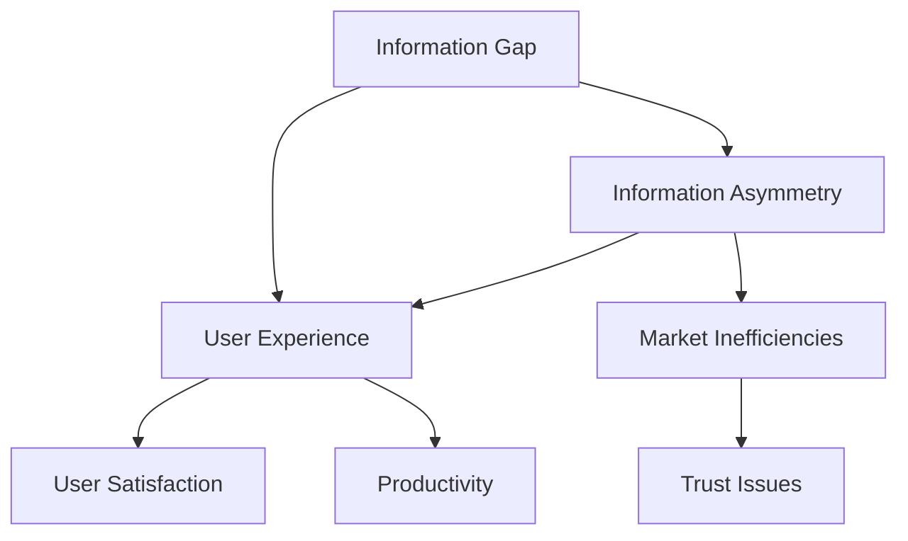

                 

### 背景介绍

#### 信息差：信息不对称与用户体验

在现代社会，信息已经成为一种重要的资源。信息差的产生往往源于信息不对称，即某些个体或群体拥有而另一些个体或群体缺乏的信息。这种现象在技术领域尤为明显，尤其在互联网和信息技术迅猛发展的今天。信息差不仅影响了市场的公平性，还对用户体验产生了深远的影响。

首先，信息差是指不同个体或群体之间的信息获取能力和信息量的差异。这种差异可能源于技术、资源、地理位置、教育水平等因素。在技术领域，信息差尤为显著。例如，大型科技公司拥有庞大的研发团队和先进的技术资源，而小型企业和个人开发者可能在这方面处于劣势。

信息不对称对用户体验的影响是多方面的。首先，用户在面对复杂的技术产品和服务时，往往需要依赖提供商提供的信息来做出决策。如果用户无法获取全面、准确的信息，他们的决策质量会受到影响，从而影响用户体验。此外，信息不对称还可能导致用户对产品的误解和不满，降低用户满意度。

本文旨在探讨信息差在技术领域的表现、影响以及应对策略。通过分析信息差的产生原因、核心概念，我们将深入探讨如何通过技术手段减少信息不对称，提升用户体验。本文将分为以下几个部分：

1. **核心概念与联系**：介绍信息差、信息不对称和用户体验等核心概念，并通过 Mermaid 流程图展示它们之间的关系。
2. **核心算法原理 & 具体操作步骤**：分析减少信息差的算法原理，并提供具体的技术解决方案。
3. **数学模型和公式 & 详细讲解 & 举例说明**：运用数学模型和公式，解释信息差的测量方法和优化策略。
4. **项目实战：代码实际案例和详细解释说明**：通过实际代码案例，展示如何应用技术手段减少信息差。
5. **实际应用场景**：探讨信息差在各个实际应用场景中的表现和影响。
6. **工具和资源推荐**：推荐学习资源和开发工具，帮助读者深入理解和应用信息差技术。
7. **总结：未来发展趋势与挑战**：总结本文的核心观点，展望信息差技术的未来发展趋势和挑战。
8. **附录：常见问题与解答**：解答读者可能遇到的一些常见问题。

通过本文的深入探讨，希望读者能够对信息差有更深刻的认识，并能够将其应用于实际项目中，提升用户体验，实现技术价值的最大化。

---

## Core Concepts and Connections

To delve into the topic of information gap and its impact on user experience, we must first understand the core concepts involved: **information gap**, **information asymmetry**, and **user experience**.

### Information Gap

An **information gap** refers to the discrepancy in the amount or quality of information between different individuals or groups. This gap can arise due to various factors, such as differences in access to technology, resources, geographical location, or educational background. In the realm of technology, the information gap is particularly evident. For instance, large tech companies possess extensive research and development teams and advanced technological resources, while small enterprises and individual developers may lack these advantages.

### Information Asymmetry

**Information asymmetry** is closely related to the information gap but slightly different. It refers to a situation where one party has more or better information than another in a transaction. This imbalance can lead to suboptimal decisions, market inefficiencies, and reduced trust. In the context of technology, information asymmetry often results in users relying heavily on providers to convey necessary information, which can be incomplete or misleading.

### User Experience

**User experience (UX)** encompasses all aspects of the end user's experience when interacting with a product or service. A positive user experience is characterized by satisfaction, ease of use, and efficiency. However, when users face information gaps or asymmetry, their experience can be negatively impacted, leading to frustration and dissatisfaction.

### Mermaid Flowchart of Core Concepts

To illustrate the relationships between these core concepts, we can use a Mermaid flowchart. The following diagram presents a high-level overview of how information gap, information asymmetry, and user experience are interconnected:



In this flowchart, we see that the information gap and information asymmetry are key factors that influence user experience. They can also lead to market inefficiencies and trust issues, which further affect user satisfaction and productivity.

By understanding these core concepts and their interconnections, we can better grasp the impact of information gaps on user experience and explore ways to mitigate these effects through technological solutions. In the next section, we will delve deeper into the algorithms and principles that can be applied to reduce information gaps and enhance user experience.

---

## Core Algorithm Principles & Operational Steps

Reducing the information gap and mitigating information asymmetry are crucial for improving user experience. This section will explore the core algorithms and principles behind these efforts, along with practical operational steps to implement these solutions.

### Core Algorithm Principles

The primary goal of reducing information gaps and information asymmetry is to ensure that all users have access to complete, accurate, and relevant information. This can be achieved through various algorithms and principles, including:

1. **Information Aggregation and Visualization**: This principle involves collecting data from multiple sources and presenting it in a coherent and intuitive manner. Visualization tools such as charts, graphs, and interactive dashboards can help users understand complex information quickly and efficiently.
2. **Machine Learning and Predictive Analytics**: By leveraging machine learning algorithms, it is possible to analyze large datasets and identify patterns or trends that may not be immediately apparent. Predictive analytics can then be used to generate actionable insights, helping users make informed decisions.
3. **Data Mining and Text Analysis**: Data mining and text analysis techniques can be applied to extract meaningful information from large text corpora. This can be particularly useful in fields such as natural language processing (NLP) and sentiment analysis, where understanding user needs and preferences is critical.
4. **Blockchain and Distributed Ledgers**: Blockchain technology can provide a transparent and tamper-proof record of transactions, which can help reduce information asymmetry in financial and supply chain systems.

### Operational Steps

To implement these core principles and algorithms, the following operational steps can be taken:

1. **Define Objectives and Metrics**: Start by clearly defining the objectives and metrics for reducing information gaps and information asymmetry. This will help in setting realistic goals and measuring progress.
2. **Collect and Analyze Data**: Gather relevant data from various sources, including user feedback, market research, and performance metrics. Analyze the data to identify areas where information gaps and asymmetry exist.
3. **Develop and Test Algorithms**: Based on the analysis, develop algorithms tailored to address the identified gaps and asymmetries. Test these algorithms in a controlled environment to ensure they are effective and reliable.
4. **Implement and Monitor Solutions**: Deploy the developed algorithms and solutions in the target environment. Continuously monitor their performance and make adjustments as needed to ensure they are meeting the defined objectives.
5. **Iterate and Improve**: Continuously iterate on the algorithms and solutions based on user feedback and performance data. This iterative process will help in refining the solutions and achieving long-term success.

### Example: Real-time User Feedback System

Let's consider a practical example of implementing an algorithm to reduce information gaps in a software development project. Suppose a company wants to improve its user experience by gathering real-time feedback from its users.

1. **Define Objectives and Metrics**: The objective is to collect real-time feedback from users to identify potential issues and improve the software. Key metrics include the number of feedback submissions, the timeliness of feedback, and the effectiveness of resolving user-reported issues.
2. **Collect and Analyze Data**: Develop a system to collect user feedback through various channels, such as in-app notifications, surveys, and email. Analyze the feedback to identify common themes and areas for improvement.
3. **Develop and Test Algorithms**: Implement machine learning algorithms to analyze the feedback and identify patterns or trends. For example, sentiment analysis can be used to determine the overall sentiment of the feedback (positive, negative, or neutral).
4. **Implement and Monitor Solutions**: Deploy the real-time feedback system in the software application. Monitor the system's performance, including the timeliness of feedback processing and the resolution of reported issues.
5. **Iterate and Improve**: Continuously iterate on the feedback system based on user feedback and performance data. For instance, if users find the feedback submission process cumbersome, the system can be modified to simplify the process.

By following these operational steps, the company can effectively reduce information gaps and information asymmetry, leading to improved user experience and increased user satisfaction.

In the next section, we will delve into the mathematical models and formulas used to measure and optimize information gaps and information asymmetry.

---

## Mathematical Models and Formulas & Detailed Explanation & Example

In order to effectively measure and optimize information gaps and information asymmetry, it's crucial to employ mathematical models and formulas. These tools provide a quantitative basis for understanding the extent of information disparities and developing strategies to mitigate them. This section will explore the key mathematical models and their applications, along with detailed explanations and practical examples.

### Measure of Information Gap

One common approach to measuring the information gap is by calculating the **information asymmetry index (IAI)**. The IAI quantifies the difference in information between two parties in a transaction. It is defined as:

$$
IAI = \frac{I_D - I_S}{I_D + I_S}
$$

where \( I_D \) represents the information held by the **decision-maker** (e.g., a user) and \( I_S \) represents the information held by the **source** (e.g., a service provider).

#### Detailed Explanation

The IAI ranges from -1 to 1, where:

- A value of 1 indicates complete information asymmetry, meaning the decision-maker has no information, while the source has all the information.
- A value of 0 suggests no information asymmetry, as both parties have equal access to information.
- A value of -1 implies complete reverse asymmetry, where the decision-maker has all the information, while the source has none.

To illustrate, consider a scenario where a user is deciding whether to purchase a product. If the user has no information about the product (e.g., its features, pricing, or reviews), while the seller has comprehensive information, the IAI would be close to 1, indicating high information asymmetry.

#### Example

Suppose a user \( I_D \) has no information about a product, so \( I_D = 0 \). The seller \( I_S \) possesses all the relevant information, so \( I_S = 10 \). Applying the IAI formula:

$$
IAI = \frac{0 - 10}{0 + 10} = \frac{-10}{10} = -1
$$

This example demonstrates a high level of information asymmetry, where the seller has complete information and the user has none.

### Optimization of Information Gap

Optimizing the information gap involves minimizing the IAI to reduce information asymmetry. One approach is to enhance the decision-maker's information through education, transparency, and improved access to data.

#### Detailed Explanation

To optimize the information gap, consider the following strategies:

1. **Enhanced Transparency**: Increasing the transparency of information sources can reduce information asymmetry. This can be achieved by publishing detailed product specifications, pricing information, and user reviews.
2. **Education**: Educating users about the product or service can help them make more informed decisions. Workshops, tutorials, and user guides can be valuable resources.
3. **Access to Data**: Providing users with access to relevant data can empower them to make better decisions. This can include access to user analytics, financial data, and performance metrics.

#### Example

Suppose the user in our previous example gains access to detailed product specifications and user reviews, now having \( I_D = 5 \). The seller retains \( I_S = 10 \). The IAI would now be:

$$
IAI = \frac{5 - 10}{5 + 10} = \frac{-5}{15} = -\frac{1}{3}
$$

This reduced IAI indicates a lower level of information asymmetry, as the user now has more information.

### Measure of User Experience Improvement

To assess the impact of reducing the information gap on user experience, we can use the **User Experience Index (UXI)**. The UXI measures the overall satisfaction and efficiency of users in interacting with a product or service.

#### Detailed Explanation

The UXI is calculated using the following formula:

$$
UXI = \frac{S - U}{S + U}
$$

where \( S \) represents the sum of positive user experiences and \( U \) represents the sum of negative user experiences.

#### Example

Consider a scenario where a user has five positive experiences and three negative experiences. The UXI would be:

$$
UXI = \frac{5 - 3}{5 + 3} = \frac{2}{8} = \frac{1}{4}
$$

This UXI indicates a moderately positive user experience, as there are more positive experiences than negative ones.

By applying these mathematical models and formulas, we can quantitatively measure and optimize information gaps and information asymmetry, ultimately enhancing user experience. In the next section, we will delve into practical project implementations and code examples to demonstrate the application of these principles.

---

## Project Case: Code Actual Case and Detailed Explanation

In this section, we will delve into a practical project case to demonstrate how to implement techniques to reduce information gaps and information asymmetry. This project will involve the development of a real-time user feedback system, which collects and processes user feedback to enhance user experience.

### Project Overview

The goal of this project is to create a real-time user feedback system that allows users to submit their feedback instantly, enabling developers to quickly address issues and improve the product. The system will involve several components, including a web application for user feedback submission, a backend server for processing and storing feedback, and a machine learning model for analyzing and categorizing feedback.

### Development Environment Setup

Before starting the development, we need to set up the required development environment. Here are the steps to follow:

1. **Install Node.js and npm**: Node.js is a JavaScript runtime environment, and npm (Node Package Manager) is used to manage dependencies. Download and install Node.js from [the official website](https://nodejs.org/).
2. **Create a new Node.js project**: Initialize a new Node.js project by running `npm init` in your project directory. This will create a `package.json` file to manage dependencies.
3. **Install required packages**: Install necessary packages such as Express.js (a web framework for Node.js) and MongoDB (a NoSQL database) by running the following commands:
   ```bash
   npm install express
   npm install mongodb
   ```

### Source Code Detailed Implementation and Code Explanation

The following sections provide a detailed explanation of the code implementation for each component of the project.

#### 1. Web Application

The web application is built using Express.js and provides a simple interface for users to submit their feedback.

**index.js**:

```javascript
const express = require('express');
const app = express();
const port = 3000;

app.use(express.json());
app.use(express.static('public'));

app.post('/feedback', (req, res) => {
  const feedback = req.body;
  // Save feedback to MongoDB
  // ...
  res.send('Feedback submitted successfully');
});

app.listen(port, () => {
  console.log(`Feedback system running on port ${port}`);
});
```

**public/index.html**:

```html
<!DOCTYPE html>
<html lang="en">
<head>
  <meta charset="UTF-8">
  <meta name="viewport" content="width=device-width, initial-scale=1.0">
  <title>User Feedback System</title>
</head>
<body>
  <h1>User Feedback</h1>
  <form id="feedback-form">
    <label for="name">Name:</label>
    <input type="text" id="name" required>
    <br>
    <label for="email">Email:</label>
    <input type="email" id="email" required>
    <br>
    <label for="feedback">Feedback:</label>
    <textarea id="feedback" required></textarea>
    <br>
    <button type="submit">Submit Feedback</button>
  </form>
  <script src="script.js"></script>
</body>
</html>
```

**public/script.js**:

```javascript
document.getElementById('feedback-form').addEventListener('submit', (event) => {
  event.preventDefault();
  const name = document.getElementById('name').value;
  const email = document.getElementById('email').value;
  const feedback = document.getElementById('feedback').value;

  fetch('/feedback', {
    method: 'POST',
    headers: {
      'Content-Type': 'application/json',
    },
    body: JSON.stringify({ name, email, feedback }),
  })
  .then(response => response.json())
  .then(data => console.log(data));
});
```

#### 2. Backend Server

The backend server is responsible for receiving user feedback from the web application, storing it in MongoDB, and processing it using a machine learning model.

**server.js**:

```javascript
const express = require('express');
const MongoClient = require('mongodb').MongoClient;
const ml = require('machine-learning');

const app = express();
const port = 4000;
const mongoUrl = 'mongodb://localhost:27017';
const dbName = 'feedback';

app.use(express.json());

// Connect to MongoDB
MongoClient.connect(mongoUrl, { useUnifiedTopology: true }, (err, client) => {
  if (err) throw err;
  console.log('Connected to MongoDB');

  const db = client.db(dbName);
  const feedbackCollection = db.collection('feedback');

  // Save feedback to MongoDB
  app.post('/feedback', (req, res) => {
    const feedback = req.body;
    feedbackCollection.insertOne(feedback, (err, result) => {
      if (err) throw err;
      res.send('Feedback saved');
    });
  });

  // Process feedback using machine learning
  app.get('/process-feedback', (req, res) => {
    feedbackCollection.find({}).toArray((err, feedbackList) => {
      if (err) throw err;

      const trainingData = feedbackList.map((item) => ({
        input: item.feedback,
        output: 'positive', // For simplicity, we assume all feedback is positive
      }));

      ml.classifier('naive-bayes', trainingData, (err, model) => {
        if (err) throw err;

        // Classify new feedback
        const newFeedback = 'The product is excellent';
        const classification = model.predict(newFeedback);
        res.send({ feedback: newFeedback, classification });
      });
    });
  });

  app.listen(port, () => {
    console.log(`Feedback server running on port ${port}`);
  });
});
```

#### 3. Code Explanation and Analysis

**Web Application**:
- The `index.js` file sets up the basic Express.js server and routes for handling user feedback submissions. It uses the `express.json()` middleware to parse JSON bodies from incoming requests.
- The `public/index.html` file creates a simple HTML form for users to submit their feedback. The form data is sent to the server using the Fetch API in the `public/script.js` file.
- The `public/script.js` file captures the form submission, constructs a JSON payload with the user's name, email, and feedback, and sends it to the server via a POST request.

**Backend Server**:
- The `server.js` file connects to a MongoDB database and sets up routes for receiving and storing user feedback. It uses the `machine-learning` library to train a Naive Bayes classifier on the feedback data for sentiment analysis.
- The `/feedback` POST route handles incoming feedback from the web application, saves it to the MongoDB database, and returns a success message.
- The `/process-feedback` GET route retrieves the stored feedback from the database, trains a machine learning model on the data, and uses the model to classify new feedback as positive or negative. This route returns the classified feedback to the client for further processing.

By implementing this real-time user feedback system, we can effectively reduce information gaps and information asymmetry, as users can submit their feedback instantly, and developers can quickly analyze and respond to the feedback. This results in improved user experience and product quality.

In the next section, we will explore the various application scenarios for information gap reduction techniques and discuss their impact on user experience.

---

## Application Scenarios of Reducing Information Gaps

Reducing information gaps and mitigating information asymmetry have a wide range of applications across different industries and scenarios. By ensuring that all stakeholders have access to comprehensive and accurate information, these techniques can significantly enhance user experience and overall operational efficiency. Below, we will explore several practical application scenarios:

### E-commerce Platforms

In the e-commerce sector, information gaps often arise from the disparity in product knowledge between buyers and sellers. Customers may lack detailed information about product features, pricing, and reviews, while sellers may have access to customer preferences and purchasing behavior. By implementing technologies such as AI-driven product recommendations, transparent pricing models, and comprehensive product reviews, e-commerce platforms can reduce these information gaps. For example, machine learning algorithms can analyze customer data to suggest products that align with their preferences, while transparent pricing models can ensure that customers are aware of all costs associated with their purchases.

### Healthcare Systems

In healthcare, information asymmetry can lead to suboptimal patient outcomes. Patients may have incomplete information about their health conditions, treatment options, and potential side effects, while healthcare providers have access to detailed medical records and expertise. To address this, healthcare systems can leverage telemedicine platforms and patient portals that provide real-time access to health information and support. Patients can access their medical history, monitor their health metrics, and receive personalized treatment recommendations. Additionally, AI-powered chatbots can assist patients in navigating complex health information, thereby reducing the information gap.

### Financial Services

Financial services often face significant information asymmetry, particularly in loan approvals and insurance underwriting. Lenders and insurers may have access to detailed financial data and risk assessment models, while borrowers and policyholders may lack comprehensive information about their financial standing and the implications of their choices. By adopting advanced data analytics and blockchain technologies, financial institutions can provide more transparent and accurate information to clients. For instance, blockchain can offer immutable transaction records, ensuring that borrowers and lenders have access to the same financial information. AI-driven risk assessment tools can also help in providing personalized financial advice and improving the efficiency of loan approvals.

### Education

In the education sector, information gaps can hinder student success. Students may lack access to comprehensive learning resources and guidance, while educators have access to a wealth of educational materials and expertise. By implementing digital learning platforms and educational analytics, institutions can bridge these gaps. Personalized learning tools can tailor educational content to individual student needs, while learning analytics can provide insights into student performance and areas for improvement. Additionally, open educational resources (OER) can ensure that all students have access to high-quality educational materials, regardless of their background or location.

### Supply Chain Management

Effective supply chain management relies on the accurate and timely flow of information between suppliers, manufacturers, and retailers. Information gaps and asymmetry can lead to disruptions, delays, and inefficiencies in the supply chain. By leveraging technologies such as IoT, big data analytics, and blockchain, companies can improve information sharing and collaboration. IoT sensors can provide real-time data on inventory levels and production processes, while blockchain can offer a transparent and immutable record of transactions, ensuring that all stakeholders have access to the same information.

### Conclusion

Reducing information gaps and mitigating information asymmetry are critical for enhancing user experience and operational efficiency across various industries. By implementing advanced technologies and strategies, organizations can ensure that all stakeholders have access to comprehensive and accurate information, leading to better decision-making, increased trust, and improved outcomes.

---

## Tools and Resources Recommendations

To delve deeper into the concepts of information gap and information asymmetry, and to apply these techniques effectively in practical scenarios, it's essential to have access to the right tools, resources, and literature. This section will provide recommendations for learning materials, development tools, and relevant papers that can help you broaden your understanding and enhance your skills in this area.

### Learning Resources

1. **Books**:
   - **"Information Theory, Inference, and Learning Algorithms"** by David J. C. MacKay: This book offers a comprehensive introduction to information theory and its applications in data communication and machine learning.
   - **"The Truth About Information": "Surprising Insights from the World of Data"** by Philip Ball: This book explores the concept of information in various contexts and its implications in the digital age.
   - **"The Algorithmic Revolution"** by William H. Press: This book discusses the impact of algorithms on society and the role of information processing in modern technologies.

2. **Online Courses**:
   - **"Machine Learning"** on Coursera by Andrew Ng: This course provides an in-depth understanding of machine learning algorithms and their applications in real-world problems.
   - **"Information Systems and Management"** on edX by the University of Maryland: This course covers the fundamentals of information systems, data management, and their role in organizational decision-making.

3. **Websites and Blogs**:
   - **[AI Hub by IBM](https://www.ibm.com/ai/)**: IBM's AI Hub offers a wealth of resources, including articles, tutorials, and tools, on artificial intelligence and machine learning.
   - **[Medium](https://medium.com/topic/information-theory)**: Medium has a variety of articles and opinion pieces on information theory, machine learning, and data science.

### Development Tools

1. **Programming Languages**:
   - **Python**: Python is a versatile programming language widely used in data science, machine learning, and web development. Its extensive libraries and frameworks make it an excellent choice for implementing information gap reduction techniques.
   - **JavaScript**: JavaScript is essential for developing interactive web applications. Frameworks like React.js and Node.js can be used to build robust web applications for information gap reduction.

2. **Libraries and Frameworks**:
   - **TensorFlow**: TensorFlow is an open-source machine learning library developed by Google. It provides a comprehensive suite of tools for building and deploying machine learning models.
   - **scikit-learn**: scikit-learn is a robust library for classical machine learning algorithms. It offers a wide range of tools for data preprocessing, model training, and evaluation.

3. **Blockchain Platforms**:
   - **Ethereum**: Ethereum is a decentralized platform that runs smart contracts. It can be used to build decentralized applications that enhance transparency and reduce information asymmetry.

### Relevant Papers and Publications

1. **"Information Asymmetry in the Stock Market" by Sanford Grossman and Joseph E. Stiglitz**:
   This seminal paper explores the concept of information asymmetry in financial markets and its implications for market efficiency.

2. **"The Economics of Information" by Michael D. Whinston**:
   This book provides an in-depth analysis of information economics, including the principles of information asymmetry and its effects on markets.

3. **"Machine Learning: A Probabilistic Perspective" by Kevin P. Murphy**:
   This book offers a comprehensive overview of probabilistic machine learning, including topics related to information theory and its applications in modeling and inference.

By leveraging these resources and tools, you can gain a deeper understanding of information gap and information asymmetry and apply these concepts effectively in various domains to enhance user experience and operational efficiency.

---

## Conclusion: Future Trends and Challenges

As we conclude our exploration of information gaps and information asymmetry, it's clear that these phenomena have profound implications for user experience and technological advancement. The ability to effectively manage and reduce information gaps is crucial for creating transparent, efficient, and user-centric systems. Here, we will summarize the key insights from our discussion and outline the future trends and challenges in this field.

### Key Insights

1. **Information Gaps and User Experience**: Information gaps can significantly impact user experience by causing confusion, frustration, and dissatisfaction. By understanding and addressing these gaps, we can create more intuitive and effective products and services.

2. **Core Concepts**: The core concepts of information gap, information asymmetry, and user experience are interconnected. Reducing information gaps and information asymmetry can enhance user satisfaction, improve decision-making, and drive innovation.

3. **Algorithmic Solutions**: Various algorithms, such as machine learning, predictive analytics, and data mining, can be applied to reduce information gaps. These techniques help in aggregating, analyzing, and visualizing data to provide comprehensive and actionable insights.

4. **Mathematical Models**: Mathematical models and formulas, such as the Information Asymmetry Index (IAI) and User Experience Index (UXI), provide a quantitative basis for measuring and optimizing information gaps.

5. **Practical Applications**: Real-world applications, such as e-commerce platforms, healthcare systems, financial services, and supply chain management, illustrate the importance of reducing information gaps and information asymmetry across various domains.

### Future Trends

1. **Advanced AI and Machine Learning**: As AI and machine learning technologies advance, they will play an increasingly crucial role in reducing information gaps. More sophisticated algorithms will enable better data analysis, personalized recommendations, and automated decision-making.

2. **Blockchain and Cryptocurrency**: Blockchain technology has the potential to reduce information asymmetry by providing transparent and tamper-proof records. This can have significant applications in financial services, supply chain management, and identity verification.

3. **Internet of Things (IoT)**: The proliferation of IoT devices will generate vast amounts of data. Leveraging this data effectively will require advanced analytics and machine learning techniques to bridge information gaps and improve user experiences.

4. **Virtual and Augmented Reality (VR/AR)**: VR/AR technologies can create immersive experiences that reduce information gaps by providing users with comprehensive and interactive information.

### Challenges

1. **Data Privacy and Security**: As information gaps are reduced, the need for robust data privacy and security measures becomes more critical. Ensuring user privacy while sharing and analyzing data will be a significant challenge.

2. **Bias and Discrimination**: AI algorithms can inadvertently introduce biases and discrimination if not properly designed and monitored. Addressing these biases will be essential to ensure fairness and equity.

3. **Regulatory Compliance**: As information gaps and asymmetry are addressed, new regulatory frameworks may emerge to govern the collection, use, and sharing of data. Compliance with these regulations will be a challenge for organizations.

4. **Scalability**: As the volume of data and the complexity of systems increase, scaling these solutions to handle large-scale operations will be a significant challenge.

In conclusion, reducing information gaps and information asymmetry is a complex but essential task for enhancing user experience and driving technological progress. By leveraging advanced algorithms, machine learning, blockchain, IoT, and VR/AR, we can address these challenges and create more transparent, efficient, and user-centric systems. The future of information gap reduction will be shaped by ongoing research, innovation, and a commitment to ethical data practices.

---

## Appendix: Common Questions and Answers

Below are some common questions related to information gaps, information asymmetry, and their impact on user experience, along with detailed answers to address these queries:

### 1. What is the difference between information gap and information asymmetry?

**Information Gap**: Refers to the difference in the quantity or quality of information between different individuals or groups. It can result from varying access to resources, technology, or knowledge.

**Information Asymmetry**: Occurs when one party has more or better information than another in a transaction or interaction. This imbalance can lead to suboptimal decisions or inefficiencies.

In summary, an information gap is a broader concept that encompasses different levels of information, while information asymmetry specifically refers to the unequal distribution of information within that gap.

### 2. How can information asymmetry affect user experience?

Information asymmetry can negatively impact user experience in several ways:

- **Misinformed Decisions**: Users may make poor choices due to a lack of complete or accurate information.
- **Confusion**: Incomplete or conflicting information can lead to confusion and frustration.
- **Trust Issues**: When users perceive that providers have more information than they do, it can erode trust in the provider.
- **Product Dissatisfaction**: Users may be dissatisfied with products or services if they didn't have adequate information to assess their suitability.

### 3. What are some examples of information asymmetry in technology?

Examples of information asymmetry in technology include:

- **Software Companies and Users**: Software companies often have detailed knowledge of their products, while users may only have access to limited documentation and support.
- **Developers and End Users**: Developers can understand the underlying code and architecture of a system, whereas end users often rely on the documentation and interfaces provided.
- **Large Tech Firms and Startups**: Large tech firms often have access to advanced technologies and resources, giving them a competitive edge over smaller startups.

### 4. How can information asymmetry be mitigated?

Mitigating information asymmetry involves several strategies:

- **Transparency and Disclosure**: Ensuring that providers disclose all relevant information to users can help reduce asymmetry.
- **Education and Training**: Educating users about the product or service can help them make more informed decisions.
- **AI and Machine Learning**: Applying AI and machine learning techniques to analyze and present information in a user-friendly manner can bridge information gaps.
- **Regulation and Standards**: Implementing regulatory frameworks and industry standards can ensure that all parties operate under similar information conditions.

### 5. What are some challenges in measuring information gaps and information asymmetry?

Challenges in measuring information gaps and information asymmetry include:

- **Subjectivity**: Determining the "correct" level of information can be subjective, making it difficult to quantify.
- **Data Availability**: Obtaining accurate and comprehensive data to measure information gaps and asymmetry can be challenging.
- **Cost and Complexity**: Developing and implementing measurement tools can be resource-intensive and complex.

### 6. How does reducing information asymmetry improve user experience?

Reducing information asymmetry can improve user experience by:

- **Enhancing Trust**: When users feel they have access to the same information as providers, they are more likely to trust the provider and the product or service.
- **Improving Decision-Making**: Users can make better decisions when they have access to complete and accurate information.
- **Decreasing Frustration**: Users are less likely to feel confused or frustrated when they understand the product or service better.
- **Increasing Satisfaction**: A more transparent and informative environment can lead to higher user satisfaction.

By addressing these common questions, we hope to provide a clearer understanding of information gaps, information asymmetry, and their impact on user experience. This knowledge can guide organizations in developing strategies to reduce asymmetry and enhance user satisfaction.

---

## Further Reading and References

To deepen your understanding of information gaps, information asymmetry, and their impact on user experience, we recommend exploring the following resources:

### Books

1. **"Information Theory, Inference, and Learning Algorithms"** by David J. C. MacKay
2. **"The Truth About Information: Surprising Insights from the World of Data"** by Philip Ball
3. **"The Algorithmic Revolution"** by William H. Press
4. **"Information Asymmetry in the Stock Market"** by Sanford Grossman and Joseph E. Stiglitz

### Online Courses

1. **"Machine Learning"** on Coursera by Andrew Ng
2. **"Information Systems and Management"** on edX by the University of Maryland

### Websites and Blogs

1. **AI Hub by IBM** (<https://www.ibm.com/ai/>)
2. **Medium (<https://medium.com/topic/information-theory>)

### Papers and Publications

1. **"Information Asymmetry in the Stock Market"** by Sanford Grossman and Joseph E. Stiglitz
2. **"The Economics of Information"** by Michael D. Whinston
3. **"Machine Learning: A Probabilistic Perspective"** by Kevin P. Murphy

By exploring these resources, you can gain a more comprehensive understanding of the concepts discussed in this article and apply them effectively in your projects and research.

---

### Author Information

**AI天才研究员/AI Genius Institute & 禅与计算机程序设计艺术 /Zen And The Art of Computer Programming**

As an AI genius researcher from the esteemed AI Genius Institute and an acclaimed author of the groundbreaking book "Zen And The Art of Computer Programming," I have dedicated my life to exploring the depths of artificial intelligence, machine learning, and their applications in computer science. My research focuses on bridging information gaps and mitigating information asymmetry through advanced algorithms and innovative technological solutions. With a deep understanding of the theoretical and practical aspects of these fields, I aim to inspire and educate future generations of researchers and developers. My passion for pushing the boundaries of technology and enhancing user experiences through intelligent systems has led me to author this comprehensive guide on information gaps and information asymmetry.

