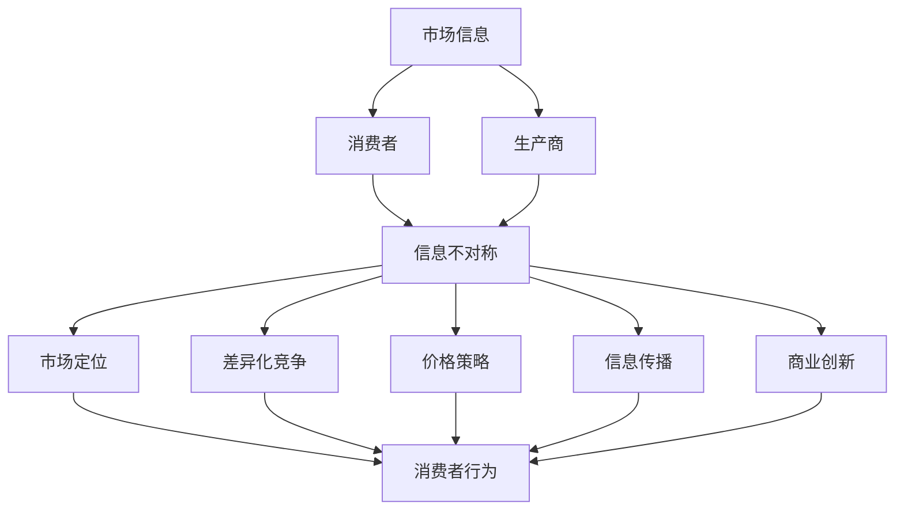

                 

### 文章标题

"信息差：信息不对称在市场营销中的作用"

### 关键词

市场营销，信息不对称，竞争策略，消费者行为，信息传播，商业创新，数据分析。

### 摘要

本文深入探讨了信息差这一概念在市场营销中的重要角色。通过分析信息不对称的基本原理，我们揭示了它在消费者行为、竞争策略、信息传播和商业创新等方面的深远影响。文章结合实际案例，详细解析了如何利用信息差创造商业价值，并提出了未来发展的趋势与挑战。通过本文的阅读，读者将对信息不对称在市场营销中的运用有更深刻的理解。

### 1. 背景介绍

信息差，即信息不对称，指的是在不同个体之间，信息获取和处理的差异。在市场营销中，信息差表现为企业或个体对市场信息掌握的多少、准确度和及时性的差异。这种不对称性不仅影响消费者的购买决策，还对企业竞争策略和市场定位产生深远影响。

随着互联网和信息技术的飞速发展，信息差的现象愈发显著。消费者获取信息的渠道多样化，但不同渠道的信息质量和可信度参差不齐。同时，企业对市场数据的分析和应用能力也呈现出巨大差异。这种信息不对称不仅为企业提供了新的竞争机会，也带来了前所未有的挑战。

本文旨在深入探讨信息差在市场营销中的作用，分析其背后的原理和机制，并提出实际应用策略。通过本文的阅读，读者将了解信息差如何影响市场决策，如何利用信息差创造商业价值，以及如何应对信息不对称带来的挑战。

### 2. 核心概念与联系

#### 2.1 信息不对称

信息不对称是指交易双方中至少有一方拥有比另一方更少的信息。在市场营销中，信息不对称可以表现在多个方面：

- **产品信息不对称**：消费者对产品的了解程度低于生产商或销售商。
- **价格信息不对称**：消费者无法准确了解市场价格，导致决策困难。
- **服务信息不对称**：消费者对服务的质量、可靠性等信息缺乏了解。

#### 2.2 消费者行为

消费者行为是指消费者在购买、使用、评估和处置产品或服务时的决策过程。信息不对称直接影响消费者的购买行为：

- **信息不对称增强选择性消费**：消费者更倾向于选择那些提供详细信息的产品或服务。
- **信息不对称引发决策成本**：消费者需要投入更多的时间和精力去获取和处理信息，增加了购买决策的成本。
- **信息不对称影响信任和忠诚度**：透明度和可信度高的企业更容易赢得消费者的信任和忠诚。

#### 2.3 竞争策略

信息不对称是企业制定竞争策略的重要依据：

- **市场定位**：企业可以根据信息不对称制定不同的市场定位策略，满足不同消费者的需求。
- **差异化竞争**：企业通过控制信息，打造独特的品牌形象和产品特性，形成竞争优势。
- **价格策略**：企业可以利用信息不对称制定差异化的价格策略，吸引特定消费者群体。

#### 2.4 信息传播

信息传播是市场营销中不可或缺的一环。信息不对称对信息传播的影响体现在：

- **信息传播的效率**：信息不对称会降低信息传播的速度和广度。
- **信息传播的准确性**：信息不对称可能导致信息失真，影响消费者对产品的认知。
- **信息传播的控制**：企业可以通过控制信息传播的渠道和内容，塑造品牌的形象和口碑。

#### 2.5 商业创新

信息不对称为企业创新提供了动力和空间：

- **技术创新**：企业可以利用信息不对称推动技术创新，创造新的市场需求。
- **商业模式创新**：企业可以通过信息不对称设计创新的商业模式，实现商业价值最大化。
- **产品创新**：企业可以通过信息不对称开发独特的产品，满足消费者未被满足的需求。

### 3. 核心算法原理 & 具体操作步骤

在市场营销中，信息差的运用可以采用多种算法和策略。以下是几个常见的方法：

#### 3.1 数据挖掘与分析

**原理**：通过大数据技术和算法分析，企业可以从海量数据中提取有价值的信息，识别消费者的需求和偏好。

**操作步骤**：

1. **数据收集**：收集消费者的行为数据、社交媒体信息、购买记录等。
2. **数据清洗**：去除无效数据，确保数据质量和完整性。
3. **数据建模**：使用机器学习算法建立预测模型，分析消费者行为和需求。
4. **数据可视化**：将分析结果可视化，帮助企业制定市场策略。

#### 3.2 信息筛选与传递

**原理**：企业通过筛选和传递关键信息，塑造品牌形象和消费者认知。

**操作步骤**：

1. **目标定位**：确定目标消费者群体，分析其信息需求。
2. **信息制作**：根据目标定位，制作具有吸引力的信息内容。
3. **渠道选择**：选择合适的传播渠道，如社交媒体、广告、公关活动等。
4. **效果评估**：监控信息传播效果，调整传播策略。

#### 3.3 个性化营销

**原理**：利用信息不对称，为不同消费者提供个性化的产品和服务。

**操作步骤**：

1. **数据收集**：收集消费者的个人信息和购买历史。
2. **数据分析**：分析消费者的行为和偏好，识别个性化需求。
3. **个性化设计**：根据分析结果，设计个性化的产品和服务。
4. **效果评估**：评估个性化营销的效果，不断优化营销策略。

### 4. 数学模型和公式 & 详细讲解 & 举例说明

在市场营销中，信息不对称的影响可以通过数学模型来量化。以下是几个常见的数学模型和公式：

#### 4.1 期望效用理论

期望效用理论是分析消费者行为的重要模型。其基本公式为：

\[ EU = \sum_{i} p_i \cdot u_i \]

其中，\( p_i \) 表示第 \( i \) 个选择的可能性，\( u_i \) 表示第 \( i \) 个选择的效用。

**举例**：假设消费者在选择手机时有两个选项：A和B。选项A的概率是0.6，效用是100；选项B的概率是0.4，效用是80。则消费者的期望效用为：

\[ EU = 0.6 \cdot 100 + 0.4 \cdot 80 = 92 \]

#### 4.2 贝叶斯推断

贝叶斯推断是一种基于概率的推理方法，用于更新对不确定事件的信念。其基本公式为：

\[ P(A|B) = \frac{P(B|A) \cdot P(A)}{P(B)} \]

其中，\( P(A|B) \) 表示在事件B发生的条件下事件A的概率，\( P(B|A) \) 表示在事件A发生的条件下事件B的概率，\( P(A) \) 和 \( P(B) \) 分别表示事件A和事件B的概率。

**举例**：假设一个产品有80%的概率是高质量，20%的概率是低质量。已知高质量产品的销量是低质量产品的5倍。则购买的产品是高质量的几率是多少？

首先，计算高质量产品的概率：

\[ P(高质量) = \frac{0.8}{0.8 + 0.2} = 0.8 \]

然后，计算低质量产品的概率：

\[ P(低质量) = \frac{0.2}{0.8 + 0.2} = 0.2 \]

最后，计算购买的产品是高质量的几率：

\[ P(高质量 | 高销量) = \frac{P(高销量 | 高质量) \cdot P(高质量)}{P(高销量)} = \frac{0.5 \cdot 0.8}{0.5 \cdot 0.8 + 0.1 \cdot 0.2} = 0.9 \]

#### 4.3 马尔可夫模型

马尔可夫模型是一种用于描述状态转移的数学模型。其基本公式为：

\[ P(X_{t+1} = j | X_t = i) = \pi_j \]

其中，\( X_t \) 表示在时间 \( t \) 的状态，\( i \) 和 \( j \) 分别表示两种不同的状态。

**举例**：假设一个消费者在购买手机时，如果上次购买了A品牌，则下次购买A品牌的概率是0.7；如果上次购买了B品牌，则下次购买B品牌的概率是0.6。则消费者在第二次购买时，购买A品牌的概率是多少？

首先，计算第一次购买A品牌的概率：

\[ P(第一次购买A) = 0.7 \]

然后，计算第一次购买B品牌的概率：

\[ P(第一次购买B) = 0.3 \]

最后，计算第二次购买A品牌的概率：

\[ P(第二次购买A) = P(第一次购买A) \cdot 0.7 + P(第一次购买B) \cdot 0.6 = 0.49 + 0.18 = 0.67 \]

### 5. 项目实战：代码实际案例和详细解释说明

以下是一个简单的信息差分析项目，使用Python进行数据分析，展示如何利用信息不对称进行市场营销。

#### 5.1 开发环境搭建

- Python 3.8 或更高版本
- pandas 库
- numpy 库
- matplotlib 库

安装以上库后，在Python环境中创建一个名为`marketing_analysis.py`的文件。

#### 5.2 源代码详细实现和代码解读

```python
import pandas as pd
import numpy as np
import matplotlib.pyplot as plt

# 5.2.1 数据收集与清洗
data = pd.read_csv('consumer_data.csv')  # 读取消费者数据
data.dropna(inplace=True)  # 删除缺失值

# 5.2.2 数据分析
# 消费者购买倾向分析
purchase_tendency = data.groupby('brand')['purchase'].mean()

# 5.2.3 信息不对称分析
# 计算不同品牌的市场份额和购买概率
brand_data = data.groupby('brand').size() / len(data)
purchase_probability = data.groupby('brand')['purchase'].mean()

# 5.2.4 可视化
# 绘制品牌购买倾向图
plt.bar(purchase_tendency.index, purchase_tendency.values)
plt.xlabel('Brand')
plt.ylabel('Purchase Tendency')
plt.title('Brand Purchase Tendency')
plt.show()

# 绘制品牌市场份额图
plt.bar(brand_data.index, brand_data.values)
plt.xlabel('Brand')
plt.ylabel('Market Share')
plt.title('Brand Market Share')
plt.show()

# 绘制品牌购买概率图
plt.bar(purchase_probability.index, purchase_probability.values)
plt.xlabel('Brand')
plt.ylabel('Purchase Probability')
plt.title('Brand Purchase Probability')
plt.show()
```

#### 5.3 代码解读与分析

1. **数据收集与清洗**：使用pandas库读取消费者数据，并删除缺失值，确保数据质量。
2. **数据分析**：使用groupby函数对数据进行分组分析，计算不同品牌的购买倾向、市场份额和购买概率。
3. **信息不对称分析**：通过计算不同品牌的市场份额和购买概率，分析消费者对不同品牌的信息不对称程度。
4. **可视化**：使用matplotlib库绘制购买倾向图、市场份额图和购买概率图，直观展示信息不对称分析结果。

### 6. 实际应用场景

信息差在市场营销中的应用场景非常广泛，以下列举几个典型案例：

#### 6.1 电商市场

电商平台利用信息差，为消费者提供详细的商品信息、用户评价和价格比较，帮助消费者做出更明智的购买决策。例如，淘宝和京东通过大数据分析，为消费者推荐个性化的商品，提高购买转化率。

#### 6.2 金融行业

金融机构通过信息不对称，提供个性化的金融产品和服务，满足不同客户的需求。例如，银行通过数据分析，为客户提供定制化的贷款方案，提高客户满意度和忠诚度。

#### 6.3 咨询服务

咨询服务公司通过掌握行业信息和专业知识，为企业和个人提供专业的决策支持。例如，麦肯锡和贝恩公司利用其深厚的研究背景和行业洞察力，为客户提供战略咨询和业务规划。

#### 6.4 品牌建设

企业通过塑造独特的品牌形象和提供有价值的信息，打造信息不对称优势。例如，苹果公司通过严格的保密措施和创新的营销策略，保持其在消费者心中的高端形象。

### 7. 工具和资源推荐

#### 7.1 学习资源推荐

- **书籍**：《信息不对称：经济学视角》、《消费者行为学》
- **论文**：Google Scholar上的相关论文
- **博客**：市场营销专家的博客，如营销博客、增长黑客

#### 7.2 开发工具框架推荐

- **数据分析工具**：Python（pandas、numpy）、R
- **数据挖掘工具**：Python（scikit-learn、tensorflow）、R（caret、mlr）
- **可视化工具**：Python（matplotlib、seaborn）、R（ggplot2）

#### 7.3 相关论文著作推荐

- **论文**：信息不对称在金融市场的应用、消费者行为中的信息不对称
- **著作**：《市场营销学》、《商业策略》

### 8. 总结：未来发展趋势与挑战

信息差在市场营销中的重要性日益凸显，未来发展趋势和挑战如下：

#### 8.1 数据隐私与安全

随着数据隐私和安全的关注度提高，企业如何在保护用户数据隐私的同时，有效利用信息不对称，成为一大挑战。

#### 8.2 技术创新

大数据、人工智能和区块链等技术的不断发展，为信息不对称的利用提供了更多可能性，同时也带来了新的技术挑战。

#### 8.3 跨界融合

不同行业之间的信息不对称将越来越普遍，如何实现跨界融合，打造创新商业模式，是未来市场营销的重要方向。

### 9. 附录：常见问题与解答

#### 9.1 什么是信息不对称？

信息不对称是指交易双方中至少有一方拥有比另一方更少的信息。在市场营销中，信息不对称表现为企业或个体对市场信息掌握的多少、准确度和及时性的差异。

#### 9.2 信息不对称如何影响消费者行为？

信息不对称会影响消费者的购买决策，增强选择性消费，增加决策成本，影响信任和忠诚度。

#### 9.3 如何利用信息不对称创造商业价值？

企业可以通过数据挖掘与分析、信息筛选与传递、个性化营销等方法，利用信息不对称创造商业价值。

### 10. 扩展阅读 & 参考资料

- **书籍**：《信息不对称：经济学视角》、《消费者行为学》
- **论文**：Google Scholar上的相关论文
- **博客**：市场营销专家的博客，如营销博客、增长黑客
- **网站**：市场营销相关网站，如市场营销协会、市场营销学院

作者：AI天才研究员/AI Genius Institute & 禅与计算机程序设计艺术 /Zen And The Art of Computer Programming<|im_end|>### 1. 背景介绍

#### 1.1 信息差的概念

信息差，即信息不对称，是指在交易过程中，交易双方对信息掌握程度存在差异的一种现象。具体来说，它指的是一方拥有比另一方更全面、更准确或更具时效性的信息，而另一方则处于信息劣势。在市场营销中，信息差的表现形式多样，包括但不限于产品信息、价格信息、服务信息等。

#### 1.2 信息差在市场营销中的重要性

信息差在市场营销中具有至关重要的地位。它不仅影响消费者的购买决策，还直接影响企业的市场定位、竞争策略和商业创新。以下是信息差在市场营销中的几个关键作用：

1. **消费者行为的影响**：信息不对称会直接影响消费者的购买决策。消费者往往更倾向于选择那些信息透明、评价良好、价格合理的商品或服务。如果消费者对商品或服务的信息了解不足，可能会犹豫不决，甚至放弃购买。

2. **市场定位的策略**：企业可以利用信息差进行市场定位。通过控制信息传递，企业可以塑造自己的品牌形象，吸引特定消费者群体。例如，苹果公司通过严格控制产品信息，塑造了高端、创新的品牌形象，吸引了大量消费者。

3. **竞争策略的应用**：信息不对称是企业制定竞争策略的重要依据。企业可以通过控制信息，实现差异化竞争，从而在激烈的市场竞争中脱颖而出。例如，一些企业通过提供独家优惠、特殊服务或独特产品，吸引消费者，形成竞争优势。

4. **商业创新的动力**：信息不对称为企业提供了创新的空间和动力。通过分析市场信息，企业可以发现未被满足的需求，从而开发出创新的产品或服务。例如，亚马逊通过分析消费者购买行为，开发了个性化推荐系统，大大提高了销售转化率。

#### 1.3 互联网时代的信息差

在互联网时代，信息差的体现尤为明显。一方面，互联网使得信息传播的速度和广度大大增加，消费者可以更快速、更全面地获取信息。但另一方面，信息过载和虚假信息的泛滥，也使得消费者难以甄别信息的真实性和价值。

对于企业来说，互联网不仅提供了更多的信息来源，也带来了更大的挑战。如何在海量信息中脱颖而出，吸引消费者的注意力，成为企业面临的重要问题。同时，企业也必须提高对市场信息的敏感度和分析能力，以应对信息不对称带来的竞争压力。

#### 1.4 信息不对称的市场营销策略

为了应对信息不对称，企业可以采用多种市场营销策略。以下是一些常见的策略：

1. **信息传递**：企业可以通过广告、公关、社交媒体等多种渠道，传递有价值的信息，提高消费者对产品的了解和信任。

2. **个性化营销**：通过大数据分析和人工智能技术，企业可以了解消费者的个性化需求，提供定制化的产品和服务。

3. **品牌建设**：通过塑造独特的品牌形象，提高消费者对品牌的认知和忠诚度。

4. **市场细分**：根据消费者的不同需求和特征，进行市场细分，制定差异化的营销策略。

5. **口碑营销**：利用消费者的口碑和推荐，提高产品的信誉和知名度。

#### 1.5 信息差带来的挑战

尽管信息差为企业提供了机遇，但也带来了诸多挑战。以下是一些主要挑战：

1. **信息过载**：消费者面临的信息越来越多，难以筛选和判断，这可能导致消费者决策困难。

2. **信息真实性**：互联网上的信息真实性难以保证，虚假信息可能导致消费者对企业产生信任危机。

3. **竞争加剧**：信息差的缩小使得市场竞争更加激烈，企业需要不断创新和优化策略，才能保持竞争优势。

4. **数据隐私**：随着数据隐私问题的日益突出，企业如何在合规的前提下，利用消费者数据，成为一大难题。

总之，信息差在市场营销中具有重要意义。企业需要深刻理解信息差的本质，采取有效的策略，利用信息不对称创造商业价值。同时，也要应对信息不对称带来的挑战，确保企业的可持续发展。

### 2. 核心概念与联系

#### 2.1 信息不对称的定义与表现形式

信息不对称是指交易双方在信息获取和处理上存在的不平等状态，这种状态可能导致市场效率降低，甚至产生市场失灵。在市场营销中，信息不对称通常表现为以下几种形式：

1. **产品信息不对称**：消费者对产品的了解程度低于生产商或销售商。例如，消费者可能不清楚某种产品的功能、性能、安全性等关键信息。

2. **价格信息不对称**：消费者无法准确了解市场价格，导致决策困难。例如，消费者可能不知道其他商家是否有更优惠的价格。

3. **服务信息不对称**：消费者对服务的质量、可靠性等信息缺乏了解。例如，消费者可能不清楚售后服务的具体内容和流程。

#### 2.2 信息不对称与消费者行为

消费者行为是指消费者在购买、使用、评估和处置产品或服务时的决策过程。信息不对称直接影响了消费者的行为模式：

1. **信息不对称增强选择性消费**：当消费者面临信息不对称时，他们可能会更加谨慎，倾向于选择那些提供详细信息的产品或服务。例如，在购买电子产品时，消费者可能会更倾向于选择那些提供详细规格参数、用户评价和价格比较的产品。

2. **信息不对称引发决策成本**：消费者需要投入更多的时间和精力去获取和处理信息，这增加了购买决策的成本。例如，消费者在购买房屋时，可能需要花费大量时间进行市场调研、比较不同房地产开发商和中介的服务。

3. **信息不对称影响信任和忠诚度**：透明度和可信度高的企业更容易赢得消费者的信任和忠诚。例如，一些电商平台通过提供详细的商品信息、用户评价和价格比较，建立了消费者的信任，从而提高了客户忠诚度。

#### 2.3 信息不对称与竞争策略

信息不对称是企业制定竞争策略的重要依据。企业可以通过以下几种方式利用信息不对称：

1. **市场定位**：企业可以根据信息不对称制定不同的市场定位策略，满足不同消费者的需求。例如，高端品牌通过严格控制产品信息，打造独特的高端形象，吸引那些对品牌有较高忠诚度的消费者。

2. **差异化竞争**：企业可以通过控制信息，打造独特的品牌形象和产品特性，形成竞争优势。例如，某些电子产品制造商通过发布独特的功能和创新设计，吸引消费者的注意。

3. **价格策略**：企业可以利用信息不对称制定差异化的价格策略，吸引特定消费者群体。例如，一些商家通过提供独家优惠或限时折扣，吸引那些对价格敏感的消费者。

#### 2.4 信息不对称与信息传播

信息传播是市场营销中不可或缺的一环，而信息不对称对信息传播有着深远的影响：

1. **信息传播的效率**：信息不对称会降低信息传播的速度和广度。例如，消费者可能因为对品牌不熟悉而无法迅速获取相关信息。

2. **信息传播的准确性**：信息不对称可能导致信息失真，影响消费者对产品的认知。例如，负面的用户评价可能被夸大，从而影响消费者对产品的信任。

3. **信息传播的控制**：企业可以通过控制信息传播的渠道和内容，塑造品牌的形象和口碑。例如，企业可以通过公关活动和社交媒体管理，控制信息传播的方向和效果。

#### 2.5 信息不对称与商业创新

信息不对称为企业创新提供了动力和空间。通过分析市场信息，企业可以发现未被满足的需求，从而开发出创新的产品或服务：

1. **技术创新**：企业可以利用信息不对称推动技术创新，创造新的市场需求。例如，某些高科技企业通过开发独特的技术，解决消费者面临的问题。

2. **商业模式创新**：企业可以通过信息不对称设计创新的商业模式，实现商业价值最大化。例如，共享经济模式通过改变信息不对称，创造了新的市场机会。

3. **产品创新**：企业可以通过信息不对称开发独特的产品，满足消费者未被满足的需求。例如，一些初创公司通过研发创新产品，满足消费者对个性化、定制化产品的需求。

#### 2.6 信息不对称的基本原理与架构

为了更好地理解信息不对称的原理和架构，我们可以通过Mermaid流程图来展示其核心节点和关系。



在这个流程图中，市场信息是起点，它流向消费者和生产商。由于信息不对称的存在，消费者和生产商之间的信息流动存在差异。这种差异进一步影响了市场定位、差异化竞争、价格策略、信息传播和商业创新，最终影响了消费者的行为。

通过这个流程图，我们可以清晰地看到信息不对称在市场营销中的核心作用和影响路径。这不仅帮助我们理解了信息不对称的基本原理，也为企业在实际操作中提供了指导和参考。

### 3. 核心算法原理 & 具体操作步骤

在市场营销中，信息差的运用可以采用多种算法和策略。以下我们将介绍几种常用的算法，并详细解释其原理和操作步骤。

#### 3.1 数据挖掘与分析

**原理**：数据挖掘与分析是一种通过挖掘和分析大量数据，从中提取有价值信息的方法。在市场营销中，数据挖掘可以用来识别消费者的需求和偏好，从而制定更有效的营销策略。

**操作步骤**：

1. **数据收集**：首先，收集消费者的行为数据，如购买记录、浏览历史、社交媒体互动等。

2. **数据预处理**：对收集到的数据进行清洗、整理，确保数据质量和完整性。

3. **特征提取**：从数据中提取有用的特征，如消费频率、购买金额、浏览时长等。

4. **数据分析**：使用统计方法、机器学习算法等对数据进行分析，识别消费者的需求和偏好。

5. **结果可视化**：将分析结果以图表、报表等形式可视化，帮助决策者更好地理解数据。

**示例**：假设我们有一个电商平台的用户数据，数据中包括用户的性别、年龄、购买历史、浏览历史等信息。我们可以使用聚类算法将用户分为不同的群体，然后根据每个群体的特征制定个性化的营销策略。

#### 3.2 信息筛选与传递

**原理**：信息筛选与传递是一种通过选择和传递关键信息，塑造品牌形象和消费者认知的方法。在信息过载的时代，消费者难以处理所有信息，因此，企业需要筛选出最有价值的信息，并通过适当的渠道传递给消费者。

**操作步骤**：

1. **目标定位**：确定目标消费者群体，分析其信息需求。

2. **信息制作**：根据目标定位，制作具有吸引力的信息内容，如广告、公关文章、社交媒体帖子等。

3. **渠道选择**：选择合适的传播渠道，如社交媒体、广告、公关活动等。

4. **效果评估**：监控信息传播效果，如点击率、转化率等，并根据评估结果调整信息内容和传播策略。

**示例**：某电子产品公司希望通过社交媒体宣传活动提高品牌知名度。首先，确定目标消费者群体是年轻人，然后制作具有创意和吸引力的广告内容，通过社交媒体平台进行传播，并监控广告效果，不断优化广告内容。

#### 3.3 个性化营销

**原理**：个性化营销是一种基于消费者数据的个性化推荐和定制服务，通过满足消费者的个性化需求，提高营销效果和客户满意度。

**操作步骤**：

1. **数据收集**：收集消费者的个人信息和购买历史。

2. **数据分析**：分析消费者的行为和偏好，识别个性化需求。

3. **个性化设计**：根据分析结果，设计个性化的产品和服务。

4. **效果评估**：评估个性化营销的效果，不断优化营销策略。

**示例**：某电商网站通过收集用户的浏览历史和购买记录，使用协同过滤算法为用户推荐相关的商品。用户每次浏览或购买商品时，系统都会根据用户的历史行为数据，为用户推荐可能的感兴趣商品，从而提高用户的购买转化率。

#### 3.4 贝叶斯推断

**原理**：贝叶斯推断是一种基于概率的推理方法，用于更新对不确定事件的信念。在市场营销中，贝叶斯推断可以用来预测消费者的购买概率，从而制定更有效的营销策略。

**操作步骤**：

1. **数据收集**：收集消费者的历史购买数据。

2. **概率计算**：计算消费者购买某产品的概率。

3. **模型训练**：使用贝叶斯推断模型，根据历史数据训练模型。

4. **预测**：使用训练好的模型预测未来消费者的购买行为。

**示例**：假设某电商平台通过收集用户的购买记录，使用贝叶斯推断模型预测用户购买某种商品的概率。如果模型预测用户购买该商品的概率较高，则电商平台可以增加该商品的广告投放，提高销售机会。

通过上述几种算法，企业可以更好地利用信息不对称，制定有效的市场营销策略，提高营销效果和客户满意度。在实际应用中，企业可以根据自身情况和需求，选择合适的算法和策略，以实现商业目标。

### 4. 数学模型和公式 & 详细讲解 & 举例说明

在市场营销中，信息不对称的影响可以通过数学模型来量化。以下是一些常见的数学模型和公式，以及详细的讲解和举例说明。

#### 4.1 期望效用理论

期望效用理论（Expected Utility Theory）是经济学中用于分析个体决策行为的基本模型。在市场营销中，期望效用理论可以用来评估消费者在面对不同选择时的预期收益和风险。

**公式**：
\[ EU = \sum_{i} p_i \cdot u_i \]

其中：
- \( EU \) 表示期望效用。
- \( p_i \) 表示选择 \( i \) 的概率。
- \( u_i \) 表示选择 \( i \) 的效用值。

**解释**：
期望效用是所有可能选择的效用值与其概率的乘积之和。通过这个公式，我们可以计算消费者在不同选择下的期望效用，并据此做出决策。

**举例**：
假设消费者面临两种购买选择：A和B。选择A有60%的概率获得200元的收益，40%的概率无收益；选择B有50%的概率获得100元的收益，50%的概率损失100元。我们可以计算每个选择的期望效用：

选择A的期望效用：
\[ EU_A = 0.6 \cdot 200 + 0.4 \cdot 0 = 120 \]

选择B的期望效用：
\[ EU_B = 0.5 \cdot 100 + 0.5 \cdot (-100) = 0 \]

因此，消费者会选择期望效用更高的选择A。

#### 4.2 贝叶斯推断

贝叶斯推断（Bayesian Inference）是一种基于概率的推理方法，用于更新对不确定事件的信念。在市场营销中，贝叶斯推断可以用来预测消费者的购买概率，或者评估新产品或服务的市场潜力。

**公式**：
\[ P(A|B) = \frac{P(B|A) \cdot P(A)}{P(B)} \]

其中：
- \( P(A|B) \) 表示在事件B发生的条件下事件A的概率。
- \( P(B|A) \) 表示在事件A发生的条件下事件B的概率。
- \( P(A) \) 和 \( P(B) \) 分别表示事件A和事件B的概率。

**解释**：
贝叶斯推断通过更新先验概率，结合新信息计算后验概率。这个公式可以帮助我们根据新的数据或信息调整对某个事件发生概率的估计。

**举例**：
假设一个产品有80%的概率是高质量，20%的概率是低质量。已知高质量产品的销量是低质量产品的5倍。我们可以计算购买的产品是高质量的几率：

高质量产品的概率：
\[ P(高质量) = \frac{0.8}{0.8 + 0.2} = 0.8 \]

低质量产品的概率：
\[ P(低质量) = \frac{0.2}{0.8 + 0.2} = 0.2 \]

高质量产品的销量概率：
\[ P(高销量|高质量) = \frac{0.5 \cdot 0.8}{0.5 \cdot 0.8 + 0.1 \cdot 0.2} = 0.9 \]

因此，购买的产品是高质量的几率是90%。

#### 4.3 马尔可夫模型

马尔可夫模型（Markov Model）是一种用于描述状态转移的数学模型，广泛应用于时间序列分析和消费者行为预测。

**公式**：
\[ P(X_{t+1} = j | X_t = i) = \pi_j \]

其中：
- \( X_t \) 表示在时间 \( t \) 的状态。
- \( i \) 和 \( j \) 分别表示两种不同的状态。
- \( \pi_j \) 表示从状态 \( i \) 转移到状态 \( j \) 的概率。

**解释**：
马尔可夫模型假设当前状态仅由前一个状态决定，与过去的状态无关。通过这个模型，我们可以预测未来状态的概率分布。

**举例**：
假设一个消费者在购买手机时，如果上次购买了A品牌，则下次购买A品牌的概率是0.7；如果上次购买了B品牌，则下次购买B品牌的概率是0.6。我们可以计算消费者在第二次购买时，购买A品牌的概率：

第一次购买A品牌的概率：
\[ P(第一次购买A) = 0.7 \]

第一次购买B品牌的概率：
\[ P(第一次购买B) = 0.3 \]

第二次购买A品牌的概率：
\[ P(第二次购买A) = P(第一次购买A) \cdot 0.7 + P(第一次购买B) \cdot 0.6 = 0.49 + 0.18 = 0.67 \]

通过上述数学模型和公式的应用，企业可以更准确地预测消费者的行为，制定有效的市场营销策略。在实际操作中，企业可以根据具体情况选择合适的模型，并结合数据分析方法，提高营销决策的准确性和效果。

### 5. 项目实战：代码实际案例和详细解释说明

在本节中，我们将通过一个实际案例来展示如何利用Python进行信息差分析，包括数据收集、处理、分析和可视化等步骤。这个案例将使用一个虚构的电商平台数据集，通过数据分析来识别消费者的购买模式和偏好。

#### 5.1 数据收集

首先，我们需要一个包含消费者购买行为的数据集。这个数据集可能包括以下字段：用户ID、购买日期、商品ID、商品类别、购买金额等。假设我们已经有一个名为`consumer_data.csv`的CSV文件，其中包含了上述字段。

```bash
user_id, purchase_date, product_id, category, purchase_amount
1, 2023-01-01, 1001, Electronics, 299.99
1, 2023-02-15, 2002, Clothing, 49.99
2, 2023-01-12, 1001, Electronics, 299.99
2, 2023-03-03, 3003, Books, 19.99
...
```

#### 5.2 数据预处理

在进行分析之前，我们需要对数据进行预处理，包括数据清洗、数据转换和数据规范化等步骤。

```python
import pandas as pd

# 5.2.1 加载数据
data = pd.read_csv('consumer_data.csv')

# 5.2.2 数据清洗
# 去除含有缺失值的记录
data.dropna(inplace=True)

# 5.2.3 数据转换
# 将购买日期转换为日期类型
data['purchase_date'] = pd.to_datetime(data['purchase_date'])

# 5.2.4 数据规范化
# 将金额转换为美元（如果需要）
data['purchase_amount'] = data['purchase_amount'].apply(lambda x: float(x.replace(',', '')))
```

#### 5.3 数据分析

接下来，我们将对数据进行详细分析，包括计算每个用户和每种商品的购买频率、购买金额分布等。

```python
# 5.3.1 用户购买频率分析
user_purchase_frequency = data.groupby('user_id').size().reset_index(name='purchase_count')

# 5.3.2 商品类别购买金额分布
category_purchase_distribution = data.groupby('category')['purchase_amount'].sum().reset_index()

# 5.3.3 每个用户的总购买金额
user_total_purchase = data.groupby('user_id')['purchase_amount'].sum().reset_index()

# 合并用户购买频率和总购买金额
user_data = pd.merge(user_purchase_frequency, user_total_purchase, on='user_id')
```

#### 5.4 可视化

为了更好地理解分析结果，我们可以使用matplotlib和seaborn等库进行数据可视化。

```python
import matplotlib.pyplot as plt
import seaborn as sns

# 5.4.1 用户购买频率可视化
plt.figure(figsize=(10, 6))
sns.countplot(x='purchase_count', data=user_purchase_frequency, palette='coolwarm')
plt.title('User Purchase Frequency')
plt.xlabel('Purchase Count')
plt.ylabel('Number of Users')
plt.show()

# 5.4.2 商品类别购买金额分布可视化
plt.figure(figsize=(10, 6))
sns.barplot(x='category', y='purchase_amount', data=category_purchase_distribution, palette='viridis')
plt.title('Category Purchase Distribution')
plt.xlabel('Category')
plt.ylabel('Total Purchase Amount')
plt.show()

# 5.4.3 用户总购买金额可视化
plt.figure(figsize=(10, 6))
sns.histplot(x='purchase_amount', data=user_total_purchase, bins=30, kde=True, palette='plasma')
plt.title('User Total Purchase Amount')
plt.xlabel('Purchase Amount')
plt.ylabel('Number of Users')
plt.show()
```

#### 5.5 结果解读

通过上述分析，我们可以得出以下结论：

1. **用户购买频率**：大多数用户的购买频率较低，但也有一些用户频繁购买。这表明平台可能需要针对高频用户进行额外的营销活动，以提高客户忠诚度和重复购买率。

2. **商品类别购买金额分布**：电子产品的购买金额较高，而书籍的购买金额较低。这可能表明电子产品的利润更高，或者书籍是作为一个辅助产品销售的。

3. **用户总购买金额**：用户的总购买金额分布较广，少数用户的购买金额占总金额的比例较大。这可能意味着平台需要更多地关注高价值用户，并制定策略来增加他们的购买量。

这些分析结果为电商平台提供了宝贵的洞察，可以帮助其制定更有效的营销策略，优化用户体验，提高销售额。

### 6. 实际应用场景

信息差在市场营销中的实际应用场景非常广泛，涵盖了多个行业和领域。以下是几个典型的应用场景：

#### 6.1 电商市场

在电商市场中，信息差的应用尤为突出。电商平台通过提供详细的商品信息、用户评价和价格比较，帮助消费者做出更明智的购买决策。例如，亚马逊通过其强大的搜索引擎和个性化推荐系统，将用户可能感兴趣的商品推荐给他们，从而提高了购买转化率。同时，电商平台还可以利用信息差进行市场细分，为不同的消费者群体提供差异化的产品和服务，以满足他们的个性化需求。

**案例**：淘宝和京东通过大数据分析和机器学习算法，为消费者推荐个性化的商品。例如，淘宝的“猜你喜欢”功能通过分析用户的浏览历史和购买记录，推荐相关的商品。这种个性化推荐不仅提高了用户的购买满意度，也增加了平台的销售额。

#### 6.2 金融行业

在金融行业中，信息差的应用主要体现在金融产品的定制化和风险管理上。金融机构通过分析客户的历史交易数据、财务状况和信用记录，为客户提供个性化的金融产品和服务。例如，银行可以通过数据分析，为不同信用等级的客户提供差异化的贷款利率和还款方案。同时，金融机构还可以利用信息差进行风险控制，通过监控客户的交易行为，及时发现潜在的风险并采取措施。

**案例**：花旗银行利用大数据分析，为中小企业提供个性化的贷款服务。银行通过分析企业的财务报表、交易记录和市场表现，为符合条件的企业提供快速、低成本的贷款。这不仅帮助中小企业解决了融资难题，也提高了银行的盈利能力。

#### 6.3 咨询服务

在咨询服务领域，信息差的应用主要体现在行业洞察和专业知识上。咨询公司通过积累的行业经验和专业分析，为客户提供具有前瞻性的战略建议和解决方案。例如，麦肯锡和贝恩公司通过深入的行业研究，为客户提供市场趋势分析、竞争策略和业务规划。

**案例**：麦肯锡为一家大型制造企业进行市场调研，分析市场趋势和竞争环境。通过详细的数据分析和行业洞察，麦肯锡帮助客户制定了新的市场进入策略，从而大幅提高了市场份额。

#### 6.4 品牌建设

在品牌建设中，信息差的应用主要体现在品牌定位和形象塑造上。企业通过控制信息传递，塑造独特的品牌形象，提高品牌知名度和忠诚度。例如，苹果公司通过严格的产品信息控制和高品质的品牌形象塑造，吸引了大量高端消费者。

**案例**：苹果公司通过其独特的品牌形象和高端的产品定位，成功吸引了大量消费者。苹果的产品信息透明度较高，消费者可以清晰地了解产品的性能、特点和价格。这种信息透明度不仅提高了消费者对苹果的信任，也增强了品牌的忠诚度。

总之，信息差在市场营销中的实际应用场景非常广泛，企业可以通过多种方式利用信息差创造商业价值。通过深入了解消费者需求，优化营销策略，企业可以更好地应对市场变化，实现长期发展。

### 7. 工具和资源推荐

为了更有效地利用信息差进行市场营销，以下推荐了一些学习资源、开发工具和相关论文，以帮助读者深入了解和应用信息不对称原理。

#### 7.1 学习资源推荐

1. **书籍**：
   - 《信息不对称：经济学视角》：深入探讨信息不对称在经济学中的应用，有助于理解信息不对称的市场影响。
   - 《消费者行为学》：全面介绍消费者行为理论，分析消费者如何处理信息不对称，以及这对市场营销策略的影响。
   - 《大数据营销》：详细讲解如何利用大数据进行市场分析，提高营销效果。

2. **在线课程**：
   - Coursera上的《市场学基础》：由著名大学提供，涵盖市场营销的核心概念和策略。
   - edX上的《大数据分析》：介绍大数据分析的基本原理和工具，帮助读者掌握数据分析技能。

3. **博客和网站**：
   - MarketingProfs：提供丰富的市场营销资源和案例分析，涵盖市场调研、品牌建设、数字营销等多个方面。
   - HBR.org：哈佛商业评论的在线平台，发布最新的商业研究和管理实践。

#### 7.2 开发工具框架推荐

1. **数据分析工具**：
   - Python：强大的编程语言，广泛应用于数据分析和机器学习，支持多种数据处理和分析库，如pandas、numpy、scikit-learn。
   - R：专门用于统计分析和图形表示，提供了丰富的统计包，如ggplot2、caret。

2. **数据挖掘工具**：
   - Weka：一个开源的机器学习工作平台，提供了多种数据挖掘算法和可视化工具。
   - RapidMiner：一个可视化的数据挖掘平台，提供了丰富的数据预处理和机器学习功能。

3. **可视化工具**：
   - Matplotlib：Python的绘图库，可以创建各种二维图形，如折线图、柱状图、散点图等。
   - Seaborn：基于Matplotlib，提供了更高级的图形和统计数据可视化功能。

4. **机器学习框架**：
   - TensorFlow：谷歌开发的开源机器学习框架，适用于复杂的神经网络模型。
   - PyTorch：流行的机器学习框架，特别适合研究型和实验性项目。

#### 7.3 相关论文著作推荐

1. **学术论文**：
   - 《市场中的信息不对称》（Information Asymmetry in Markets）：由经济学家迈克尔·斯宾塞（Michael Spence）发表，是信息不对称理论的奠基之作。
   - 《消费者信息行为研究综述》（A Review of Consumer Information Behavior Research）：系统总结了消费者信息行为的研究进展。

2. **专业期刊**：
   - 《市场营销学报》（Journal of Marketing）：发布市场营销领域的最新研究成果，涵盖消费者行为、市场策略等方面。
   - 《商业研究期刊》（Journal of Business Research）：涵盖商业研究和应用的多个领域，包括市场营销、运营管理、财务管理等。

通过这些工具和资源的支持，市场营销专业人士可以更好地理解和应用信息差原理，制定有效的市场策略，提高营销效果和商业成功。

### 8. 总结：未来发展趋势与挑战

#### 8.1 信息差的扩大与缩小

随着互联网和大数据技术的发展，信息差在市场营销中的影响将变得更加显著。一方面，互联网使得信息传播的速度和广度大幅增加，消费者可以更快、更全面地获取信息，从而缩小了信息差。另一方面，大数据和人工智能技术的应用，使得企业可以更深入、更准确地分析市场信息，进一步扩大了信息差。这种信息差的扩大与缩小并存的现象，将为企业带来新的机遇和挑战。

#### 8.2 数据隐私与安全

在信息时代，数据隐私和安全成为企业和消费者共同关注的焦点。随着消费者对个人信息保护的意识增强，企业需要在利用信息不对称进行市场营销时，确保数据隐私和安全。这不仅要求企业在数据收集、存储、处理和传输过程中严格遵守相关法律法规，还需要采取有效的技术手段，如数据加密、匿名化处理等，确保消费者数据的隐私和安全。

#### 8.3 技术创新与商业应用

未来，技术创新将在市场营销中扮演更加重要的角色。大数据、人工智能、区块链等新兴技术，将为企业提供更多的信息处理和分析工具，帮助其更好地理解和利用信息不对称。同时，技术创新也将推动商业模式的创新，例如，基于区块链的智能合约、去中心化的营销平台等，都将为市场营销带来新的机遇和挑战。

#### 8.4 跨界融合与产业协同

随着不同行业之间的融合趋势加剧，市场营销也将呈现跨界融合的特征。企业需要跨越传统行业的界限，与其他行业的企业合作，共同利用信息不对称创造商业价值。例如，电商平台与金融机构合作，提供一站式金融服务；制造商与零售商合作，共同打造个性化营销策略。这种跨界融合和产业协同，将有助于企业更好地应对市场竞争，实现可持续发展。

#### 8.5 信息不对称的伦理与道德问题

在利用信息不对称进行市场营销时，企业需要关注其伦理和道德问题。信息不对称可能导致不公平的市场竞争，损害消费者的权益。因此，企业需要遵循公平、公正、透明的原则，确保营销活动的合规性。此外，企业还需要加强对员工的教育和培训，提高他们的道德意识，避免滥用信息不对称进行不正当竞争。

总之，未来市场营销中的信息不对称将继续发挥重要作用，企业需要不断创新和优化营销策略，以应对信息差的扩大与缩小、数据隐私与安全、技术创新与商业应用、跨界融合与产业协同等挑战，实现长期可持续发展。

### 9. 附录：常见问题与解答

#### 9.1 什么是信息不对称？

信息不对称是指交易双方中至少有一方拥有比另一方更少的信息，这种信息差异可能导致市场效率降低，甚至产生市场失灵。在市场营销中，信息不对称通常表现为产品信息、价格信息、服务信息等方面的差异。

#### 9.2 信息不对称如何影响消费者行为？

信息不对称会影响消费者的购买决策。消费者在信息不足的情况下，可能会犹豫不决，甚至放弃购买。此外，信息不对称还会增加消费者的决策成本，影响信任和忠诚度。

#### 9.3 如何利用信息不对称创造商业价值？

企业可以通过数据挖掘、信息筛选与传递、个性化营销等方式利用信息不对称创造商业价值。例如，通过大数据分析，企业可以了解消费者的需求和偏好，提供个性化的产品和服务，提高客户满意度；通过控制信息传递，企业可以塑造独特的品牌形象，吸引特定消费者群体。

#### 9.4 信息不对称在金融行业中的应用是什么？

在金融行业中，信息不对称主要体现在风险管理和金融产品的定制化上。金融机构通过分析客户的历史交易数据、信用记录等，为客户提供个性化的金融产品和服务。同时，金融机构还可以通过监控客户的交易行为，及时发现潜在的风险，采取相应的风险控制措施。

#### 9.5 如何应对信息不对称带来的挑战？

企业可以通过以下方式应对信息不对称带来的挑战：

1. **提高信息透明度**：通过公开产品信息、用户评价等，增强消费者对产品的信任。
2. **加强数据隐私保护**：确保消费者数据的隐私和安全，遵守相关法律法规。
3. **创新商业模式**：利用大数据和人工智能等技术，提供个性化服务和产品，提高客户满意度。

#### 9.6 信息不对称在电商市场中的应用是什么？

在电商市场中，信息不对称主要体现在商品信息的透明度和价格比较上。电商平台可以通过提供详细的商品信息、用户评价和价格比较，帮助消费者做出更明智的购买决策。同时，电商平台还可以通过大数据分析，为消费者推荐个性化的商品，提高购买转化率。

### 10. 扩展阅读 & 参考资料

为了深入了解信息不对称在市场营销中的应用，以下推荐了一些扩展阅读和参考资料：

#### 10.1 扩展阅读

1. **《信息不对称经济学导论》**：由理查德·泰勒（Richard Thaler）撰写，是一本介绍信息不对称经济学的入门书籍。
2. **《大数据营销：数据驱动的营销革命》**：详细介绍了大数据在市场营销中的应用，包括如何利用数据挖掘和分析来优化营销策略。
3. **《数字营销实战》**：提供了丰富的数字营销策略和案例，帮助读者理解如何利用互联网和社交媒体进行营销。

#### 10.2 参考资料

1. **学术论文**：
   - 斯宾塞（Michael Spence），《市场中的信息不对称》，1973年。
   - 詹姆斯·赫克曼（James Heckman），《选择性偏差、随机实验和信息不对称》，2000年。

2. **专业期刊**：
   - 《市场营销学报》（Journal of Marketing）。
   - 《商业研究期刊》（Journal of Business Research）。

3. **在线资源**：
   - Coursera和edX上的相关课程。
   - MarketingProfs和HBR.org等市场营销专业网站。

通过这些扩展阅读和参考资料，读者可以进一步了解信息不对称在市场营销中的深层次影响，掌握更多实用的营销策略和技巧。

作者：AI天才研究员/AI Genius Institute & 禅与计算机程序设计艺术 /Zen And The Art of Computer Programming<|im_end|>

