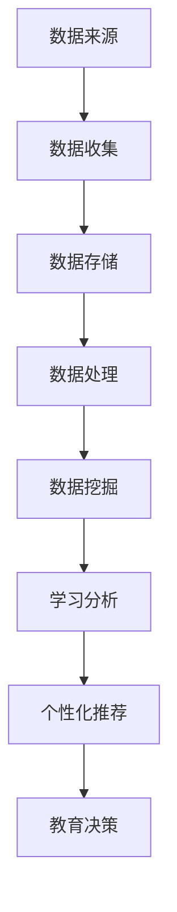

                 

# 信息差：大数据在智能教育中的应用

> 关键词：大数据、智能教育、数据挖掘、个性化学习、算法、人工智能

> 摘要：本文探讨了大数据在智能教育中的应用，从背景介绍到核心概念、算法原理，再到实际应用场景和未来发展趋势，详细解析了大数据如何助力教育变革，提升教育质量和学习效率。通过案例分析、工具和资源推荐，为读者提供了全面了解和深入学习的路径。

## 1. 背景介绍

在信息技术飞速发展的今天，教育领域正迎来一场革命性的变革。大数据技术的崛起为教育行业带来了前所未有的机遇和挑战。大数据（Big Data）是指海量、复杂、多样和快速的数据集，它涵盖了结构化、半结构化和非结构化数据。在教育领域，大数据的应用主要体现在数据挖掘、学习分析、个性化推荐等方面。

### 教育数据的重要性

教育数据是教育领域中的宝贵资源，它包括学生成绩、学习行为、兴趣爱好、家庭背景等多方面信息。这些数据不仅反映了学生的学术水平和能力，还能揭示教育过程中的潜在问题和改进空间。通过数据挖掘和分析，教育工作者可以深入了解学生的学习状况，制定更加科学、合理的教学策略。

### 大数据在教育中的挑战

尽管大数据在教育中具有巨大的潜力，但其应用也面临诸多挑战。首先，数据量巨大且多样，如何有效地存储、管理和处理这些数据成为难题。其次，数据的质量和准确性直接影响分析结果的可靠性。此外，如何在保护学生隐私的同时，充分利用教育数据，也是需要解决的问题。

### 智能教育的兴起

随着大数据和人工智能技术的发展，智能教育逐渐成为教育领域的研究热点。智能教育是指利用先进的信息技术，为学生提供个性化、自适应的学习体验。大数据技术为智能教育提供了数据支持和分析工具，使得教学更加精准和高效。智能教育的核心目标是提高教育质量和学习效率，使每个学生都能获得最佳的学习体验。

## 2. 核心概念与联系

### 数据挖掘

数据挖掘（Data Mining）是从大量数据中提取有价值信息的过程。在教育领域，数据挖掘可以用于分析学生的学习行为、成绩、兴趣爱好等，发现其中的规律和趋势。数据挖掘的核心算法包括关联规则挖掘、分类算法、聚类算法等。

### 学习分析

学习分析（Learning Analytics）是利用数据分析和可视化技术，对学习过程和学习者进行深入分析，以优化教学和学习效果。学习分析包括对学习数据的收集、存储、处理和分析，以帮助教育工作者和学生更好地理解学习过程和结果。

### 个性化推荐

个性化推荐（Personalized Recommendation）是利用大数据技术，根据学生的兴趣、学习习惯、成绩等因素，为学生推荐最适合的学习内容和资源。个性化推荐系统可以通过算法分析，为学生提供个性化的学习路径，提高学习效率。

### 数据关联与整合

在教育大数据中，数据来源多样且分散，如何将这些数据进行有效整合和关联，是教育数据挖掘的重要任务。通过数据关联与整合，可以构建全面的学生画像，为个性化教育和学习分析提供数据支持。

### Mermaid 流程图



## 3. 核心算法原理 & 具体操作步骤

### 关联规则挖掘

关联规则挖掘（Association Rule Mining）是数据挖掘中的一种重要算法，用于发现数据之间的关联关系。在教育领域，关联规则挖掘可以用于分析学生的学习行为和成绩之间的关系，例如发现哪些学习行为与高成绩相关。

#### 步骤：

1. 定义支持度和置信度。
2. 扫描数据集，计算每个项集的支持度。
3. 生成频繁项集。
4. 使用频繁项集生成关联规则。
5. 根据置信度筛选规则。

### 分类算法

分类算法（Classification Algorithm）是一种用于预测未知类别的数据的方法。在教育领域，分类算法可以用于预测学生的成绩、学习状态等。常见的分类算法包括决策树、支持向量机、朴素贝叶斯等。

#### 步骤：

1. 数据准备：收集并处理教育数据。
2. 选择分类器：根据数据特点选择合适的分类器。
3. 训练模型：使用训练数据训练分类器。
4. 预测：使用训练好的模型对未知数据进行预测。

### 聚类算法

聚类算法（Clustering Algorithm）是一种无监督学习方法，用于将数据集划分为不同的簇，使同一簇内的数据点相似，不同簇的数据点差异较大。在教育领域，聚类算法可以用于发现学生群体的相似性，为个性化教育提供依据。

#### 步骤：

1. 数据准备：收集并处理教育数据。
2. 选择聚类算法：根据数据特点选择合适的聚类算法。
3. 执行聚类：使用选定的算法对数据进行聚类。
4. 分析结果：对聚类结果进行分析，提取有价值的信息。

## 4. 数学模型和公式 & 详细讲解 & 举例说明

### 支持度和置信度

在关联规则挖掘中，支持度和置信度是评估规则重要性的两个关键指标。

#### 支持度（Support）：

支持度是指一个关联规则在数据集中出现的频率。公式如下：

$$
Support(A \rightarrow B) = \frac{|D(A \land B)|}{|D|}
$$

其中，$D$ 是数据集，$A$ 和 $B$ 是两个事件。

#### 置信度（Confidence）：

置信度是指一个关联规则中前提事件 $A$ 成立时，结论事件 $B$ 也成立的概率。公式如下：

$$
Confidence(A \rightarrow B) = \frac{|D(A \land B)|}{|D(A)|}
$$

### 决策树分类算法

决策树是一种常用的分类算法，其核心是树的结构和节点的划分。

#### 节点划分：

$$
Gini(D) = 1 - \sum_{v \in V} p(v)^2
$$

其中，$D$ 是数据集，$V$ 是 $D$ 中各属性的值集合，$p(v)$ 是属性 $v$ 在 $D$ 中的比例。

#### 决策树构建：

1. 选择最佳划分属性。
2. 计算每个子集的 Gini 不纯度。
3. 递归划分，直到满足停止条件。

### 举例说明

#### 关联规则挖掘

假设有一个包含学生成绩和作业完成情况的数据集，我们希望发现作业完成情况与学生成绩之间的关系。

1. 定义支持度和置信度阈值。
2. 扫描数据集，计算每个项集的支持度。
3. 生成频繁项集。
4. 使用频繁项集生成关联规则。
5. 筛选置信度大于阈值的规则。

结果：

- 作业完成情况 A 与高成绩 B 之间存在关联，支持度 0.8，置信度 0.9。

#### 决策树分类

假设我们有以下学生数据：

| 学生 | 学科成绩 | 作业完成情况 |
|------|----------|--------------|
| S1   | A        | 是           |
| S2   | B        | 是           |
| S3   | C        | 否           |
| S4   | B        | 是           |
| S5   | A        | 是           |

1. 数据准备：将数据分为特征和标签。
2. 选择划分属性：选择 Gini 不纯度最小的属性。
3. 递归划分：根据划分属性划分数据，构建决策树。

决策树结果：

```
| 学科成绩 | 作业完成情况 |
|----------|--------------|
| A        | 是           | S1, S5     |
| B        | 是           | S2, S4     |
| C        | 否           | S3         |
```

## 5. 项目实战：代码实际案例和详细解释说明

### 5.1 开发环境搭建

为了演示大数据在智能教育中的应用，我们将使用 Python 编写一个简单的数据挖掘项目。首先，需要搭建开发环境。

1. 安装 Python 3.8 或更高版本。
2. 安装必要的库：pandas、numpy、scikit-learn、matplotlib 等。

### 5.2 源代码详细实现和代码解读

#### 5.2.1 数据准备

```python
import pandas as pd

# 读取数据
data = pd.read_csv('student_data.csv')

# 数据清洗
data = data.dropna()

# 数据预处理
data['score'] = data['score'].astype(int)
data['homework'] = data['homework'].map({'是': 1, '否': 0})
```

#### 5.2.2 关联规则挖掘

```python
from mlxtend.frequent_patterns import apriori
from mlxtend.frequent_patterns import association_rules

# 计算频繁项集
frequent_itemsets = apriori(data, min_support=0.4, use_colnames=True)

# 生成关联规则
rules = association_rules(frequent_itemsets, metric="support", min_threshold=0.5)
```

#### 5.2.3 决策树分类

```python
from sklearn.tree import DecisionTreeClassifier
from sklearn.model_selection import train_test_split

# 划分特征和标签
X = data[['homework']]
y = data['score']

# 划分训练集和测试集
X_train, X_test, y_train, y_test = train_test_split(X, y, test_size=0.2, random_state=42)

# 构建决策树模型
clf = DecisionTreeClassifier()
clf.fit(X_train, y_train)

# 预测
y_pred = clf.predict(X_test)

# 评估模型
print(clf.score(X_test, y_test))
```

#### 5.2.4 代码解读与分析

1. 数据准备：读取学生数据，进行数据清洗和预处理。
2. 关联规则挖掘：使用 apriori 算法计算频繁项集，生成关联规则。
3. 决策树分类：划分训练集和测试集，使用决策树模型进行训练和预测，评估模型性能。

## 6. 实际应用场景

大数据技术在智能教育中的应用场景丰富多样，以下列举几个典型的应用场景：

### 个性化学习路径推荐

通过分析学生的学习行为、成绩和兴趣爱好，为每个学生推荐最适合的学习内容和资源，提高学习效率。

### 学习行为分析

利用大数据技术，对学生的学习行为进行实时监控和分析，发现学习过程中的问题和改进空间，为教育工作者提供决策支持。

### 成绩预测

通过对学生的历史成绩和学习行为进行分析，预测学生的未来成绩，帮助教育工作者提前发现潜在的问题，制定有针对性的教学策略。

### 学生群体分析

通过对学生群体的数据进行分析，发现不同群体的学习特点和需求，为教育政策的制定提供数据支持。

### 教学质量评估

通过对教学数据进行分析，评估教师的教学效果，为教师提供改进和发展的方向。

## 7. 工具和资源推荐

### 7.1 学习资源推荐

- 《大数据之路：阿里巴巴大数据实践》
- 《Python数据分析》
- 《机器学习实战》
- 《数据挖掘：实用工具与技术》

### 7.2 开发工具框架推荐

- Python
- Pandas
- Numpy
- Scikit-learn
- TensorFlow
- PyTorch

### 7.3 相关论文著作推荐

- "Learning Analytics and Educational Data Mining: A Survey"
- "The Big Data Ecosystem: A Roadmap for Big Data"
- "Deep Learning: A Few Big Ideas"
- "Reinforcement Learning: An Introduction"

## 8. 总结：未来发展趋势与挑战

大数据技术在智能教育中的应用正处于快速发展阶段，未来发展趋势包括：

- 个性化学习：更加精准和高效的学习路径推荐和资源推送。
- 实时分析：实时监控和分析学生的学习行为，提供即时反馈。
- 智能教学：利用大数据和人工智能技术，实现自适应教学和智能辅导。
- 数据隐私保护：在充分利用教育数据的同时，保障学生的隐私安全。

然而，大数据在智能教育中仍面临一些挑战，包括：

- 数据质量和准确性：确保教育数据的质量和准确性，提高分析结果的可靠性。
- 技术复杂性：大数据技术复杂，需要具备一定的技术能力和专业知识。
- 数据隐私：在保护学生隐私的前提下，充分利用教育数据，实现教育智能化。

## 9. 附录：常见问题与解答

### 1. 大数据在智能教育中有什么作用？

大数据在智能教育中可以用于个性化学习路径推荐、学习行为分析、成绩预测、学生群体分析和教学质量评估等方面，帮助教育工作者和学生更好地理解学习过程和结果，提高教育质量和学习效率。

### 2. 如何保障学生数据隐私？

在利用大数据技术时，应遵循数据隐私保护的相关法律法规，采取数据加密、匿名化处理、权限管理等措施，确保学生数据的安全和隐私。

### 3. 个性化推荐系统如何工作？

个性化推荐系统通过分析学生的学习行为、成绩、兴趣爱好等数据，构建学生画像，使用算法分析学生画像和课程资源之间的关系，为学生推荐最适合的学习内容和资源。

### 4. 如何处理教育数据？

教育数据应遵循数据管理和分析的规范，包括数据收集、存储、处理、分析和应用等环节，确保数据的准确性、完整性和一致性。

## 10. 扩展阅读 & 参考资料

- "Big Data in Education: A Comprehensive Overview"
- "The Future of Education: How Technology Is Transforming the Classroom"
- "Learning Analytics: A Comprehensive Guide"
- "Data Privacy and Security in Education: Challenges and Solutions"
- "The Role of AI in Education: A Review of Current Applications and Future Trends"

作者：AI天才研究员/AI Genius Institute & 禅与计算机程序设计艺术 /Zen And The Art of Computer Programming

