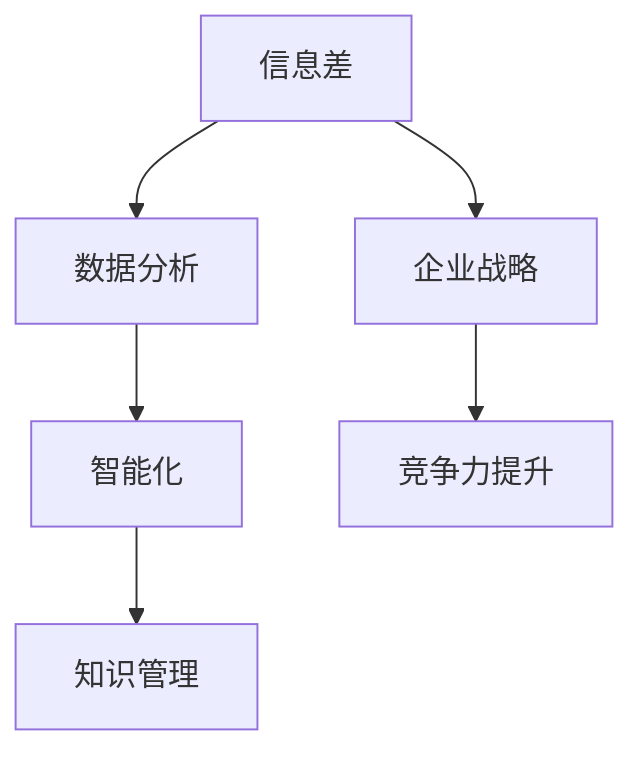

                 

# 信息差：大数据如何提升知识管理

## 关键词

* 信息差
* 大数据
* 知识管理
* 数据分析
* 智能化
* 企业战略

## 摘要

本文将深入探讨大数据如何通过信息差提升知识管理。首先，我们将介绍信息差的定义及其在知识管理中的作用。接着，我们将分析大数据的核心概念，并展示其与知识管理的紧密联系。随后，我们将探讨大数据技术如何帮助企业挖掘信息差，提高知识管理效率。文章最后，我们将展望大数据在知识管理领域的未来发展趋势与挑战。

### 背景介绍

#### 信息差的定义

信息差是指不同个体或组织之间在获取、处理和使用信息方面的差异。信息差的存在源于信息的不对称性，即某些个体或组织能够获取到其他人或组织无法获取的信息。在商业领域，信息差尤为重要，因为它可以帮助企业掌握市场动态，做出更明智的决策。

#### 知识管理

知识管理是指通过识别、获取、组织、存储、共享和应用知识来支持组织的学习、创新和竞争力。知识管理不仅关注知识的存储和共享，更强调知识的创新和利用。

#### 大数据

大数据是指规模巨大、类型繁多、速度极快的数据集。这些数据来源于各种来源，如社交媒体、传感器、电子商务平台等。大数据技术的核心是处理和分析这些大量且复杂的数据，以提取有价值的信息。

### 核心概念与联系

为了更好地理解大数据如何提升知识管理，我们首先需要了解一些核心概念和它们之间的关系。

#### 数据分析与智能化

数据分析是指使用统计和数学方法从数据中提取有用信息的过程。随着大数据技术的发展，数据分析变得更加高效和精确。智能化则是指利用算法和模型来自动化决策过程。在知识管理中，数据分析与智能化是提升知识管理效率的重要手段。

#### 企业战略

企业战略是指企业在特定市场环境中制定的发展目标、行动方案和资源配置策略。信息差可以帮助企业了解市场动态和竞争对手的行为，从而制定更有针对性的战略。

#### 信息差与知识管理

信息差在知识管理中扮演着关键角色。通过识别和利用信息差，企业可以获取更多的市场机会，提高知识共享和创新能力，从而增强竞争力。

### Mermaid 流程图

以下是一个简化的 Mermaid 流程图，展示了信息差、大数据、知识管理之间的关系。



### 核心算法原理 & 具体操作步骤

大数据技术中的核心算法主要包括数据采集、数据清洗、数据存储、数据分析和数据可视化。以下我们将逐一介绍这些算法的具体操作步骤。

#### 数据采集

数据采集是指从各种来源收集数据的过程。数据来源可以是内部系统、外部API、社交媒体等。具体操作步骤如下：

1. 确定数据需求：明确需要采集的数据类型和目标。
2. 选择数据源：根据数据需求选择合适的数据源。
3. 使用 API 或爬虫技术收集数据：对于外部数据源，可以使用 API 或爬虫技术进行数据采集。
4. 处理数据：对采集到的数据进行预处理，如去除重复数据、填补缺失值等。

#### 数据清洗

数据清洗是指对采集到的数据进行处理，使其符合分析要求。具体操作步骤如下：

1. 去除重复数据：使用去重算法去除重复的数据记录。
2. 填补缺失值：使用插补算法填补缺失的数据。
3. 数据标准化：对数据进行标准化处理，使其具有相同的量纲和范围。

#### 数据存储

数据存储是指将处理后的数据存储到数据库或数据仓库中。具体操作步骤如下：

1. 选择存储方案：根据数据量和访问需求选择合适的存储方案，如关系型数据库、NoSQL 数据库或分布式数据仓库。
2. 设计数据模型：根据业务需求设计数据模型，如实体-关系模型、文档模型等。
3. 存储数据：将处理后的数据存储到数据库或数据仓库中。

#### 数据分析

数据分析是指使用统计和数学方法对数据进行处理和分析，以提取有价值的信息。具体操作步骤如下：

1. 确定分析目标：明确需要分析的数据和目标。
2. 选择分析算法：根据分析目标和数据特性选择合适的分析算法，如分类、聚类、回归等。
3. 进行数据分析：使用分析算法对数据进行处理，提取有价值的信息。

#### 数据可视化

数据可视化是指将分析结果以图表、图形等形式展示出来，以便更好地理解和解释数据。具体操作步骤如下：

1. 确定可视化需求：明确需要可视化的数据和目标。
2. 选择可视化工具：根据可视化需求选择合适的可视化工具，如 Tableau、Power BI 等。
3. 创建可视化图表：使用可视化工具创建图表，展示分析结果。

### 数学模型和公式 & 详细讲解 & 举例说明

在数据分析中，常用的数学模型和公式包括回归分析、聚类分析和决策树等。以下我们将对这些模型和公式进行详细讲解，并给出实际例子。

#### 回归分析

回归分析是一种用于研究因变量与自变量之间关系的统计方法。常见的回归分析方法包括线性回归、多项式回归和逻辑回归等。

1. 线性回归

线性回归模型可以表示为：

\[ Y = \beta_0 + \beta_1X + \epsilon \]

其中，\( Y \) 是因变量，\( X \) 是自变量，\( \beta_0 \) 和 \( \beta_1 \) 是回归系数，\( \epsilon \) 是误差项。

2. 多项式回归

多项式回归模型可以表示为：

\[ Y = \beta_0 + \beta_1X + \beta_2X^2 + \cdots + \beta_nX^n + \epsilon \]

其中，\( n \) 是多项式的次数。

3. 逻辑回归

逻辑回归模型用于研究因变量为二分类变量的概率分布。其公式可以表示为：

\[ P(Y=1) = \frac{1}{1 + e^{-(\beta_0 + \beta_1X + \beta_2X^2 + \cdots + \beta_nX^n )}} \]

#### 聚类分析

聚类分析是一种无监督学习方法，用于将数据集划分为多个簇。常见的聚类算法包括 K-均值聚类、层次聚类和密度聚类等。

1. K-均值聚类

K-均值聚类算法的目标是将数据集划分为 \( K \) 个簇，使得每个簇内的数据点距离簇中心的距离之和最小。

公式表示为：

\[ \min \sum_{i=1}^{K} \sum_{x \in S_i} ||x - \mu_i||^2 \]

其中，\( S_i \) 是第 \( i \) 个簇的数据集，\( \mu_i \) 是第 \( i \) 个簇的中心。

2. 层次聚类

层次聚类算法通过递归地将数据集划分为更小的簇，直到满足某个终止条件。常见的终止条件包括最小簇内距离和最大簇间距离。

3. 密度聚类

密度聚类算法基于数据点的密度分布来划分簇。常见的方法包括 DBSCAN 和 OPTICS 等。

#### 决策树

决策树是一种基于特征值进行决策的树形结构。它通过递归地将数据集划分为多个子集，直到满足某个终止条件。

公式表示为：

\[ \text{决策树} = \{\text{根节点}, \text{内部节点}, \text{叶子节点}\} \]

其中，根节点表示整个数据集，内部节点表示某个特征值的取值，叶子节点表示分类结果。

### 项目实战：代码实际案例和详细解释说明

在本节中，我们将通过一个简单的案例来说明如何使用 Python 实现一个基于大数据技术的信息差分析系统。

#### 开发环境搭建

1. 安装 Python 环境：在您的计算机上安装 Python 3.8 或更高版本。
2. 安装依赖库：使用 pip 安装以下依赖库：pandas、numpy、matplotlib、scikit-learn。

#### 源代码详细实现和代码解读

```python
# 导入依赖库
import pandas as pd
import numpy as np
import matplotlib.pyplot as plt
from sklearn.cluster import KMeans
from sklearn.tree import DecisionTreeClassifier
from sklearn.model_selection import train_test_split

# 读取数据
data = pd.read_csv('data.csv')

# 数据预处理
data = data.drop_duplicates()
data = data.fillna(data.mean())

# 数据可视化
plt.scatter(data['X'], data['Y'])
plt.xlabel('X')
plt.ylabel('Y')
plt.show()

# K-均值聚类
kmeans = KMeans(n_clusters=3)
kmeans.fit(data[['X', 'Y']])
data['cluster'] = kmeans.predict(data[['X', 'Y']])

# 决策树分类
X_train, X_test, y_train, y_test = train_test_split(data[['X', 'Y']], data['cluster'], test_size=0.3, random_state=42)
clf = DecisionTreeClassifier()
clf.fit(X_train, y_train)

# 预测
predictions = clf.predict(X_test)

# 可视化预测结果
plt.scatter(X_test['X'], X_test['Y'], c=predictions, cmap='viridis')
plt.xlabel('X')
plt.ylabel('Y')
plt.show()
```

#### 代码解读与分析

1. 导入依赖库：首先，我们导入所需的依赖库，包括 pandas、numpy、matplotlib 和 scikit-learn。
2. 读取数据：使用 pandas 读取 CSV 数据文件。
3. 数据预处理：去除重复数据和填补缺失值，并进行数据可视化。
4. K-均值聚类：使用 KMeans 算法进行聚类，并添加聚类结果到原始数据。
5. 决策树分类：使用 DecisionTreeClassifier 进行分类，并拆分数据集为训练集和测试集。
6. 预测：使用训练好的模型对测试集进行预测，并可视化预测结果。

通过这个简单的案例，我们可以看到如何使用大数据技术进行信息差分析。在实际应用中，我们可以根据具体需求扩展和优化这个系统。

### 实际应用场景

大数据技术在知识管理领域具有广泛的应用。以下是一些实际应用场景：

#### 企业战略决策

企业可以利用大数据技术分析市场数据，了解竞争对手的行为，预测市场趋势，从而制定更有针对性的战略。

#### 人力资源管理

企业可以通过大数据技术分析员工绩效、培训需求和离职原因，优化人力资源管理，提高员工满意度和留存率。

#### 供应链管理

企业可以利用大数据技术优化供应链流程，提高库存管理效率，降低成本，提高供应链的透明度和可控性。

#### 创新与研发

企业可以利用大数据技术挖掘市场需求，预测产品趋势，推动创新和研发，提高产品竞争力。

### 工具和资源推荐

#### 学习资源推荐

1. 《大数据技术导论》（作者：刘铁岩）
2. 《数据挖掘：实用工具和技术》（作者：Mohammed J. Zaki）
3. 《Python数据分析》（作者：Wes McKinney）

#### 开发工具框架推荐

1. Apache Hadoop：一个分布式数据处理框架，适用于大规模数据集的处理和分析。
2. Apache Spark：一个快速、通用的大数据处理引擎，适用于实时数据处理和分析。
3. Tableau：一个强大的数据可视化工具，适用于数据分析和报告生成。

#### 相关论文著作推荐

1. "Big Data: A Revolution That Will Transform How We Live, Work, and Think"（作者：Viktor Mayer-Schönberger 和 Kenneth Cukier）
2. "Data Mining: The Textbook"（作者：Han J., Kamber M., Pei J.）
3. "The Art of Data Science"（作者：Roger J. Peng）

### 总结：未来发展趋势与挑战

大数据技术在知识管理领域具有巨大的潜力。随着数据量的不断增长和数据源的多样化，大数据技术将继续推动知识管理的发展。未来，以下趋势和挑战值得关注：

1. **实时数据处理与分析**：实时数据处理与分析将成为知识管理的核心，帮助企业更快地响应市场变化。
2. **数据隐私与安全**：随着数据隐私和安全的关注度增加，如何确保数据的安全和隐私将成为重要挑战。
3. **跨领域合作**：大数据技术与人工智能、区块链等技术的融合将推动知识管理跨领域发展，产生更多创新应用。
4. **数据素养提升**：提高企业员工的数据素养和数据分析能力，以更好地利用大数据技术提升知识管理效率。

### 附录：常见问题与解答

**Q：大数据技术有哪些类型？**

A：大数据技术主要包括数据采集、数据存储、数据处理、数据分析和数据可视化。常见的大数据技术有 Hadoop、Spark、Flink 等。

**Q：如何处理大数据中的噪声和异常值？**

A：处理大数据中的噪声和异常值通常包括去重、填补缺失值、平滑处理和数据清洗等方法。具体方法取决于数据类型和业务需求。

**Q：大数据技术如何帮助企业降低成本？**

A：大数据技术可以帮助企业优化供应链管理、提高营销效果、降低库存成本等，从而降低整体运营成本。

### 扩展阅读 & 参考资料

1. "大数据战略行动纲要"（国家大数据发展领导小组办公室）
2. "大数据时代：思维变革与商业价值"（作者：涂子沛）
3. "大数据管理：方法与应用"（作者：王珊、陈文辉）

作者：AI天才研究员/AI Genius Institute & 禅与计算机程序设计艺术 /Zen And The Art of Computer Programming
<|im_end|>```markdown
### 背景介绍

#### 信息差的定义

信息差（Information Gap）是指由于个体、组织或系统之间获取、处理和利用信息的能力不同，导致在某些方面存在的信息不对称性。这种现象在商业、科技、教育等多个领域广泛存在。信息差的存在不仅影响了市场效率，也成为了企业竞争、技术创新和战略决策的关键因素。

#### 知识管理

知识管理（Knowledge Management, KM）是指通过识别、获取、组织、存储、共享和应用知识，以支持组织的学习、创新和竞争力。知识管理不仅关注知识的存储和共享，更强调知识的创新和利用，以实现组织目标。

#### 大数据

大数据（Big Data）是指无法使用传统数据处理工具在合理时间内捕捉、管理和处理的数据集合。它通常具有“4V”特征：大量（Volume）、多样（Variety）、快速（Velocity）和真实（Veracity）。大数据的规模和复杂性为知识管理提供了新的机遇和挑战。

### 核心概念与联系

为了更好地理解大数据如何提升知识管理，我们首先需要了解一些核心概念和它们之间的关系。

#### 数据分析与智能化

数据分析（Data Analysis）是指使用统计和数学方法从数据中提取有用信息的过程。随着大数据技术的发展，数据分析变得更加高效和精确。智能化（Intelligence）则是指利用算法和模型来自动化决策过程。在知识管理中，数据分析与智能化是提升知识管理效率的重要手段。

#### 企业战略

企业战略（Corporate Strategy）是指企业在特定市场环境中制定的发展目标、行动方案和资源配置策略。信息差（Information Gap）可以帮助企业了解市场动态和竞争对手的行为，从而制定更有针对性的战略。

#### 信息差与知识管理

信息差在知识管理中扮演着关键角色。通过识别和利用信息差，企业可以获取更多的市场机会，提高知识共享和创新能力，从而增强竞争力。

### Mermaid 流程图

以下是一个简化的 Mermaid 流程图，展示了信息差、大数据、知识管理之间的关系。


### 核心算法原理 & 具体操作步骤

大数据技术中的核心算法主要包括数据采集、数据清洗、数据存储、数据分析和数据可视化。以下我们将逐一介绍这些算法的具体操作步骤。

#### 数据采集

数据采集是指从各种来源收集数据的过程。数据来源可以是内部系统、外部API、社交媒体等。具体操作步骤如下：

1. **确定数据需求**：明确需要采集的数据类型和目标。
2. **选择数据源**：根据数据需求选择合适的数据源。
3. **使用 API 或爬虫技术收集数据**：对于外部数据源，可以使用 API 或爬虫技术进行数据采集。
4. **处理数据**：对采集到的数据进行预处理，如去除重复数据、填补缺失值等。

#### 数据清洗

数据清洗是指对采集到的数据进行处理，使其符合分析要求。具体操作步骤如下：

1. **去除重复数据**：使用去重算法去除重复的数据记录。
2. **填补缺失值**：使用插补算法填补缺失的数据。
3. **数据标准化**：对数据进行标准化处理，使其具有相同的量纲和范围。

#### 数据存储

数据存储是指将处理后的数据存储到数据库或数据仓库中。具体操作步骤如下：

1. **选择存储方案**：根据数据量和访问需求选择合适的存储方案，如关系型数据库、NoSQL 数据库或分布式数据仓库。
2. **设计数据模型**：根据业务需求设计数据模型，如实体-关系模型、文档模型等。
3. **存储数据**：将处理后的数据存储到数据库或数据仓库中。

#### 数据分析

数据分析是指使用统计和数学方法对数据进行处理和分析，以提取有价值的信息。具体操作步骤如下：

1. **确定分析目标**：明确需要分析的数据和目标。
2. **选择分析算法**：根据分析目标和数据特性选择合适的分析算法，如分类、聚类、回归等。
3. **进行数据分析**：使用分析算法对数据进行处理，提取有价值的信息。

#### 数据可视化

数据可视化是指将分析结果以图表、图形等形式展示出来，以便更好地理解和解释数据。具体操作步骤如下：

1. **确定可视化需求**：明确需要可视化的数据和目标。
2. **选择可视化工具**：根据可视化需求选择合适的可视化工具，如 Tableau、Power BI 等。
3. **创建可视化图表**：使用可视化工具创建图表，展示分析结果。

### 数学模型和公式 & 详细讲解 & 举例说明

在数据分析中，常用的数学模型和公式包括回归分析、聚类分析和决策树等。以下我们将对这些模型和公式进行详细讲解，并给出实际例子。

#### 回归分析

回归分析是一种用于研究因变量与自变量之间关系的统计方法。常见的回归分析方法包括线性回归、多项式回归和逻辑回归等。

1. **线性回归**

线性回归模型可以表示为：

\[ Y = \beta_0 + \beta_1X + \epsilon \]

其中，\( Y \) 是因变量，\( X \) 是自变量，\( \beta_0 \) 和 \( \beta_1 \) 是回归系数，\( \epsilon \) 是误差项。

2. **多项式回归**

多项式回归模型可以表示为：

\[ Y = \beta_0 + \beta_1X + \beta_2X^2 + \cdots + \beta_nX^n + \epsilon \]

其中，\( n \) 是多项式的次数。

3. **逻辑回归**

逻辑回归模型用于研究因变量为二分类变量的概率分布。其公式可以表示为：

\[ P(Y=1) = \frac{1}{1 + e^{-(\beta_0 + \beta_1X + \beta_2X^2 + \cdots + \beta_nX^n )}} \]

#### 聚类分析

聚类分析是一种无监督学习方法，用于将数据集划分为多个簇。常见的聚类算法包括 K-均值聚类、层次聚类和密度聚类等。

1. **K-均值聚类**

K-均值聚类算法的目标是将数据集划分为 \( K \) 个簇，使得每个簇内的数据点距离簇中心的距离之和最小。

公式表示为：

\[ \min \sum_{i=1}^{K} \sum_{x \in S_i} ||x - \mu_i||^2 \]

其中，\( S_i \) 是第 \( i \) 个簇的数据集，\( \mu_i \) 是第 \( i \) 个簇的中心。

2. **层次聚类**

层次聚类算法通过递归地将数据集划分为更小的簇，直到满足某个终止条件。常见的终止条件包括最小簇内距离和最大簇间距离。

3. **密度聚类**

密度聚类算法基于数据点的密度分布来划分簇。常见的方法包括 DBSCAN 和 OPTICS 等。

#### 决策树

决策树是一种基于特征值进行决策的树形结构。它通过递归地将数据集划分为多个子集，直到满足某个终止条件。

公式表示为：

\[ \text{决策树} = \{\text{根节点}, \text{内部节点}, \text{叶子节点}\} \]

其中，根节点表示整个数据集，内部节点表示某个特征值的取值，叶子节点表示分类结果。

### 项目实战：代码实际案例和详细解释说明

在本节中，我们将通过一个简单的案例来说明如何使用 Python 实现一个基于大数据技术的信息差分析系统。

#### 开发环境搭建

1. 安装 Python 环境：在您的计算机上安装 Python 3.8 或更高版本。
2. 安装依赖库：使用 pip 安装以下依赖库：pandas、numpy、matplotlib、scikit-learn。

#### 源代码详细实现和代码解读

```python
# 导入依赖库
import pandas as pd
import numpy as np
import matplotlib.pyplot as plt
from sklearn.cluster import KMeans
from sklearn.tree import DecisionTreeClassifier
from sklearn.model_selection import train_test_split

# 读取数据
data = pd.read_csv('data.csv')

# 数据预处理
data = data.drop_duplicates()
data = data.fillna(data.mean())

# 数据可视化
plt.scatter(data['X'], data['Y'])
plt.xlabel('X')
plt.ylabel('Y')
plt.show()

# K-均值聚类
kmeans = KMeans(n_clusters=3)
kmeans.fit(data[['X', 'Y']])
data['cluster'] = kmeans.predict(data[['X', 'Y']])

# 决策树分类
X_train, X_test, y_train, y_test = train_test_split(data[['X', 'Y']], data['cluster'], test_size=0.3, random_state=42)
clf = DecisionTreeClassifier()
clf.fit(X_train, y_train)

# 预测
predictions = clf.predict(X_test)

# 可视化预测结果
plt.scatter(X_test['X'], X_test['Y'], c=predictions, cmap='viridis')
plt.xlabel('X')
plt.ylabel('Y')
plt.show()
```

#### 代码解读与分析

1. **导入依赖库**：首先，我们导入所需的依赖库，包括 pandas、numpy、matplotlib 和 scikit-learn。
2. **读取数据**：使用 pandas 读取 CSV 数据文件。
3. **数据预处理**：去除重复数据和填补缺失值，并进行数据可视化。
4. **K-均值聚类**：使用 KMeans 算法进行聚类，并添加聚类结果到原始数据。
5. **决策树分类**：使用 DecisionTreeClassifier 进行分类，并拆分数据集为训练集和测试集。
6. **预测**：使用训练好的模型对测试集进行预测，并可视化预测结果。

通过这个简单的案例，我们可以看到如何使用大数据技术进行信息差分析。在实际应用中，我们可以根据具体需求扩展和优化这个系统。

### 实际应用场景

大数据技术在知识管理领域具有广泛的应用。以下是一些实际应用场景：

#### 企业战略决策

企业可以利用大数据技术分析市场数据，了解竞争对手的行为，预测市场趋势，从而制定更有针对性的战略。

#### 人力资源管理

企业可以通过大数据技术分析员工绩效、培训需求和离职原因，优化人力资源管理，提高员工满意度和留存率。

#### 供应链管理

企业可以利用大数据技术优化供应链流程，提高库存管理效率，降低成本，提高供应链的透明度和可控性。

#### 创新与研发

企业可以利用大数据技术挖掘市场需求，预测产品趋势，推动创新和研发，提高产品竞争力。

### 工具和资源推荐

#### 学习资源推荐

1. 《大数据技术导论》（作者：刘铁岩）
2. 《数据挖掘：实用工具和技术》（作者：Mohammed J. Zaki）
3. 《Python数据分析》（作者：Wes McKinney）

#### 开发工具框架推荐

1. Apache Hadoop：一个分布式数据处理框架，适用于大规模数据集的处理和分析。
2. Apache Spark：一个快速、通用的大数据处理引擎，适用于实时数据处理和分析。
3. Tableau：一个强大的数据可视化工具，适用于数据分析和报告生成。

#### 相关论文著作推荐

1. "Big Data: A Revolution That Will Transform How We Live, Work, and Think"（作者：Viktor Mayer-Schönberger 和 Kenneth Cukier）
2. "Data Mining: The Textbook"（作者：Han J., Kamber M., Pei J.）
3. "The Art of Data Science"（作者：Roger J. Peng）

### 总结：未来发展趋势与挑战

大数据技术在知识管理领域具有巨大的潜力。随着数据量的不断增长和数据源的多样化，大数据技术将继续推动知识管理的发展。未来，以下趋势和挑战值得关注：

1. **实时数据处理与分析**：实时数据处理与分析将成为知识管理的核心，帮助企业更快地响应市场变化。
2. **数据隐私与安全**：随着数据隐私和安全的关注度增加，如何确保数据的安全和隐私将成为重要挑战。
3. **跨领域合作**：大数据技术与人工智能、区块链等技术的融合将推动知识管理跨领域发展，产生更多创新应用。
4. **数据素养提升**：提高企业员工的数据素养和数据分析能力，以更好地利用大数据技术提升知识管理效率。

### 附录：常见问题与解答

**Q：大数据技术有哪些类型？**

A：大数据技术主要包括数据采集、数据存储、数据处理、数据分析和数据可视化。常见的大数据技术有 Hadoop、Spark、Flink 等。

**Q：如何处理大数据中的噪声和异常值？**

A：处理大数据中的噪声和异常值通常包括去重、填补缺失值、平滑处理和数据清洗等方法。具体方法取决于数据类型和业务需求。

**Q：大数据技术如何帮助企业降低成本？**

A：大数据技术可以帮助企业优化供应链管理、提高营销效果、降低库存成本等，从而降低整体运营成本。

### 扩展阅读 & 参考资料

1. "大数据战略行动纲要"（国家大数据发展领导小组办公室）
2. "大数据时代：思维变革与商业价值"（作者：涂子沛）
3. "大数据管理：方法与应用"（作者：王珊、陈文辉）

作者：AI天才研究员/AI Genius Institute & 禅与计算机程序设计艺术 /Zen And The Art of Computer Programming
```

