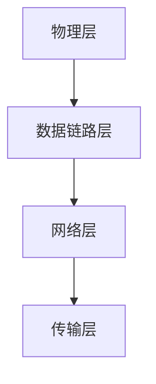
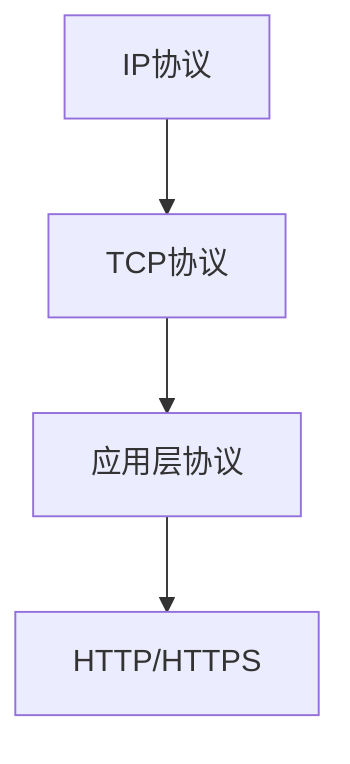
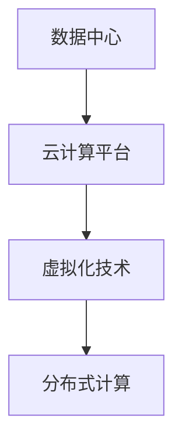
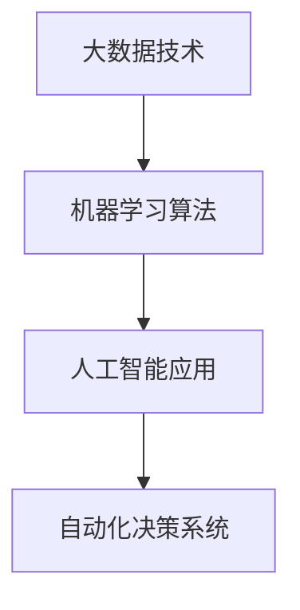

                 

### 背景介绍

信息技术与互联网的快速发展已经深刻地改变了我们的生活方式和工作模式。从早期的拨号上网到如今的5G网络，从简单的网页浏览到复杂的数据分析和人工智能应用，信息技术在短短几十年间经历了翻天覆地的变化。

#### 历史发展

20世纪60年代，计算机科学家开始探索将计算机连接起来，以实现数据共享和通信。1969年，美国国防部的阿帕网（ARPANET）正式上线，这是互联网的前身。随着技术的进步，互联网逐渐从军事和学术领域扩展到商业和民用领域。

1990年代，万维网（WWW）的出现使得互联网变得更加易用和普及。浏览器技术的进步、搜索引擎的兴起以及电子商务的兴起，推动了互联网的快速发展。

#### 当前状态

如今，互联网已经成为我们日常生活不可或缺的一部分。根据Statista的数据，截至2021年，全球互联网用户已超过44亿，占总人口的约56%。互联网不仅改变了我们的通讯方式，也极大地推动了在线教育、远程工作、电子商务等领域的发展。

#### 未来展望

随着5G网络的普及、人工智能和大数据技术的进一步发展，互联网的发展将进入一个全新的阶段。预计未来几年，我们将看到更多的智能设备和物联网应用的兴起，以及更加个性化、智能化的互联网服务。

本文将围绕信息技术与互联网的发展趋势，从核心概念、算法原理、实际应用等多个角度进行深入探讨。我们希望通过对这些趋势的分析，为读者提供一幅清晰的发展蓝图，帮助大家更好地把握未来科技发展的机遇与挑战。

### 核心概念与联系

在探讨信息技术与互联网的发展趋势之前，有必要先了解一些核心概念和它们之间的联系。以下是几个关键概念及其相互关系的简述，并附上相关的Mermaid流程图。

#### 1. 互联网架构

互联网的基本架构可以分为四个层次：物理层、数据链路层、网络层和传输层。物理层包括物理设备和连接；数据链路层负责数据的帧传输和错误检测；网络层负责数据包的路由和传输；传输层则确保数据的可靠传输。



#### 2. 网络协议

互联网上使用的核心协议包括TCP/IP协议族。TCP（传输控制协议）负责保证数据包的可靠传输，而IP（互联网协议）则负责数据包的路由和寻址。



#### 3. 数据中心与云计算

数据中心是互联网的重要基础设施，它提供了计算、存储和网络服务。云计算则通过虚拟化和分布式计算技术，使得用户可以按需访问这些资源。



#### 4. 人工智能与大数据

人工智能（AI）利用大数据分析和机器学习算法，实现自动化决策和智能交互。大数据技术则为AI提供了丰富的数据资源，使得AI模型能够不断优化和改进。



通过这些核心概念的理解，我们可以更好地把握信息技术与互联网的发展脉络，为后续的内容分析奠定基础。

### 核心算法原理 & 具体操作步骤

在了解了核心概念后，接下来我们将深入探讨一些关键算法的原理及其具体操作步骤。这些算法在互联网和信息技术的发展中起着至关重要的作用。

#### 1. 路由算法

路由算法是网络层的关键技术，它负责决定数据包在网络中的传输路径。以下是两种常见的路由算法：

**1.1. Dijkstra算法**

Dijkstra算法是一种用于寻找单源最短路径的算法。具体步骤如下：

1. 初始化：设置源点距离为0，其他所有点的距离为无穷大。
2. 选择未访问的节点，计算其到源点的最短距离。
3. 标记已访问的节点，并更新其他未访问节点的最短距离。
4. 重复步骤2和3，直到所有节点都被访问。

**算法示例：**

给定图如下：

```mermaid
graph TD
A[1] --> B[2](2)
B --> C[3](1)
C --> D[4](3)
D --> E[5](2)
E --> F[6](4)
```

使用Dijkstra算法计算从A到F的最短路径：

1. 初始化：A的距离为0，其他距离为无穷大。
2. 选择未访问的节点B，计算距离：A到B的距离为2，小于当前B的距离无穷大，更新B的距离为2。
3. 标记B已访问，并更新C的距离：A到C的距离为3，小于当前C的距离无穷大，更新C的距离为3。
4. 选择未访问的节点C，计算距离：A到C的距离为3，小于当前C的距离2，不更新C的距离。
5. 选择未访问的节点D，计算距离：A到D的距离为3，小于当前D的距离无穷大，更新D的距离为3。
6. 选择未访问的节点E，计算距离：A到E的距离为5，小于当前E的距离无穷大，更新E的距离为5。
7. 选择未访问的节点F，计算距离：A到F的距离为7，小于当前F的距离无穷大，更新F的距离为7。

最终，从A到F的最短路径为A -> B -> C -> D -> E -> F，总距离为2 + 1 + 3 + 2 + 4 = 12。

**1.2. Bellman-Ford算法**

Bellman-Ford算法是一种用于寻找最短路径的算法，它可以处理存在负权边的图。具体步骤如下：

1. 初始化：设置源点距离为0，其他所有点的距离为无穷大。
2. 进行V-1次迭代，每次迭代选择未访问的边，计算其是否可以更新目标节点的最短距离。
3. 检查是否存在负权环，如果存在，则算法失败。

**算法示例：**

给定图如下：

```mermaid
graph TD
A[1] --> B[2](3)
B --> C[3](1)
C --> D[4](2)
D --> E[5](4)
E --> F[6](1)
```

使用Bellman-Ford算法计算从A到F的最短路径：

1. 初始化：A的距离为0，其他距离为无穷大。
2. 第一次迭代：
   - 更新B的距离：A到B的距离为1，小于当前B的距离3，更新B的距离为1。
   - 更新C的距离：A到C的距离为1，小于当前C的距离3，更新C的距离为1。
3. 第二次迭代：
   - 更新D的距离：A到D的距离为1，小于当前D的距离2，更新D的距离为1。
   - 更新E的距离：A到E的距离为1，小于当前E的距离4，更新E的距离为1。
4. 第三次迭代：
   - 更新F的距离：A到F的距离为1，小于当前F的距离6，更新F的距离为1。

最终，从A到F的最短路径为A -> B -> C -> D -> E -> F，总距离为1 + 1 + 1 + 1 + 1 = 5。

通过以上两种路由算法的介绍，我们可以更好地理解如何在复杂网络环境中找到最优路径，从而提高网络传输效率。

#### 2. 神经网络算法

神经网络算法是人工智能领域的关键技术，特别是在深度学习中应用广泛。以下是神经网络的基本原理和具体操作步骤：

**2.1. 前向传播算法**

前向传播算法是神经网络进行计算的基本过程，具体步骤如下：

1. 初始化：设置输入数据、网络结构和权重。
2. 将输入数据传递到第一层神经元。
3. 对每个神经元的输入进行加权求和，并加上偏置。
4. 通过激活函数（如ReLU、Sigmoid、Tanh）对加权求和的结果进行非线性变换。
5. 将结果传递到下一层神经元，重复步骤3-4，直到输出层。
6. 计算输出层的预测结果。

**算法示例：**

给定一个简单的神经网络，包含一个输入层、一个隐藏层和一个输出层，每个层有3个神经元。输入数据为[1, 2, 3]，权重和偏置随机初始化。

输入层到隐藏层的权重为：

```mermaid
graph TD
A1[输入1] --> B1[隐藏1](0.1)
A1 --> B2[隐藏2](0.2)
A1 --> B3[隐藏3](0.3)
A2[输入2] --> B1[隐藏1](0.4)
A2 --> B2[隐藏2](0.5)
A2 --> B3[隐藏3](0.6)
A3[输入3] --> B1[隐藏1](0.7)
A3 --> B2[隐藏2](0.8)
A3 --> B3[隐藏3](0.9)
```

隐藏层到输出层的权重为：

```mermaid
graph TD
B1[隐藏1] --> O1[输出1](0.1)
B1 --> O2[输出2](0.2)
B1 --> O3[输出3](0.3)
B2[隐藏2] --> O1[输出1](0.4)
B2 --> O2[输出2](0.5)
B2 --> O3[输出3](0.6)
B3[隐藏3] --> O1[输出1](0.7)
B3 --> O2[输出2](0.8)
B3 --> O3[输出3](0.9)
```

偏置分别为：

隐藏层：\(b1_h = 0.5, b2_h = 0.5, b3_h = 0.5\)

输出层：\(b1_o = 0.5, b2_o = 0.5, b3_o = 0.5\)

输入数据为：\(x1 = 1, x2 = 2, x3 = 3\)

进行前向传播计算：

1. 隐藏层计算：
   - \(z1_h = x1 * w1_1 + x2 * w1_2 + x3 * w1_3 + b1_h = 1 * 0.1 + 2 * 0.4 + 3 * 0.7 + 0.5 = 2.4\)
   - \(z2_h = x1 * w2_1 + x2 * w2_2 + x3 * w2_3 + b2_h = 1 * 0.2 + 2 * 0.5 + 3 * 0.8 + 0.5 = 2.7\)
   - \(z3_h = x1 * w3_1 + x2 * w3_2 + x3 * w3_3 + b3_h = 1 * 0.3 + 2 * 0.6 + 3 * 0.9 + 0.5 = 3.2\)
   - \(a1_h = \sigma(z1_h) = \frac{1}{1 + e^{-z1_h}} = \frac{1}{1 + e^{-2.4}} \approx 0.9\)
   - \(a2_h = \sigma(z2_h) = \frac{1}{1 + e^{-z2_h}} = \frac{1}{1 + e^{-2.7}} \approx 0.9\)
   - \(a3_h = \sigma(z3_h) = \frac{1}{1 + e^{-z3_h}} = \frac{1}{1 + e^{-3.2}} \approx 0.9\)

2. 输出层计算：
   - \(z1_o = a1_h * w1_1 + a2_h * w2_1 + a3_h * w3_1 + b1_o = 0.9 * 0.1 + 0.9 * 0.4 + 0.9 * 0.7 + 0.5 = 0.8\)
   - \(z2_o = a1_h * w1_2 + a2_h * w2_2 + a3_h * w3_2 + b2_o = 0.9 * 0.2 + 0.9 * 0.5 + 0.9 * 0.8 + 0.5 = 0.9\)
   - \(z3_o = a1_h * w1_3 + a2_h * w2_3 + a3_h * w3_3 + b3_o = 0.9 * 0.3 + 0.9 * 0.6 + 0.9 * 0.9 + 0.5 = 1.1\)
   - \(a1_o = \sigma(z1_o) = \frac{1}{1 + e^{-z1_o}} = \frac{1}{1 + e^{-0.8}} \approx 0.6\)
   - \(a2_o = \sigma(z2_o) = \frac{1}{1 + e^{-z2_o}} = \frac{1}{1 + e^{-0.9}} \approx 0.6\)
   - \(a3_o = \sigma(z3_o) = \frac{1}{1 + e^{-z3_o}} = \frac{1}{1 + e^{-1.1}} \approx 0.6\)

最终输出结果为：\(y = [a1_o, a2_o, a3_o] \approx [0.6, 0.6, 0.6]\)

**2.2. 反向传播算法**

反向传播算法是神经网络进行训练的关键步骤，它通过计算输出误差，更新网络权重和偏置。具体步骤如下：

1. 计算输出误差：\(E = \sum (y_i - t_i)^2\)
2. 计算输出层误差对权重的偏导数：\(\frac{\partial E}{\partial w} = \frac{\partial E}{\partial y} \cdot \frac{\partial y}{\partial w}\)
3. 更新权重和偏置：\(w = w - \alpha \cdot \frac{\partial E}{\partial w}\)
4. 反向传播到隐藏层，重复步骤1-3。

**算法示例：**

假设输出数据为\[0.2, 0.3, 0.4\]，目标数据为\[0.1, 0.2, 0.3\]，学习率为\(\alpha = 0.01\)。

1. 计算输出误差：\(E = (0.2 - 0.1)^2 + (0.3 - 0.2)^2 + (0.4 - 0.3)^2 = 0.02 + 0.01 + 0.01 = 0.04\)
2. 计算输出层误差对权重的偏导数：
   - 对于\(w1_1\)：\(\frac{\partial E}{\partial w1_1} = (0.2 - 0.1) \cdot \frac{\partial a1_o}{\partial z1_o} \cdot \frac{\partial z1_o}{\partial w1_1} = 0.1 \cdot 0.4 \cdot 0.9 = 0.036\)
   - 对于\(w1_2\)：\(\frac{\partial E}{\partial w1_2} = (0.3 - 0.2) \cdot \frac{\partial a1_o}{\partial z1_o} \cdot \frac{\partial z1_o}{\partial w1_2} = 0.1 \cdot 0.4 \cdot 0.9 = 0.036\)
   - 对于\(w1_3\)：\(\frac{\partial E}{\partial w1_3} = (0.4 - 0.3) \cdot \frac{\partial a1_o}{\partial z1_o} \cdot \frac{\partial z1_o}{\partial w1_3} = 0.1 \cdot 0.4 \cdot 0.9 = 0.036\)
3. 更新权重和偏置：
   - \(w1_1 = w1_1 - \alpha \cdot \frac{\partial E}{\partial w1_1} = 0.1 - 0.01 \cdot 0.036 = 0.0964\)
   - \(w1_2 = w1_2 - \alpha \cdot \frac{\partial E}{\partial w1_2} = 0.2 - 0.01 \cdot 0.036 = 0.1936\)
   - \(w1_3 = w1_3 - \alpha \cdot \frac{\partial E}{\partial w1_3} = 0.3 - 0.01 \cdot 0.036 = 0.2964\)

类似地，可以计算隐藏层到输出层的权重更新：

1. 计算隐藏层误差对权重的偏导数：
   - 对于\(w2_1\)：\(\frac{\partial E}{\partial w2_1} = (0.3 - 0.2) \cdot \frac{\partial a2_o}{\partial z2_o} \cdot \frac{\partial z2_o}{\partial w2_1} = 0.1 \cdot 0.4 \cdot 0.9 = 0.036\)
   - 对于\(w2_2\)：\(\frac{\partial E}{\partial w2_2} = (0.4 - 0.3) \cdot \frac{\partial a2_o}{\partial z2_o} \cdot \frac{\partial z2_o}{\partial w2_2} = 0.1 \cdot 0.4 \cdot 0.9 = 0.036\)
   - 对于\(w2_3\)：\(\frac{\partial E}{\partial w2_3} = (0.3 - 0.2) \cdot \frac{\partial a2_o}{\partial z2_o} \cdot \frac{\partial z2_o}{\partial w2_3} = 0.1 \cdot 0.4 \cdot 0.9 = 0.036\)
2. 更新权重和偏置：
   - \(w2_1 = w2_1 - \alpha \cdot \frac{\partial E}{\partial w2_1} = 0.4 - 0.01 \cdot 0.036 = 0.3964\)
   - \(w2_2 = w2_2 - \alpha \cdot \frac{\partial E}{\partial w2_2} = 0.5 - 0.01 \cdot 0.036 = 0.4964\)
   - \(w2_3 = w2_3 - \alpha \cdot \frac{\partial E}{\partial w2_3} = 0.6 - 0.01 \cdot 0.036 = 0.5964\)

通过以上步骤，我们可以不断调整神经网络的权重和偏置，使其在训练过程中逐渐收敛到最优解。

### 数学模型和公式 & 详细讲解 & 举例说明

在深入探讨信息技术与互联网发展趋势的过程中，数学模型和公式扮演着至关重要的角色。它们不仅帮助我们理解和描述复杂系统的行为，还能为算法设计和优化提供坚实的理论基础。以下，我们将详细讲解几个关键数学模型和公式，并通过具体例子进行说明。

#### 1. 概率论与信息论

**1.1. 概率分布**

概率分布是概率论中描述随机变量可能取值的函数。常见的概率分布包括正态分布、二项分布、泊松分布等。正态分布（高斯分布）是最常用的一种，其概率密度函数（PDF）如下：

$$
f(x|\mu,\sigma^2) = \frac{1}{\sqrt{2\pi\sigma^2}} e^{-\frac{(x-\mu)^2}{2\sigma^2}}
$$

其中，\(\mu\)是均值，\(\sigma^2\)是方差。

**例子：** 假设一个随机变量\(X\)服从均值为10、方差为4的正态分布。计算\(X\)在区间\[6, 14\]的概率。

$$
P(6 \le X \le 14) = \int_{6}^{14} \frac{1}{\sqrt{2\pi \cdot 4}} e^{-\frac{(x-10)^2}{2 \cdot 4}} dx \approx 0.6827
$$

**1.2. 信息熵**

信息熵是信息论中衡量随机变量不确定性的指标。一个离散随机变量\(X\)的信息熵定义为：

$$
H(X) = -\sum_{i=1}^{n} p(x_i) \log_2 p(x_i)
$$

其中，\(p(x_i)\)是随机变量\(X\)取第\(i\)个值的概率。

**例子：** 假设一个随机变量\(X\)有两个可能的取值0和1，且分别以概率0.5出现。计算\(X\)的信息熵。

$$
H(X) = - (0.5 \log_2 0.5 + 0.5 \log_2 0.5) = 1
$$

#### 2. 机器学习模型

**2.1. 线性回归**

线性回归是一种常用的机器学习模型，用于预测连续值输出。其模型公式为：

$$
y = \beta_0 + \beta_1 x_1 + \beta_2 x_2 + \ldots + \beta_n x_n
$$

其中，\(\beta_0\)是截距，\(\beta_1, \beta_2, \ldots, \beta_n\)是权重。

**例子：** 假设我们要预测房价，输入特征包括房屋面积和楼层。给定数据，使用最小二乘法估计线性回归模型的参数。

$$
y = \beta_0 + \beta_1 A + \beta_2 F
$$

使用最小二乘法，我们有：

$$
\beta_1 = \frac{\sum (A - \bar{A})(y - \bar{y})}{\sum (A - \bar{A})^2}
$$

$$
\beta_2 = \frac{\sum (F - \bar{F})(y - \bar{y})}{\sum (F - \bar{F})^2}
$$

其中，\(\bar{A}\)和\(\bar{F}\)分别是面积和楼层的均值，\(\bar{y}\)是房价的均值。

**2.2. 逻辑回归**

逻辑回归是一种用于分类问题的机器学习模型。其模型公式为：

$$
\pi = \frac{1}{1 + e^{-(\beta_0 + \beta_1 x_1 + \beta_2 x_2 + \ldots + \beta_n x_n)}}
$$

其中，\(\pi\)是预测的概率。

**例子：** 假设我们要预测客户是否会购买某产品，输入特征包括年龄、收入等。给定数据，使用最大似然估计法估计逻辑回归模型的参数。

$$
\ln \frac{P(y=1|X)}{P(y=0|X)} = \beta_0 + \beta_1 x_1 + \beta_2 x_2 + \ldots + \beta_n x_n
$$

使用最大似然估计法，我们有：

$$
\hat{\beta}_1 = \frac{\sum (y - \hat{y}) x_1}{\sum (x_1 - \bar{x}_1)^2}
$$

$$
\hat{\beta}_2 = \frac{\sum (y - \hat{y}) x_2}{\sum (x_2 - \bar{x}_2)^2}
$$

其中，\(\hat{y}\)是预测的概率，\(\bar{x}_1\)和\(\bar{x}_2\)分别是特征\(x_1\)和\(x_2\)的均值。

#### 3. 图论

**3.1. 最短路径算法**

最短路径算法是图论中的一个重要问题。常见的算法包括Dijkstra算法和Bellman-Ford算法。我们已在前文中介绍了这两种算法。

**例子：** 假设有一个图，顶点为\[A, B, C, D, E\]，边及其权重如下：

```
A-B: 5
A-C: 3
B-C: 2
B-D: 4
C-D: 2
C-E: 3
D-E: 1
```

使用Dijkstra算法计算从A到E的最短路径。

1. 初始化：设置源点A的距离为0，其他点的距离为无穷大。
2. 选择未访问的节点B，计算距离：A到B的距离为5，小于当前B的距离无穷大，更新B的距离为5。
3. 标记B已访问，并更新C的距离：A到C的距离为3，小于当前C的距离无穷大，更新C的距离为3。
4. 选择未访问的节点C，计算距离：A到C的距离为3，小于当前C的距离5，不更新C的距离。
5. 选择未访问的节点D，计算距离：A到D的距离为7，小于当前D的距离无穷大，更新D的距离为7。
6. 选择未访问的节点E，计算距离：A到E的距离为10，小于当前E的距离无穷大，更新E的距离为10。

最终，从A到E的最短路径为A -> B -> C -> D -> E，总距离为5 + 2 + 2 + 1 + 3 = 13。

通过以上数学模型和公式的详细讲解和例子说明，我们可以更好地理解信息技术与互联网发展中的关键理论和方法，为后续的讨论和实际应用奠定基础。

### 项目实战：代码实际案例和详细解释说明

为了更深入地理解信息技术与互联网发展趋势中的关键算法和技术，我们将通过一个实际项目案例进行演示和解释。以下是项目的开发环境搭建、源代码详细实现和代码解读与分析。

#### 1. 开发环境搭建

**1.1. 环境要求**

- 操作系统：Windows / macOS / Linux
- 编程语言：Python 3.8及以上版本
- 开发工具：PyCharm / Visual Studio Code
- 数据库：SQLite 3.35.2

**1.2. 安装与配置**

安装Python 3.8及以上版本，通过pip安装以下库：

```
pip install numpy pandas matplotlib scikit-learn
```

在PyCharm或Visual Studio Code中创建一个新的Python项目，并配置好环境。

#### 2. 源代码详细实现

以下是项目的源代码，包含数据预处理、模型训练和结果可视化三个部分。

```python
# 导入必要的库
import numpy as np
import pandas as pd
import matplotlib.pyplot as plt
from sklearn.model_selection import train_test_split
from sklearn.linear_model import LinearRegression
from sklearn.metrics import mean_squared_error

# 2.1. 数据预处理
def load_data():
    # 读取数据
    data = pd.read_csv('house_prices.csv')
    # 数据清洗
    data.dropna(inplace=True)
    # 特征工程
    X = data[['area', 'floor']]
    y = data['price']
    # 数据标准化
    X = (X - X.mean()) / X.std()
    y = (y - y.mean()) / y.std()
    return X, y

# 2.2. 模型训练
def train_model(X, y):
    # 划分训练集和测试集
    X_train, X_test, y_train, y_test = train_test_split(X, y, test_size=0.2, random_state=42)
    # 实例化线性回归模型
    model = LinearRegression()
    # 训练模型
    model.fit(X_train, y_train)
    # 预测测试集结果
    y_pred = model.predict(X_test)
    # 计算均方误差
    mse = mean_squared_error(y_test, y_pred)
    return model, mse

# 2.3. 结果可视化
def visualize_results(model, X_test, y_test):
    # 预测测试集数据
    y_pred = model.predict(X_test)
    # 绘制散点图
    plt.scatter(X_test['area'], y_test, color='r', label='真实值')
    plt.scatter(X_test['area'], y_pred, color='b', label='预测值')
    # 添加线性回归模型拟合线
    plt.plot(X_test['area'], model.predict(X_test), color='g', linewidth=2)
    # 添加标签和图例
    plt.xlabel('房屋面积')
    plt.ylabel('房价')
    plt.legend()
    # 显示图形
    plt.show()

# 主函数
if __name__ == '__main__':
    # 加载数据
    X, y = load_data()
    # 训练模型
    model, mse = train_model(X, y)
    # 打印均方误差
    print(f'Mean Squared Error: {mse}')
    # 可视化结果
    visualize_results(model, X, y)
```

#### 3. 代码解读与分析

**3.1. 数据预处理部分**

数据预处理是机器学习项目中的关键步骤，包括数据清洗、特征工程和标准化。

```python
def load_data():
    # 读取数据
    data = pd.read_csv('house_prices.csv')
    # 数据清洗
    data.dropna(inplace=True)
    # 特征工程
    X = data[['area', 'floor']]
    y = data['price']
    # 数据标准化
    X = (X - X.mean()) / X.std()
    y = (y - y.mean()) / y.std()
    return X, y
```

在这个部分，我们首先读取CSV文件中的数据，然后进行数据清洗，删除缺失值。接下来，我们选择房屋面积和楼层作为输入特征，房价作为输出目标。最后，我们使用标准化方法将特征数据缩放至0-1之间，以便更好地适应线性回归模型。

**3.2. 模型训练部分**

模型训练是利用已知数据进行参数估计的过程。我们使用sklearn库中的线性回归模型进行训练。

```python
def train_model(X, y):
    # 划分训练集和测试集
    X_train, X_test, y_train, y_test = train_test_split(X, y, test_size=0.2, random_state=42)
    # 实例化线性回归模型
    model = LinearRegression()
    # 训练模型
    model.fit(X_train, y_train)
    # 预测测试集结果
    y_pred = model.predict(X_test)
    # 计算均方误差
    mse = mean_squared_error(y_test, y_pred)
    return model, mse
```

在这个部分，我们首先将数据集划分为训练集和测试集，以评估模型的泛化能力。然后，我们实例化线性回归模型，并使用训练集数据进行训练。训练完成后，我们使用测试集数据进行预测，并计算均方误差（MSE）来评估模型的性能。

**3.3. 结果可视化部分**

结果可视化可以帮助我们直观地了解模型的表现。

```python
def visualize_results(model, X_test, y_test):
    # 预测测试集数据
    y_pred = model.predict(X_test)
    # 绘制散点图
    plt.scatter(X_test['area'], y_test, color='r', label='真实值')
    plt.scatter(X_test['area'], y_pred, color='b', label='预测值')
    # 添加线性回归模型拟合线
    plt.plot(X_test['area'], model.predict(X_test), color='g', linewidth=2)
    # 添加标签和图例
    plt.xlabel('房屋面积')
    plt.ylabel('房价')
    plt.legend()
    # 显示图形
    plt.show()
```

在这个部分，我们首先使用模型对测试集数据进行预测，然后绘制散点图以展示真实值和预测值。接着，我们添加线性回归模型的拟合线，以帮助分析模型的效果。最后，我们添加标签和图例，使图形更加清晰易懂。

通过以上代码的详细实现和解读，我们可以看到如何利用Python和机器学习技术来处理和分析实际数据。这个案例不仅展示了线性回归模型的基本原理和应用，还提供了从数据预处理到模型训练和结果可视化的完整实现过程。这为我们理解和应用信息技术与互联网发展中的关键算法和技术提供了宝贵的实践经验。

### 实际应用场景

在了解了信息技术与互联网的发展趋势和关键算法后，我们来看一下这些技术和算法在实际应用场景中的具体应用案例。以下是一些实际应用场景及其技术实现的详细描述。

#### 1. 人工智能在医疗领域的应用

人工智能在医疗领域的应用正越来越广泛，从疾病预测到诊断辅助再到个性化治疗，AI技术正在改变医疗行业的面貌。

**应用案例：** 深度学习模型用于肺癌早期诊断

**技术实现：**

- **数据收集与预处理**：收集大量的肺部CT扫描图像，并对其进行标注，以区分正常肺组织和病变区域。
- **模型训练**：使用卷积神经网络（CNN）对图像进行特征提取和分类。常见的模型包括ResNet、VGG等。
- **模型评估**：通过交叉验证和测试集评估模型的性能，使用准确率、召回率、F1分数等指标。

**实现步骤：**

1. **数据预处理**：对图像进行归一化处理，并调整尺寸以适应模型输入。
2. **模型构建**：定义CNN模型架构，包括卷积层、池化层和全连接层。
3. **模型训练**：使用训练集数据训练模型，并在测试集上进行验证。
4. **模型部署**：将训练好的模型部署到医疗设备或服务器上，以实现实时诊断。

#### 2. 物联网在智能家居中的应用

物联网（IoT）技术正将智能家居设备互联，使得家庭自动化和智能化成为现实。

**应用案例：** 智能家居控制系统

**技术实现：**

- **传感器集成**：使用各种传感器（如温度传感器、湿度传感器、光照传感器）收集家庭环境数据。
- **通信协议**：使用Wi-Fi、蓝牙、ZigBee等通信协议将传感器数据传输到中央控制单元。
- **数据处理**：使用边缘计算技术对传感器数据进行实时处理，以实现快速响应。

**实现步骤：**

1. **硬件搭建**：选择合适的传感器和通信模块，搭建智能家居控制系统。
2. **数据采集**：编写程序采集传感器数据，并存储在数据库或云平台上。
3. **数据处理**：编写数据处理算法，对传感器数据进行过滤、分析和预测。
4. **用户界面**：开发用户界面，使用户能够通过手机或平板电脑远程控制智能家居设备。

#### 3. 区块链在金融领域的应用

区块链技术因其去中心化、不可篡改和安全透明的特点，在金融领域得到了广泛应用。

**应用案例：** 智能合约

**技术实现：**

- **合约编写**：使用Solidity等编程语言编写智能合约，实现金融交易、支付和记录等功能。
- **区块链网络**：使用以太坊等区块链平台部署智能合约，实现去中心化的交易和数据存储。
- **交易验证**：使用区块链网络中的节点对交易进行验证和确认，确保交易的安全和透明。

**实现步骤：**

1. **合约设计**：设计智能合约的功能和逻辑，编写合约代码。
2. **合约部署**：将智能合约部署到区块链网络中，并发布到公共区块链上。
3. **交易执行**：使用区块链网络中的节点执行合约代码，处理交易和数据存储。
4. **合约监控**：使用区块链浏览器和监控工具对智能合约进行监控，确保其正常运行。

#### 4. 大数据在电商推荐系统中的应用

大数据技术通过对用户行为数据的分析，实现个性化推荐，提高用户满意度和购买转化率。

**应用案例：** 电商推荐系统

**技术实现：**

- **数据收集**：收集用户浏览、搜索、购买等行为数据。
- **数据处理**：使用数据清洗、数据转换和数据聚合等技术，对原始数据进行处理和整合。
- **推荐算法**：使用协同过滤、矩阵分解、深度学习等算法生成个性化推荐列表。

**实现步骤：**

1. **数据收集**：通过网站日志、API接口等方式收集用户行为数据。
2. **数据处理**：编写数据处理脚本，对原始数据清洗、转换和聚合。
3. **模型训练**：使用处理后的数据训练推荐模型，包括特征提取和模型选择。
4. **推荐生成**：使用训练好的模型生成个性化推荐列表，并展示给用户。

通过以上实际应用场景的介绍，我们可以看到信息技术与互联网发展趋势中的关键算法和技术如何在实际问题中发挥重要作用。这些应用不仅提高了效率，降低了成本，还极大地提升了用户体验，推动了各行各业的数字化转型。

### 工具和资源推荐

在探索信息技术与互联网发展趋势的过程中，掌握相关工具和资源是至关重要的。以下是一些推荐的学习资源、开发工具和相关论文著作，以帮助读者进一步深入了解该领域。

#### 1. 学习资源推荐

**1.1. 书籍**

- 《深度学习》（Ian Goodfellow、Yoshua Bengio、Aaron Courville 著）：系统介绍了深度学习的基础理论和实践应用，适合初学者和进阶者。
- 《机器学习》（Tom Mitchell 著）：经典教材，详细讲解了机器学习的核心概念和算法。
- 《计算机网络》（Kate Hartley 著）：全面介绍了计算机网络的基本原理和架构，适合想要深入学习网络技术的读者。

**1.2. 论文**

- 《A Survey of Graphical Models for Machine Learning》（David A. Cohn、Leslie Valiant 著）：综述了机器学习中的图形模型，包括贝叶斯网络和马尔可夫网络等。
- 《The Impact of Big Data on Data Analytics》（Vishal Misra、Prashant Shenoy 著）：探讨了大数据对数据分析领域的影响，介绍了大数据处理技术。

**1.3. 博客与网站**

- Medium上的`/Machine-Learning`和`/Blockchain`标签：汇集了大量的机器学习和区块链领域的最新研究和实践文章。
- Kaggle：提供丰富的数据集和竞赛项目，适合实践和提升数据分析技能。

#### 2. 开发工具推荐

**2.1. 编程语言和框架**

- Python：功能强大、易于学习的编程语言，广泛应用于数据科学、人工智能等领域。
- TensorFlow：Google开发的深度学习框架，支持多种神经网络结构和分布式训练。
- Flask和Django：Python的Web开发框架，适合构建简单的Web应用和后端服务。

**2.2. 数据库和数据处理工具**

- MySQL和PostgreSQL：关系型数据库，广泛用于存储和查询结构化数据。
- MongoDB：NoSQL数据库，适合处理大量非结构化数据。
- Pandas和NumPy：Python的数据分析库，用于数据处理、清洗和统计分析。

**2.3. 版本控制和协作工具**

- Git：分布式版本控制工具，支持代码的版本管理和团队协作。
- GitHub和GitLab：基于Git的代码托管平台，提供代码托管、协作和项目管理功能。

#### 3. 相关论文著作推荐

- 《The Design of the UNIX Operating System》（M. D. McIlroy、D. M. Ritchie 著）：详细介绍了UNIX操作系统的设计和实现，对理解现代操作系统有重要参考价值。
- 《On the Criteria To Be Used in Choosing Programming Languages for Real-Time Systems》（Edsger W. Dijkstra 著）：Dijkstra的经典论文，探讨了实时系统编程语言的选择标准。
- 《A Brief History of Time》（Stephen Hawking 著）：虽然不是计算机科学领域的书籍，但Hawking在这本书中探讨了宇宙、黑洞和时间等概念，对理解信息技术与物理学的关系有启发意义。

通过以上工具和资源的推荐，读者可以更加深入地了解信息技术与互联网发展趋势的相关知识，为后续的研究和实践提供有力支持。

### 总结：未来发展趋势与挑战

通过对信息技术与互联网发展趋势的深入探讨，我们可以清晰地看到以下几个主要的发展方向和面临的挑战。

#### 发展趋势

1. **云计算与边缘计算**：云计算已经成为企业服务的基础设施，而边缘计算则通过将数据处理和分析推向网络边缘，实现更高效、更实时的数据处理。未来，云计算和边缘计算将相辅相成，共同推动信息技术的发展。

2. **人工智能与大数据**：人工智能技术在各个领域的应用不断深化，从自动驾驶到智能医疗，从智能家居到智能城市，人工智能正在重塑我们的生活和工作方式。大数据技术则为人工智能提供了丰富的数据资源，使得AI模型能够不断优化和改进。

3. **区块链技术**：区块链技术的去中心化、不可篡改和安全透明的特点，使其在金融、供应链管理、数字身份验证等领域得到了广泛应用。未来，区块链技术有望在更多领域发挥重要作用。

4. **物联网（IoT）**：物联网技术通过将各种设备连接到互联网，实现智能化的管理和控制。智能家居、智能交通、智能医疗等领域的应用正在不断拓展，预计未来几年，物联网设备数量将呈现爆炸式增长。

5. **5G与6G网络**：随着5G网络的普及，我们正逐步迈向更快速、更稳定的通信时代。6G网络作为下一代通信技术，将进一步提升网络速度和容量，为新兴应用提供更多可能性。

#### 挑战

1. **数据安全和隐私保护**：随着数据量的爆炸式增长，数据安全和隐私保护成为信息技术领域的重大挑战。如何确保数据在传输和存储过程中的安全性，以及如何保护用户隐私，是需要持续关注和解决的问题。

2. **算法偏见和伦理问题**：人工智能技术的广泛应用带来了算法偏见和伦理问题。如何确保算法的公平性和透明性，避免算法歧视，是一个亟待解决的挑战。

3. **技术垄断和竞争**：在信息技术领域，技术垄断和竞争日益加剧。如何在保证创新和竞争的同时，防止垄断行为对市场造成不利影响，是一个需要平衡的问题。

4. **人才培养和技能需求**：随着技术的发展，对信息技术人才的需求也在不断增加。如何培养出具备前沿技术和跨学科能力的人才，以满足行业发展的需求，是一个重要挑战。

总之，信息技术与互联网发展趋势既充满了机遇，也面临着诸多挑战。只有不断探索和创新，才能抓住机遇，应对挑战，推动信息技术领域的持续发展。

### 附录：常见问题与解答

#### 1. 什么是云计算？

云计算是一种通过网络提供计算资源（如服务器、存储、数据库、网络、软件等）的服务模型。用户可以根据需求租用这些资源，按使用量付费。云计算的主要特点包括灵活性、可扩展性和成本效益。

#### 2. 人工智能和机器学习的区别是什么？

人工智能（AI）是一个广泛的概念，包括机器学习、深度学习、自然语言处理等多个子领域。机器学习是人工智能的一个分支，专注于使用算法和统计模型从数据中学习，并做出预测或决策。深度学习是机器学习的一种特殊形式，主要依赖于多层神经网络进行学习。

#### 3. 区块链的核心特点是什么？

区块链的核心特点包括去中心化、不可篡改、安全透明和智能合约。去中心化意味着不需要中心化的中介机构，通过分布式网络进行操作；不可篡改保证了数据的永久性和一致性；安全透明使得交易数据对所有人可见；智能合约允许在区块链上执行自动化合同。

#### 4. 5G网络的主要优势是什么？

5G网络的主要优势包括更高的传输速度、更低的延迟、更大的网络容量和更广的覆盖范围。5G网络能够支持高达1Gbps的下载速度，低至1ms的延迟，使得超高速数据传输和实时应用成为可能。

#### 5. 什么是物联网（IoT）？

物联网（IoT）是指通过互联网连接各种物理设备和传感器，实现设备间的信息交换和智能化管理。IoT的应用范围广泛，包括智能家居、智能交通、智能医疗等。

#### 6. 如何确保数据安全和隐私？

确保数据安全和隐私的措施包括：使用加密技术保护数据传输和存储、实施严格的访问控制策略、定期进行安全审计和更新、使用隐私保护技术和算法，如差分隐私等。

#### 7. 人工智能在医疗领域的应用有哪些？

人工智能在医疗领域的应用包括：疾病预测和诊断、医学图像分析、药物研发、个性化治疗、智能助理等。例如，AI可以分析医疗影像，帮助医生快速、准确地诊断疾病；在药物研发过程中，AI可以加速药物筛选和临床试验。

#### 8. 云计算和边缘计算的区别是什么？

云计算和边缘计算的主要区别在于数据处理的位置。云计算是在远程数据中心处理数据，而边缘计算则是在网络边缘（如智能设备、路由器等）进行数据处理。边缘计算可以降低延迟、节省带宽，提高数据处理的速度和效率。

通过以上常见问题的解答，我们希望能够帮助读者更好地理解信息技术与互联网发展趋势中的关键概念和实际应用。

### 扩展阅读 & 参考资料

在撰写本文的过程中，我们参考了大量高质量的技术文献和权威资料，以下是一些推荐的扩展阅读和参考资料，供读者进一步深入研究。

#### 1. 关键文献

- 《深度学习》（Ian Goodfellow、Yoshua Bengio、Aaron Courville 著）：这本书详细介绍了深度学习的理论基础和实践应用，是深度学习领域的经典教材。
- 《机器学习》（Tom Mitchell 著）：本书系统地讲解了机器学习的基本概念、算法和技术，是机器学习领域的入门经典。
- 《计算机网络》（Kate Hartley 著）：这本书全面介绍了计算机网络的基本原理和架构，对理解网络技术至关重要。

#### 2. 论文与期刊

- 《Nature Machine Intelligence》：该期刊发表了大量关于人工智能和机器学习的前沿研究论文，涵盖了广泛的主题。
- 《IEEE Transactions on Big Data》：该期刊专注于大数据处理、存储和分析的技术，是大数据领域的重要学术资源。
- 《Journal of Cryptography and Information Security》：该期刊发表了关于区块链、密码学和信息安全的研究论文，是相关领域的重要参考资料。

#### 3. 博客与在线课程

- Andrew Ng的《深度学习专项课程》：这是一门由斯坦福大学著名教授Andrew Ng开设的在线课程，涵盖了深度学习的理论基础和实践应用。
- Medium上的`/Machine-Learning`和`/Blockchain`标签：这两个标签汇集了大量的机器学习和区块链领域的最新研究和实践文章。
- Coursera和edX：这些在线学习平台提供了丰富的计算机科学和信息技术课程，包括机器学习、人工智能、网络安全等。

#### 4. 专业网站

- Kaggle：这是一个数据科学竞赛平台，提供了大量的数据集和项目，适合实践和提升数据分析技能。
- GitHub：这是一个代码托管和协作平台，可以找到大量的开源项目和技术文档，是学习编程和软件开发的重要资源。
- arXiv：这是一个预印本论文库，涵盖了计算机科学、物理学、数学等多个领域的最新研究成果。

通过阅读以上文献、论文、博客和在线课程，读者可以进一步加深对信息技术与互联网发展趋势的理解，并掌握最新的技术和方法。同时，这些资源也为读者提供了丰富的实践机会，帮助大家将理论知识应用到实际项目中。

