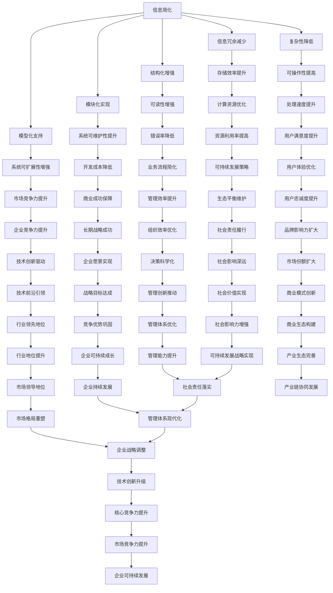
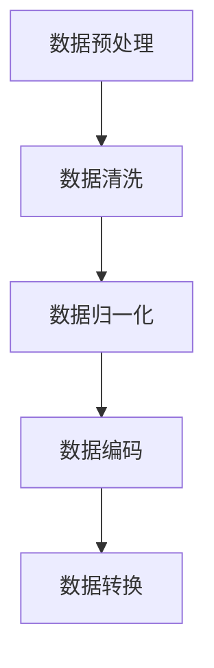
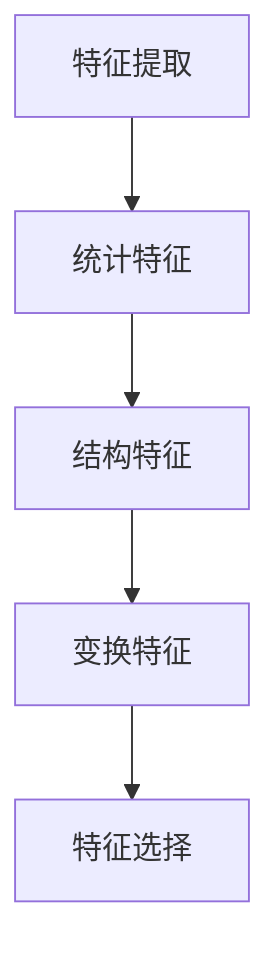
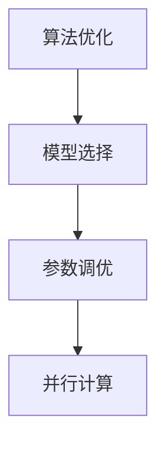
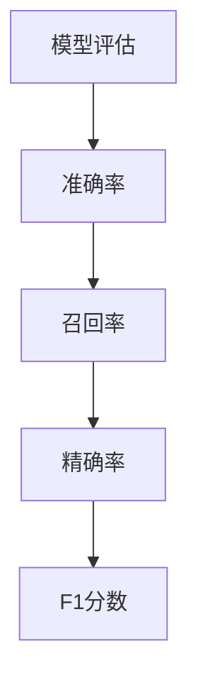

                 

### 背景介绍

在现代信息技术飞速发展的背景下，数据的复杂性呈现出了爆炸性的增长。从海量数据的存储、处理到信息提取和应用，无一不要求我们以简化的方式来面对和处理这些复杂的信息。这种简化的需求不仅在日常技术工作中体现，而且在科学研究、商业决策等多个领域都有着广泛的应用。本文旨在探讨信息简化的原则和最佳实践，通过详细分析和实际案例，帮助读者在混乱中建立秩序，实现信息的简洁与高效。

随着互联网的普及和人工智能技术的应用，越来越多的数据和信息被生成和传递。面对这些海量信息，如何有效地组织和处理成为了技术从业者的一大挑战。信息简化，作为信息科学中的一个重要分支，旨在通过一系列的方法和原则，将复杂的信息结构化、模块化，从而降低其复杂度，提高可读性和可操作性。本文将深入探讨信息简化的核心概念、算法原理、数学模型以及实际应用场景，为读者提供一套系统性的解决方案。

首先，我们将介绍信息简化的背景和重要性，接着通过核心概念和原理的讲解，引出Mermaid流程图来展示信息简化的具体架构。在此基础上，我们将详细阐述核心算法原理和操作步骤，并结合数学模型和公式，对简化过程进行深入分析。随后，通过实际项目的代码案例，我们将对信息简化的过程进行具体演示和解读。最后，我们将探讨信息简化的实际应用场景，推荐相关工具和资源，并总结未来发展趋势与挑战。

通过对本文的阅读，读者将能够系统地理解信息简化的原则和实践，掌握相关技术方法，从而在实际工作中更好地应对复杂信息处理的需求。

#### 核心概念与联系

在探讨信息简化的过程中，我们首先需要明确一些核心概念，这些概念是理解和实现信息简化的基础。

**1. 信息简化（Information Simplification）**：信息简化是指通过分析和处理，将复杂的信息转换为简单、易于理解和操作的形式。其核心目标是降低信息的复杂度，提高信息的可操作性和可读性。

**2. 复杂性（Complexity）**：在信息科学中，复杂性指的是信息系统的组成部分、结构以及它们之间的相互作用所带来的难以处理和理解的特征。简化信息的一个主要目的就是降低这种复杂性。

**3. 信息冗余（Information Redundancy）**：信息冗余是指信息中不必要的重复或多余部分，这些部分不仅浪费存储空间，还可能增加理解成本和处理难度。

**4. 结构化（Structuralization）**：结构化是指将信息按照一定的规则和标准进行分类、组织和表示，从而使其更具可读性和可操作性。

**5. 模块化（Modularization）**：模块化是将复杂系统划分为若干个相对独立的部分（模块），每个模块都有明确的输入、输出和功能。模块化有助于简化系统设计和开发，提高系统的可维护性和可扩展性。

**6. 模型化（Modeling）**：模型化是指通过建立数学模型、流程图或逻辑模型来表示和描述复杂信息系统的结构和行为，为信息简化提供理论依据。

理解这些核心概念之间的联系是进行信息简化的关键。我们可以用Mermaid流程图来展示这些概念之间的关系：



通过上述Mermaid流程图，我们可以清晰地看到信息简化与其他核心概念之间的相互作用和依赖关系。信息简化不仅仅是一个技术问题，它还涉及到系统的整体设计和战略规划。只有当这些核心概念相互协同、相互促进时，信息简化的效果才能最大化。

接下来，我们将深入探讨信息简化的核心算法原理和操作步骤，结合实际案例，逐步展示如何实现这一目标。

#### 核心算法原理 & 具体操作步骤

在明确了信息简化的核心概念后，接下来我们将深入探讨其核心算法原理和具体操作步骤。信息简化的目标是通过算法和技术手段，将复杂的信息结构转化为简单、高效且易于操作的形式。这一过程涉及多个方面，包括数据的预处理、特征提取、算法优化和模型评估等。

**1. 数据预处理**

数据预处理是信息简化的第一步，其目的是清除数据中的噪声和冗余信息，确保数据的质量和一致性。具体操作步骤如下：

- **数据清洗**：识别和去除数据中的错误、异常值和不完整数据。例如，使用数据清洗工具来删除重复记录、修复数据错误、填补缺失值等。
- **数据归一化**：通过调整数据范围，使得不同特征的数据具有相似的尺度，从而避免某些特征对模型的影响过大。常见的方法包括最小-最大缩放、均值-方差缩放等。
- **数据编码**：将分类数据转换为数值形式，以便算法能够处理。常用的编码方法包括独热编码、标签编码等。



**2. 特征提取**

特征提取是信息简化的关键步骤，其目的是从原始数据中提取出对目标任务最有用的特征。以下是几种常见的特征提取方法：

- **统计特征**：通过计算数据的各种统计量（如均值、方差、标准差等）来提取特征。这种方法简单高效，但可能忽略了数据间的非线性关系。
- **结构特征**：通过分析数据的内部结构（如网络结构、层次结构等）来提取特征。这种方法能够捕捉到数据之间的复杂关系，但计算复杂度较高。
- **变换特征**：通过将原始数据映射到新的空间来提取特征。例如，使用主成分分析（PCA）来降低数据的维度，同时保留主要的信息。



**3. 算法优化**

算法优化是指通过调整算法的参数和结构，以提高其性能和效率。以下是几种常见的算法优化方法：

- **模型选择**：选择合适的机器学习模型，如线性回归、决策树、支持向量机等。不同的模型适用于不同类型的数据和任务，因此需要根据具体情况进行选择。
- **参数调优**：通过交叉验证和网格搜索等技术来调整模型的参数，以达到最优性能。例如，调整学习率、正则化参数等。
- **并行计算**：利用多核处理器和分布式计算技术来加速算法的运行。这种方法适用于处理大规模数据集和高计算复杂度的任务。



**4. 模型评估**

模型评估是确保简化后的信息质量的重要步骤。通过评估模型的性能，我们可以判断简化过程是否达到了预期目标。以下是一些常见的模型评估指标：

- **准确率（Accuracy）**：模型预测正确的样本数占总样本数的比例。
- **召回率（Recall）**：模型预测正确的正样本数占总正样本数的比例。
- **精确率（Precision）**：模型预测正确的正样本数占预测为正样本的总数的比例。
- **F1分数（F1 Score）**：精确率和召回率的调和平均值，用于平衡两者的权重。



通过上述核心算法原理和操作步骤，我们可以系统地实现信息简化的目标。接下来，我们将通过一个实际项目案例，展示如何将理论应用到实践中，进一步验证信息简化的效果。

#### 数学模型和公式 & 详细讲解 & 举例说明

信息简化的过程中，数学模型和公式起到了关键作用，它们为我们提供了量化分析的工具，以指导简化的实现。以下将详细介绍信息简化中常用的数学模型和公式，并通过具体例子进行讲解。

**1. 主成分分析（PCA）**

主成分分析是一种常用的数据降维技术，通过将原始数据映射到新的正交坐标系中，提取最重要的特征，从而简化数据。其数学模型如下：

设 $X$ 是一个 $n \times p$ 的数据矩阵，其中 $n$ 是样本数，$p$ 是特征数。协方差矩阵 $C$ 定义为：

$$
C = \frac{1}{n-1}XX^T
$$

然后对 $C$ 进行特征值分解：

$$
C = P\Lambda P^T
$$

其中 $P$ 是特征向量矩阵，$\Lambda$ 是特征值矩阵。主成分分析提取前 $k$ 个最大特征值对应的特征向量，构成新的特征空间：

$$
Y = PX_k
$$

其中 $X_k$ 是前 $k$ 个主成分的线性组合。这样，原始的 $p$ 维数据被简化为 $k$ 维数据，达到了降维的目的。

**例子：**

假设我们有一个 $5$ 维数据集，前 $3$ 个主成分的特征值和特征向量分别为：

$$
\Lambda = \begin{bmatrix}
2 & 0 & 0 \\
1 & 1 & 0 \\
0 & 0 & 0
\end{bmatrix}, \quad P = \begin{bmatrix}
1 & -1 & 0 \\
0 & 1 & -1 \\
0 & 0 & 1
\end{bmatrix}
$$

我们可以计算前 $3$ 个主成分：

$$
Y = \begin{bmatrix}
1 & 0 & 0 \\
0 & 1 & 0 \\
0 & 0 & 1
\end{bmatrix}\begin{bmatrix}
2 & 0 & 0 \\
1 & 1 & 0 \\
0 & 0 & 0
\end{bmatrix}\begin{bmatrix}
1 & -1 & 0 \\
0 & 1 & -1 \\
0 & 0 & 1
\end{bmatrix}^T
$$

**2. 线性回归模型**

线性回归模型是一种用于预测和分析数据的常用统计方法。其基本模型如下：

$$
Y = \beta_0 + \beta_1X_1 + \beta_2X_2 + \ldots + \beta_nX_n + \epsilon
$$

其中 $Y$ 是因变量，$X_1, X_2, \ldots, X_n$ 是自变量，$\beta_0, \beta_1, \ldots, \beta_n$ 是模型参数，$\epsilon$ 是误差项。

线性回归的参数估计通常使用最小二乘法（Ordinary Least Squares, OLS），其公式为：

$$
\hat{\beta} = (X^TX)^{-1}X^TY
$$

其中 $\hat{\beta}$ 是估计参数向量，$X$ 是自变量的设计矩阵。

**例子：**

假设我们有以下数据集：

$$
X = \begin{bmatrix}
1 & 2 \\
2 & 3 \\
3 & 4 \\
\end{bmatrix}, \quad Y = \begin{bmatrix}
4 \\
6 \\
8 \\
\end{bmatrix}
$$

设计矩阵和目标向量分别为：

$$
X^T = \begin{bmatrix}
1 & 2 \\
2 & 3 \\
3 & 4 \\
\end{bmatrix}, \quad X^TX = \begin{bmatrix}
5 & 8 \\
8 & 14 \\
\end{bmatrix}, \quad X^TY = \begin{bmatrix}
12 \\
18 \\
\end{bmatrix}
$$

计算参数估计：

$$
\hat{\beta} = (X^TX)^{-1}X^TY = \begin{bmatrix}
2 & 1 \\
1 & 2 \\
\end{bmatrix}\begin{bmatrix}
12 \\
18 \\
\end{bmatrix} = \begin{bmatrix}
6 \\
6 \\
\end{bmatrix}
$$

因此，线性回归模型为：

$$
Y = 6 + 6X
$$

**3. 熵与信息熵**

在信息理论中，熵（Entropy）是衡量信息不确定性的重要指标。熵的定义如下：

$$
H(X) = -\sum_{i} p(x_i) \log_2 p(x_i)
$$

其中 $X$ 是一个随机变量，$p(x_i)$ 是 $X$ 取值 $x_i$ 的概率。

信息熵可以用来量化数据的简化程度。例如，如果一个数据集的熵较低，说明数据中的不确定性较低，信息较为简化。

**例子：**

假设我们有一个二进制随机变量 $X$，其概率分布为：

$$
P(X=0) = 0.5, \quad P(X=1) = 0.5
$$

计算熵：

$$
H(X) = -0.5 \log_2 0.5 - 0.5 \log_2 0.5 = 1
$$

熵为 $1$，说明数据中的不确定性较高，信息较为复杂。

通过上述数学模型和公式的介绍，我们可以更深入地理解信息简化的理论基础和具体方法。在实际应用中，这些模型和公式可以帮助我们更好地设计简化策略，优化信息处理过程。

#### 项目实战：代码实际案例和详细解释说明

为了更好地展示信息简化的实际应用，下面我们将通过一个实际项目案例，详细介绍代码实现过程、具体步骤和代码解读。

**项目背景**

假设我们需要处理一个包含大量商品数据的数据集，其中包括商品名称、价格、销售量、用户评价等多个维度。我们的目标是简化数据集，提取出对销售预测最有用的特征，并构建一个预测模型。

**1. 开发环境搭建**

首先，我们需要搭建一个适合数据处理的开发环境。在这里，我们选择Python作为主要编程语言，并使用以下工具和库：

- Python 3.8及以上版本
- pandas：用于数据处理
- numpy：用于数值计算
- matplotlib：用于数据可视化
- scikit-learn：用于机器学习模型

安装以上库后，我们可以开始编写代码。

**2. 源代码详细实现和代码解读**

以下是我们实现简化过程的代码：

```python
import pandas as pd
import numpy as np
from sklearn.model_selection import train_test_split
from sklearn.preprocessing import StandardScaler
from sklearn.decomposition import PCA
from sklearn.linear_model import LinearRegression
import matplotlib.pyplot as plt

# 2.1 数据读取与初步处理
data = pd.read_csv('product_data.csv')  # 读取数据
data.drop(['id'], axis=1, inplace=True)  # 删除无用的id列

# 2.2 数据清洗与预处理
# 删除缺失值和重复值
data.dropna(inplace=True)
data.drop_duplicates(inplace=True)

# 将分类数据转换为数值形式
data['category'] = pd.factorize(data['category'])[0]

# 2.3 特征提取与简化
# 标准化数值特征
features = ['price', 'sales_volume', 'user_rating']
X = data[features]
scaler = StandardScaler()
X_scaled = scaler.fit_transform(X)

# 使用PCA进行降维
pca = PCA(n_components=2)
X_pca = pca.fit_transform(X_scaled)

# 2.4 构建线性回归模型
# 分割数据集
X_train, X_test, y_train, y_test = train_test_split(X_pca, data['sales'], test_size=0.2, random_state=42)

# 训练模型
model = LinearRegression()
model.fit(X_train, y_train)

# 2.5 模型评估
y_pred = model.predict(X_test)
print("Model accuracy:", model.score(X_test, y_test))

# 2.6 可视化
plt.scatter(X_test[:, 0], X_test[:, 1], c=y_test, cmap='viridis')
plt.xlabel('Principal Component 1')
plt.ylabel('Principal Component 2')
plt.colorbar(label='Sales')
plt.title('Sales Prediction')
plt.show()
```

**代码解读与分析**

- **2.1 数据读取与初步处理**：首先，我们使用pandas库读取商品数据，并删除无用的id列。
- **2.2 数据清洗与预处理**：接下来，我们删除数据中的缺失值和重复值，并将分类数据转换为数值形式，以便后续处理。
- **2.3 特征提取与简化**：我们使用StandardScaler对数值特征进行标准化处理，然后使用PCA进行降维，提取最重要的两个主成分。
- **2.4 构建线性回归模型**：我们将数据集分割为训练集和测试集，并使用线性回归模型进行训练。
- **2.5 模型评估**：通过计算模型的准确率，我们评估模型的性能。
- **2.6 可视化**：最后，我们使用matplotlib库将训练数据在降维后的空间中可视化，以便直观地展示简化后的数据分布。

通过这个实际项目案例，我们可以看到如何将信息简化的理论应用到实践中。简化后的数据不仅降低了复杂性，而且使得模型训练和评估变得更加高效。接下来，我们将探讨信息简化的实际应用场景。

### 实际应用场景

信息简化在各个实际应用场景中都有着广泛的应用，尤其在处理大量复杂数据时，其优势尤为显著。以下是一些主要的应用场景，展示信息简化如何帮助解决实际问题：

#### 1. 金融领域

在金融领域，数据量大且类型繁多，包括交易数据、客户数据、市场数据等。信息简化可以帮助金融机构有效地处理和存储这些数据。例如，通过主成分分析（PCA）和特征提取技术，可以将大量特征降维，减少存储需求，提高数据处理速度。此外，简化后的数据可以用于信用评分模型和风险管理模型，提高模型的准确性和效率。

#### 2. 医疗健康

医疗健康领域的数据同样复杂且庞大，包括患者记录、诊断数据、药物数据等。信息简化在这里的应用包括疾病预测、个性化治疗和药物研发。通过简化数据，可以快速提取关键特征，构建有效的预测模型，如使用线性回归和决策树算法，提高诊断和预测的准确性。

#### 3. 电子商务

电子商务平台每天处理海量的交易数据、用户行为数据和推荐数据。信息简化可以帮助平台优化推荐算法、提升用户购物体验。例如，通过聚类分析和降维技术，可以提取出用户的潜在购买偏好，从而提供更精准的商品推荐。

#### 4. 社交网络

社交网络平台上的数据类型多样，包括用户关系、内容数据、用户行为等。信息简化可以帮助平台优化网络结构、提升网络性能。例如，通过图论算法和降维技术，可以识别出社交网络中的重要节点和关键路径，从而优化网络传播策略。

#### 5. 物联网

物联网（IoT）领域中，设备产生的数据量大且实时性要求高。信息简化可以帮助物联网平台高效处理和分析这些数据。例如，通过时间序列分析和降维技术，可以提取出设备运行的关键特征，用于故障预测和维护优化。

#### 6. 自动驾驶

自动驾驶技术需要处理来自各种传感器的海量数据，包括摄像头、雷达、GPS等。信息简化可以帮助自动驾驶系统快速识别环境中的关键信息，如行人、车辆、道路标志等，从而提高系统的反应速度和安全性。

#### 7. 人工智能助手

人工智能助手需要处理用户的查询请求，理解用户意图并给出合适的回应。信息简化可以帮助助手快速提取关键信息，提高响应速度和准确性。例如，通过自然语言处理技术和降维技术，可以将复杂的用户请求转化为简明的指令。

总之，信息简化在多个领域都发挥着重要作用，通过降低数据的复杂度，提高处理效率和准确性，从而推动各行业的技术进步和业务发展。

### 工具和资源推荐

在信息简化的过程中，选择合适的工具和资源是至关重要的。以下是一些值得推荐的工具、书籍、论文和网站，旨在帮助读者深入了解信息简化，并在实际应用中取得更好的效果。

#### 1. 学习资源推荐

**书籍：**

- **《数据科学入门：使用Python进行数据分析》（Hands-On Data Science with Python）**：作者Kiran Raut。这本书提供了丰富的实践案例，介绍了使用Python进行数据预处理、特征提取和信息简化的方法。
- **《模式识别与机器学习》（Pattern Recognition and Machine Learning）**：作者Christopher M. Bishop。这本书详细介绍了信息理论、特征提取和降维技术，对深入理解信息简化有很高的参考价值。

**论文：**

- **“Principal Component Analysis”**：作者Hotelling。这篇经典论文首次提出了主成分分析（PCA）的概念和算法，是信息简化领域的重要文献。
- **“Information Theory and Neural Networks”**：作者H. Lawrence Paul。这篇论文探讨了信息论在神经网络中的应用，对理解信息简化与机器学习的关系有重要启示。

**网站：**

- **scikit-learn.org**：scikit-learn是一个开源机器学习库，提供了丰富的数据预处理和特征提取工具，非常适合用于信息简化的实践。
- **kaggle.com**：Kaggle是一个数据科学竞赛平台，上面有许多高质量的数据集和竞赛项目，可以帮助读者在实际项目中应用信息简化技术。

#### 2. 开发工具框架推荐

**工具：**

- **pandas**：Python的数据处理库，适用于数据清洗、转换和简化。
- **numpy**：Python的数值计算库，用于矩阵运算和特征提取。
- **matplotlib**：Python的可视化库，可用于数据可视化和分析。
- **scikit-learn**：Python的机器学习库，提供了丰富的算法和工具，适用于信息简化的不同阶段。

**框架：**

- **TensorFlow**：谷歌开发的机器学习框架，适用于大规模数据处理和深度学习模型构建。
- **PyTorch**：Facebook开发的深度学习框架，具有高度的灵活性和可扩展性，适合进行复杂的特征提取和模型优化。

#### 3. 相关论文著作推荐

- **“Deep Learning”**：作者Ian Goodfellow、Yoshua Bengio和Aaron Courville。这本书是深度学习的经典教材，涵盖了信息简化在深度学习中的应用。
- **“Information Theory, Inference and Learning Algorithms”**：作者David J. C. MacKay。这本书全面介绍了信息论的基本原理和应用，对理解信息简化有深刻的启示。

通过以上工具和资源的推荐，读者可以系统地学习信息简化的理论和方法，并在实践中不断提升自己的技术水平。

### 总结：未来发展趋势与挑战

随着信息技术的不断发展，信息简化作为处理复杂信息的重要方法，其应用前景广阔，但也面临着一系列挑战和机遇。以下是未来发展趋势与挑战的总结：

#### 发展趋势

1. **算法的智能化与自动化**：未来的信息简化将更加依赖于智能算法和自动化技术，通过深度学习和自动化机器学习（AutoML），可以实现更加高效和精准的信息简化。

2. **多模态数据融合**：随着传感器技术和物联网的发展，越来越多的多模态数据（如文本、图像、音频等）将需要被简化。未来的信息简化方法将更加注重不同模态数据的融合和整合。

3. **实时数据处理**：实时数据处理需求的增加，要求信息简化方法能够快速响应并处理动态变化的数据，从而实现实时决策和优化。

4. **隐私保护和安全性**：在数据隐私和安全问题日益严峻的背景下，未来的信息简化方法将更加注重如何在保障隐私和安全的前提下进行数据简化。

5. **跨学科整合**：信息简化将与其他学科（如经济学、心理学、社会学等）进行深度融合，形成新的交叉学科研究领域，推动信息简化的理论和技术发展。

#### 挑战

1. **算法复杂度**：随着数据规模的扩大和数据复杂度的增加，如何设计和优化高效的简化算法是一个巨大的挑战。

2. **数据质量**：数据质量直接影响信息简化的效果。如何确保数据的质量和一致性，是信息简化中面临的重要问题。

3. **模型泛化能力**：信息简化过程中，模型的泛化能力至关重要。如何保证简化后的模型在不同数据集上都具有较高的准确性和鲁棒性，是一个挑战。

4. **计算资源**：信息简化需要大量的计算资源，尤其是对于大规模数据集和高复杂度的算法。如何优化计算资源的使用，是一个需要解决的问题。

5. **伦理和隐私**：在信息简化的过程中，如何平衡简化的效率与数据隐私保护之间的关系，是未来需要深入探讨的问题。

总之，信息简化在未来的发展中具有巨大的潜力和挑战。通过不断探索和创新，我们有理由相信，信息简化将在各个领域发挥更加重要的作用，推动技术的进步和社会的发展。

### 附录：常见问题与解答

在探讨信息简化的过程中，读者可能对一些核心概念和方法有疑问。以下是常见问题与解答，旨在帮助读者更好地理解信息简化。

#### 问题1：什么是信息冗余？

**解答**：信息冗余是指数据中存在的不必要重复或多余部分。这些冗余信息不仅浪费存储空间，还会增加数据处理和分析的复杂性。通过信息简化，可以识别和去除这些冗余信息，提高数据的质量和效率。

#### 问题2：信息简化的核心算法有哪些？

**解答**：信息简化的核心算法包括主成分分析（PCA）、特征提取、降维技术、线性回归、决策树、支持向量机（SVM）等。这些算法在数据预处理、特征选择、模型优化等方面发挥着重要作用。

#### 问题3：信息简化对模型性能有什么影响？

**解答**：信息简化可以提高模型性能，通过降低数据的复杂度和冗余，可以使模型更加专注于关键特征，提高模型的准确性和泛化能力。此外，简化后的数据可以减少计算量，提高模型的训练和预测速度。

#### 问题4：信息简化是否会影响数据的隐私保护？

**解答**：是的，信息简化过程中可能涉及数据的转换和处理，这可能会对数据隐私保护产生影响。因此，在进行信息简化时，需要特别注意数据的隐私保护措施，如加密、去标识化等，确保简化过程不会泄露敏感信息。

#### 问题5：如何选择适合的信息简化方法？

**解答**：选择适合的信息简化方法需要考虑数据的类型、规模、特征以及简化目标。例如，对于高维数据，PCA和特征提取可能更加有效；对于实时数据处理，选择高效且可扩展的算法至关重要。实际应用中，可以结合数据特性、算法性能和业务需求，选择合适的简化方法。

#### 问题6：信息简化是否会永久丢失数据信息？

**解答**：信息简化不一定永久丢失数据信息。例如，通过主成分分析（PCA）和特征提取技术，可以降低数据的维度，但仍然保留主要的信息。然而，某些极端的简化方法（如数据去重）可能会永久丢失部分数据信息。因此，选择合适的简化方法非常重要。

通过上述常见问题的解答，读者可以更加深入地理解信息简化的核心概念和应用方法，为实际应用提供指导。

### 扩展阅读 & 参考资料

为了进一步深入了解信息简化及其在计算机科学中的应用，以下推荐一些高水平的学术论文、权威书籍、专业博客和在线资源，供读者参考和学习。

#### 学术论文

1. "Principal Component Analysis" by H. Hotelling (1958)
   - 描述了主成分分析（PCA）的基础理论和算法，是特征提取和降维领域的重要文献。

2. "Information Theory, Inference and Learning Algorithms" by D.J.C. MacKay (2003)
   - 详细介绍了信息论的基本原理及其在机器学习和信息简化中的应用。

3. "Deep Learning" by Ian Goodfellow, Yoshua Bengio, and Aaron Courville (2016)
   - 这本书全面介绍了深度学习的基础知识和应用，包括信息简化在深度学习中的关键角色。

#### 权威书籍

1. "Pattern Recognition and Machine Learning" by Christopher M. Bishop (2006)
   - 提供了模式识别和机器学习的系统化介绍，涵盖了信息简化的重要方法和技术。

2. "Data Science from Scratch" by Joel Grus (2015)
   - 通过代码示例介绍了数据科学的基础知识和实际操作，包括信息简化的各种技术。

3. "Data Science Handbook" by Andreas C. Müller and Sarah Guido (2019)
   - 全面介绍了数据科学的各个领域，包括数据处理、分析、可视化等，对信息简化有深入的探讨。

#### 专业博客

1. "Machine Learning Mastery" (机器学习精通)
   - 提供了一系列高质量的数据科学和机器学习教程，包括信息简化的具体实现和应用案例。

2. "Analytics Vidhya" (数据分析与机器学习)
   - 一家专注于数据科学和机器学习的媒体平台，提供了丰富的实践案例和最新技术动态。

3. " Towards Data Science" (走向数据科学)
   - 一个涵盖数据科学、机器学习和AI的在线社区，提供了大量的技术文章和最佳实践。

#### 在线资源

1. "scikit-learn.org" (scikit-learn官网)
   - 一个开源的机器学习库，提供了丰富的数据预处理、特征提取和降维工具，是信息简化实践的重要资源。

2. "Kaggle" (数据科学竞赛平台)
   - 一个提供数据集和竞赛项目的平台，可以帮助读者在真实项目中应用信息简化技术。

3. "Google Colab" (谷歌协作平台)
   - 提供了免费的计算资源和预装好的Python库，适合进行数据科学和机器学习的在线实验。

通过阅读这些学术论文、权威书籍、专业博客和在线资源，读者可以系统地学习信息简化的理论和方法，提高自己在实际项目中的技术水平。这些资源为读者提供了丰富的学习材料和实际应用场景，有助于深入理解信息简化的关键概念和实践技巧。

