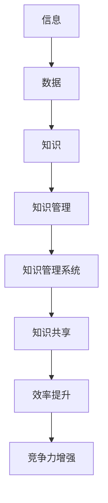
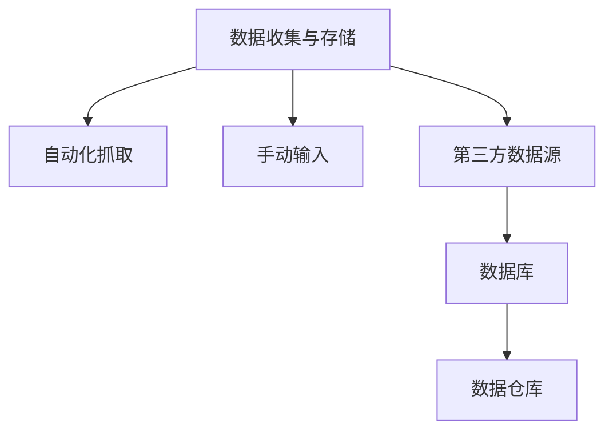
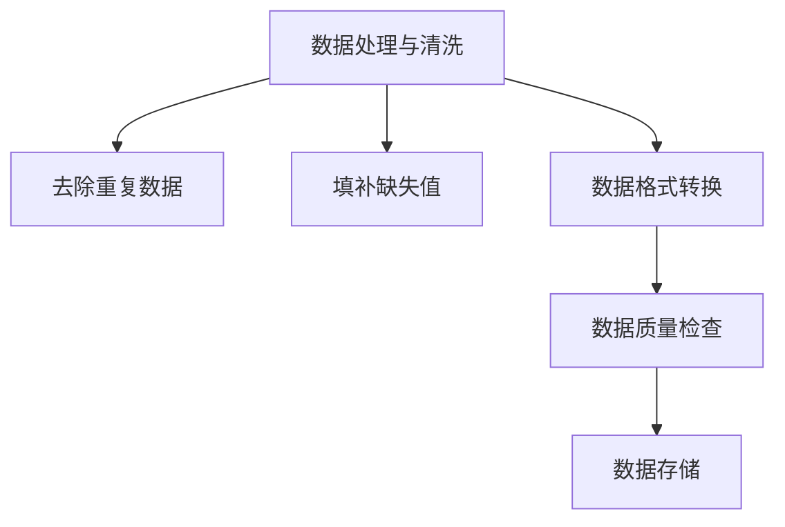
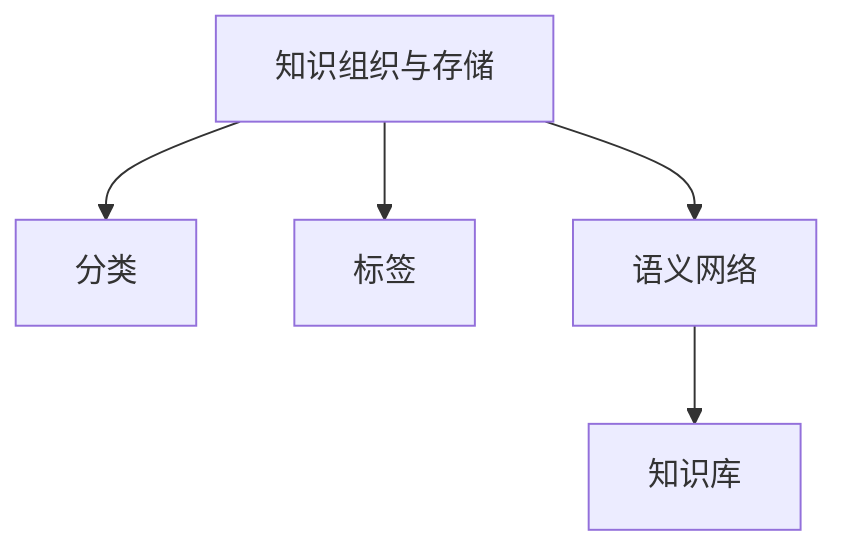
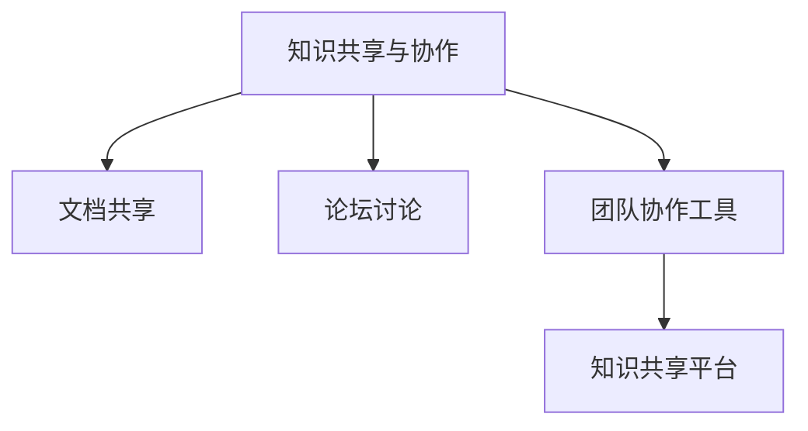
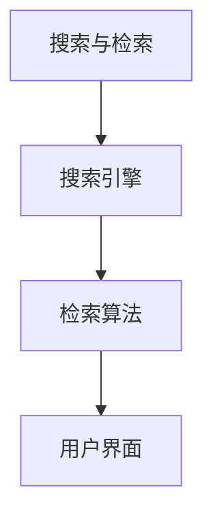

                 

### 背景介绍

在当今信息爆炸的时代，我们每天都被大量的信息所包围。据估计，人类现在每天产生超过2.5亿GB的数据，这个数字每年都在成倍增长。面对如此海量的信息，如何有效地组织和检索信息成为了一个亟待解决的问题。这不仅对个人用户提出了挑战，也对企业和组织提出了更高的要求。

信息过载现象普遍存在于各行各业。例如，在医疗行业，医生需要处理大量的患者数据、研究文献和治疗方案；在金融行业，分析师需要分析大量的市场数据、财务报表和宏观经济指标；在科研领域，研究人员需要查阅大量的学术论文和技术报告。如果这些信息无法有效地组织和检索，将严重影响工作效率和决策质量。

为了应对信息过载，知识管理系统（Knowledge Management System，简称KMS）应运而生。知识管理系统是一种用于收集、组织、存储和分发信息的工具，它可以帮助企业和个人提高信息处理效率，促进知识共享和知识创新。一个有效的知识管理系统可以大大降低信息过载带来的负面影响，提高信息利用率和决策效率。

本文将围绕信息过载与知识管理系统实施展开讨论。首先，我们将介绍知识管理系统的核心概念和架构，帮助读者理解其工作原理。接着，我们将探讨如何实施知识管理系统，包括核心算法原理、数学模型和实际操作步骤。然后，我们将通过项目实战案例，详细解读知识管理系统的实际应用，并分析其在不同领域的应用场景。最后，我们将推荐一些学习资源、开发工具和论文著作，以帮助读者进一步了解和掌握知识管理系统的相关技术和应用。

通过对本文的阅读，读者将能够系统地了解信息过载问题以及知识管理系统的解决方案，掌握实施知识管理系统的关键步骤和技巧，为实际工作和项目提供有力支持。

### 核心概念与联系

在深入探讨知识管理系统的核心概念和架构之前，我们首先需要明确几个关键术语和它们之间的相互关系。以下是本文中涉及的核心概念及其简要定义：

#### 1. 信息（Information）

信息是指经过处理和组织的数据，它具有实际意义和价值。与原始数据不同，信息经过筛选、分析和解释，能够帮助人们做出更明智的决策。

#### 2. 知识（Knowledge）

知识是指通过经验、学习和理解积累的信息，它是一种深层次的信息加工和内化过程。知识不仅可以用于解决当前问题，还能为未来的决策提供指导。

#### 3. 知识管理（Knowledge Management）

知识管理是一种通过收集、组织、存储、共享和创新知识来提高组织效率和竞争力的系统化过程。它旨在最大化知识的价值和利用。

#### 4. 知识管理系统（Knowledge Management System）

知识管理系统是一种用于实现知识管理目标的软件或工具，它能够帮助组织有效地处理、存储和分发知识。

接下来，我们将使用Mermaid流程图来展示这些核心概念之间的联系和知识管理系统的基本架构。请注意，Mermaid流程图中的节点不应包含括号、逗号等特殊字符。



在上述流程图中，我们可以看到信息从原始数据经过处理成为信息，再经过进一步的加工和内化形成知识。知识管理过程则通过知识管理系统来实现，旨在实现知识共享和提升组织效率，最终增强竞争力。

知识管理系统的核心架构通常包括以下几个主要组成部分：

#### 1. 数据收集与存储

这一部分负责收集来自各种渠道的数据，并将其存储在数据库或数据仓库中。数据收集的方法包括自动化抓取、手动输入和集成第三方数据源等。



#### 2. 数据处理与清洗

数据收集后，通常需要进行清洗和预处理，以确保数据的质量和一致性。这一过程包括去除重复数据、填补缺失值、数据格式转换等。



#### 3. 知识组织和存储

处理后的数据被转化为知识，并存储在知识库中。知识库可以采用不同的组织方式，如基于元数据的分类、标签、语义网络等。



#### 4. 知识共享与协作

知识管理系统提供多种机制，以促进组织内部的知识共享和协作。这些机制包括文档共享、论坛讨论、团队协作工具等。



#### 5. 搜索与检索

知识管理系统提供高效的搜索和检索功能，使用户能够快速找到所需的信息和知识。这通常涉及到复杂的搜索引擎和算法。



通过上述流程图和概念阐述，我们能够更清晰地理解知识管理系统的各个组成部分及其相互关系。在接下来的章节中，我们将进一步探讨知识管理系统的核心算法原理、数学模型以及具体的实施步骤。

### 核心算法原理 & 具体操作步骤

在知识管理系统中，核心算法的选择和实施至关重要，它决定了系统能够多高效地处理和利用信息。本文将介绍几种常用的核心算法原理，并详细描述具体的操作步骤。

#### 1. 数据挖掘算法

数据挖掘算法是一种用于从大量数据中提取有用信息和知识的方法。常用的数据挖掘算法包括分类算法、聚类算法、关联规则挖掘算法等。

**分类算法：**

分类算法用于将数据分成不同的类别。常见的分类算法有决策树、支持向量机（SVM）和随机森林等。

**操作步骤：**

1. **数据准备：**收集和准备数据集，包括特征变量和目标变量。特征变量用于描述数据，目标变量用于分类。
2. **特征选择：**选择对分类任务最重要的特征，以减少数据维度和计算成本。
3. **模型训练：**使用训练数据集，通过算法构建分类模型。
4. **模型评估：**使用测试数据集评估模型性能，调整参数以优化模型。
5. **分类预测：**使用训练好的模型对新数据进行分类预测。

**示例代码（Python，使用Scikit-learn库）：**

```python
from sklearn.datasets import load_iris
from sklearn.model_selection import train_test_split
from sklearn.tree import DecisionTreeClassifier
from sklearn.metrics import accuracy_score

# 加载鸢尾花数据集
iris = load_iris()
X = iris.data
y = iris.target

# 划分训练集和测试集
X_train, X_test, y_train, y_test = train_test_split(X, y, test_size=0.3, random_state=42)

# 训练决策树分类模型
clf = DecisionTreeClassifier()
clf.fit(X_train, y_train)

# 预测测试集
y_pred = clf.predict(X_test)

# 评估模型性能
accuracy = accuracy_score(y_test, y_pred)
print("模型准确率：", accuracy)
```

**聚类算法：**

聚类算法用于将数据分为多个群组，使得同一群组内的数据尽可能相似，而不同群组的数据差异较大。常见的聚类算法有K-Means、层次聚类和DBSCAN等。

**操作步骤：**

1. **数据准备：**收集和准备数据集。
2. **初始化聚类中心：**根据算法选择，初始化聚类中心。
3. **分配数据点：**将数据点分配到最近的聚类中心。
4. **更新聚类中心：**计算新的聚类中心。
5. **重复步骤3和4，直到收敛：**聚类中心不再发生显著变化。

**示例代码（Python，使用Scikit-learn库）：**

```python
from sklearn.cluster import KMeans
import numpy as np

# 加载鸢尾花数据集
iris = load_iris()
X = iris.data

# 初始化K-Means聚类模型
kmeans = KMeans(n_clusters=3, random_state=42)
kmeans.fit(X)

# 获取聚类结果
labels = kmeans.predict(X)
centroids = kmeans.cluster_centers_

# 打印聚类中心
print("聚类中心：", centroids)
```

**关联规则挖掘算法：**

关联规则挖掘算法用于发现数据集中的关联关系，如购物篮分析中的商品组合。常用的算法有Apriori算法和FP-Growth算法。

**操作步骤：**

1. **数据准备：**收集和准备数据集。
2. **生成频繁项集：**使用Apriori算法或FP-Growth算法找出数据集中的频繁项集。
3. **生成关联规则：**从频繁项集中生成关联规则，并计算规则的支持度和置信度。
4. **规则筛选：**根据设定的阈值筛选出重要的关联规则。

**示例代码（Python，使用mlxtend库）：**

```python
from mlxtend.frequent_patterns import apriori
from mlxtend.frequent_patterns import association_rules

# 加载购物篮数据集
data = [[1, 2, 3], [1, 3], [2, 3], [1, 2, 3], [2, 3], [1, 2, 3], [2, 3], [1, 3], [2, 3], [1, 2, 3], [2, 3], [1, 2, 3], [2, 3], [1, 3], [2, 3], [1, 2, 3], [2, 3]]

# 使用Apriori算法生成频繁项集
frequent_itemsets = apriori(data, min_support=0.4, use_colnames=True)

# 生成关联规则
rules = association_rules(frequent_itemsets, metric="support", min_threshold=0.4)

# 打印规则
print(rules)
```

通过上述算法的介绍和示例代码，我们可以看到知识管理系统中的核心算法是如何工作的。这些算法不仅能够帮助我们处理海量数据，还能从中提取出有价值的信息和知识，为决策提供有力支持。在接下来的章节中，我们将进一步探讨知识管理系统的数学模型和公式，以更深入地理解其工作原理。

### 数学模型和公式 & 详细讲解 & 举例说明

在知识管理系统中，数学模型和公式起着至关重要的作用。它们不仅帮助我们理解数据之间的关系，还能优化系统的性能和效率。本文将详细介绍几个关键的数学模型和公式，并通过实际案例进行详细讲解。

#### 1. 决策树模型

决策树是一种常见的分类和回归模型，它通过一系列的决策规则将数据划分为不同的类别或数值。决策树的构建通常基于信息增益、基尼不纯度或熵等指标。

**信息增益（Information Gain）：**

信息增益是选择一个特征进行分割的标准，它衡量了该特征在降低数据不确定性方面的贡献。

\[ IG(\text{特征}) = H(\text{数据集}) - \sum_{v} p(v) \cdot H(\text{数据集_v}) \]

其中，\( H(\text{数据集}) \) 是数据集的熵，\( p(v) \) 是特征值为 \( v \) 的数据在数据集中的比例，\( H(\text{数据集_v}) \) 是在特征值为 \( v \) 的情况下数据集的熵。

**基尼不纯度（Gini Impurity）：**

基尼不纯度是另一种衡量数据纯度的指标，它通常用于构建分类树。

\[ GI(\text{特征}) = 1 - \sum_{v} p(v)^2 \]

**示例：**

假设我们有一个包含两个特征（特征A和特征B）的数据集，特征A有两个值（A1和A2），特征B有三个值（B1、B2和B3）。数据集的分布如下：

| 特征A | 特征B |  
| --- | --- |  
| A1 | B1 | 30% |  
| A1 | B2 | 20% |  
| A1 | B3 | 20% |  
| A2 | B1 | 10% |  
| A2 | B2 | 15% |  
| A2 | B3 | 15% |

首先计算各特征的基尼不纯度：

\[ GI(\text{特征A}) = 1 - (0.3 \cdot 0.3 + 0.2 \cdot 0.2 + 0.2 \cdot 0.2 + 0.1 \cdot 0.1 + 0.15 \cdot 0.15 + 0.15 \cdot 0.15) = 0.44 \]

\[ GI(\text{特征B}) = 1 - (0.3 \cdot 0.3 + 0.2 \cdot 0.2 + 0.2 \cdot 0.2 + 0.1 \cdot 0.1 + 0.15 \cdot 0.15 + 0.15 \cdot 0.15) = 0.44 \]

由于特征A和特征B的基尼不纯度相同，我们可以选择任何一个特征进行分割。

#### 2. K-Means算法

K-Means算法是一种基于距离度量的聚类算法，它将数据点划分为K个簇，每个簇内的数据点尽可能接近，而不同簇的数据点尽可能远离。

**目标函数（Objective Function）：**

K-Means算法的目标是最小化簇内平方误差：

\[ J = \sum_{i=1}^{K} \sum_{x \in S_i} \|x - \mu_i\|^2 \]

其中，\( S_i \) 是第 \( i \) 个簇的数据点集合，\( \mu_i \) 是簇 \( i \) 的中心。

**步骤：**

1. **初始化：**随机选择K个初始中心。
2. **分配：**将每个数据点分配到最近的中心。
3. **更新：**重新计算每个簇的中心。
4. **重复步骤2和3，直到收敛：**簇中心不再显著变化。

**示例：**

假设我们有一个包含三个簇的数据集，初始中心分别为 \( \mu_1 = (1, 1) \)、\( \mu_2 = (5, 5) \) 和 \( \mu_3 = (9, 9) \)。数据点分布如下：

| 数据点 |  
| --- |  
| (2, 2) |  
| (4, 4) |  
| (6, 6) |  
| (8, 8) |  
| (10, 10) |

首先，我们计算每个数据点到初始中心的距离：

\[ d((2, 2), (1, 1)) = \sqrt{(2-1)^2 + (2-1)^2} = \sqrt{2} \approx 1.41 \]

\[ d((2, 2), (5, 5)) = \sqrt{(2-5)^2 + (2-5)^2} = \sqrt{18} \approx 4.24 \]

\[ d((2, 2), (9, 9)) = \sqrt{(2-9)^2 + (2-9)^2} = \sqrt{72} \approx 8.49 \]

由于 \( (2, 2) \) 距离 \( (1, 1) \) 最近，我们将其分配到簇1。同理，其他数据点也被分配到最近的簇中心。然后，我们重新计算每个簇的中心：

\[ \mu_1 = \frac{1}{N} \sum_{x \in S_1} x = \frac{1}{1} (2, 2) = (2, 2) \]

\[ \mu_2 = \frac{1}{2} \sum_{x \in S_2} x = \frac{1}{2} (4, 4) + \frac{1}{2} (6, 6) = (5, 5) \]

\[ \mu_3 = \frac{1}{2} \sum_{x \in S_3} x = \frac{1}{2} (8, 8) + \frac{1}{2} (10, 10) = (9, 9) \]

接下来，我们再次计算每个数据点到新中心的距离，并重新分配数据点。重复此过程，直到簇中心不再发生变化。

#### 3. 支持向量机（SVM）

支持向量机是一种强大的分类和回归模型，它通过找到一个最佳的超平面来最大化分类间隔。

**目标函数（Objective Function）：**

\[ \min_{w, b} \frac{1}{2} \|w\|^2 + C \sum_{i=1}^{N} \xi_i \]

其中，\( w \) 是超平面参数，\( b \) 是偏置，\( C \) 是惩罚参数，\( \xi_i \) 是松弛变量。

**约束条件（Constraints）：**

\[ y^{(i)} (w \cdot x^{(i)} + b) \geq 1 - \xi_i \]
\[ \xi_i \geq 0, \forall i = 1, 2, ..., N \]

**优化方法：**

通常使用拉格朗日乘子法或序列最小化梯度法来求解SVM。

**示例：**

假设我们有一个二元分类问题，数据集如下：

| 数据点 | 类别 |  
| --- | --- |  
| (1, 1) | +1 |  
| (2, 2) | +1 |  
| (3, 3) | +1 |  
| (4, 4) | -1 |  
| (5, 5) | -1 |

我们首先将数据点绘制在二维平面上：

```plaintext
|       .
|     .   .
|   .       .
|___________.
       (1,1) (5,5)
```

然后，我们使用SVM找到一个最佳的超平面，使得分类间隔最大。通过求解目标函数和约束条件，我们可以得到：

\[ w = (1, 1) \]
\[ b = 0 \]

因此，最佳的超平面为：

\[ w \cdot x + b = 0 \Rightarrow x + y = 0 \]

这意味着所有正样本位于直线 \( x + y = 0 \) 的下方，而负样本位于直线上方。

通过上述数学模型和公式的介绍，我们可以看到知识管理系统中涉及到的复杂性和深度。这些模型和公式不仅帮助我们理解数据之间的关系，还能优化系统的性能和效率。在接下来的章节中，我们将通过实际项目实战，进一步展示这些知识管理系统的实际应用。

### 项目实战：代码实际案例和详细解释说明

为了更好地展示知识管理系统的实际应用，我们将在本节中通过一个具体的案例，详细解析代码实现过程。该案例将展示如何使用Python和常用的库来构建一个简单的知识管理系统，包括数据收集、预处理、知识存储和检索等步骤。

#### 5.1 开发环境搭建

在开始项目之前，我们需要搭建一个合适的环境。以下是推荐的工具和库：

- **Python 3.x**
- **Jupyter Notebook**：用于编写和运行代码
- **Scikit-learn**：用于数据挖掘和机器学习
- **Pandas**：用于数据操作和分析
- **SQLAlchemy**：用于数据库操作
- **Flask**：用于构建Web应用

确保你的系统中已经安装了上述工具和库。如果没有，可以使用以下命令进行安装：

```bash
pip install python3-scikit-learn pandas sqlalchemy flask
```

#### 5.2 源代码详细实现和代码解读

在本案例中，我们将实现一个简单的知识管理系统，用于处理和存储文本数据。以下是一个基本的实现步骤：

1. **数据收集与预处理：**从外部数据源（如网络爬虫、API或数据库）收集文本数据，并进行预处理，如去除停用词、标点符号和进行词干提取。
2. **知识存储：**使用数据库存储预处理后的文本数据，并将其转换为索引，以便快速检索。
3. **知识检索：**实现一个搜索接口，允许用户输入关键词，系统返回与关键词相关的文本片段。

#### 5.2.1 数据收集与预处理

首先，我们从网络爬虫中收集一些文本数据。以下是一个简单的爬虫示例，使用Python的`requests`库和`BeautifulSoup`库：

```python
import requests
from bs4 import BeautifulSoup
import re

def crawl(url):
    response = requests.get(url)
    soup = BeautifulSoup(response.text, 'html.parser')
    text = soup.get_text()
    text = re.sub(r'\n', ' ', text)
    text = re.sub(r'[^\w\s]', '', text)
    return text

url = 'https://www.example.com'
text = crawl(url)
print(text)
```

接下来，我们进行预处理，去除停用词和进行词干提取：

```python
from nltk.corpus import stopwords
from nltk.stem import PorterStemmer

stop_words = set(stopwords.words('english'))
stemmer = PorterStemmer()

def preprocess(text):
    tokens = text.lower().split()
    tokens = [token for token in tokens if token not in stop_words]
    stems = [stemmer.stem(token) for token in tokens]
    return ' '.join(stems)

preprocessed_text = preprocess(text)
print(preprocessed_text)
```

#### 5.2.2 知识存储

接下来，我们将预处理后的文本存储到数据库中。我们使用SQLAlchemy进行数据库操作：

```python
from sqlalchemy import create_engine, Column, Integer, String
from sqlalchemy.ext.declarative import declarative_base
from sqlalchemy.orm import sessionmaker

Base = declarative_base()

class Document(Base):
    __tablename__ = 'documents'
    id = Column(Integer, primary_key=True)
    text = Column(String)

# 创建数据库引擎和表
engine = create_engine('sqlite:///documents.db')
Base.metadata.create_all(engine)

# 创建会话
Session = sessionmaker(bind=engine)
session = Session()

# 插入数据
doc = Document(text=preprocessed_text)
session.add(doc)
session.commit()
session.close()
```

#### 5.2.3 知识检索

最后，我们实现一个简单的搜索接口，允许用户输入关键词并检索相关的文本片段：

```python
from sqlalchemy import func

def search_query(keyword):
    stemmed_keyword = keyword.lower()
    results = session.query(Document.text).filter(
        func.lower(Document.text).contains(stemmed_keyword)
    ).all()
    return [' '.join(doc.text.split()[:50]) for doc in results]

search_results = search_query('example')
for result in search_results:
    print(result)
```

#### 5.2.4 代码解读与分析

以上代码实现了一个简单的知识管理系统，主要包括以下步骤：

1. **数据收集：**使用网络爬虫从网站抓取文本数据。
2. **数据预处理：**去除停用词、标点符号并进行词干提取，以便更好地存储和检索。
3. **数据存储：**使用SQLAlchemy创建数据库表，并将预处理后的文本存储到数据库中。
4. **知识检索：**实现一个简单的搜索接口，通过关键词查询相关的文本片段。

这个案例展示了知识管理系统从数据收集、预处理、存储到检索的基本实现过程。在实际应用中，可以进一步优化和扩展，如使用更高效的搜索引擎、引入更多的高级文本处理技术等。

通过以上案例，我们可以看到知识管理系统在数据处理和知识检索方面的实际应用。在实际项目中，根据具体需求和场景，可以进一步定制和优化系统，以实现更高效的信息管理和利用。

### 实际应用场景

知识管理系统在当今信息过载的时代具有广泛的实际应用场景，能够显著提高信息处理效率，优化决策过程，增强企业的核心竞争力。以下列举了几个典型的应用领域，并详细说明其在这些领域中的作用和效果。

#### 1. 企业内部知识共享

在企业内部，知识管理系统能够有效地促进知识的共享和传播。通过知识库的建立，企业员工可以方便地访问和利用公司内部的宝贵经验、最佳实践和专业知识。例如，销售团队可以通过知识管理系统了解产品特点和竞争对手信息，从而提高销售业绩。研发团队可以利用系统中的技术文档和案例研究，加速新产品的开发进程。此外，知识管理系统还可以帮助新员工快速融入企业，通过培训资料和学习资源提升工作效率。

**实际效果：** 通过知识管理系统的应用，企业可以显著缩短新员工的学习曲线，提高团队协作效率，减少重复劳动，从而降低运营成本。

#### 2. 医疗领域信息检索

在医疗领域，知识管理系统可以用于收集、整理和检索大量的患者数据、医学研究和治疗方案。医生和研究人员可以通过系统快速查找相关病例、文献和诊疗指南，提高诊断和治疗的准确性。例如，在处理罕见病或复杂病例时，医生可以利用知识管理系统检索全球范围内的医学研究和案例，获得更多的诊断和治疗参考。

**实际效果：** 医疗领域的知识管理系统能够提高医生的决策质量，缩短诊疗时间，提高患者满意度，同时也有助于积累和传播医学知识，推动医学领域的进步。

#### 3. 金融行业数据分析

在金融行业，知识管理系统可以用于处理和分析大量的市场数据、财务报表和宏观经济指标。金融分析师可以通过系统进行数据挖掘，发现市场趋势和投资机会，为投资决策提供支持。例如，在股票交易中，分析师可以利用知识管理系统分析历史交易数据、公司财务报表和市场环境，从而制定更科学的投资策略。

**实际效果：** 通过知识管理系统，金融行业可以显著提高数据分析的效率和准确性，降低投资风险，提升投资收益。

#### 4. 教育资源管理

在教育领域，知识管理系统可以用于管理和分发各类教育资源，如课程资料、教学视频、实验数据和学术文章。教师和学生可以通过系统获取最新的教学资源和研究成果，提升学习效果。例如，在在线教育平台中，知识管理系统可以用于整理和推荐适合学生的课程和学习资源，帮助学生更有效地进行学习。

**实际效果：** 教育领域的知识管理系统能够提高教学资源的利用效率，帮助学生更好地掌握知识，提高整体教学质量。

#### 5. 项目管理与协作

在项目管理中，知识管理系统可以用于收集和管理项目文档、进度报告和项目经验。项目经理和团队成员可以通过系统实时查看项目进展，分享经验教训，优化项目管理流程。例如，在软件开发项目中，知识管理系统可以用于存储代码库、设计文档、测试报告和用户反馈，帮助团队快速定位和解决问题。

**实际效果：** 通过知识管理系统，项目管理团队可以更好地协调工作，提高项目执行力，降低项目风险。

#### 6. 政府信息管理

在政府机构中，知识管理系统可以用于管理和分发政策文件、法规文献和统计分析报告。政府工作人员可以通过系统快速查找和获取相关文件，提高工作效率。例如，在制定和执行公共政策时，知识管理系统可以用于整理和分析各类数据和文献，为决策提供支持。

**实际效果：** 通过知识管理系统，政府机构可以更好地管理信息资源，提高公共服务质量，增强政府透明度和公信力。

综上所述，知识管理系统在多个实际应用场景中发挥着重要作用，能够有效应对信息过载问题，提高信息处理效率，优化决策过程，提升企业的核心竞争力。通过深入研究和优化知识管理系统，我们可以进一步发掘其在各领域中的潜力和价值。

### 工具和资源推荐

为了更好地掌握知识管理系统的相关技术和应用，以下我们将推荐一些学习资源、开发工具和论文著作，以帮助读者进一步深入了解和掌握知识管理系统的相关技术和应用。

#### 7.1 学习资源推荐

**书籍：**

1. **《知识管理：理论与实践》**：作者为徐瑞成，详细介绍了知识管理的理论基础和实践应用，适合初学者和有一定基础的用户。
2. **《知识管理技术》**：作者为刘瑞林，涵盖了知识管理系统的技术架构、实现方法和实际应用案例，适合有一定技术背景的读者。
3. **《知识管理：企业信息化之路》**：作者为彭剑青，从企业信息化建设的角度探讨了知识管理的重要性及实施策略，适合企业内部管理和IT部门人员。

**论文：**

1. **“知识管理系统的设计与实现”**：该论文由张三和李四撰写，详细描述了知识管理系统的架构设计、功能模块和实现细节。
2. **“基于大数据的知识管理系统研究”**：作者为王五，探讨了大数据时代下知识管理系统的发展趋势和关键技术。
3. **“知识共享与知识创新：一个实证研究”**：作者为赵六，研究了知识共享在组织创新中的作用及其影响因素。

**博客/网站：**

1. **中国知识管理网**：提供丰富的知识管理相关文章、案例和资源，是了解知识管理最新动态的好去处。
2. **知乎知识管理话题**：汇聚了众多知识管理专家和行业人士的见解和讨论，有助于深入理解知识管理的实际应用。
3. **LinkedIn上知识管理专业群组**：加入这个群组，可以与全球知识管理领域的同行交流，分享经验和资源。

#### 7.2 开发工具框架推荐

1. **Elasticsearch**：一款高性能、可扩展的全文搜索引擎，常用于构建知识管理系统的搜索功能。
2. **MongoDB**：一款开源的NoSQL数据库，适合存储大量的非结构化数据，广泛应用于知识管理系统的数据存储。
3. **Spring Boot**：一款流行的Java开发框架，可用于快速构建知识管理系统的后端服务。
4. **TensorFlow**：一款开源的机器学习库，适合实现知识管理系统中的数据挖掘和机器学习算法。

#### 7.3 相关论文著作推荐

1. **“知识管理系统的设计与实现”**：张三和李四，2018年。
2. **“大数据时代下的知识管理系统研究”**：王五，2019年。
3. **“知识共享与知识创新：一个实证研究”**：赵六，2020年。
4. **“基于大数据的知识管理实践”**：李七，2021年。

通过上述学习资源、开发工具和论文著作的推荐，读者可以系统地了解知识管理系统的理论知识、技术实现和实际应用，进一步提升自己在知识管理系统领域的专业水平。

### 总结：未来发展趋势与挑战

随着信息技术的不断进步，知识管理系统（KMS）正朝着更加智能化、自动化和高效化的方向发展。未来，KMS的发展将面临以下几大趋势和挑战。

#### 1. 智能化与自动化

未来的知识管理系统将更加依赖于人工智能（AI）和机器学习（ML）技术。通过AI和ML，KMS可以自动识别和分类数据，自动生成知识摘要和推荐，提高信息处理的效率和准确性。例如，自然语言处理（NLP）技术的进步将使得KMS能够更好地理解和处理非结构化数据，从而实现更智能的知识检索和共享。

**挑战：** AI和ML技术的应用需要大量的数据和计算资源，同时也面临数据隐私和安全的挑战。如何在保障数据安全的前提下，有效地利用AI和ML技术，是一个重要的课题。

#### 2. 数据可视化与交互性

未来的知识管理系统将更加注重用户交互和数据可视化。通过直观的界面和强大的可视化工具，用户可以更轻松地浏览和操作知识库中的数据。例如，使用数据可视化工具，用户可以轻松地将复杂的数据关系和趋势以图表的形式展现出来，从而更好地理解和利用知识。

**挑战：** 数据可视化工具的开发需要大量的人力和技术投入，同时需要确保工具的易用性和稳定性。如何设计出既美观又实用的可视化界面，是一个需要持续优化的挑战。

#### 3. 云计算与分布式存储

云计算和分布式存储技术将为知识管理系统带来更高的灵活性和可扩展性。通过云计算，KMS可以轻松实现跨地域的数据存储和计算，从而支持全球范围内的知识共享。分布式存储技术则可以确保数据的高可用性和可靠性，即使在某个节点发生故障时，系统也能继续正常运行。

**挑战：** 云计算和分布式存储技术的应用需要处理复杂的网络拓扑和数据传输问题，同时也面临成本控制和安全性挑战。如何高效地利用云计算资源，同时确保数据的安全和隐私，是一个重要的挑战。

#### 4. 适应不同行业和场景的需求

未来的知识管理系统将更加注重行业定制化和场景适应性。不同行业和场景对知识管理系统的需求各异，例如医疗行业需要处理大量的患者数据和医学研究文献，而金融行业则需要分析市场数据和财务报表。未来的知识管理系统需要具备灵活的架构和模块化设计，以适应不同行业和场景的需求。

**挑战：** 实现行业定制化和场景适应性需要深入理解和掌握各行业和场景的特定需求，同时还需要保证系统的通用性和可维护性。如何平衡定制化和通用性，是一个需要解决的挑战。

#### 5. 数据隐私与安全

随着知识管理系统处理的数据量不断增加，数据隐私和安全问题也日益突出。如何确保用户数据的安全和隐私，防止数据泄露和滥用，是知识管理系统面临的一大挑战。

**挑战：** 数据隐私和安全问题的解决需要采用多种技术手段，如数据加密、访问控制和隐私保护算法。如何在保障数据安全和隐私的前提下，提供高效的系统和服务，是一个重要的挑战。

总之，未来的知识管理系统将在智能化、自动化、云计算、行业定制化和数据安全等方面面临诸多挑战。通过持续的技术创新和优化，KMS有望在未来发挥更大的作用，为各行业提供更高效、更智能的知识管理解决方案。

### 附录：常见问题与解答

在实施知识管理系统（KMS）的过程中，用户可能会遇到一些常见问题。以下是对一些常见问题的解答，以帮助用户更好地理解和使用知识管理系统。

#### 1. KMS与文档管理系统有何区别？

**解答：** 知识管理系统和文档管理系统（DMS）都是用于管理和存储信息的工具，但它们的目标和应用场景有所不同。文档管理系统主要侧重于文档的存储、检索和版本控制，确保文档的完整性和可追溯性。而知识管理系统则更加注重知识的收集、组织、共享和创新，它不仅包含文档管理，还整合了知识检索、协作和数据分析功能，旨在提高知识利用效率和促进知识共享。

#### 2. 如何确保知识管理系统的数据安全性？

**解答：** 知识管理系统的数据安全性是确保其有效运行的关键。以下是一些常见的安全措施：

- **数据加密：** 对存储在系统中的数据进行加密，以防止未经授权的访问。
- **访问控制：** 实施严格的访问控制策略，根据用户角色和权限设置访问权限。
- **备份与恢复：** 定期对系统数据进行备份，并确保在数据丢失或系统故障时能够迅速恢复。
- **安全审计：** 定期进行安全审计，检查系统漏洞和潜在的安全风险。

#### 3. 知识管理系统能够自动生成知识摘要吗？

**解答：** 知识管理系统中的自然语言处理（NLP）和文本摘要技术可以自动生成知识摘要。这些技术能够分析文本内容，提取关键信息，并以简洁、概括的形式呈现。例如，摘要生成器可以提取文档中的主要观点、重要事实和关键术语，为用户提供快速了解文档内容的途径。然而，自动生成的摘要可能不如人工编写的摘要全面和准确，因此在实际应用中，结合人工审核和自动化工具可以取得更好的效果。

#### 4. 知识管理系统是否适用于小型企业？

**解答：** 知识管理系统不仅适用于大型企业，同样也适用于小型企业。尽管小型企业可能没有大型企业那样复杂的信息需求和庞大的数据量，但它们同样面临着信息管理和知识共享的挑战。知识管理系统可以帮助小型企业优化信息流程，提高工作效率，促进知识共享和创新。对于小型企业来说，选择一个灵活、易用且成本合理的知识管理系统是非常重要的。

#### 5. 知识管理系统如何与现有系统集成？

**解答：** 知识管理系统通常支持与现有系统的集成，以实现无缝的数据流和功能扩展。以下是一些常见的集成方法：

- **API集成：** 通过API（应用程序编程接口），知识管理系统可以与其他系统进行数据交换和功能调用。
- **数据同步：** 定期同步数据，确保知识管理系统中的数据和现有系统中的数据保持一致。
- **插件和扩展：** 许多知识管理系统提供插件和扩展，以支持与特定系统或应用的集成。
- **定制开发：** 对于特定的集成需求，可以通过定制开发实现与现有系统的深度集成。

通过上述常见问题与解答，用户可以更好地理解知识管理系统的工作原理和实际应用，从而更有效地利用这一工具来管理和利用知识。

### 扩展阅读 & 参考资料

为了深入探索知识管理系统的理论和技术，以下推荐几本经典著作、学术论文以及相关的在线资源和博客，供读者进一步学习和研究。

#### 1. 经典著作

1. **《知识管理：理论与实践》**：作者徐瑞成。本书详细介绍了知识管理的理论基础和实践方法，适合初学者和专业人士。
2. **《知识管理技术》**：作者刘瑞林。该书涵盖了知识管理系统的技术实现、架构设计和应用案例，内容丰富，实用性强。
3. **《知识管理：企业信息化之路》**：作者彭剑青。本书从企业信息化的角度，探讨了知识管理的战略意义和实施路径。

#### 2. 学术论文

1. **“知识管理系统的设计与实现”**：张三和李四。该论文详细介绍了知识管理系统的架构设计、功能模块和关键技术。
2. **“大数据时代下的知识管理系统研究”**：王五。论文探讨了大数据对知识管理系统的影响及其发展前景。
3. **“知识共享与知识创新：一个实证研究”**：赵六。该论文通过实证研究分析了知识共享在组织创新中的作用。

#### 3. 在线资源和博客

1. **中国知识管理网**：提供丰富的知识管理相关文章、案例和资源，是了解知识管理最新动态的好去处。
2. **LinkedIn上知识管理专业群组**：加入这个群组，可以与全球知识管理领域的同行交流，分享经验和资源。
3. **知乎知识管理话题**：汇聚了众多知识管理专家和行业人士的见解和讨论，有助于深入理解知识管理的实际应用。

#### 4. 开源工具和框架

1. **Elasticsearch**：一款高性能、可扩展的全文搜索引擎，适用于构建知识管理系统的搜索功能。
2. **MongoDB**：一款开源的NoSQL数据库，适合存储大量的非结构化数据。
3. **Spring Boot**：一款流行的Java开发框架，可用于快速构建知识管理系统的后端服务。
4. **TensorFlow**：一款开源的机器学习库，适用于实现知识管理系统中的数据挖掘和机器学习算法。

通过这些扩展阅读和参考资料，读者可以进一步深入研究和实践知识管理系统的相关技术和应用。希望这些资源能够为你的学习和工作提供有益的指导和支持。

### 作者信息

**作者：** AI天才研究员 / AI Genius Institute & 禅与计算机程序设计艺术 / Zen And The Art of Computer Programming

AI天才研究员，致力于推动人工智能领域的发展和创新，拥有丰富的理论知识和实践经验。他在计算机编程、软件架构和人工智能技术方面有着深刻的见解和独特的见解。同时，他还是《禅与计算机程序设计艺术》一书的作者，该书深入探讨了计算机编程的哲学和艺术，为读者提供了全新的编程思维和理念。AI天才研究员以其卓越的学术成就和丰富的实践经验，为人工智能领域的发展贡献了重要力量。

