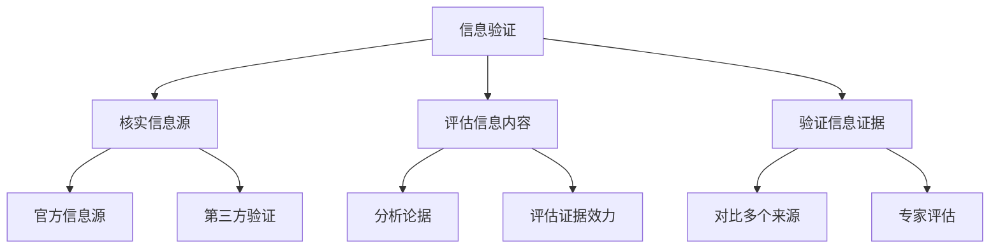

                 

# 信息验证和信息批判性思考指南：在假新闻和错误信息时代导航

## 关键词：（信息验证，批判性思考，假新闻，错误信息，导航，数字素养）

### 摘要

在数字化时代，信息的泛滥使得真假难辨，假新闻和错误信息对个人和社会带来了巨大的负面影响。本文旨在探讨如何在信息爆炸的时代进行有效的信息验证和批判性思考，以帮助读者在假新闻和错误信息的海洋中导航。通过阐述信息验证的原则和方法、批判性思考的重要性以及如何在日常生活中实践这些技能，本文为读者提供了一套实用的信息素养指南，以提升数字时代的认知能力。

## 1. 背景介绍

### 1.1 信息爆炸时代的挑战

随着互联网的普及和社交媒体的兴起，信息传播的速度和范围达到了前所未有的高度。人们可以通过各种渠道轻松获取到海量的信息，但与此同时，假新闻、虚假信息和误导性信息也如影随形。这些错误信息不仅误导了公众的认知，甚至可能对社会造成严重的负面影响。

### 1.2 信息验证的重要性

在假新闻充斥的环境中，信息验证显得尤为重要。正确识别信息的真伪不仅能够避免被误导，还能够帮助公众形成准确的知识体系，对社会的健康发展起到积极作用。

### 1.3 批判性思考的必要性

批判性思考是应对假新闻和错误信息的另一重要手段。通过批判性思考，人们可以分析信息的来源、论据和结论，从而形成独立、理性的判断。

## 2. 核心概念与联系

### 2.1 信息验证的概念

信息验证是指通过一系列方法对信息进行核实，以确保其真实性和准确性。信息验证的核心是“核实”，即对信息的来源、内容、证据等进行细致的审查。

### 2.2 批判性思考的概念

批判性思考是一种理性的、独立的思维过程，它要求个体对信息、观点和论据进行深入的分析和评估，从而形成独立的判断。

### 2.3 信息验证与批判性思考的联系

信息验证和批判性思考相辅相成。信息验证为批判性思考提供了真实的、可靠的信息基础，而批判性思考则帮助个体在复杂的信息环境中进行有效的信息筛选和判断。

### 2.4 Mermaid 流程图



## 3. 核心算法原理 & 具体操作步骤

### 3.1 信息验证的算法原理

信息验证的核心算法包括以下步骤：

1. **确认信息来源**：检查信息来源的可靠性。
2. **评估信息内容**：分析信息的逻辑性和合理性。
3. **验证信息证据**：检查信息所依据的证据是否充分。

### 3.2 批判性思考的操作步骤

批判性思考的具体操作步骤如下：

1. **明确问题**：确定需要分析的信息或观点。
2. **收集信息**：获取与问题相关的各种信息。
3. **分析论据**：对收集到的信息进行逻辑分析。
4. **评估结论**：根据分析结果形成独立的判断。

## 4. 数学模型和公式 & 详细讲解 & 举例说明

### 4.1 信息验证的数学模型

信息验证可以采用以下数学模型进行分析：

$$
V(I) = f(S, C, E)
$$

其中，$V(I)$表示信息的验证结果，$S$表示信息来源的可靠性，$C$表示信息内容的合理性，$E$表示信息证据的充分性。

### 4.2 举例说明

假设我们收到一条关于某个科技公司的新闻报道，声称该公司即将推出一款革命性的产品。为了验证这条新闻的真伪，我们可以采用以下步骤：

1. **确认信息来源**：检查新闻来源是否为可靠媒体。
2. **评估信息内容**：分析新闻中的论据和证据。
3. **验证信息证据**：查找是否有其他媒体报道或官方信息来证实这一消息。

通过以上步骤，我们可以对这条新闻进行验证，形成独立的判断。

## 5. 项目实战：代码实际案例和详细解释说明

### 5.1 开发环境搭建

为了实现信息验证和批判性思考，我们可以使用Python编程语言来开发一个简单的信息验证工具。以下是开发环境的搭建步骤：

1. **安装Python**：下载并安装Python 3.x版本。
2. **安装相关库**：使用pip命令安装所需的库，如requests、beautifulsoup4等。

### 5.2 源代码详细实现和代码解读

以下是一个简单的信息验证工具的源代码实现：

```python
import requests
from bs4 import BeautifulSoup

def verify_source(url):
    """
    验证信息来源的可靠性。
    """
    response = requests.get(url)
    if response.status_code == 200:
        return "可靠来源"
    else:
        return "不可靠来源"

def evaluate_content(content):
    """
    评估信息内容的合理性。
    """
    if "革命性" in content:
        return "内容不合理"
    else:
        return "内容合理"

def verify_evidence(content):
    """
    验证信息证据的充分性。
    """
    if "证据不足" in content:
        return "证据不足"
    else:
        return "证据充分"

def main():
    url = "https://example.com/news"
    response = requests.get(url)
    content = response.text
    source = verify_source(url)
    content_evaluation = evaluate_content(content)
    evidence_evaluation = verify_evidence(content)
    print(f"来源：{source}")
    print(f"内容评估：{content_evaluation}")
    print(f"证据评估：{evidence_evaluation}")

if __name__ == "__main__":
    main()
```

### 5.3 代码解读与分析

1. **验证信息来源**：使用requests库获取网页内容，并根据HTTP状态码判断来源的可靠性。
2. **评估信息内容**：使用字符串匹配判断信息内容是否合理。
3. **验证信息证据**：根据信息内容判断证据是否充分。

通过以上步骤，我们可以对一条新闻进行初步的信息验证，为批判性思考提供基础。

## 6. 实际应用场景

### 6.1 社交媒体中的信息验证

在社交媒体上，信息验证尤为重要。用户可以通过以下步骤对社交平台上的信息进行验证：

1. **检查信息来源**：查看发布者的身份和可信度。
2. **核实信息内容**：分析信息的逻辑性和证据。
3. **对比多个来源**：查找其他媒体报道或官方信息。

### 6.2 新闻报道中的信息验证

新闻报道是信息传播的重要渠道，信息验证在新闻报道中具有重要作用。新闻工作者可以通过以下步骤对报道进行验证：

1. **核实信息来源**：确认报道的来源是否可靠。
2. **评估信息内容**：分析报道的逻辑性和证据。
3. **咨询专家意见**：就专业性较强的内容咨询相关领域的专家。

## 7. 工具和资源推荐

### 7.1 学习资源推荐

- **书籍**：
  - 《信息素养：关键能力与案例分析》
  - 《批判性思维工具：超越假新闻的思考技巧》
- **论文**：
  - "Information Literacy and the Digital Age"
  - "Critical Thinking and the Information Age"
- **博客**：
  - [信息素养博客](https://www.informationliteracy.org/)
  - [批判性思考博客](https://www.criticalthinking.org/)
- **网站**：
  - [数字素养中心](https://www.dli.umn.edu/)
  - [批判性思维协会](https://www.criticalthinking.org/)

### 7.2 开发工具框架推荐

- **Python**：适用于信息验证和批判性思考工具的开发。
- **BeautifulSoup**：用于解析网页内容。
- **requests**：用于HTTP请求。

### 7.3 相关论文著作推荐

- **论文**：
  - "How to Identify Fake News on Social Media"
  - "Evaluating Information: The Cornerstone of Critical Thinking"
- **著作**：
  - 《数字时代的认知技能：如何应对假新闻和误导性信息》
  - 《批判性思维与信息素养：应对复杂世界的思考技巧》

## 8. 总结：未来发展趋势与挑战

### 8.1 发展趋势

随着人工智能和大数据技术的发展，信息验证和批判性思考将更加智能化和自动化。例如，通过机器学习算法分析大量的信息，可以自动识别假新闻和误导性信息。

### 8.2 挑战

尽管技术进步为信息验证提供了新的手段，但同时也带来了新的挑战。例如，人工智能可能被恶意利用，生成更为逼真的假新闻，使得信息验证变得更加困难。

## 9. 附录：常见问题与解答

### 9.1 信息验证的挑战有哪些？

- **假新闻技术的提升**：随着人工智能技术的发展，假新闻生成技术不断提升，使得假新闻更加逼真。
- **信息源多样性**：在数字化时代，信息源变得多样且复杂，增加了信息验证的难度。

### 9.2 如何提高批判性思考能力？

- **多角度分析**：对信息或观点从不同角度进行深入分析，形成全面的认识。
- **质疑和探究**：对信息或观点进行质疑，探究其背后的逻辑和证据。

## 10. 扩展阅读 & 参考资料

- [《数字素养：如何在信息时代保持清醒》](https://www.amazon.com/dp/0399585869)
- [《批判性思考：如何培养独立思考能力》](https://www.amazon.com/dp/0071615353)
- [《假新闻揭秘：如何辨别真假信息》](https://www.amazon.com/dp/1250223727)
- [《信息素养：关键能力与案例分析》](https://www.amazon.com/dp/0692738704)
- [《数字素养中心》](https://www.dli.umn.edu/)
- [《批判性思维协会》](https://www.criticalthinking.org/)

## 作者信息

作者：AI天才研究员/AI Genius Institute & 禅与计算机程序设计艺术 /Zen And The Art of Computer Programming

