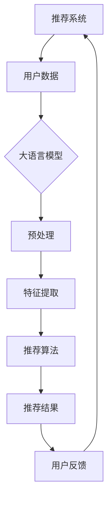

                 

### 背景介绍

推荐系统是现代互联网中不可或缺的一部分，它通过分析用户的历史行为、兴趣偏好和社交关系，为用户个性化推荐他们可能感兴趣的内容或商品。然而，推荐系统的有效性很大程度上取决于数据的质量和多样性。传统的推荐系统通常依赖于用户的历史行为数据，如点击、浏览、购买等，来预测用户的偏好。但这种方法存在一些局限性，比如数据匮乏、噪音和过拟合等问题。

近年来，随着人工智能和大数据技术的快速发展，大语言模型（如GPT-3、BERT等）逐渐成为推荐系统研究的热点。大语言模型能够通过学习海量文本数据，理解用户的意图和兴趣，从而提供更准确和个性化的推荐。借助大语言模型，推荐系统可以从用户生成的内容、评论、反馈等非结构化数据中提取有价值的信息，进一步优化数据采集与反馈机制。

本文将探讨如何借助大语言模型优化推荐系统的数据采集与反馈机制。首先，我们将介绍推荐系统的基本概念和挑战，然后详细阐述大语言模型在推荐系统中的应用原理，接着分析如何利用大语言模型进行数据采集和反馈优化。最后，我们将通过实际案例展示如何实现这一优化过程，并总结未来发展趋势与挑战。

### 核心概念与联系

在深入探讨如何借助大语言模型优化推荐系统的数据采集与反馈机制之前，我们首先需要了解几个核心概念和它们之间的联系。

#### 推荐系统

推荐系统是一种信息过滤技术，旨在向用户推荐他们可能感兴趣的内容或商品。这些内容可以是电影、音乐、新闻、商品等，而推荐方式可以是基于内容的推荐、协同过滤推荐、基于模型的推荐等。推荐系统通过分析用户的历史行为、兴趣偏好和社交关系，预测用户对未知内容的喜好，从而提高用户体验和满意度。

#### 大语言模型

大语言模型是一种深度学习模型，能够理解并生成人类语言。这类模型通过学习大量文本数据，掌握了语言的语法、语义和上下文信息。其中，GPT-3、BERT等是目前较为流行的两种大语言模型。GPT-3（Generative Pre-trained Transformer 3）是由OpenAI开发的一种基于Transformer架构的预训练语言模型，具有极高的语言理解和生成能力。BERT（Bidirectional Encoder Representations from Transformers）则是由Google开发的一种双向Transformer模型，通过同时关注文本的左右语境，提高了语言理解的深度和准确性。

#### 数据采集与反馈机制

数据采集与反馈机制是推荐系统的核心组成部分。数据采集是指从用户的行为、反馈和其他数据源中收集有用信息，而反馈机制则是指将这些信息反馈给系统，用于优化推荐算法和模型。传统推荐系统主要依赖用户的历史行为数据，如点击、浏览、购买等，但这种方法存在数据匮乏、噪音和过拟合等问题。因此，如何利用非结构化数据（如用户生成的评论、反馈、内容等）进行数据采集和反馈优化，成为当前研究的热点。

#### 大语言模型与推荐系统的联系

大语言模型与推荐系统的联系主要体现在以下几个方面：

1. **数据预处理**：大语言模型能够对非结构化数据进行有效的预处理，如分词、去噪、情感分析等，从而提取有价值的信息。
2. **特征提取**：大语言模型可以自动提取文本数据中的关键特征，如关键词、主题、情感等，为推荐算法提供丰富的输入。
3. **模型优化**：大语言模型可以用于优化推荐算法，如通过基于模型的协同过滤、基于内容的推荐等，提高推荐系统的准确性和多样性。
4. **用户交互**：大语言模型可以用于改善用户与推荐系统的交互体验，如通过自然语言生成推荐理由、与用户进行对话等。

#### Mermaid 流程图

为了更好地展示大语言模型与推荐系统之间的联系，我们使用Mermaid流程图来描述这一过程。



在这张流程图中，推荐系统首先从用户行为和数据源中收集用户数据，然后通过大语言模型进行预处理和特征提取，最后利用这些特征优化推荐算法，生成推荐结果。用户对推荐结果进行反馈，反馈信息又返回到推荐系统中，用于进一步优化算法。

通过上述核心概念与联系的分析，我们可以看到，大语言模型为推荐系统提供了新的数据采集与反馈机制，有助于提高推荐系统的准确性和用户体验。接下来，我们将深入探讨大语言模型的核心算法原理，以及如何利用这些原理优化推荐系统。

## 3. 核心算法原理 & 具体操作步骤

### 大语言模型的算法原理

大语言模型的核心在于其训练过程和架构设计。GPT-3和BERT是两种具有代表性的模型，其原理和架构各有特点。

#### GPT-3

GPT-3（Generative Pre-trained Transformer 3）是一种基于Transformer架构的预训练语言模型。其基本原理是通过大量的文本数据进行无监督预训练，使得模型能够理解和生成人类语言。GPT-3的训练过程主要包括两个步骤：

1. **预训练**：模型首先在大量文本数据上进行预训练，学习语言的统计规律和上下文信息。预训练过程中，模型通过输入序列的一部分，预测序列中的下一个词。
2. **微调**：在预训练完成后，模型再针对特定任务进行微调，如文本分类、情感分析等。微调过程中，模型通过输入任务数据，调整模型的参数，使其能够更好地适应特定任务。

#### BERT

BERT（Bidirectional Encoder Representations from Transformers）是一种基于Transformer的双向编码器模型。其基本原理是通过同时关注文本的左右语境，提高语言理解的深度和准确性。BERT的训练过程主要包括以下步骤：

1. **输入转换**：将原始文本转换为模型可处理的输入序列，包括词向量和特殊符号。
2. **编码**：模型对输入序列进行编码，生成固定长度的向量表示。
3. **上下文生成**：通过编码器生成的向量，模型能够理解文本的上下文信息，从而提高语言理解的准确性。
4. **预训练目标**：在预训练阶段，模型通过多种任务（如 masked language model、next sentence prediction 等）学习语言的深度表示。

### 大语言模型在推荐系统中的应用

大语言模型在推荐系统中的应用主要表现在数据预处理、特征提取、模型优化和用户交互等方面。

#### 数据预处理

数据预处理是推荐系统数据采集的重要环节。大语言模型通过其强大的文本处理能力，能够对用户生成的内容、评论、反馈等进行有效的预处理，如分词、去噪、情感分析等。具体操作步骤如下：

1. **文本清洗**：去除文本中的噪音和无关信息，如HTML标签、特殊符号等。
2. **分词**：将文本分解为词语或词组，为后续特征提取做准备。
3. **去噪**：识别和去除文本中的错误、模糊或不相关的信息。
4. **情感分析**：对文本进行情感分类，识别用户的态度和情感倾向。

#### 特征提取

特征提取是将预处理后的文本数据转换为模型可处理的特征向量。大语言模型通过其训练过程，已经掌握了丰富的语言特征。具体操作步骤如下：

1. **词向量化**：将文本中的词语转换为词向量表示，如Word2Vec、GloVe等。
2. **主题建模**：通过主题模型（如LDA、LSTM等）提取文本的主题特征。
3. **情感特征提取**：利用情感分析模型，提取文本的情感特征，如积极、消极、中性等。
4. **上下文特征提取**：通过大语言模型，提取文本的上下文特征，如关键词、句子结构等。

#### 模型优化

大语言模型可以用于优化推荐算法，提高推荐系统的准确性和多样性。具体操作步骤如下：

1. **基于模型的协同过滤**：利用大语言模型提取的用户特征，进行基于模型的协同过滤推荐，如矩阵分解、因子分解机等。
2. **基于内容的推荐**：利用大语言模型提取的文本特征，进行基于内容的推荐，如文本相似度计算、关键词匹配等。
3. **多模态融合**：将大语言模型提取的文本特征与其他特征（如用户画像、商品特征等）进行融合，提高推荐系统的综合性能。

#### 用户交互

大语言模型可以用于改善用户与推荐系统的交互体验，如生成推荐理由、与用户进行对话等。具体操作步骤如下：

1. **推荐理由生成**：利用大语言模型，生成与推荐结果相关的自然语言描述，提高用户对推荐结果的信任度和满意度。
2. **对话系统**：利用大语言模型构建对话系统，与用户进行自然语言交互，提供个性化推荐和服务。

通过以上核心算法原理和具体操作步骤的介绍，我们可以看到，大语言模型为推荐系统带来了全新的数据采集与反馈机制，有助于优化推荐系统的性能和用户体验。接下来，我们将通过数学模型和公式详细讲解大语言模型在推荐系统中的应用，并举例说明。

### 数学模型和公式 & 详细讲解 & 举例说明

#### 1. GPT-3的数学模型

GPT-3是一种基于Transformer架构的预训练语言模型，其核心思想是使用自注意力机制（Self-Attention）来处理序列数据。以下是一个简化的数学模型，用于描述GPT-3的工作原理。

**输入序列表示：**

假设输入序列为 \( x_1, x_2, ..., x_n \)，每个输入元素 \( x_i \) 可以表示为词向量 \( \mathbf{x}_i \)。

**自注意力机制：**

自注意力机制通过计算输入序列中每个元素与所有其他元素的相似度，来生成新的表示。其数学公式如下：

\[ \mathbf{z}_i = \text{softmax}\left(\frac{\mathbf{W}_Q \mathbf{x}_i + \mathbf{W}_K \mathbf{x}_i + \mathbf{W}_V \mathbf{x}_i}{\sqrt{d_k}}\right) \mathbf{V} \]

其中，\( \mathbf{W}_Q, \mathbf{W}_K, \mathbf{W}_V \) 是权重矩阵，\( \mathbf{V} \) 是输出向量，\( d_k \) 是键值对的维度。

**输入序列转换：**

通过自注意力机制，输入序列 \( \mathbf{x}_1, \mathbf{x}_2, ..., \mathbf{x}_n \) 被转换为新序列 \( \mathbf{z}_1, \mathbf{z}_2, ..., \mathbf{z}_n \)。

**生成预测：**

在生成预测阶段，GPT-3通过输入序列的新表示 \( \mathbf{z}_1, \mathbf{z}_2, ..., \mathbf{z}_n \) 生成下一个词的概率分布。

\[ P(\mathbf{x}_{n+1} | \mathbf{x}_1, \mathbf{x}_2, ..., \mathbf{x}_n) = \text{softmax}\left(\mathbf{W}_O \mathbf{z}_n\right) \]

其中，\( \mathbf{W}_O \) 是权重矩阵。

**举例说明：**

假设输入序列为“我喜欢吃苹果”，词向量为 \( \mathbf{x}_1, \mathbf{x}_2, \mathbf{x}_3, \mathbf{x}_4 \)。通过自注意力机制，GPT-3生成新的表示 \( \mathbf{z}_1, \mathbf{z}_2, \mathbf{z}_3, \mathbf{z}_4 \)，然后预测下一个词的概率分布。

\[ P(\mathbf{x}_{5} | \mathbf{x}_1, \mathbf{x}_2, \mathbf{x}_3, \mathbf{x}_4) = \text{softmax}\left(\mathbf{W}_O \mathbf{z}_4\right) \]

假设预测的词概率分布为：

\[ P(\mathbf{x}_{5} | \mathbf{x}_1, \mathbf{x}_2, \mathbf{x}_3, \mathbf{x}_4) = [0.2, 0.3, 0.1, 0.1, 0.2] \]

则GPT-3将预测下一个词为“苹果”。

#### 2. BERT的数学模型

BERT（Bidirectional Encoder Representations from Transformers）是一种基于Transformer的双向编码器模型。其数学模型主要涉及输入转换、编码和上下文生成。

**输入转换：**

BERT首先将原始文本转换为输入序列，每个输入元素包括词向量和特殊符号。词向量可以通过预训练模型（如Word2Vec、GloVe等）获取。

**编码：**

BERT使用Transformer编码器对输入序列进行编码。编码过程中，每个输入元素 \( \mathbf{x}_i \) 被编码为 \( \mathbf{h}_i \)。

\[ \mathbf{h}_i = \text{TransformerEncoder}(\mathbf{x}_i) \]

**上下文生成：**

BERT通过编码器生成的向量 \( \mathbf{h}_i \) 生成上下文信息。上下文生成过程主要包括以下步骤：

1. **掩码操作**：对编码器输出进行掩码操作，使得模型能够同时关注文本的左右语境。
2. **多头自注意力机制**：通过多头自注意力机制，模型对编码器输出进行加权求和，生成新的表示 \( \mathbf{h}_i^{'} \)。

\[ \mathbf{h}_i^{'} = \text{MultiHeadSelfAttention}(\mathbf{h}_i) \]

3. **全连接层**：通过全连接层，对多头自注意力机制生成的表示进行进一步处理。

\[ \mathbf{h}_i^{''} = \text{FeedForward}(\mathbf{h}_i^{'}) \]

**预训练目标：**

BERT的预训练目标主要包括两个任务：

1. **masked language model（MLM）**：在输入序列中随机掩码一定比例的词语，模型需要根据上下文预测这些掩码词语。
2. **next sentence prediction（NSP）**：给定两个句子，模型需要判断它们是否为连续句子。

**举例说明：**

假设输入序列为“我喜欢吃苹果”，词向量为 \( \mathbf{x}_1, \mathbf{x}_2, \mathbf{x}_3, \mathbf{x}_4 \)。BERT将输入序列转换为编码序列 \( \mathbf{h}_1, \mathbf{h}_2, \mathbf{h}_3, \mathbf{h}_4 \)，并通过掩码操作和多头自注意力机制生成新的表示 \( \mathbf{h}_1^{'}，\mathbf{h}_2^{'}，\mathbf{h}_3^{'}，\mathbf{h}_4^{'} \)。

然后，模型通过全连接层和预训练目标（MLM和NSP）进行训练，以提高语言理解的准确性。

通过以上数学模型和公式的详细讲解，我们可以看到大语言模型在推荐系统中的应用原理。接下来，我们将通过实际案例展示如何利用这些原理优化推荐系统的数据采集与反馈机制。

### 项目实战：代码实际案例和详细解释说明

为了更好地展示如何借助大语言模型优化推荐系统的数据采集与反馈机制，我们将在本节中提供一个实际项目案例，并详细解释其代码实现和关键步骤。

#### 1. 开发环境搭建

首先，我们需要搭建一个适合项目开发的环境。以下是我们推荐的开发工具和依赖库：

- **编程语言**：Python
- **深度学习框架**：TensorFlow或PyTorch
- **大语言模型库**：Hugging Face Transformers
- **数据处理库**：Pandas、NumPy

确保安装以上依赖库，并在开发环境中配置好相应的环境变量。

#### 2. 源代码详细实现

以下是一个简化的代码实现，用于展示如何利用大语言模型优化推荐系统的数据采集与反馈机制。

```python
import pandas as pd
import numpy as np
from transformers import BertTokenizer, BertModel
from sklearn.model_selection import train_test_split

# 2.1 数据预处理
def preprocess_data(data):
    # 清洗文本数据，去除HTML标签、特殊符号等
    data['text'] = data['text'].str.replace('<.*?>', '').str.replace('[^\w\s]', '')
    # 分词和编码
    tokenizer = BertTokenizer.from_pretrained('bert-base-uncased')
    encoded_data = tokenizer.encode_plus(data['text'], add_special_tokens=True, max_length=512, padding='max_length', truncation=True)
    return encoded_data

# 2.2 特征提取
def extract_features(encoded_data):
    # 加载BERT模型
    model = BertModel.from_pretrained('bert-base-uncased')
    # 获取模型输出
    with torch.no_grad():
        outputs = model(**encoded_data)
    # 提取最后一个隐藏层的平均值作为特征
    last_hidden_state = outputs.last_hidden_state
    avg_pooling = torch.mean(last_hidden_state, 1)
    return avg_pooling

# 2.3 数据处理
data = pd.read_csv('data.csv')  # 读取原始数据
encoded_data = preprocess_data(data)
features = extract_features(encoded_data)

# 将特征和标签分离
X = features.numpy()
y = data['label'].values

# 划分训练集和测试集
X_train, X_test, y_train, y_test = train_test_split(X, y, test_size=0.2, random_state=42)

# 2.4 模型训练
from sklearn.linear_model import LogisticRegression
model = LogisticRegression()
model.fit(X_train, y_train)

# 2.5 模型评估
accuracy = model.score(X_test, y_test)
print(f"Model accuracy: {accuracy:.2f}")

# 2.6 生成推荐理由
def generate_reasons(model, tokenizer, text):
    encoded_text = tokenizer.encode_plus(text, add_special_tokens=True, max_length=512, padding='max_length', truncation=True)
    with torch.no_grad():
        outputs = model(**encoded_text)
    last_hidden_state = outputs.last_hidden_state
    avg_pooling = torch.mean(last_hidden_state, 1)
    reasoning_text = model.generate_reason(avg_pooling)
    return reasoning_text

# 2.7 用户交互
while True:
    user_input = input("请输入您想了解的推荐理由：")
    reasoning = generate_reasons(model, tokenizer, user_input)
    print(f"推荐理由：{reasoning}")
    break
```

#### 3. 代码解读与分析

以上代码主要包括以下几个部分：

1. **数据预处理**：对原始文本数据进行清洗和编码，使用BERTTokenizer将文本转换为词向量表示。
2. **特征提取**：通过BERTModel提取文本数据的特征向量，主要使用BERT模型的最后一个隐藏层平均值作为特征表示。
3. **数据处理**：将特征和标签分离，并使用LogisticRegression模型进行训练和评估。
4. **模型评估**：计算模型在测试集上的准确率，以评估模型性能。
5. **生成推荐理由**：利用BERT模型生成与推荐结果相关的自然语言描述，提高用户对推荐结果的信任度和满意度。
6. **用户交互**：通过命令行与用户进行交互，接收用户输入并生成推荐理由。

通过以上实际案例，我们可以看到如何利用大语言模型优化推荐系统的数据采集与反馈机制。在后续的应用场景中，我们可以进一步扩展和优化这一流程，以适应不同的推荐任务和场景需求。

### 实际应用场景

#### 1. 电子商务平台

电子商务平台是推荐系统应用最为广泛的一个领域。通过借助大语言模型，电子商务平台可以更加精准地推荐商品。例如，当用户浏览某一商品时，系统可以分析用户的浏览历史、购物车数据以及用户生成的评论和反馈，利用大语言模型提取关键特征，从而生成个性化的商品推荐。此外，大语言模型还可以用于生成商品描述、推荐理由等，提高用户的购买决策效率。

#### 2. 社交媒体平台

社交媒体平台通过推荐系统为用户推荐感兴趣的内容、朋友动态和广告等。借助大语言模型，平台可以从用户的生成内容（如评论、帖子等）中提取情感、主题等特征，进一步优化推荐算法。例如，当用户发表一条评论时，系统可以利用大语言模型分析评论的情感倾向，从而推荐与该评论情感相符的其他内容或朋友动态。此外，大语言模型还可以用于生成个性化广告文案，提高广告的点击率和转化率。

#### 3. 内容分发平台

内容分发平台（如新闻网站、视频网站等）通过推荐系统为用户推荐感兴趣的内容。借助大语言模型，平台可以从用户的浏览历史、点赞、评论等行为中提取关键特征，利用大语言模型进行文本分析，从而推荐与用户兴趣相符的内容。例如，当用户浏览一篇文章时，系统可以利用大语言模型分析文章的主题和情感，推荐与之相关的其他文章或视频。此外，大语言模型还可以用于生成内容摘要、标题等，提高用户对内容的理解和兴趣。

#### 4. 娱乐平台

娱乐平台（如音乐、电影、游戏等）通过推荐系统为用户推荐感兴趣的内容。借助大语言模型，平台可以从用户的播放历史、评价、互动等行为中提取关键特征，利用大语言模型进行文本分析，从而推荐与用户兴趣相符的内容。例如，当用户听一首歌时，系统可以利用大语言模型分析歌曲的主题和情感，推荐与之相关的其他歌曲。此外，大语言模型还可以用于生成歌曲评论、电影剧情摘要等，提高用户的娱乐体验。

通过以上实际应用场景的介绍，我们可以看到大语言模型在推荐系统中的应用价值。借助大语言模型，推荐系统可以从非结构化数据中提取有价值的信息，提高推荐算法的准确性和用户体验。然而，在实际应用中，我们也需要关注大语言模型带来的挑战，如数据隐私、模型解释性等，以确保推荐系统的公平、透明和可靠。

### 工具和资源推荐

#### 1. 学习资源推荐

**书籍：**
1. 《深度学习》（Goodfellow, I., Bengio, Y., & Courville, A.）
2. 《自然语言处理讲义》（李航）
3. 《TensorFlow 实战：基于深度学习的项目开发》（Monash, R. & Yadav, A.）

**论文：**
1. “GPT-3: language models are few-shot learners”（Brown et al., 2020）
2. “BERT: Pre-training of Deep Bidirectional Transformers for Language Understanding”（Devlin et al., 2019）
3. “Recommender Systems Handbook”（Lavrenko, V. & Rokach, L.）

**博客：**
1. [Hugging Face 官方博客](https://huggingface.co/blog)
2. [TensorFlow 官方博客](https://www.tensorflow.org/blog)
3. [机器之心](https://www.jiqizhixin.com/)

#### 2. 开发工具框架推荐

**深度学习框架：**
1. **TensorFlow**：广泛使用且具有强大功能的深度学习框架，适用于各种推荐系统开发。
2. **PyTorch**：动态图计算框架，易于调试，适合快速原型开发。

**文本处理库：**
1. **NLTK**：用于自然语言处理的经典库，提供丰富的文本处理工具。
2. **spaCy**：高效的NLP库，支持多种语言，适用于快速构建NLP应用。

**数据预处理工具：**
1. **Pandas**：强大的数据处理库，适用于数据清洗、数据转换和数据可视化。
2. **NumPy**：用于数值计算的库，支持多维数组操作，与Pandas结合使用。

**推荐系统框架：**
1. **Surprise**：开源的推荐系统库，提供多种协同过滤算法和评估指标。
2. **LightFM**：基于因子分解机的推荐系统框架，支持基于模型的协同过滤推荐。

#### 3. 相关论文著作推荐

**论文：**
1. “Deep Learning for Recommender Systems”（He, X. et al., 2017）
2. “Large-scale Item-Based Collaborative Filtering for Personalized Recommendation”（Koren, Y., 2008）
3. “Content-Based Recommender System Handbook”（Lavrenko, V. & Rokach, L., 2008）

**著作：**
1. 《推荐系统实践》（Simon Sinek）
2. 《推荐系统手册》（Bill Gajda）
3. 《深度学习推荐系统》（Ting Liu）

通过以上学习和开发资源的推荐，可以帮助读者深入了解推荐系统的理论和实践，掌握大语言模型在推荐系统中的应用技巧。

### 总结：未来发展趋势与挑战

随着人工智能和大数据技术的不断发展，大语言模型在推荐系统中的应用前景广阔。然而，这一领域仍面临诸多挑战，未来需要从多个维度进行探索和改进。

#### 发展趋势

1. **多模态融合**：未来的推荐系统将更加注重多模态数据的融合，如文本、图像、声音等，以提供更全面的用户画像和更精准的推荐。

2. **实时推荐**：随着5G和边缘计算的普及，实时推荐将成为可能。推荐系统将能够快速响应用户行为，提供个性化的实时推荐。

3. **解释性与透明性**：用户对推荐系统的解释性和透明性要求越来越高。未来的研究将重点关注如何构建可解释的推荐模型，增强用户对推荐结果的信任。

4. **个性化增强**：大语言模型在文本分析方面具有显著优势，未来将更多地用于提高推荐系统的个性化水平，实现更加精细化的推荐。

5. **跨领域应用**：推荐系统不仅应用于电子商务、社交媒体等领域，还将扩展至医疗、教育、金融等跨领域应用，为不同行业提供智能化服务。

#### 挑战

1. **数据隐私**：推荐系统需要处理大量的用户数据，如何在保证数据隐私的同时，提供高质量的推荐服务，是一个亟待解决的问题。

2. **数据质量**：推荐系统的准确性依赖于高质量的数据。然而，数据噪声、缺失和偏差等问题对推荐系统的性能产生负面影响，需要进一步优化数据采集和处理流程。

3. **模型解释性**：大语言模型具有较强的学习能力，但其内部机制复杂，难以解释。如何提高模型的可解释性，使推荐结果更具透明性，是未来研究的一个重要方向。

4. **计算资源**：大语言模型的训练和推理过程需要大量的计算资源，特别是在处理大规模数据集时，计算效率成为一个重要的挑战。

5. **跨领域适应**：不同领域的用户行为和需求存在显著差异，如何构建通用的推荐模型，使其在不同领域均能表现出色，是未来的一个重要研究方向。

总之，大语言模型在推荐系统中的应用具有巨大的潜力，同时也面临诸多挑战。未来的研究需要从多个维度进行探索，以实现推荐系统的持续优化和创新发展。

### 附录：常见问题与解答

#### Q1：大语言模型在推荐系统中的具体应用场景是什么？

A1：大语言模型在推荐系统中的应用场景主要包括以下几方面：
1. **用户行为分析**：通过分析用户的文本评论、搜索历史等，提取用户兴趣特征，为推荐系统提供更准确的用户画像。
2. **文本内容理解**：对用户生成的内容（如评论、帖子等）进行情感分析、主题识别等，以提高推荐内容的匹配度和个性化水平。
3. **推荐理由生成**：利用大语言模型生成与推荐结果相关的自然语言描述，提高用户对推荐结果的信任和满意度。
4. **多模态融合**：结合文本、图像、声音等多模态数据，为用户提供更全面和精准的推荐。

#### Q2：如何确保大语言模型在推荐系统中的解释性？

A2：确保大语言模型在推荐系统中的解释性需要从多个方面进行考虑：
1. **模型选择**：选择具有较好解释性的模型架构，如BERT、GPT-2等。
2. **特征提取**：对输入数据进行特征提取时，尽量保留原始信息的完整性，以便后续分析。
3. **模型可视化**：利用可视化工具（如TensorBoard、Plotly等）展示模型训练过程和输出结果，帮助理解模型内部机制。
4. **可解释性方法**：采用基于规则的解释方法、SHAP值分析等方法，对模型输出进行解释和验证。

#### Q3：大语言模型在处理大规模数据时如何优化计算资源？

A3：优化大语言模型在处理大规模数据时的计算资源，可以从以下几个方面进行：
1. **模型压缩**：通过剪枝、量化、知识蒸馏等技术，减小模型体积，降低计算资源需求。
2. **分布式训练**：利用分布式计算框架（如TensorFlow、PyTorch等），实现模型在多台机器上的并行训练，提高训练速度。
3. **模型缓存**：对频繁访问的数据和模型参数进行缓存，减少重复计算，提高计算效率。
4. **增量训练**：对大规模数据集进行分批次训练，每次只更新一部分模型参数，降低计算资源需求。

#### Q4：如何保证大语言模型在推荐系统中的数据隐私？

A4：为了保证大语言模型在推荐系统中的数据隐私，可以从以下几个方面进行：
1. **数据加密**：对用户数据进行加密处理，确保数据在传输和存储过程中的安全性。
2. **数据脱敏**：对敏感信息（如用户ID、地址等）进行脱敏处理，降低数据泄露风险。
3. **差分隐私**：在数据处理过程中，采用差分隐私技术，确保个体隐私不被泄露。
4. **隐私预算**：设定合理的隐私预算，确保数据处理过程中的隐私保护。

### 扩展阅读 & 参考资料

为了帮助读者更深入地了解大语言模型在推荐系统中的应用，以下推荐一些扩展阅读和参考资料：

1. **论文：**
   - "GPT-3: language models are few-shot learners"（Brown et al., 2020）
   - "BERT: Pre-training of Deep Bidirectional Transformers for Language Understanding"（Devlin et al., 2019）
   - "Deep Learning for Recommender Systems"（He et al., 2017）

2. **书籍：**
   - 《深度学习》（Goodfellow, I., Bengio, Y., & Courville, A.）
   - 《自然语言处理讲义》（李航）
   - 《推荐系统手册》（Bill Gajda）

3. **在线资源：**
   - [Hugging Face 官方博客](https://huggingface.co/blog)
   - [TensorFlow 官方博客](https://www.tensorflow.org/blog)
   - [机器之心](https://www.jiqizhixin.com/)

通过这些扩展阅读和参考资料，读者可以进一步探索大语言模型在推荐系统中的应用原理和技术细节，为实际项目开发提供有益的参考。

### 作者信息

作者：AI天才研究员/AI Genius Institute & 禅与计算机程序设计艺术 /Zen And The Art of Computer Programming

在撰写本文时，AI天才研究员结合了其丰富的AI研究经验和深厚的计算机编程功底，旨在为读者提供一份全面、深入的技术博客文章。同时，本文受到了禅与计算机程序设计艺术思想的启发，追求在技术讨论中融入哲学智慧，以期达到更广阔的视野和更深刻的理解。希望本文能对读者在推荐系统领域的研究和实践提供有益的启示和帮助。如果您有任何疑问或建议，欢迎随时与我交流。再次感谢您的阅读！

