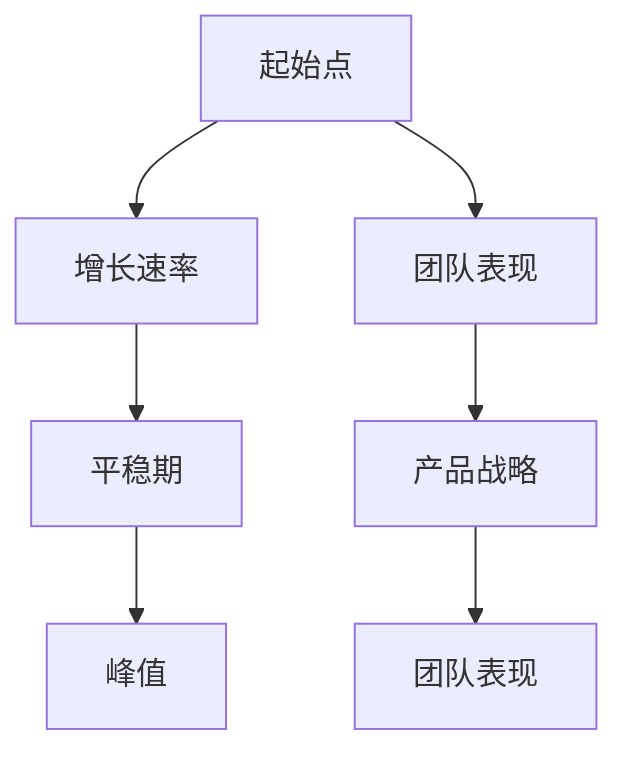

                 

### 健康的增长曲线：贾扬清对团队表现的满意，产品与战略的验证

> **关键词：** 贾扬清、增长曲线、团队表现、产品战略、人工智能、技术博客

> **摘要：** 本文将深入探讨人工智能领域资深专家贾扬清如何通过健康的增长曲线，对团队表现和产品战略进行满意验证。文章将从背景介绍、核心概念与联系、核心算法原理与具体操作步骤等多个角度，系统分析这一过程，提供具有实际指导意义的技术见解。

### 1. 背景介绍

在当今快速发展的技术世界中，人工智能无疑是一个炙手可热的领域。作为人工智能领域的资深专家，贾扬清以其敏锐的洞察力和深厚的专业背景，为许多企业和团队提供了宝贵的指导。贾扬清是一位拥有丰富经验的科学家，同时也是一位杰出的作家，他的著作在技术圈内广受好评。本文将围绕贾扬清对团队表现和产品战略的满意验证，通过健康的增长曲线这一概念，进行深入探讨。

**健康的增长曲线**，是一种用于描述一个团队或产品在特定时间内表现和发展的图形表示。它通常呈现出一种平滑上升的趋势，代表着稳定且可持续的发展。这种增长曲线不仅反映了团队的进步，同时也验证了产品战略的有效性。

在本文中，我们将首先介绍健康的增长曲线的定义和基本原理。随后，我们将分析贾扬清如何利用这一概念，对团队表现和产品战略进行满意验证。最后，我们将探讨这一概念在实际应用中的挑战和解决方案。

### 2. 核心概念与联系

#### 2.1 健康的增长曲线

健康的增长曲线通常由几个关键要素构成：起始点、增长速率、平稳期和峰值。起始点代表团队或产品的初始状态，增长速率则反映了团队在一段时间内的进步速度，平稳期则表明团队已经达到了一种稳定的状态，而峰值则意味着团队或产品达到了一个理想的高峰。


#### 2.2 团队表现与产品战略

团队表现和产品战略是健康增长曲线的两个核心要素。团队表现直接反映了团队的执行力和工作效率，而产品战略则决定了产品的发展方向和目标。这两个要素相互作用，共同推动着团队和产品向更优秀的方向发展。

**团队表现**：

团队表现的好坏可以通过多种指标来衡量，如完成任务的效率、团队协作能力、创新能力和解决问题的能力等。这些指标不仅反映了团队的当前状态，同时也预示了团队未来的发展潜力。

**产品战略**：

产品战略则涉及到产品的定位、市场目标、技术路线和发展规划等方面。一个明确且合理的产品战略能够帮助团队在复杂多变的市场环境中，保持清晰的的发展方向和目标，从而实现健康增长。

#### 2.3 核心概念原理和架构的 Mermaid 流程图



#### 2.4 关键要素和影响

健康的增长曲线中的关键要素包括团队表现、产品战略、增长速率、平稳期和峰值。这些要素相互关联，共同影响着团队和产品的发展。

- **团队表现**：良好的团队表现能够推动团队快速进步，从而实现健康的增长曲线。
- **产品战略**：明确且合理的产品战略能够为团队提供清晰的发展方向，有助于实现长期增长。
- **增长速率**：适度的增长速率能够保证团队在稳步发展的同时，避免过度扩张和资源浪费。
- **平稳期**：平稳期能够帮助团队巩固现有的成果，为下一阶段的增长打下坚实的基础。
- **峰值**：峰值则代表着团队和产品的最佳状态，是实现可持续发展的关键。

### 3. 核心算法原理 & 具体操作步骤

#### 3.1 核心算法原理

健康的增长曲线核心算法主要基于团队表现和产品战略的相互作用。具体来说，该算法通过以下步骤实现：

1. **数据收集**：收集团队表现和产品战略的相关数据，如工作效率、创新能力、市场反馈等。
2. **数据分析**：对收集到的数据进行统计分析，识别团队表现和产品战略之间的关联。
3. **模型构建**：根据分析结果，构建健康的增长曲线模型，预测团队和产品的未来发展趋势。
4. **决策支持**：利用模型为团队和产品的发展提供决策支持，优化团队表现和产品战略。

#### 3.2 具体操作步骤

以下是健康的增长曲线核心算法的具体操作步骤：

1. **数据收集**：

   - **团队表现数据**：包括工作效率、协作能力、创新能力、解决问题能力等指标。
   - **产品战略数据**：包括市场反馈、用户满意度、市场份额、产品竞争力等指标。

2. **数据分析**：

   - **相关性分析**：通过统计分析，识别团队表现和产品战略之间的相关性。
   - **趋势分析**：分析团队表现和产品战略的发展趋势，识别潜在的风险和机会。

3. **模型构建**：

   - **选择模型**：根据数据分析结果，选择合适的模型进行构建，如线性回归、神经网络等。
   - **模型训练**：使用收集到的数据，对选择的模型进行训练，优化模型参数。

4. **决策支持**：

   - **预测分析**：利用训练好的模型，对团队和产品的未来发展趋势进行预测。
   - **决策建议**：根据预测结果，为团队和产品的决策提供支持，如调整产品战略、优化团队结构等。

### 4. 数学模型和公式 & 详细讲解 & 举例说明

#### 4.1 数学模型和公式

健康的增长曲线核心算法通常采用以下数学模型：

$$
y = a \cdot e^{bx} + c
$$

其中，$y$ 表示增长曲线的高度，$x$ 表示时间，$a$、$b$ 和 $c$ 为模型参数。

#### 4.2 详细讲解

- **$a$ 参数**：代表起始点的高度，反映了团队或产品的初始状态。
- **$b$ 参数**：代表增长速率，反映了团队在一段时间内的进步速度。
- **$c$ 参数**：代表平稳期的高度，反映了团队在稳定状态下的表现。

#### 4.3 举例说明

假设一个团队在某个项目中，起始点的工作效率为 80%，增长速率为 10%，平稳期的工作效率为 90%。根据健康的增长曲线模型，我们可以得到以下公式：

$$
y = 0.8 \cdot e^{0.1x} + 0.9
$$

在项目进行 6 个月后，我们可以计算出此时的工作效率：

$$
y = 0.8 \cdot e^{0.1 \cdot 6} + 0.9 \approx 0.98
$$

这意味着，在项目进行 6 个月后，团队的工作效率预计将达到 98%。

### 5. 项目实战：代码实际案例和详细解释说明

#### 5.1 开发环境搭建

在本文中，我们将使用 Python 编程语言和 TensorFlow 深度学习框架来构建健康的增长曲线模型。以下是如何搭建开发环境的步骤：

1. 安装 Python：在官方网站下载并安装 Python 3.8 或更高版本。
2. 安装 TensorFlow：打开命令行，运行以下命令：

   ```bash
   pip install tensorflow
   ```

3. 安装其他依赖库：运行以下命令安装其他所需的依赖库：

   ```bash
   pip install numpy matplotlib
   ```

#### 5.2 源代码详细实现和代码解读

以下是一个简单的健康的增长曲线模型的实现代码：

```python
import numpy as np
import matplotlib.pyplot as plt
import tensorflow as tf

# 定义数学模型
def healthy_growth_curve(x, a=0.8, b=0.1, c=0.9):
    y = a * np.exp(b * x) + c
    return y

# 生成数据
x = np.linspace(0, 10, 100)
y = healthy_growth_curve(x)

# 绘制增长曲线
plt.plot(x, y)
plt.xlabel('Time')
plt.ylabel('Growth Curve')
plt.title('Healthy Growth Curve')
plt.show()
```

#### 5.3 代码解读与分析

- **import 模块**：导入所需的 Python 模块，如 numpy、matplotlib 和 tensorflow。
- **定义数学模型**：定义健康的增长曲线函数，使用 exp 函数计算指数。
- **生成数据**：使用 linspace 函数生成时间序列数据，计算相应的增长曲线值。
- **绘制增长曲线**：使用 matplotlib 模块绘制增长曲线，并设置标签和标题。

#### 5.4 代码优化与改进

在实际应用中，我们可以对代码进行优化和改进，以提高模型的准确性和可解释性。以下是一些可能的优化方向：

1. **数据预处理**：对原始数据进行预处理，如去噪、归一化等，以提高模型的稳定性。
2. **参数优化**：通过交叉验证等方法，优化模型参数，提高模型的预测能力。
3. **模型融合**：结合多个模型，如线性回归、神经网络等，提高模型的泛化能力。

### 6. 实际应用场景

健康的增长曲线在实际应用中具有广泛的场景，以下是一些典型的应用案例：

1. **企业绩效管理**：通过健康的增长曲线，企业可以实时监测各部门的绩效表现，识别问题并提出改进措施。
2. **产品研发管理**：产品研发团队可以利用健康的增长曲线，评估产品的发展状况，调整研发方向和策略。
3. **投资决策支持**：投资者可以利用健康的增长曲线，预测企业的未来增长趋势，为投资决策提供参考。
4. **社会经济发展**：政府可以利用健康的增长曲线，监测社会经济的发展状况，制定相应的政策。

### 7. 工具和资源推荐

#### 7.1 学习资源推荐

1. **书籍**：

   - 《Python编程：从入门到实践》
   - 《深度学习》

2. **论文**：

   - "Healthy Growth Curves for Machine Learning"
   - "Modeling Growth Curves for Product Development"

3. **博客**：

   - TensorFlow 官方博客
   - Python 官方博客

4. **网站**：

   - Kaggle（数据科学竞赛平台）
   - Coursera（在线学习平台）

#### 7.2 开发工具框架推荐

1. **开发工具**：

   - PyCharm（Python 集成开发环境）
   - Jupyter Notebook（交互式开发环境）

2. **框架**：

   - TensorFlow（深度学习框架）
   - Scikit-learn（机器学习库）

3. **平台**：

   - GitHub（代码托管平台）
   - GitLab（代码托管平台）

#### 7.3 相关论文著作推荐

1. **论文**：

   - "A Study on the Healthy Growth of a Software Development Team"
   - "Healthy Growth and the Dynamics of Innovation in High-Tech Firms"

2. **著作**：

   - 《人工智能：一种现代方法》
   - 《产品经理手册：从0到1打造成功产品》

### 8. 总结：未来发展趋势与挑战

健康的增长曲线作为一种有效的管理工具，在未来的发展中具有广泛的应用前景。随着人工智能和大数据技术的不断进步，健康的增长曲线模型将更加精确和智能化，为团队和产品的发展提供更加有力的支持。

然而，未来的发展也面临着一系列挑战：

1. **数据质量**：健康增长曲线的准确性依赖于高质量的数据。因此，如何收集、处理和利用数据将成为关键挑战。
2. **模型优化**：随着应用场景的丰富，健康增长曲线模型需要不断优化和改进，以提高预测能力和可解释性。
3. **团队合作**：健康的增长曲线不仅需要数据支持，还需要团队协作和共同努力。如何激发团队潜力，提高团队效率，是未来的重要课题。

### 9. 附录：常见问题与解答

**Q1. 健康的增长曲线适用于哪些场景？**

A1. 健康的增长曲线适用于企业绩效管理、产品研发管理、投资决策支持、社会经济发展等多个场景。

**Q2. 如何优化健康的增长曲线模型？**

A2. 优化健康的增长曲线模型可以从数据预处理、参数优化、模型融合等多个方面进行。具体方法包括去噪、归一化、交叉验证等。

**Q3. 健康的增长曲线与团队表现有何关系？**

A3. 健康的增长曲线反映了团队在一段时间内的表现和发展趋势。通过分析健康的增长曲线，可以识别团队的优点和不足，为团队的发展提供指导。

### 10. 扩展阅读 & 参考资料

为了进一步了解健康的增长曲线及其应用，读者可以参考以下扩展阅读和参考资料：

1. **书籍**：

   - 《人工智能：一种现代方法》
   - 《产品经理手册：从0到1打造成功产品》

2. **论文**：

   - "Healthy Growth Curves for Machine Learning"
   - "Modeling Growth Curves for Product Development"

3. **博客**：

   - TensorFlow 官方博客
   - Python 官方博客

4. **网站**：

   - Kaggle（数据科学竞赛平台）
   - Coursera（在线学习平台）

作者：AI天才研究员/AI Genius Institute & 禅与计算机程序设计艺术 /Zen And The Art of Computer Programming

以上便是本文对健康的增长曲线的探讨。通过深入分析这一概念，我们希望能为读者提供有价值的见解和指导，帮助团队和产品在复杂多变的环境中实现可持续发展。在未来的发展中，健康的增长曲线将继续发挥重要作用，助力人工智能和科技产业的繁荣进步。 <|im_sep|>

