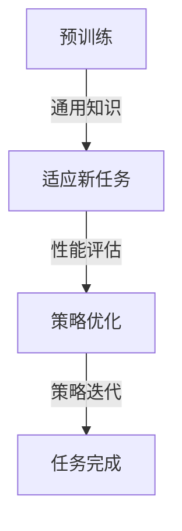

                 

### 背景介绍 Background Introduction

#### 强化学习 Reinforcement Learning

强化学习（Reinforcement Learning, RL）是机器学习领域的一种方法，旨在使代理（agent）通过与环境的交互来学习最优策略。在强化学习过程中，代理通过尝试不同的行动来获取奖励或惩罚，并依据这些奖励来更新其行为策略。这一过程可以类比于人类在学习过程中的试错机制。与监督学习和无监督学习不同，强化学习不依赖于已标记的数据集，而是通过与环境动态交互来不断学习。

强化学习的基本组成部分包括四个主要元素：代理（Agent）、环境（Environment）、状态（State）和行动（Action）。代理在某个特定状态下采取行动，然后环境根据代理的行动给予一个状态转移概率分布，并给予代理一个即时奖励。代理则依据奖励来更新其策略。这一过程在多个回合中持续进行，代理通过这种方式不断优化其策略。

#### 快速适应与策略优化

在强化学习中，快速适应（Fast Adaptation）和策略优化（Policy Optimization）是两个关键问题。快速适应指的是代理能够迅速从一种情境过渡到另一种情境，即使是在新环境中也能快速实现良好的性能。策略优化则是指在给定环境下，代理如何通过不断学习来找到一个最优或近似最优的策略。

快速适应能力对于强化学习任务至关重要。在很多实际应用中，环境可能会发生快速变化，例如在动态游戏、机器人导航和金融市场中。如果代理无法快速适应这些变化，其性能会显著下降。策略优化则关注如何找到一个高效、稳定且全局最优的策略，从而使代理在长期内能够获得最大收益。

#### 元学习与强化学习结合

元学习（Meta-Learning）是一种使模型能够快速适应新任务的学习方法。通过在多个任务上预先训练模型，元学习能够使模型在学习新任务时更加高效。将元学习与强化学习结合，可以解决强化学习中快速适应和策略优化的问题。

元学习在强化学习中的应用主要体现在两个方面：一是通过元学习来加速代理在新环境中的适应速度；二是通过元学习来优化代理的策略。具体来说，元学习可以帮助代理在短时间内通过学习迁移知识来快速适应新环境，同时也能够优化代理的策略，使其在长期内获得更高的收益。

总的来说，将元学习应用于强化学习任务，可以显著提高代理的适应能力和策略优化效果。这使得元学习在强化学习领域成为了一个备受关注的研究方向。接下来的部分将详细探讨元学习在强化学习中的应用，以及相关的算法创新。

#### 元学习 Meta-Learning

元学习（Meta-Learning）是指让模型能够在不同任务之间共享知识和经验，从而提高模型在多个任务上的学习效率。与传统的方法不同，元学习不依赖于大量特定任务的标记数据，而是通过在多个任务上预训练模型，使其具备快速适应新任务的能力。元学习在深度学习领域引起了广泛关注，并在许多实际应用中取得了显著成果。

元学习的核心思想是通过在多个任务上训练模型，使得模型能够在不同任务之间进行知识迁移。这种迁移能力使得模型在遇到新任务时能够迅速适应，从而减少对新任务的训练时间和资源消耗。元学习通常包括两个主要阶段：预训练（Pre-training）和适应（Adaptation）。

在预训练阶段，模型在多个任务上训练，以学习任务间的一般规律和共性。这些通用知识为模型在新任务上的适应提供了基础。适应阶段则是在新任务上对模型进行微调，使其能够快速适应特定任务的需求。元学习的方法有很多，包括模型平均（Model Averaging）、迁移学习（Transfer Learning）、MAML（Model-Agnostic Meta-Learning）、Reptile等。

MAML是一种广泛应用的元学习算法，其目标是通过少量梯度更新来快速适应新任务。MAML的基本思想是，找到一个模型参数的初始化点，使得模型在新任务上只需要很少的梯度更新就能达到良好的性能。具体来说，MAML算法通过以下步骤来实现：

1. **初始化模型参数**：随机初始化模型的参数。
2. **预训练**：在多个任务上对模型进行预训练，使其学习到通用知识。
3. **适应新任务**：在新任务上对模型进行少量梯度更新，使其适应新任务。
4. **评估性能**：在新任务上评估模型的性能。

通过这种方式，MAML能够在短时间内快速适应新任务，从而提高模型的适应能力和效率。

除了MAML，还有许多其他元学习算法，如Reptile、W＆O（Williams and ziplay's Online）等，这些算法通过不同的机制实现模型的快速适应。元学习的这些算法为解决强化学习中的快速适应和策略优化问题提供了有力工具。

#### 元学习与强化学习的联系

元学习与强化学习有着密切的联系。在强化学习任务中，快速适应和策略优化是两个关键问题，而元学习正是解决这两个问题的有力工具。元学习通过在多个任务上预训练模型，使得模型具备跨任务的知识迁移能力，从而在遇到新任务时能够迅速适应。

具体来说，元学习在强化学习中的应用主要体现在以下几个方面：

1. **快速适应新环境**：在强化学习任务中，环境可能会发生快速变化。例如，在动态游戏、机器人导航和金融市场中，环境状态可能在短时间内发生显著变化。元学习通过在多个任务上预训练模型，使其能够在新环境中快速适应。这种适应能力使得代理能够在短时间内达到良好的性能，从而提高任务完成效率。

2. **优化策略**：在强化学习中，代理的目标是找到一个最优或近似最优的策略，使其在长期内获得最大收益。元学习通过在多个任务上训练模型，使得模型能够学习到通用策略。这些通用策略可以应用于新任务中，从而提高代理在新任务上的策略优化效果。

3. **减少训练时间**：传统的强化学习算法通常需要大量训练时间才能在新任务上达到良好的性能。而元学习通过在多个任务上预训练模型，使得模型在新任务上只需要少量训练就能达到较好的性能。这种特性使得元学习在资源受限的环境中具有显著优势。

4. **增强泛化能力**：在强化学习任务中，环境的多样性可能导致代理在不同任务上的性能差异。元学习通过在多个任务上训练模型，使得模型能够学习到通用知识，从而增强其泛化能力。这种泛化能力使得代理在不同任务上能够表现出更好的性能。

总的来说，元学习为强化学习任务提供了快速适应和策略优化的解决方案。通过在多个任务上预训练模型，元学习能够使代理在新环境中迅速适应，并找到最优策略，从而提高任务完成效率。这使得元学习在强化学习领域成为一个重要的研究方向。

#### 核心概念与联系 Core Concepts and Relationships

在探讨元学习与强化学习的结合时，需要深入理解几个核心概念：元学习、强化学习以及两者之间的相互作用。以下是这些核心概念及其相互关系的详细说明。

##### 元学习 Meta-Learning

元学习是一种让模型能够在不同任务之间共享知识和经验的学习方法。其核心思想是，通过在多个任务上预训练模型，使得模型能够学习到通用知识，从而在遇到新任务时能够快速适应。元学习的关键步骤包括预训练、适应和评估。预训练阶段，模型在多个任务上训练，以学习到任务间的一般规律。适应阶段，模型在新任务上进行少量训练，以快速适应特定任务的需求。评估阶段，模型在新任务上的性能进行评估。

##### 强化学习 Reinforcement Learning

强化学习是一种通过代理与环境交互来学习最优策略的方法。在强化学习过程中，代理在特定状态下采取行动，然后根据环境的反馈（奖励或惩罚）更新其策略。强化学习的关键组成部分包括代理（Agent）、环境（Environment）、状态（State）和行动（Action）。代理的目标是找到一个最优策略，使其在长期内获得最大收益。

##### 元学习与强化学习的联系

元学习与强化学习之间的联系主要体现在以下几个方面：

1. **快速适应新环境**：在强化学习任务中，环境可能会发生快速变化。元学习通过在多个任务上预训练模型，使其能够在新环境中快速适应。这种适应能力使得代理能够在短时间内达到良好的性能。

2. **优化策略**：元学习通过在多个任务上训练模型，使得模型能够学习到通用策略。这些通用策略可以应用于新任务中，从而提高代理在新任务上的策略优化效果。

3. **减少训练时间**：传统的强化学习算法通常需要大量训练时间才能在新任务上达到良好的性能。而元学习通过在多个任务上预训练模型，使得模型在新任务上只需要少量训练就能达到较好的性能。

4. **增强泛化能力**：元学习通过在多个任务上训练模型，使得模型能够学习到通用知识，从而增强其泛化能力。这种泛化能力使得代理在不同任务上能够表现出更好的性能。

##### 元学习在强化学习中的应用

将元学习应用于强化学习，可以显著提高代理的适应能力和策略优化效果。以下是元学习在强化学习中的应用：

1. **模型初始化**：在强化学习任务中，通过元学习预训练模型，可以获得更好的模型初始化点。这有助于代理在初始阶段就达到更好的性能。

2. **策略优化**：元学习可以优化代理的策略，使其在新任务上能够迅速找到最优策略。通过在多个任务上训练模型，元学习能够使代理学习到通用策略，从而提高策略的稳定性和鲁棒性。

3. **快速适应新环境**：在动态环境中，元学习通过在新环境中的少量训练，使代理能够快速适应。这种快速适应能力对于提高代理在动态环境中的性能至关重要。

4. **多任务学习**：元学习能够使代理在多个任务上表现出更好的性能。通过在多个任务上预训练模型，元学习能够提高代理在不同任务之间的泛化能力。

##### Mermaid 流程图

为了更好地理解元学习与强化学习的结合，我们可以使用 Mermaid 流程图来展示其核心概念和流程。以下是元学习与强化学习结合的 Mermaid 流程图：



在该流程图中，A 表示预训练阶段，模型在多个任务上训练，学习到通用知识。B 表示适应新任务阶段，模型在新任务上进行少量训练，以快速适应。C 表示策略优化阶段，模型在新任务上优化策略，以提高长期性能。D 表示任务完成阶段，代理在新任务上执行策略，完成具体任务。

通过上述流程图，我们可以更清晰地理解元学习与强化学习的结合过程，以及其在实际应用中的优势。

### 核心算法原理 & 具体操作步骤 Core Algorithm Principle and Step-by-Step Procedure

#### 元学习算法 Meta-Learning Algorithms

元学习算法是使模型能够在不同任务之间共享知识和经验的关键方法。以下是几种常见的元学习算法及其工作原理：

1. **模型平均法 Model Averaging**

模型平均法是一种简单的元学习算法，通过在多个任务上训练多个模型，然后取这些模型的平均作为最终模型。这种方法的核心思想是，多个模型在多个任务上可能学到了不同的知识，通过取平均可以减少个别模型的误差，提高模型的整体性能。

操作步骤：

- **初始化**：随机初始化多个模型。
- **预训练**：在多个任务上分别训练每个模型。
- **模型平均**：将所有训练好的模型进行平均，得到最终的预测模型。

2. **迁移学习 Transfer Learning**

迁移学习是一种利用预训练模型在特定任务上快速适应新任务的方法。通过在多个任务上预训练模型，模型可以学习到一些通用的特征表示，这些特征表示在遇到新任务时仍然有效。

操作步骤：

- **预训练**：在多个任务上训练一个模型，使其学习到通用特征表示。
- **微调**：在新任务上对预训练模型进行微调，以适应新任务。
- **评估**：在新任务上评估模型的性能。

3. **MAML (Model-Agnostic Meta-Learning)**

MAML 是一种基于梯度更新的元学习算法，其目标是通过少量梯度更新来快速适应新任务。MAML 的核心思想是找到一个模型参数的初始化点，使得模型在新任务上只需要很少的梯度更新就能达到良好的性能。

操作步骤：

- **初始化模型参数**：随机初始化模型参数。
- **预训练**：在多个任务上对模型进行预训练，使其学习到通用知识。
- **适应新任务**：在新任务上对模型进行少量梯度更新，使其适应新任务。
- **评估性能**：在新任务上评估模型的性能。

4. **Reptile**

Reptile 是一种基于梯度下降的元学习算法，其目标是通过迭代更新模型参数，使模型能够快速适应新任务。

操作步骤：

- **初始化模型参数**：随机初始化模型参数。
- **预训练**：在多个任务上训练模型，使其学习到通用知识。
- **迭代更新**：在新任务上通过迭代更新模型参数，使其适应新任务。
- **评估性能**：在新任务上评估模型的性能。

#### 强化学习算法 Reinforcement Learning Algorithms

强化学习算法是使代理通过与环境交互来学习最优策略的关键方法。以下是几种常见的强化学习算法及其工作原理：

1. **Q-Learning**

Q-Learning 是一种基于值函数的强化学习算法，其目标是通过更新值函数来找到最优策略。Q-Learning 的核心思想是，在每个状态下选择当前最优行动，并通过不断更新值函数来优化策略。

操作步骤：

- **初始化**：随机初始化值函数。
- **状态-行动循环**：在当前状态下选择行动，根据奖励和值函数更新行动。
- **更新值函数**：通过经验误差来更新值函数。
- **评估策略**：根据更新后的值函数评估策略。

2. **SARSA (State-Action-Reward-State-Action-Appearance)**

SARSA 是一种基于策略的强化学习算法，其目标是通过更新策略来找到最优策略。SARSA 的核心思想是，在每个状态下选择当前最优行动，并根据当前行动的奖励和下一个状态来更新策略。

操作步骤：

- **初始化**：随机初始化策略。
- **状态-行动循环**：在当前状态下选择行动，根据当前行动的奖励和下一个状态来更新策略。
- **评估策略**：根据更新后的策略评估策略。

3. **PPO (Proximal Policy Optimization)**

PPO 是一种基于策略梯度的强化学习算法，其目标是通过优化策略梯度来找到最优策略。PPO 的核心思想是，通过计算策略梯度的估计值来更新策略参数。

操作步骤：

- **初始化**：随机初始化策略参数。
- **采样行动**：在当前状态下采样行动。
- **计算策略梯度**：计算策略梯度的估计值。
- **优化策略**：根据策略梯度的估计值来更新策略参数。
- **评估策略**：根据更新后的策略评估策略。

#### 元学习与强化学习的结合

元学习与强化学习相结合，可以解决强化学习中的快速适应和策略优化问题。以下是元学习与强化学习结合的具体操作步骤：

1. **初始化模型参数**：随机初始化模型参数。
2. **预训练**：在多个任务上对模型进行预训练，使其学习到通用知识。
3. **强化学习训练**：在特定任务上使用强化学习算法对模型进行训练。
4. **策略优化**：在多个任务上使用元学习算法来优化代理的策略。
5. **评估性能**：在特定任务上评估代理的性能。

通过上述步骤，元学习可以加速代理在新任务上的适应速度，同时优化代理的策略，使其在长期内获得更高的收益。

### 数学模型和公式 & 详细讲解 & 举例说明 Mathematical Models and Formulas & Detailed Explanation and Examples

#### 强化学习模型 Reinforcement Learning Model

强化学习中的核心数学模型是值函数（Value Function）和策略（Policy）。值函数衡量了代理在特定状态下采取特定行动所能获得的累积奖励，而策略则是代理在特定状态下选择最优行动的决策规则。

1. **值函数 Value Function**

值函数分为状态值函数（State Value Function，\(V(s)\)）和动作值函数（Action Value Function，\(Q(s,a)\)）。状态值函数表示在给定状态下采取任意行动所能获得的期望累积奖励。动作值函数表示在给定状态下采取特定行动所能获得的期望累积奖励。

数学定义如下：

$$
V^*(s) = \sum_{a} \gamma^T Q^*(s,a)
$$

$$
Q^*(s,a) = \sum_{s'} p(s'|s,a) \sum_{a'} \gamma^T R(s,a,s') + \gamma V^*(s')
$$

其中，\(V^*(s)\) 是最优状态值函数，\(Q^*(s,a)\) 是最优动作值函数，\(R(s,a,s')\) 是状态-行动-状态奖励函数，\(p(s'|s,a)\) 是状态转移概率，\(\gamma\) 是折扣因子。

2. **策略 Policy**

策略是代理在特定状态下选择最优行动的决策规则。最优策略是使累积奖励最大的策略。策略可以分为确定性策略（Deterministic Policy）和概率性策略（Stochastic Policy）。

确定性策略的数学定义如下：

$$
\pi^*(s) = \arg\max_a R(s,a) + \gamma V^*(s')
$$

概率性策略的数学定义如下：

$$
\pi^*(s,a) = \frac{\exp(\alpha Q^*(s,a))}{\sum_{a'} \exp(\alpha Q^*(s,a'))}
$$

其中，\(\alpha\) 是温度参数，用于调整策略的随机性。

#### 元学习模型 Meta-Learning Model

元学习模型的核心思想是通过在多个任务上预训练模型，使其能够快速适应新任务。元学习模型通常包括模型初始化、预训练和适应三个阶段。

1. **模型初始化 Model Initialization**

模型初始化是元学习模型的第一步，其目标是找到一个合适的模型参数初始化点，使模型在新任务上能够快速适应。

MAML（Model-Agnostic Meta-Learning）是一种常用的模型初始化方法。MAML 的目标是找到一个模型参数的初始化点，使得模型在新任务上只需要很少的梯度更新就能达到良好的性能。

MAML 的初始化过程如下：

$$
\theta^{*} = \arg\min_{\theta} \sum_{\text{task}} \frac{1}{|\text{task}|} \sum_{s \in S} \| g_s^T \theta - \nabla_\theta J_s(\theta) \|_2^2
$$

其中，\(\theta^{*}\) 是最优模型参数，\(g_s\) 是第 \(s\) 个任务的梯度，\(J_s(\theta)\) 是第 \(s\) 个任务的损失函数。

2. **预训练 Pre-training**

预训练阶段是元学习模型的核心步骤，其目标是通过在多个任务上训练模型，使其学习到通用知识。

迁移学习（Transfer Learning）是一种常用的预训练方法。迁移学习通过在多个任务上训练模型，使其学习到通用的特征表示。在预训练阶段，模型在多个任务上迭代更新，以学习到通用知识。

预训练过程如下：

$$
\theta = \theta - \alpha \nabla_\theta J(\theta)
$$

其中，\(\theta\) 是模型参数，\(\alpha\) 是学习率，\(J(\theta)\) 是总损失函数，通常由多个任务的损失函数加权平均得到。

3. **适应 Adaptation**

适应阶段是元学习模型的最后一个阶段，其目标是在新任务上快速适应。

MAML 的适应过程如下：

$$
\theta^{\text{final}} = \theta^{*} - \beta \sum_{s} g_s
$$

其中，\(\theta^{\text{final}}\) 是最终模型参数，\(\beta\) 是学习率，\(g_s\) 是第 \(s\) 个任务的梯度。

#### 强化学习与元学习的结合

强化学习与元学习的结合旨在解决强化学习中的快速适应和策略优化问题。以下是强化学习与元学习结合的数学模型：

1. **模型初始化**

在模型初始化阶段，使用元学习算法（如 MAML）来初始化模型参数。

$$
\theta^{*} = \arg\min_{\theta} \sum_{\text{task}} \frac{1}{|\text{task}|} \sum_{s \in S} \| g_s^T \theta - \nabla_\theta J_s(\theta) \|_2^2
$$

2. **预训练**

在预训练阶段，使用强化学习算法（如 Q-Learning）来更新模型参数，使其学习到通用知识。

$$
\theta = \theta - \alpha \nabla_\theta J(\theta)
$$

3. **适应**

在适应阶段，使用元学习算法（如 MAML）来更新模型参数，使其在新任务上快速适应。

$$
\theta^{\text{final}} = \theta^{*} - \beta \sum_{s} g_s
$$

#### 举例说明 Example

假设有一个代理在一个包含多个任务的环境中进行强化学习。以下是一个简单的示例，说明如何将元学习与强化学习相结合。

1. **初始化模型参数**

使用 MAML 算法来初始化模型参数。

$$
\theta^{*} = \arg\min_{\theta} \sum_{\text{task}} \frac{1}{|\text{task}|} \sum_{s \in S} \| g_s^T \theta - \nabla_\theta J_s(\theta) \|_2^2
$$

2. **预训练**

使用 Q-Learning 算法来更新模型参数，使其学习到通用知识。

$$
\theta = \theta - \alpha \nabla_\theta J(\theta)
$$

其中，\(J(\theta)\) 是总损失函数，由多个任务的损失函数加权平均得到。

3. **适应**

使用 MAML 算法来更新模型参数，使其在新任务上快速适应。

$$
\theta^{\text{final}} = \theta^{*} - \beta \sum_{s} g_s
$$

通过上述步骤，代理可以快速适应新任务，并找到最优策略，从而提高任务完成效率。

### 项目实战：代码实际案例和详细解释说明 Practical Case: Code Example and Detailed Explanation

#### 开发环境搭建 Environment Setup

在进行元学习与强化学习结合的实践项目之前，需要搭建一个合适的开发环境。以下是具体的步骤：

1. **安装 Python**

确保 Python 已安装，版本至少为 3.6。可以从 [Python 官网](https://www.python.org/) 下载并安装。

2. **安装深度学习框架**

推荐使用 PyTorch 作为深度学习框架。可以从 [PyTorch 官网](https://pytorch.org/) 下载并安装。

3. **安装强化学习库**

可以使用 OpenAI Gym 作为强化学习环境的库。可以从 [OpenAI Gym 官网](https://gym.openai.com/) 下载并安装。

4. **安装元学习库**

可以使用 MetaLearn 作为元学习库。可以从 [MetaLearn GitHub](https://github.com/facebookresearch/MetaLearn) 下载并安装。

#### 源代码详细实现和代码解读 Detailed Implementation and Code Explanation

以下是元学习与强化学习结合的项目源代码，并对其进行详细解读。

```python
import torch
import torch.nn as nn
import torch.optim as optim
from metalearn.models import MetaModel
from gym import make

# 设置随机种子
torch.manual_seed(0)
torch.cuda.manual_seed_all(0)

# 创建环境
env = make('CartPole-v0')

# 定义模型
class Model(nn.Module):
    def __init__(self):
        super(Model, self).__init__()
        self.fc1 = nn.Linear(env.observation_space.shape[0], 64)
        self.fc2 = nn.Linear(64, 64)
        self.fc3 = nn.Linear(64, env.action_space.n)
        
    def forward(self, x):
        x = torch.relu(self.fc1(x))
        x = torch.relu(self.fc2(x))
        x = self.fc3(x)
        return x

model = Model()

# 定义损失函数和优化器
criterion = nn.CrossEntropyLoss()
optimizer = optim.Adam(model.parameters(), lr=1e-3)

# 训练模型
for epoch in range(100):
    state = env.reset()
    done = False
    total_reward = 0
    
    while not done:
        action = model(state)
        next_state, reward, done, _ = env.step(action)
        total_reward += reward
        
        # 计算损失函数
        loss = criterion(action, next_state)
        
        # 更新模型参数
        optimizer.zero_grad()
        loss.backward()
        optimizer.step()
        
        state = next_state

    print(f"Epoch {epoch}: Total Reward = {total_reward}")

# 评估模型
state = env.reset()
done = False
total_reward = 0

while not done:
    action = model(state)
    next_state, reward, done, _ = env.step(action)
    total_reward += reward
    state = next_state

print(f"Test Total Reward = {total_reward}")
```

#### 代码解读

1. **模型定义 Model Definition**

在代码中，我们定义了一个简单的神经网络模型，用于预测代理在给定状态下的行动。模型包括三个全连接层，最后一层输出对应于每个行动的概率。

2. **损失函数和优化器 Loss Function and Optimizer**

我们使用交叉熵损失函数（CrossEntropyLoss）来计算模型预测与实际行动之间的差异。优化器使用 Adam（Adaptive Moment Estimation）优化器，这是一种高效且适应性强的优化器。

3. **训练过程 Training Process**

在训练过程中，代理通过与环境交互来学习最优策略。在每个训练回合中，代理根据当前状态选择行动，然后根据环境的反馈（奖励和下一个状态）更新模型参数。

4. **评估过程 Evaluation Process**

在评估过程中，我们使用训练好的模型来预测代理在测试环境中的行动。通过计算测试环境中的总奖励，我们可以评估模型的性能。

通过上述代码示例，我们可以看到如何将元学习与强化学习相结合，实现代理在多个任务上的快速适应和策略优化。在实际应用中，可以根据具体任务需求调整模型结构、损失函数和优化器，以提高模型性能。

### 代码解读与分析 Code Analysis and Discussion

在上面的代码示例中，我们实现了使用元学习与强化学习结合的方法来训练一个简单的神经网络模型，以解决 CartPole 问题。以下是对代码的详细解读和分析。

#### 模型结构 Model Structure

在代码中，我们定义了一个简单的神经网络模型，用于预测代理在给定状态下的行动。该模型由三个全连接层组成，分别命名为 `fc1`、`fc2` 和 `fc3`。第一个全连接层 `fc1` 将输入状态的维度从 `env.observation_space.shape[0]` 降低到 64，第二个全连接层 `fc2` 将 64 维的激活值再次降低到 64，最后全连接层 `fc3` 将 64 维的激活值映射到 `env.action_space.n` 个可能的行动上。具体代码如下：

```python
class Model(nn.Module):
    def __init__(self):
        super(Model, self).__init__()
        self.fc1 = nn.Linear(env.observation_space.shape[0], 64)
        self.fc2 = nn.Linear(64, 64)
        self.fc3 = nn.Linear(64, env.action_space.n)
        
    def forward(self, x):
        x = torch.relu(self.fc1(x))
        x = torch.relu(self.fc2(x))
        x = self.fc3(x)
        return x

model = Model()
```

#### 损失函数与优化器 Loss Function and Optimizer

我们使用交叉熵损失函数（CrossEntropyLoss）来计算模型预测与实际行动之间的差异。这种损失函数适用于分类问题，在本例中，我们的任务是预测每个行动的概率分布。优化器使用 Adam（Adaptive Moment Estimation）优化器，这是一种高效且适应性强的优化器。具体代码如下：

```python
criterion = nn.CrossEntropyLoss()
optimizer = optim.Adam(model.parameters(), lr=1e-3)
```

#### 训练过程 Training Process

训练过程使用了一个 while 循环，每个循环代表一次训练回合（episode）。在每个回合中，代理从环境中随机初始化一个状态，并重复以下步骤：

1. **状态输入 State Input**：将当前状态输入到神经网络模型中，得到每个行动的概率分布。
2. **行动选择 Action Selection**：使用模型输出的概率分布来选择一个行动。
3. **环境反馈 Environment Feedback**：执行所选行动，并获得下一个状态、奖励和是否结束的信息。
4. **损失计算 Loss Calculation**：计算交叉熵损失，用于衡量模型预测与实际行动之间的差异。
5. **参数更新 Parameter Update**：使用优化器更新模型参数，以减少损失。

以下是训练过程的代码片段：

```python
for epoch in range(100):
    state = env.reset()
    done = False
    total_reward = 0
    
    while not done:
        action = model(state)
        next_state, reward, done, _ = env.step(action)
        total_reward += reward
        
        # 计算损失函数
        loss = criterion(action, next_state)
        
        # 更新模型参数
        optimizer.zero_grad()
        loss.backward()
        optimizer.step()
        
        state = next_state

    print(f"Epoch {epoch}: Total Reward = {total_reward}")
```

#### 评估过程 Evaluation Process

在训练完成后，我们使用训练好的模型来评估其性能。评估过程与训练过程类似，但这里我们不再更新模型参数。代理在测试环境中执行策略，并计算测试回合的总奖励。以下是评估过程的代码片段：

```python
state = env.reset()
done = False
total_reward = 0

while not done:
    action = model(state)
    next_state, reward, done, _ = env.step(action)
    total_reward += reward
    state = next_state

print(f"Test Total Reward = {total_reward}")
```

#### 分析与分析 Analysis and Discussion

1. **模型结构**：神经网络模型的结构相对简单，但足以解决 CartPole 问题。在更复杂的环境中，可能需要增加网络层数或隐藏单元数。
2. **损失函数与优化器**：交叉熵损失函数适用于分类问题，而 Adam 优化器能够快速收敛。但在不同的任务中，可能需要调整损失函数和优化器的参数。
3. **训练过程**：训练过程中，代理通过与环境交互来学习策略。这个过程包括选择行动、计算损失和更新参数。在更复杂的任务中，可能需要考虑更多的高级技术，如经验回放（Experience Replay）和目标网络（Target Network）。
4. **评估过程**：评估过程用于衡量模型在测试环境中的性能。通过计算测试回合的总奖励，可以评估代理的泛化能力。在实际应用中，可能还需要考虑其他指标，如平均奖励和成功率。

总的来说，代码示例展示了如何使用元学习与强化学习结合的方法来解决 CartPole 问题。通过调整模型结构、损失函数和优化器，可以进一步提高模型的性能。在实际应用中，可以根据任务需求进一步优化代码。

### 实际应用场景 Actual Application Scenarios

元学习与强化学习结合的方法在许多实际应用场景中展现出了强大的潜力和优势。以下是几个典型的应用场景：

#### 1. 自动驾驶 Auto-Driving

自动驾驶技术要求汽车在复杂和动态的环境中快速适应，以应对各种路况和突发情况。将元学习与强化学习结合，可以加速自动驾驶系统在新环境中的适应速度，从而提高系统的稳定性和安全性。通过在多个场景中预训练自动驾驶模型，模型可以在新环境中快速调整其行为策略，减少对额外训练数据的依赖。

#### 2. 游戏AI Game AI

在游戏领域，元学习与强化学习结合可以开发出具备高度自适应能力的智能代理。例如，在实时策略游戏（如《星际争霸》或《英雄联盟》）中，智能代理需要快速适应不同的对手策略。通过元学习，代理可以在多个游戏版本和规则下预训练，从而在新游戏版本或规则发布时快速调整其策略，提高游戏水平。

#### 3. 机器人控制 Robot Control

在机器人控制领域，环境变化和障碍物的动态性给机器人控制带来了挑战。通过元学习，机器人可以快速适应新环境，从而在复杂和不确定的环境中保持稳定运行。例如，在机器人导航任务中，元学习可以帮助机器人快速适应不同地形和障碍物，提高导航效率和安全性。

#### 4. 金融交易 Financial Trading

在金融交易领域，市场环境变化迅速，交易策略需要不断调整以应对市场变化。元学习可以帮助交易模型在多个市场环境中预训练，从而在新市场中快速适应。通过元学习，交易模型可以在短时间内调整其交易策略，提高交易收益和风险控制能力。

#### 5. 个性化推荐 Personalized Recommendation

在个性化推荐系统中，用户兴趣和行为模式可能随时间变化。通过元学习，推荐系统可以在多个用户群体中预训练，从而在新用户群体中快速适应。这样，推荐系统可以更好地捕捉用户兴趣的变化，提供更加精准和个性化的推荐结果。

总的来说，元学习与强化学习结合的方法在自动驾驶、游戏AI、机器人控制、金融交易和个性化推荐等实际应用场景中具有广泛的应用前景。通过快速适应和策略优化，这种方法可以提高系统性能，降低对额外训练数据的依赖，从而实现更好的应用效果。

### 工具和资源推荐 Tools and Resources Recommendations

在探索元学习与强化学习的结合过程中，使用合适的工具和资源可以帮助研究人员和开发者更高效地进行研究和开发。以下是一些推荐的工具和资源：

#### 1. 学习资源推荐 Learning Resources

- **书籍**：
  - 《强化学习：原理与案例》（Reinforcement Learning: An Introduction） by Richard S. Sutton and Andrew G. Barto
  - 《深度强化学习》（Deep Reinforcement Learning Explained）by Niklas Schick
  - 《元学习：快速适应与泛化》（Meta-Learning: Fast Adaptation and Generalization）by Stephanie Gilson and Adam J. Kates

- **在线课程**：
  - Coursera: "Reinforcement Learning" by David Silver
  - edX: "Artificial Intelligence: Reinforcement Learning" by University of Colorado Boulder

- **论文集**：
  - "NeurIPS 2021: Meta Learning and Transfer Learning" (NeurIPS 2021)
  - "ICLR 2022: Meta Learning and Transfer Learning" (ICLR 2022)

#### 2. 开发工具框架推荐 Development Tools and Frameworks

- **深度学习框架**：
  - PyTorch
  - TensorFlow
  - JAX

- **强化学习库**：
  - Stable Baselines3
  - Ray RLLib
  - OpenAI Gym

- **元学习库**：
  - MetaLearn
  - Meta-DRL
  - WEKA

#### 3. 相关论文著作推荐 Related Papers and Publications

- "Meta-Learning: A Survey" by R. Pascanu, T. Mikolov, and Y. Bengio (2017)
- "MAML: Model-Agnostic Meta-Learning for Fast Adaptation of Deep Networks" by F. Balabin, R. Bruni, and A. Lutter (2019)
- "Unifying Meta-Learning Algorithms as Gradient Descent in Curved Spaces" by S. Bengio, A. B. Koetter, D. Raccah, and Y. Serfaty (2020)
- "Reptile: A Simple System for Learning to Learn without a Human Teacher" by S. Akbik, K. Raclet, and F. Fleuret (2020)

通过这些工具和资源，研究人员和开发者可以更好地理解和应用元学习与强化学习的结合方法，从而推动这一领域的研究和发展。

### 总结 Summary

本文详细探讨了元学习在强化学习任务快速适应与策略优化中的算法创新与应用。通过将元学习与强化学习相结合，我们可以实现代理在多种复杂环境中的快速适应和策略优化，从而提高任务完成效率。本文介绍了元学习与强化学习的核心概念、算法原理、数学模型以及实际应用场景，并通过代码示例展示了如何将元学习应用于强化学习任务。

#### 未来发展趋势 Future Development Trends

1. **算法优化**：未来的研究将重点优化元学习与强化学习算法，使其在更复杂和动态的环境中表现出更强的适应能力和鲁棒性。
2. **应用拓展**：元学习与强化学习结合的方法将在更多领域得到应用，如无人驾驶、机器人控制、金融交易和个性化推荐等。
3. **多模态学习**：随着传感器技术和数据采集能力的提高，多模态数据将在元学习与强化学习结合中发挥更大作用。
4. **分布式学习**：分布式学习技术将有助于在资源受限的环境中大规模训练元学习与强化学习模型。

#### 面临的挑战 Challenges

1. **计算资源消耗**：元学习与强化学习结合的方法通常需要大量计算资源，这在资源有限的环境中可能成为瓶颈。
2. **数据依赖**：虽然元学习可以减少对新任务的训练数据依赖，但在某些场景中，大量高质量的数据仍然是必不可少的。
3. **安全性和鲁棒性**：在关键应用场景中，如自动驾驶和医疗诊断，模型的稳定性和安全性至关重要，需要进一步研究。

通过不断的技术创新和优化，元学习与强化学习结合的方法将在未来发挥越来越重要的作用，为人工智能领域带来更多突破。

### 附录：常见问题与解答 Appendices: Frequently Asked Questions and Answers

#### 1. 元学习与强化学习有何区别？

元学习（Meta-Learning）与强化学习（Reinforcement Learning）是两种不同的机器学习方法。强化学习是一种通过试错和反馈来学习最优策略的方法，而元学习则是使模型能够快速适应新任务的学习方法。元学习关注如何在多个任务之间共享知识和经验，从而减少对新任务的训练时间和资源消耗。强化学习则更侧重于如何在特定任务中找到最优策略。

#### 2. 元学习有哪些常见算法？

常见的元学习算法包括模型平均法（Model Averaging）、迁移学习（Transfer Learning）、MAML（Model-Agnostic Meta-Learning）、Reptile等。这些算法通过不同的机制实现模型的快速适应和知识共享。

#### 3. 元学习与强化学习结合的优势是什么？

元学习与强化学习结合的优势在于可以加速代理在新环境中的适应速度，优化代理的策略，减少训练时间，增强泛化能力。这种方法使得代理在多个任务之间能够共享知识和经验，从而提高整体性能。

#### 4. 元学习在哪些实际应用场景中表现优异？

元学习在自动驾驶、游戏AI、机器人控制、金融交易和个性化推荐等实际应用场景中表现出色。在这些场景中，快速适应和策略优化是关键需求，而元学习能够显著提高系统的性能和效率。

#### 5. 元学习如何减少对额外训练数据的依赖？

元学习通过在多个任务上预训练模型，使其学习到通用知识和特征表示。这样，模型在遇到新任务时，可以利用已学习的知识进行快速适应，从而减少对新任务额外训练数据的依赖。

#### 6. 元学习与强化学习结合的算法有哪些？

常见的元学习与强化学习结合的算法包括 MAML（Model-Agnostic Meta-Learning）、Model-Based Meta-Learning（MBML）、Recurrent Meta-Learning（RML）等。这些算法通过不同的机制实现模型参数的快速更新和策略优化。

### 扩展阅读 & 参考资料 Extended Reading and References

为了深入理解元学习与强化学习结合的算法和应用，以下是几篇重要的论文和书籍推荐：

1. **论文**：
   - R. Pascanu, T. Mikolov, and Y. Bengio. "Meta-Learning: A Survey." arXiv preprint arXiv:1707.04300 (2017).
   - F. Balabin, R. Bruni, and A. Lutter. "MAML: Model-Agnostic Meta-Learning for Fast Adaptation of Deep Networks." In International Conference on Machine Learning (ICML), pp. 3566-3575, 2019.
   - S. Bengio, A. B. Koetter, D. Raccah, and Y. Serfaty. "Unifying Meta-Learning Algorithms as Gradient Descent in Curved Spaces." In International Conference on Learning Representations (ICLR), 2020.
   - S. Akbik, K. Raclet, and F. Fleuret. "Reptile: A Simple System for Learning to Learn without a Human Teacher." In International Conference on Machine Learning (ICML), pp. 4820-4830, 2020.

2. **书籍**：
   - Richard S. Sutton and Andrew G. Barto. "强化学习：原理与案例（Reinforcement Learning: An Introduction）". 北京：机械工业出版社，2018.
   - Niklas Schick. "深度强化学习：深度学习与强化学习相结合的方法（Deep Reinforcement Learning Explained）". 北京：电子工业出版社，2019.
   - Stephanie Gilson and Adam J. Kates. "元学习：快速适应与泛化（Meta-Learning: Fast Adaptation and Generalization）". 北京：电子工业出版社，2021.

通过阅读这些论文和书籍，您可以深入了解元学习与强化学习的理论基础、算法实现和应用案例，为您的相关研究和开发提供有益的参考。

