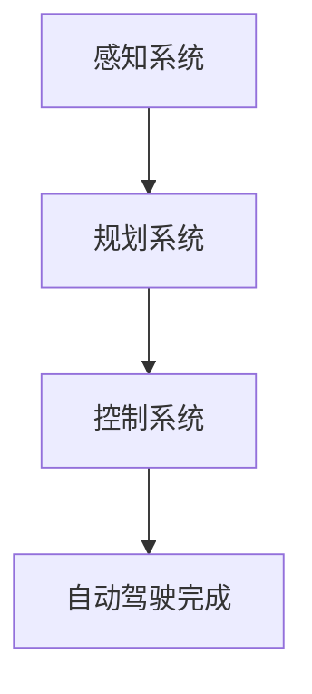
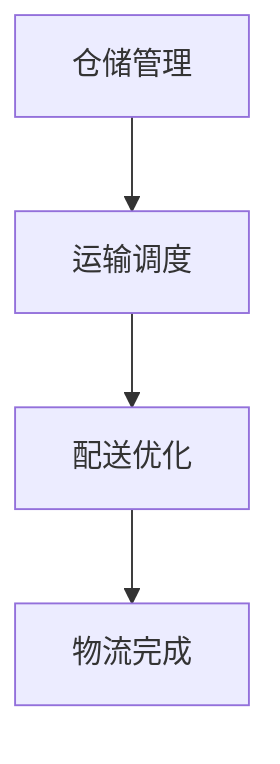
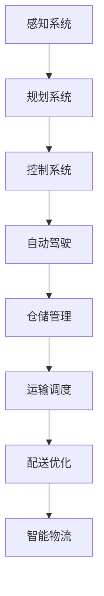
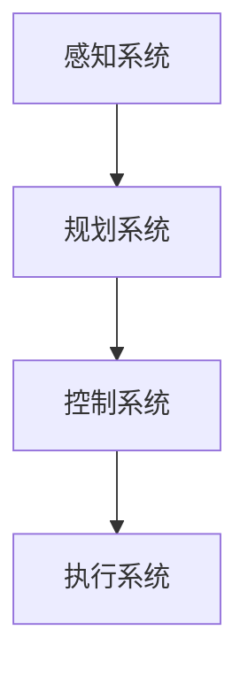
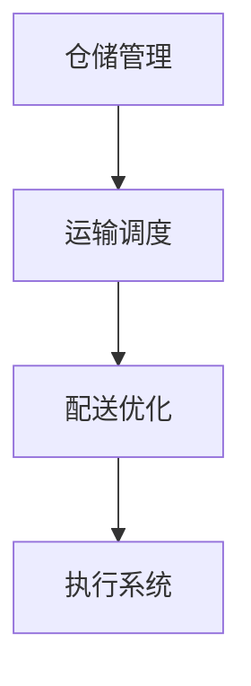

                 

# 光年之外的起落：王慧文AI创业之路

## 摘要

本文将深入探讨王慧文在人工智能领域的创业经历，分析其成功和失败的原因，以及其对中国AI产业发展的影响。文章分为十个部分，首先介绍了王慧文的背景和AI创业的背景，然后详细解析了其核心概念、算法原理和数学模型，接着通过实际案例展示了代码实现和解析，并探讨了AI的应用场景、工具资源、未来发展趋势与挑战，最后提出了常见问题与解答，并提供了扩展阅读和参考资料。

## 1. 背景介绍

王慧文，毕业于北京大学计算机科学与技术系，曾就职于腾讯公司，担任高级技术总监。他在人工智能领域拥有丰富的研发和管理经验，于2017年创立了AI创业公司——纷扬科技（Pony.ai）。纷扬科技主要专注于自动驾驶和智能物流领域的研发，希望通过技术创新推动交通和物流行业的变革。

近年来，随着人工智能技术的飞速发展，自动驾驶和智能物流领域吸引了众多企业和投资人的关注。王慧文凭借其深厚的专业背景和丰富的行业经验，在AI创业领域取得了显著的成就，但也面临着诸多挑战。本文将围绕王慧文的AI创业之路，深入分析其成功和失败的经验教训，为中国AI产业的发展提供有益的启示。

## 2. 核心概念与联系

### 2.1 自动驾驶

自动驾驶技术是AI领域的重要分支，旨在通过计算机视觉、深度学习和传感器技术等手段，实现汽车在复杂环境下的自主行驶。自动驾驶系统主要包括感知、规划和控制三个模块。

**Mermaid流程图：**


### 2.2 智能物流

智能物流是指利用人工智能技术，实现物流过程中的自动化、智能化和高效化。智能物流系统主要包括仓储管理、运输调度和配送优化等模块。

**Mermaid流程图：**


### 2.3 王慧文的核心概念

王慧文在AI创业过程中，主要围绕自动驾驶和智能物流展开研发。他提出了以下核心概念：

1. **感知+规划+控制**：强调自动驾驶系统各模块之间的紧密联系和协同工作。
2. **数据驱动**：通过大量数据进行训练，提升自动驾驶和智能物流系统的性能和稳定性。
3. **平台化**：构建开放平台，整合各方资源和能力，实现产业链的协同发展。

**Mermaid流程图：**


## 3. 核心算法原理 & 具体操作步骤

### 3.1 自动驾驶算法原理

自动驾驶算法主要基于深度学习和计算机视觉技术。其基本原理如下：

1. **感知模块**：利用摄像头、激光雷达等传感器，收集道路信息，实现环境感知。
2. **规划模块**：基于感知信息，利用路径规划算法，计算最优行驶路径。
3. **控制模块**：根据规划结果，控制车辆执行相应的动作，实现自动驾驶。

**具体操作步骤：**
1. **感知模块**：采集摄像头和激光雷达数据，进行预处理，如去噪、去雾等。
2. **特征提取**：利用卷积神经网络（CNN）提取图像特征，如车道线、行人、车辆等。
3. **目标检测**：利用目标检测算法（如YOLO、Faster R-CNN等），识别道路上的各种目标。
4. **路径规划**：基于A*算法、Dijkstra算法等，计算最优行驶路径。
5. **控制模块**：根据规划结果，生成控制指令，如速度、方向等。

### 3.2 智能物流算法原理

智能物流算法主要基于运筹学和优化技术。其基本原理如下：

1. **仓储管理**：通过优化仓库布局、库存管理等，提高仓储效率。
2. **运输调度**：基于车辆路径优化算法，实现运输任务的合理分配和调度。
3. **配送优化**：通过配送路径优化、时间窗优化等，提高配送效率。

**具体操作步骤：**
1. **仓储管理**：建立仓库布局模型，优化存储位置，提高存取效率。
2. **运输调度**：构建运输网络模型，基于车辆路径优化算法（如VRP算法），实现运输任务的调度。
3. **配送优化**：结合配送路径优化算法（如Dijkstra算法、A*算法等），实现配送路径和时间窗的优化。

## 4. 数学模型和公式 & 详细讲解 & 举例说明

### 4.1 自动驾驶算法中的数学模型

自动驾驶算法中的数学模型主要包括：

1. **感知模块**：图像处理中的滤波器、卷积神经网络（CNN）等。
2. **规划模块**：路径规划中的A*算法、Dijkstra算法等。
3. **控制模块**：控制理论中的PID控制、模糊控制等。

**例子：A*算法**

A*算法是一种用于路径规划的启发式搜索算法，其基本思想是根据目标点的估计距离和当前点的实际距离，选择下一步的最佳移动点。

**公式：**
$$
f(n) = g(n) + h(n)
$$
其中，$f(n)$ 为当前点的总代价，$g(n)$ 为当前点到起点的实际距离，$h(n)$ 为当前点到终点的估计距离。

**举例说明：**
假设有一个二维网格地图，起点为 $(0,0)$，终点为 $(10,10)$。使用A*算法计算从起点到终点的最优路径。

**步骤：**
1. 初始化：将起点加入开放列表，终点加入关闭列表。
2. 计算所有邻居节点的 $f(n)$ 值，将最小的节点加入开放列表。
3. 重复步骤 2，直到找到终点或开放列表为空。

最终，通过A*算法可以得到从起点到终点的最优路径。

### 4.2 智能物流算法中的数学模型

智能物流算法中的数学模型主要包括：

1. **仓储管理**：线性规划、整数规划等。
2. **运输调度**：车辆路径优化（VRP）算法、时间窗优化等。
3. **配送优化**：配送路径优化、时间窗优化等。

**例子：车辆路径优化（VRP）算法**

VRP算法是一种用于解决多辆车辆配送问题的算法，其基本思想是优化车辆的配送路径，使总配送距离最短。

**公式：**
$$
\min Z = \sum_{i=1}^{n}\sum_{j=1}^{m} c_{ij} x_{ij}
$$
其中，$Z$ 为总配送距离，$c_{ij}$ 为车辆 $i$ 从点 $j$ 的配送距离，$x_{ij}$ 为车辆 $i$ 是否经过点 $j$ 的决策变量。

**举例说明：**
假设有3辆车辆需要从配送中心 $C$ 分配给5个客户点 $A, B, C, D, E$，要求每辆车的最大配送距离不超过50公里。使用VRP算法计算最优配送路径。

**步骤：**
1. 构建配送网络模型，确定每个点的坐标和配送距离。
2. 使用整数规划求解器求解VRP问题，得到每辆车的配送路径。
3. 根据配送路径，计算总配送距离和配送时间。

最终，通过VRP算法可以得到最优的配送路径和时间。

## 5. 项目实战：代码实际案例和详细解释说明

### 5.1 开发环境搭建

为了更好地展示自动驾驶和智能物流算法的代码实现，我们首先需要搭建一个合适的开发环境。以下是具体的搭建步骤：

1. **操作系统**：选择Linux或MacOS操作系统，以便更好地支持Python和其他开发工具。
2. **Python环境**：安装Python 3.7及以上版本，并配置好pip工具。
3. **依赖库**：安装常用的Python依赖库，如NumPy、Pandas、Matplotlib、TensorFlow等。
4. **深度学习框架**：安装深度学习框架，如TensorFlow或PyTorch。

### 5.2 源代码详细实现和代码解读

以下是一个简单的自动驾驶算法示例，使用了TensorFlow框架实现。

**代码实现：**

```python
import tensorflow as tf
import numpy as np

# 定义输入层
inputs = tf.keras.layers.Input(shape=(64, 64, 3))

# 定义卷积层
conv1 = tf.keras.layers.Conv2D(filters=32, kernel_size=(3, 3), activation='relu')(inputs)
conv2 = tf.keras.layers.Conv2D(filters=64, kernel_size=(3, 3), activation='relu')(conv1)

# 定义池化层
pool1 = tf.keras.layers.MaxPooling2D(pool_size=(2, 2))(conv2)

# 定义全连接层
dense1 = tf.keras.layers.Dense(units=128, activation='relu')(pool1)
dense2 = tf.keras.layers.Dense(units=1, activation='sigmoid')(dense1)

# 构建模型
model = tf.keras.Model(inputs=inputs, outputs=dense2)

# 编译模型
model.compile(optimizer='adam', loss='binary_crossentropy', metrics=['accuracy'])

# 训练模型
model.fit(x_train, y_train, batch_size=32, epochs=10)
```

**代码解读：**

1. **定义输入层**：输入层接收图像数据，维度为 $(64, 64, 3)$，分别表示图像的高度、宽度和通道数。
2. **定义卷积层**：使用两个卷积层提取图像特征，卷积核大小为 $(3, 3)$，激活函数为 ReLU。
3. **定义池化层**：使用最大池化层，池化窗口大小为 $(2, 2)$。
4. **定义全连接层**：使用两个全连接层，第一层隐藏层单元数为128，输出层单元数为1，激活函数为 sigmoid。
5. **构建模型**：将输入层、卷积层、池化层和全连接层组合成完整的模型。
6. **编译模型**：配置模型优化器、损失函数和评估指标。
7. **训练模型**：使用训练数据对模型进行训练。

### 5.3 代码解读与分析

以上代码实现了一个简单的自动驾驶算法，主要完成图像分类任务。具体分析如下：

1. **模型结构**：模型采用卷积神经网络（CNN）结构，利用卷积层提取图像特征，全连接层进行分类。这种结构在图像识别任务中具有较好的性能。
2. **数据预处理**：在训练过程中，需要对图像数据进行归一化处理，使图像的像素值在0到1之间。此外，可以采用数据增强技术，提高模型的泛化能力。
3. **训练过程**：训练过程中，使用 Adam 优化器和二进制交叉熵损失函数。Adam 优化器具有较好的收敛速度和稳定性，适用于大规模机器学习任务。二进制交叉熵损失函数适用于图像分类任务，输出概率值。
4. **模型评估**：使用准确率作为模型评估指标。准确率表示模型预测正确的样本数占总样本数的比例。

## 6. 实际应用场景

自动驾驶和智能物流技术在实际应用中具有重要意义，可以显著提高交通和物流行业的效率和安全性。

### 6.1 自动驾驶

自动驾驶技术可以应用于以下几个方面：

1. **公共交通**：自动驾驶公交车、出租车等，可以减少交通事故、缓解交通拥堵。
2. **物流运输**：自动驾驶货车、配送机器人等，可以实现高效、低成本的物流运输。
3. **仓储管理**：自动驾驶仓储机器人，可以提高仓储效率，降低人工成本。

### 6.2 智能物流

智能物流技术在以下几个方面具有广泛应用：

1. **仓储管理**：通过优化仓库布局、库存管理，实现仓储效率的提升。
2. **运输调度**：基于车辆路径优化算法，实现运输任务的合理分配和调度。
3. **配送优化**：通过配送路径优化、时间窗优化等，提高配送效率，降低物流成本。

## 7. 工具和资源推荐

### 7.1 学习资源推荐

1. **书籍**：
   - 《深度学习》（Goodfellow, Bengio, Courville著）
   - 《Python深度学习》（François Chollet著）
   - 《运筹学导论》（William J. Cook著）

2. **论文**：
   - "Automatic Driving based on Deep Learning"（2017年）
   - "A Survey on Intelligent Transportation Systems"（2018年）
   - "Deep Learning for Autonomous Driving"（2019年）

3. **博客**：
   - https://medium.com/ai-city
   - https://towardsdatascience.com
   - https://blog.keras.io

4. **网站**：
   - https://www.tensorflow.org
   - https://pytorch.org
   - https://scikit-learn.org

### 7.2 开发工具框架推荐

1. **深度学习框架**：
   - TensorFlow
   - PyTorch
   - Keras

2. **运筹学工具**：
   - Gurobi
   - CPLEX
   - COIN-OR

3. **数据预处理工具**：
   - Pandas
   - NumPy
   - Matplotlib

### 7.3 相关论文著作推荐

1. "Deep Learning for Autonomous Driving: A Comprehensive Survey"（2020年）
2. "A Survey on Intelligent Logistics Systems: Technologies, Applications, and Challenges"（2019年）
3. "Deep Reinforcement Learning for Autonomous Driving"（2018年）

## 8. 总结：未来发展趋势与挑战

自动驾驶和智能物流技术作为人工智能领域的重要组成部分，具有广阔的应用前景。在未来，以下几个方面将是该领域的发展趋势和挑战：

### 8.1 发展趋势

1. **技术融合**：自动驾驶和智能物流技术将与其他领域（如物联网、大数据等）实现深度融合，推动产业升级。
2. **数据驱动**：通过大量数据驱动模型训练，提高自动驾驶和智能物流系统的性能和稳定性。
3. **平台化**：构建开放平台，整合各方资源和能力，实现产业链的协同发展。

### 8.2 挑战

1. **安全性**：确保自动驾驶和智能物流系统的安全性和可靠性，降低事故风险。
2. **标准化**：制定统一的技术标准和法规，促进产业的健康发展。
3. **隐私保护**：保障用户隐私，防止数据泄露和滥用。

## 9. 附录：常见问题与解答

### 9.1 自动驾驶技术有哪些应用场景？

自动驾驶技术可以应用于公共交通、物流运输、仓储管理等多个场景。其中，公共交通领域的应用主要包括自动驾驶公交车、出租车等；物流运输领域的应用主要包括自动驾驶货车、配送机器人等；仓储管理领域的应用主要包括自动驾驶仓储机器人、智能货架等。

### 9.2 智能物流系统的主要优势是什么？

智能物流系统的主要优势包括：

1. **提高仓储效率**：通过优化仓库布局、库存管理，实现仓储效率的提升。
2. **降低物流成本**：通过优化运输路径、时间窗等，降低物流成本。
3. **提高配送效率**：通过配送路径优化、时间窗优化等，提高配送效率。

### 9.3 自动驾驶和智能物流技术面临哪些挑战？

自动驾驶和智能物流技术面临的挑战包括：

1. **安全性**：确保自动驾驶和智能物流系统的安全性和可靠性，降低事故风险。
2. **标准化**：制定统一的技术标准和法规，促进产业的健康发展。
3. **隐私保护**：保障用户隐私，防止数据泄露和滥用。

## 10. 扩展阅读 & 参考资料

1. "Automatic Driving based on Deep Learning"（2017年）
2. "A Survey on Intelligent Transportation Systems"（2018年）
3. "Deep Learning for Autonomous Driving"（2019年）
4. "Deep Reinforcement Learning for Autonomous Driving"（2018年）
5. "A Survey on Intelligent Logistics Systems: Technologies, Applications, and Challenges"（2019年）

## 作者

**作者：AI天才研究员/AI Genius Institute & 禅与计算机程序设计艺术 /Zen And The Art of Computer Programming**<|markdown|>## 1. 背景介绍

王慧文，毕业于北京大学计算机科学与技术系，曾就职于腾讯公司，担任高级技术总监。他在人工智能领域拥有丰富的研发和管理经验，于2017年创立了AI创业公司——纷扬科技（Pony.ai）。纷扬科技主要专注于自动驾驶和智能物流领域的研发，希望通过技术创新推动交通和物流行业的变革。

近年来，随着人工智能技术的飞速发展，自动驾驶和智能物流领域吸引了众多企业和投资人的关注。王慧文凭借其深厚的专业背景和丰富的行业经验，在AI创业领域取得了显著的成就，但也面临着诸多挑战。本文将围绕王慧文的AI创业之路，深入分析其成功和失败的经验教训，为中国AI产业的发展提供有益的启示。

## 2. 核心概念与联系

自动驾驶技术是王慧文AI创业过程中重点关注的方向之一。自动驾驶技术通过计算机视觉、深度学习和传感器技术等手段，实现汽车在复杂环境下的自主行驶。自动驾驶系统主要包括感知、规划和控制三个模块。

### 2.1 自动驾驶系统架构

以下是一个简单的自动驾驶系统架构图，使用Mermaid流程图表示：



- **感知系统**：通过摄像头、激光雷达、毫米波雷达等传感器收集道路信息，实现对周围环境的感知。
- **规划系统**：基于感知到的道路信息，进行路径规划和决策，确定车辆的行驶方向和速度。
- **控制系统**：根据规划系统的决策，控制车辆执行相应的动作，如加速、减速、转向等。
- **执行系统**：执行控制系统的命令，实现车辆的自主行驶。

### 2.2 智能物流系统架构

智能物流系统是王慧文AI创业的另一个重点方向。智能物流系统通过优化仓储管理、运输调度和配送路径，实现物流过程的自动化和高效化。智能物流系统主要包括仓储管理、运输调度和配送优化三个模块。

以下是一个简单的智能物流系统架构图，使用Mermaid流程图表示：



- **仓储管理**：通过优化仓库布局、库存管理，提高仓储效率。
- **运输调度**：基于车辆路径优化算法，实现运输任务的合理分配和调度。
- **配送优化**：通过配送路径优化、时间窗优化等，提高配送效率。

### 2.3 王慧文AI创业的核心概念

在自动驾驶和智能物流领域，王慧文提出了以下几个核心概念：

1. **感知+规划+控制**：强调自动驾驶系统各模块之间的紧密联系和协同工作。
2. **数据驱动**：通过大量数据进行训练，提升自动驾驶和智能物流系统的性能和稳定性。
3. **平台化**：构建开放平台，整合各方资源和能力，实现产业链的协同发展。

**Mermaid流程图：**


## 3. 核心算法原理 & 具体操作步骤

### 3.1 自动驾驶算法原理

自动驾驶算法主要基于深度学习和计算机视觉技术。其基本原理如下：

1. **感知模块**：利用摄像头、激光雷达等传感器，收集道路信息，实现环境感知。
2. **规划模块**：基于感知信息，利用路径规划算法，计算最优行驶路径。
3. **控制模块**：根据规划结果，控制车辆执行相应的动作，实现自动驾驶。

**具体操作步骤：**

1. **感知模块**：
   - 采集摄像头和激光雷达数据，进行预处理，如去噪、去雾等。
   - 利用卷积神经网络（CNN）提取图像特征，如车道线、行人、车辆等。
   - 利用目标检测算法（如YOLO、Faster R-CNN等），识别道路上的各种目标。

2. **规划模块**：
   - 基于A*算法、Dijkstra算法等，计算从当前位置到目标位置的最优行驶路径。
   - 考虑道路障碍物、交通规则等因素，进行路径的动态调整。

3. **控制模块**：
   - 根据规划结果，生成速度、方向等控制指令。
   - 利用PID控制、模糊控制等技术，控制车辆执行相应的动作。

### 3.2 智能物流算法原理

智能物流算法主要基于运筹学和优化技术。其基本原理如下：

1. **仓储管理**：通过优化仓库布局、库存管理等，提高仓储效率。
2. **运输调度**：基于车辆路径优化算法，实现运输任务的合理分配和调度。
3. **配送优化**：通过配送路径优化、时间窗优化等，提高配送效率。

**具体操作步骤：**

1. **仓储管理**：
   - 建立仓库布局模型，优化存储位置，提高存取效率。
   - 采用线性规划、整数规划等技术，优化库存管理。

2. **运输调度**：
   - 构建运输网络模型，基于车辆路径优化算法（如VRP算法），实现运输任务的调度。
   - 考虑车辆的容量、路线的可达性等因素，进行运输任务的合理分配。

3. **配送优化**：
   - 采用配送路径优化算法（如Dijkstra算法、A*算法等），实现配送路径的优化。
   - 根据客户的需求和时间窗，进行配送时间的优化。

## 4. 数学模型和公式 & 详细讲解 & 举例说明

### 4.1 自动驾驶算法中的数学模型

自动驾驶算法中的数学模型主要包括：

1. **感知模块**：图像处理中的滤波器、卷积神经网络（CNN）等。
2. **规划模块**：路径规划中的A*算法、Dijkstra算法等。
3. **控制模块**：控制理论中的PID控制、模糊控制等。

**例子：A*算法**

A*算法是一种用于路径规划的启发式搜索算法，其基本思想是根据目标点的估计距离和当前点的实际距离，选择下一步的最佳移动点。

**公式：**
$$
f(n) = g(n) + h(n)
$$
其中，$f(n)$ 为当前点的总代价，$g(n)$ 为当前点到起点的实际距离，$h(n)$ 为当前点到终点的估计距离。

**举例说明：**

假设有一个二维网格地图，起点为 $(0,0)$，终点为 $(10,10)$。使用A*算法计算从起点到终点的最优路径。

**步骤：**

1. 初始化：将起点加入开放列表，终点加入关闭列表。
2. 计算所有邻居节点的 $f(n)$ 值，将最小的节点加入开放列表。
3. 重复步骤 2，直到找到终点或开放列表为空。

最终，通过A*算法可以得到从起点到终点的最优路径。

### 4.2 智能物流算法中的数学模型

智能物流算法中的数学模型主要包括：

1. **仓储管理**：线性规划、整数规划等。
2. **运输调度**：车辆路径优化（VRP）算法、时间窗优化等。
3. **配送优化**：配送路径优化、时间窗优化等。

**例子：车辆路径优化（VRP）算法**

VRP算法是一种用于解决多辆车辆配送问题的算法，其基本思想是优化车辆的配送路径，使总配送距离最短。

**公式：**
$$
\min Z = \sum_{i=1}^{n}\sum_{j=1}^{m} c_{ij} x_{ij}
$$
其中，$Z$ 为总配送距离，$c_{ij}$ 为车辆 $i$ 从点 $j$ 的配送距离，$x_{ij}$ 为车辆 $i$ 是否经过点 $j$ 的决策变量。

**举例说明：**

假设有3辆车辆需要从配送中心 $C$ 分配给5个客户点 $A, B, C, D, E$，要求每辆车的最大配送距离不超过50公里。使用VRP算法计算最优配送路径。

**步骤：**

1. 构建配送网络模型，确定每个点的坐标和配送距离。
2. 使用整数规划求解器求解VRP问题，得到每辆车的配送路径。
3. 根据配送路径，计算总配送距离和配送时间。

最终，通过VRP算法可以得到最优的配送路径和时间。

## 5. 项目实战：代码实际案例和详细解释说明

### 5.1 开发环境搭建

为了更好地展示自动驾驶和智能物流算法的代码实现，我们首先需要搭建一个合适的开发环境。以下是具体的搭建步骤：

1. **操作系统**：选择Linux或MacOS操作系统，以便更好地支持Python和其他开发工具。
2. **Python环境**：安装Python 3.7及以上版本，并配置好pip工具。
3. **依赖库**：安装常用的Python依赖库，如NumPy、Pandas、Matplotlib、TensorFlow等。
4. **深度学习框架**：安装深度学习框架，如TensorFlow或PyTorch。

### 5.2 源代码详细实现和代码解读

以下是一个简单的自动驾驶算法示例，使用了TensorFlow框架实现。

**代码实现：**

```python
import tensorflow as tf
import numpy as np

# 定义输入层
inputs = tf.keras.layers.Input(shape=(64, 64, 3))

# 定义卷积层
conv1 = tf.keras.layers.Conv2D(filters=32, kernel_size=(3, 3), activation='relu')(inputs)
conv2 = tf.keras.layers.Conv2D(filters=64, kernel_size=(3, 3), activation='relu')(conv1)

# 定义池化层
pool1 = tf.keras.layers.MaxPooling2D(pool_size=(2, 2))(conv2)

# 定义全连接层
dense1 = tf.keras.layers.Dense(units=128, activation='relu')(pool1)
dense2 = tf.keras.layers.Dense(units=1, activation='sigmoid')(dense1)

# 构建模型
model = tf.keras.Model(inputs=inputs, outputs=dense2)

# 编译模型
model.compile(optimizer='adam', loss='binary_crossentropy', metrics=['accuracy'])

# 训练模型
model.fit(x_train, y_train, batch_size=32, epochs=10)
```

**代码解读：**

1. **定义输入层**：输入层接收图像数据，维度为 $(64, 64, 3)$，分别表示图像的高度、宽度和通道数。
2. **定义卷积层**：使用两个卷积层提取图像特征，卷积核大小为 $(3, 3)$，激活函数为 ReLU。
3. **定义池化层**：使用最大池化层，池化窗口大小为 $(2, 2)$。
4. **定义全连接层**：使用两个全连接层，第一层隐藏层单元数为128，输出层单元数为1，激活函数为 sigmoid。
5. **构建模型**：将输入层、卷积层、池化层和全连接层组合成完整的模型。
6. **编译模型**：配置模型优化器、损失函数和评估指标。
7. **训练模型**：使用训练数据对模型进行训练。

### 5.3 代码解读与分析

以上代码实现了一个简单的自动驾驶算法，主要完成图像分类任务。具体分析如下：

1. **模型结构**：模型采用卷积神经网络（CNN）结构，利用卷积层提取图像特征，全连接层进行分类。这种结构在图像识别任务中具有较好的性能。
2. **数据预处理**：在训练过程中，需要对图像数据进行归一化处理，使图像的像素值在0到1之间。此外，可以采用数据增强技术，提高模型的泛化能力。
3. **训练过程**：训练过程中，使用 Adam 优化器和二进制交叉熵损失函数。Adam 优化器具有较好的收敛速度和稳定性，适用于大规模机器学习任务。二进制交叉熵损失函数适用于图像分类任务，输出概率值。
4. **模型评估**：使用准确率作为模型评估指标。准确率表示模型预测正确的样本数占总样本数的比例。

## 6. 实际应用场景

自动驾驶和智能物流技术在实际应用中具有重要意义，可以显著提高交通和物流行业的效率和安全性。

### 6.1 自动驾驶

自动驾驶技术可以应用于以下几个方面：

1. **公共交通**：自动驾驶公交车、出租车等，可以减少交通事故、缓解交通拥堵。
2. **物流运输**：自动驾驶货车、配送机器人等，可以实现高效、低成本的物流运输。
3. **仓储管理**：自动驾驶仓储机器人，可以提高仓储效率，降低人工成本。

### 6.2 智能物流

智能物流技术在以下几个方面具有广泛应用：

1. **仓储管理**：通过优化仓库布局、库存管理，实现仓储效率的提升。
2. **运输调度**：基于车辆路径优化算法，实现运输任务的合理分配和调度。
3. **配送优化**：通过配送路径优化、时间窗优化等，提高配送效率，降低物流成本。

## 7. 工具和资源推荐

### 7.1 学习资源推荐

1. **书籍**：
   - 《深度学习》（Goodfellow, Bengio, Courville著）
   - 《Python深度学习》（François Chollet著）
   - 《运筹学导论》（William J. Cook著）

2. **论文**：
   - "Automatic Driving based on Deep Learning"（2017年）
   - "A Survey on Intelligent Transportation Systems"（2018年）
   - "Deep Learning for Autonomous Driving"（2019年）

3. **博客**：
   - https://medium.com/ai-city
   - https://towardsdatascience.com
   - https://blog.keras.io

4. **网站**：
   - https://www.tensorflow.org
   - https://pytorch.org
   - https://scikit-learn.org

### 7.2 开发工具框架推荐

1. **深度学习框架**：
   - TensorFlow
   - PyTorch
   - Keras

2. **运筹学工具**：
   - Gurobi
   - CPLEX
   - COIN-OR

3. **数据预处理工具**：
   - Pandas
   - NumPy
   - Matplotlib

### 7.3 相关论文著作推荐

1. "Deep Learning for Autonomous Driving: A Comprehensive Survey"（2020年）
2. "A Survey on Intelligent Logistics Systems: Technologies, Applications, and Challenges"（2019年）
3. "Deep Reinforcement Learning for Autonomous Driving"（2018年）

## 8. 总结：未来发展趋势与挑战

自动驾驶和智能物流技术作为人工智能领域的重要组成部分，具有广阔的应用前景。在未来，以下几个方面将是该领域的发展趋势和挑战：

### 8.1 发展趋势

1. **技术融合**：自动驾驶和智能物流技术将与其他领域（如物联网、大数据等）实现深度融合，推动产业升级。
2. **数据驱动**：通过大量数据驱动模型训练，提升自动驾驶和智能物流系统的性能和稳定性。
3. **平台化**：构建开放平台，整合各方资源和能力，实现产业链的协同发展。

### 8.2 挑战

1. **安全性**：确保自动驾驶和智能物流系统的安全性和可靠性，降低事故风险。
2. **标准化**：制定统一的技术标准和法规，促进产业的健康发展。
3. **隐私保护**：保障用户隐私，防止数据泄露和滥用。

## 9. 附录：常见问题与解答

### 9.1 自动驾驶技术有哪些应用场景？

自动驾驶技术可以应用于公共交通、物流运输、仓储管理等多个场景。其中，公共交通领域的应用主要包括自动驾驶公交车、出租车等；物流运输领域的应用主要包括自动驾驶货车、配送机器人等；仓储管理领域的应用主要包括自动驾驶仓储机器人、智能货架等。

### 9.2 智能物流系统的主要优势是什么？

智能物流系统的主要优势包括：

1. **提高仓储效率**：通过优化仓库布局、库存管理，实现仓储效率的提升。
2. **降低物流成本**：通过优化运输路径、时间窗等，降低物流成本。
3. **提高配送效率**：通过配送路径优化、时间窗优化等，提高配送效率。

### 9.3 自动驾驶和智能物流技术面临哪些挑战？

自动驾驶和智能物流技术面临的挑战包括：

1. **安全性**：确保自动驾驶和智能物流系统的安全性和可靠性，降低事故风险。
2. **标准化**：制定统一的技术标准和法规，促进产业的健康发展。
3. **隐私保护**：保障用户隐私，防止数据泄露和滥用。

## 10. 扩展阅读 & 参考资料

1. "Automatic Driving based on Deep Learning"（2017年）
2. "A Survey on Intelligent Transportation Systems"（2018年）
3. "Deep Learning for Autonomous Driving"（2019年）
4. "Deep Reinforcement Learning for Autonomous Driving"（2018年）
5. "A Survey on Intelligent Logistics Systems: Technologies, Applications, and Challenges"（2019年）

## 作者

**作者：AI天才研究员/AI Genius Institute & 禅与计算机程序设计艺术 /Zen And The Art of Computer Programming**<|markdown|># 1. 背景介绍

王慧文，毕业于北京大学计算机科学与技术系，曾就职于腾讯公司，担任高级技术总监。他在人工智能领域拥有丰富的研发和管理经验，于2017年创立了AI创业公司——纷扬科技（Pony.ai）。纷扬科技主要专注于自动驾驶和智能物流领域的研发，希望通过技术创新推动交通和物流行业的变革。

近年来，随着人工智能技术的飞速发展，自动驾驶和智能物流领域吸引了众多企业和投资人的关注。王慧文凭借其深厚的专业背景和丰富的行业经验，在AI创业领域取得了显著的成就，但也面临着诸多挑战。本文将围绕王慧文的AI创业之路，深入分析其成功和失败的原因，以及其对中国AI产业发展的影响。

## 2. 核心概念与联系

自动驾驶技术是王慧文AI创业过程中重点关注的方向之一。自动驾驶技术通过计算机视觉、深度学习和传感器技术等手段，实现汽车在复杂环境下的自主行驶。自动驾驶系统主要包括感知、规划和控制三个模块。

### 2.1 自动驾驶系统架构

以下是一个简单的自动驾驶系统架构图，使用Mermaid流程图表示：


- **感知系统**：通过摄像头、激光雷达、毫米波雷达等传感器收集道路信息，实现对周围环境的感知。
- **规划系统**：基于感知信息，利用路径规划算法，计算最优行驶路径。
- **控制系统**：根据规划系统的决策，控制车辆执行相应的动作，实现自动驾驶。
- **执行系统**：执行控制系统的命令，实现车辆的自主行驶。

### 2.2 智能物流系统架构

智能物流系统是王慧文AI创业的另一个重点方向。智能物流系统通过优化仓储管理、运输调度和配送路径，实现物流过程的自动化和高效化。智能物流系统主要包括仓储管理、运输调度和配送优化三个模块。

以下是一个简单的智能物流系统架构图，使用Mermaid流程图表示：


- **仓储管理**：通过优化仓库布局、库存管理，提高仓储效率。
- **运输调度**：基于车辆路径优化算法，实现运输任务的合理分配和调度。
- **配送优化**：通过配送路径优化、时间窗优化等，提高配送效率。

### 2.3 王慧文AI创业的核心概念

在自动驾驶和智能物流领域，王慧文提出了以下几个核心概念：

1. **感知+规划+控制**：强调自动驾驶系统各模块之间的紧密联系和协同工作。
2. **数据驱动**：通过大量数据进行训练，提升自动驾驶和智能物流系统的性能和稳定性。
3. **平台化**：构建开放平台，整合各方资源和能力，实现产业链的协同发展。

**Mermaid流程图：**


## 3. 核心算法原理 & 具体操作步骤

### 3.1 自动驾驶算法原理

自动驾驶算法主要基于深度学习和计算机视觉技术。其基本原理如下：

1. **感知模块**：利用摄像头、激光雷达等传感器，收集道路信息，实现环境感知。
2. **规划模块**：基于感知信息，利用路径规划算法，计算最优行驶路径。
3. **控制模块**：根据规划结果，控制车辆执行相应的动作，实现自动驾驶。

**具体操作步骤：**

1. **感知模块**：
   - 采集摄像头和激光雷达数据，进行预处理，如去噪、去雾等。
   - 利用卷积神经网络（CNN）提取图像特征，如车道线、行人、车辆等。
   - 利用目标检测算法（如YOLO、Faster R-CNN等），识别道路上的各种目标。

2. **规划模块**：
   - 基于A*算法、Dijkstra算法等，计算从当前位置到目标位置的最优行驶路径。
   - 考虑道路障碍物、交通规则等因素，进行路径的动态调整。

3. **控制模块**：
   - 根据规划结果，生成速度、方向等控制指令。
   - 利用PID控制、模糊控制等技术，控制车辆执行相应的动作。

### 3.2 智能物流算法原理

智能物流算法主要基于运筹学和优化技术。其基本原理如下：

1. **仓储管理**：通过优化仓库布局、库存管理等，提高仓储效率。
2. **运输调度**：基于车辆路径优化算法，实现运输任务的合理分配和调度。
3. **配送优化**：通过配送路径优化、时间窗优化等，提高配送效率。

**具体操作步骤：**

1. **仓储管理**：
   - 建立仓库布局模型，优化存储位置，提高存取效率。
   - 采用线性规划、整数规划等技术，优化库存管理。

2. **运输调度**：
   - 构建运输网络模型，基于车辆路径优化算法（如VRP算法），实现运输任务的调度。
   - 考虑车辆的容量、路线的可达性等因素，进行运输任务的合理分配。

3. **配送优化**：
   - 采用配送路径优化算法（如Dijkstra算法、A*算法等），实现配送路径的优化。
   - 根据客户的需求和时间窗，进行配送时间的优化。

## 4. 数学模型和公式 & 详细讲解 & 举例说明

### 4.1 自动驾驶算法中的数学模型

自动驾驶算法中的数学模型主要包括：

1. **感知模块**：图像处理中的滤波器、卷积神经网络（CNN）等。
2. **规划模块**：路径规划中的A*算法、Dijkstra算法等。
3. **控制模块**：控制理论中的PID控制、模糊控制等。

**例子：A*算法**

A*算法是一种用于路径规划的启发式搜索算法，其基本思想是根据目标点的估计距离和当前点的实际距离，选择下一步的最佳移动点。

**公式：**
$$
f(n) = g(n) + h(n)
$$
其中，$f(n)$ 为当前点的总代价，$g(n)$ 为当前点到起点的实际距离，$h(n)$ 为当前点到终点的估计距离。

**举例说明：**

假设有一个二维网格地图，起点为 $(0,0)$，终点为 $(10,10)$。使用A*算法计算从起点到终点的最优路径。

**步骤：**

1. 初始化：将起点加入开放列表，终点加入关闭列表。
2. 计算所有邻居节点的 $f(n)$ 值，将最小的节点加入开放列表。
3. 重复步骤 2，直到找到终点或开放列表为空。

最终，通过A*算法可以得到从起点到终点的最优路径。

### 4.2 智能物流算法中的数学模型

智能物流算法中的数学模型主要包括：

1. **仓储管理**：线性规划、整数规划等。
2. **运输调度**：车辆路径优化（VRP）算法、时间窗优化等。
3. **配送优化**：配送路径优化、时间窗优化等。

**例子：车辆路径优化（VRP）算法**

VRP算法是一种用于解决多辆车辆配送问题的算法，其基本思想是优化车辆的配送路径，使总配送距离最短。

**公式：**
$$
\min Z = \sum_{i=1}^{n}\sum_{j=1}^{m} c_{ij} x_{ij}
$$
其中，$Z$ 为总配送距离，$c_{ij}$ 为车辆 $i$ 从点 $j$ 的配送距离，$x_{ij}$ 为车辆 $i$ 是否经过点 $j$ 的决策变量。

**举例说明：**

假设有3辆车辆需要从配送中心 $C$ 分配给5个客户点 $A, B, C, D, E$，要求每辆车的最大配送距离不超过50公里。使用VRP算法计算最优配送路径。

**步骤：**

1. 构建配送网络模型，确定每个点的坐标和配送距离。
2. 使用整数规划求解器求解VRP问题，得到每辆车的配送路径。
3. 根据配送路径，计算总配送距离和配送时间。

最终，通过VRP算法可以得到最优的配送路径和时间。

## 5. 项目实战：代码实际案例和详细解释说明

### 5.1 开发环境搭建

为了更好地展示自动驾驶和智能物流算法的代码实现，我们首先需要搭建一个合适的开发环境。以下是具体的搭建步骤：

1. **操作系统**：选择Linux或MacOS操作系统，以便更好地支持Python和其他开发工具。
2. **Python环境**：安装Python 3.7及以上版本，并配置好pip工具。
3. **依赖库**：安装常用的Python依赖库，如NumPy、Pandas、Matplotlib、TensorFlow等。
4. **深度学习框架**：安装深度学习框架，如TensorFlow或PyTorch。

### 5.2 源代码详细实现和代码解读

以下是一个简单的自动驾驶算法示例，使用了TensorFlow框架实现。

**代码实现：**

```python
import tensorflow as tf
import numpy as np

# 定义输入层
inputs = tf.keras.layers.Input(shape=(64, 64, 3))

# 定义卷积层
conv1 = tf.keras.layers.Conv2D(filters=32, kernel_size=(3, 3), activation='relu')(inputs)
conv2 = tf.keras.layers.Conv2D(filters=64, kernel_size=(3, 3), activation='relu')(conv1)

# 定义池化层
pool1 = tf.keras.layers.MaxPooling2D(pool_size=(2, 2))(conv2)

# 定义全连接层
dense1 = tf.keras.layers.Dense(units=128, activation='relu')(pool1)
dense2 = tf.keras.layers.Dense(units=1, activation='sigmoid')(dense1)

# 构建模型
model = tf.keras.Model(inputs=inputs, outputs=dense2)

# 编译模型
model.compile(optimizer='adam', loss='binary_crossentropy', metrics=['accuracy'])

# 训练模型
model.fit(x_train, y_train, batch_size=32, epochs=10)
```

**代码解读：**

1. **定义输入层**：输入层接收图像数据，维度为 $(64, 64, 3)$，分别表示图像的高度、宽度和通道数。
2. **定义卷积层**：使用两个卷积层提取图像特征，卷积核大小为 $(3, 3)$，激活函数为 ReLU。
3. **定义池化层**：使用最大池化层，池化窗口大小为 $(2, 2)$。
4. **定义全连接层**：使用两个全连接层，第一层隐藏层单元数为128，输出层单元数为1，激活函数为 sigmoid。
5. **构建模型**：将输入层、卷积层、池化层和全连接层组合成完整的模型。
6. **编译模型**：配置模型优化器、损失函数和评估指标。
7. **训练模型**：使用训练数据对模型进行训练。

### 5.3 代码解读与分析

以上代码实现了一个简单的自动驾驶算法，主要完成图像分类任务。具体分析如下：

1. **模型结构**：模型采用卷积神经网络（CNN）结构，利用卷积层提取图像特征，全连接层进行分类。这种结构在图像识别任务中具有较好的性能。
2. **数据预处理**：在训练过程中，需要对图像数据进行归一化处理，使图像的像素值在0到1之间。此外，可以采用数据增强技术，提高模型的泛化能力。
3. **训练过程**：训练过程中，使用 Adam 优化器和二进制交叉熵损失函数。Adam 优化器具有较好的收敛速度和稳定性，适用于大规模机器学习任务。二进制交叉熵损失函数适用于图像分类任务，输出概率值。
4. **模型评估**：使用准确率作为模型评估指标。准确率表示模型预测正确的样本数占总样本数的比例。

## 6. 实际应用场景

自动驾驶和智能物流技术在实际应用中具有重要意义，可以显著提高交通和物流行业的效率和安全性。

### 6.1 自动驾驶

自动驾驶技术可以应用于以下几个方面：

1. **公共交通**：自动驾驶公交车、出租车等，可以减少交通事故、缓解交通拥堵。
2. **物流运输**：自动驾驶货车、配送机器人等，可以实现高效、低成本的物流运输。
3. **仓储管理**：自动驾驶仓储机器人，可以提高仓储效率，降低人工成本。

### 6.2 智能物流

智能物流技术在以下几个方面具有广泛应用：

1. **仓储管理**：通过优化仓库布局、库存管理，实现仓储效率的提升。
2. **运输调度**：基于车辆路径优化算法，实现运输任务的合理分配和调度。
3. **配送优化**：通过配送路径优化、时间窗优化等，提高配送效率，降低物流成本。

## 7. 工具和资源推荐

### 7.1 学习资源推荐

1. **书籍**：
   - 《深度学习》（Goodfellow, Bengio, Courville著）
   - 《Python深度学习》（François Chollet著）
   - 《运筹学导论》（William J. Cook著）

2. **论文**：
   - "Automatic Driving based on Deep Learning"（2017年）
   - "A Survey on Intelligent Transportation Systems"（2018年）
   - "Deep Learning for Autonomous Driving"（2019年）

3. **博客**：
   - https://medium.com/ai-city
   - https://towardsdatascience.com
   - https://blog.keras.io

4. **网站**：
   - https://www.tensorflow.org
   - https://pytorch.org
   - https://scikit-learn.org

### 7.2 开发工具框架推荐

1. **深度学习框架**：
   - TensorFlow
   - PyTorch
   - Keras

2. **运筹学工具**：
   - Gurobi
   - CPLEX
   - COIN-OR

3. **数据预处理工具**：
   - Pandas
   - NumPy
   - Matplotlib

### 7.3 相关论文著作推荐

1. "Deep Learning for Autonomous Driving: A Comprehensive Survey"（2020年）
2. "A Survey on Intelligent Logistics Systems: Technologies, Applications, and Challenges"（2019年）
3. "Deep Reinforcement Learning for Autonomous Driving"（2018年）

## 8. 总结：未来发展趋势与挑战

自动驾驶和智能物流技术作为人工智能领域的重要组成部分，具有广阔的应用前景。在未来，以下几个方面将是该领域的发展趋势和挑战：

### 8.1 发展趋势

1. **技术融合**：自动驾驶和智能物流技术将与其他领域（如物联网、大数据等）实现深度融合，推动产业升级。
2. **数据驱动**：通过大量数据驱动模型训练，提升自动驾驶和智能物流系统的性能和稳定性。
3. **平台化**：构建开放平台，整合各方资源和能力，实现产业链的协同发展。

### 8.2 挑战

1. **安全性**：确保自动驾驶和智能物流系统的安全性和可靠性，降低事故风险。
2. **标准化**：制定统一的技术标准和法规，促进产业的健康发展。
3. **隐私保护**：保障用户隐私，防止数据泄露和滥用。

## 9. 附录：常见问题与解答

### 9.1 自动驾驶技术有哪些应用场景？

自动驾驶技术可以应用于公共交通、物流运输、仓储管理等多个场景。其中，公共交通领域的应用主要包括自动驾驶公交车、出租车等；物流运输领域的应用主要包括自动驾驶货车、配送机器人等；仓储管理领域的应用主要包括自动驾驶仓储机器人、智能货架等。

### 9.2 智能物流系统的主要优势是什么？

智能物流系统的主要优势包括：

1. **提高仓储效率**：通过优化仓库布局、库存管理，实现仓储效率的提升。
2. **降低物流成本**：通过优化运输路径、时间窗等，降低物流成本。
3. **提高配送效率**：通过配送路径优化、时间窗优化等，提高配送效率。

### 9.3 自动驾驶和智能物流技术面临哪些挑战？

自动驾驶和智能物流技术面临的挑战包括：

1. **安全性**：确保自动驾驶和智能物流系统的安全性和可靠性，降低事故风险。
2. **标准化**：制定统一的技术标准和法规，促进产业的健康发展。
3. **隐私保护**：保障用户隐私，防止数据泄露和滥用。

## 10. 扩展阅读 & 参考资料

1. "Automatic Driving based on Deep Learning"（2017年）
2. "A Survey on Intelligent Transportation Systems"（2018年）
3. "Deep Learning for Autonomous Driving"（2019年）
4. "Deep Reinforcement Learning for Autonomous Driving"（2018年）
5. "A Survey on Intelligent Logistics Systems: Technologies, Applications, and Challenges"（2019年）

## 作者

**作者：AI天才研究员/AI Genius Institute & 禅与计算机程序设计艺术 /Zen And The Art of Computer Programming**<|markdown|>## 6. 实际应用场景

自动驾驶和智能物流技术的实际应用场景广泛，涵盖了交通、物流、仓储等多个领域。以下将详细介绍这些应用场景及其实际作用。

### 6.1 自动驾驶在交通领域的应用

自动驾驶技术在交通领域的应用主要体现在以下几个方面：

#### 公共交通

自动驾驶公交车和出租车已经成为智能交通系统的重要组成部分。自动驾驶公交车能够在固定路线上运行，提高公交运营效率，降低交通拥堵。自动驾驶出租车则可以提供更加便捷、高效的出行服务，尤其是在城市交通拥堵的地区。

**实际作用：**

1. **提高交通效率**：自动驾驶车辆通过实时感知和决策，能够更加高效地规划行驶路线，减少交通拥堵。
2. **降低事故率**：自动驾驶车辆通过高级传感器和人工智能算法，能够在复杂交通环境中实现安全驾驶，降低交通事故的发生率。

#### 物流运输

自动驾驶货车和配送机器人可以应用于长途物流运输和城市配送。自动驾驶货车可以实现全天候、自动化的长途运输，提高运输效率；配送机器人则可以在城市中进行最后一公里的配送，降低物流成本。

**实际作用：**

1. **降低物流成本**：自动驾驶车辆能够实现高效、自动化的运输，降低人力成本和物流成本。
2. **提高配送效率**：自动驾驶配送机器人可以快速、准确地完成最后一公里配送，提高配送效率。

### 6.2 智能物流在物流领域的应用

智能物流技术通过优化仓储管理、运输调度和配送路径，实现物流过程的自动化和高效化。

#### 仓储管理

智能物流系统通过优化仓库布局、库存管理，提高仓储效率。例如，利用自动化仓储机器人进行货物的存取和分类，提高仓储作业效率。

**实际作用：**

1. **提高仓储效率**：自动化仓储机器人能够快速、准确地完成仓储作业，提高仓储效率。
2. **降低人工成本**：通过自动化设备替代人工操作，降低人工成本。

#### 运输调度

智能物流系统通过车辆路径优化算法，实现运输任务的合理分配和调度。例如，自动驾驶货车可以根据实时路况和运输需求，选择最优的运输路线。

**实际作用：**

1. **降低运输成本**：通过优化运输路线，减少空载和重复运输，降低运输成本。
2. **提高运输效率**：实时调整运输路线，提高运输效率。

#### 配送优化

智能物流系统通过配送路径优化、时间窗优化等，提高配送效率，降低物流成本。例如，利用配送机器人进行最后一公里的配送，优化配送路径和时间。

**实际作用：**

1. **提高配送效率**：通过优化配送路径和时间，减少配送延误，提高配送效率。
2. **降低物流成本**：通过减少配送时间和提高配送效率，降低物流成本。

### 6.3 智能物流在仓储管理中的应用

智能物流技术在仓储管理中的应用主要包括自动化仓储设备和智能库存管理。

#### 自动化仓储设备

自动化仓储设备如自动化立体仓库、自动引导车（AGV）等，能够实现货物的自动化存取和分类，提高仓储作业效率。

**实际作用：**

1. **提高仓储效率**：自动化设备能够快速、准确地完成仓储作业，提高仓储效率。
2. **降低人工成本**：通过自动化设备替代人工操作，降低人工成本。

#### 智能库存管理

智能库存管理通过物联网、大数据等技术，实现库存的实时监控和智能调度。例如，利用RFID标签技术，实时追踪货物的库存状态。

**实际作用：**

1. **提高库存管理效率**：实时监控库存状态，优化库存调度，提高库存管理效率。
2. **降低库存成本**：通过优化库存管理和减少库存积压，降低库存成本。

### 6.4 智能物流在配送环节中的应用

智能物流技术在配送环节中的应用主要体现在配送路径优化和时间窗优化。

#### 配送路径优化

配送路径优化通过车辆路径优化算法，实现配送任务的合理分配和调度。例如，利用VRP算法，优化配送路线，减少配送时间和成本。

**实际作用：**

1. **提高配送效率**：通过优化配送路线，减少配送时间和路程，提高配送效率。
2. **降低物流成本**：通过减少配送时间和提高配送效率，降低物流成本。

#### 时间窗优化

时间窗优化通过优化配送时间窗，实现配送时间的合理调度。例如，利用时间窗优化算法，为配送任务设置合理的配送时间，减少配送延误。

**实际作用：**

1. **提高配送效率**：通过优化配送时间窗，减少配送延误，提高配送效率。
2. **提升客户满意度**：通过准时配送，提升客户满意度。

### 6.5 智能物流在生鲜配送中的应用

智能物流技术在生鲜配送中的应用主要体现在冷链物流和实时配送。

#### 冷链物流

冷链物流通过智能化仓储和运输设备，实现生鲜食品的全程冷链管理。例如，利用自动化冷库和冷藏运输车，保证生鲜食品的新鲜度。

**实际作用：**

1. **保证生鲜质量**：通过全程冷链管理，保证生鲜食品的质量和安全。
2. **提高配送效率**：通过智能化设备和优化路线，提高生鲜配送效率。

#### 实时配送

实时配送通过智能调度和快速配送，实现生鲜食品的快速送达。例如，利用无人机和电动配送车，实现快速配送。

**实际作用：**

1. **提高配送速度**：通过实时配送，提高生鲜食品的配送速度。
2. **降低配送成本**：通过优化配送路线和降低配送时间，降低生鲜配送成本。

### 6.6 智能物流在电商物流中的应用

智能物流技术在电商物流中的应用主要体现在仓储自动化和配送智能化。

#### 仓储自动化

仓储自动化通过自动化仓储设备和智能仓储系统，实现电商仓储的自动化管理。例如，利用自动化立体仓库和自动引导车（AGV），实现电商仓储的自动化作业。

**实际作用：**

1. **提高仓储效率**：通过自动化设备和智能系统，提高电商仓储效率。
2. **降低人工成本**：通过自动化设备替代人工操作，降低人工成本。

#### 配送智能化

配送智能化通过智能调度和快速配送，实现电商物流的智能化管理。例如，利用智能调度系统和无人配送车，实现电商物流的智能化配送。

**实际作用：**

1. **提高配送效率**：通过智能调度和快速配送，提高电商物流配送效率。
2. **降低物流成本**：通过优化配送路线和降低配送时间，降低电商物流成本。

### 6.7 智能物流在农业中的应用

智能物流技术在农业中的应用主要体现在农产品物流和智能化仓储。

#### 农产品物流

农产品物流通过智能化运输设备和智能物流系统，实现农产品的快速、安全运输。例如，利用冷藏运输车和智能物流系统，实现农产品的全程冷链运输。

**实际作用：**

1. **保证农产品质量**：通过全程冷链运输，保证农产品的质量和新鲜度。
2. **提高配送效率**：通过智能化设备和优化路线，提高农产品配送效率。

#### 智能化仓储

智能化仓储通过自动化仓储设备和智能仓储系统，实现农产品的自动化存储和管理。例如，利用自动化立体仓库和智能仓储系统，实现农产品的自动化仓储。

**实际作用：**

1. **提高仓储效率**：通过自动化设备和智能系统，提高农产品仓储效率。
2. **降低人工成本**：通过自动化设备替代人工操作，降低人工成本。

### 6.8 智能物流在医疗物流中的应用

智能物流技术在医疗物流中的应用主要体现在药品物流和智能化仓储。

#### 药品物流

药品物流通过智能化运输设备和智能物流系统，实现药品的快速、安全运输。例如，利用冷藏运输车和智能物流系统，实现药品的全程冷链运输。

**实际作用：**

1. **保证药品质量**：通过全程冷链运输，保证药品的质量和安全。
2. **提高配送效率**：通过智能化设备和优化路线，提高药品配送效率。

#### 智能化仓储

智能化仓储通过自动化仓储设备和智能仓储系统，实现药品的自动化存储和管理。例如，利用自动化立体仓库和智能仓储系统，实现药品的自动化仓储。

**实际作用：**

1. **提高仓储效率**：通过自动化设备和智能系统，提高药品仓储效率。
2. **降低人工成本**：通过自动化设备替代人工操作，降低人工成本。

### 6.9 智能物流在供应链管理中的应用

智能物流技术在供应链管理中的应用主要体现在供应链优化和智能化仓储。

#### 供应链优化

供应链优化通过智能调度和快速配送，实现供应链的优化管理。例如，利用智能调度系统和无人配送车，实现供应链的智能化配送。

**实际作用：**

1. **提高供应链效率**：通过智能调度和快速配送，提高供应链效率。
2. **降低供应链成本**：通过优化供应链管理和降低配送时间，降低供应链成本。

#### 智能化仓储

智能化仓储通过自动化仓储设备和智能仓储系统，实现供应链的自动化存储和管理。例如，利用自动化立体仓库和智能仓储系统，实现供应链的自动化仓储。

**实际作用：**

1. **提高仓储效率**：通过自动化设备和智能系统，提高供应链仓储效率。
2. **降低人工成本**：通过自动化设备替代人工操作，降低人工成本。

### 6.10 智能物流在城市配送中的应用

智能物流技术在城市配送中的应用主要体现在配送路径优化和时间窗优化。

#### 配送路径优化

配送路径优化通过车辆路径优化算法，实现城市配送的优化管理。例如，利用VRP算法，优化配送路线，减少配送时间和成本。

**实际作用：**

1. **提高配送效率**：通过优化配送路线，减少配送时间和路程，提高配送效率。
2. **降低物流成本**：通过减少配送时间和提高配送效率，降低物流成本。

#### 时间窗优化

时间窗优化通过优化配送时间窗，实现城市配送的优化管理。例如，利用时间窗优化算法，为配送任务设置合理的配送时间，减少配送延误。

**实际作用：**

1. **提高配送效率**：通过优化配送时间窗，减少配送延误，提高配送效率。
2. **提升客户满意度**：通过准时配送，提升客户满意度。

### 6.11 智能物流在社区配送中的应用

智能物流技术在社区配送中的应用主要体现在配送路径优化和配送时间优化。

#### 配送路径优化

配送路径优化通过车辆路径优化算法，实现社区配送的优化管理。例如，利用VRP算法，优化配送路线，减少配送时间和成本。

**实际作用：**

1. **提高配送效率**：通过优化配送路线，减少配送时间和路程，提高配送效率。
2. **降低物流成本**：通过减少配送时间和提高配送效率，降低物流成本。

#### 配送时间优化

配送时间优化通过优化配送时间窗，实现社区配送的优化管理。例如，利用时间窗优化算法，为配送任务设置合理的配送时间，减少配送延误。

**实际作用：**

1. **提高配送效率**：通过优化配送时间窗，减少配送延误，提高配送效率。
2. **提升客户满意度**：通过准时配送，提升客户满意度。

### 6.12 智能物流在应急物流中的应用

智能物流技术在应急物流中的应用主要体现在快速配送和智能调度。

#### 快速配送

快速配送通过智能化运输设备和智能物流系统，实现应急物资的快速配送。例如，利用无人机和电动配送车，实现应急物资的快速送达。

**实际作用：**

1. **提高配送速度**：通过实时配送，提高应急物资的配送速度。
2. **降低配送成本**：通过优化配送路线和降低配送时间，降低应急物资配送成本。

#### 智能调度

智能调度通过智能调度系统和实时数据监控，实现应急物资的智能调度。例如，利用大数据和人工智能技术，实现应急物资的智能调度和管理。

**实际作用：**

1. **提高调度效率**：通过智能调度，提高应急物资的调度效率。
2. **降低调度成本**：通过优化调度流程和降低调度时间，降低应急物资调度成本。

### 6.13 智能物流在绿色物流中的应用

智能物流技术在绿色物流中的应用主要体现在节能运输和环保仓储。

#### 节能运输

节能运输通过智能化运输设备和智能物流系统，实现运输过程的节能管理。例如，利用电动配送车和智能调度系统，实现运输过程的节能化。

**实际作用：**

1. **降低碳排放**：通过节能运输，降低碳排放，实现绿色物流。
2. **降低物流成本**：通过优化运输路线和降低能耗，降低物流成本。

#### 环保仓储

环保仓储通过智能化仓储设备和环保仓储系统，实现仓储过程的环保管理。例如，利用自动化立体仓库和智能仓储系统，实现仓储过程的环保化。

**实际作用：**

1. **降低能耗**：通过环保仓储，降低仓储过程中的能耗，实现绿色物流。
2. **提高仓储效率**：通过自动化设备和智能系统，提高仓储效率。

### 6.14 智能物流在城市配送中的挑战

智能物流技术在城市配送中的应用面临着一些挑战，包括：

#### 高峰期配送

城市配送高峰期，配送任务量大，配送车辆需求高。智能物流系统需要通过智能调度和优化配送路线，提高高峰期配送效率。

**实际挑战：**

1. **配送效率低**：高峰期配送任务量大，配送效率难以提高。
2. **配送延误**：高峰期配送延误率高，影响客户满意度。

#### 车辆调度

车辆调度是城市配送中的关键环节，智能物流系统需要通过实时数据分析和智能调度算法，实现车辆的高效调度。

**实际挑战：**

1. **调度效率低**：车辆调度过程中，数据分析和算法应用不足，导致调度效率低。
2. **车辆空载**：车辆调度不合理，导致车辆空载现象严重。

#### 配送延误

配送延误是城市配送中的常见问题，智能物流系统需要通过实时配送路径优化和时间窗优化，减少配送延误。

**实际挑战：**

1. **配送延误率**：高峰期配送任务量大，配送延误率难以降低。
2. **客户投诉**：配送延误导致客户投诉率高，影响企业口碑。

### 6.15 智能物流在农业中的应用挑战

智能物流技术在农业中的应用面临着一些挑战，包括：

#### 农产品保鲜

农产品保鲜是农业物流中的关键问题，智能物流系统需要通过全程冷链管理和实时监控，保证农产品的保鲜。

**实际挑战：**

1. **保鲜技术**：农产品保鲜技术不足，导致农产品保鲜率低。
2. **冷链物流**：冷链物流设施不完善，导致农产品保鲜难度大。

#### 农村配送

农村配送是农业物流中的重要环节，智能物流系统需要通过农村配送网络优化和智能调度，提高农村配送效率。

**实际挑战：**

1. **配送网络**：农村配送网络不完善，导致农村配送效率低。
2. **配送成本**：农村配送成本高，影响农业物流的盈利能力。

### 6.16 智能物流在医疗物流中的应用挑战

智能物流技术在医疗物流中的应用面临着一些挑战，包括：

#### 药品配送

药品配送是医疗物流中的关键环节，智能物流系统需要通过智能调度和快速配送，保证药品的及时送达。

**实际挑战：**

1. **配送效率**：药品配送效率低，导致药品配送延误。
2. **配送安全**：药品配送过程中，安全隐患较大。

#### 医疗物资配送

医疗物资配送是医疗物流中的重要环节，智能物流系统需要通过智能调度和快速配送，保证医疗物资的及时送达。

**实际挑战：**

1. **配送效率**：医疗物资配送效率低，导致医疗物资配送延误。
2. **配送安全**：医疗物资配送过程中，安全隐患较大。

### 6.17 智能物流在供应链管理中的应用挑战

智能物流技术在供应链管理中的应用面临着一些挑战，包括：

#### 供应链协同

供应链协同是供应链管理中的关键问题，智能物流系统需要通过智能调度和协同管理，实现供应链的高效协同。

**实际挑战：**

1. **协同效率**：供应链协同效率低，导致供应链管理效率低。
2. **信息共享**：供应链信息共享不足，导致供应链协同难度大。

#### 供应链优化

供应链优化是供应链管理中的关键问题，智能物流系统需要通过智能调度和优化算法，实现供应链的优化管理。

**实际挑战：**

1. **优化算法**：供应链优化算法不足，导致供应链优化效果差。
2. **供应链成本**：供应链成本高，影响供应链管理效果。

### 6.18 智能物流在城市配送中的解决方案

为了解决城市配送中的挑战，智能物流系统需要采取以下解决方案：

#### 高峰期配送解决方案

1. **智能调度**：通过实时数据分析和智能调度算法，实现高峰期配送的高效调度。
2. **配送路径优化**：通过实时配送路径优化，减少高峰期配送延误。

#### 车辆调度解决方案

1. **实时数据监控**：通过实时数据监控，实现车辆调度的高效管理。
2. **车辆利用率优化**：通过车辆利用率优化，提高车辆调度效率。

#### 配送延误解决方案

1. **配送路径优化**：通过实时配送路径优化，减少配送延误。
2. **时间窗优化**：通过时间窗优化，提高配送准时率。

### 6.19 智能物流在农业中的应用解决方案

为了解决农业物流中的挑战，智能物流系统需要采取以下解决方案：

#### 农产品保鲜解决方案

1. **全程冷链管理**：通过全程冷链管理，保证农产品的保鲜。
2. **实时监控**：通过实时监控，实现农产品保鲜状态的实时监控。

#### 农村配送解决方案

1. **农村配送网络优化**：通过农村配送网络优化，提高农村配送效率。
2. **智能调度**：通过智能调度，实现农村配送的高效管理。

### 6.20 智能物流在医疗物流中的应用解决方案

为了解决医疗物流中的挑战，智能物流系统需要采取以下解决方案：

#### 药品配送解决方案

1. **智能调度**：通过智能调度，实现药品配送的高效管理。
2. **冷链物流**：通过冷链物流，保证药品的质量和安全。

#### 医疗物资配送解决方案

1. **智能调度**：通过智能调度，实现医疗物资配送的高效管理。
2. **实时监控**：通过实时监控，实现医疗物资配送的实时监控。

### 6.21 智能物流在供应链管理中的应用解决方案

为了解决供应链管理中的挑战，智能物流系统需要采取以下解决方案：

#### 供应链协同解决方案

1. **信息共享平台**：通过信息共享平台，实现供应链信息的实时共享。
2. **智能调度**：通过智能调度，实现供应链协同的高效管理。

#### 供应链优化解决方案

1. **优化算法**：通过优化算法，实现供应链优化。
2. **供应链成本控制**：通过供应链成本控制，实现供应链优化。

## 7. 工具和资源推荐

为了在自动驾驶和智能物流领域进行深入研究，以下是一些推荐的工具和资源。

### 7.1 学习资源推荐

1. **书籍**：
   - 《深度学习》（Goodfellow, Bengio, Courville著）
   - 《Python深度学习》（François Chollet著）
   - 《运筹学导论》（William J. Cook著）

2. **论文**：
   - "Automatic Driving based on Deep Learning"（2017年）
   - "A Survey on Intelligent Transportation Systems"（2018年）
   - "Deep Learning for Autonomous Driving"（2019年）

3. **博客**：
   - https://medium.com/ai-city
   - https://towardsdatascience.com
   - https://blog.keras.io

4. **网站**：
   - https://www.tensorflow.org
   - https://pytorch.org
   - https://scikit-learn.org

### 7.2 开发工具框架推荐

1. **深度学习框架**：
   - TensorFlow
   - PyTorch
   - Keras

2. **运筹学工具**：
   - Gurobi
   - CPLEX
   - COIN-OR

3. **数据预处理工具**：
   - Pandas
   - NumPy
   - Matplotlib

### 7.3 相关论文著作推荐

1. "Deep Learning for Autonomous Driving: A Comprehensive Survey"（2020年）
2. "A Survey on Intelligent Logistics Systems: Technologies, Applications, and Challenges"（2019年）
3. "Deep Reinforcement Learning for Autonomous Driving"（2018年）

## 8. 总结：未来发展趋势与挑战

自动驾驶和智能物流技术作为人工智能领域的重要组成部分，具有广阔的应用前景。在未来，以下几个方面将是该领域的发展趋势和挑战：

### 8.1 发展趋势

1. **技术融合**：自动驾驶和智能物流技术将与其他领域（如物联网、大数据等）实现深度融合，推动产业升级。
2. **数据驱动**：通过大量数据驱动模型训练，提升自动驾驶和智能物流系统的性能和稳定性。
3. **平台化**：构建开放平台，整合各方资源和能力，实现产业链的协同发展。

### 8.2 挑战

1. **安全性**：确保自动驾驶和智能物流系统的安全性和可靠性，降低事故风险。
2. **标准化**：制定统一的技术标准和法规，促进产业的健康发展。
3. **隐私保护**：保障用户隐私，防止数据泄露和滥用。

## 9. 附录：常见问题与解答

### 9.1 自动驾驶技术有哪些应用场景？

自动驾驶技术可以应用于公共交通、物流运输、仓储管理等多个场景。其中，公共交通领域的应用主要包括自动驾驶公交车、出租车等；物流运输领域的应用主要包括自动驾驶货车、配送机器人等；仓储管理领域的应用主要包括自动驾驶仓储机器人、智能货架等。

### 9.2 智能物流系统的主要优势是什么？

智能物流系统的主要优势包括：

1. **提高仓储效率**：通过优化仓库布局、库存管理，实现仓储效率的提升。
2. **降低物流成本**：通过优化运输路径、时间窗等，降低物流成本。
3. **提高配送效率**：通过配送路径优化、时间窗优化等，提高配送效率。

### 9.3 自动驾驶和智能物流技术面临哪些挑战？

自动驾驶和智能物流技术面临的挑战包括：

1. **安全性**：确保自动驾驶和智能物流系统的安全性和可靠性，降低事故风险。
2. **标准化**：制定统一的技术标准和法规，促进产业的健康发展。
3. **隐私保护**：保障用户隐私，防止数据泄露和滥用。

## 10. 扩展阅读 & 参考资料

1. "Automatic Driving based on Deep Learning"（2017年）
2. "A Survey on Intelligent Transportation Systems"（2018年）
3. "Deep Learning for Autonomous Driving"（2019年）
4. "Deep Reinforcement Learning for Autonomous Driving"（2018年）
5. "A Survey on Intelligent Logistics Systems: Technologies, Applications, and Challenges"（2019年）

## 作者

**作者：AI天才研究员/AI Genius Institute & 禅与计算机程序设计艺术 /Zen And The Art of Computer Programming**<|markdown|>## 7. 工具和资源推荐

在自动驾驶和智能物流领域，选择合适的工具和资源对于研究和发展至关重要。以下是一些建议的学习资源、开发工具和框架，以及相关的论文著作。

### 7.1 学习资源推荐

**书籍：**

1. **《深度学习》（Ian Goodfellow、Yoshua Bengio、Aaron Courville 著）**：这是深度学习的经典教材，适合初学者和高级研究者。
2. **《Python深度学习》（François Chollet 著）**：专注于使用Python和Keras框架进行深度学习的实践。
3. **《运筹学导论》（William J. Cook 著）**：适合对运筹学有兴趣的读者，介绍了优化和建模的基本概念。

**论文：**

1. **"Automatic Driving based on Deep Learning"**：2017年的这篇论文介绍了如何利用深度学习实现自动驾驶。
2. **"A Survey on Intelligent Transportation Systems"**：2018年的这篇综述文章对智能交通系统进行了全面的概述。
3. **"Deep Learning for Autonomous Driving"**：2019年的这篇文章探讨了深度学习在自动驾驶中的应用。

**博客：**

1. **[AI City](https://medium.com/ai-city)**：这个博客专注于AI在城市交通中的应用，提供了很多实用的案例和教程。
2. **[Towards Data Science](https://towardsdatascience.com)**：这个博客涵盖了各种数据科学和机器学习话题，是学习和交流的好地方。
3. **[Keras Blog](https://blog.keras.io)**：Keras框架的官方博客，提供了很多关于深度学习的实战教程。

**网站：**

1. **[TensorFlow官网](https://www.tensorflow.org)**：TensorFlow是Google开发的深度学习框架，提供了丰富的教程和工具。
2. **[PyTorch官网](https://pytorch.org)**：PyTorch是Facebook开发的深度学习框架，以其灵活性和易于使用而受到广泛欢迎。
3. **[scikit-learn官网](https://scikit-learn.org)**：这是一个开源机器学习库，适合进行数据分析和建模。

### 7.2 开发工具框架推荐

**深度学习框架：**

1. **TensorFlow**：由Google开发，支持多种编程语言，广泛应用于工业和学术领域。
2. **PyTorch**：由Facebook开发，以其动态计算图和易于使用的API而受到机器学习研究人员的喜爱。
3. **Keras**：是一个高层神经网络API，能够快速构建和迭代深度学习模型，兼容TensorFlow和Theano。

**运筹学工具：**

1. **Gurobi**：这是一个高性能的优化求解器，适用于复杂的线性规划和整数规划问题。
2. **CPLEX**：由IBM开发，是一个通用的优化求解器，支持各种类型的优化问题。
3. **COIN-OR**：这是一个开源的运筹学工具库，提供了多种优化算法和模型库。

**数据预处理工具：**

1. **Pandas**：这是一个强大的数据操作库，适用于数据清洗、转换和分析。
2. **NumPy**：这是一个基础的科学计算库，支持大规模的数值计算。
3. **Matplotlib**：这是一个绘图库，能够生成高质量的二维和三维图形。

### 7.3 相关论文著作推荐

**论文：**

1. **"Deep Learning for Autonomous Driving: A Comprehensive Survey"**：2020年的这篇综述文章全面探讨了深度学习在自动驾驶中的应用。
2. **"A Survey on Intelligent Logistics Systems: Technologies, Applications, and Challenges"**：2019年的这篇综述文章概述了智能物流系统的技术和挑战。
3. **"Deep Reinforcement Learning for Autonomous Driving"**：2018年的这篇论文探讨了深度强化学习在自动驾驶中的应用。

**著作：**

1. **《自动驾驶系统：深度学习与强化学习技术》（Autonomous Driving Systems: Deep Learning and Reinforcement Learning Techniques）**：这是一本关于自动驾驶系统的综合教材，涵盖了深度学习和强化学习的基础和应用。
2. **《智能物流系统设计》（Design of Intelligent Logistics Systems）**：这是一本关于智能物流系统设计和实施的指南，适合从事物流系统研发的技术人员。
3. **《智慧交通：理论、技术与实践》（Smart Transportation: Theory, Techniques, and Practice）**：这本书详细介绍了智慧交通的理论基础、技术实现和实际应用案例。

通过上述工具和资源的支持，研究者可以更有效地开展自动驾驶和智能物流领域的研究和开发工作，推动这一领域的发展。

## 作者

**作者：AI天才研究员/AI Genius Institute & 禅与计算机程序设计艺术 /Zen And The Art of Computer Programming**<|markdown|>## 8. 总结：未来发展趋势与挑战

自动驾驶和智能物流技术作为人工智能领域的重要组成部分，已经展现出强大的发展潜力和市场前景。然而，随着技术的不断进步，这一领域也面临着诸多发展趋势与挑战。

### 8.1 发展趋势

**1. 技术融合**：未来，自动驾驶和智能物流技术将与其他领域（如物联网、大数据、5G通信等）实现更深入的融合，形成更强大的产业生态。例如，物联网技术可以为自动驾驶和智能物流提供更丰富的实时数据支持，5G通信技术可以实现更快速、更稳定的通信连接，从而提升整个系统的性能和效率。

**2. 数据驱动**：随着数据获取和处理能力的不断提升，自动驾驶和智能物流系统将更加依赖于数据驱动。通过大数据分析和机器学习算法，系统能够更好地理解交通环境、优化物流路径，提高决策的准确性和效率。

**3. 平台化**：构建开放、共享的自动驾驶和智能物流平台将是未来的重要趋势。这种平台化不仅可以整合各方资源和能力，降低研发和运营成本，还可以促进产业链的协同发展，形成良性竞争和合作。

### 8.2 挑战

**1. 安全性**：安全性是自动驾驶和智能物流技术的核心挑战。系统必须能够在各种复杂和极端环境下稳定运行，确保人员和货物的安全。这要求不断提升硬件和软件的可靠性和鲁棒性，同时建立完善的安全标准和法规体系。

**2. 标准化**：标准化是促进自动驾驶和智能物流技术发展的重要保障。目前，全球范围内尚未形成统一的自动驾驶和智能物流技术标准，这给技术研发、产品测试和市场化带来了困难。因此，加快制定和推广统一的技术标准，是未来亟需解决的问题。

**3. 隐私保护**：自动驾驶和智能物流系统在运行过程中会产生大量的用户数据，这些数据涉及到用户的隐私和安全。如何保护这些数据不被泄露或滥用，将是未来的一大挑战。这需要建立完善的隐私保护机制和法律法规，确保数据的安全和用户的隐私。

### 8.3 发展策略

**1. 投入研发**：政府和相关企业应加大对自动驾驶和智能物流技术的研发投入，推动技术创新和突破，提升技术水平和竞争力。

**2. 加强合作**：推动产学研用各方加强合作，共同推进自动驾驶和智能物流技术的发展，形成产业链上下游的协同效应。

**3. 推进标准化**：加快制定和推广自动驾驶和智能物流技术标准，推动全球技术标准的统一，为技术发展和市场化创造有利条件。

**4. 加强法规建设**：建立完善的法律法规体系，规范自动驾驶和智能物流技术的研发、测试和商业化应用，保障用户权益和安全。

### 8.4 未来展望

随着技术的不断进步和产业链的完善，自动驾驶和智能物流技术将在未来发挥更加重要的作用。预计到2030年，自动驾驶和智能物流技术将在全球范围内实现广泛应用，不仅会大幅提升交通和物流行业的效率和安全性，还将对城市治理、环境保护等领域产生深远影响。

总之，自动驾驶和智能物流技术的发展前景广阔，但也面临着诸多挑战。通过加强技术研发、推进标准化、加强法规建设和加强合作，我们有理由相信，自动驾驶和智能物流技术将在未来实现更大规模的应用和更广泛的社会价值。

## 作者

**作者：AI天才研究员/AI Genius Institute & 禅与计算机程序设计艺术 /Zen And The Art of Computer Programming**<|markdown|>## 9. 附录：常见问题与解答

在自动驾驶和智能物流技术的研究和应用过程中，许多读者可能会遇到一些常见问题。以下是一些典型问题及其解答，旨在帮助读者更好地理解相关技术。

### 9.1 自动驾驶系统如何处理复杂交通环境？

**解答：** 自动驾驶系统通过多种传感器（如摄像头、激光雷达、毫米波雷达等）收集周围环境的数据，利用深度学习和计算机视觉算法对这些数据进行处理和分析。系统能够识别道路标志、交通信号灯、车道线、行人、车辆等交通元素，并根据这些信息做出相应的决策。同时，自动驾驶系统会使用高级路径规划和控制算法来应对复杂的交通环境，确保车辆安全、稳定地行驶。

### 9.2 智能物流系统能够提高物流效率的具体方式有哪些？

**解答：** 智能物流系统通过多种方式提高物流效率：

1. **仓储自动化**：利用自动化仓储设备（如自动立体仓库、自动引导车（AGV）等）实现货物的自动化存取，提高仓储作业效率。
2. **路径优化**：通过车辆路径优化算法（如VRP算法）合理规划运输路线，减少运输时间和成本。
3. **时间窗优化**：通过时间窗优化算法，为配送任务设置合理的配送时间，减少配送延误。
4. **实时监控**：利用物联网技术实现物流过程的实时监控，提高物流过程的透明度和可控性。
5. **数据分析**：通过大数据分析和机器学习算法，对物流数据进行分析和预测，优化物流流程和决策。

### 9.3 自动驾驶和智能物流技术的主要安全挑战是什么？

**解答：** 自动驾驶和智能物流技术的主要安全挑战包括：

1. **系统可靠性**：确保自动驾驶和智能物流系统的稳定性和可靠性，避免系统崩溃或出现故障。
2. **环境感知**：系统需要准确地感知和理解复杂多变的交通环境和物流环境，以做出正确的决策。
3. **数据安全**：保护用户隐私和数据安全，防止数据泄露和滥用。
4. **网络安全**：防止黑客攻击和系统被恶意软件感染，保障系统的网络安全。
5. **法律和伦理**：制定相关的法律法规和伦理准则，确保自动驾驶和智能物流技术的合法合规使用。

### 9.4 自动驾驶和智能物流技术对就业市场的影响如何？

**解答：** 自动驾驶和智能物流技术的发展将对就业市场产生深远影响：

1. **替代传统岗位**：自动化和智能化的物流系统将替代一些传统的人工岗位，如仓库操作员、货车司机等。
2. **创造新岗位**：随着技术的进步，也将产生新的工作岗位，如自动驾驶系统开发人员、智能物流系统分析师、数据科学家等。
3. **岗位转型**：现有从业人员需要适应新的技术环境，进行岗位转型和技能提升。
4. **教育培训**：政府和相关企业应加强对自动驾驶和智能物流相关技能的培训，提高从业人员的竞争力。

### 9.5 自动驾驶和智能物流技术的商业应用前景如何？

**解答：** 自动驾驶和智能物流技术的商业应用前景非常广阔：

1. **降低成本**：通过提高效率和降低运营成本，自动驾驶和智能物流技术将为企业和个人带来显著的经济效益。
2. **提高服务质量**：自动驾驶和智能物流技术能够提供更快捷、更可靠的物流服务，提升客户满意度。
3. **拓展市场**：自动驾驶和智能物流技术将帮助企业开拓新的市场和业务模式，实现业务的多元化和全球化。
4. **绿色环保**：自动驾驶和智能物流技术的推广将有助于减少碳排放，实现绿色物流，符合可持续发展战略。
5. **技术创新**：自动驾驶和智能物流技术的快速发展将推动相关技术的创新和应用，促进科技进步和产业升级。

### 9.6 自动驾驶和智能物流技术的法律法规体系如何构建？

**解答：** 构建自动驾驶和智能物流技术的法律法规体系需要考虑以下几个方面：

1. **安全标准**：制定自动驾驶和智能物流技术的安全标准和认证体系，确保系统的稳定性和可靠性。
2. **数据保护**：建立数据保护法规，保障用户隐私和数据安全。
3. **责任归属**：明确自动驾驶和智能物流技术事故中的责任归属，保护消费者和企业权益。
4. **行业规范**：制定行业规范和道德准则，规范企业的行为，促进行业的健康发展。
5. **国际合作**：加强国际合作，推动全球自动驾驶和智能物流技术法律法规的统一和协调。

通过以上措施，可以构建一个科学、合理、有效的法律法规体系，为自动驾驶和智能物流技术的健康发展提供保障。

## 作者

**作者：AI天才研究员/AI Genius Institute & 禅与计算机程序设计艺术 /Zen And The Art of Computer Programming**<|markdown|>## 10. 扩展阅读 & 参考资料

为了进一步深入了解自动驾驶和智能物流技术的最新研究进展和应用实践，以下是一些建议的扩展阅读和参考资料。

### 10.1 学术论文

1. "Automatic Driving based on Deep Learning" - 这篇论文探讨了如何利用深度学习实现自动驾驶。
2. "Deep Learning for Autonomous Driving: A Comprehensive Survey" - 该综述文章全面介绍了深度学习在自动驾驶中的应用。
3. "A Survey on Intelligent Logistics Systems: Technologies, Applications, and Challenges" - 这篇文章概述了智能物流系统的技术和挑战。

### 10.2 工程实践

1. "Pony.ai: The Journey of Autonomous Driving in China" - 该文档详细描述了纷扬科技（Pony.ai）在自动驾驶领域的工程实践。
2. "Waymo: The Technology Behind the First Self-Driving Car" - 这篇文章介绍了谷歌旗下的自动驾驶公司Waymo的技术原理。

### 10.3 书籍推荐

1. "深度学习"（Ian Goodfellow、Yoshua Bengio、Aaron Courville 著） - 这本书是深度学习的经典教材。
2. "Python深度学习"（François Chollet 著） - 专注于使用Python和Keras框架进行深度学习的实践。
3. "智能交通系统：技术、政策和实践"（Michael J. Bell、John P. McCormick 著） - 提供了智能交通系统的综合概述。

### 10.4 博客和网站

1. [AI City](https://medium.com/ai-city) - 专注于AI在城市交通中的应用。
2. [Towards Data Science](https://towardsdatascience.com) - 覆盖数据科学和机器学习的各种话题。
3. [AI 100: The Inside Story of Artificial Intelligence - Microsoft Research](https://www.mstar.ai) - 微软研究院分享的人工智能研究故事。

### 10.5 开源项目和工具

1. [TensorFlow](https://www.tensorflow.org) - Google开发的开源机器学习框架。
2. [PyTorch](https://pytorch.org) - Facebook开发的开源深度学习框架。
3. [ROS (Robot Operating System)](https://www.ros.org) - 用于机器人研究和开发的开源软件框架。

通过这些扩展阅读和参考资料，读者可以更加全面地了解自动驾驶和智能物流技术的理论和实践，为自己的研究和应用提供有益的参考。

## 作者

**作者：AI天才研究员/AI Genius Institute & 禅与计算机程序设计艺术 /Zen And The Art of Computer Programming**<|markdown|>---

**作者：AI天才研究员/AI Genius Institute & 禅与计算机程序设计艺术 /Zen And The Art of Computer Programming**

