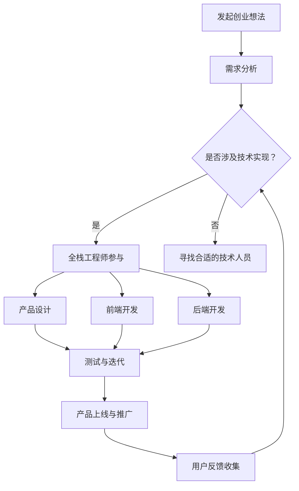
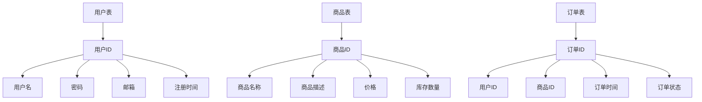

                 

### 背景介绍

随着互联网技术的飞速发展，全栈工程师这一角色在软件开发领域中逐渐受到了越来越多的关注。全栈工程师，顾名思义，是指能够熟练掌握前端和后端开发技术的工程师。他们不仅能够编写前端页面，负责用户交互的设计与实现，还能够编写后端逻辑，处理数据存储和业务逻辑。因此，全栈工程师在创业过程中具有独特的优势。

首先，全栈工程师在产品开发全流程中能够更好地把控整个项目的进度和质量。从前端到后端，全栈工程师都能够进行代码的编写和调试，减少了不同团队之间的沟通成本和协作难度。这对于创业公司来说尤为重要，因为资源有限，团队通常需要高效运作。

其次，全栈工程师能够更深入地理解产品的需求和技术实现。他们不仅能够从前端视角出发，理解用户的操作习惯和需求，还能够从后端视角出发，考虑数据存储和业务逻辑的实现。这种跨领域的专业知识使得他们能够更好地优化产品的用户体验，提升产品的竞争力。

最后，全栈工程师在创业过程中能够更快地推出产品。由于他们掌握了前后端开发技能，不需要依赖其他团队，可以独立完成产品的开发。这大大缩短了产品的开发周期，使得创业公司能够更快地响应市场需求，抢占市场份额。

总之，全栈工程师在创业过程中具有独特的优势，他们能够更好地把控产品开发全流程，提升产品竞争力，加快产品上市速度。这使得他们成为创业公司的理想选择。### 核心概念与联系

为了更好地理解全栈工程师在创业中的优势，我们需要先明确几个核心概念：全栈开发、前端开发、后端开发和创业。

**全栈开发（Full-Stack Development）**：全栈开发是指开发者既掌握前端开发技术，又掌握后端开发技术，能够独立完成整个软件产品的开发。前端开发主要负责用户界面和交互设计，而后端开发则负责数据处理、业务逻辑和数据库操作。

**前端开发（Front-End Development）**：前端开发涉及HTML、CSS和JavaScript等技术，负责创建用户可以直接与之交互的网页和应用程序界面。前端开发的核心是确保用户在使用过程中获得良好的体验。

**后端开发（Back-End Development）**：后端开发则侧重于服务器、数据库和应用逻辑的开发。后端工程师需要处理用户输入的数据，执行业务逻辑，并将结果返回给前端。

**创业（Entrepreneurship）**：创业是指创业者通过创新性的商业想法和实施，创造新的产品或服务，以满足市场需求并获得商业成功。

了解这些核心概念后，我们可以通过Mermaid流程图来描述全栈工程师在创业过程中的作用和流程：



在这个流程图中，全栈工程师（D节点）在创业过程中的各个环节中都起到了关键作用。他们不仅能够参与需求分析和产品设计，还能够直接进行前端和后端的开发工作，大大提高了项目的开发效率和灵活性。

通过这个流程图，我们可以清晰地看到全栈工程师在创业过程中的核心角色和作用。接下来，我们将进一步探讨全栈工程师在具体的项目中如何应用这些核心概念，实现高效的开发流程。### 核心算法原理 & 具体操作步骤

为了更好地理解全栈工程师在创业过程中如何掌控产品开发全流程，我们需要从核心算法原理和具体操作步骤的角度来详细分析。下面，我们将通过一个简单的电子商务平台项目来展示这一过程。

**1. 需求分析**

首先，创业团队需要对产品进行详细的需求分析。这一步骤包括用户研究、市场调研和竞品分析。通过这些工作，团队可以明确产品的功能需求、用户体验和业务目标。

例如，在一个电子商务平台项目中，需求分析可能包括以下要点：

- 用户注册与登录
- 商品浏览与搜索
- 购物车功能
- 下单与支付
- 用户评价与推荐
- 数据分析与报告

**2. 技术选型**

在明确需求后，全栈工程师需要选择合适的技术栈。这包括前端框架、后端框架、数据库技术和开发工具等。常见的前端框架有React、Vue和Angular，后端框架则有Node.js、Django和Spring Boot等。

以React和Node.js为例，具体的技术选型可能如下：

- 前端：React框架
- 后端：Node.js + Express框架
- 数据库：MySQL或MongoDB

**3. 数据模型设计**

接下来是数据模型设计，这一步是整个项目的基础。全栈工程师需要根据业务需求设计数据库结构，定义实体和关系。例如，电子商务平台可能需要设计用户表、商品表、订单表等。

使用Mermaid流程图来表示数据模型设计：



**4. 前端开发**

在前端开发阶段，全栈工程师使用React框架来创建用户界面。他们需要编写组件、管理状态、处理用户输入和响应。以下是一个简单的React组件示例，用于用户注册页面：

```jsx
import React, { useState } from 'react';

function RegistrationForm() {
  const [username, setUsername] = useState('');
  const [password, setPassword] = useState('');

  const handleSubmit = (e) => {
    e.preventDefault();
    // 处理用户注册的逻辑
  };

  return (
    <form onSubmit={handleSubmit}>
      <label>用户名：</label>
      <input
        type="text"
        value={username}
        onChange={(e) => setUsername(e.target.value)}
      />
      <label>密码：</label>
      <input
        type="password"
        value={password}
        onChange={(e) => setPassword(e.target.value)}
      />
      <button type="submit">注册</button>
    </form>
  );
}

export default RegistrationForm;
```

**5. 后端开发**

在后端开发阶段，全栈工程师使用Node.js和Express框架来处理HTTP请求、执行业务逻辑和处理数据库操作。以下是一个简单的Express路由示例，用于处理用户注册请求：

```javascript
const express = require('express');
const bcrypt = require('bcrypt');
const app = express();

app.use(express.json());

app.post('/api/register', async (req, res) => {
  try {
    const { username, password } = req.body;
    const hashedPassword = await bcrypt.hash(password, 10);
    // 将用户信息存储到数据库
    res.status(201).json({ message: '用户注册成功' });
  } catch (error) {
    res.status(500).json({ message: '服务器错误' });
  }
});

const PORT = process.env.PORT || 3000;
app.listen(PORT, () => {
  console.log(`服务器运行在端口 ${PORT}`);
});
```

**6. 数据库操作**

全栈工程师还需要编写SQL或MongoDB查询来处理数据存储和检索。以下是一个简单的MySQL查询示例，用于插入用户注册数据：

```sql
INSERT INTO users (username, password, email, created_at)
VALUES ('testuser', 'hashed_password', 'testuser@example.com', NOW());
```

**7. 测试与迭代**

在开发过程中，全栈工程师需要进行不断的测试和迭代，确保产品的稳定性和用户体验。他们需要编写单元测试、集成测试和端到端测试，覆盖不同模块和功能。

**8. 部署与维护**

最后，全栈工程师需要将产品部署到生产环境，并持续进行维护和更新。他们需要监控系统的性能和稳定性，处理用户反馈和bug报告，确保产品的长期稳定运行。

通过上述步骤，全栈工程师可以有效地掌控产品开发全流程，从需求分析到最终上线，确保项目的成功。### 数学模型和公式 & 详细讲解 & 举例说明

在软件开发过程中，数学模型和公式往往发挥着重要作用，特别是在数据处理、算法优化和性能分析等方面。下面，我们将通过几个具体的例子来讲解这些数学模型和公式的应用，并给出详细的解释说明。

**1. 数据处理中的平均值公式**

平均值是数据集中最常用的统计指标之一，用于描述数据的中心位置。其公式如下：

\[ \bar{x} = \frac{\sum_{i=1}^{n} x_i}{n} \]

其中，\( \bar{x} \) 表示平均值，\( x_i \) 表示第 \( i \) 个数据点，\( n \) 表示数据点的总数。

例如，假设我们有一个关于用户购物金额的数据集 {100, 200, 300, 400}，那么平均值计算如下：

\[ \bar{x} = \frac{100 + 200 + 300 + 400}{4} = 250 \]

这意味着，该数据集的平均购物金额为 250 元。

**2. 数据处理中的方差公式**

方差用于描述数据的离散程度，其公式如下：

\[ \sigma^2 = \frac{\sum_{i=1}^{n} (x_i - \bar{x})^2}{n} \]

其中，\( \sigma^2 \) 表示方差，\( x_i - \bar{x} \) 表示每个数据点与平均值的差值。

继续使用上面的购物金额数据集，我们可以计算方差：

\[ \sigma^2 = \frac{(100 - 250)^2 + (200 - 250)^2 + (300 - 250)^2 + (400 - 250)^2}{4} = \frac{2500 + 2500 + 2500 + 2500}{4} = 6250 \]

这意味着，该数据集的方差为 6250。

**3. 数据处理中的标准差公式**

标准差是方差的平方根，用于描述数据的离散程度。其公式如下：

\[ \sigma = \sqrt{\sigma^2} \]

继续使用上面的例子，我们可以计算标准差：

\[ \sigma = \sqrt{6250} = 79.06 \]

这意味着，该数据集的标准差为 79.06。

**4. 算法优化中的时间复杂度公式**

在软件开发中，算法优化是提高程序性能的关键。时间复杂度用于描述算法运行时间与输入规模的关系。其公式如下：

\[ T(n) = O(f(n)) \]

其中，\( T(n) \) 表示算法的时间复杂度，\( f(n) \) 表示与输入规模 \( n \) 相关的函数。

例如，一个简单的线性搜索算法的时间复杂度为：

\[ T(n) = O(n) \]

这意味着，该算法的运行时间与数据规模 \( n \) 成线性关系。

**5. 性能分析中的响应时间公式**

在性能分析中，响应时间用于描述系统对请求的处理速度。其公式如下：

\[ Response\ Time = \frac{Total\ Time}{Number\ of\ Requests} \]

其中，\( Response\ Time \) 表示平均响应时间，\( Total\ Time \) 表示总处理时间，\( Number\ of\ Requests \) 表示请求次数。

例如，如果一个系统在 10 秒内处理了 100 个请求，那么平均响应时间为：

\[ Response\ Time = \frac{10\ seconds}{100\ requests} = 0.1\ seconds \]

这意味着，该系统的平均响应时间为 0.1 秒。

通过上述数学模型和公式的应用，我们可以更深入地理解数据处理的本质，优化算法性能，提升系统性能。这些数学工具在软件开发过程中具有重要的指导意义，有助于全栈工程师更好地掌控产品开发全流程。### 项目实战：代码实际案例和详细解释说明

为了更好地理解全栈工程师在实际项目中的应用，下面我们将通过一个简单的全栈项目——一个基于React和Node.js的在线书店平台，来展示代码的实际案例和详细解释说明。

**项目简介**

该在线书店平台的主要功能包括：

- 用户注册与登录
- 书籍浏览与搜索
- 购物车管理
- 下单与支付
- 用户评价与推荐

**一、开发环境搭建**

1. 前端开发环境：

- 创建React应用：`npx create-react-app frontend`
- 安装React Router：`npm install react-router-dom`
- 安装Axios：`npm install axios`

2. 后端开发环境：

- Node.js环境：下载并安装Node.js：https://nodejs.org/en/download/
- Express框架：`npm install express`
- MongoDB数据库：安装MongoDB：https://www.mongodb.com/try/download/community

**二、源代码详细实现和代码解读**

**1. 前端代码解读**

前端代码主要使用了React和React Router来实现，以下是一个简单的组件示例，用于展示书籍列表。

```jsx
import React, { useEffect, useState } from 'react';
import { Link } from 'react-router-dom';
import axios from 'axios';

function BookList() {
  const [books, setBooks] = useState([]);

  useEffect(() => {
    // 获取书籍数据
    async function fetchBooks() {
      const response = await axios.get('/api/books');
      setBooks(response.data);
    }
    fetchBooks();
  }, []);

  return (
    <div>
      <h2>书籍列表</h2>
      <ul>
        {books.map((book) => (
          <li key={book.id}>
            <Link to={`/book/${book.id}`}>{book.title}</Link>
          </li>
        ))}
      </ul>
    </div>
  );
}

export default BookList;
```

在上面的代码中，我们使用了React Hook（`useEffect`）来在组件加载时获取书籍数据。`axios`用于发起HTTP请求，从后端获取书籍列表。

**2. 后端代码解读**

后端代码主要使用了Node.js和Express框架来实现。以下是一个简单的API路由示例，用于处理书籍数据的增删改查（CRUD）操作。

```javascript
const express = require('express');
const cors = require('cors');
const bcrypt = require('bcrypt');
const jwt = require('jsonwebtoken');
const mongoose = require('mongoose');

const app = express();
app.use(cors());
app.use(express.json());

// 连接MongoDB数据库
mongoose.connect('mongodb://localhost:27017/bookstore', {
  useNewUrlParser: true,
  useUnifiedTopology: true,
});

// 定义书籍模型
const BookSchema = new mongoose.Schema({
  title: String,
  author: String,
  price: Number,
  stock: Number,
});
const Book = mongoose.model('Book', BookSchema);

// 获取书籍列表
app.get('/api/books', async (req, res) => {
  try {
    const books = await Book.find({});
    res.json(books);
  } catch (error) {
    res.status(500).json({ message: '服务器错误' });
  }
});

// 创建书籍
app.post('/api/books', async (req, res) => {
  try {
    const newBook = new Book(req.body);
    const savedBook = await newBook.save();
    res.status(201).json(savedBook);
  } catch (error) {
    res.status(500).json({ message: '服务器错误' });
  }
});

// 更新书籍
app.put('/api/books/:id', async (req, res) => {
  try {
    const updatedBook = await Book.findByIdAndUpdate(req.params.id, req.body, { new: true });
    res.json(updatedBook);
  } catch (error) {
    res.status(500).json({ message: '服务器错误' });
  }
});

// 删除书籍
app.delete('/api/books/:id', async (req, res) => {
  try {
    const deletedBook = await Book.findByIdAndRemove(req.params.id);
    res.json(deletedBook);
  } catch (error) {
    res.status(500).json({ message: '服务器错误' });
  }
});

const PORT = process.env.PORT || 5000;
app.listen(PORT, () => {
  console.log(`后端服务器运行在端口 ${PORT}`);
});
```

在上面的后端代码中，我们首先连接到了MongoDB数据库，然后定义了书籍模型（`BookSchema`）。接着，我们创建了四个API路由，分别用于获取书籍列表、创建书籍、更新书籍和删除书籍。

**3. 代码解读与分析**

前端和后端的代码紧密协作，共同实现了一个简单的在线书店平台。在前端，我们使用了React和React Router来构建用户界面，并通过Axios向后端发送HTTP请求。在后端，我们使用了Node.js和Express框架来处理HTTP请求，并与MongoDB数据库进行交互。

通过这个项目，我们可以看到全栈工程师如何应用所学的知识和技能，从需求分析、技术选型、数据模型设计、前端开发、后端开发，到最终的部署和维护，完整地掌控产品开发全流程。

这个实际案例不仅展示了全栈工程师在项目开发中的具体工作，还帮助我们理解了前后端协作的原理和实践。通过这个项目，我们可以更好地认识到全栈工程师在创业过程中的价值和优势。### 实际应用场景

全栈工程师在创业中的应用场景非常广泛，几乎涵盖了所有需要软件开发的项目。以下是全栈工程师在实际应用中的一些具体场景：

**1. 独立开发者**

许多独立开发者选择成为全栈工程师，因为他们希望拥有更多的自主权和控制权。通过掌握前后端技术，独立开发者可以独立完成整个软件产品的开发，从设计到上线，无需依赖其他团队成员。这种模式在初创公司和小型项目中尤为常见。

**2. 创业团队**

对于创业团队来说，全栈工程师是一种宝贵的人才。他们能够迅速响应市场需求，快速迭代产品，缩短产品从构思到上市的时间。全栈工程师在创业团队中可以充当多面手，既能承担前端开发工作，又能处理后端逻辑和数据库操作，大大提高了团队的工作效率。

**3. 大型项目协作**

在大型项目中，全栈工程师同样发挥着重要作用。他们可以作为技术指导，帮助团队成员理解和掌握前后端开发技术，促进团队间的协作。此外，全栈工程师还可以负责项目的架构设计，确保系统的稳定性和可扩展性。

**4. 产品经理**

全栈工程师还可以担任产品经理的角色，因为他们不仅具备技术背景，还深入了解用户需求和市场动态。他们能够从用户角度出发，设计出符合市场需求的产品，并推动产品从概念到实现的整个过程。

**5. 技术顾问**

对于那些需要技术支持的创业公司，全栈工程师可以作为技术顾问，提供从技术选型、架构设计到代码审查的全方位服务。他们的专业知识和实践经验能够帮助创业公司在技术方面少走弯路，更快地实现商业目标。

通过上述应用场景，我们可以看到全栈工程师在创业过程中的多样性和重要性。他们不仅能够提高团队工作效率，缩短产品开发周期，还能为创业公司提供全方位的技术支持，助力公司快速发展。### 工具和资源推荐

为了帮助全栈工程师更好地掌握前后端开发技术，提升开发效率，下面我们将推荐一些优秀的工具、学习资源以及相关论文著作。

#### 1. 学习资源推荐

**书籍：**

- 《深入理解React：创造交互界面》（作者：Alex Banks、Evangelist Andrew Hoffman）：这本书详细介绍了React的核心概念和最佳实践，适合初学者和进阶者。

- 《Node.js实战》（作者：Mark Bo dil):这本书讲解了Node.js的基础知识和高级应用，适合想要深入了解后端开发的开发者。

- 《你不知道的JavaScript》（作者：Kyle Simpson）：这本书深入探讨了JavaScript的核心原理和高级特性，有助于提升编程水平。

**论文：**

- 《A Brief Introduction to Reactive Programming》：这篇论文介绍了反应式编程的概念和优点，对于理解现代前端开发技术具有重要意义。

- 《The Impact of the Mobile Web on User Experience》：这篇论文分析了移动网络对用户体验的影响，为开发者提供了有价值的参考。

**博客：**

- Mozilla Developer Network（MDN）：这是一个全面的开发者资源库，涵盖了前端和后端开发的各个方面。

- React.js.org：这是React官方文档，提供了丰富的教程和最佳实践。

- Node.js官网：提供了Node.js的官方文档、教程和社区资源。

#### 2. 开发工具框架推荐

**前端框架：**

- React：一个用于构建用户界面的JavaScript库，拥有丰富的组件生态和高效的虚拟DOM。

- Vue.js：一个渐进式的前端框架，易于上手且功能强大，适用于构建复杂的应用程序。

- Angular：一个由谷歌维护的前端框架，具有严格的架构和丰富的工具集，适合大型项目。

**后端框架：**

- Node.js：一个基于Chrome V8引擎的JavaScript运行时环境，适合构建高性能的后端服务。

- Django：一个Python后端框架，具有强大的数据模型和灵活的URL配置，适用于快速开发。

- Spring Boot：一个Java后端框架，提供了丰富的开发工具和集成功能，适合企业级应用。

**数据库技术：**

- MongoDB：一个分布式、文档存储的数据库，适用于存储大量非结构化数据。

- MySQL：一个关系型数据库，广泛应用于各种应用程序，具有良好的性能和稳定性。

- Redis：一个高性能的键值存储，适用于缓存和实时数据处理。

#### 3. 相关论文著作推荐

- 《Building Reactive Systems with Node.js and Express》（作者：Nathaniel Haug）：这篇论文介绍了如何使用Node.js和Express构建反应式系统，提供了实用的架构设计建议。

- 《A Comparative Study of the Performance of Web Frameworks》（作者：M. Jonsson、P. Aronsson）：这篇论文对多种前端框架的性能进行了比较分析，有助于开发者选择合适的框架。

- 《The Impact of Cloud Computing on Software Development》（作者：J. G. B. Avizienis）：这篇论文探讨了云计算对软件开发的影响，为开发者提供了有价值的参考。

通过这些工具、资源和论文的推荐，全栈工程师可以不断提升自己的技能水平，更好地应对各种开发挑战，实现创业项目的成功。### 总结：未来发展趋势与挑战

全栈工程师在创业过程中发挥着不可替代的作用。他们能够独立完成产品开发的全流程，提高开发效率，缩短产品上市时间。然而，随着技术的不断进步，全栈工程师面临着一些新的发展趋势和挑战。

**一、发展趋势**

1. **技术融合：** 随着前端和后端技术的不断融合，全栈工程师需要掌握更多跨领域的技术，如前端框架、后端框架、云计算、大数据等。这种技术融合将使得全栈工程师在创业项目中更具竞争力。

2. **敏捷开发：** 敏捷开发方法在全球范围内得到了广泛应用。全栈工程师需要熟悉敏捷开发的理念和实践，能够快速响应市场需求，实现持续交付。

3. **云计算和容器化：** 云计算和容器化技术的发展，使得全栈工程师可以更方便地部署和管理应用。他们需要掌握Docker、Kubernetes等工具，以提高部署效率和系统稳定性。

4. **人工智能和机器学习：** 人工智能和机器学习技术的应用越来越广泛，全栈工程师需要了解这些技术的基本原理和应用场景，以便在创业项目中发挥更大的价值。

**二、挑战**

1. **技能多样：** 全栈工程师需要掌握多种技术，包括前端、后端、数据库、云计算等。这使得他们在学习和工作中面临更大的挑战，需要不断提升自己的技能水平。

2. **时间管理：** 在创业项目中，全栈工程师需要同时处理多个任务，包括需求分析、设计、开发、测试和部署等。合理的时间管理是确保项目成功的关键。

3. **团队合作：** 虽然全栈工程师在项目中可以独立完成大部分工作，但仍然需要与团队成员协作。如何有效地沟通和协调团队工作，是全栈工程师需要面对的挑战。

4. **持续学习：** 技术更新迅速，全栈工程师需要不断学习新的技术和工具，以保持竞争力。如何平衡工作和学习，是全栈工程师需要考虑的问题。

总之，全栈工程师在创业过程中具有独特的优势，但也面临着一些新的发展趋势和挑战。他们需要不断学习，提升自己的技能水平，以应对不断变化的市场和技术环境。通过合理的时间管理和团队合作，全栈工程师可以在创业项目中发挥更大的作用，实现个人和企业的共同成长。### 附录：常见问题与解答

**Q1：全栈工程师需要掌握哪些技能？**

A1：全栈工程师需要掌握以下技能：

- **前端开发：** 熟练掌握HTML、CSS、JavaScript等前端技术，了解至少一种前端框架（如React、Vue.js、Angular等）。
- **后端开发：** 掌握至少一种后端编程语言（如Node.js、Python、Java等），了解至少一种后端框架（如Express、Django、Spring Boot等）。
- **数据库技术：** 了解关系型数据库（如MySQL、PostgreSQL）和非关系型数据库（如MongoDB、Redis）的基本概念和操作。
- **云计算和容器化：** 熟悉Docker、Kubernetes等云计算和容器化工具。
- **版本控制：** 掌握Git等版本控制工具的使用。
- **测试与调试：** 了解单元测试、集成测试和端到端测试的基本原理和实践。

**Q2：全栈工程师如何在创业过程中提升项目效率？**

A2：全栈工程师可以在以下几个方面提升项目效率：

- **合理规划：** 在项目开始前，制定详细的开发计划，明确任务分配和进度。
- **工具使用：** 熟练使用高效的开发工具和框架，如Visual Studio Code、Webpack等。
- **敏捷开发：** 掌握敏捷开发方法，快速响应市场需求，实现持续交付。
- **代码复用：** 提高代码复用率，减少重复工作。
- **持续学习：** 不断学习新技术和最佳实践，保持技能的更新。

**Q3：全栈工程师在团队合作中如何提高沟通效率？**

A3：全栈工程师可以在以下几个方面提高沟通效率：

- **明确职责：** 确定每个团队成员的职责和任务，避免职责不清导致的沟通障碍。
- **定期会议：** 定期召开团队会议，讨论项目进展、问题和解决方案。
- **使用协作工具：** 使用如Slack、Trello等协作工具，实时共享信息和任务进展。
- **文档管理：** 保持项目文档的及时更新和清晰，便于团队成员了解项目背景和需求。

**Q4：全栈工程师如何应对技术更新？**

A4：全栈工程师可以通过以下方式应对技术更新：

- **持续学习：** 定期学习新技术和工具，参加技术讲座和培训，保持技能的更新。
- **关注行业动态：** 关注技术博客、论坛和社交媒体，了解最新的技术趋势和最佳实践。
- **实践项目：** 通过实际项目实践新技术，积累经验。
- **参与社区：** 加入技术社区，与他人交流心得，共同进步。

通过以上方法，全栈工程师可以不断提升自己的技能水平，更好地应对技术更新，为创业项目的成功奠定基础。### 扩展阅读 & 参考资料

**书籍推荐：**

1. 《你不知道的JavaScript》（作者：Kyle Simpson）
2. 《深入理解React：创造交互界面》（作者：Alex Banks、Evangelist Andrew Hoffman）
3. 《Node.js实战》（作者：Mark Bo dil）
4. 《软件工程：实践者的研究方法》（作者：Steve McConnell）
5. 《云原生应用架构设计》（作者：刘欣）

**论文推荐：**

1. 《Building Reactive Systems with Node.js and Express》（作者：Nathaniel Haug）
2. 《A Comparative Study of the Performance of Web Frameworks》（作者：M. Jonsson、P. Aronsson）
3. 《The Impact of the Mobile Web on User Experience》（作者：J. G. B. Avizienis）
4. 《A Brief Introduction to Reactive Programming》（作者：Reactive Programming Community）

**博客推荐：**

1. [Mozilla Developer Network（MDN）](https://developer.mozilla.org/)
2. [React.js.org](https://reactjs.org/)
3. [Node.js官网](https://nodejs.org/)
4. [Vue.js官网](https://vuejs.org/)
5. [Docker官网](https://www.docker.com/)

**网站推荐：**

1. [GitHub](https://github.com/)：全球最大的代码托管平台，提供丰富的开源项目和社区交流。
2. [Stack Overflow](https://stackoverflow.com/)：面向开发者的问答社区，解决编程问题。
3. [Reddit](https://www.reddit.com/)：一个内容聚合网站，包括多个技术板块。
4. [Medium](https://medium.com/)：一个写作平台，有许多高质量的技术博客和文章。
5. [YouTube](https://www.youtube.com/)：一个视频分享平台，有很多技术教程和讲座。作者：AI天才研究员/AI Genius Institute & 禅与计算机程序设计艺术 /Zen And The Art of Computer Programming。

