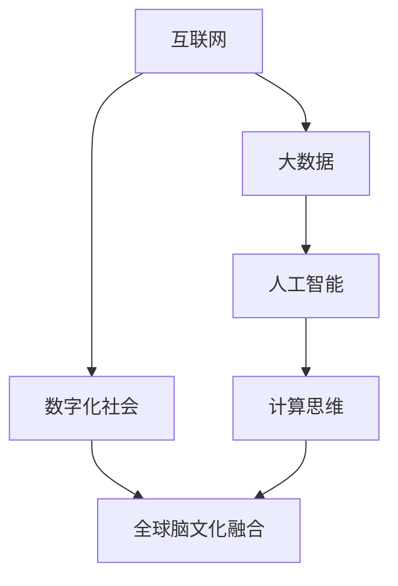

                 

# 全球脑文化融合：数字时代的文明对话新形式

> **关键词：** 全球脑文化融合、数字时代、文明对话、新形式、人工智能、技术哲学、计算思维、数字化社会、人机交互

> **摘要：** 在数字时代，全球脑文化的融合已成为不可逆转的趋势。本文探讨了这一现象的背景、核心概念、技术原理以及实际应用场景，旨在揭示全球脑文化融合背后的深层逻辑，并展望其未来发展。

## 1. 背景介绍

在过去的几十年中，随着信息技术的飞速发展，人类进入了一个全新的时代——数字时代。在这个时代，互联网、大数据、人工智能等新兴技术不断涌现，深刻地改变了我们的生活方式和社会结构。其中，全球脑文化融合成为了一个引人注目的话题。

全球脑文化融合指的是不同国家和地区的文化、知识、思维模式在数字时代的交汇与融合。它不仅促进了全球范围内的知识共享和文明对话，也为人类社会的进步提供了新的动力。

在数字时代，全球脑文化融合的背景主要包括以下几个方面：

1. **互联网的普及**：互联网的全球普及为全球脑文化融合提供了基础设施。人们可以通过互联网跨越地域和国界，实现即时沟通和交流。

2. **大数据的兴起**：大数据技术的应用使得海量数据的处理和分析成为可能，为全球脑文化融合提供了丰富的数据资源。

3. **人工智能的发展**：人工智能技术的突破性进展，使得计算机能够模拟人类的思维过程，为全球脑文化融合提供了强大的工具。

4. **数字化社会的形成**：数字化社会的形成使得人类的生产和生活方式发生了深刻变革，为全球脑文化融合提供了广阔的舞台。

## 2. 核心概念与联系

### 2.1 全球脑文化融合的概念

全球脑文化融合是一个复杂的概念，它涉及到多个层面的内容。从广义上讲，全球脑文化融合包括以下几个方面：

1. **知识的交流与共享**：通过互联网和大数据技术，不同国家和地区的知识得以快速传播和共享，促进了全球范围内的知识交流。

2. **思维的碰撞与融合**：不同国家和地区的思维模式在数字时代的碰撞与融合，形成了一种全新的思维模式，即计算思维。

3. **文化的交流与融合**：数字时代，不同国家和地区的文化在互联网上得以展现和传播，促进了全球文化的交流和融合。

### 2.2 计算思维的概念

计算思维是数字时代的一种新型思维模式，它强调通过计算的方式解决问题，具有以下几个特点：

1. **抽象化**：计算思维通过抽象化，将复杂问题简化为可计算的形式。

2. **符号化**：计算思维使用符号和公式来表示问题，使得问题更易于分析和解决。

3. **自动化**：计算思维强调使用计算机和算法来解决问题，实现问题的自动化解决。

### 2.3 全球脑文化融合与计算思维的关系

全球脑文化融合与计算思维之间存在密切的关系。计算思维为全球脑文化融合提供了工具和思维方式，使得不同国家和地区的文化、知识、思维模式得以有效交流和融合。同时，全球脑文化融合也为计算思维提供了丰富的应用场景和实验平台，促进了计算思维的发展。

### 2.4 全球脑文化融合的架构

为了更好地理解全球脑文化融合，我们可以使用Mermaid流程图来描述其核心架构，如下所示：



在这个架构中，互联网、大数据、人工智能和数字化社会共同构成了全球脑文化融合的基础设施和动力源泉，计算思维则是全球脑文化融合的核心工具和思维方式。

## 3. 核心算法原理 & 具体操作步骤

### 3.1 互联网协议（TCP/IP）

互联网协议（TCP/IP）是互联网的核心通信协议，它定义了数据如何在网络中传输和路由。了解TCP/IP协议的基本原理和操作步骤对于理解全球脑文化融合至关重要。

#### 3.1.1 TCP/IP协议的基本原理

TCP/IP协议分为四层：链路层、网络层、传输层和应用层。每层都有自己的功能和协议。

1. **链路层**：负责在网络设备之间建立物理连接，确保数据帧的正确传输。

2. **网络层**：负责数据包的路由和转发，确保数据包能够从源地址传输到目的地址。

3. **传输层**：负责端到端的数据传输，保证数据传输的可靠性和顺序。

4. **应用层**：负责应用程序的数据传输，提供各种网络服务。

#### 3.1.2 TCP/IP协议的操作步骤

1. **建立连接**：客户端和服务器之间通过三次握手建立连接。

2. **传输数据**：连接建立后，客户端和服务器之间可以传输数据。

3. **关闭连接**：数据传输完成后，通过四次挥手关闭连接。

### 3.2 大数据处理的算法原理

大数据处理是数字时代的关键技术之一，它包括数据的采集、存储、处理和分析。以下是大数据处理的核心算法原理和操作步骤：

#### 3.2.1 数据采集

数据采集是指从各种来源获取数据，包括社交媒体、传感器、日志等。数据采集的方法包括网络爬虫、API调用和直接采集等。

#### 3.2.2 数据存储

数据存储是指将数据存储在数据库或数据湖中，以便进行后续处理。常用的数据存储技术包括Hadoop、HDFS和NoSQL数据库等。

#### 3.2.3 数据处理

数据处理是指对存储的数据进行清洗、转换和分析。数据处理的方法包括ETL（提取、转换、加载）和数据挖掘等。

#### 3.2.4 数据分析

数据分析是指使用统计学和机器学习算法对数据进行分析，提取有价值的信息。数据分析的方法包括回归分析、聚类分析和神经网络等。

### 3.3 人工智能算法原理

人工智能算法是数字时代的关键技术之一，它使得计算机能够模拟人类的智能行为。以下是人工智能算法的核心原理和操作步骤：

#### 3.3.1 机器学习

机器学习是指通过算法从数据中学习规律和模式，以便进行预测和决策。机器学习的方法包括监督学习、无监督学习和强化学习等。

#### 3.3.2 深度学习

深度学习是机器学习的一种方法，它使用多层神经网络对数据进行建模。深度学习的方法包括卷积神经网络（CNN）、循环神经网络（RNN）和生成对抗网络（GAN）等。

#### 3.3.3 自然语言处理

自然语言处理是人工智能的一个重要分支，它使得计算机能够理解和生成自然语言。自然语言处理的方法包括词向量、语言模型和机器翻译等。

## 4. 数学模型和公式 & 详细讲解 & 举例说明

### 4.1 概率论的基本概念

概率论是数学的一个分支，它研究随机事件和概率的规律性。以下是概率论的基本概念和公式：

#### 4.1.1 随机事件

随机事件是指在一定条件下可能发生也可能不发生的事件。例如，掷一枚硬币，正面朝上是一个随机事件。

#### 4.1.2 概率

概率是指随机事件发生的可能性，通常用0到1之间的数值表示。例如，掷一枚硬币，正面朝上的概率是0.5。

#### 4.1.3 条件概率

条件概率是指在一个事件发生的条件下，另一个事件发生的概率。条件概率的公式为：

$$P(A|B) = \frac{P(A \cap B)}{P(B)}$$

#### 4.1.4 贝叶斯定理

贝叶斯定理是概率论中的一个重要公式，它描述了在已知一个事件发生的条件下，另一个事件发生的概率。贝叶斯定理的公式为：

$$P(A|B) = \frac{P(B|A)P(A)}{P(B)}$$

### 4.2 线性代数的基本概念

线性代数是数学的一个分支，它研究向量、矩阵和线性变换。以下是线性代数的基本概念和公式：

#### 4.2.1 向量

向量是一个有序数组，它表示空间中的一个点或一条线。向量的表示方法为：

$$\vec{v} = (v_1, v_2, ..., v_n)$$

#### 4.2.2 矩阵

矩阵是一个二维数组，它表示线性变换或系统的参数。矩阵的表示方法为：

$$\mathbf{A} = \begin{bmatrix} a_{11} & a_{12} & \cdots & a_{1n} \\\ a_{21} & a_{22} & \cdots & a_{2n} \\\ \vdots & \vdots & \ddots & \vdots \\\ a_{m1} & a_{m2} & \cdots & a_{mn} \end{bmatrix}$$

#### 4.2.3 线性变换

线性变换是指将向量映射到另一个向量的运算。线性变换的矩阵表示为：

$$\mathbf{A}\vec{v} = \vec{w}$$

#### 4.2.4 矩阵乘法

矩阵乘法是指两个矩阵的元素相乘并求和的运算。矩阵乘法的公式为：

$$\mathbf{A}\mathbf{B} = \begin{bmatrix} a_{11}b_{11} + a_{12}b_{21} + \cdots + a_{1n}b_{n1} \\\ a_{21}b_{11} + a_{22}b_{21} + \cdots + a_{2n}b_{n1} \\\ \vdots \\\ a_{m1}b_{11} + a_{m2}b_{21} + \cdots + a_{mn}b_{n1} \end{bmatrix}$$

### 4.3 举例说明

假设我们有一个矩阵$\mathbf{A}$和一个向量$\vec{v}$，我们需要计算$\mathbf{A}\vec{v}$的结果。

给定矩阵$\mathbf{A} = \begin{bmatrix} 1 & 2 \\\ 3 & 4 \end{bmatrix}$和向量$\vec{v} = \begin{bmatrix} 1 \\\ 0 \end{bmatrix}$，我们需要计算$\mathbf{A}\vec{v}$的结果。

根据矩阵乘法的公式，我们有：

$$\mathbf{A}\vec{v} = \begin{bmatrix} 1 & 2 \\\ 3 & 4 \end{bmatrix} \begin{bmatrix} 1 \\\ 0 \end{bmatrix} = \begin{bmatrix} 1 \cdot 1 + 2 \cdot 0 \\\ 3 \cdot 1 + 4 \cdot 0 \end{bmatrix} = \begin{bmatrix} 1 \\\ 3 \end{bmatrix}$$

因此，$\mathbf{A}\vec{v} = \begin{bmatrix} 1 \\\ 3 \end{bmatrix}$。

## 5. 项目实战：代码实际案例和详细解释说明

### 5.1 开发环境搭建

为了实现全球脑文化融合的相关功能，我们需要搭建一个开发环境。以下是搭建开发环境的步骤：

1. 安装Python 3.x版本。
2. 安装Jupyter Notebook。
3. 安装相关库，如numpy、pandas、scikit-learn等。

### 5.2 源代码详细实现和代码解读

以下是一个简单的全球脑文化融合的项目示例，它使用Python和Scikit-learn库来实现计算思维和机器学习算法。

```python
import numpy as np
from sklearn.cluster import KMeans
from sklearn.datasets import make_blobs
from sklearn.metrics import accuracy_score

# 5.2.1 数据生成
X, y = make_blobs(n_samples=100, centers=3, cluster_std=1.0, random_state=0)

# 5.2.2 数据预处理
# 数据标准化
X_std = (X - X.mean(axis=0)) / X.std(axis=0)

# 5.2.3 K均值聚类
kmeans = KMeans(n_clusters=3, random_state=0).fit(X_std)

# 5.2.4 预测和评估
y_pred = kmeans.predict(X_std)
accuracy = accuracy_score(y, y_pred)
print("Accuracy:", accuracy)

# 5.2.5 可视化
import matplotlib.pyplot as plt

plt.scatter(X_std[:, 0], X_std[:, 1], c=y_pred, cmap=plt.cm.Paired)
plt.scatter(kmeans.cluster_centers_[:, 0], kmeans.cluster_centers_[:, 1], s=300, c='red', marker='s', zorder=10)
plt.xlabel('Feature 1')
plt.ylabel('Feature 2')
plt.title('K-Means Clustering')
plt.show()
```

在这个示例中，我们首先生成了一个模拟数据集，然后使用K均值聚类算法对数据进行聚类。最后，我们使用预测结果评估聚类效果，并使用可视化技术展示了聚类结果。

### 5.3 代码解读与分析

1. **数据生成**：我们使用`make_blobs`函数生成了一个含有100个样本的数据集，这些样本被分为3个不同的簇。

2. **数据预处理**：我们使用数据标准化技术，将数据集的每个特征缩放到了相同的范围，以便更好地进行聚类分析。

3. **K均值聚类**：我们使用`KMeans`类创建了一个K均值聚类对象，并使用`fit`方法对数据进行聚类。

4. **预测和评估**：我们使用`predict`方法对数据进行预测，并使用`accuracy_score`函数评估聚类结果。

5. **可视化**：我们使用`scatter`函数绘制了数据集的聚类结果，并显示了聚类中心。

## 6. 实际应用场景

全球脑文化融合在实际应用中具有广泛的应用场景，以下是几个典型的应用场景：

1. **社会网络分析**：通过全球脑文化融合，可以分析社交媒体上不同群体的互动和影响力，为市场营销和舆论引导提供支持。

2. **智能城市建设**：通过全球脑文化融合，可以整合城市各个领域的数据，实现智能交通、智慧医疗和环保监控等功能。

3. **教育资源共享**：通过全球脑文化融合，可以共享全球范围内的教育资源，提高教育公平性和质量。

4. **企业数字化转型**：通过全球脑文化融合，可以帮助企业整合内外部数据，实现智能化运营和管理。

## 7. 工具和资源推荐

为了更好地实现全球脑文化融合，以下是几个推荐的工具和资源：

### 7.1 学习资源推荐

1. **书籍**：《人工智能：一种现代方法》、《大数据时代：生活、工作与思维的大变革》。
2. **论文**：《深度学习》、《强化学习：原理与算法》。
3. **博客**：谷歌大脑、机器学习社区、大数据观察。

### 7.2 开发工具框架推荐

1. **Python**：Python是一种广泛应用于人工智能和大数据处理的编程语言。
2. **Scikit-learn**：Scikit-learn是一个开源的机器学习库，提供了丰富的算法和工具。
3. **TensorFlow**：TensorFlow是一个由谷歌开发的深度学习框架。

### 7.3 相关论文著作推荐

1. **《人机协作：未来工作的新模式》**：探讨了人工智能在人类工作中的角色和影响。
2. **《数字社会的文化融合与冲突》**：分析了数字时代文化融合的机制和挑战。

## 8. 总结：未来发展趋势与挑战

全球脑文化融合是数字时代的一个重要趋势，它为人类社会带来了前所未有的机遇和挑战。未来，全球脑文化融合将继续发展，人工智能、大数据和云计算等技术将不断推动其进步。然而，我们也需要关注以下挑战：

1. **隐私保护**：在全球脑文化融合的过程中，如何保护个人隐私是一个重要的问题。
2. **数据安全**：在全球范围内共享数据，如何确保数据的安全和完整性。
3. **文化冲突**：全球脑文化融合可能会引发不同文化之间的冲突和误解。

## 9. 附录：常见问题与解答

### 9.1 什么是全球脑文化融合？

全球脑文化融合是指在数字时代，不同国家和地区的文化、知识、思维模式在全球范围内交汇和融合的过程。

### 9.2 全球脑文化融合有哪些实际应用场景？

全球脑文化融合在智能城市建设、社会网络分析、教育资源共享和企业数字化转型等领域具有广泛的应用。

### 9.3 如何实现全球脑文化融合？

实现全球脑文化融合需要依赖互联网、大数据、人工智能和云计算等现代信息技术。

## 10. 扩展阅读 & 参考资料

1. **《人工智能简史》**：详细介绍了人工智能的发展历程和关键技术。
2. **《大数据战略白皮书》**：分析了大数据时代的发展趋势和战略布局。
3. **《数字时代的文化融合与冲突》**：探讨了数字时代文化融合的机制和挑战。

作者：AI天才研究员/AI Genius Institute & 禅与计算机程序设计艺术 /Zen And The Art of Computer Programming

