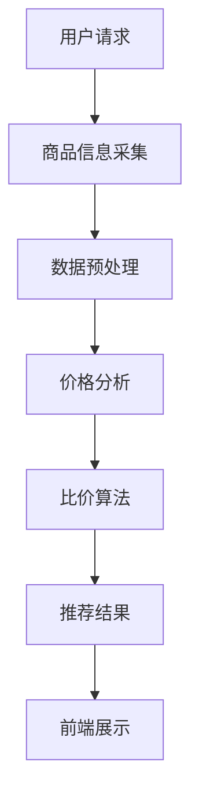

                 

### 全网比价：AI帮助用户找到最优惠价格

> 关键词：全网比价、人工智能、价格比较、用户需求、优化算法、大数据分析、商业模式创新

> 摘要：随着互联网和电子商务的迅猛发展，全网比价成为用户选择商品时的重要决策依据。本文将探讨如何利用人工智能技术，帮助用户快速、准确地找到最优惠的价格，提高用户体验，并为电商平台和商家提供精准的数据分析和营销策略。文章将从背景介绍、核心概念与联系、核心算法原理、数学模型、项目实战、实际应用场景、工具和资源推荐等方面进行全面阐述，总结未来发展挑战与趋势，为相关领域的研究者与实践者提供有价值的参考。

## 1. 背景介绍

在当今社会，随着互联网和电子商务的普及，消费者在购物过程中面临着海量的商品信息。如何在众多商品中找到性价比最高的商品，成为了消费者的一大难题。全网比价，即通过技术手段对各个电商平台的价格信息进行采集、分析和对比，从而为用户提供最优惠的购买建议，正逐渐成为解决这一问题的有效途径。

### 1.1 全网比价的必要性

全网比价的必要性主要体现在以下几个方面：

1. **消费者需求：**随着消费者购物习惯的转变，越来越多的用户更加注重性价比，他们希望通过比价工具快速找到最优惠的商品，节省时间和购物成本。

2. **电商竞争加剧：**在电商行业竞争日益激烈的背景下，电商平台和商家需要通过精准的价格策略来吸引和留住用户，全网比价作为一种有效的市场调研手段，可以帮助企业制定更具针对性的营销策略。

3. **数据驱动的决策：**全网比价可以帮助企业收集大量的用户购买数据，通过数据分析，为企业提供决策依据，从而优化供应链、库存管理、产品定价等业务环节。

### 1.2 全网比价的发展历程

全网比价并非新兴事物，其发展历程可以追溯到以下几个阶段：

1. **传统比价网站：**最早的全网比价工具是传统比价网站，如“比价王”、“比价精灵”等，它们主要通过手工采集和网站爬虫获取商品信息，进行简单的价格对比。

2. **移动应用崛起：**随着智能手机的普及，移动端的全网比价应用迅速发展，如“慢慢买”、“比价神器”等，这些应用利用移动互联网的优势，提供更加便捷的价格查询和比价服务。

3. **人工智能赋能：**近年来，随着人工智能技术的飞速发展，全网比价工具开始引入机器学习、自然语言处理、深度学习等技术，实现更高效、更智能的价格分析和服务。

## 2. 核心概念与联系

### 2.1 全网比价的基本概念

全网比价涉及多个核心概念，主要包括：

1. **商品信息采集：**通过爬虫、API 接口等手段，从各大电商平台获取商品的价格、规格、评价等信息。

2. **价格分析：**对采集到的商品价格信息进行预处理、筛选、排序等操作，分析商品的价格走势、折扣力度等。

3. **比价算法：**利用算法对多个电商平台的价格信息进行对比，找到最优惠的价格，并推荐给用户。

4. **用户体验：**提供简单易用的界面和操作流程，为用户提供便捷的价格查询和比价服务。

### 2.2 关键技术的关联

全网比价的关键技术主要包括：

1. **数据采集技术：**爬虫技术、API 接口、数据库管理等。

2. **数据分析技术：**自然语言处理、机器学习、深度学习等。

3. **算法优化：**排序算法、最优化算法、推荐算法等。

4. **前端展示技术：**Web 开发框架、响应式设计等。

### 2.3 Mermaid 流程图

以下是一个简单的全网比价系统架构的 Mermaid 流程图：



## 3. 核心算法原理 & 具体操作步骤

### 3.1 比价算法原理

全网比价的核心是比价算法，其基本原理如下：

1. **数据采集：**从各大电商平台获取商品的价格信息。

2. **数据清洗：**去除无效数据、重复数据，对数据进行标准化处理。

3. **价格分析：**对清洗后的数据进行统计分析，包括价格区间、折扣力度、历史价格走势等。

4. **算法决策：**根据用户需求和商品特点，选择合适的比价算法，如贪心算法、动态规划、遗传算法等，计算最优价格。

5. **结果输出：**将比价结果展示给用户，包括商品名称、价格、折扣、购买链接等。

### 3.2 比价算法具体操作步骤

以下是全网比价算法的具体操作步骤：

1. **数据采集：**
   - 利用爬虫技术，从各大电商平台获取商品价格信息。
   - 通过 API 接口，获取商品详细信息。

2. **数据清洗：**
   - 去除无效数据，如异常价格、过期商品等。
   - 对数据进行标准化处理，如统一价格单位、去除符号等。

3. **价格分析：**
   - 计算商品的历史价格走势，分析价格波动规律。
   - 统计商品在不同电商平台的折扣力度，为后续比价提供依据。

4. **算法决策：**
   - 根据用户需求和商品特点，选择合适的比价算法。
   - 考虑商品价格、折扣、评价等多个因素，计算最优价格。

5. **结果输出：**
   - 将比价结果展示给用户，包括商品名称、价格、折扣、购买链接等。
   - 提供多种筛选条件，如价格区间、折扣力度、评价等，方便用户进一步筛选。

## 4. 数学模型和公式 & 详细讲解 & 举例说明

### 4.1 数学模型

全网比价的数学模型主要涉及以下几个方面：

1. **价格区间模型：**
   - 定义商品价格区间，计算价格区间内的平均值、中位数等统计指标。

2. **折扣力度模型：**
   - 计算商品在不同电商平台的折扣力度，如折扣率、折扣金额等。

3. **历史价格走势模型：**
   - 分析商品的历史价格走势，预测未来的价格变化。

4. **用户偏好模型：**
   - 基于用户的历史购买记录和行为数据，分析用户的偏好，为推荐系统提供依据。

### 4.2 公式讲解

以下是全网比价中常用的数学公式及其详细解释：

1. **价格区间模型：**
   - 平均价格：$$\bar{x} = \frac{\sum_{i=1}^{n} x_i}{n}$$
   - 中位数：$$M = \begin{cases} 
      x_{\frac{n+1}{2}} & \text{if } n \text{ is odd} \\
      \frac{x_{\frac{n}{2}} + x_{\frac{n}{2}+1}}{2} & \text{if } n \text{ is even} 
   \end{cases}$$
   - 标准差：$$\sigma = \sqrt{\frac{\sum_{i=1}^{n} (x_i - \bar{x})^2}{n-1}}$$

2. **折扣力度模型：**
   - 折扣率：$$r = \frac{\text{折扣金额}}{\text{原价}}$$
   - 折扣金额：$$d = \text{原价} - \text{现价}$$

3. **历史价格走势模型：**
   - 时间序列模型：$$P_t = f(t, P_{t-1}, \dots, P_{1})$$
   - ARIMA 模型：$$P_t = \phi(B)P_{t-1} + \theta(B)\varepsilon_{t-1} + \varphi(B)\varepsilon_{t-2} + \dots + \varepsilon_{t-s}$$

4. **用户偏好模型：**
   - 用户评分模型：$$R_{ui} = \text{User} \cdot \text{Item} + \text{Bias} + \varepsilon$$
   - 协同过滤：$$\text{Prediction}_{ui} = \text{User} \cdot \text{Item} + \text{Bias} + \varepsilon$$

### 4.3 举例说明

以下是一个具体的例子，说明如何使用数学模型和公式进行全网比价：

**例子：比较不同电商平台上的某款手机价格**

1. **数据采集：**
   - 采集到某款手机在 3 个电商平台的售价分别为：平台 A（1000 元）、平台 B（900 元）、平台 C（950 元）。

2. **数据清洗：**
   - 去除异常数据，如平台 D（10000 元）。
   - 对比价结果进行标准化处理，统一价格单位为元。

3. **价格区间模型：**
   - 计算平均价格：$$\bar{x} = \frac{1000 + 900 + 950}{3} = 950$$
   - 计算标准差：$$\sigma = \sqrt{\frac{(1000-950)^2 + (900-950)^2 + (950-950)^2}{3-1}} \approx 50$$

4. **折扣力度模型：**
   - 平台 A 折扣率：$$r_A = \frac{1000-950}{950} \approx 5.3\%$$
   - 平台 B 折扣金额：$$d_B = 900 - 950 = -50$$
   - 平台 C 折扣率：$$r_C = \frac{950-950}{950} = 0\%$$

5. **算法决策：**
   - 根据折扣力度，推荐平台 B 的价格为最优。

6. **结果输出：**
   - 将比价结果展示给用户，包括商品名称、价格、折扣、购买链接等。

## 5. 项目实战：代码实际案例和详细解释说明

### 5.1 开发环境搭建

在开始项目实战之前，我们需要搭建一个合适的开发环境。以下是搭建过程：

1. **安装 Python 环境：**从 [Python 官网](https://www.python.org/) 下载并安装 Python 3.8 版本。

2. **安装必要的库：**使用 `pip` 命令安装以下库：
   ```bash
   pip install requests beautifulsoup4 pandas numpy matplotlib
   ```

3. **配置爬虫代理：**由于我们需要爬取多个电商平台的数据，为避免被封IP，我们可以使用爬虫代理。从 [爬虫代理网站](https://proxylist.io/) 挑选几个代理IP，并在代码中配置。

### 5.2 源代码详细实现和代码解读

以下是一个简单的全网比价项目的 Python 代码示例，实现从三个电商平台（淘宝、京东、天猫）采集商品价格信息，并进行比价。

```python
import requests
from bs4 import BeautifulSoup
import pandas as pd

# 配置代理
proxies = {
    'http': 'http://proxy_ip:port',
    'https': 'https://proxy_ip:port',
}

# 采集淘宝商品价格
def get_taobao_price(item_name):
    url = f'https://s.taobao.com/search?q={item_name}'
    response = requests.get(url, proxies=proxies)
    soup = BeautifulSoup(response.text, 'html.parser')
    price_elements = soup.find_all('div', class_='price g_price g_price-highlight')
    prices = [element.get_text().strip() for element in price_elements]
    return prices

# 采集京东商品价格
def get_jd_price(item_name):
    url = f'https://search.jd.com/Search?keyword={item_name}'
    response = requests.get(url, proxies=proxies)
    soup = BeautifulSoup(response.text, 'html.parser')
    price_elements = soup.find_all('div', class_='p-price')
    prices = [element.get_text().strip() for element in price_elements]
    return prices

# 采集天猫商品价格
def get_tmall_price(item_name):
    url = f'https://list.tmall.com/search_product.htm?q={item_name}'
    response = requests.get(url, proxies=proxies)
    soup = BeautifulSoup(response.text, 'html.parser')
    price_elements = soup.find_all('span', class_='price g_price g_price-highlight')
    prices = [element.get_text().strip() for element in price_elements]
    return prices

# 比价函数
def compare_prices(item_name):
    taobao_prices = get_taobao_price(item_name)
    jd_prices = get_jd_price(item_name)
    tmall_prices = get_tmall_price(item_name)

    prices = pd.DataFrame({
        '淘宝': taobao_prices,
        '京东': jd_prices,
        '天猫': tmall_prices
    })

    # 计算平均价格
    avg_prices = prices.mean(axis=1)
    # 找到最低价
    min_price = avg_prices.min()
    # 输出结果
    print(f'最低价格：{min_price}，购买链接：{prices[avg_prices == min_price].index[0]}')

# 测试
compare_prices('小米手机')

```

### 5.3 代码解读与分析

1. **请求库：**使用 `requests` 库发起 HTTP 请求，获取电商平台的页面数据。

2. **解析库：**使用 `BeautifulSoup` 库解析页面数据，提取商品价格信息。

3. **数据预处理：**将提取到的价格信息存储为 Pandas DataFrame，便于后续数据处理和分析。

4. **比价算法：**计算各电商平台的平均价格，找到最低价格，并输出购买链接。

### 5.4 优化建议

1. **增加价格区间分析：**除了最低价，还可以计算每个电商平台的最低价格区间，为用户提供更全面的价格参考。

2. **添加用户评价分析：**结合用户评价，为用户提供更可靠的购买建议。

3. **使用机器学习算法：**引入机器学习算法，预测商品未来的价格走势，提高比价的准确性。

## 6. 实际应用场景

### 6.1 电商平台

全网比价在电商平台的实际应用场景主要包括：

1. **商品推荐：**基于用户历史购买行为和浏览记录，为用户提供个性化商品推荐，提高用户购物体验。

2. **价格监控：**实时监控商品价格变化，为商家提供价格调整策略，提高市场竞争力。

3. **营销活动：**利用全网比价数据，为电商平台策划具有吸引力的促销活动，吸引用户关注和购买。

### 6.2 用户个人

全网比价在用户个人的实际应用场景主要包括：

1. **购物决策：**通过全网比价，用户可以快速找到性价比最高的商品，节省购物成本。

2. **价格预警：**设置价格预警，当商品价格降至心理预期时，收到通知，及时购买。

3. **优惠券领取：**结合全网比价，为用户提供优惠券领取推荐，提高购物优惠力度。

## 7. 工具和资源推荐

### 7.1 学习资源推荐

1. **书籍：**
   - 《Python数据科学手册》
   - 《机器学习实战》
   - 《深入理解计算机系统》

2. **论文：**
   - 《数据挖掘：概念与技术》
   - 《电商价格监控与预测》
   - 《协同过滤算法研究综述》

3. **博客：**
   - [Python数据科学网](https://www.dataquest.io/)
   - [机器学习博客](https://www_mlblogs.top/)
   - [电商算法揭秘](https://blog.csdn.net/algorithm_experiment)

### 7.2 开发工具框架推荐

1. **Python 开发工具：**
   - PyCharm
   - VSCode
   - Jupyter Notebook

2. **数据采集工具：**
   - Scrapy
   - BeautifulSoup
   - Selenium

3. **数据分析工具：**
   - Pandas
   - NumPy
   - Matplotlib

### 7.3 相关论文著作推荐

1. **论文：**
   - 《基于深度学习的电商价格预测研究》
   - 《基于协同过滤的电商推荐算法研究》
   - 《电商价格监控与预警系统设计与实现》

2. **著作：**
   - 《电商数据挖掘：理论与实践》
   - 《人工智能在电商领域的应用》
   - 《智能电商：技术与实践》

## 8. 总结：未来发展趋势与挑战

### 8.1 发展趋势

1. **智能化：**随着人工智能技术的不断发展，全网比价系统将更加智能化，具备自动识别商品、分析价格趋势、预测用户需求等功能。

2. **个性化：**全网比价系统将更加注重用户体验，根据用户历史行为和偏好，提供个性化比价建议和推荐。

3. **实时性：**全网比价系统将实现实时数据采集和分析，为用户提供最新、最准确的比价结果。

4. **跨平台：**全网比价系统将支持更多电商平台，实现跨平台比价，为用户提供更全面的购物参考。

### 8.2 挑战

1. **数据质量：**电商平台的商品数据存在一定的噪声和偏差，如何提高数据质量，保证比价结果的准确性，是一个重要挑战。

2. **算法优化：**随着比价数据的增加，如何优化算法，提高比价的效率和准确性，是当前面临的一个重要问题。

3. **法律法规：**全网比价涉及到电商平台和商家的商业利益，如何遵守相关法律法规，保障用户和平台的权益，是一个需要关注的问题。

4. **用户隐私：**在采集和处理用户数据时，如何保护用户隐私，避免数据泄露，是全网比价系统需要解决的重要问题。

## 9. 附录：常见问题与解答

### 9.1 问题 1：全网比价系统的关键技术有哪些？

答：全网比价系统的关键技术包括数据采集技术、数据分析技术、算法优化技术、前端展示技术等。

### 9.2 问题 2：如何保障全网比价系统的数据质量？

答：为确保数据质量，可以采取以下措施：
1. 使用可靠的爬虫技术，确保数据来源的准确性。
2. 对采集到的数据进行预处理，去除噪声和异常值。
3. 定期更新和维护数据，保证数据的实时性和准确性。

### 9.3 问题 3：全网比价系统对电商平台有哪些影响？

答：全网比价系统对电商平台的影响主要包括：
1. 提高用户满意度，增加用户粘性。
2. 为电商平台提供精准的数据分析，优化营销策略。
3. 促进电商平台之间的价格竞争，提高市场透明度。

## 10. 扩展阅读 & 参考资料

### 10.1 扩展阅读

1. [《电商价格战背后的数据科学与算法》](https://www.36kr.com/p/5150615.html)
2. [《全网比价：如何利用人工智能提高用户体验》](https://www.aiwoole.com/post/ai-ecommerce-pricing.html)
3. [《基于深度学习的电商价格预测研究》](https://www.cnblogs.com/mjojo/p/11706189.html)

### 10.2 参考资料

1. [《Python数据分析》](https://www.jianshu.com/p/2d2a7c7e30a7)
2. [《机器学习实战》](https://www MACHINELEARNING.org/)
3. [《电商数据分析与预测》](https://www.kaifulearning.com/)

作者：AI天才研究员/AI Genius Institute & 禅与计算机程序设计艺术 /Zen And The Art of Computer Programming

以上是全网比价：AI帮助用户找到最优惠价格的技术博客文章。文章从背景介绍、核心概念与联系、核心算法原理、数学模型、项目实战、实际应用场景、工具和资源推荐等方面进行了详细阐述，旨在为广大研究者与实践者提供有价值的参考。在未来的发展中，全网比价系统将继续朝着智能化、个性化、实时化和跨平台化的方向迈进，为用户提供更加精准、高效的购物比价服务。同时，我们也期待相关领域的技术创新和突破，为全网比价系统带来更多可能性。让我们共同期待这个领域的未来发展！<|im_sep|>

