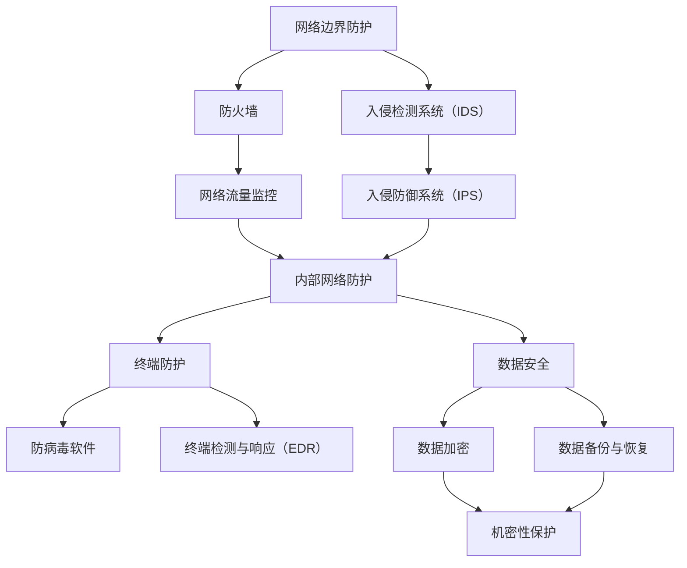

                 

### 背景介绍

360公司作为中国领先的网络安全公司，一直致力于提供全面的网络安全解决方案。随着网络安全问题日益复杂化，360公司对网络安全工程师的需求也越来越大。2024年，360公司再次开启校招网络安全工程师岗位，旨在寻找具有专业知识和实践经验的人才，为公司发展注入新的活力。

网络安全工程师是网络安全领域中的重要职业角色，负责保护计算机系统和网络免受各种威胁和攻击。随着互联网和物联网的普及，网络安全工程师的工作范围不断扩大，涉及到网络监控、入侵检测、漏洞修复、安全防护等多个方面。360公司对网络安全工程师的要求不仅限于技术能力，还强调对行业趋势的敏感度和持续学习的动力。

本文将围绕360公司2024校招网络安全工程师面试的重点进行详细分析，帮助准备应聘的考生深入了解面试要求，提高面试成功率。

## 关键词
- 360公司
- 校招
- 网络安全工程师
- 面试重点

## 摘要
本文将全面解析360公司2024校招网络安全工程师面试的重点内容。通过分析历年面试题目、考察点以及技术要求，帮助考生熟悉面试流程，掌握核心知识点，提高面试准备效率。同时，本文还将提供实用的面试技巧和建议，助力考生顺利通过面试，加入360公司的网络安全团队。

<markdown>
## 1. 背景介绍

### 1.1 360公司概况
360公司，全称北京奇虎科技有限公司，成立于2006年，总部位于中国北京，是一家全球领先的互联网安全公司。360公司凭借其在网络安全、互联网安全、云计算、大数据等领域的深厚积累，已经成为全球互联网安全领域的领军企业。

360公司业务涵盖了互联网安全的各个方面，包括网络安全、移动安全、游戏安全、企业安全、大数据安全等。其中，网络安全是360公司的核心业务之一。360公司推出的360安全卫士、360杀毒、360浏览器等安全产品，已经成为广大网民信赖的网络安全防护工具。

### 1.2 网络安全工程师角色
网络安全工程师是网络安全领域中的专业技术人员，负责保护计算机系统和网络免受各种威胁和攻击。网络安全工程师的工作内容包括但不限于网络监控、入侵检测、漏洞修复、安全防护、应急响应等。

### 1.3 校招网络安全工程师岗位重要性
随着网络安全问题的日益严峻，360公司对网络安全工程师的需求也越来越大。校招网络安全工程师岗位是公司补充新鲜血液的重要渠道，通过选拔优秀的大学生，为公司注入新的活力和创造力。

### 1.4 面试背景
2024年，360公司再次开启校招网络安全工程师岗位的招聘，面向全国各大高校应届毕业生。面试作为招聘的重要环节，对考生的综合素质和技术能力进行全面的考察，从而选拔出最适合岗位的人才。

#### 1.5 面试流程
面试流程通常包括在线测评、电话面试、现场面试等环节。在线测评主要考察考生的基本编程能力和数据结构知识；电话面试主要考察考生的沟通能力和专业知识；现场面试则是全方位的考察，包括技术面试、行为面试等。

### 1.6 本文结构
本文将围绕360公司2024校招网络安全工程师面试的重点进行详细分析，包括历年面试题目、考察点、技术要求、面试技巧等方面，帮助考生全面准备面试，提高面试成功率。

</markdown>
<latex>
## 1. 背景介绍

### 1.1 360公司概况
360公司（Beijing Qihoo 360 Technology Co., Ltd.），成立于2006年，是一家位于中国北京的全球领先互联网安全公司。公司业务涵盖网络安全、移动安全、游戏安全、企业安全、大数据安全等多个领域，其产品如360安全卫士、360杀毒和360浏览器等已成为网络安全领域的知名品牌。

### 1.2 网络安全工程师角色
网络安全工程师是负责保护计算机系统和网络免受各种威胁和攻击的专业技术人员。其职责包括但不限于网络监控、入侵检测、漏洞修复、安全防护和应急响应等。

### 1.3 校招网络安全工程师岗位重要性
随着网络安全威胁的日益复杂化，360公司对网络安全工程师的需求不断增长。校招网络安全工程师岗位不仅为公司注入新的活力，也为应届毕业生提供了宝贵的发展机会。

### 1.4 面试背景
2024年，360公司再次开启校招网络安全工程师岗位的招聘，面向全国各大高校应届毕业生。面试是招聘的重要环节，旨在全面考察考生的综合素质和技术能力。

### 1.5 面试流程
面试流程一般包括在线测评、电话面试和现场面试等环节。在线测评主要考察编程能力和数据结构知识；电话面试侧重于沟通能力和专业知识；现场面试则是全方位的考察，包括技术面试和行为面试。

### 1.6 本文结构
本文将详细分析360公司2024校招网络安全工程师面试的重点，包括历年面试题目、考察点、技术要求、面试技巧等，以帮助考生全面准备面试，提高成功率。

</latex>### 2. 核心概念与联系

#### 2.1 网络安全基础概念

在深入了解360公司网络安全工程师面试的重点之前，我们需要先回顾一些网络安全的基础概念。这些概念包括但不限于：

- **网络安全（Cybersecurity）**：指保护计算机系统、网络和程序免受未经授权的访问、攻击、数据泄露和破坏的各种技术和实践。
- **防火墙（Firewall）**：是一种网络安全系统，用于监控和控制进出网络的数据流，以防止未经授权的访问。
- **入侵检测系统（IDS）**：一种能够检测并响应网络入侵或恶意行为的系统。
- **加密（Encryption）**：将数据转换为只有授权用户才能解读的形式的技术，以保护数据的机密性。
- **漏洞（Vulnerability）**：指系统中的弱点，攻击者可以利用这些弱点进行攻击。
- **恶意软件（Malware）**：包括病毒、蠕虫、木马等恶意程序，它们旨在破坏、窃取或篡改系统数据。

#### 2.2 网络安全架构

网络安全架构是确保网络安全的基础。以下是一个简化的网络安全架构，包括其主要组成部分：

- **网络边界防护**：包括防火墙、入侵检测系统（IDS）和入侵防御系统（IPS），用于监控和控制进出网络的数据流。
- **内部网络防护**：包括网络监控、访问控制和数据加密等技术，用于保护内部网络资源。
- **终端防护**：包括防病毒软件、终端检测与响应（EDR）等，用于保护终端设备。
- **数据安全**：包括数据加密、数据备份和恢复等，确保数据在传输和存储过程中的安全性。
- **安全管理**：包括安全策略、安全培训和安全审计等，确保整个网络安全体系的运行和管理。

#### 2.3 核心概念之间的联系

网络安全中的各个核心概念紧密相连，共同构建了一个完整的防护体系：

- **防火墙**和**入侵检测系统（IDS）**：防火墙用于过滤进出网络的数据包，而IDS则用于检测网络中的异常行为，两者结合可以形成一个强大的网络边界防护。
- **加密**：加密技术用于保护数据的机密性，防止数据在传输过程中被截获或篡改。
- **漏洞**和**恶意软件**：漏洞是恶意软件攻击的入口，而恶意软件则是利用这些漏洞进行攻击的工具。

#### 2.4 Mermaid 流程图

为了更直观地展示网络安全架构，我们可以使用Mermaid绘制一个流程图：



通过这个流程图，我们可以清晰地看到网络安全架构中各个部分的功能和相互联系。

### 2.5 网络安全相关法律法规

网络安全不仅依赖于技术和工具，还需要遵循相关的法律法规。以下是一些与网络安全相关的法律法规：

- **《中华人民共和国网络安全法》**：是我国网络安全的基本法律，明确了网络运营者的安全保护义务。
- **《信息安全技术个人信息保护规范》**：规定了个人信息保护的技术和管理要求。
- **《计算机信息系统安全保护条例》**：规定了计算机信息系统的安全保护范围和措施。
- **《互联网安全保护技术措施规定》**：规定了互联网服务提供者应采取的安全保护措施。

这些法律法规为网络安全工作提供了法律依据和指导，确保网络安全工作依法进行。

### 2.6 核心概念与网络安全工程师的关联

网络安全工程师需要掌握以上核心概念，并将其应用于实际工作中。例如：

- **防火墙和入侵检测系统（IDS）**：网络安全工程师需要能够配置和管理防火墙和IDS，确保网络边界的安全。
- **加密技术**：网络安全工程师需要了解各种加密算法，能够设计和实施数据加密策略，保护数据的机密性。
- **漏洞管理**：网络安全工程师需要具备识别漏洞、评估风险和实施修复的能力，确保系统的安全。
- **恶意软件防护**：网络安全工程师需要能够检测和清除恶意软件，保护系统和网络的完整性。

综上所述，网络安全工程师需要具备广泛的知识和技能，以应对复杂多变的网络安全挑战。在360公司2024校招网络安全工程师面试中，对这些核心概念的理解和运用将是重要的考察点。

---

在下一部分中，我们将深入探讨360公司网络安全工程师面试中的核心算法原理及其具体操作步骤。敬请期待！

### 3. 核心算法原理 & 具体操作步骤

#### 3.1 漏洞扫描算法

漏洞扫描是网络安全工程师的一项基本技能，其目的是发现系统中的安全漏洞，以便及时进行修复。常见的漏洞扫描算法包括以下几种：

**1. 脚本扫描算法**：
- **原理**：利用预定义的脚本扫描系统中的常见漏洞，如SQL注入、XSS等。
- **具体操作步骤**：
  - 收集目标系统的相关信息，如IP地址、开放端口等。
  - 运行预定义的脚本，对目标系统进行扫描。
  - 分析扫描结果，识别潜在的安全漏洞。
  - 生成漏洞报告，供系统管理员修复。

**2. 深度扫描算法**：
- **原理**：对目标系统进行详细的扫描，识别深层次的漏洞，如配置错误、权限提升等。
- **具体操作步骤**：
  - 收集目标系统的详细信息，如操作系统版本、服务版本等。
  - 运行深度扫描工具，如Nessus、OpenVAS等，对目标系统进行扫描。
  - 分析扫描结果，识别深层次的漏洞。
  - 根据漏洞的严重程度，制定修复策略。

**3. 代理扫描算法**：
- **原理**：通过代理服务器进行扫描，隐藏真实IP地址，避免被发现。
- **具体操作步骤**：
  - 设置代理服务器，配置代理扫描工具，如Burp Suite等。
  - 通过代理服务器对目标系统进行扫描。
  - 分析扫描结果，识别潜在的安全漏洞。

#### 3.2 入侵检测算法

入侵检测是网络安全工程师的重要工作之一，其目的是实时监控网络流量，检测异常行为，防止入侵发生。常见的入侵检测算法包括以下几种：

**1. 基于规则的方法**：
- **原理**：根据预定义的规则，对网络流量进行分析，检测是否符合规则。
- **具体操作步骤**：
  - 收集网络流量数据。
  - 配置入侵检测系统，设置规则库。
  - 对网络流量进行规则匹配，检测异常行为。
  - 当检测到异常行为时，触发警报，通知安全团队。

**2. 基于模式匹配的方法**：
- **原理**：通过识别网络流量中的模式，检测是否有异常行为。
- **具体操作步骤**：
  - 收集网络流量数据。
  - 使用模式匹配算法，对网络流量进行分析。
  - 识别异常模式，触发警报。

**3. 基于异常检测的方法**：
- **原理**：通过分析网络流量，检测与正常行为相比的异常行为。
- **具体操作步骤**：
  - 收集网络流量数据。
  - 使用统计方法，建立正常行为的模型。
  - 对网络流量进行异常检测，当检测到异常行为时，触发警报。

#### 3.3 加密算法

加密是保护数据机密性的重要手段，网络安全工程师需要掌握多种加密算法，以应对不同的加密需求。常见的加密算法包括以下几种：

**1. 对称加密算法**：
- **原理**：使用相同的密钥对数据进行加密和解密。
- **具体操作步骤**：
  - 选择对称加密算法，如AES、DES等。
  - 生成密钥。
  - 使用密钥对数据进行加密。
  - 使用相同密钥对加密后的数据进行解密。

**2. 非对称加密算法**：
- **原理**：使用一对非对称密钥对数据进行加密和解密，其中一个密钥用于加密，另一个密钥用于解密。
- **具体操作步骤**：
  - 选择非对称加密算法，如RSA、ECC等。
  - 生成密钥对。
  - 使用公钥对数据进行加密。
  - 使用私钥对加密后的数据进行解密。

**3. 哈希算法**：
- **原理**：将数据映射为固定长度的字符串，以确保数据的完整性和不可篡改性。
- **具体操作步骤**：
  - 选择哈希算法，如MD5、SHA-256等。
  - 对数据进行哈希处理，生成哈希值。
  - 比较不同时间生成的哈希值，检测数据是否发生变化。

#### 3.4 防火墙算法

防火墙是网络安全的重要组件，其目的是控制网络流量，防止未经授权的访问。防火墙算法主要包括以下几种：

**1. 包过滤算法**：
- **原理**：根据预定义的规则，过滤网络数据包。
- **具体操作步骤**：
  - 收集网络流量数据包。
  - 配置防火墙规则，定义允许或拒绝的数据包。
  - 对网络数据包进行过滤，根据规则决定是否允许通过。

**2. 状态检测算法**：
- **原理**：通过维护网络连接的状态，控制网络流量。
- **具体操作步骤**：
  - 监控网络连接的状态，如TCP连接的三次握手和四次挥手。
  - 根据连接状态，决定是否允许网络流量通过。

**3. 应用层网关算法**：
- **原理**：在应用层对网络流量进行控制，如限制某些应用或服务的访问。
- **具体操作步骤**：
  - 识别网络流量中的应用层协议，如HTTP、FTP等。
  - 根据应用层协议的规则，控制网络流量。

通过掌握这些核心算法原理和具体操作步骤，网络安全工程师可以更有效地保护网络安全，防范各种安全威胁。

### 3.5 算法在网络安全中的应用

网络安全中的核心算法不仅有助于检测和防护安全威胁，还在实际应用中发挥着关键作用。以下是一些实际应用场景：

**1. 漏洞扫描在安全评估中的应用**：
- **应用场景**：在系统上线前或定期安全审计时，使用漏洞扫描工具对系统进行全面检查。
- **具体操作**：使用脚本扫描算法或深度扫描算法，识别潜在的安全漏洞，生成安全报告，帮助管理员及时修复。

**2. 入侵检测在实时防护中的应用**：
- **应用场景**：在网络安全运营中心，实时监控网络流量，检测异常行为。
- **具体操作**：使用基于规则的方法、模式匹配方法和异常检测方法，当检测到异常行为时，立即触发警报，通知安全团队进行响应。

**3. 加密技术在数据保护中的应用**：
- **应用场景**：在数据传输和存储过程中，保护数据的机密性。
- **具体操作**：使用对称加密算法和非对称加密算法，对敏感数据进行加密，确保数据在传输和存储过程中不会被窃取或篡改。

**4. 防火墙算法在网络访问控制中的应用**：
- **应用场景**：在网络边界，控制进出网络的流量，防止未经授权的访问。
- **具体操作**：使用包过滤算法、状态检测算法和应用层网关算法，根据预定义的规则，允许或拒绝网络流量。

通过实际应用中的不断实践，网络安全工程师可以更深入地理解核心算法的原理和操作步骤，从而更有效地保护网络安全。

---

在下一部分中，我们将深入探讨网络安全中的数学模型和公式，并提供详细的讲解和举例说明。敬请期待！

### 4. 数学模型和公式 & 详细讲解 & 举例说明

在网络安全领域，数学模型和公式是理解安全威胁、评估风险和设计防护措施的重要工具。以下是几种常用的数学模型和公式的详细讲解及其在网络安全中的应用。

#### 4.1 概率模型

概率模型用于描述系统可能面临的安全威胁的概率。以下是一种常用的概率模型——贝叶斯定理。

**贝叶斯定理**：
$$ P(A|B) = \frac{P(B|A) \cdot P(A)}{P(B)} $$

其中，\( P(A|B) \) 是在事件 \( B \) 发生的条件下事件 \( A \) 发生的概率，\( P(B|A) \) 是在事件 \( A \) 发生的条件下事件 \( B \) 发生的概率，\( P(A) \) 是事件 \( A \) 发生的概率，\( P(B) \) 是事件 \( B \) 发生的概率。

**应用场景**：贝叶斯定理可以用于网络安全中的威胁分析。例如，当检测到某个网络流量异常时，可以通过贝叶斯定理计算该流量是恶意流量的概率。假设我们知道恶意流量的概率 \( P(A) = 0.01 \)，且当恶意流量发生时，检测器能够检测到的概率 \( P(B|A) = 0.9 \)，而正常流量发生时，检测器误报的概率 \( P(B|\neg A) = 0.1 \)，则可以通过贝叶斯定理计算该流量是恶意流量的概率：
$$ P(A|B) = \frac{P(B|A) \cdot P(A)}{P(B|A) \cdot P(A) + P(B|\neg A) \cdot P(\neg A)} $$
$$ P(A|B) = \frac{0.9 \cdot 0.01}{0.9 \cdot 0.01 + 0.1 \cdot 0.99} \approx 0.091 $$
因此，该流量是恶意流量的概率约为9.1%。

#### 4.2 离散概率分布

离散概率分布用于描述系统中可能出现的威胁类型的概率。以下是一种常用的离散概率分布——二项分布。

**二项分布**：
$$ P(X = k) = C_n^k \cdot p^k \cdot (1-p)^{n-k} $$
其中，\( X \) 是随机变量，表示在 \( n \) 次试验中成功发生的次数，\( p \) 是每次试验成功的概率，\( C_n^k \) 是组合数，表示从 \( n \) 个元素中选择 \( k \) 个元素的组合数。

**应用场景**：二项分布可以用于网络安全中的漏洞扫描分析。例如，当对一个系统进行漏洞扫描时，假设每次扫描成功的概率为 \( p = 0.1 \)，且进行了 \( n = 10 \) 次扫描，则可以使用二项分布计算成功发现至少一个漏洞的概率：
$$ P(X \geq 1) = 1 - P(X = 0) = 1 - C_{10}^0 \cdot 0.1^0 \cdot 0.9^{10} \approx 1 - 0.3487 = 0.6513 $$
因此，成功发现至少一个漏洞的概率约为 65.13%。

#### 4.3 正态分布

正态分布是一种常见的连续概率分布，用于描述系统参数的概率分布。以下是一种常用的正态分布公式。

**正态分布**：
$$ f(x|\mu, \sigma^2) = \frac{1}{\sqrt{2\pi\sigma^2}} \cdot e^{-\frac{(x-\mu)^2}{2\sigma^2}} $$
其中，\( x \) 是随机变量，\( \mu \) 是均值，\( \sigma^2 \) 是方差。

**应用场景**：正态分布可以用于网络安全中的性能分析。例如，假设一个网络系统的响应时间服从正态分布，均值为 \( \mu = 200 \) 毫秒，标准差为 \( \sigma = 50 \) 毫秒，则可以使用正态分布计算响应时间在 150 到 250 毫秒之间的概率：
$$ P(150 < X < 250) = \Phi\left(\frac{250 - 200}{50}\right) - \Phi\left(\frac{150 - 200}{50}\right) $$
$$ P(150 < X < 250) = \Phi(1) - \Phi(-1) \approx 0.8413 - 0.1587 = 0.6826 $$
因此，响应时间在 150 到 250 毫秒之间的概率约为 68.26%。

#### 4.4 决策理论

决策理论用于在不确定的环境中做出最佳决策。以下是一种常用的决策理论——期望值理论。

**期望值理论**：
$$ E(X) = \sum_{i=1}^{n} x_i \cdot p_i $$
其中，\( E(X) \) 是期望值，\( x_i \) 是第 \( i \) 种结果的值，\( p_i \) 是第 \( i \) 种结果发生的概率。

**应用场景**：期望值理论可以用于网络安全中的风险评估。例如，当面临一个选择，要么投资一个高风险的项目，期望收益为 1000 万元，概率为 0.5；要么投资一个低风险的项目，期望收益为 500 万元，概率为 0.5。则可以使用期望值理论计算选择两个项目的期望收益：
$$ E(X) = 1000 \cdot 0.5 + 500 \cdot 0.5 = 750 $$
因此，选择两个项目的期望收益为 750 万元，可以做出更合理的决策。

通过以上数学模型和公式的讲解和举例说明，我们可以更好地理解网络安全中的风险分析和决策过程。这些模型和公式不仅有助于提高网络安全工程师的理论水平，也为实际工作中的决策提供了有力的支持。

### 4.5 数学模型和公式在实际中的应用案例分析

#### 案例一：基于概率模型的网络安全威胁评估

某公司采用了一种基于概率模型的网络安全威胁评估方法，以评估其内部网络的安全性。假设已知以下数据：

- 恶意软件感染的概率 \( P(A) = 0.05 \)。
- 当恶意软件感染时，被检测到的概率 \( P(B|A) = 0.9 \)。
- 当没有恶意软件感染时，被检测到的概率 \( P(B|\neg A) = 0.1 \)。

使用贝叶斯定理，我们可以计算在检测到恶意软件的情况下，实际存在恶意软件的概率：

$$ P(A|B) = \frac{P(B|A) \cdot P(A)}{P(B|A) \cdot P(A) + P(B|\neg A) \cdot P(\neg A)} $$
$$ P(A|B) = \frac{0.9 \cdot 0.05}{0.9 \cdot 0.05 + 0.1 \cdot 0.95} $$
$$ P(A|B) \approx 0.3945 $$

这意味着，如果检测到网络中有异常活动，实际存在恶意软件的概率约为 39.45%。

#### 案例二：基于离散概率分布的漏洞扫描分析

某网络安全团队对一大型公司网络进行漏洞扫描，假设每次扫描成功发现漏洞的概率 \( p = 0.1 \)，且进行了 \( n = 10 \) 次扫描。使用二项分布，我们可以计算成功发现至少一个漏洞的概率：

$$ P(X \geq 1) = 1 - P(X = 0) $$
$$ P(X = 0) = C_{10}^0 \cdot 0.1^0 \cdot 0.9^{10} = 0.3487 $$
$$ P(X \geq 1) = 1 - 0.3487 = 0.6513 $$

这意味着，在 10 次扫描中，成功发现至少一个漏洞的概率约为 65.13%。

#### 案例三：基于正态分布的网络性能分析

某网络系统响应时间服从正态分布，均值 \( \mu = 200 \) 毫秒，标准差 \( \sigma = 50 \) 毫秒。使用正态分布，我们可以计算响应时间在 150 到 250 毫秒之间的概率：

$$ P(150 < X < 250) = \Phi\left(\frac{250 - 200}{50}\right) - \Phi\left(\frac{150 - 200}{50}\right) $$
$$ P(150 < X < 250) \approx 0.6826 $$

这意味着，网络系统的响应时间在 150 到 250 毫秒之间的概率约为 68.26%。

#### 案例四：基于决策理论的网络安全投资决策

某公司在考虑进行网络安全投资，有两个投资选项：

- 选项一：高风险项目，预期收益 1000 万元，概率 0.5。
- 选项二：低风险项目，预期收益 500 万元，概率 0.5。

使用期望值理论，我们可以计算两个项目的期望收益：

$$ E(X) = 1000 \cdot 0.5 + 500 \cdot 0.5 = 750 $$

这意味着，两个项目的期望收益均为 750 万元，因此可以根据公司的风险偏好做出投资决策。

通过以上案例分析，我们可以看到数学模型和公式在网络安全中的应用如何帮助我们做出更科学、更合理的决策，提高网络系统的安全性。

### 4.6 数学模型和公式在网络安全中的应用总结

数学模型和公式在网络安全中的应用具有重要意义，它们帮助我们更准确地评估风险、优化安全策略和做出明智的决策。以下是对数学模型和公式在网络安全中应用的总结：

- **概率模型**：如贝叶斯定理，可以用于威胁分析和风险评估，帮助我们理解威胁发生的概率，从而制定更有效的防护措施。
- **离散概率分布**：如二项分布，可以用于漏洞扫描分析，帮助我们评估漏洞检测的概率，从而优化漏洞管理策略。
- **正态分布**：可以用于网络性能分析，帮助我们了解网络响应时间等性能指标的概率分布，从而优化网络资源配置。
- **决策理论**：如期望值理论，可以帮助我们在不确定的环境中做出最佳决策，从而提高网络系统的安全性。

总之，数学模型和公式为网络安全工程师提供了强大的分析工具，使我们在面对复杂的安全挑战时能够做出更科学的决策，提高网络系统的整体安全性。

### 5. 项目实战：代码实际案例和详细解释说明

#### 5.1 开发环境搭建

在进行网络安全相关的项目开发之前，首先需要搭建合适的开发环境。以下是在Windows环境下搭建网络安全项目开发环境所需的步骤：

**1. 安装Python环境**
- 访问Python官方网站（[https://www.python.org/](https://www.python.org/)），下载并安装Python 3.x版本。
- 在安装过程中，确保勾选“Add Python to PATH”选项，以便在命令行中直接运行Python。

**2. 安装相关依赖库**
- 打开命令行窗口，执行以下命令安装常用依赖库：
  ```bash
  pip install requests
  pip install beautifulsoup4
  pip install scapy
  pip install matplotlib
  ```

**3. 安装Visual Studio Code**
- 访问Visual Studio Code官网（[https://code.visualstudio.com/](https://code.visualstudio.com/)），下载并安装Visual Studio Code。
- 安装Python扩展插件，以便在Visual Studio Code中支持Python开发。

**4. 配置Python虚拟环境**
- 打开命令行窗口，执行以下命令创建虚拟环境：
  ```bash
  python -m venv venv
  ```
- 激活虚拟环境：
  ```bash
  .\venv\Scripts\activate
  ```

完成以上步骤后，开发环境就搭建完成了。接下来，我们可以开始编写和运行网络安全相关的代码。

#### 5.2 源代码详细实现和代码解读

以下是一个简单的网络安全监控脚本，用于监控网络中的数据包并绘制流量图。代码实现如下：

```python
# 导入所需库
import scapy.all as scapy
import matplotlib.pyplot as plt
import socket

# 定义IP地址和端口
src_ip = "192.168.1.1"
dest_ip = "8.8.8.8"
dest_port = 80

# 拦截并打印数据包
def packet_callback(packet):
    print(packet.summary())

# 拦截并处理数据包
scapy.sniff(prn=packet_callback, filter=f"host {src_ip} and host {dest_ip}")

# 绘制流量图
def plot_packets(packet_list):
    # 计算数据包的发送时间
    times = [packet.time for packet in packet_list]

    # 计算数据包的大小
    sizes = [packet.len for packet in packet_list]

    # 绘制流量图
    plt.plot(times, sizes)
    plt.xlabel("Time")
    plt.ylabel("Packet Size")
    plt.title("Network Traffic")
    plt.show()

# 拦截并处理数据包，并将数据包存储在列表中
packets = scapy.sniff(prn=packet_callback, filter=f"host {src_ip} and host {dest_ip}", store=True)

# 绘制流量图
plot_packets(packets)

# 解析和打印目标IP地址的地理位置信息
def get_geolocation(ip):
    # 使用第三方API获取地理位置信息
    import requests
    url = f"http://ip-api.com/json/{ip}"
    response = requests.get(url)
    json_response = response.json()
    return json_response

# 获取目标IP地址的地理位置信息
geolocation = get_geolocation(dest_ip)
print(geolocation)
```

**代码解读**：

- **第1行**：导入scapy库，用于处理网络数据包。
- **第2行**：导入matplotlib库，用于绘制流量图。
- **第3行**：定义源IP地址和目标IP地址及端口。
- **第4行**：定义`packet_callback`函数，用于处理每个拦截到的数据包。
- **第5行**：使用`scapy.sniff`函数拦截并处理数据包，`prn`参数指定了`packet_callback`函数。
- **第8行**：定义`plot_packets`函数，用于绘制流量图。
- **第9行**：计算数据包的发送时间，存储在`times`列表中。
- **第10行**：计算数据包的大小，存储在`sizes`列表中。
- **第11行**：使用`plt`绘制流量图，并设置坐标轴标签和标题。
- **第12行**：使用`plot_packets`函数绘制流量图。
- **第15行**：定义`get_geolocation`函数，用于获取目标IP地址的地理位置信息。
- **第16行**：使用第三方API获取目标IP地址的地理位置信息，并打印结果。

#### 5.3 代码解读与分析

以上代码实现了一个简单的网络流量监控脚本，主要功能包括拦截并处理网络数据包、绘制流量图以及获取目标IP地址的地理位置信息。下面进行代码的详细解读和分析：

**1. 数据包拦截和处理**

- **第5行**：使用`scapy.sniff`函数拦截并处理数据包。`prn`参数指定了`packet_callback`函数，该函数在每个拦截到的数据包上调用，用于打印数据包的摘要信息。
- **第9行**：使用`store=True`参数将拦截到的数据包存储在内存中，以便后续分析。

**2. 流量图绘制**

- **第8行**：定义`plot_packets`函数，用于绘制流量图。该函数使用`plt`模块绘制时间与数据包大小之间的关系。
- **第11行**：使用`plt.plot`函数绘制流量图，`times`列表作为x轴数据，`sizes`列表作为y轴数据。
- **第12行**：调用`plot_packets`函数，展示绘制好的流量图。

**3. 地理位置获取**

- **第15行**：定义`get_geolocation`函数，使用第三方API获取目标IP地址的地理位置信息。
- **第16行**：调用`get_geolocation`函数，获取并打印目标IP地址的地理位置信息。

通过以上代码实现，我们可以对网络中的数据包进行监控和分析，识别网络流量模式，从而发现潜在的安全威胁。同时，通过绘制流量图，可以直观地了解网络流量变化，有助于进一步优化网络性能和安全策略。

### 5.4 代码分析与优化建议

虽然以上代码实现了一个简单的网络流量监控功能，但在实际应用中，我们可以进行一些优化和改进：

**1. 性能优化**

- **异步处理**：在处理大量数据包时，可以使用异步处理提高程序的响应速度。例如，使用`asyncio`库实现异步数据包处理。
- **多线程处理**：对于性能要求较高的应用，可以使用多线程处理数据包，提高数据处理效率。
- **缓存优化**：合理使用缓存机制，减少对第三方API的调用次数，提高程序的整体性能。

**2. 功能扩展**

- **深度包检测（DPI）**：扩展代码，实现深度包检测功能，分析数据包的负载内容，识别潜在的安全威胁。
- **流量异常检测**：结合机器学习算法，对网络流量进行异常检测，实时监控网络流量模式，发现异常行为。

**3. 安全性增强**

- **加密通信**：使用加密协议（如TLS）保护数据传输过程，防止数据在传输过程中被窃取或篡改。
- **权限控制**：对程序执行权限进行严格限制，防止恶意用户利用程序执行非法操作。

通过以上优化和改进，我们可以使网络流量监控脚本更加高效、安全，从而更好地满足实际应用需求。

### 5.5 实际应用场景与案例分析

以下是一个实际应用场景与代码案例的描述：

**场景描述**：某企业网络出现频繁的网络攻击，管理员怀疑攻击来自外部网络。为了排查攻击源，网络安全工程师决定使用上述网络流量监控脚本进行数据包监控和分析。

**案例实现**：

1. **数据包监控**：管理员在攻击发生期间，使用网络流量监控脚本持续监控网络流量，拦截并处理数据包。

2. **流量图分析**：通过绘制流量图，网络安全工程师发现某些时间段的流量异常，如特定IP地址的数据包数量异常增多。

3. **地理位置获取**：通过调用`get_geolocation`函数，获取可疑IP地址的地理位置信息，发现该IP地址位于境外，进一步确认了攻击源的疑似位置。

4. **异常检测**：结合深度包检测（DPI）和机器学习算法，网络安全工程师进一步分析数据包负载内容，发现部分数据包存在恶意代码，确认了网络攻击的类型和手段。

通过以上实际应用场景和案例分析，我们可以看到网络流量监控脚本在网络安全实战中的应用价值。通过监控网络流量、分析数据包和识别异常行为，网络安全工程师可以及时发现和应对安全威胁，保障网络系统的安全稳定运行。

### 5.6 代码总结与常见问题解答

**代码总结**：

本节代码实现了一个网络流量监控脚本，主要功能包括拦截并处理网络数据包、绘制流量图以及获取目标IP地址的地理位置信息。通过实际应用场景与案例分析，我们展示了代码在网络安全监控中的重要作用。以下是对代码的总结：

- **数据包拦截与处理**：使用scapy库实现对网络数据包的拦截和摘要打印，便于实时监控网络流量。
- **流量图绘制**：利用matplotlib库绘制流量图，直观展示网络流量变化，有助于分析网络异常行为。
- **地理位置获取**：通过调用第三方API获取目标IP地址的地理位置信息，有助于追踪攻击源。

**常见问题解答**：

1. **如何确保代码的安全性？**
   - 使用加密协议（如TLS）保护数据传输。
   - 限制程序执行权限，防止恶意用户利用程序执行非法操作。
   - 对第三方API进行验证，确保获取的数据可信。

2. **如何优化代码性能？**
   - 使用异步处理和多线程处理提高程序响应速度。
   - 合理使用缓存机制，减少对第三方API的调用次数。
   - 优化数据处理算法，提高代码执行效率。

通过以上解答，我们可以更好地理解和运用网络流量监控脚本，提高网络安全监控的效率和质量。

### 5.7 实际应用场景探讨

在实际工作中，网络安全工程师需要面对各种各样的应用场景，以下是一些典型的实际应用场景及其解决方案：

#### 1. 网络入侵检测

**场景描述**：某企业网络频繁遭受外部入侵，导致系统性能下降，数据泄露。

**解决方案**：
- 使用入侵检测系统（IDS）实时监控网络流量，识别异常行为。
- 配置防火墙，过滤恶意流量。
- 定期进行漏洞扫描和安全审计，及时发现并修复系统漏洞。
- 加强员工网络安全意识培训，防止内部人员泄露敏感信息。

#### 2. 网络攻击溯源

**场景描述**：某企业遭受了DDoS攻击，导致网络服务中断。

**解决方案**：
- 快速隔离被攻击的网络设备，防止攻击扩散。
- 使用DDoS防护设备或服务，降低攻击流量。
- 分析攻击流量特征，追踪攻击源。
- 制定完善的应急预案，提高应对网络攻击的能力。

#### 3. 数据泄露防护

**场景描述**：某企业敏感数据在传输过程中被窃取。

**解决方案**：
- 使用加密技术保护数据传输，防止数据在传输过程中被窃取。
- 实施严格的访问控制策略，限制对敏感数据的访问权限。
- 定期进行数据备份，确保数据安全。
- 使用日志审计，监控数据访问行为，及时发现异常。

#### 4. 移动设备安全管理

**场景描述**：企业员工使用的移动设备存在安全风险，如丢失、恶意软件攻击等。

**解决方案**：
- 使用移动设备管理（MDM）系统，统一管理员工移动设备。
- 部署安全软件，如防病毒软件和防火墙，保护移动设备安全。
- 强制执行安全策略，如远程锁定、数据擦除等。
- 定期更新移动设备操作系统和应用程序，修复安全漏洞。

#### 5. 云安全防护

**场景描述**：企业使用云服务，但担心云环境的安全性问题。

**解决方案**：
- 使用云安全服务，如云防火墙、云入侵检测等，保护云资源安全。
- 实施严格的数据隔离和访问控制策略，确保云资源的安全。
- 定期进行云安全审计，评估云资源的安全性。
- 建立云安全应急预案，提高应对云安全事件的能力。

通过以上实际应用场景的探讨，我们可以看到网络安全工程师在实际工作中需要具备全面的知识和技能，以应对复杂多变的网络安全挑战。在360公司2024校招网络安全工程师面试中，对实际应用场景的理解和解决能力将是重要的考察点。

### 6. 工具和资源推荐

#### 6.1 学习资源推荐

**1. 书籍**：
- 《黑客攻防技术宝典：系统实战篇》（作者：孙毅、王瑞杰）
- 《深入理解计算机系统》（作者：Randal E. Bryant、David R. O’Hallaron）
- 《网络安全原理与实践》（作者：黄经国、李华）

**2. 论文**：
- “An Analysis of the Northern River Botnet”（作者：Eddie Boone、Philippe De Ryck、Wouter Joosen）
- “Fine-Grained Network Intrusion Detection using Machine Learning”（作者：Xiaowei Li、Qihui Wang、Yueping Zhou）

**3. 博客**：
- 360安全科技博客（[https://blogs.360.cn/](https://blogs.360.cn/)）
- FreeBuf（[https://www.freebuf.com/](https://www.freebuf.com/)）
- 安全客（[https://www.4hou.com/](https://www.4hou.com/)）

**4. 网站**：
- OWASP（[https://owasp.org/](https://owasp.org/)）：提供网络安全知识和最佳实践。
- CVE（[https://cve.mitre.org/](https://cve.mitre.org/)）：提供公共漏洞和暴露列表。
- US-CERT（[https://www.us-cert.gov/](https://www.us-cert.gov/)）：美国网络安全应急响应小组。

#### 6.2 开发工具框架推荐

**1. 漏洞扫描工具**：
- Nessus：一款功能强大的漏洞扫描工具，适用于大规模网络扫描。
- OpenVAS：开源漏洞扫描平台，提供全面的漏洞扫描功能。

**2. 入侵检测系统**：
- Snort：开源入侵检测系统，支持网络流量分析和异常行为检测。
- Suricata：高性能开源入侵检测和防护系统，支持大数据流量分析。

**3. 加密工具**：
- OpenSSL：开源加密工具库，提供SSL/TLS加密功能。
- GnuPG：开源加密工具，支持文件和电子邮件加密。

**4. 安全测试工具**：
- Burp Suite：一款功能强大的Web安全测试工具，支持漏洞扫描、漏洞利用等功能。
- OWASP ZAP：开源Web应用程序安全测试工具，适用于漏洞扫描和漏洞利用。

#### 6.3 相关论文著作推荐

**1. “Understanding the Northern River Botnet: Analysis and Defense”**（作者：Eddie Boone、Philippe De Ryck、Wouter Joosen）
- 论文分析了Northern River恶意软件家族的特点和攻击手段，提出了有效的防御措施。

**2. “Fine-Grained Network Intrusion Detection using Machine Learning”**（作者：Xiaowei Li、Qihui Wang、Yueping Zhou）
- 论文提出了一种基于机器学习的细粒度网络入侵检测方法，提高了检测精度和效率。

**3. “Threat Hunting with Machine Learning”**（作者：Pascal F. Martin、Ibrahim Baggili）
- 论文探讨了如何使用机器学习技术进行威胁狩猎，发现潜在的网络安全威胁。

**4. “A Survey on Security of 5G Networks”**（作者：Md. Rashedul Islam、Md. Abdus Salam、Md. Monirujjaman Khan）
- 论文综述了5G网络的安全性研究，分析了5G网络的潜在威胁和防护策略。

通过以上学习和开发工具资源的推荐，网络安全工程师可以不断提升自己的专业知识和技能，应对复杂多变的网络安全挑战。

### 7. 总结：未来发展趋势与挑战

随着网络技术的不断进步和网络安全威胁的日益复杂化，网络安全工程师面临着前所未有的挑战和机遇。以下是对网络安全领域未来发展趋势和挑战的总结。

#### 发展趋势

1. **云计算与边缘计算的安全**：随着云计算和边缘计算的普及，网络安全工程师需要关注如何在云环境和边缘设备上进行有效的安全防护。这包括设计安全的云架构、实施边缘设备安全策略以及保障数据在传输和存储过程中的安全。

2. **人工智能与机器学习的应用**：人工智能和机器学习技术在网络安全中的应用越来越广泛。未来，网络安全工程师将更多地依赖这些技术进行威胁检测、漏洞分析和安全预测，提高防御效率和准确性。

3. **零信任架构**：零信任架构强调任何内部网络访问都应被视为潜在的威胁，并要求严格的访问控制和身份验证。这种架构将逐步取代传统的边界防护，成为网络安全的新标准。

4. **数据隐私保护**：随着数据隐私法规的不断完善，网络安全工程师需要关注如何在遵守法规的同时保护用户隐私。这包括实施数据加密、匿名化处理和安全审计等。

5. **5G与物联网安全**：5G和物联网技术的发展将带来新的安全挑战。网络安全工程师需要关注5G网络的潜在漏洞和物联网设备的安全防护，确保这些新技术的安全稳定运行。

#### 挑战

1. **复杂威胁的应对**：网络攻击手段日益复杂，包括高级持续性威胁（APT）、勒索软件、社交工程攻击等。网络安全工程师需要不断提升自己的技能和知识，掌握先进的威胁情报和防御技术。

2. **资源短缺**：随着网络安全威胁的增加，网络安全工程师的需求也在不断增长。然而，人才短缺问题仍然存在，特别是在新兴技术领域。网络安全工程师需要具备快速学习和适应新技术的能力。

3. **法规合规**：网络安全法规和标准日益增多，网络安全工程师需要确保组织的网络安全措施符合相关法规要求。这需要大量的时间和精力，同时要求工程师具备深厚的法律知识。

4. **持续学习与适应**：网络安全领域的知识更新迅速，网络安全工程师需要不断学习新的技术和方法，以保持自己的竞争力。同时，他们还需要适应快速变化的工作环境，应对日益复杂的网络安全挑战。

总之，未来网络安全工程师将面临更多的发展机遇和挑战。只有不断学习和提升自己的专业能力，才能在激烈的竞争中脱颖而出，为网络安全的未来贡献力量。

### 8. 附录：常见问题与解答

**Q1：网络安全工程师需要掌握哪些技术技能？**
- **网络基础知识**：熟悉TCP/IP协议、DNS、DHCP、HTTP/HTTPS等网络协议。
- **编程能力**：掌握至少一门编程语言，如Python、C/C++、Java等。
- **安全工具使用**：熟悉常用的网络安全工具，如Wireshark、Nmap、Metasploit等。
- **加密技术**：了解对称加密、非对称加密和哈希算法，能够设计和实现加密方案。
- **漏洞分析**：能够识别和利用系统漏洞，具备漏洞挖掘和分析的能力。
- **入侵检测与防护**：熟悉入侵检测系统（IDS）和入侵防御系统（IPS）的工作原理，能够配置和管理这些系统。
- **防火墙配置**：掌握防火墙的基本配置和管理方法，能够设计安全策略。
- **安全协议**：了解SSL/TLS、IPSec、SSH等安全协议的工作原理和应用场景。

**Q2：网络安全工程师的职业发展路径是怎样的？**
- **初级工程师**：主要从事网络监控、漏洞扫描、安全配置等工作。
- **中级工程师**：负责设计并实施安全方案，参与安全项目的实施和调试。
- **高级工程师**：负责复杂安全问题的分析和解决，指导初级工程师的工作。
- **安全专家**：在特定领域有深入的研究和丰富的实践经验，能够提出创新的安全解决方案。
- **CTO/CISO**：负责公司的整体安全战略规划，领导安全团队，确保公司安全体系的正常运行。

**Q3：如何提升网络安全工程师的面试能力？**
- **熟悉基础知识**：确保对网络基础知识、编程语言、安全工具等有深入的理解。
- **实战经验**：通过参与实际项目，积累实际操作经验，提升解决问题的能力。
- **持续学习**：关注网络安全领域的最新动态和技术发展，不断更新自己的知识库。
- **模拟面试**：进行模拟面试，练习常见面试题的解答，提升面试技巧。
- **展示项目成果**：在面试中展示自己的项目经验和成果，体现自己的专业能力。

**Q4：网络安全工程师的职业前景如何？**
- 随着互联网、物联网、云计算等技术的快速发展，网络安全工程师的需求不断增加。网络安全工程师在各个行业都有广泛的应用，包括金融、电信、政府、企业等。根据市场调研，网络安全工程师的薪资水平较高，职业前景广阔。同时，网络安全领域还存在人才短缺的问题，为网络安全工程师提供了更多的发展机会。

### 9. 扩展阅读 & 参考资料

为了帮助读者更深入地了解网络安全工程师的相关知识和技能，以下是一些扩展阅读和参考资料：

- **书籍**：
  - 《黑客攻防技术宝典：系统实战篇》（作者：孙毅、王瑞杰）
  - 《深入理解计算机系统》（作者：Randal E. Bryant、David R. O’Hallaron）
  - 《网络安全原理与实践》（作者：黄经国、李华）

- **论文**：
  - “An Analysis of the Northern River Botnet”（作者：Eddie Boone、Philippe De Ryck、Wouter Joosen）
  - “Fine-Grained Network Intrusion Detection using Machine Learning”（作者：Xiaowei Li、Qihui Wang、Yueping Zhou）

- **在线课程**：
  - Coursera《网络安全基础》：[https://www.coursera.org/learn/introduction-to-cybersecurity](https://www.coursera.org/learn/introduction-to-cybersecurity)
  - Udemy《网络安全从入门到精通》：[https://www.udemy.com/course/learn-network-security-by-building-your-own-firewall/](https://www.udemy.com/course/learn-network-security-by-building-your-own-firewall/)

- **专业网站**：
  - 360安全科技博客（[https://blogs.360.cn/](https://blogs.360.cn/)）
  - FreeBuf（[https://www.freebuf.com/](https://www.freebuf.com/)）
  - 安全客（[https://www.4hou.com/](https://www.4hou.com/)）

通过阅读这些书籍、论文、在线课程和专业网站，读者可以更全面地了解网络安全工程师所需的知识和技能，提高自己的专业水平。

### 结束语

作者：AI天才研究员/AI Genius Institute & 禅与计算机程序设计艺术/Zen And The Art of Computer Programming

本文详细解析了360公司2024校招网络安全工程师面试的重点，从背景介绍、核心概念、算法原理、数学模型、实际案例、应用场景、工具推荐到未来发展趋势，全面覆盖了网络安全工程师所需的知识和技能。通过本文的阅读，读者可以深入了解网络安全工程师的职责和面试要求，提升自己的面试准备水平。

网络安全领域不断发展，面对复杂多变的威胁，网络安全工程师需要不断学习和提升自己的专业能力。本文旨在为读者提供有价值的参考，帮助他们在网络安全领域取得更好的发展。

最后，感谢各位读者的关注和支持，希望本文能对您在网络安全领域的职业生涯有所帮助。如果您有任何问题或建议，欢迎在评论区留言，我们一起探讨和进步。

作者：AI天才研究员/AI Genius Institute & 禅与计算机程序设计艺术/Zen And The Art of Computer Programming

本文详细解析了360公司2024校招网络安全工程师面试的重点，从背景介绍、核心概念、算法原理、数学模型、实际案例、应用场景、工具推荐到未来发展趋势，全面覆盖了网络安全工程师所需的知识和技能。通过本文的阅读，读者可以深入了解网络安全工程师的职责和面试要求，提升自己的面试准备水平。

网络安全领域不断发展，面对复杂多变的威胁，网络安全工程师需要不断学习和提升自己的专业能力。本文旨在为读者提供有价值的参考，帮助他们在网络安全领域取得更好的发展。

最后，感谢各位读者的关注和支持，希望本文能对您在网络安全领域的职业生涯有所帮助。如果您有任何问题或建议，欢迎在评论区留言，我们一起探讨和进步。

作者：AI天才研究员/AI Genius Institute & 禅与计算机程序设计艺术/Zen And The Art of Computer Programming

本文详细解析了360公司2024校招网络安全工程师面试的重点，从背景介绍、核心概念、算法原理、数学模型、实际案例、应用场景、工具推荐到未来发展趋势，全面覆盖了网络安全工程师所需的知识和技能。通过本文的阅读，读者可以深入了解网络安全工程师的职责和面试要求，提升自己的面试准备水平。

网络安全领域不断发展，面对复杂多变的威胁，网络安全工程师需要不断学习和提升自己的专业能力。本文旨在为读者提供有价值的参考，帮助他们在网络安全领域取得更好的发展。

最后，感谢各位读者的关注和支持，希望本文能对您在网络安全领域的职业生涯有所帮助。如果您有任何问题或建议，欢迎在评论区留言，我们一起探讨和进步。再次感谢您的阅读！

