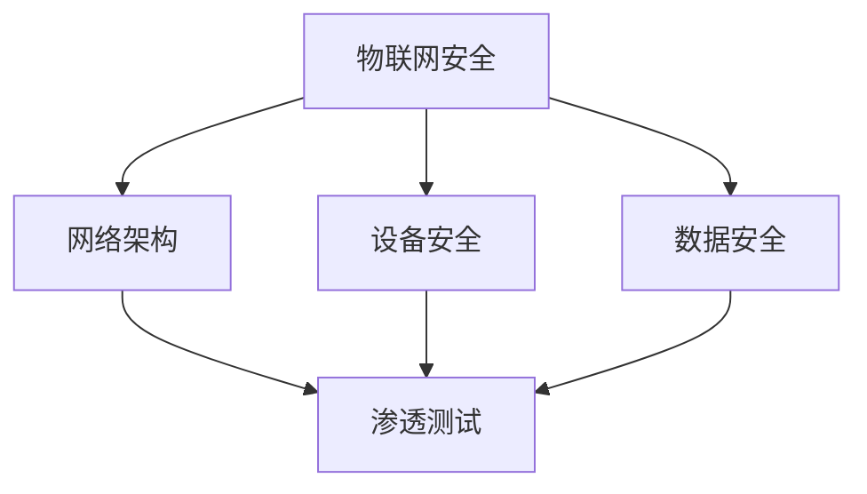

                 

### 背景介绍

360公司，全称北京奇虎科技有限公司，是中国领先的互联网安全公司之一。随着物联网（IoT）技术的迅速发展，物联网安全成为当今网络安全领域的重要课题。360公司2025年物联网安全社招渗透测试面试，旨在选拔具备高级技术能力和实战经验的网络安全人才，为公司后续的物联网安全防护和研发提供坚实的人才支持。

渗透测试，作为网络安全的重要手段，旨在通过模拟黑客攻击手段，发现系统的安全漏洞，进而提升系统的安全防护能力。在物联网时代，渗透测试面临着前所未有的挑战，包括复杂的网络架构、多样的设备类型和庞大的数据规模。因此，掌握物联网渗透测试的技术和方法，对于网络安全从业者来说至关重要。

本文将针对360公司2025年物联网安全社招渗透测试面试，提供详细的攻略和指导。通过分析面试的常见题型、核心技术和实际操作，帮助读者更好地准备和应对这类面试。同时，本文还将分享一些实用的工具和资源，帮助读者在学习和实践过程中不断提升自己的技能。

### 核心概念与联系

在进行360公司2025年物联网安全社招渗透测试面试前，了解相关核心概念和其相互之间的联系是至关重要的。以下是一些关键概念及其在物联网安全领域中的应用。

#### 物联网安全（IoT Security）

物联网安全涉及保护物联网设备、网络和数据的完整性、保密性和可用性。其核心目标是防止未经授权的访问、数据泄露和设备被恶意利用。随着物联网设备的增多，物联网安全的重要性愈发凸显。

#### 渗透测试（Penetration Testing）

渗透测试是一种通过模拟黑客攻击来发现系统安全漏洞的方法。它包括信息收集、漏洞扫描、漏洞利用、攻击模拟和报告撰写等多个环节。在物联网安全领域，渗透测试旨在识别物联网设备、网络和应用的潜在安全漏洞。

#### 网络架构（Network Architecture）

物联网网络架构包括多个层级，如感知层、网络层和应用层。了解这些层级的通信机制和数据处理方式，有助于理解物联网系统的潜在安全风险。

#### 设备安全（Device Security）

设备安全是物联网安全的基础。它包括对物联网设备固件、操作系统和应用进行安全加固，以防止设备被恶意利用。

#### 数据安全（Data Security）

数据安全是物联网安全的另一个重要方面。它包括保护数据在传输和存储过程中的完整性、保密性和可用性。常见的数据安全措施包括数据加密、访问控制和数据备份。

#### 数学模型（Mathematical Models）

在物联网安全中，数学模型常用于评估系统的安全性和漏洞风险。例如，贝叶斯网络可以用于分析物联网设备的安全漏洞，而机器学习算法可以用于识别网络攻击模式。

#### Mermaid 流程图

以下是一个简单的Mermaid流程图，展示了物联网安全的核心概念及其相互关系：



### 核心算法原理 & 具体操作步骤

在进行物联网渗透测试时，掌握一些核心算法和工具是非常有帮助的。以下将介绍几种常用的算法及其具体操作步骤。

#### 社会工程（Social Engineering）

社会工程是一种通过操纵人类行为来获取敏感信息的方法。以下是社会工程的一些常用技巧和操作步骤：

1. **钓鱼攻击（Phishing Attack）**
   - 创建伪造的电子邮件或网站，诱导目标用户点击链接或下载恶意软件。
   - 操作步骤：收集目标信息，编写诱骗性的邮件或网页，发送给目标用户。

2. **鱼叉式钓鱼（Spear Phishing）**
   - 针对特定个体的钓鱼攻击，通过收集个人信息来定制诱饵。
   - 操作步骤：收集目标个人信息，编写个性化的邮件或网页，发送给目标用户。

3. **肉鸡（Baiting）**
   - 在易受攻击的系统或设备上设置诱饵，等待攻击者上钩。
   - 操作步骤：设置一个具有诱惑力的目标，如免费的软件或服务，吸引攻击者访问。

#### 漏洞扫描（Vulnerability Scanning）

漏洞扫描是一种自动化工具，用于识别网络中存在的安全漏洞。以下是一些常用的漏洞扫描工具和操作步骤：

1. **Nessus**
   - 一款功能强大的漏洞扫描工具，支持多种操作系统和平台。
   - 操作步骤：安装Nessus，配置扫描策略，执行扫描，分析报告。

2. **Nmap**
   - 一款开源的网络探测工具，可用于扫描和发现网络设备。
   - 操作步骤：安装Nmap，编写扫描脚本，执行扫描，分析结果。

#### 漏洞利用（Exploitation）

漏洞利用是渗透测试的关键步骤，旨在利用系统中的漏洞来获取权限或执行恶意操作。以下是一些常用的漏洞利用工具和操作步骤：

1. **Metasploit**
   - 一款功能强大的渗透测试框架，支持多种漏洞利用模块。
   - 操作步骤：安装Metasploit，选择合适的模块，设置攻击参数，执行攻击。

2. **MSFvenom**
   - 用于生成恶意载荷的工具，可与Metasploit配合使用。
   - 操作步骤：安装MSFvenom，选择载荷类型，生成恶意代码，执行攻击。

### 数学模型和公式 & 详细讲解 & 举例说明

在物联网安全中，数学模型和公式被广泛用于风险评估、漏洞分析和攻击模拟。以下介绍一些常见的数学模型和公式，并对其进行详细讲解和举例说明。

#### 贝叶斯网络（Bayesian Network）

贝叶斯网络是一种用于表示变量之间概率关系的图形模型。在物联网安全中，贝叶斯网络可以用于分析设备的安全漏洞和风险。

- **公式**：$$P(A|B) = \frac{P(B|A)P(A)}{P(B)}$$
- **举例**：假设我们有一个物联网设备，存在两个漏洞A和B。已知漏洞A的发生概率为0.2，漏洞B的发生概率为0.3，同时发生漏洞A和B的概率为0.1。我们可以通过贝叶斯公式计算漏洞B在漏洞A已发生的条件下的发生概率：
  $$P(B|A) = \frac{P(A \cap B)}{P(A)} = \frac{0.1}{0.2} = 0.5$$

#### 决策树（Decision Tree）

决策树是一种基于特征值进行分类或回归的模型。在物联网安全中，决策树可以用于评估系统的安全风险。

- **公式**：$$y = \sum_{i=1}^{n} w_i x_i$$
- **举例**：假设我们有一个决策树模型，用于预测物联网设备的安全风险。特征值包括设备类型、操作系统版本和漏洞数量。给定一个设备，我们可以通过计算特征值的权重和，得到该设备的安全风险评分。

#### 机器学习算法（Machine Learning Algorithms）

机器学习算法在物联网安全中广泛应用于攻击检测、漏洞预测和风险评估。以下是一些常见的机器学习算法：

1. **支持向量机（SVM）**
   - **公式**：$$w^* = \arg\min_w \frac{1}{2}||w||^2_2 + C \sum_{i=1}^{n} \max(0, 1 - y_i (w \cdot x_i))$$
   - **举例**：SVM可以用于分类问题，如检测网络中的恶意流量。

2. **神经网络（Neural Networks）**
   - **公式**：$$y = \sigma(\sum_{i=1}^{n} w_i x_i + b)$$
   - **举例**：神经网络可以用于分类和回归问题，如预测设备的安全漏洞。

### 项目实战：代码实际案例和详细解释说明

在本文的最后一部分，我们将通过一个实际案例来展示物联网渗透测试的具体操作过程，并提供详细的代码解释和说明。

#### 项目背景

假设我们有一个物联网设备，其网络接口暴露了部分功能。我们需要通过渗透测试发现该设备的安全漏洞，并提出相应的修复建议。

#### 开发环境搭建

在开始项目前，我们需要搭建一个合适的开发环境。以下是一个基本的开发环境配置：

- 操作系统：Linux
- 开发工具：Git、VSCode、PuTTY
- 渗透测试工具：Nessus、Nmap、Metasploit

#### 源代码详细实现和代码解读

以下是一个简单的IoT设备网络接口的实现代码，我们将对其进行详细解读。

```c
#include <stdio.h>
#include <stdlib.h>
#include <string.h>
#include <sys/socket.h>
#include <netinet/in.h>
#include <unistd.h>

#define PORT 8080
#define BUFFER_SIZE 1024

int main() {
    int server_fd, new_socket;
    struct sockaddr_in address;
    int opt = 1;
    int addrlen = sizeof(address);
    char buffer[BUFFER_SIZE] = {0};
    int num_bytes;

    // 创建套接字
    if ((server_fd = socket(AF_INET, SOCK_STREAM, 0)) == 0) {
        perror("socket failed");
        exit(EXIT_FAILURE);
    }

    // 设置套接字选项
    if (setsockopt(server_fd, SOL_SOCKET, SO_REUSEADDR | SO_REUSEPORT, &opt, sizeof(opt))) {
        perror("setsockopt");
        exit(EXIT_FAILURE);
    }

    // 绑定地址和端口
    address.sin_family = AF_INET;
    address.sin_addr.s_addr = INADDR_ANY;
    address.sin_port = htons(PORT);

    if (bind(server_fd, (struct sockaddr *)&address, sizeof(address)) < 0) {
        perror("bind failed");
        exit(EXIT_FAILURE);
    }

    // 监听套接字
    if (listen(server_fd, 3) < 0) {
        perror("listen");
        exit(EXIT_FAILURE);
    }

    // 接受客户端连接
    if ((new_socket = accept(server_fd, (struct sockaddr *)&address, (socklen_t*)&addrlen)) < 0) {
        perror("accept");
        exit(EXIT_FAILURE);
    }

    // 从客户端接收数据
    if ((num_bytes = read(new_socket, buffer, BUFFER_SIZE)) > 0) {
        printf("Received message: %s\n", buffer);
    }

    // 关闭套接字
    close(server_fd);
    return 0;
}
```

#### 代码解读与分析

1. **头文件**：包括必要的头文件，如标准输入输出头文件`stdio.h`、标准库函数头文件`stdlib.h`等。

2. **定义**：定义了套接字端口号`PORT`、缓冲区大小`BUFFER_SIZE`和常量`1`。

3. **创建套接字**：使用`socket`函数创建一个TCP套接字。

4. **设置套接字选项**：使用`setsockopt`函数设置套接字选项，如复用地址和端口。

5. **绑定地址和端口**：使用`bind`函数将套接字绑定到指定地址和端口。

6. **监听套接字**：使用`listen`函数使套接字进入监听状态。

7. **接受客户端连接**：使用`accept`函数接受客户端的连接请求。

8. **读取客户端数据**：使用`read`函数从客户端读取数据，并将其打印到控制台。

9. **关闭套接字**：关闭服务器套接字。

通过这个案例，我们可以看到IoT设备网络接口的基本实现。然而，在实际应用中，该代码存在一些潜在的安全漏洞，如未进行输入验证、未使用安全编码实践等。这些漏洞可能被攻击者利用，导致设备被恶意控制。因此，在开发和维护物联网设备时，必须注重安全性，并采取相应的安全措施。

### 实际应用场景

物联网渗透测试在实际应用场景中具有广泛的应用。以下是一些常见的应用场景：

#### 企业网络安全评估

企业在部署物联网设备时，往往需要对其网络安全进行评估，以确保设备不会成为网络攻击的入口。物联网渗透测试可以帮助企业发现潜在的安全漏洞，提出相应的修复建议，从而提高整体网络的安全性。

#### 设备供应链安全

物联网设备的供应链安全是另一个重要领域。由于物联网设备通常由多个供应商提供，因此供应链中的任何一个环节都可能存在安全漏洞。通过物联网渗透测试，可以识别供应链中的潜在安全风险，确保设备的整体安全性。

#### 物联网安全竞赛

物联网安全竞赛是一种流行的活动，旨在提高参与者对物联网安全知识的理解和实践能力。通过参加这些竞赛，参与者可以学习到最新的物联网安全技术和实战技巧，提升自己的技能水平。

### 工具和资源推荐

在进行物联网渗透测试时，选择合适的工具和资源对于提升效率和效果至关重要。以下是一些推荐的工具和资源：

#### 学习资源推荐

1. **书籍**：
   - 《物联网安全：技术、实践与案例》
   - 《物联网安全测试实战：黑客攻击与防御技术》
   - 《物联网安全架构：设计与实施》

2. **论文**：
   - "IoT Security: Challenges and Opportunities" by Y. Chen et al.
   - "A Survey on Security in Internet of Things" by K. Ren et al.
   - "Attacks on Internet of Things: Classification and Analysis" by Y. Zhang et al.

3. **博客**：
   - 安全客（xuebug.com.cn）
   - FreeBuf（freebuf.com）
   - 安全客（secpulse.com）

4. **网站**：
   - OWASP IoT Project（owasp.org/projects/iot）
   - IETF Internet of Things（ietf.org/area/opsarea/iot/）
   - IoT Security Foundation（iotsecurity.foundation）

#### 开发工具框架推荐

1. **工具**：
   - Nessus
   - Nmap
   - Metasploit
   - Wireshark
   - Burp Suite

2. **框架**：
   - Kali Linux
   - CTFd
   - Docker
   - OpenWrt

#### 相关论文著作推荐

1. **论文**：
   - "IoT Security: Challenges and Opportunities" by Y. Chen et al.
   - "A Survey on Security in Internet of Things" by K. Ren et al.
   - "Attacks on Internet of Things: Classification and Analysis" by Y. Zhang et al.

2. **著作**：
   - 《物联网安全实战》
   - 《物联网安全指南》
   - 《物联网安全：技术、实践与案例》

### 总结：未来发展趋势与挑战

物联网安全在当今社会中扮演着越来越重要的角色。随着物联网设备的普及和数量增加，物联网安全面临诸多挑战。未来，物联网安全的发展趋势和挑战包括：

#### 发展趋势

1. **人工智能（AI）在物联网安全中的应用**：AI技术可以用于识别异常行为、检测恶意攻击等，提高物联网安全防护能力。
2. **自动化和智能化的安全测试**：自动化工具和智能算法可以加快物联网安全测试的进程，提高测试效率。
3. **安全标准和法规的完善**：随着物联网安全的重视，各国政府和行业组织将加强安全标准和法规的制定和实施。
4. **跨领域合作与协同防护**：物联网安全涉及多个领域，包括硬件、软件、网络和数据处理等。跨领域合作和协同防护将成为未来的重要趋势。

#### 挑战

1. **设备多样性和复杂性**：物联网设备种类繁多，安全防护难度加大。
2. **数据隐私保护**：物联网设备收集和处理大量用户数据，数据隐私保护成为一大挑战。
3. **供应链安全问题**：物联网设备的供应链复杂，安全问题可能隐藏在各个环节。
4. **漏洞修复和更新**：物联网设备更新和维护成本高，及时修复漏洞成为挑战。

### 附录：常见问题与解答

1. **什么是物联网渗透测试？**
   - 物联网渗透测试是一种模拟黑客攻击的手段，用于发现物联网设备、网络和应用的安全漏洞。

2. **为什么需要进行物联网渗透测试？**
   - 物联网渗透测试有助于提高物联网系统的安全性，减少潜在的安全风险。

3. **物联网渗透测试包括哪些环节？**
   - 物联网渗透测试包括信息收集、漏洞扫描、漏洞利用、攻击模拟和报告撰写等多个环节。

4. **如何选择合适的物联网渗透测试工具？**
   - 选择物联网渗透测试工具时，需要考虑其功能、易用性、社区支持和文档等因素。

5. **物联网渗透测试对企业和个人有什么好处？**
   - 对企业来说，物联网渗透测试有助于提高整体安全防护能力，降低安全风险；对个人来说，可以提升网络安全技能，增加职业发展机会。

### 扩展阅读 & 参考资料

1. **书籍**：
   - 《物联网安全实战》
   - 《物联网安全指南》
   - 《物联网安全：技术、实践与案例》

2. **论文**：
   - "IoT Security: Challenges and Opportunities" by Y. Chen et al.
   - "A Survey on Security in Internet of Things" by K. Ren et al.
   - "Attacks on Internet of Things: Classification and Analysis" by Y. Zhang et al.

3. **网站**：
   - OWASP IoT Project（owasp.org/projects/iot）
   - IETF Internet of Things（ietf.org/area/opsarea/iot/）
   - IoT Security Foundation（iotsecurity.foundation）

4. **博客**：
   - 安全客（xuebug.com.cn）
   - FreeBuf（freebuf.com）
   - 安全客（secpulse.com）

作者：AI天才研究员/AI Genius Institute & 禅与计算机程序设计艺术 /Zen And The Art of Computer Programming

