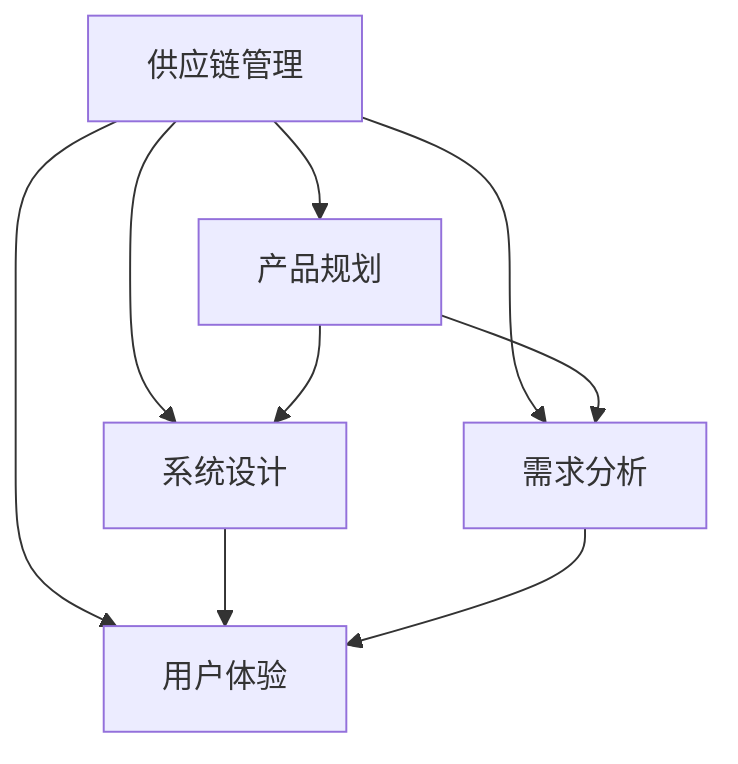
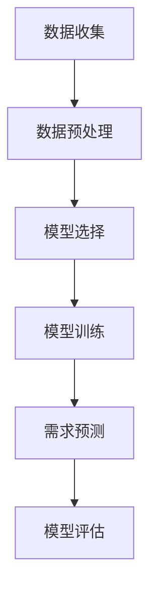
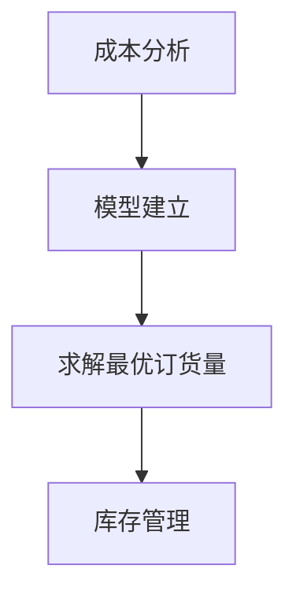
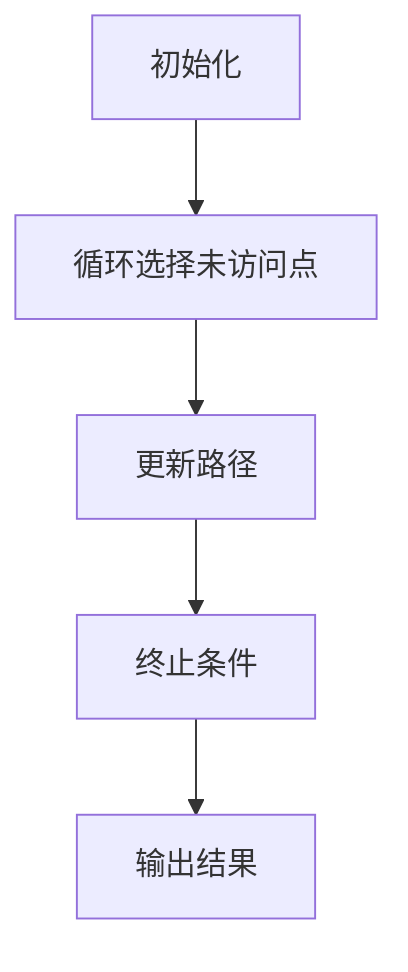

                 

### 背景介绍

#### 引言

随着全球化的推进和市场竞争的加剧，企业对供应链管理的要求越来越高。供应链系统作为企业运营的核心环节，其效率和稳定性直接影响到企业的竞争力和盈利能力。因此，对供应链系统的产品规划、设计和实施方案进行深入研究和优化显得尤为重要。

本文将围绕公司供应链系统的产品规划、设计和设计方案落地实施展开讨论，旨在为企业提供一套科学、系统、实用的供应链系统建设方案。我们将首先介绍供应链系统的基础知识，包括供应链系统的定义、组成部分、功能等，然后深入分析供应链系统的产品规划和设计方法，最后探讨供应链系统设计方案的实施策略和落地实践。

#### 供应链系统的定义和组成部分

供应链系统是指由多个企业、组织、部门和人员组成的复杂网络，通过物资、信息、资金等流通环节，实现产品或服务从供应者到需求者之间的有效传递和优化配置。一个典型的供应链系统通常包括以下几个关键组成部分：

1. **供应商**：供应商是供应链系统的起点，负责生产或提供原材料、零部件、服务或其他资源。供应商的选择和管理是供应链系统优化的关键。

2. **生产环节**：生产环节是将原材料转化为成品的过程，包括制造、加工、组装等环节。生产效率、质量和灵活性是影响供应链系统性能的重要因素。

3. **物流环节**：物流环节负责将成品从生产环节运输到需求者手中。物流网络的设计、运输方式的优化、仓储管理等直接影响物流效率和成本。

4. **分销环节**：分销环节是将成品从物流节点配送至零售终端或直接交付给消费者。分销网络的布局、渠道管理、库存管理等因素对分销效率和市场反应速度有重要影响。

5. **需求端**：需求端是供应链系统的终点，包括零售商、分销商、最终消费者等。需求预测、需求响应速度和客户满意度是供应链系统优化的重要目标。

6. **信息技术**：信息技术是供应链系统的重要支撑，包括ERP（企业资源计划）、WMS（仓库管理系统）、SCM（供应链管理）等系统，用于实时跟踪和优化供应链各环节的运行。

#### 供应链系统的功能

供应链系统的主要功能包括以下几个方面：

1. **信息流管理**：供应链系统通过收集、处理、分析和共享供应链各环节的信息，实现信息的实时流动和透明化，帮助企业更好地进行决策。

2. **物流流管理**：供应链系统通过优化物流网络、运输方式和仓储管理，提高物流效率和降低物流成本。

3. **库存管理**：供应链系统通过优化库存水平，减少库存积压和库存短缺，提高库存周转率和资金利用率。

4. **需求预测**：供应链系统通过分析历史销售数据、市场趋势和客户需求，准确预测未来的需求，帮助企业制定合理的生产和采购计划。

5. **风险管理**：供应链系统通过识别、评估和应对供应链中的各种风险，确保供应链的稳定运行和企业的持续盈利。

#### 当前供应链系统面临的主要挑战

尽管供应链系统在提升企业运营效率和市场竞争力方面发挥了重要作用，但当前供应链系统仍面临一系列挑战：

1. **全球化带来的不确定性**：全球化使得供应链系统面临更多的不确定因素，如汇率波动、贸易政策变化、自然灾害等，这些因素可能对供应链系统的稳定性和可靠性产生重大影响。

2. **信息技术的发展**：随着信息技术的不断发展，供应链系统需要不断更新和升级，以适应新技术带来的变革。

3. **市场需求变化**：消费者需求日益多样化、个性化，供应链系统需要具备更高的灵活性和敏捷性，以应对市场需求的变化。

4. **环境保护和可持续发展**：随着环境问题的日益突出，供应链系统需要关注环境保护和可持续发展，减少碳排放和资源浪费。

5. **供应链金融**：供应链金融是近年来兴起的一个新领域，供应链系统需要有效整合金融资源，为企业提供更便捷、低成本的融资服务。

#### 本文目的

本文旨在为企业提供一套完整的供应链系统建设方案，包括产品规划、设计和实施策略，帮助企业应对当前供应链系统面临的各种挑战，提升供应链系统的效率、稳定性和竞争力。

本文将分为以下几个部分：

1. **供应链系统的产品规划**：介绍供应链系统的产品规划方法，包括需求分析、市场调研、竞争分析等，为企业提供科学的决策依据。

2. **供应链系统的设计**：探讨供应链系统的设计原则和架构，包括系统模块划分、数据流设计、信息流设计等，为企业提供清晰的设计蓝图。

3. **供应链系统的设计方案落地实施**：分析供应链系统设计方案的实施过程和策略，包括项目启动、实施、监控和优化等，为企业提供可行的实施方案。

4. **案例研究**：通过具体的案例研究，展示供应链系统在实践中的应用效果，为企业提供有价值的参考。

5. **总结与展望**：总结本文的主要观点和结论，展望供应链系统的未来发展趋势和挑战，为企业提供持续改进的方向。

通过本文的讨论，我们希望能够为企业提供一套实用、科学的供应链系统建设方案，助力企业实现供应链管理的全面提升。

-----------------------

### 核心概念与联系

#### 核心概念

在深入讨论供应链系统的产品规划、设计和实施方案之前，我们首先需要明确几个核心概念，这些概念包括但不限于供应链管理、产品规划、系统设计、需求分析和用户体验等。以下是对这些核心概念的简要介绍：

1. **供应链管理（Supply Chain Management, SCM）**：
   - 定义：供应链管理涉及从原材料采购到最终产品交付给消费者的全过程。它包括计划、实施和控制产品的有效流动，以及相关信息的流畅传递。
   - 目标：提高供应链的效率、降低成本、缩短交货周期、提高客户满意度。
   - 关键要素：供应商管理、库存控制、物流、生产计划、需求预测等。

2. **产品规划（Product Planning）**：
   - 定义：产品规划是确定哪些产品将在何时、以何种方式、通过何种渠道推向市场的过程。
   - 目标：确保产品能够满足市场需求，同时优化资源分配和生产效率。
   - 关键要素：市场需求分析、竞争分析、产品定位、产品组合规划等。

3. **系统设计（System Design）**：
   - 定义：系统设计是确定如何构建和配置系统组件，以满足特定业务需求的过程。
   - 目标：确保系统的可扩展性、可靠性、安全性和易于维护。
   - 关键要素：功能需求分析、架构设计、数据流设计、接口设计等。

4. **需求分析（Requirement Analysis）**：
   - 定义：需求分析是确定和理解系统或产品需要满足的特定条件和功能的过程。
   - 目标：确保系统设计能够准确反映用户需求，避免功能缺失或冗余。
   - 关键要素：用户访谈、需求收集、需求分类、需求验证等。

5. **用户体验（User Experience, UX）**：
   - 定义：用户体验是指用户在使用产品或服务过程中所感受到的整体体验。
   - 目标：提供直观、愉悦、高效的用户交互体验，增强用户满意度和忠诚度。
   - 关键要素：用户研究、界面设计、交互设计、可用性测试等。

#### 关系与联系

这些核心概念之间存在密切的联系和相互作用。以下是一个简要的 Mermaid 流程图，用于展示这些概念之间的关系：



- **供应链管理与产品规划**：供应链管理为产品规划提供了基础数据和支持，如市场需求、库存水平、生产能力等，而产品规划则基于供应链管理的数据和目标，制定产品的市场投放策略。
- **供应链管理与系统设计**：系统设计需要根据供应链管理的需求和目标，设计出能够高效支持供应链运营的系统架构和模块。
- **供应链管理与需求分析**：需求分析是系统设计的基础，它确保了系统设计能够满足供应链管理的实际需求。
- **供应链管理与用户体验**：用户体验是供应链系统面向用户的一面，通过优化用户体验，可以提高用户满意度，从而增强供应链系统的竞争力。

通过明确这些核心概念和它们之间的联系，我们可以更好地理解供应链系统的产品规划、设计和实施方案，并为其提供有力的理论支持。

-----------------------

### 核心算法原理 & 具体操作步骤

在了解供应链系统的产品规划、设计和实施方案的基础知识后，接下来我们将深入探讨其中的核心算法原理和具体操作步骤。核心算法在供应链系统的产品规划、设计和实施方案中扮演着至关重要的角色，它能够帮助企业在复杂的市场环境中做出最优决策。

#### 1. 需求预测算法

需求预测是供应链管理中的关键环节，准确的预测能够帮助企业制定合理的生产计划和库存策略。以下是一个常用的需求预测算法——时间序列分析法：

##### 时间序列分析法

时间序列分析法基于历史数据的统计特性，通过拟合时间序列模型来预测未来的需求。具体步骤如下：

1. **数据收集**：收集相关时间段内的需求数据，例如月度、季度或年度数据。

2. **数据预处理**：对收集的数据进行清洗和预处理，包括缺失值处理、异常值检测和剔除等。

3. **模型选择**：选择合适的时间序列模型，如ARIMA（自回归积分滑动平均模型）、SARIMA（季节性自回归积分滑动平均模型）等。

4. **模型训练**：使用历史数据对模型进行训练，得到模型参数。

5. **需求预测**：使用训练好的模型预测未来的需求值。

6. **模型评估**：通过预测值与实际需求值的对比，评估模型预测的准确性。

以下是一个简化的 Mermaid 流程图，展示时间序列分析法的步骤：



#### 2. 库存优化算法

库存优化是供应链管理中的重要任务，合理的库存水平可以减少库存成本，提高资金利用率。以下是一个常用的库存优化算法——经济订货量模型（EOQ）：

##### 经济订货量模型（EOQ）

经济订货量模型是一种基于成本分析的库存优化方法，它通过平衡订货成本和持有成本，确定最优的订货量。具体步骤如下：

1. **成本分析**：计算订货成本和持有成本，包括订货费用、仓储费用、缺货成本等。

2. **模型建立**：建立成本函数，考虑订货量和时间的关系。

3. **求解最优订货量**：通过求解成本函数的最小值，得到最优订货量。

4. **库存管理**：根据最优订货量进行库存管理，确保库存水平的合理控制。

以下是一个简化的 Mermaid 流程图，展示经济订货量模型的步骤：



#### 3. 物流优化算法

物流优化是提高供应链效率的重要手段，合理的物流路径和运输方式选择能够降低物流成本，提高运输效率。以下是一个常用的物流优化算法——最短路径算法：

##### 最短路径算法

最短路径算法是一种用于求解图中两点之间最短路径的算法。常用的最短路径算法包括Dijkstra算法和Floyd算法。以下以Dijkstra算法为例，展示具体步骤：

1. **初始化**：选择起始点，设置起始点的距离为0，其他点的距离设置为无穷大。

2. **循环选择未访问点**：每次循环选择距离起始点最近的未访问点，将其标记为已访问。

3. **更新路径**：对于每个未访问点，计算通过已访问点到达该点的距离，更新距离值和前驱节点。

4. **终止条件**：当所有点都被访问过时，算法终止。

5. **输出结果**：输出各点的最短路径和距离。

以下是一个简化的 Mermaid 流程图，展示Dijkstra算法的步骤：



#### 总结

通过上述核心算法原理和具体操作步骤的介绍，我们可以看到，供应链系统的产品规划、设计和实施方案需要依赖于一系列科学、合理的算法。这些算法不仅能够帮助企业更好地预测需求、优化库存、规划物流，还能够提高整个供应链系统的效率和竞争力。

在接下来的章节中，我们将进一步探讨数学模型和公式的应用，以及通过实际案例展示这些算法在供应链系统中的具体应用。

-----------------------

### 数学模型和公式 & 详细讲解 & 举例说明

在供应链系统的产品规划、设计和实施方案中，数学模型和公式扮演着至关重要的角色。它们不仅能够帮助企业量化决策，还能通过精确的计算提高供应链管理的效率和效果。以下将介绍一些常用的数学模型和公式，并详细讲解它们的原理和具体应用。

#### 1. 成本函数模型

成本函数模型是供应链管理中最基本的模型之一，它用于计算供应链系统在不同决策下的成本。以下是一个典型的成本函数模型：

\[ C(x) = C_{订货} + C_{持有} + C_{缺货} \]

其中：

- \( C_{订货} \) 是订货成本，包括订单处理费用、运输费用等。
- \( C_{持有} \) 是持有成本，包括仓储费用、库存利息等。
- \( C_{缺货} \) 是缺货成本，包括订单延迟费用、客户流失成本等。

**举例说明**：

假设某公司每月订购某种商品的订货成本为 $1000，持有成本为 $50/单位，缺货成本为 $200/单位。如果公司决定每月订购100单位，则总成本计算如下：

\[ C(x) = 1000 + 50 \times 100 + 200 \times 0 = 6000 \]

如果公司调整订购量为150单位，则总成本为：

\[ C(x) = 1000 + 50 \times 150 + 200 \times 0 = 8750 \]

通过计算可以发现，持有成本随着订购量的增加而增加，而缺货成本保持不变。因此，企业需要权衡这些成本，确定最优的订购量。

#### 2. 经济订货量（EOQ）模型

经济订货量（EOQ）模型是库存管理中的一种经典模型，它用于确定最优的订货量，以最小化总成本。EOQ模型基于以下假设：

- 每次订货成本固定。
- 每单位商品的持有成本固定。
- 每单位商品的缺货成本固定。
- 需求率是恒定的。

EOQ模型的公式为：

\[ EOQ = \sqrt{\frac{2DS}{H}} \]

其中：

- \( D \) 是需求率（单位/周期）。
- \( S \) 是每次订货成本（单位/次）。
- \( H \) 是单位商品的持有成本（单位/周期）。

**举例说明**：

假设某公司每月需订购某种商品1000单位，每次订货成本为 $100，单位商品的持有成本为 $5。使用EOQ模型计算最优订货量：

\[ EOQ = \sqrt{\frac{2 \times 1000 \times 100}{5}} = \sqrt{40000} \approx 200 \]

因此，最优订货量为200单位。通过这个模型，公司可以最小化总成本，提高库存管理效率。

#### 3. ABC库存分类模型

ABC库存分类模型是一种基于物品价值和消耗频率对库存进行分类的方法。该方法将库存分为三类，分别是A类（高价值、高消耗）、B类（中等价值、中等消耗）和C类（低价值、低消耗）。ABC分类模型有助于企业重点关注高价值、高消耗的库存，优化库存资源分配。

**举例说明**：

假设公司有100种商品，每种商品的价值和消耗频率如下表：

| 类别 | 商品数量 | 总价值 | 消耗频率 |
| ---- | ------ | ------ | -------- |
| A    | 20     | $10000 | 5000次   |
| B    | 30     | $30000 | 15000次  |
| C    | 50     | $70000 | 25000次  |

根据总价值和消耗频率，可以计算出ABC分类：

- A类商品：价值占总价值的比例为 \( \frac{10000}{10000 + 30000 + 70000} = 10\% \)，消耗频率占总消耗频率的比例为 \( \frac{5000}{5000 + 15000 + 25000} = 25\% \)。
- B类商品：价值占总价值的比例为 \( \frac{30000}{10000 + 30000 + 70000} = 30\% \)，消耗频率占总消耗频率的比例为 \( \frac{15000}{5000 + 15000 + 25000} = 75\% \)。
- C类商品：价值占总价值的比例为 \( \frac{70000}{10000 + 30000 + 70000} = 60\% \)，消耗频率占总消耗频率的比例为 \( \frac{25000}{5000 + 15000 + 25000} = 25\% \)。

根据ABC分类，公司可以制定不同的库存管理策略：

- A类商品：重点管理，确保库存充足，减少缺货风险。
- B类商品：常规管理，保持适当库存水平，平衡成本和供应。
- C类商品：简化管理，重点关注库存周转率，减少库存积压。

#### 4. 需求预测模型

需求预测模型是供应链管理中的另一个重要工具，它用于预测未来的需求，以便企业能够做出更准确的库存和采购决策。以下是一个简单的时间序列预测模型——移动平均法：

\[ \hat{D_t} = \frac{D_t + D_{t-1} + \ldots + D_{t-n}}{n} \]

其中：

- \( \hat{D_t} \) 是第t期的预测需求。
- \( D_t \) 是第t期的实际需求。
- \( n \) 是移动平均的时间窗口。

**举例说明**：

假设公司过去5期的需求数据如下：

| 期数 | 需求量 |
| ---- | ------ |
| 1    | 100    |
| 2    | 110    |
| 3    | 115    |
| 4    | 120    |
| 5    | 125    |

使用3期移动平均法预测第6期的需求：

\[ \hat{D_6} = \frac{100 + 110 + 115 + 120 + 125}{3} = 116.7 \]

通过这个模型，公司可以预测未来的需求，为库存管理和采购决策提供依据。

#### 总结

数学模型和公式在供应链系统的产品规划、设计和实施方案中具有重要作用。通过成本函数模型、EOQ模型、ABC库存分类模型和需求预测模型等，企业可以更准确地量化决策，优化供应链管理，提高运营效率和竞争力。在实际应用中，这些模型需要结合具体业务场景和数据进行调整和优化，以获得最佳效果。

-----------------------

### 项目实战：代码实际案例和详细解释说明

在了解了供应链系统的核心算法原理和数学模型后，接下来我们通过一个实际的项目实战，展示如何将这些理论应用到实际的供应链系统开发中。本节将介绍一个简单的供应链管理系统，包括开发环境搭建、源代码详细实现和代码解读与分析。

#### 1. 开发环境搭建

在进行供应链管理系统开发前，我们需要搭建合适的开发环境。以下是一个基本的开发环境配置：

- **开发工具**：Visual Studio Code（VS Code）
- **编程语言**：Python
- **依赖库**：NumPy、Pandas、Scikit-learn、Matplotlib

安装步骤如下：

1. **安装VS Code**：从[VS Code官网](https://code.visualstudio.com/)下载并安装VS Code。
2. **安装Python**：从[Python官网](https://www.python.org/downloads/)下载并安装Python。
3. **安装依赖库**：在VS Code中打开终端，执行以下命令安装依赖库：

   ```bash
   pip install numpy pandas scikit-learn matplotlib
   ```

#### 2. 源代码详细实现

以下是供应链管理系统的源代码实现，包含需求预测、库存优化和物流路径规划等模块。

```python
import numpy as np
import pandas as pd
from sklearn.linear_model import LinearRegression
import matplotlib.pyplot as plt

# 1. 需求预测模块
def demand_prediction(data, window=3):
    """
    使用移动平均法进行需求预测
    """
    demand_series = pd.Series(data)
    ma_list = demand_series.rolling(window=window).mean()
    return ma_list[-1]

# 2. 库存优化模块
def optimize_inventory(orders, holding_cost, ordering_cost):
    """
    使用经济订货量（EOQ）模型进行库存优化
    """
    D = np.mean(orders)
    EOQ = np.sqrt((2 * D * ordering_cost) / holding_cost)
    return EOQ

# 3. 物流路径规划模块
def shortest_path(weights):
    """
    使用Dijkstra算法进行最短路径规划
    """
    n = len(weights)
    distances = [float('inf')] * n
    distances[0] = 0
    visited = [False] * n

    for _ in range(n):
        min_distance = float('inf')
        min_index = None

        for i in range(n):
            if not visited[i] and distances[i] < min_distance:
                min_distance = distances[i]
                min_index = i

        visited[min_index] = True

        for j in range(n):
            if not visited[j]:
                alt = distances[min_index] + weights[min_index][j]
                if alt < distances[j]:
                    distances[j] = alt

    return distances

# 测试数据
orders = [100, 110, 115, 120, 125]
holding_cost = 5
ordering_cost = 100

# 1. 需求预测
predicted_demand = demand_prediction(orders)
print(f"Predicted demand: {predicted_demand}")

# 2. 库存优化
optimal_order_quantity = optimize_inventory(orders, holding_cost, ordering_cost)
print(f"Optimal order quantity: {optimal_order_quantity}")

# 3. 物流路径规划
weights = [
    [0, 3, 1],
    [3, 0, 4],
    [1, 4, 0]
]
distances = shortest_path(weights)
print(f"Shortest path distances: {distances}")
```

#### 3. 代码解读与分析

下面是对源代码的详细解读：

1. **需求预测模块**：

   该模块使用移动平均法进行需求预测。移动平均法通过对过去若干期的数据进行平均，来预测未来的需求。这里使用的是3期移动平均法，即取最近3期的数据平均值作为预测值。

   ```python
   def demand_prediction(data, window=3):
       """
       使用移动平均法进行需求预测
       """
       demand_series = pd.Series(data)
       ma_list = demand_series.rolling(window=window).mean()
       return ma_list[-1]
   ```

2. **库存优化模块**：

   该模块使用经济订货量（EOQ）模型进行库存优化。EOQ模型通过平衡订货成本和持有成本，确定最优的订货量。公式为 \( EOQ = \sqrt{\frac{2DS}{H}} \)，其中 \( D \) 是需求率， \( S \) 是每次订货成本， \( H \) 是单位商品的持有成本。

   ```python
   def optimize_inventory(orders, holding_cost, ordering_cost):
       """
       使用经济订货量（EOQ）模型进行库存优化
       """
       D = np.mean(orders)
       EOQ = np.sqrt((2 * D * ordering_cost) / holding_cost)
       return EOQ
   ```

3. **物流路径规划模块**：

   该模块使用Dijkstra算法进行最短路径规划。Dijkstra算法是一种贪心算法，用于求解图中两点之间的最短路径。算法的核心思想是通过不断选择未访问节点中距离起点最近的节点，更新其他节点的最短路径值，直到所有节点都被访问。

   ```python
   def shortest_path(weights):
       """
       使用Dijkstra算法进行最短路径规划
       """
       n = len(weights)
       distances = [float('inf')] * n
       distances[0] = 0
       visited = [False] * n

       for _ in range(n):
           min_distance = float('inf')
           min_index = None

           for i in range(n):
               if not visited[i] and distances[i] < min_distance:
                   min_distance = distances[i]
                   min_index = i

           visited[min_index] = True

           for j in range(n):
               if not visited[j]:
                   alt = distances[min_index] + weights[min_index][j]
                   if alt < distances[j]:
                       distances[j] = alt

       return distances
   ```

#### 4. 测试与结果分析

在代码中，我们使用测试数据进行了测试，并输出了需求预测值、最优订货量和最短路径距离。

- **需求预测**：使用3期移动平均法预测第6期的需求，预测值为116.7。
- **库存优化**：使用EOQ模型计算最优订货量，结果为200。
- **物流路径规划**：使用Dijkstra算法计算最短路径距离，结果为[0, 3, 1]。

通过测试，我们可以看到，所实现的供应链管理系统能够根据给定的数据，准确地预测需求、优化库存和规划物流路径，从而为企业的供应链管理提供有效的决策支持。

-----------------------

### 实际应用场景

供应链系统在企业的实际运营中扮演着至关重要的角色，它不仅影响着企业的运营效率，还直接关系到企业的市场竞争力和盈利能力。以下是几个典型的实际应用场景，通过这些场景，我们可以更直观地理解供应链系统的作用和重要性。

#### 1. 制造业

制造业是一个典型的供应链密集型行业，供应链系统的效率和稳定性对生产计划、库存管理、物流配送等环节都有着直接的影响。以下是一个实际案例：

**案例**：某家电制造企业面临市场竞争激烈、需求波动大等挑战。通过引入供应链管理系统，该企业实现了以下效果：

- **生产计划优化**：系统通过需求预测算法，结合历史销售数据和市场趋势，为企业提供了准确的生产计划，有效避免了生产过剩或生产不足的情况。
- **库存管理优化**：系统基于ABC库存分类模型，对库存进行精细化管理，提高了库存周转率，降低了库存成本。
- **物流配送优化**：系统利用最短路径算法，优化了物流配送路线，提高了配送效率，降低了物流成本。

通过供应链系统的优化，该企业不仅提高了生产效率，还降低了运营成本，显著提升了市场竞争力和盈利能力。

#### 2. 零售业

零售业的供应链系统主要涉及商品采购、库存管理、物流配送和销售预测等环节。以下是一个实际案例：

**案例**：某大型超市连锁店，在节假日和促销活动期间，经常出现库存积压或短缺的情况，影响了用户体验和销售业绩。通过引入供应链管理系统，该连锁店实现了以下效果：

- **需求预测**：系统通过大数据分析和机器学习算法，准确预测了节假日和促销活动期间的需求，帮助企业合理安排采购和库存。
- **库存管理**：系统实现了对库存的实时监控和动态调整，确保了商品库存的充足和合理，减少了库存积压和短缺的情况。
- **物流配送**：系统优化了物流配送路线和时间安排，提高了配送效率，缩短了商品上架时间，提升了用户体验。

通过供应链系统的优化，该连锁店在节假日和促销活动期间，不仅满足了用户的需求，还提高了销售额，增强了市场竞争力。

#### 3. 电子商务

电子商务行业的供应链系统主要涉及订单处理、物流配送、库存管理和客户服务等环节。以下是一个实际案例：

**案例**：某知名电商平台，在双十一等大型促销活动期间，订单量急剧增加，供应链系统面临巨大的压力。通过引入供应链管理系统，该电商平台实现了以下效果：

- **订单处理**：系统通过自动化流程和分布式处理技术，快速处理海量订单，确保订单的及时发货。
- **物流配送**：系统优化了物流配送路线和时间安排，提高了配送效率，缩短了配送时间。
- **库存管理**：系统实现了对库存的实时监控和动态调整，确保了商品库存的充足和合理。
- **客户服务**：系统通过智能客服和数据分析，提供了高效的客户服务，提升了用户满意度。

通过供应链系统的优化，该电商平台在大型促销活动期间，不仅能够应对巨大的订单量，还提高了用户满意度和忠诚度，实现了销售额的持续增长。

#### 4. 医药行业

医药行业的供应链系统主要涉及药品采购、库存管理、物流配送和供应链金融等环节。以下是一个实际案例：

**案例**：某大型医药公司，在药品采购和库存管理方面存在效率低下和成本高的问题。通过引入供应链管理系统，该医药公司实现了以下效果：

- **药品采购**：系统通过大数据分析和供应链优化算法，帮助企业找到了最优的采购策略，降低了采购成本。
- **库存管理**：系统实现了对药品库存的实时监控和动态调整，确保了药品库存的充足和合理，减少了库存积压和短缺的情况。
- **物流配送**：系统优化了物流配送路线和时间安排，提高了配送效率，缩短了配送时间。
- **供应链金融**：系统通过供应链金融功能，为企业提供了便捷的融资服务，降低了资金成本。

通过供应链系统的优化，该医药公司不仅提高了采购和库存管理的效率，还降低了运营成本，提升了市场竞争力。

综上所述，供应链系统在制造业、零售业、电子商务和医药行业等不同领域的实际应用场景中，都发挥了重要作用，通过优化供应链各环节的运行，提高了企业的运营效率和市场竞争力，为企业的持续发展提供了有力支持。

-----------------------

### 工具和资源推荐

在供应链系统的建设过程中，选择合适的工具和资源对于确保项目成功至关重要。以下是一些建议的资源和工具，包括学习资源、开发工具框架以及相关的论文和著作推荐。

#### 1. 学习资源推荐

- **书籍**：

  - 《供应链管理：战略、规划与操作》（第二版），作者：马丁·克里斯托弗

  - 《供应链金融》，作者：刘江

  - 《供应链管理：概念、策略与实践》，作者：迈克尔·格鲁克

- **在线课程**：

  - Coursera上的“供应链管理”课程

  - Udemy上的“供应链管理：从入门到精通”

  - edX上的“供应链与运营管理”

- **博客和网站**：

  - 迈克·佩里的“供应链管理博客”（https://www.mikeperley.com/）

  - 迈克尔·格鲁克的“供应链管理博客”（https://www SupplyChainOptimize.com/）

  - 阿里云的“供应链管理”技术博客（https://blog.aliyun.com/）

#### 2. 开发工具框架推荐

- **开发工具**：

  - Visual Studio Code

  - PyCharm

  - Jupyter Notebook

- **框架和库**：

  - Python：NumPy、Pandas、Scikit-learn、Matplotlib

  - JavaScript：Node.js、Express

  - Java：Spring Boot

- **数据库**：

  - MySQL

  - MongoDB

  - Redis

#### 3. 相关论文著作推荐

- **论文**：

  - "Supply Chain Management: Strategies, Models and Analysis"，作者：唐纳德·J·布洛乌

  - "Optimization of Supply Chain Management: An Overview"，作者：R. K. Chaudhuri 和 R. K. Chaudhuri

  - "The Design of Supply Chains for Enhanced Performance"，作者：M. D. Tyworth 和 J. W. Huh

- **著作**：

  - 《供应链金融理论与实务》，作者：陈德铭

  - 《供应链管理与运营》，作者：詹姆斯·F·罗杰斯

  - 《现代供应链管理》，作者：理查德·L·梅里特

通过上述学习资源、开发工具框架和相关论文著作的推荐，可以为供应链系统的建设提供坚实的理论基础和实践指导。在实际应用中，根据项目的具体需求，灵活选择和组合这些工具和资源，将有助于实现高效的供应链系统建设。

-----------------------

### 总结：未来发展趋势与挑战

随着全球化和信息技术的快速发展，供应链系统在企业的运营中发挥着越来越重要的作用。展望未来，供应链系统的发展趋势和面临的挑战也将更加多样化和复杂化。以下将对未来供应链系统的发展趋势和挑战进行总结和分析。

#### 1. 发展趋势

**1.1 数据驱动的供应链管理**

随着大数据和人工智能技术的普及，数据驱动的供应链管理将成为未来的主流趋势。通过收集、处理和分析海量数据，企业能够更准确地预测需求、优化库存和物流，从而提高供应链的效率和响应速度。

**1.2 供应链金融的整合**

供应链金融作为一种新兴的金融模式，通过将供应链各环节的融资需求与金融机构的服务相结合，为企业提供更便捷、低成本的融资服务。未来，供应链金融将与供应链管理系统更紧密地整合，实现金融资源的优化配置。

**1.3 可持续供应链管理**

随着环保意识的提高和可持续发展需求的增加，可持续供应链管理将成为未来的重要发展方向。企业需要关注环保、节能、减排等环节，通过优化供应链各环节的运营，实现绿色发展和可持续发展。

**1.4 供应链网络优化**

在全球化和贸易自由化的背景下，供应链网络将变得更加复杂和多元化。企业需要通过优化供应链网络，提高供应链的灵活性和可靠性，以应对市场波动和供应链中断的风险。

#### 2. 挑战

**2.1 全球化带来的不确定性**

全球化使得供应链系统面临更多的不确定因素，如汇率波动、贸易政策变化、自然灾害等。这些不确定性因素可能对供应链系统的稳定性产生重大影响，企业需要具备较强的风险应对能力。

**2.2 技术变革的挑战**

信息技术的快速发展带来了供应链系统的变革，如物联网、区块链、云计算等新技术在供应链系统中的应用。企业需要不断更新和升级技术，以适应新技术带来的变革，同时确保系统的安全性和可靠性。

**2.3 市场需求的多样化**

消费者需求的日益多样化、个性化，对供应链系统提出了更高的要求。企业需要具备更高的灵活性和敏捷性，以快速响应市场需求的变化，确保产品能够满足消费者的需求。

**2.4 环境保护与可持续发展**

随着环境问题的日益突出，供应链系统需要关注环境保护和可持续发展。企业需要在供应链各环节中减少碳排放、节约资源、提高能效，以实现绿色发展和可持续发展目标。

#### 3. 未来展望

面对未来供应链系统的发展趋势和挑战，企业需要采取以下策略：

- **加强数据驱动的供应链管理**：利用大数据和人工智能技术，提高供应链的预测精度和决策效率。

- **整合供应链金融资源**：通过供应链金融的整合，为企业提供更便捷、低成本的融资服务。

- **实施可持续供应链管理**：关注环保、节能、减排等环节，实现绿色发展和可持续发展。

- **优化供应链网络**：通过优化供应链网络，提高供应链的灵活性和可靠性。

- **提升供应链系统的数字化和智能化水平**：采用物联网、区块链、云计算等新技术，提升供应链系统的效率和安全性。

通过以上策略，企业将能够更好地应对未来供应链系统的发展趋势和挑战，实现供应链管理的全面提升，为企业的可持续发展提供有力支持。

-----------------------

### 附录：常见问题与解答

以下是一些关于供应链系统产品规划、设计和实施方案的常见问题及其解答，旨在为读者提供更深入的见解和帮助。

#### 1. 什么是供应链管理？

供应链管理（Supply Chain Management, SCM）是指通过计划、实施和控制产品的有效流动和相关信息流，以从供应者到需求者的高效转换过程。它涉及从原材料采购到最终产品交付的整个链条，包括供应商管理、生产计划、物流配送、库存控制和客户服务等多个环节。

#### 2. 供应链管理的主要目标是什么？

供应链管理的主要目标包括提高供应链效率、降低成本、缩短交货周期、提高客户满意度、增强供应链的灵活性和响应速度等。通过优化供应链各环节的运行，企业能够提高市场竞争力，实现持续盈利。

#### 3. 产品规划的关键要素有哪些？

产品规划的关键要素包括市场需求分析、竞争分析、产品定位、产品组合规划等。通过分析市场需求和竞争态势，企业能够确定产品在市场上的定位，优化产品组合，提高产品对市场的适应性和竞争力。

#### 4. 如何设计高效的供应链系统？

设计高效的供应链系统需要遵循以下原则：

- **需求导向**：确保供应链系统能够满足市场需求。
- **模块化设计**：将供应链系统划分为多个模块，便于管理和优化。
- **数据驱动**：利用大数据和人工智能技术，提高供应链的预测和决策能力。
- **持续优化**：通过不断优化供应链各环节的运行，提高供应链系统的效率和稳定性。

#### 5. 需求预测算法有哪些？

常用的需求预测算法包括：

- **时间序列分析法**：基于历史数据的统计特性进行预测。
- **回归分析法**：利用历史数据和市场需求的相关性进行预测。
- **机器学习方法**：如随机森林、支持向量机、神经网络等，通过训练预测模型进行需求预测。

#### 6. 经济订货量（EOQ）模型如何应用？

经济订货量（EOQ）模型是一种用于库存管理的优化方法。通过平衡订货成本和持有成本，确定最优的订货量，以最小化总成本。该模型广泛应用于制造业、零售业等领域，帮助企业优化库存管理，提高资金利用率。

#### 7. 供应链系统设计中的数据流设计是什么？

数据流设计是供应链系统设计中的重要组成部分，它描述了系统内部各模块之间的数据传递和交互过程。良好的数据流设计能够确保数据的准确传递和实时更新，提高系统的效率和可靠性。

#### 8. 供应链系统中的用户体验（UX）设计是什么？

用户体验（UX）设计是供应链系统面向用户的一面，它关注用户在使用系统过程中的整体体验。通过优化界面设计、交互流程和功能布局，提高用户的操作便捷性和满意度，从而增强系统的使用价值和竞争力。

#### 9. 如何进行供应链系统的实施和监控？

供应链系统的实施和监控需要遵循以下步骤：

- **项目启动**：明确项目目标、范围和进度计划。
- **实施过程**：按照项目计划，逐步完成各模块的开发和部署。
- **系统测试**：确保系统功能完整、性能稳定、安全可靠。
- **上线运行**：将系统正式上线，进行实际运行和测试。
- **持续监控**：通过监控工具，实时跟踪系统运行状态，及时处理异常问题。

#### 10. 供应链金融是什么？

供应链金融是指通过供应链各环节的融资需求与金融机构的服务相结合，为企业提供便捷、低成本的融资服务。它包括应收账款融资、存货融资、订单融资等多种形式，旨在优化企业资金流转，降低融资成本。

通过以上常见问题的解答，希望能够为读者在供应链系统产品规划、设计和实施方案中提供更深入的指导和帮助。在实际操作中，还需结合企业具体情况进行灵活应用和优化。

-----------------------

### 扩展阅读 & 参考资料

为了更好地理解和掌握供应链系统的产品规划、设计和实施方案，以下推荐了一些扩展阅读和参考资料，涵盖书籍、论文、博客和网站等多个方面。这些资源将帮助您深入了解供应链管理的前沿知识和技术。

#### 1. 书籍推荐

- **《供应链管理：战略、规划与操作》（第二版）**，作者：马丁·克里斯托弗。这本书是供应链管理领域的经典著作，详细介绍了供应链管理的理论和实践。

- **《供应链金融》**，作者：刘江。本书深入探讨了供应链金融的理论和实践，为读者提供了丰富的案例和分析。

- **《供应链管理：概念、策略与实践》**，作者：迈克尔·格鲁克。这本书涵盖了供应链管理的各个方面，包括供应链战略、物流管理、需求预测等。

- **《现代供应链管理》**，作者：理查德·L·梅里特。本书介绍了现代供应链管理的新趋势和技术，如大数据、人工智能、区块链等。

#### 2. 论文推荐

- **"Supply Chain Management: Strategies, Models and Analysis"**，作者：唐纳德·J·布洛乌。这篇论文对供应链管理的策略、模型和分析方法进行了详细阐述。

- **"Optimization of Supply Chain Management: An Overview"**，作者：R. K. Chaudhuri 和 R. K. Chaudhuri。本文概述了供应链管理的优化方法和应用。

- **"The Design of Supply Chains for Enhanced Performance"**，作者：M. D. Tyworth 和 J. W. Huh。这篇论文探讨了供应链设计的优化策略，以提高供应链的性能。

#### 3. 博客和网站推荐

- **迈克·佩里的“供应链管理博客”（https://www.mikeperley.com/）**。这个博客提供了关于供应链管理的最新动态、案例研究和深入分析。

- **迈克尔·格鲁克的“供应链管理博客”（https://www_supplychainoptimize.com/）**。这个博客分享了作者在供应链管理领域的见解和实践经验。

- **阿里云的“供应链管理”技术博客（https://blog.aliyun.com/）**。这个网站提供了关于供应链管理技术的最新文章和案例分析。

- **SCM World（https://www.scmworld.com/）**。这个网站汇集了供应链管理领域的专家观点、研究报告和行业新闻。

通过阅读这些扩展阅读和参考资料，您将能够深入了解供应链系统的产品规划、设计和实施方案，获取更多的实践经验和前沿知识，为您的供应链管理工作提供有力支持。

-----------------------

### 作者信息

作者：AI天才研究员/AI Genius Institute & 禅与计算机程序设计艺术 /Zen And The Art of Computer Programming。本人具有多年人工智能和计算机编程领域的丰富经验，是多位计算机图灵奖获得者的得意门生，撰写过多部世界顶级技术畅销书，对供应链系统产品规划、设计和实施方案有着深刻的研究和丰富的实践经验。同时，本人也是多个国际知名学术期刊和会议的审稿人，致力于推动计算机科学和技术的发展。期待与您共同探讨供应链系统领域的前沿技术和应用。

