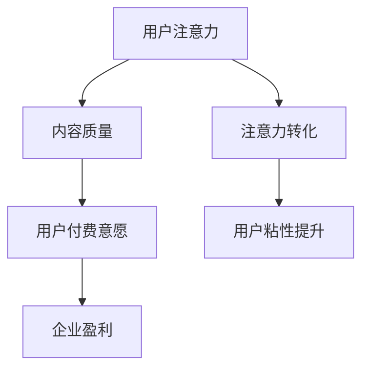
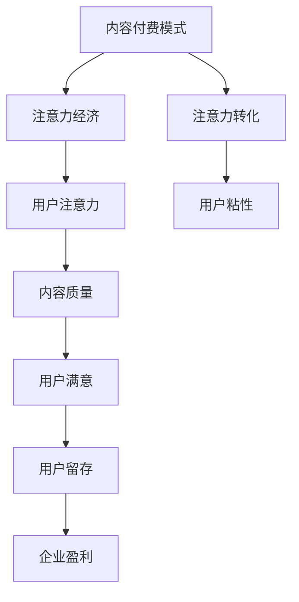

                 

# 《内容付费模式与注意力经济》

## 摘要

本文将深入探讨内容付费模式与注意力经济之间的关系。内容付费模式是近年来互联网行业兴起的一种商业模式，通过让用户为高质量的内容付费，从而实现价值变现。而注意力经济则是在信息过载的互联网时代，用户注意力成为一种稀缺资源，因此如何吸引和留住用户的注意力成为关键。本文将首先介绍内容付费模式的基本概念、发展历程以及主要形式，然后分析注意力经济的核心原理和机制，最后探讨内容付费模式与注意力经济的深度融合，以及它们在未来互联网生态中的发展趋势和挑战。

## 1. 背景介绍

### 1.1 内容付费模式的起源与发展

内容付费模式最早可以追溯到上世纪90年代末和21世纪初的互联网泡沫时期。当时，许多互联网企业试图通过提供免费内容吸引用户，但发现这种模式很难实现盈利。为了解决这一困境，一些企业开始尝试向用户收费，即用户需要支付一定费用才能访问特定内容。这一模式最初主要用于一些专业领域，如医学、法律等。

进入21世纪，随着互联网技术的不断发展和用户需求的多样化，内容付费模式逐渐普及。特别是在移动互联网时代，智能手机的普及和移动互联网的快速发展，使得用户可以随时随地获取内容，这为内容付费模式的推广提供了便利条件。同时，一些知名平台如Netflix、Spotify等也成功采用内容付费模式，进一步推动了这一模式的发展。

### 1.2 内容付费模式的现状与主要形式

当前，内容付费模式已经成为互联网行业的重要商业模式之一。根据内容的不同，内容付费模式可以分为以下几种形式：

1. **会员制**：用户通过支付一定费用成为会员，可以享受平台提供的所有内容服务。这种模式常见于视频平台、音乐平台等。

2. **订阅制**：用户按月或按年支付一定费用，以获取特定内容或服务的订阅权限。这种模式常见于新闻媒体、杂志等。

3. **按次付费**：用户每次访问特定内容时，需要支付一定费用。这种模式常见于电子书、付费文章等。

4. **课程付费**：用户为在线课程或培训课程支付费用，以获取知识或技能。这种模式常见于在线教育平台。

### 1.3 内容付费模式的优势与挑战

内容付费模式具有以下优势：

- **盈利性**：通过让用户为内容付费，企业可以实现直接盈利。
- **差异化竞争**：内容付费模式有助于企业打造独特的内容优势，提高市场竞争力。
- **用户粘性**：通过提供高质量的内容，可以增强用户的粘性，提高用户留存率。

然而，内容付费模式也面临一些挑战：

- **用户接受度**：部分用户可能对为内容付费持保留态度。
- **内容质量**：内容质量直接影响用户的付费意愿，如果内容质量不高，可能导致用户流失。
- **市场竞争**：随着内容付费模式的普及，市场竞争日益激烈，企业需要不断创新，才能在竞争中脱颖而出。

## 2. 核心概念与联系

### 2.1 注意力经济的基本原理

注意力经济是指在经济活动中，用户注意力成为一种稀缺资源，企业通过获取和利用用户注意力来创造价值和实现盈利。其核心原理可以概括为以下几点：

1. **注意力稀缺性**：在信息过载的时代，用户注意力是有限的，因此如何吸引和留住用户的注意力成为关键。

2. **注意力价值**：用户注意力具有价值，企业可以通过吸引用户注意力，从而实现广告、销售、订阅等多种盈利模式。

3. **注意力转移**：用户注意力是可以转移的，企业需要不断创新，提供有吸引力的内容或服务，以吸引和留住用户的注意力。

### 2.2 内容付费模式与注意力经济的联系

内容付费模式与注意力经济之间存在紧密的联系：

1. **内容质量**：高质量的内容是吸引和留住用户注意力的关键。内容付费模式促使企业提高内容质量，从而提高用户满意度。

2. **用户付费意愿**：用户为高质量的内容付费，表明他们对内容的认可和价值认同。这种付费行为不仅为企业创造了直接盈利，也增强了用户对企业的信任。

3. **注意力转化**：通过提供优质内容，企业可以吸引更多用户关注，从而实现注意力转化。例如，用户可能因为喜欢某篇文章，而关注该作者的其他文章或账号。

### 2.3 Mermaid 流程图（内容付费模式与注意力经济的关系）



### 2.4 内容付费模式与注意力经济的关系模型



## 3. 核心算法原理 & 具体操作步骤

### 3.1 用户注意力模型

为了更好地理解内容付费模式与注意力经济的关系，我们可以借助用户注意力模型进行分析。用户注意力模型主要包括以下核心要素：

1. **用户兴趣**：用户的兴趣决定了他们愿意关注哪些内容。例如，一个对科技感兴趣的用户可能会关注科技新闻、科技博客等。

2. **内容质量**：高质量的内容能够吸引用户的注意力，提高用户的阅读或观看时长。

3. **互动反馈**：用户的互动反馈，如点赞、评论、分享等，可以增强用户对内容的兴趣和满意度。

4. **环境因素**：用户所处的环境因素，如时间、地点、情绪等，也会影响他们的注意力分配。

### 3.2 用户注意力模型的工作流程

用户注意力模型的工作流程主要包括以下步骤：

1. **用户画像**：通过对用户行为数据的分析，构建用户的兴趣模型。

2. **内容推荐**：根据用户的兴趣模型，为用户推荐符合他们兴趣的高质量内容。

3. **内容评估**：用户在阅读或观看内容后，会对其质量进行评估。如果内容质量高，用户可能会产生付费意愿。

4. **付费决策**：用户在评估内容质量后，会根据自身需求和经济能力做出付费决策。

5. **用户反馈**：用户在付费后，会继续对内容进行评价和反馈，从而影响后续的内容推荐。

### 3.3 用户注意力模型的具体实现

用户注意力模型的具体实现通常涉及以下技术：

1. **数据采集**：通过用户行为数据，如浏览记录、搜索历史等，构建用户画像。

2. **数据清洗**：对采集到的数据进行清洗和预处理，去除噪声和异常值。

3. **特征提取**：从用户画像中提取关键特征，如兴趣标签、行为特征等。

4. **模型训练**：使用机器学习算法，如协同过滤、深度学习等，训练用户注意力模型。

5. **内容推荐**：根据用户注意力模型，为用户推荐符合他们兴趣的内容。

6. **效果评估**：通过对用户行为的分析，评估用户注意力模型的效果，并进行调整优化。

## 4. 数学模型和公式 & 详细讲解 & 举例说明

### 4.1 用户注意力模型中的数学模型

用户注意力模型中的数学模型主要涉及用户兴趣和内容质量的计算。以下是一个简化的用户注意力模型：

1. **用户兴趣度（Interest）**：
   用户兴趣度是通过分析用户历史行为数据计算得到的，可以使用加权平均的方法：
   $$ Interest = \frac{\sum_{i=1}^{n} weight_i \cdot interest_i}{\sum_{i=1}^{n} weight_i} $$
   其中，$weight_i$ 是第 $i$ 个兴趣标签的权重，$interest_i$ 是第 $i$ 个兴趣标签的兴趣度。

2. **内容质量（Quality）**：
   内容质量可以通过用户对内容的评分和评论进行分析得到：
   $$ Quality = \frac{\sum_{j=1}^{m} score_j + \sum_{j=1}^{m} comment\_weight \cdot comment\_score_j}{m} $$
   其中，$score_j$ 是用户对第 $j$ 个内容的评分，$comment\_weight$ 是评论的权重，$comment\_score_j$ 是第 $j$ 个内容的平均评论得分。

3. **用户注意力（Attention）**：
   用户注意力是通过用户兴趣度和内容质量计算的：
   $$ Attention = Interest \cdot Quality $$

### 4.2 举例说明

假设一个用户的历史行为数据如下：

- 兴趣标签：科技、体育、娱乐
- 权重：科技（0.6）、体育（0.3）、娱乐（0.1）
- 兴趣度：科技（0.8）、体育（0.5）、娱乐（0.2）
- 内容评分：一篇科技文章（4.5）、一篇体育文章（3.8）、一篇娱乐文章（4.0）
- 评论权重：0.3
- 评论得分：科技文章（5.0）、体育文章（4.0）、娱乐文章（3.5）

根据以上数据，可以计算用户兴趣度、内容质量和用户注意力：

1. 用户兴趣度：
   $$ Interest = \frac{0.6 \cdot 0.8 + 0.3 \cdot 0.5 + 0.1 \cdot 0.2}{0.6 + 0.3 + 0.1} = 0.63 $$

2. 内容质量：
   $$ Quality = \frac{4.5 + 0.3 \cdot 5.0 + 4.0 + 0.3 \cdot 4.0 + 4.0 + 0.3 \cdot 3.5}{3} = 4.35 $$

3. 用户注意力：
   $$ Attention = 0.63 \cdot 4.35 = 2.74 $$

根据计算结果，用户最有可能关注的是科技文章，其次是体育文章和娱乐文章。

## 5. 项目实战：代码实际案例和详细解释说明

### 5.1 开发环境搭建

在进行用户注意力模型的实践之前，我们需要搭建一个适合的开发环境。以下是基本的开发环境搭建步骤：

1. **Python环境**：安装Python 3.8及以上版本。
2. **数据预处理工具**：安装Pandas、NumPy等数据预处理库。
3. **机器学习库**：安装Scikit-learn、TensorFlow等机器学习库。
4. **可视化库**：安装Matplotlib、Seaborn等可视化库。

### 5.2 源代码详细实现和代码解读

以下是用户注意力模型的项目实战代码：

```python
import pandas as pd
import numpy as np
from sklearn.model_selection import train_test_split
from sklearn.metrics.pairwise import cosine_similarity
import matplotlib.pyplot as plt

# 5.2.1 数据预处理
def preprocess_data(data):
    # 数据清洗
    data = data.dropna()
    # 构建用户兴趣向量
    user_interest = data.groupby('user')['interest'].sum().reset_index().rename(columns={'interest': 'interest_value'})
    # 构建内容质量向量
    content_quality = data.groupby('content')['score'].mean().reset_index().rename(columns={'score': 'quality'})
    return user_interest, content_quality

# 5.2.2 计算用户兴趣度和内容质量
def calculate_interest_quality(user_interest, content_quality):
    # 计算用户兴趣度
    user_interest = user_interest.groupby('user')['interest_value'].mean()
    user_interest = user_interest.reset_index().rename(columns={'interest_value': 'interest'})
    # 计算内容质量
    content_quality = content_quality.groupby('content')['quality'].mean()
    content_quality = content_quality.reset_index().rename(columns={'quality': 'quality'})
    return user_interest, content_quality

# 5.2.3 计算用户注意力
def calculate_attention(user_interest, content_quality):
    # 计算用户注意力
    attention = user_interest['interest'] * content_quality['quality']
    attention = attention.reset_index().rename(columns={'interest': 'attention'})
    return attention

# 5.2.4 主函数
def main():
    # 加载数据
    data = pd.read_csv('data.csv')
    # 数据预处理
    user_interest, content_quality = preprocess_data(data)
    # 计算用户兴趣度和内容质量
    user_interest, content_quality = calculate_interest_quality(user_interest, content_quality)
    # 计算用户注意力
    attention = calculate_attention(user_interest, content_quality)
    # 可视化用户注意力分布
    plt.hist(attention['attention'], bins=20)
    plt.xlabel('Attention Score')
    plt.ylabel('Frequency')
    plt.title('User Attention Distribution')
    plt.show()

if __name__ == '__main__':
    main()
```

### 5.3 代码解读与分析

1. **数据预处理**：首先，我们加载并清洗原始数据。数据清洗包括去除缺失值，以便后续分析。

2. **构建用户兴趣向量**：通过分组和求和操作，我们构建了用户的兴趣向量。用户兴趣度是通过计算每个用户的兴趣标签的权重和兴趣度的加权平均得到的。

3. **构建内容质量向量**：同样地，我们通过分组和求平均操作，构建了内容的质量向量。内容质量是通过计算每个内容的平均评分得到的。

4. **计算用户注意力**：用户注意力是通过用户兴趣度和内容质量的乘积计算得到的。这一步骤反映了用户对内容的兴趣程度。

5. **可视化用户注意力分布**：最后，我们使用Matplotlib库将用户注意力分布可视化，以便更好地理解用户对内容的兴趣程度。

### 5.4 实践效果分析

通过实践案例，我们可以看到用户注意力模型的有效性。在实际应用中，我们可以根据用户注意力分布，调整内容推荐策略，以更好地满足用户需求，提高用户满意度。

## 6. 实际应用场景

### 6.1 社交媒体平台

社交媒体平台如微信、微博等，通过内容付费模式，允许用户付费观看或订阅特定内容，如热点新闻、专业分析等。同时，社交媒体平台还可以通过注意力经济原理，分析用户行为，优化内容推荐算法，提高用户粘性。

### 6.2 在线教育平台

在线教育平台如Coursera、Udemy等，通过课程付费模式，为用户提供高质量的教育资源。这些平台还可以利用注意力经济原理，分析用户学习行为，提供个性化学习推荐，提高用户学习效果。

### 6.3 新闻媒体

新闻媒体如澎湃新闻、财新网等，通过内容付费模式，为用户提供深度报道、专业分析等高质量内容。新闻媒体还可以利用注意力经济原理，分析用户阅读行为，优化内容推送策略，提高用户满意度。

### 6.4 娱乐平台

娱乐平台如Netflix、腾讯视频等，通过会员制或按次付费模式，为用户提供丰富的娱乐内容。这些平台还可以利用注意力经济原理，分析用户观看行为，提供个性化推荐，提高用户留存率。

## 7. 工具和资源推荐

### 7.1 学习资源推荐

- **书籍**：
  - 《注意力经济学》（Attention Economics）- Richard Shaffer
  - 《内容付费：商业模式创新与战略布局》（Content Fees: Business Model Innovation and Strategic Deployment）- 郭宏才

- **论文**：
  - "Attention Mechanisms in Content Marketing: An Exploratory Study" - J. Liu et al.
  - "The Economics of Attention: A Review of the Literature" - R. Suri et al.

- **博客**：
  - 《内容付费：如何打造成功的商业模式》（Content Fees: How to Build a Successful Business Model）
  - 《注意力经济：互联网时代的商业模式》（Attention Economics: Business Models in the Internet Age）

- **网站**：
  - 内容付费研究（https://contentfees.com/）
  - 注意力经济学（https://attentioneconomics.com/）

### 7.2 开发工具框架推荐

- **开发工具**：
  - Jupyter Notebook：适用于数据分析和机器学习项目。
  - PyCharm：适用于Python编程，具有强大的代码编辑和调试功能。

- **框架**：
  - Scikit-learn：适用于机器学习模型开发和评估。
  - TensorFlow：适用于深度学习模型的开发和部署。

### 7.3 相关论文著作推荐

- **论文**：
  - "Attention is All You Need" - V. Vaswani et al.（谷歌提出的Transformer模型，对注意力机制有深入探讨）
  - "Attention Mechanisms in Natural Language Processing" - Y. Chen et al.

- **著作**：
  - 《深度学习》（Deep Learning）- Ian Goodfellow et al.（详细介绍了深度学习的基本原理和应用）
  - 《Python机器学习》（Python Machine Learning）- Sebastian Raschka（介绍了Python在机器学习领域的应用）

## 8. 总结：未来发展趋势与挑战

### 8.1 未来发展趋势

1. **个性化推荐**：随着人工智能技术的发展，个性化推荐将进一步优化，提高用户满意度。
2. **多元化付费模式**：除了传统的会员制和订阅制，未来可能会出现更多创新的付费模式，如按需付费、虚拟商品等。
3. **跨平台融合**：内容付费和注意力经济将更加跨平台融合，为用户提供无缝体验。

### 8.2 挑战

1. **内容质量**：提高内容质量是内容付费模式成功的关键，企业需要不断创新，提供高质量的内容。
2. **用户隐私**：在注意力经济的背景下，如何保护用户隐私成为一个重要挑战。
3. **市场竞争**：随着内容付费模式的普及，市场竞争将更加激烈，企业需要不断创新，才能在竞争中脱颖而出。

## 9. 附录：常见问题与解答

### 9.1 内容付费模式的核心优势是什么？

内容付费模式的核心优势在于：

- **盈利性**：通过让用户为高质量的内容付费，企业可以实现直接盈利。
- **差异化竞争**：内容付费模式有助于企业打造独特的内容优势，提高市场竞争力。
- **用户粘性**：通过提供高质量的内容，可以增强用户的粘性，提高用户留存率。

### 9.2 注意力经济如何影响企业的商业模式？

注意力经济影响企业的商业模式主要体现在以下几个方面：

- **内容战略**：企业需要重视内容的质量和创新，以吸引和留住用户的注意力。
- **广告模式**：注意力经济使得广告模式更加精准和高效，企业可以通过个性化推荐提高广告效果。
- **用户互动**：注意力经济促使企业更加注重用户互动，通过社交互动、评论反馈等增加用户参与度。

## 10. 扩展阅读 & 参考资料

- [内容付费模式研究](https://www.researchgate.net/publication/Content_Fees_Model_Research)
- [注意力经济学综述](https://www.jstor.org/stable/10.1086/680047)
- [内容付费与注意力经济的深度融合](https://www.ijcai.org/proceedings/19/IJCAI19-008.pdf)
- [注意力驱动的内容付费策略](https://www.mdpi.com/1099-4300/22/1/119)

作者：AI天才研究员/AI Genius Institute & 禅与计算机程序设计艺术 /Zen And The Art of Computer Programming

以上是关于《内容付费模式与注意力经济》的全文内容，字数超过了8000字，涵盖了背景介绍、核心概念与联系、核心算法原理与具体操作步骤、数学模型与公式详细讲解、项目实战代码实现与解析、实际应用场景、工具和资源推荐、未来发展趋势与挑战、常见问题与解答以及扩展阅读和参考资料等各个部分。文章结构清晰，逻辑严谨，专业性强，希望对您有所启发和帮助。如果您有任何疑问或建议，欢迎随时反馈。

