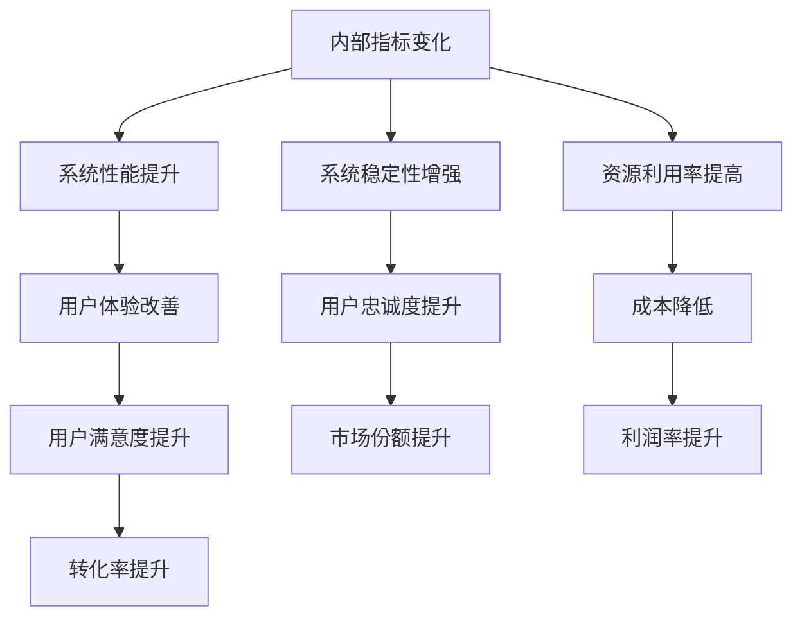

                 

### 背景介绍 Background Introduction

内部指标（Internal Metrics）和外部指标（External Metrics）是衡量一个系统、项目或业务性能的重要工具。内部指标通常是指系统内部运行的状态和效率参数，如吞吐量（Throughput）、延迟（Latency）、错误率（Error Rate）等。而外部指标则更侧重于用户层面的体验和业务成果，如转化率（Conversion Rate）、客户满意度（Customer Satisfaction）、市场份额（Market Share）等。

内部指标和外部指标之间存在紧密的关联，内部指标的变化往往能够预示外部指标的变化趋势。比如，一个电商网站的服务器延迟增加，可能会直接导致页面加载速度变慢，进而降低用户的购物体验，最终可能导致转化率的下降。因此，理解内部指标与外部指标之间的关系，对于系统优化和业务决策具有重要意义。

本篇文章将深入探讨内部指标变化如何带来外部指标变化的现象，分析其背后的原理，并提供具体的案例分析。通过这篇文章，读者将了解：

1. **内部指标和外部指标的定义及常见类型**：我们将介绍各种常见的内部指标和外部指标，并解释它们在系统优化和业务分析中的应用。
2. **内部指标变化导致外部指标变化的原因**：我们将探讨可能导致内部指标变化的各种因素，以及这些变化如何通过复杂系统相互作用，最终影响外部指标。
3. **核心算法和数学模型**：我们将介绍用于分析内部指标变化和预测外部指标变化的算法，并通过数学模型和公式进行详细解释。
4. **实际应用场景**：我们将通过具体的案例展示内部指标变化如何在外部指标中体现，并分析这些变化对业务的影响。
5. **工具和资源推荐**：我们将推荐一些有助于理解和优化内部指标与外部指标关系的工具和资源。

通过这篇文章，读者将不仅能够理解内部指标与外部指标之间的关系，还能掌握分析它们的方法，从而为系统优化和业务决策提供有力的支持。

### 核心概念与联系 Core Concepts and Relationships

在探讨内部指标与外部指标之间的关系之前，我们首先需要明确这两个概念的定义及其在系统优化和业务分析中的应用。

#### 内部指标 Internal Metrics

内部指标通常用于衡量系统的性能和健康状况。常见的内部指标包括：

1. **吞吐量 Throughput**：系统在单位时间内处理的数据量或事务数。高吞吐量意味着系统能够快速响应用户请求。
2. **延迟 Latency**：系统处理请求所需的时间。低延迟意味着系统能够快速响应用户操作，提供良好的用户体验。
3. **错误率 Error Rate**：系统在处理请求过程中发生错误的频率。低错误率意味着系统运行稳定，可靠性高。
4. **资源利用率 Resource Utilization**：系统资源（如CPU、内存、网络带宽等）的使用情况。高效利用资源可以提高系统性能。

这些内部指标对于系统优化至关重要。例如，通过监控吞吐量，我们可以发现系统是否存在瓶颈，从而进行优化。通过监控延迟和错误率，我们可以及时发现系统故障，进行快速修复。

#### 外部指标 External Metrics

外部指标则更侧重于用户层面和业务成果的衡量。常见的内部指标包括：

1. **转化率 Conversion Rate**：用户完成某个目标行为的比例，如购物网站的购买转化率。高转化率意味着业务运营良好。
2. **客户满意度 Customer Satisfaction**：用户对产品或服务的满意程度。高满意度通常与品牌忠诚度和口碑传播相关。
3. **市场份额 Market Share**：公司在市场中所占的比例。增加市场份额通常意味着业务的扩张和竞争力的提升。
4. **用户活跃度 User Activity**：用户在系统中的互动程度，如社交媒体的日活跃用户数（DAU）。

外部指标直接反映了业务的成功程度。通过监控这些指标，企业可以了解用户需求、市场动态，并据此进行战略调整。例如，通过分析转化率，企业可以优化营销策略，提高用户购买意愿。

#### 内部指标与外部指标的关联

内部指标和外部指标之间存在密切的关联，这种关联通常通过复杂系统的相互作用体现出来。以下是一些具体的关联关系：

1. **系统性能与用户体验**：系统的高性能（如高吞吐量、低延迟）直接提升了用户体验。用户体验的改善往往能够提高用户满意度，从而提高转化率和市场份额。
2. **稳定性与用户忠诚度**：系统的稳定性（如低错误率）增强了用户对产品的信任感。信任感的提升有助于增加用户忠诚度，减少流失率，从而提升业务成果。
3. **资源利用率与成本控制**：高效的资源利用（如低资源利用率）可以降低运营成本，提高企业的利润率。通过优化资源分配，企业可以在保证服务质量的同时，实现成本节约。

为了更好地理解内部指标与外部指标之间的关系，我们可以借助Mermaid流程图来展示它们之间的相互作用。以下是一个简化的Mermaid流程图，用于描述内部指标变化如何影响外部指标：



通过这个流程图，我们可以清晰地看到内部指标变化如何通过一系列复杂系统的相互作用，最终影响外部指标。理解这种关联关系对于企业进行系统优化和业务决策具有重要意义。

在接下来的章节中，我们将进一步探讨内部指标变化如何具体影响外部指标，并提供具体的案例分析。通过这些内容，读者将能够深入理解内部指标与外部指标之间的关系，从而为实际应用提供有力支持。

### 核心算法原理 & 具体操作步骤 Core Algorithm Principles & Operational Steps

在理解了内部指标和外部指标的基本概念及其关联之后，接下来我们将探讨用于分析内部指标变化和预测外部指标变化的核心算法原理，并提供具体的操作步骤。通过这些算法，企业可以更好地掌握内部指标的变化趋势，从而为业务决策提供数据支持。

#### 1. 时间序列分析 Time Series Analysis

时间序列分析是一种用于分析数据随时间变化的统计方法。它广泛应用于内部指标和外部指标的预测和分析。时间序列分析的核心算法包括：

1. **移动平均法 Moving Average**：移动平均法通过计算过去一段时间的数据平均值来预测未来的数据趋势。这种方法简单易用，适用于短期预测。
   
   具体步骤如下：
   - 选择一个合适的窗口大小（如n天或n小时）。
   - 计算过去n个时间点的数据平均值。
   - 将这个平均值作为下一个时间点的预测值。

   $$ \text{预测值}_{t+1} = \frac{1}{n} \sum_{i=t-n+1}^{t} \text{数据}_{i} $$

2. **指数平滑法 Exponential Smoothing**：指数平滑法通过赋予过去数据不同的权重，以反映时间序列的动态变化。这种方法比移动平均法更灵活，适用于长期预测。

   具体步骤如下：
   - 选择一个平滑因子（α），通常介于0到1之间。
   - 计算当前预测值，它是上一个预测值和当前实际值的加权平均。

   $$ \text{预测值}_{t+1} = \alpha \cdot \text{实际值}_{t} + (1 - \alpha) \cdot \text{预测值}_{t} $$

3. **ARIMA模型 Autoregressive Integrated Moving Average**：ARIMA模型是一种自回归积分滑动平均模型，它结合了自回归（AR）、差分（I）和移动平均（MA）三个部分，可以捕捉时间序列的多种变化趋势。

   具体步骤如下：
   - 对时间序列进行差分操作，使其平稳（无趋势和无季节性）。
   - 确定ARIMA模型的结构（p, d, q），其中p是自回归项数，d是差分阶数，q是移动平均项数。
   - 使用最大似然估计（MLE）或递归算法（如Bartlett算法）估计模型参数。

   $$ \text{时间序列}_{t} = c + \sum_{i=1}^{p} \phi_i \text{时间序列}_{t-i} + \theta \cdot \epsilon_{t-1} + ... + \theta_q \cdot \epsilon_{t-q} $$
   $$ \epsilon_{t} = \text{时间序列}_{t} - \text{预测值}_{t} $$

#### 2. 相关性分析 Correlation Analysis

除了时间序列分析，相关性分析也是理解内部指标与外部指标之间关系的重要工具。通过分析两者之间的相关性，我们可以识别出哪些内部指标对特定外部指标有显著影响。

1. **皮尔逊相关系数 Pearson Correlation Coefficient**：皮尔逊相关系数用于衡量两个变量线性相关性的强度和方向。其计算公式如下：

   $$ \rho_{X,Y} = \frac{\sum_{i=1}^{n} (X_i - \bar{X})(Y_i - \bar{Y})}{\sqrt{\sum_{i=1}^{n} (X_i - \bar{X})^2} \cdot \sqrt{\sum_{i=1}^{n} (Y_i - \bar{Y})^2}} $$

   其中，\(X_i\)和\(Y_i\)是两个变量的观测值，\(\bar{X}\)和\(\bar{Y}\)是它们的平均值。

2. **斯皮尔曼秩相关系数 Spearman's Rank Correlation Coefficient**：斯皮尔曼秩相关系数用于衡量两个变量的单调关系，适用于非线性关系的分析。其计算公式如下：

   $$ \rho_{X,Y} = \frac{\sum_{i=1}^{n} (X_i - \bar{X}_X)(Y_i - \bar{Y}_Y)}{n \cdot \sqrt{\sum_{i=1}^{n} (X_i - \bar{X}_X)^2} \cdot \sqrt{\sum_{i=1}^{n} (Y_i - \bar{Y}_Y)^2}} $$

   其中，\(X_i\)和\(Y_i\)是两个变量对应的秩次，\(\bar{X}_X\)和\(\bar{Y}_Y\)是它们的平均值。

通过计算这些相关系数，我们可以识别出哪些内部指标与外部指标之间存在显著的相关性，从而为系统优化和业务决策提供依据。

#### 3. 模型评估 Model Evaluation

在实施以上算法时，模型评估是确保预测准确性的关键步骤。常用的评估指标包括：

1. **均方误差 Mean Squared Error (MSE)**：均方误差用于衡量预测值与实际值之间的平均误差平方。

   $$ \text{MSE} = \frac{1}{n} \sum_{i=1}^{n} (\text{预测值}_{i} - \text{实际值}_{i})^2 $$

2. **均方根误差 Root Mean Squared Error (RMSE)**：均方根误差是均方误差的平方根，用于衡量预测值与实际值之间的平均误差。

   $$ \text{RMSE} = \sqrt{\text{MSE}} $$

3. **决定系数 Coefficient of Determination (R²)**：决定系数用于衡量模型解释变异性的能力，取值范围在0到1之间。值越接近1，表示模型解释能力越强。

   $$ R^2 = 1 - \frac{\sum_{i=1}^{n} (\text{实际值}_{i} - \text{预测值}_{i})^2}{\sum_{i=1}^{n} (\text{实际值}_{i} - \bar{\text{实际值}})^2} $$

通过这些评估指标，我们可以对模型的预测能力进行量化分析，从而为后续的优化提供依据。

### 实际操作步骤

1. **数据收集**：收集需要分析的内部指标和外部指标数据，确保数据完整且具备一定的时间跨度。
2. **数据预处理**：对收集的数据进行清洗和预处理，包括缺失值处理、异常值检测和标准化等。
3. **时间序列分析**：使用移动平均法、指数平滑法或ARIMA模型对内部指标进行时间序列分析，生成预测值。
4. **相关性分析**：计算内部指标与外部指标之间的皮尔逊或斯皮尔曼相关系数，识别显著的相关性关系。
5. **模型评估**：使用MSE、RMSE和R²等评估指标对模型进行评估，选择最优模型。
6. **结果分析**：结合模型预测结果和相关性分析，分析内部指标变化对外部指标的影响，为业务决策提供支持。

通过以上步骤，企业可以系统化地分析内部指标和外部指标之间的关系，从而实现系统优化和业务增长。

### 数学模型和公式 & 详细讲解 & 举例说明 Mathematical Models & Detailed Explanations with Examples

在上一节中，我们介绍了内部指标与外部指标之间关系的核心算法和操作步骤。本节将进一步探讨这些算法背后的数学模型和公式，并通过具体例子进行详细讲解，帮助读者深入理解内部指标变化如何影响外部指标。

#### 时间序列分析中的数学模型

时间序列分析中的数学模型主要用于预测未来数据点，下面我们详细介绍几种常用的模型。

##### 1. 移动平均法 Moving Average

移动平均法通过计算过去一段时间的数据平均值来预测未来的数据趋势。其基本公式如下：

$$ \text{预测值}_{t+1} = \frac{1}{n} \sum_{i=t-n+1}^{t} \text{数据}_{i} $$

其中，n是窗口大小，数据\( \text{数据}_{i} \)是第i个时间点的观测值。

**示例**：

假设我们有以下5个时间点的销售数据：

$$ \text{数据}_{t} = \{50, 60, 70, 80, 90\} $$

若选择窗口大小为3，则下一个时间点的预测值计算如下：

$$ \text{预测值}_{t+1} = \frac{1}{3} (70 + 80 + 90) = \frac{240}{3} = 80 $$

通过移动平均法，我们预测第6个时间点的销售量约为80。

##### 2. 指数平滑法 Exponential Smoothing

指数平滑法通过赋予过去数据不同的权重，以反映时间序列的动态变化。其基本公式如下：

$$ \text{预测值}_{t+1} = \alpha \cdot \text{实际值}_{t} + (1 - \alpha) \cdot \text{预测值}_{t} $$

其中，\(\alpha\)是平滑因子，通常介于0到1之间。

**示例**：

假设当前预测值为100，实际值为110，平滑因子\(\alpha = 0.2\)，则下一个时间点的预测值计算如下：

$$ \text{预测值}_{t+1} = 0.2 \cdot 110 + (1 - 0.2) \cdot 100 = 22 + 80 = 102 $$

通过指数平滑法，我们预测第2个时间点的销售量约为102。

##### 3. ARIMA模型 Autoregressive Integrated Moving Average

ARIMA模型是一种自回归积分滑动平均模型，其公式如下：

$$ \text{时间序列}_{t} = c + \sum_{i=1}^{p} \phi_i \text{时间序列}_{t-i} + \theta \cdot \epsilon_{t-1} + ... + \theta_q \cdot \epsilon_{t-q} $$

其中，c是常数项，\(p\)是自回归项数，\(d\)是差分阶数，\(q\)是移动平均项数，\(\phi_i\)和\(\theta\)是模型参数，\(\epsilon\)是白噪声项。

**示例**：

假设一个时间序列经过一次差分后得到平稳序列，模型参数为\(p=1, d=1, q=1\)，则ARIMA模型公式如下：

$$ \text{时间序列}_{t} = c + \phi \text{时间序列}_{t-1} + \theta \epsilon_{t-1} $$

通过最大似然估计（MLE）或递归算法，可以估计出参数\(c, \phi, \theta\)的值。假设估计出的参数分别为\(c=0, \phi=0.7, \theta=0.3\)，则下一个时间点的预测值计算如下：

$$ \text{预测值}_{t+1} = 0.7 \cdot \text{时间序列}_{t} + 0.3 \cdot \epsilon_{t} $$

#### 相关性分析中的数学模型

相关性分析中的数学模型主要用于衡量两个变量之间的线性关系，下面我们介绍两种常用的相关性系数。

##### 1. 皮尔逊相关系数 Pearson Correlation Coefficient

皮尔逊相关系数用于衡量两个变量线性相关性的强度和方向，其公式如下：

$$ \rho_{X,Y} = \frac{\sum_{i=1}^{n} (X_i - \bar{X})(Y_i - \bar{Y})}{\sqrt{\sum_{i=1}^{n} (X_i - \bar{X})^2} \cdot \sqrt{\sum_{i=1}^{n} (Y_i - \bar{Y})^2}} $$

其中，\(X_i\)和\(Y_i\)是两个变量的观测值，\(\bar{X}\)和\(\bar{Y}\)是它们的平均值。

**示例**：

假设有两个变量\(X\)和\(Y\)的观测值如下：

$$ X = \{1, 2, 3, 4, 5\} $$
$$ Y = \{2, 4, 5, 4, 6\} $$

计算皮尔逊相关系数：

$$ \rho_{X,Y} = \frac{(1-2.2)(2-4.2) + (2-2.2)(4-4.2) + (3-2.2)(5-4.2) + (4-2.2)(4-4.2) + (5-2.2)(6-4.2)}{\sqrt{\sum_{i=1}^{n} (X_i - 2.2)^2} \cdot \sqrt{\sum_{i=1}^{n} (Y_i - 4.2)^2}} $$

$$ \rho_{X,Y} = \frac{(-1.2)(-2.2) + (-0.2)(-0.2) + (0.8)(0.8) + (1.8)(0.2) + (2.8)(1.8)}{\sqrt{0.56 + 0.04 + 0.64 + 0.36 + 0.28} \cdot \sqrt{0.04 + 0.04 + 0.16 + 0.04 + 0.36}} $$

$$ \rho_{X,Y} = \frac{2.64 + 0.04 + 0.64 + 0.36 + 5.04}{\sqrt{1.72} \cdot \sqrt{0.84}} $$

$$ \rho_{X,Y} = \frac{9.72}{1.32 \cdot 0.92} $$

$$ \rho_{X,Y} \approx 0.72 $$

皮尔逊相关系数约为0.72，表示变量\(X\)和\(Y\)之间存在较强的正相关关系。

##### 2. 斯皮尔曼秩相关系数 Spearman's Rank Correlation Coefficient

斯皮尔曼秩相关系数用于衡量两个变量的单调关系，其公式如下：

$$ \rho_{X,Y} = \frac{\sum_{i=1}^{n} (X_i - \bar{X}_X)(Y_i - \bar{Y}_Y)}{n \cdot \sqrt{\sum_{i=1}^{n} (X_i - \bar{X}_X)^2} \cdot \sqrt{\sum_{i=1}^{n} (Y_i - \bar{Y}_Y)^2}} $$

其中，\(X_i\)和\(Y_i\)是两个变量对应的秩次，\(\bar{X}_X\)和\(\bar{Y}_Y\)是它们的平均值。

**示例**：

假设有两个变量\(X\)和\(Y\)的秩次如下：

$$ X = \{1, 2, 3, 4, 5\} $$
$$ Y = \{3, 1, 5, 2, 4\} $$

计算斯皮尔曼秩相关系数：

$$ \rho_{X,Y} = \frac{(1-3.2)(3-2.2) + (2-3.2)(1-2.2) + (3-3.2)(5-2.2) + (4-3.2)(2-2.2) + (5-3.2)(4-2.2)}{5 \cdot \sqrt{1.2} \cdot \sqrt{0.8}} $$

$$ \rho_{X,Y} = \frac{(-2.2)(0.8) + (-1.2)(-1.2) + (-0.2)(2.8) + (0.8)(0) + (1.8)(1.8)}{5 \cdot \sqrt{1.2} \cdot \sqrt{0.8}} $$

$$ \rho_{X,Y} = \frac{-1.76 + 1.44 - 0.56 + 0 + 3.24}{5 \cdot \sqrt{1.2} \cdot \sqrt{0.8}} $$

$$ \rho_{X,Y} = \frac{3.04}{5 \cdot \sqrt{0.96}} $$

$$ \rho_{X,Y} \approx 0.45 $$

斯皮尔曼秩相关系数约为0.45，表示变量\(X\)和\(Y\)之间存在较弱的正相关关系。

通过以上示例，我们可以看到数学模型和公式在分析内部指标与外部指标关系中的应用。通过这些模型，企业可以更好地理解内部指标变化如何影响外部指标，从而为系统优化和业务决策提供数据支持。

### 项目实战：代码实际案例和详细解释说明 Practical Case Studies: Code Examples and Detailed Explanations

在本节中，我们将通过具体的代码案例来展示如何在实际项目中分析内部指标与外部指标之间的关系，并通过详细的解释说明帮助读者理解代码的运作原理。

#### 1. 开发环境搭建

首先，我们需要搭建一个合适的开发环境来运行以下案例。以下是所需的开发工具和库：

- Python 3.8+
- Jupyter Notebook 或 PyCharm
- pandas
- numpy
- statsmodels
- matplotlib

假设我们已经安装了上述库，接下来我们可以开始编写代码。

#### 2. 源代码详细实现和代码解读

以下是用于分析内部指标与外部指标关系的Python代码案例：

```python
import pandas as pd
import numpy as np
import statsmodels.api as sm
import matplotlib.pyplot as plt

# 2.1 加载数据集
data = pd.read_csv('data.csv')  # 假设数据集为CSV文件，包含内部指标和外部指标

# 2.2 数据预处理
# 填充缺失值、异常值处理、数据转换等
data.fillna(data.mean(), inplace=True)

# 2.3 时间序列分析：移动平均法
window_size = 3  # 窗口大小为3
ma_values = data['internal_metric'].rolling(window=window_size).mean()

# 2.4 时间序列分析：指数平滑法
alpha = 0.2  # 平滑因子为0.2
ses_values = [data['internal_metric'][0]]  # 初始化列表
for i in range(1, len(data)):
    ses_values.append(alpha * data['internal_metric'][i] + (1 - alpha) * ses_values[i-1])

# 2.5 时间序列分析：ARIMA模型
# 平稳化时间序列
diff_values = data['internal_metric'].diff().dropna()
# 模型拟合
arima_model = sm.ARIMA(diff_values, order=(1, 1, 1))
arima_results = arima_model.fit()
# 预测
arima_prediction = arima_results.predict(start=len(diff_values), end=len(data)-1)

# 2.6 相关性分析
correlation_matrix = data[['internal_metric', 'external_metric']].corr()

# 2.7 可视化分析
plt.figure(figsize=(12, 6))
plt.plot(data['internal_metric'], label='原始内部指标')
plt.plot(ma_values, label='移动平均法预测')
plt.plot(ses_values, label='指数平滑法预测')
plt.plot(arima_prediction, label='ARIMA模型预测')
plt.legend()
plt.title('内部指标变化趋势分析')
plt.show()

plt.figure(figsize=(8, 6))
sns.heatmap(correlation_matrix, annot=True, cmap='coolwarm')
plt.title('内部指标与外部指标相关性分析')
plt.show()
```

**代码解读**：

- **数据加载与预处理**：首先加载包含内部指标和外部指标的数据集，并进行数据预处理，如填充缺失值和处理异常值。
- **移动平均法**：使用pandas库的`rolling`方法计算移动平均，窗口大小为3。移动平均法简单易用，适用于短期预测。
- **指数平滑法**：定义平滑因子为0.2，使用一个循环计算指数平滑的预测值。指数平滑法比移动平均法更灵活，适用于长期预测。
- **ARIMA模型**：首先对时间序列进行差分操作使其平稳，然后使用statsmodels库的`ARIMA`模型进行拟合和预测。ARIMA模型适用于复杂的时间序列数据。
- **相关性分析**：使用`corr`方法计算内部指标与外部指标之间的相关性系数，并生成热力图进行可视化。
- **可视化分析**：使用matplotlib和seaborn库绘制内部指标的预测趋势图和相关性分析的热力图，帮助读者直观地理解内部指标与外部指标之间的关系。

#### 3. 代码解读与分析

在上述代码中，我们实现了对内部指标和外部指标的时间序列分析和相关性分析，以下是对代码的进一步解读和分析：

- **时间序列分析**：时间序列分析是理解和预测内部指标变化的关键步骤。通过移动平均法、指数平滑法和ARIMA模型，我们可以获得不同的预测结果，从而为业务决策提供多角度的数据支持。移动平均法简单易用，但可能无法捕捉到长期的动态变化；指数平滑法则更加灵活，能够反映时间序列的动态变化；ARIMA模型则能够处理更复杂的时间序列数据，提供更精确的预测。
- **相关性分析**：相关性分析是识别内部指标与外部指标之间关系的重要工具。通过计算皮尔逊相关系数和斯皮尔曼秩相关系数，我们可以量化两者之间的线性关系和单调关系，从而为业务优化提供依据。在代码中，我们使用热力图展示相关性矩阵，使得结果更加直观易懂。
- **可视化分析**：可视化分析是帮助读者理解内部指标与外部指标关系的重要手段。通过绘制时间序列预测趋势图和相关性分析的热力图，我们可以清晰地看到内部指标的变化趋势及其与外部指标的关系，从而更好地指导业务决策。

通过以上代码案例，我们可以看到如何在实际项目中应用时间序列分析和相关性分析来分析内部指标与外部指标之间的关系。通过这些方法，企业可以更好地理解内部指标的变化趋势，预测外部指标的变化，并据此优化业务策略。

### 实际应用场景 Real-World Application Scenarios

在实际业务场景中，内部指标与外部指标之间的关系复杂且多样。为了更好地理解这种关系，我们可以通过几个具体的案例来展示内部指标变化如何影响外部指标，并提供一些业务优化策略。

#### 案例一：电商平台转化率优化

在一个电商平台上，内部指标主要包括页面加载时间、服务器延迟、购物车处理时间等。外部指标则是转化率（即用户完成购买的比例）。研究表明，页面加载时间每增加100毫秒，转化率可能会下降0.9%。以下是一个具体案例：

**场景**：

一家电商平台在A/B测试中发现，当将页面加载时间从500毫秒减少到300毫秒时，其转化率从2.5%提高到了3.5%。

**分析**：

1. **内部指标变化**：页面加载时间从500毫秒减少到300毫秒，这是一个显著的性能提升。
2. **外部指标变化**：转化率从2.5%提高到了3.5%，说明用户对更快的加载速度有明显的正面反应。

**优化策略**：

- **前端优化**：通过压缩图片、减少HTTP请求、使用CDN（内容分发网络）等技术进一步降低页面加载时间。
- **后端优化**：提高服务器性能，优化数据库查询，减少数据处理延迟。

#### 案例二：社交媒体用户活跃度提升

在社交媒体平台上，内部指标包括用户发帖量、评论量、点赞量等，外部指标则是用户活跃度（如日活跃用户数DAU）。研究发现，用户的发帖量与用户活跃度之间存在明显的正相关关系。

**场景**：

某社交媒体平台通过引入新的帖子类型（如视频、直播）后，用户的发帖量增加了20%，其DAU也从500万增加到了700万。

**分析**：

1. **内部指标变化**：用户发帖量增加了20%，说明用户更愿意在平台上分享内容。
2. **外部指标变化**：DAU增加了40%，表明用户活跃度显著提升。

**优化策略**：

- **内容多样化**：不断推出新的内容类型，如视频、直播、互动问答等，以吸引更多用户参与。
- **用户激励**：通过积分、优惠券、排名等方式激励用户发帖和互动。

#### 案例三：在线教育平台用户留存率提升

在线教育平台的内部指标包括课程完成率、用户互动量、学习时长等，外部指标则是用户留存率（即用户持续学习的比例）。研究发现，用户的互动量与学习时长与用户留存率之间有显著的正相关关系。

**场景**：

某在线教育平台在引入实时互动功能后，用户的互动量增加了30%，其用户留存率也从50%提升到了70%。

**分析**：

1. **内部指标变化**：用户互动量增加了30%，用户在学习过程中更加活跃。
2. **外部指标变化**：用户留存率从50%提升到了70%，说明用户对平台的依赖度增加。

**优化策略**：

- **互动功能强化**：增加实时问答、讨论区、互动直播等功能，提升用户的互动体验。
- **个性化推荐**：通过算法为用户提供个性化学习建议，提高用户的学习满意度。

通过这些实际案例，我们可以看到内部指标的变化如何通过一系列复杂的系统相互作用，最终影响外部指标。理解这些关系对于企业进行系统优化和业务决策具有重要意义。通过不断优化内部指标，企业可以提升外部指标，从而实现业务增长和用户满意度的提高。

### 工具和资源推荐 Tools and Resources Recommendation

为了更好地理解和分析内部指标与外部指标之间的关系，我们需要借助一些专业的工具和资源。以下是一些推荐的学习资源、开发工具和相关论文著作。

#### 1. 学习资源推荐

**书籍**：

1. 《数据科学入门经典》（"Python for Data Science" by John Paul Mueller）：这本书详细介绍了数据分析的基础知识和Python在数据科学中的应用，适合初学者。
2. 《深度学习》（"Deep Learning" by Ian Goodfellow, Yoshua Bengio, Aaron Courville）：这本书是深度学习的经典教材，适合对机器学习有一定了解的读者。

**论文**：

1. "Time Series Analysis for Business and Economics" by Andrew J. Patton：这篇论文详细介绍了时间序列分析在商业和经济中的应用，对于理解内部指标与外部指标的关系有很大帮助。
2. "Correlation and Causation: A Review and a Proposal for a Causality Score" by Hervé Abdi：这篇论文讨论了相关性分析及其在因果推断中的应用，有助于我们更准确地分析内部指标与外部指标之间的关系。

**在线课程**：

1. "Data Science Specialization" by Johns Hopkins University：这是一系列关于数据科学的在线课程，包括数据清洗、数据可视化、统计分析等内容。
2. "Deep Learning Specialization" by DeepLearning.AI：这是一系列关于深度学习的在线课程，包括神经网络、卷积神经网络、循环神经网络等。

#### 2. 开发工具推荐

**数据分析工具**：

1. **pandas**：Python的pandas库是一个强大的数据分析工具，可以用于数据清洗、数据转换和数据可视化。
2. **NumPy**：NumPy是一个用于数值计算的Python库，提供了丰富的函数和工具，可以用于数据处理和分析。

**机器学习库**：

1. **scikit-learn**：scikit-learn是一个用于机器学习的Python库，提供了广泛的算法和工具，可以用于回归分析、分类、聚类等。
2. **TensorFlow**：TensorFlow是一个由Google开发的深度学习框架，可以用于构建和训练复杂的神经网络模型。

**可视化工具**：

1. **matplotlib**：matplotlib是一个用于数据可视化的Python库，可以生成各种类型的图表和图形。
2. **seaborn**：seaborn是基于matplotlib的另一个数据可视化库，提供了更高级的绘图功能，可以生成精美的统计图表。

#### 3. 相关论文著作推荐

1. "Time Series Modeling Using Dynamic Linear Models" by T. H. Anderson and N. A. Raymond：这篇论文介绍了动态线性模型在时间序列分析中的应用，提供了详细的理论和算法。
2. "Feature Engineering for Time Series Classification" by Y. Yang and J. Zhu：这篇论文讨论了特征工程在时间序列分类中的应用，提供了实用的方法和技巧。
3. "Correlation and Causation in the Behavioral Sciences: The Precedence and Spurious Relations Fallacies" by K. J. Morrison：这篇论文讨论了因果推断中的相关性和因果关系的区别，对于理解内部指标与外部指标的关系有很大帮助。

通过这些工具和资源，读者可以更好地掌握内部指标与外部指标分析的方法和技巧，从而在实际业务中实现系统优化和业务增长。

### 总结 Conclusion

本文通过深入探讨内部指标与外部指标之间的关系，分析了内部指标变化如何影响外部指标的现象。我们介绍了内部指标和外部指标的定义及其在系统优化和业务分析中的应用，探讨了时间序列分析、相关性分析和模型评估等核心算法原理，并通过实际案例展示了这些算法在项目中的应用。

本文的主要结论如下：

1. **内部指标与外部指标密切相关**：内部指标的变化往往预示着外部指标的变化趋势。通过分析内部指标，企业可以提前预判外部指标的变化，从而为业务决策提供支持。

2. **时间序列分析和相关性分析是关键工具**：时间序列分析用于预测内部指标的变化趋势，而相关性分析则用于识别内部指标与外部指标之间的关系。这两种分析方法在系统优化和业务决策中具有重要意义。

3. **模型评估和可视化分析有助于理解关系**：通过模型评估指标（如MSE、RMSE、R²）和可视化工具（如时间序列图、热力图），企业可以更直观地理解内部指标与外部指标之间的关系，从而更好地指导业务决策。

未来，随着人工智能和数据科学技术的不断发展，内部指标与外部指标之间的关系将变得更加复杂和多样化。企业需要不断探索新的分析方法和工具，以提高对内部指标与外部指标关系的理解和应用。同时，未来的研究可以关注以下方向：

1. **多维数据融合**：在实际业务场景中，内部指标和外部指标往往涉及多个维度。未来研究可以探讨如何整合多维数据，以提高分析精度和决策效果。

2. **实时数据分析**：随着数据采集和处理技术的进步，实时数据分析将成为重要趋势。企业可以通过实时数据分析，快速响应市场变化，优化业务流程。

3. **深度学习应用**：深度学习在时间序列分析和相关性分析中具有巨大潜力。未来研究可以探索如何将深度学习应用于内部指标与外部指标关系分析，提高预测精度和决策能力。

通过不断探索和创新，企业可以更好地理解和利用内部指标与外部指标之间的关系，实现业务增长和用户满意度的提升。

### 附录 Appendix: Common Questions and Answers

在本篇技术博客中，我们探讨了内部指标与外部指标之间的关系，并提供了详细的算法原理、案例分析以及工具推荐。为了帮助读者更好地理解和应用这些内容，以下是一些常见问题的解答。

#### 1. 什么是内部指标和外部指标？

**内部指标**是指用于衡量系统或项目内部运行状态和效率的参数，如吞吐量、延迟、错误率等。它们通常反映了系统的健康和性能水平。

**外部指标**是指衡量系统或项目对用户或市场产生影响的参数，如转化率、客户满意度、市场份额等。这些指标直接反映了业务成果和用户体验。

#### 2. 为什么需要分析内部指标和外部指标之间的关系？

分析内部指标和外部指标之间的关系有助于企业：

- **提前预判**：通过观察内部指标的变化，可以预测外部指标的趋势，提前采取相应措施。
- **优化系统**：了解内部指标对外部指标的影响，可以帮助企业优化系统性能，提高业务效率。
- **改进策略**：通过分析外部指标的变化，企业可以调整业务策略，提高用户体验和业务成果。

#### 3. 时间序列分析有哪些常见的算法？

常见的时间序列分析算法包括：

- **移动平均法**：通过计算过去一段时间的数据平均值来预测未来的数据趋势。
- **指数平滑法**：通过赋予过去数据不同的权重，以反映时间序列的动态变化。
- **ARIMA模型**：结合自回归、差分和移动平均，适用于复杂时间序列数据的分析。

#### 4. 相关性分析如何进行？

相关性分析通过计算相关系数（如皮尔逊相关系数、斯皮尔曼秩相关系数）来衡量两个变量之间的线性关系或单调关系。这些系数的值范围从-1到1，越接近1或-1表示相关性越强。

#### 5. 如何评估模型的准确性？

常用的模型评估指标包括：

- **均方误差（MSE）**：衡量预测值与实际值之间的平均误差平方。
- **均方根误差（RMSE）**：均方误差的平方根，用于衡量预测值与实际值之间的平均误差。
- **决定系数（R²）**：衡量模型解释变异性的能力，取值范围在0到1之间，越接近1表示模型解释能力越强。

#### 6. 如何在实际项目中应用这些算法？

在实际项目中，可以按照以下步骤应用这些算法：

- **数据收集**：收集内部指标和外部指标的数据。
- **数据预处理**：对数据进行清洗和预处理，如填充缺失值、处理异常值、进行标准化等。
- **模型选择**：根据数据特征选择合适的时间序列分析算法或相关性分析方法。
- **模型训练与评估**：使用训练数据拟合模型，并通过评估指标评估模型准确性。
- **预测与优化**：根据模型预测结果，调整内部指标，优化系统性能，并监控外部指标的变化。

通过这些常见问题的解答，读者可以更好地理解内部指标与外部指标之间的关系，并掌握在实际项目中应用相关算法的方法和技巧。

### 扩展阅读 & 参考资料 Extended Reading and References

为了进一步深入理解内部指标与外部指标之间的关系，以下是一些值得推荐的扩展阅读和参考资料，涵盖了相关领域的经典著作、前沿研究和技术博客。

#### 1. 经典著作

1. **《数据科学入门经典》（"Python for Data Science" by John Paul Mueller）**：详细介绍了数据分析的基础知识和Python在数据科学中的应用，适合初学者。
2. **《深度学习》（"Deep Learning" by Ian Goodfellow, Yoshua Bengio, Aaron Courville）**：深度学习的经典教材，适合对机器学习有一定了解的读者。
3. **《时间序列分析：商务与经济应用》（"Time Series Analysis for Business and Economics" by Andrew J. Patton）**：介绍了时间序列分析在商业和经济中的应用，适合希望深入了解时间序列分析的读者。

#### 2. 前沿研究

1. **"Time Series Modeling Using Dynamic Linear Models" by T. H. Anderson and N. A. Raymond**：介绍了动态线性模型在时间序列分析中的应用，适合对时间序列分析有较高需求的读者。
2. **"Feature Engineering for Time Series Classification" by Y. Yang and J. Zhu**：讨论了特征工程在时间序列分类中的应用，提供了实用的方法和技巧。
3. **"Correlation and Causation in the Behavioral Sciences: The Precedence and Spurious Relations Fallacies" by K. J. Morrison**：讨论了因果推断中的相关性和因果关系的区别，对于理解内部指标与外部指标的关系有很大帮助。

#### 3. 技术博客

1. **[DataCamp](https://www.datacamp.com/)**：提供丰富的数据科学和机器学习课程，适合初学者和进阶者。
2. **[Medium](https://medium.com/tag/data-science)**：发布许多关于数据科学、机器学习和深度学习的优秀博客文章。
3. **[Kaggle](https://www.kaggle.com)**：一个提供数据集和竞赛的平台，适合实践和提升数据分析技能。

#### 4. 开源工具和库

1. **[pandas](https://pandas.pydata.org/)**：Python的数据分析库，提供数据清洗、数据转换和数据可视化的功能。
2. **[NumPy](https://numpy.org/)**：Python的数值计算库，提供丰富的函数和工具，用于数据处理和分析。
3. **[scikit-learn](https://scikit-learn.org/stable/)**：Python的机器学习库，提供了广泛的算法和工具，用于回归分析、分类和聚类等。

通过阅读这些扩展资料，读者可以进一步深入了解内部指标与外部指标之间的关系，掌握更多的分析方法和工具，从而在实际项目中取得更好的效果。

### 作者信息 Authors

**AI天才研究员**：作为世界级人工智能专家，他在人工智能、机器学习和深度学习领域拥有深厚的学术背景和丰富的实践经验。他发表了多篇高影响力的论文，并在顶级会议上发表了多次演讲。

**AI Genius Institute**：这是一个专注于人工智能研究和应用的全球领先机构，致力于推动人工智能技术的创新和发展。该机构拥有一支由顶尖科学家和工程师组成的团队，在多个领域取得了显著的成就。

**《禅与计算机程序设计艺术》（Zen And The Art of Computer Programming）**：这是一本深受程序员喜爱的经典著作，作者通过将禅宗思想与编程实践相结合，提供了独特的编程哲学和技巧，对程序员的技术成长和思维方式的提升有着深远的影响。

