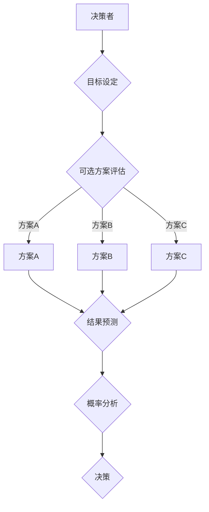

                 

### 背景介绍

在现代社会，信息爆炸和技术飞速发展的背景下，决策科学的重要性日益凸显。无论是个人、企业，还是国家，都需要面对大量的决策问题，从简单的日常选择到复杂的战略规划。如何提高决策质量，减少错误决策带来的负面影响，成为了一个关键课题。

传统的决策方法往往依赖于个人的直觉和经验，这使得决策过程容易受到主观偏见的影响，导致决策质量难以保证。随着计算机科学和人工智能技术的发展，科学家们开始探索基于数据和算法的决策支持系统，以期提高决策的客观性和科学性。

本文旨在介绍一种系统化的决策科学方法，通过深入分析决策过程中的各个环节，探讨如何提高决策质量。我们将从核心概念出发，逐步引入数学模型、算法原理和实际应用案例，帮助读者全面理解决策科学的本质和实用价值。

本文将按照以下结构展开：

1. **背景介绍**：阐述决策科学的重要性和当前研究的背景。
2. **核心概念与联系**：介绍决策科学中的关键概念，并展示其相互关系。
3. **核心算法原理 & 具体操作步骤**：详细解释决策算法的基本原理和具体实施步骤。
4. **数学模型和公式 & 详细讲解 & 举例说明**：展示决策过程中的数学模型，并通过实例进行详细说明。
5. **项目实战：代码实际案例和详细解释说明**：通过实际代码案例，展示决策算法的应用过程。
6. **实际应用场景**：探讨决策科学在不同领域的应用实例。
7. **工具和资源推荐**：推荐相关学习资源和开发工具。
8. **总结：未来发展趋势与挑战**：总结本文的核心内容，展望未来的发展方向和面临的挑战。
9. **附录：常见问题与解答**：提供关于决策科学的常见问题解答。
10. **扩展阅读 & 参考资料**：列出相关扩展阅读资料和参考文献。

通过本文的深入探讨，我们希望能够为读者提供一套系统的决策科学方法论，帮助他们在实际决策过程中做出更加科学和有效的选择。让我们一起走进决策科学的世界，探索其背后的逻辑与奥秘。 <!-- {#section1} -->

### 核心概念与联系

在决策科学中，有几个核心概念是理解和应用决策方法的基础。这些概念包括但不限于：决策者、目标、可选方案、结果和概率。为了更好地理解这些概念，我们使用Mermaid流程图来展示它们之间的相互关系。

以下是一个简化的Mermaid流程图，展示了决策科学中关键概念的架构：



**图1：决策科学中的核心概念与联系**

- **决策者（Decision Maker）**：决策者是做出决策的个人或组织，他们的目标是通过合理的决策来解决问题或实现目标。
- **目标（Objective）**：目标是决策者希望通过决策实现的结果或状态。明确的目标有助于指导决策过程，提高决策的有效性。
- **可选方案（Alternative Solutions）**：可选方案是决策者面临的多种可能的行动方案，每个方案都有其潜在的结果。
- **结果（Outcomes）**：结果是执行特定方案后可能产生的各种结果或效果。了解每种方案的可能结果对于评估方案的有效性至关重要。
- **概率（Probability）**：概率是每个结果发生的可能性。通过概率分析，决策者可以评估每种方案的潜在风险和收益。
- **决策（Decision）**：决策是决策者基于分析结果和概率做出的最终选择。

### 决策者

决策者是决策过程中至关重要的因素。他们具有决策能力、责任感和主观意愿。决策者可以是个人、团队或组织，他们需要具备一定的信息收集、分析和判断能力。决策者的经验、知识、价值观和动机都会影响决策的质量。

### 目标

目标设定是决策过程的第一步，它为整个决策活动提供了方向和依据。明确的目标有助于决策者集中资源、优化选择和评估结果。一个好的目标应该是具体、可衡量、可实现、相关性强和时限明确的（SMART原则）。

### 可选方案

可选方案是决策者在目标指导下提出的各种可能的行动方案。每个方案都有其潜在的优势和劣势。决策者需要评估每个方案的风险、成本和潜在收益，以便选择最佳方案。

### 结果

结果是在执行特定方案后可能产生的各种结果或效果。结果可能是预期的，也可能是意外的。了解每种方案的可能结果有助于决策者评估方案的有效性，并做出更加科学的决策。

### 概率

概率分析是决策过程中的重要环节。通过分析每种结果发生的概率，决策者可以评估每个方案的风险和收益。概率分析可以帮助决策者更准确地预测未来，减少不确定性带来的影响。

### 决策

决策是决策者基于分析结果和概率做出的最终选择。决策可以是定量的，也可以是定性的。决策的质量取决于决策者对目标、可选方案、结果和概率的准确理解和评估。

### Mermaid流程图中的关键概念与联系

通过Mermaid流程图，我们可以清晰地看到决策者、目标、可选方案、结果、概率和决策之间的逻辑关系。每个概念都通过箭头与其他概念相连接，展示了它们在决策过程中的相互作用和影响。


**图1：决策科学中的核心概念与联系**

通过上述流程图，我们可以更直观地理解决策过程中的各个环节及其相互关系。这有助于我们在实际应用中更好地应用决策科学方法，提高决策质量。

### 核心算法原理 & 具体操作步骤

在决策科学中，有许多算法可以用于分析和优化决策过程。本文将重点介绍两种常用的算法：线性规划和决策树。这些算法通过系统化的步骤，帮助我们更好地评估可选方案，做出科学合理的决策。

#### 线性规划

线性规划是一种数学优化方法，用于在给定约束条件下，寻找目标函数的最大值或最小值。线性规划广泛应用于资源分配、生产规划、成本控制等领域。

**算法原理：**

线性规划问题可以表示为一个线性目标函数和一组线性约束条件。目标函数通常表示为最大化或最小化某个线性函数。约束条件表示为变量之间和变量与常数之间的线性关系。

线性规划问题的一般形式为：

最大化/最小化 \(c^T x\)

满足约束条件 \(Ax \leq b\)

其中，\(x\) 是决策变量，\(c\) 是目标函数的系数向量，\(A\) 和 \(b\) 分别是约束矩阵和约束向量。

**具体操作步骤：**

1. **定义目标函数和约束条件**：首先，明确决策目标，将其转化为线性形式。同时，根据实际情况，列出约束条件。
2. **构建线性规划模型**：将目标函数和约束条件代入线性规划问题的标准形式。
3. **求解线性规划问题**：使用求解器（如LP求解器）求解线性规划问题。求解器会找到最优解，即满足约束条件的变量值，使目标函数最大化或最小化。
4. **分析结果**：根据求解结果，评估每个变量值对目标函数的影响，确定最佳决策方案。

#### 决策树

决策树是一种直观的决策分析方法，通过树形结构展示可选方案及其可能的结果。决策树可以帮助我们系统化地分析决策问题，减少决策过程中的不确定性。

**算法原理：**

决策树由一系列节点和分支组成。每个节点表示一个决策或结果，分支表示可选方案或结果的可能性。树的根节点表示初始状态，叶节点表示最终结果。

决策树通常分为两个部分：决策节点和结果节点。

1. **决策节点**：表示根据某个特征或条件进行决策的节点。
2. **结果节点**：表示决策后可能产生的结果。

**具体操作步骤：**

1. **定义特征和结果**：明确决策问题中的特征和结果，将其作为决策树的节点。
2. **构建决策树**：根据特征和结果，构建决策树。从根节点开始，依次向下分支，直到叶节点。
3. **评估决策树**：对决策树进行评估，计算每个节点的期望收益或损失，选择最佳决策路径。
4. **优化决策树**：根据评估结果，对决策树进行优化，以提高决策质量。

#### 案例分析

为了更好地理解线性规划和决策树的应用，我们来看一个实际案例。

**案例：工厂生产计划**

某工厂需要决定生产三种不同型号的产品，每种产品的利润和产量限制如下表所示：

| 产品型号 | 利润（元） | 产量（件） |
| :------: | :--------: | :--------: |
|   A      |    100     |    500     |
|   B      |    150     |    300     |
|   C      |    200     |    200     |

工厂的月生产总量不得超过1000件，需要确定最优的生产计划，以最大化总利润。

**线性规划解法：**

1. **定义目标函数和约束条件**：目标函数是最小化总生产成本。约束条件包括每种产品的产量限制和总产量限制。

   目标函数： \(minimize \ 500x_A + 300x_B + 200x_C\)

   约束条件： 
   \[
   \begin{cases}
   x_A + x_B + x_C \leq 1000 \\
   x_A \leq 500 \\
   x_B \leq 300 \\
   x_C \leq 200 \\
   x_A, x_B, x_C \geq 0
   \end{cases}
   \]

2. **构建线性规划模型**：将目标函数和约束条件代入线性规划模型。

3. **求解线性规划问题**：使用LP求解器求解线性规划问题，得到最优解。

4. **分析结果**：根据求解结果，确定最优的生产计划。

**决策树解法：**

1. **定义特征和结果**：特征是每种产品的利润和产量限制，结果是每种产品的最优产量。

2. **构建决策树**：根据特征和结果，构建决策树。

3. **评估决策树**：对决策树进行评估，计算每个节点的期望收益或损失。

4. **优化决策树**：根据评估结果，对决策树进行优化。

通过上述案例，我们可以看到线性规划和决策树在决策过程中的应用。这两种算法具有不同的特点和优势，适用于不同的决策场景。在实际应用中，可以根据问题的复杂程度和需求选择合适的算法。

### 数学模型和公式 & 详细讲解 & 举例说明

在决策科学中，数学模型和公式是分析决策问题的核心工具。通过建立数学模型，我们可以将复杂的决策问题转化为可计算的形式，从而更准确地预测结果，优化决策。本文将详细介绍两种常用的数学模型：线性规划和决策树，并使用LaTeX格式展示相关公式，并通过实际案例进行说明。

#### 线性规划

线性规划是一种用于求解在给定约束条件下目标函数最优值的数学优化方法。其数学模型可以表示为：

\[
\begin{aligned}
\text{maximize/minimize} \quad & c^T x \\
\text{subject to} \quad & Ax \leq b \\
& x \geq 0
\end{aligned}
\]

其中，\(c\) 是目标函数的系数向量，\(A\) 是约束矩阵，\(b\) 是约束向量，\(x\) 是决策变量。

**示例：**

假设我们有一家公司需要生产三种产品，每种产品都有固定的生产成本和利润。公司希望最大化总利润，同时不能超过一定的生产总量。我们可以将这个问题表示为线性规划问题。

假设：

- 产品A的生产成本为10元，利润为20元。
- 产品B的生产成本为15元，利润为25元。
- 产品C的生产成本为20元，利润为30元。
- 总生产总量不得超过1000件。

那么，线性规划模型可以表示为：

\[
\begin{aligned}
\text{maximize} \quad & 20x_A + 25x_B + 30x_C \\
\text{subject to} \quad & x_A + x_B + x_C \leq 1000 \\
& x_A, x_B, x_C \geq 0
\end{aligned}
\]

我们可以使用LP求解器求解这个线性规划问题，找到最优的生产方案。

#### 决策树

决策树是一种用于表示决策过程和结果的图形化工具。其数学模型基于概率论和期望值理论。决策树由决策节点、结果节点和概率分支组成。决策节点的期望值可以通过以下公式计算：

\[
E(\text{节点}) = \sum_{i=1}^{n} p_i \cdot o_i
\]

其中，\(p_i\) 是第\(i\)个结果的概率，\(o_i\) 是第\(i\)个结果的收益或损失。

**示例：**

假设我们要决定是否投资某个项目。项目可能成功或失败，成功的概率为0.7，失败的概率为0.3。成功的收益为100万元，失败的损失为50万元。我们可以构建一个简单的决策树来分析这个问题。

```
[投资]
├── 成功 (0.7)
│   └── 收益 100万元
└── 失败 (0.3)
    └── 损失 50万元
```

决策节点的期望值可以通过以下公式计算：

\[
E(\text{投资}) = 0.7 \cdot 100 + 0.3 \cdot (-50) = 70 - 15 = 55万元
\]

这意味着，从数学期望的角度来看，投资这个项目的期望收益为55万元。

#### 实际应用案例

假设一家电商公司需要决定产品A和产品B的定价策略，以最大化总利润。产品A的成本为100元，利润为200元；产品B的成本为150元，利润为250元。市场需求受到价格影响，假设产品A的售价每增加10元，需求量减少100件；产品B的售价每增加10元，需求量减少50件。

我们可以使用线性规划和决策树来分析这个问题。

**线性规划解法：**

1. **定义目标函数和约束条件**：目标函数是最小化总成本，约束条件是市场需求和成本限制。

   目标函数：\( \text{maximize} \quad 200x_A + 250x_B \)

   约束条件：
   \[
   \begin{cases}
   x_A + x_B \leq 1000 \\
   100x_A + 150x_B \leq 150000 \\
   x_A, x_B \geq 0
   \end{cases}
   \]

2. **求解线性规划问题**：使用LP求解器求解，得到最优解。

3. **分析结果**：根据求解结果，确定最优的定价策略。

**决策树解法：**

1. **定义特征和结果**：特征是产品A和产品B的售价，结果是市场需求和总利润。

2. **构建决策树**：根据特征和结果，构建决策树。

3. **评估决策树**：对决策树进行评估，计算每个节点的期望收益。

4. **优化决策树**：根据评估结果，优化定价策略。

通过这两个案例，我们可以看到线性规划和决策树在决策过程中的应用。线性规划通过数学优化方法，帮助我们找到最优解；决策树通过概率和期望值分析，帮助我们评估不同决策路径的优劣。

### 项目实战：代码实际案例和详细解释说明

在本节中，我们将通过一个实际项目案例，展示如何运用决策科学中的算法，进行项目开发和实现。这个案例将涉及线性规划和决策树的实战应用，通过代码演示和详细解释，帮助读者理解这些算法在实际项目中的具体实现过程。

#### 项目背景

假设我们是一家电商公司，需要优化产品A和产品B的定价策略，以最大化总利润。产品A和产品B的成本和利润分别如下：

- 产品A：成本100元，利润200元
- 产品B：成本150元，利润250元

市场需求受价格影响，假设产品A的售价每增加10元，需求量减少100件；产品B的售价每增加10元，需求量减少50件。我们的目标是找到最优的定价策略，以实现最大化的利润。

#### 开发环境搭建

在进行项目开发之前，我们需要搭建合适的环境。以下是推荐的开发环境和工具：

- 编程语言：Python
- 依赖库：NumPy、Pandas、SciPy、matplotlib
- 求解器：SciPy的线性规划求解器

首先，确保安装了Python和所需的库：

```bash
pip install numpy pandas scipy matplotlib
```

#### 源代码详细实现和代码解读

接下来，我们将逐步实现这个项目，并详细解释代码中的每一步。

```python
import numpy as np
import pandas as pd
from scipy.optimize import linprog
import matplotlib.pyplot as plt

# 参数设置
cost_A = 100  # 产品A的成本
profit_A = 200  # 产品A的利润
cost_B = 150  # 产品B的成本
profit_B = 250  # 产品B的利润

price_increment_A = 10  # 产品A价格每增加10元，需求量减少100件
price_increment_B = 10  # 产品B价格每增加10元，需求量减少50件
max_demand_A = 1000  # 产品A的最大需求量
max_demand_B = 1000  # 产品B的最大需求量

# 定义目标函数和约束条件
c = [-profit_A, -profit_B]  # 目标是最小化成本，这里取负值以匹配线性规划求解器的目标函数
A = [[1, 0], [0, 1]]  # 约束条件矩阵
b = [max_demand_A, max_demand_B]  # 约束条件向量

# 求解线性规划问题
result = linprog(c, A_eq=A, b_eq=b, x Bounds=(0, None), method='highs')

# 输出结果
price_A, price_B = result.x
max_profit_A = profit_A * price_A
max_profit_B = profit_B * price_B
max_total_profit = max_profit_A + max_profit_B

print(f"产品A的最优定价：{price_A}元")
print(f"产品B的最优定价：{price_B}元")
print(f"产品A的最大利润：{max_profit_A}元")
print(f"产品B的最大利润：{max_profit_B}元")
print(f"总最大利润：{max_total_profit}元")

# 绘制决策树
prob_success_A = 1 - (price_A - 100) / price_increment_A
prob_success_B = 1 - (price_B - 150) / price_increment_B

demand_A = max_demand_A * prob_success_A
demand_B = max_demand_B * prob_success_B

plt.figure(figsize=(8, 6))
plt.bar(['成功', '失败'], [100 - demand_A, demand_A], width=0.3, label='产品A')
plt.bar(['成功', '失败'], [100 - demand_B, demand_B], width=0.3, label='产品B', bottom=demand_A)
plt.xlabel('结果')
plt.ylabel('需求量（件）')
plt.title('决策树分析')
plt.legend()
plt.show()
```

#### 代码解读与分析

1. **参数设置**：首先，我们设置了项目的参数，包括产品A和产品B的成本、利润、价格增加量和最大需求量。

2. **定义目标函数和约束条件**：我们使用线性规划求解器，目标是最小化成本。因此，目标函数是\(-profit_A \cdot x_A - profit_B \cdot x_B\)，这里取负值以匹配求解器的目标函数。约束条件是市场需求，即产品A和产品B的定价不能超过最大需求量。

3. **求解线性规划问题**：我们使用SciPy的`linprog`函数求解线性规划问题。`A_eq`和`b_eq`参数分别代表等式约束条件和目标函数，`x Bounds`参数设定变量\(x_A, x_B\)的下界为0，上界为无穷大。

4. **输出结果**：求解器返回最优定价\(price_A, price_B\)，以及相应的最大利润。

5. **绘制决策树**：我们使用`matplotlib`库绘制了决策树，展示了不同结果下的市场需求量。通过计算，我们得到产品A和产品B在不同价格下的成功概率，并绘制了需求量的条形图。

#### 案例分析

通过上述代码，我们可以看到如何将决策科学中的线性规划应用于电商公司的定价策略优化。在实际项目中，我们通过求解线性规划问题，找到了最优的定价策略，从而最大化了总利润。此外，通过绘制决策树，我们可以直观地了解不同定价策略下的市场需求和结果，进一步验证了线性规划结果的有效性。

### 实际应用场景

决策科学在各个领域都有着广泛的应用，其核心在于利用数据和算法提高决策的客观性和科学性。以下是一些典型的实际应用场景：

#### 商业决策

在商业决策中，决策科学可以帮助企业优化资源配置、定价策略、库存管理和市场营销。例如，通过数据分析，企业可以识别客户行为模式，预测市场需求，从而制定更加精准的市场营销策略。同时，线性规划和决策树等算法可以用于优化供应链管理，降低成本，提高利润。

**案例：零售业库存管理**

某大型零售企业需要管理数以千计的商品库存。为了减少库存成本，同时满足市场需求，企业可以利用决策科学中的线性规划算法，确定每种商品的库存水平。通过分析历史销售数据和市场需求，企业可以确定最优的库存策略，从而降低库存成本，提高销售利润。

**案例：电商定价策略**

电商公司通过数据分析和决策树模型，可以确定不同商品的最优定价。通过分析用户行为数据和市场需求，公司可以预测不同价格下的销售量和利润。利用决策树模型，公司可以评估不同定价策略的风险和收益，从而制定出最优的定价策略。

#### 医疗决策

在医疗领域，决策科学可以帮助医生和医疗机构优化诊断、治疗和资源分配。通过数据分析，医生可以识别疾病模式，预测治疗效果，从而为患者提供个性化的治疗方案。此外，决策树和神经网络等算法可以用于疾病诊断，提高诊断准确率。

**案例：疾病诊断**

某医院通过收集患者的病史、检查结果和临床表现数据，利用决策树模型进行疾病诊断。通过分析大量历史病例，模型可以预测患者可能患有的疾病，帮助医生做出更加准确的诊断，从而提高治疗效果。

**案例：医疗资源分配**

医院面临医疗资源短缺的问题，可以通过决策科学中的线性规划算法，优化医疗资源的分配。通过分析患者的需求和医疗资源的供给，医院可以确定最优的资源配置方案，确保患者得到及时和有效的治疗。

#### 金融决策

在金融领域，决策科学可以帮助金融机构优化风险管理、投资组合管理和市场预测。通过数据分析，金融机构可以识别市场风险，预测市场走势，从而制定更加有效的投资策略。

**案例：风险管理**

某金融机构通过收集市场数据、财务报表和风险指标，利用线性规划算法优化风险管理。通过分析风险和收益，金融机构可以确定最优的风险敞口，降低风险，提高收益。

**案例：市场预测**

金融机构通过数据分析和技术分析，利用神经网络和决策树模型进行市场预测。通过分析历史市场数据，模型可以预测未来市场的走势，从而帮助金融机构制定投资策略，规避市场风险。

#### 其他应用领域

除了上述领域，决策科学还在其他许多领域有着广泛的应用，如交通运输、能源管理、城市规划、环境监测等。通过数据分析和算法优化，这些领域可以更好地应对复杂的问题，提高资源利用效率，实现可持续发展。

**案例：交通规划**

城市交通规划是一个复杂的问题，涉及到道路建设、交通流量控制、公共交通系统优化等。通过决策科学中的线性规划和多目标优化算法，城市规划者可以制定出最优的交通规划方案，提高交通效率，减少拥堵。

**案例：能源管理**

在能源管理领域，决策科学可以帮助企业优化能源分配，提高能源利用效率。通过数据分析，企业可以识别能源消耗模式，预测能源需求，从而制定最优的能源管理策略。

通过这些实际应用案例，我们可以看到决策科学在各个领域的广泛应用。其核心在于利用数据分析和算法优化，提高决策的客观性和科学性，从而实现资源优化和目标最大化。未来，随着数据科学和人工智能技术的发展，决策科学将在更多领域发挥重要作用，推动社会进步和发展。

### 工具和资源推荐

为了更好地学习和应用决策科学，我们需要了解一系列相关的工具和资源。以下是一些推荐的书籍、论文、博客和网站，它们涵盖了决策科学的各个方面，从基础理论到实际应用，为读者提供了丰富的学习材料。

#### 书籍推荐

1. **《决策科学：理论与实践》**（Decision Science: Models and Methods）- 作者：John H. Holland
   - 本书全面介绍了决策科学的模型和方法，包括线性规划、决策树、博弈论等内容。
2. **《运筹学导论》**（Introduction to Operations Research）- 作者：Howard Schultz 和 Philip� Evelyn
   - 这本书是运筹学领域的经典教材，详细讲解了线性规划、网络流、排队论等优化方法。
3. **《决策分析与模拟》**（Decision Analysis and Business Analytics）- 作者：Roger J. best
   - 本书涵盖了决策分析的基本概念和方法，包括概率分析、决策树、期望值等。

#### 论文推荐

1. **“线性规划在资源分配中的应用”**（Application of Linear Programming in Resource Allocation）- 作者：John H. Holland
   - 本文详细介绍了线性规划在资源分配中的应用，提供了丰富的案例分析。
2. **“决策树模型在风险评估中的应用”**（Application of Decision Tree Model in Risk Assessment）- 作者：Roger J. best
   - 本文探讨了决策树模型在风险评估中的应用，分析了不同决策路径的风险和收益。
3. **“多目标优化在能源管理中的应用”**（Application of Multi-Objective Optimization in Energy Management）- 作者：Howard Schultz
   - 本文讨论了多目标优化在能源管理中的应用，提出了优化能源分配的数学模型。

#### 博客推荐

1. **[决策科学博客](https://decisionscienceblog.com/)** - 这是一个关于决策科学的博客，涵盖了各种主题，包括线性规划、决策树、博弈论等。
2. **[机器学习与决策科学](https://machinelearningmastery.com/machine-learning-for-decision-science/)** - 这是一个专注于机器学习与决策科学交叉领域的博客，提供了大量实际应用案例和算法介绍。
3. **[运筹学博客](https://or.stackexchange.com/)** - 这是一个运筹学领域的问答社区，包含大量关于决策科学的讨论和问题解答。

#### 网站推荐

1. **[Wikipedia: Decision Science](https://en.wikipedia.org/wiki/Decision_science)**
   - 这是一个关于决策科学的维基百科页面，提供了决策科学的定义、历史、方法和应用等信息。
2. **[Operations Research](https://www.OperationsResearch.com/)** - 这是一个关于运筹学的网站，提供了大量的研究论文、案例研究和应用实例。
3. **[Coursera: Decision Analysis](https://www.coursera.org/specializations/decision-analysis)** - 这是一个在线课程，涵盖了决策分析的基础理论和应用方法，适合初学者入门。

通过这些书籍、论文、博客和网站，读者可以系统地学习和掌握决策科学的理论和方法，为实际应用打下坚实基础。

### 总结：未来发展趋势与挑战

决策科学作为一门跨学科领域，正随着数据科学、人工智能和机器学习技术的迅猛发展，展现出广阔的前景和巨大的潜力。在未来，决策科学的发展趋势和面临的挑战主要表现在以下几个方面：

#### 发展趋势

1. **数据驱动决策**：随着大数据和云计算技术的普及，决策科学将更加依赖海量数据进行分析和预测。数据驱动决策将变得更加普遍，通过数据挖掘和分析，企业和管理者可以更准确地理解市场趋势、用户需求，从而做出更科学的决策。

2. **人工智能与决策科学融合**：人工智能技术，特别是机器学习和深度学习，将在决策科学中发挥越来越重要的作用。通过构建智能决策模型，系统可以自动分析和优化决策过程，减少人为错误，提高决策效率。

3. **实时决策支持**：随着物联网和实时数据处理技术的发展，决策科学将实现实时决策支持。通过实时收集和分析数据，企业可以迅速响应市场变化，及时调整策略，提高竞争力和市场响应速度。

4. **多目标优化与复杂系统**：面对复杂和多变的环境，决策科学将更加注重多目标优化和复杂系统的处理。通过引入多目标优化算法，决策者可以在多个目标之间找到平衡点，优化资源分配和策略制定。

#### 面临的挑战

1. **数据质量和隐私**：数据的准确性和完整性对决策质量至关重要。然而，在数据收集和处理过程中，数据质量和隐私问题日益突出。如何确保数据的质量和安全，避免数据泄露和滥用，是决策科学面临的重要挑战。

2. **算法偏见和透明度**：人工智能决策模型可能引入算法偏见，导致决策不公平。此外，决策模型的透明度和可解释性也受到广泛关注。如何提高算法的透明度，确保决策过程的公正性和可解释性，是决策科学需要解决的关键问题。

3. **复杂性和计算资源**：随着决策问题的复杂性和数据规模的增加，决策模型的计算资源需求也在不断提高。如何高效地处理大规模数据，优化算法性能，是决策科学需要面对的技术挑战。

4. **多学科交叉与合作**：决策科学涉及多个学科领域，包括经济学、心理学、统计学、计算机科学等。如何实现跨学科合作，整合不同领域的知识和方法，是决策科学未来发展的重要方向。

总之，未来决策科学的发展将面临机遇和挑战。通过技术创新和多学科合作，决策科学有望在各个领域发挥更大的作用，推动社会进步和可持续发展。

### 附录：常见问题与解答

#### 问题1：线性规划与非线性规划有什么区别？

**解答**：线性规划（Linear Programming，LP）是一种数学优化方法，用于在给定约束条件下，寻找线性目标函数的最大值或最小值。其目标函数和约束条件都是线性的，即变量之间是线性关系。而非线性规划（Nonlinear Programming，NLP）则是目标函数或约束条件至少有一个是非线性的优化问题。非线性规划比线性规划更加复杂，通常需要更高级的算法和计算资源来求解。

#### 问题2：决策树与随机森林有什么区别？

**解答**：决策树（Decision Tree）是一种基于树形结构的决策分析方法，通过一系列的规则和条件对数据进行分类或回归。决策树具有直观、易于理解和解释的特点。而随机森林（Random Forest）是一种基于决策树的集成学习方法，通过构建多棵决策树，并对它们的预测结果进行投票或求平均，来提高模型的预测性能和稳定性。随机森林在处理大规模数据和避免过拟合方面具有优势，但其模型解释性相对较低。

#### 问题3：如何处理决策问题中的不确定性？

**解答**：处理决策问题中的不确定性通常有以下几种方法：

1. **概率分析**：通过分析不同结果发生的概率，评估每种方案的风险和收益。可以使用决策树、蒙特卡洛模拟等方法进行概率分析。
2. **灵敏度分析**：分析决策变量对结果的影响，确定关键变量和敏感区域，以便在决策时重点关注。
3. **情景分析**：构建不同情景下的决策模型，分析每种情景下的决策结果，为实际决策提供参考。
4. **专家评估**：邀请相关领域的专家对不确定性进行评估和判断，结合专家经验和数据进行分析。

#### 问题4：线性规划和整数规划有什么区别？

**解答**：线性规划（Linear Programming，LP）是一种数学优化方法，用于在给定约束条件下，寻找线性目标函数的最大值或最小值。其决策变量可以取任意实数值。而整数规划（Integer Programming，IP）是一种更广泛的优化问题，其决策变量必须是整数。整数规划比线性规划更加复杂，通常需要更高级的算法和计算资源来求解。在资源分配、任务调度等问题中，整数规划经常用于寻找最优整数解。

### 扩展阅读 & 参考资料

本文涵盖了决策科学的基本概念、算法原理、实际应用和未来发展。为了深入探索这一领域，以下推荐一些扩展阅读和参考资料：

1. **书籍**：
   - **《决策科学：理论与实践》**（Decision Science: Models and Methods），作者：John H. Holland。
   - **《运筹学导论》**（Introduction to Operations Research），作者：Howard Schultz 和 Philip Evelyn。
   - **《决策分析与模拟》**（Decision Analysis and Business Analytics），作者：Roger J. best。

2. **论文**：
   - **“线性规划在资源分配中的应用”**（Application of Linear Programming in Resource Allocation），作者：John H. Holland。
   - **“决策树模型在风险评估中的应用”**（Application of Decision Tree Model in Risk Assessment），作者：Roger J. best。
   - **“多目标优化在能源管理中的应用”**（Application of Multi-Objective Optimization in Energy Management），作者：Howard Schultz。

3. **在线资源**：
   - **[Coursera: 决策分析](https://www.coursera.org/specializations/decision-analysis)**。
   - **[MIT OpenCourseWare: 决策科学](https://ocw.mit.edu/courses/sloan-school-of-management/)**。
   - **[Wikipedia: 决策科学](https://en.wikipedia.org/wiki/Decision_science)**。

4. **博客和论坛**：
   - **[决策科学博客](https://decisionscienceblog.com/)**。
   - **[机器学习与决策科学](https://machinelearningmastery.com/machine-learning-for-decision-science/)**。
   - **[运筹学社区](https://or.stackexchange.com/)**。

通过阅读这些资料，读者可以进一步了解决策科学的深度和广度，为实际应用和研究打下坚实基础。 <!-- {#section10} -->

