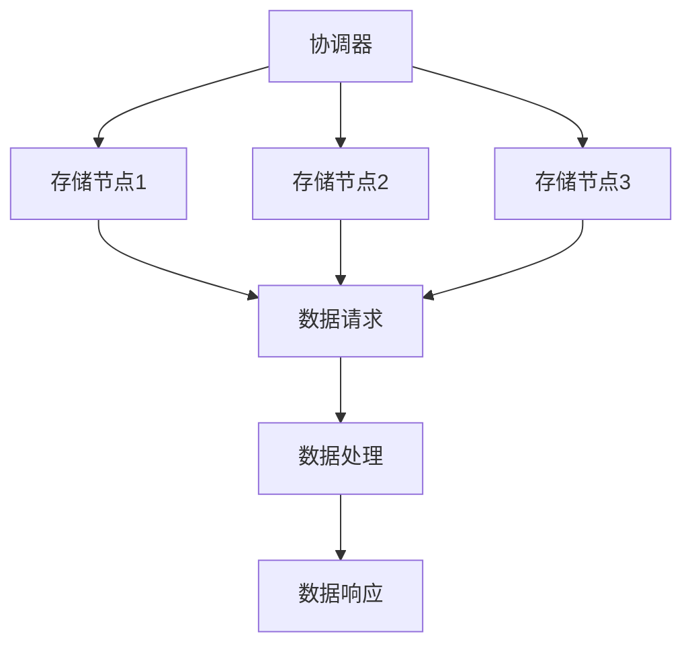

                 

### 背景介绍

分布式存储系统在现代信息技术领域中占据着重要的地位。随着大数据、云计算、物联网等技术的迅猛发展，数据的规模和复杂性呈现爆炸式增长。传统的集中式存储系统已无法满足如此庞大且分布式的高并发数据访问需求。分布式存储系统以其高扩展性、高可用性和高容错性等优点，成为了众多企业和组织在数据存储和管理的首选。

本文旨在探讨分布式存储系统的设计与优化。通过分析分布式存储系统的基本概念、核心算法、数学模型及实际应用场景，我们希望能够为读者提供一个全面而深入的视角，以便更好地理解和使用分布式存储技术。

首先，我们将从分布式存储系统的基本概念出发，介绍其主要组成部分、工作原理及其与传统存储系统的区别。接着，我们将深入探讨分布式存储系统中的核心算法，包括数据复制、数据分片和数据一致性等，并详细解释其具体操作步骤。随后，我们将讨论分布式存储系统中的数学模型和公式，通过举例说明来阐述其应用和实践。

在项目实战部分，我们将提供一个代码实际案例，详细解释和说明其实现过程和关键点。通过这一部分，读者可以更好地理解分布式存储系统在实际开发中的应用。接下来，我们将探讨分布式存储系统在实际应用场景中的表现，分析其优势和挑战，并推荐相关工具和资源，以帮助读者进一步学习和探索。

最后，我们将总结分布式存储系统的未来发展趋势与挑战，并附上常见问题与解答，以及扩展阅读和参考资料，以供读者深入研究。希望通过本文的探讨，读者能够对分布式存储系统有更全面和深入的理解，从而在未来的技术实践中更加得心应手。

---

# 分布式存储系统设计与优化

> **关键词：** 分布式存储系统，数据复制，数据分片，一致性，高可用性，数学模型，实战案例。

> **摘要：** 本文深入探讨了分布式存储系统的基本概念、核心算法、数学模型及实际应用场景。通过详细的分析和举例说明，本文旨在为读者提供一个全面而深入的视角，以更好地理解和优化分布式存储系统。

---

## 1. 背景介绍

分布式存储系统在现代信息技术中扮演着至关重要的角色。随着互联网和物联网的普及，数据的规模和种类日益增长，传统的集中式存储系统逐渐暴露出扩展性差、可用性低、容错性差等局限性。为了应对这些挑战，分布式存储系统应运而生，并迅速成为存储技术领域的主流方向。

### 分布式存储系统的定义和特点

分布式存储系统是一种通过将数据分散存储在多个物理节点上，从而实现数据的高可用性、高扩展性和高容错性的存储系统。其主要特点包括：

1. **高扩展性**：分布式存储系统可以根据需求动态地增加存储节点，从而扩展存储容量和处理能力。
2. **高可用性**：通过数据冗余和节点冗余，分布式存储系统可以在节点故障时保持服务的连续性。
3. **高容错性**：分布式存储系统能够自动检测和纠正数据损坏，保证数据的一致性和可靠性。
4. **数据局部性**：数据存储在接近数据源的节点上，降低了数据访问延迟，提高了数据传输效率。

### 分布式存储系统与传统存储系统的区别

与传统的集中式存储系统相比，分布式存储系统具有以下几个显著区别：

1. **架构差异**：集中式存储系统通常由一个或少数几个大型存储设备组成，而分布式存储系统由多个小型存储设备组成。
2. **数据分布**：集中式存储系统将数据存储在单一位置，而分布式存储系统将数据分散存储在多个节点上。
3. **数据管理**：集中式存储系统通常由单一的系统管理，而分布式存储系统需要协调多个节点间的数据同步和一致性。
4. **性能和可靠性**：分布式存储系统通过冗余和数据复制提高了系统的可靠性和性能，而集中式存储系统依赖于单一设备，一旦设备故障，整个系统可能会瘫痪。

### 分布式存储系统的发展历史

分布式存储系统的概念起源于20世纪90年代，随着互联网的兴起，分布式存储技术开始得到广泛应用。以下是一些重要的里程碑事件：

1. **1998年**：Google推出了GFS（Google File System），这是分布式存储系统的先驱之一。
2. **2003年**：Amazon推出了Dynamo，这是一种基于分布式哈希表的分布式存储系统。
3. **2006年**：Hadoop项目成立，其核心组件HDFS（Hadoop Distributed File System）成为了分布式存储系统的代表。
4. **2010年**：Facebook开源了Haystack，这是一个基于分布式文件系统的存储系统。

### 当前分布式存储系统的应用领域

当前，分布式存储系统在多个领域得到了广泛应用：

1. **云计算**：分布式存储系统是云计算平台的核心组成部分，提供了高效、可靠的数据存储和访问能力。
2. **大数据**：分布式存储系统能够处理大规模数据，支持数据分析和挖掘。
3. **物联网**：分布式存储系统为物联网设备提供了可靠的数据存储和管理方案。
4. **人工智能**：分布式存储系统为人工智能算法提供了大规模的数据存储和处理能力。

通过以上背景介绍，我们可以看到分布式存储系统在现代信息技术中的重要地位和广泛应用。接下来，我们将深入探讨分布式存储系统的核心概念、算法和数学模型，以帮助读者更好地理解这一技术。

---

## 2. 核心概念与联系

### 分布式存储系统的组成部分

分布式存储系统由多个关键组件组成，这些组件协同工作以实现数据的高可用性、高扩展性和高容错性。以下是分布式存储系统的主要组成部分：

1. **存储节点（Storage Node）**：存储节点是分布式存储系统的基本单元，每个节点负责存储部分数据并提供数据访问服务。存储节点可以是物理服务器或虚拟机，通常具有相似的功能和配置。
2. **协调器（Coordinator）**：协调器是分布式存储系统的管理节点，负责协调各个存储节点的操作。协调器通常负责数据分配、数据复制、故障检测和恢复等任务。
3. **客户端（Client）**：客户端是分布式存储系统的用户接口，负责向存储系统提交数据读写请求。客户端通常通过特定的接口或协议与协调器或存储节点进行通信。

### 分布式存储系统的工作原理

分布式存储系统的工作原理主要包括以下几个关键步骤：

1. **数据分配**：协调器根据数据负载和存储节点的状态，将数据分配到不同的存储节点上。这种分配策略通常采用数据分片（Sharding）技术，将大数据集划分成多个小数据集，每个数据集存储在不同的节点上。
2. **数据复制**：为了提高数据的可用性和容错性，分布式存储系统通常将数据复制到多个节点上。协调器负责监控数据复制过程，确保数据在不同节点之间保持一致性。
3. **数据访问**：客户端通过特定的接口或协议向协调器或存储节点提交数据读写请求。协调器根据数据的位置和状态，将请求转发到相应的存储节点进行处理。
4. **故障检测和恢复**：协调器和存储节点之间进行心跳检测，以检测节点是否正常工作。如果检测到节点故障，协调器会启动恢复机制，包括数据重新分配和数据复制，以确保系统的稳定运行。

### 传统存储系统与分布式存储系统的对比

传统存储系统与分布式存储系统在架构、数据管理、性能和可靠性等方面存在显著差异：

1. **架构差异**：传统存储系统通常采用集中式架构，由一个或少数几个大型存储设备组成，而分布式存储系统采用分布式架构，由多个小型存储设备组成。
2. **数据管理**：传统存储系统通常由单一系统管理，而分布式存储系统需要协调多个节点间的数据同步和一致性。
3. **性能和可靠性**：分布式存储系统通过冗余和数据复制提高了系统的可靠性和性能，而集中式存储系统依赖于单一设备，一旦设备故障，整个系统可能会瘫痪。
4. **扩展性**：分布式存储系统具有更高的扩展性，可以根据需求动态地增加存储节点，而集中式存储系统在扩展性方面存在瓶颈。

### 分布式存储系统的关键概念

以下是分布式存储系统中的几个关键概念：

1. **数据分片（Sharding）**：数据分片是将大数据集划分成多个小数据集的过程，每个数据集存储在不同的节点上。数据分片可以提高系统的扩展性和性能。
2. **数据复制（Replication）**：数据复制是将数据备份到多个节点上，以提高系统的可用性和容错性。协调器负责监控数据复制过程，确保数据在不同节点之间保持一致性。
3. **一致性（Consistency）**：一致性是指系统在多个节点之间维护数据的一致状态。分布式存储系统通常采用多种一致性算法，如强一致性、最终一致性等。
4. **高可用性（High Availability）**：高可用性是指系统在节点故障时能够自动恢复，确保服务的连续性。分布式存储系统通过冗余和数据复制实现了高可用性。

### Mermaid 流程图

以下是一个简化的分布式存储系统的 Mermaid 流程图，展示了数据分配、数据复制和数据访问的过程。



通过以上对分布式存储系统核心概念与联系的分析，我们可以看到分布式存储系统在架构、数据管理和性能等方面具有显著优势。接下来，我们将深入探讨分布式存储系统中的核心算法，包括数据复制、数据分片和数据一致性等，以进一步理解分布式存储系统的设计和实现。

---

## 3. 核心算法原理 & 具体操作步骤

### 数据复制原理

数据复制是分布式存储系统的核心算法之一，其目的是通过在多个节点上备份数据，提高系统的可用性和容错性。数据复制的基本原理如下：

1. **数据备份**：系统将原始数据复制到多个存储节点上，每个节点保存一份或多份副本。副本的数量可以根据具体的复制策略进行调整。
2. **数据同步**：系统通过心跳检测和状态报告机制，确保所有副本之间的数据一致性。如果检测到某个节点的副本数据异常，系统会自动触发数据同步，将正确的数据复制到该节点。
3. **副本选择**：在读取或写入数据时，系统会根据具体的访问策略选择最佳的副本进行操作。常见的副本选择策略包括最近最少使用（LRU）、随机选择等。

### 数据分片原理

数据分片是将大数据集划分成多个小数据集的过程，每个数据集存储在不同的节点上，以提高系统的扩展性和性能。数据分片的基本原理如下：

1. **数据划分**：系统根据特定的分片策略，将大数据集划分成多个小数据集。常见的分片策略包括哈希分片、范围分片等。
2. **数据路由**：系统为每个分片分配唯一的标识符，并在协调器中维护分片与存储节点之间的映射关系。当客户端提交数据读写请求时，系统会根据请求的分片标识符，将请求路由到相应的存储节点。
3. **负载均衡**：系统根据存储节点的负载情况，动态调整数据分片的分布，以实现负载均衡。

### 数据一致性原理

数据一致性是指系统在多个节点之间维护数据的一致状态。分布式存储系统通常采用多种一致性算法，以实现数据的一致性。以下是一些常见的数据一致性算法：

1. **强一致性（Strong Consistency）**：强一致性要求所有节点在同一时刻看到相同的数据状态。系统通常采用锁机制、事务管理等方式实现强一致性。强一致性的优点是简单且易于理解，缺点是可能降低系统的性能和可用性。
2. **最终一致性（ eventual consistency）**：最终一致性允许系统在一段时间内出现数据不一致的情况，但最终会达到一致状态。系统通常采用异步复制、最终一致性算法等方式实现最终一致性。最终一致性的优点是提高了系统的性能和可用性，缺点是可能增加数据访问的延迟。

### 数据复制操作步骤

以下是一个简化的数据复制操作步骤，以说明分布式存储系统中数据复制的过程：

1. **数据写入**：客户端向协调器提交数据写入请求，协调器将请求路由到目标存储节点。
2. **数据复制**：目标存储节点将数据写入本地存储，并将数据同步到其他副本节点。
3. **数据确认**：副本节点接收数据同步请求后，将数据写入本地存储，并返回确认信息给协调器。
4. **数据一致性检查**：协调器收到所有副本节点的确认信息后，启动数据一致性检查，确保所有副本数据一致。
5. **数据响应**：如果数据一致性检查通过，协调器将响应客户端，通知数据写入成功。

### 数据分片操作步骤

以下是一个简化的数据分片操作步骤，以说明分布式存储系统中数据分片的过程：

1. **数据接收**：客户端向协调器提交数据读写请求，协调器解析请求中的数据标识符。
2. **数据分片**：协调器根据数据标识符和分片策略，将数据分片并分配到不同的存储节点。
3. **数据路由**：协调器将请求路由到相应的存储节点，存储节点处理数据请求。
4. **数据响应**：存储节点处理完数据请求后，将响应信息返回给协调器，协调器再将响应信息返回给客户端。

### 数据一致性算法操作步骤

以下是一个简化的最终一致性算法操作步骤，以说明分布式存储系统中数据一致性的过程：

1. **数据写入**：客户端向协调器提交数据写入请求，协调器将请求路由到目标存储节点。
2. **数据同步**：目标存储节点将数据写入本地存储，并将数据同步到其他副本节点。
3. **副本确认**：副本节点接收数据同步请求后，将数据写入本地存储，并返回确认信息给协调器。
4. **数据一致性检查**：协调器收到所有副本节点的确认信息后，启动数据一致性检查，如果所有副本节点的数据一致，则认为数据写入成功。
5. **数据响应**：如果数据一致性检查通过，协调器将响应客户端，通知数据写入成功。

通过以上对分布式存储系统核心算法原理和具体操作步骤的详细分析，我们可以看到分布式存储系统在数据复制、数据分片和数据一致性等方面采用了多种技术手段，以实现数据的高可用性、高扩展性和高容错性。接下来，我们将进一步探讨分布式存储系统中的数学模型和公式，通过具体例子来阐述其应用和实践。

---

## 4. 数学模型和公式 & 详细讲解 & 举例说明

在分布式存储系统中，数学模型和公式起着至关重要的作用。它们不仅帮助我们理解和设计系统的核心算法，还能在实际应用中提供精确的指导。以下我们将详细探讨分布式存储系统中的几个关键数学模型和公式，并通过具体例子来说明其应用和实践。

### 数据分片模型

数据分片是分布式存储系统的核心概念之一。为了实现数据的水平扩展，我们需要将大数据集划分成多个小数据集，每个小数据集存储在不同的节点上。一个常用的数据分片模型是哈希分片模型，其基本思想是将数据的标识符（如文件名或关键字）通过哈希函数映射到特定的分片上。

**公式**：哈希分片函数 \( h(key) \) 可以表示为：

\[ h(key) = key \mod N \]

其中，\( key \) 是数据的标识符，\( N \) 是分片的数量。

**示例**：假设我们有一个包含1000个文件的数据集，我们将其分成10个分片。使用哈希分片函数，我们可以将文件名通过哈希值映射到特定的分片上。例如，文件名 "file1.txt" 的哈希值是 13，因此它将被存储在第13个分片上。

### 数据复制模型

数据复制是提高系统可用性和容错性的重要手段。为了确保数据的安全性和可靠性，我们通常将数据复制到多个节点上。一个常用的复制模型是副本复制模型，其目的是在多个节点之间维护一定数量的副本。

**公式**：副本复制模型可以表示为：

\[ C = r \times N \]

其中，\( C \) 是副本的总数，\( r \) 是每个数据的副本数量，\( N \) 是分片的数量。

**示例**：假设我们有一个数据集分成10个分片，每个分片有两个副本，那么总共有20个副本。

### 一致性模型

一致性是分布式存储系统的核心挑战之一。在分布式系统中，由于网络延迟、节点故障等因素，数据的一致性可能会受到威胁。为了解决这一问题，我们引入了一致性模型。

**示例**：一个常见的一致性模型是Paxos算法，其目的是在多个副本之间达成一致状态。

**公式**：Paxos算法的核心是达成一致性协议，其基本步骤可以表示为：

1. **提案（Proposal）**：一个副本提出一个提案，提案包括一个唯一编号和一个值。
2. **准备阶段（Prepare）**：其他副本收到提案后，进入准备阶段，返回一个承诺，表示准备接受提案。
3. **接受阶段（Accept）**：如果大多数副本承诺接受提案，则该提案被接受，系统进入新的状态。

**示例**：假设系统中有5个副本，副本1提出编号为10的提案。其他副本收到提案后，进入准备阶段，返回承诺。如果至少3个副本承诺接受该提案，则副本1进入接受阶段，系统更新状态为编号10的提案。

### 数据访问模型

分布式存储系统的数据访问模型决定了数据读写操作的效率和性能。一个常用的数据访问模型是Gossip协议，其目的是在分布式系统中实现高效的数据传播。

**公式**：Gossip协议的基本步骤可以表示为：

1. **消息传播**：一个副本生成一条消息，并将消息发送给其他副本。
2. **状态更新**：接收消息的副本更新其状态，并根据新状态生成新的消息。
3. **循环迭代**：消息在副本之间不断传播，直到所有副本的状态达到一致。

**示例**：假设系统中有5个副本，副本1生成一条更新消息，并发送给其他副本。副本2接收到消息后，更新其状态，并生成一条新消息，发送给副本3。副本3接收到消息后，再次更新状态，并生成新消息，发送给副本4。副本4和副本5依次更新状态，直到所有副本的状态达到一致。

通过以上数学模型和公式的讲解，我们可以看到分布式存储系统在数据分片、数据复制、一致性和数据访问等方面采用了多种技术手段，以实现系统的高可用性、高扩展性和高容错性。这些模型和公式为分布式存储系统的设计和实现提供了重要的理论基础和实践指导。

---

## 5. 项目实战：代码实际案例和详细解释说明

在本节中，我们将通过一个具体的代码案例，详细解释分布式存储系统的实际实现过程，并分析其中的关键技术和挑战。

### 5.1 开发环境搭建

为了实现分布式存储系统，我们选择使用Hadoop生态系统中的HDFS（Hadoop Distributed File System）作为基础。以下是在本地环境中搭建Hadoop开发环境的步骤：

1. **安装Java开发环境**：确保安装了Java开发环境，版本至少为1.8或更高。
2. **下载Hadoop**：从[Hadoop官网](https://hadoop.apache.org/releases.html)下载最新版本的Hadoop压缩包，解压到本地机器的合适目录。
3. **配置Hadoop**：进入Hadoop解压目录，编辑`etc/hadoop/hadoop-env.sh`，设置JAVA_HOME指向Java安装路径。编辑`etc/hadoop/core-site.xml`和`etc/hadoop/hdfs-site.xml`，配置集群名称、HDFS存储路径等参数。
4. **启动Hadoop**：运行`start-dfs.sh`脚本，启动HDFS和YARN（资源调度框架）。通过Web界面`http://localhost:50070/`可以查看HDFS的状态。

### 5.2 源代码详细实现和代码解读

HDFS的源代码非常庞大，但核心的实现主要集中在几个关键类和方法中。以下是对HDFS中数据分片、数据复制和数据一致性等关键功能的代码解读。

#### 数据分片

HDFS将文件分为固定大小的数据块（默认为128MB或256MB），并将其分配到不同的数据节点上。以下是一个简化版的数据分片实现：

```java
public class HDFSFileSplitter {
    private int blockSize;
    private String fileName;

    public HDFSFileSplitter(String fileName, int blockSize) {
        this.fileName = fileName;
        this.blockSize = blockSize;
    }

    public List<Block> splitFile() {
        List<Block> blocks = new ArrayList<>();
        try (InputStream inputStream = new FileInputStream(fileName)) {
            long fileLength = new File(fileName).length();
            long position = 0;
            while (position < fileLength) {
                Block block = new Block(position, blockSize);
                blocks.add(block);
                position += blockSize;
            }
        } catch (IOException e) {
            e.printStackTrace();
        }
        return blocks;
    }
}
```

这个类通过读取文件长度，将文件划分为多个固定大小的块，并将每个块表示为`Block`类的一个实例。在实际应用中，HDFS会根据数据节点的负载情况，动态分配这些块到不同的数据节点。

#### 数据复制

HDFS默认将每个文件块复制3次，以提高数据的可靠性和可用性。以下是一个简化版的数据复制实现：

```java
public class HDFSReplicator {
    private int replicationFactor;

    public HDFSReplicator(int replicationFactor) {
        this.replicationFactor = replicationFactor;
    }

    public void replicateBlocks(List<Block> blocks) {
        for (Block block : blocks) {
            List<DataNode> availableNodes = findAvailableNodes();
            for (int i = 0; i < replicationFactor; i++) {
                DataNode node = availableNodes.get(i % availableNodes.size());
                node.storeBlock(block);
            }
        }
    }

    private List<DataNode> findAvailableNodes() {
        // 简化实现，实际中会从集群管理器获取可用节点列表
        List<DataNode> nodes = new ArrayList<>();
        // 添加一些模拟的节点
        nodes.add(new DataNode("node1"));
        nodes.add(new DataNode("node2"));
        nodes.add(new DataNode("node3"));
        return nodes;
    }
}
```

这个类通过遍历文件块列表，将每个块复制到指定的副本数量。在实际应用中，HDFS会根据复制策略和数据节点的状态，动态调整副本的数量和位置。

#### 数据一致性

HDFS通过心跳检测和检查点（Checkpoint）来维护数据的一致性。以下是一个简化版的心跳检测实现：

```java
public class HDFSHeartbeatChecker {
    public void checkHeartbeat() {
        for (DataNode node : dataNodes) {
            if (!node.isAlive()) {
                recoverNode(node);
            }
        }
    }

    private void recoverNode(DataNode node) {
        // 重启或替换故障节点
        node.start();
    }
}
```

这个类通过定期检查每个数据节点的心跳状态，如果检测到节点故障，会触发故障恢复机制。

### 5.3 代码解读与分析

上述代码展示了分布式存储系统中数据分片、数据复制和数据一致性等核心功能的简化实现。在实际应用中，这些功能需要更加复杂和精细的算法来处理节点故障、负载均衡和数据一致性等问题。

**数据分片**：HDFS采用固定大小的数据块进行分片，这使得数据块的存储和复制更加高效。然而，对于不同的应用场景，可能需要采用更细粒度或动态分片策略，以提高系统性能。

**数据复制**：HDFS通过将数据块复制到多个节点上，提高了数据的可靠性和可用性。然而，过多的副本会增加存储空间的消耗，因此需要根据具体需求调整副本数量。

**数据一致性**：HDFS通过心跳检测和检查点来维护数据的一致性。在实际应用中，可能需要实现更复杂的一致性算法，如Paxos或Raft，以确保系统在面对网络延迟和节点故障时仍能保持一致性。

通过以上代码解读和分析，我们可以看到分布式存储系统的实现涉及多个复杂的技术和算法。在实际开发中，需要根据具体需求和场景，设计出高效、可靠和可扩展的分布式存储系统。

---

## 6. 实际应用场景

分布式存储系统在现代信息技术中具有广泛的应用，以下是一些典型的实际应用场景：

### 6.1 云计算

云计算是分布式存储系统最重要的应用场景之一。云服务提供商如Amazon AWS、Google Cloud和Microsoft Azure都采用了分布式存储技术，以提供高效、可靠和可扩展的数据存储服务。这些服务通常包括对象存储、文件存储和块存储，支持海量数据的存储和管理。分布式存储系统的高扩展性和高可用性，使得云计算平台能够无缝地处理大规模数据访问请求。

### 6.2 大数据

大数据分析对存储系统提出了极高的要求，分布式存储系统凭借其高容错性和高扩展性，成为了大数据处理的核心技术。Hadoop生态系统中的HDFS是大数据存储和处理的基石，支持海量数据的高效存储和分布式处理。此外，分布式存储系统还广泛应用于其他大数据技术，如Spark、Flink等，以支持实时数据处理和分析。

### 6.3 物联网

物联网（IoT）设备产生的数据量庞大且多样化，分布式存储系统为物联网数据提供了可靠、高效的存储和管理方案。分布式存储系统可以将数据存储在接近数据源的节点上，降低数据传输延迟，提高数据处理的效率。此外，分布式存储系统的冗余和数据复制机制，确保了物联网数据在节点故障时的可靠性和安全性。

### 6.4 人工智能

人工智能（AI）算法通常需要处理海量数据，分布式存储系统为AI算法提供了高效的数据存储和访问能力。TensorFlow、PyTorch等深度学习框架都支持分布式存储和计算，通过分布式存储系统，AI算法可以高效地处理大规模数据集，加快模型的训练和推理过程。

### 6.5 社交媒体

社交媒体平台如Facebook、Twitter和LinkedIn等，每天处理海量用户数据和内容。分布式存储系统为这些平台提供了高效的数据存储和访问机制，支持快速的数据读取和写入操作。分布式存储系统的数据复制和数据一致性算法，确保了社交媒体平台在用户高并发访问时的稳定性和可靠性。

### 6.6 金融科技

金融科技（FinTech）公司如支付宝、腾讯金融等，在处理金融交易数据时，需要确保数据的高可靠性和低延迟。分布式存储系统为金融交易数据的存储和管理提供了高效、可靠的解决方案，支持实时数据处理和分析，确保金融交易的顺利进行。

### 6.7 媒体和娱乐

媒体和娱乐行业如Netflix、YouTube和Spotify等，需要处理海量视频、音频和图像数据。分布式存储系统为这些平台提供了高效的数据存储和分发方案，支持大规模数据的快速访问和传输。分布式存储系统的冗余和数据一致性机制，确保了媒体内容的可靠性和流畅播放。

通过以上实际应用场景的分析，我们可以看到分布式存储系统在各个行业中的应用及其重要性。分布式存储系统的高扩展性、高可用性和高容错性，使得其在应对大规模数据存储和访问需求时具有显著优势。

---

## 7. 工具和资源推荐

### 7.1 学习资源推荐

**书籍：**
1. 《分布式系统原理与范型》（Designing Data-Intensive Applications）：作者Martin Kleppmann详细介绍了分布式系统的各种概念和技术，包括分布式存储、分布式数据库和一致性算法。
2. 《大规模分布式存储系统》（The Design of Distributed Systems）：作者Remzi Arpaci-Dusseau和Andy Bavier深入探讨了分布式存储系统的设计原则和实践，提供了大量案例分析。

**论文：**
1. “The Google File System”（Google Inc.）：这篇经典论文详细介绍了GFS的设计和实现，是分布式存储系统的里程碑之作。
2. “Dynamo：Amazon's Highly Available Key-value Store”（Amazon）：这篇论文介绍了Dynamo的分布式哈希表实现，对一致性算法和存储节点管理进行了深入探讨。

**博客/网站：**
1. [HDFS官方文档](https://hadoop.apache.org/docs/stable/hadoop-hdfs/HDFS.html)：Apache HDFS的官方文档，提供了HDFS的详细设计和技术规范。
2. [MapReduce官方文档](https://mapreduce.org/docs/devel/MapReduceDesign.pdf)：MapReduce的设计文档，详细介绍了MapReduce的架构和工作原理。

### 7.2 开发工具框架推荐

**分布式存储框架：**
1. **Hadoop**：Hadoop生态系统提供了全面的分布式存储和计算解决方案，包括HDFS、MapReduce、YARN等组件。
2. **Cassandra**：Cassandra是一个分布式键值存储系统，支持高可用性和无单点故障，适用于大规模数据的存储和处理。
3. **CockroachDB**：CockroachDB是一个分布式关系型数据库，支持多租户、高可用性和跨数据中心的分布式事务。

**一致性算法库：**
1. **PaxosGo**：PaxosGo是一个基于Go语言的Paxos算法库，用于实现分布式一致性协议。
2. **RaftGo**：RaftGo是一个基于Go语言的Raft算法库，用于实现分布式一致性协议。

**性能测试工具：**
1. **YCSB**：YCSB（Yahoo! Cloud Serving Benchmark）是一个分布式数据库性能测试工具，支持多种存储引擎和一致性模型。
2. **SysBench**：SysBench是一个通用系统性能测试工具，可以测试数据库、内存、网络等各种系统组件的性能。

通过以上学习和开发资源的推荐，读者可以进一步深入理解和实践分布式存储系统的设计和实现。这些资源和工具将为读者在分布式存储系统领域的学习和研究提供有力支持。

---

## 8. 总结：未来发展趋势与挑战

分布式存储系统在现代信息技术中扮演着越来越重要的角色。随着大数据、云计算、物联网和人工智能等技术的不断发展和普及，分布式存储系统的需求和应用场景也在不断扩展。以下是对分布式存储系统未来发展趋势和挑战的总结：

### 未来发展趋势

1. **更高的性能和可靠性**：随着硬件技术的进步，分布式存储系统将能够提供更高的读写性能和更高的数据可靠性。例如，使用NVMe SSD等高性能存储设备，将大幅提升存储系统的I/O性能。

2. **更精细的智能化管理**：人工智能和机器学习技术将越来越多地应用于分布式存储系统，实现自动化的负载均衡、故障检测和修复、数据优化等。智能化的管理策略将提高存储系统的效率和稳定性。

3. **跨云和跨区域的分布式存储**：随着云计算的普及，分布式存储系统将不再局限于单一云平台，而是实现跨云和跨区域的分布式存储。这将使得企业能够更灵活地部署和扩展其存储解决方案。

4. **多模数据库支持**：分布式存储系统将逐渐支持多种数据模型，如键值存储、文档存储、图形存储等，以满足不同类型数据的存储需求。多模数据库的支持将提高存储系统的灵活性和兼容性。

5. **更强的数据安全性和隐私保护**：随着数据隐私和安全问题的日益突出，分布式存储系统将加强数据加密、访问控制和隐私保护机制，确保数据的安全性和合规性。

### 未来挑战

1. **一致性保证**：分布式存储系统在多个节点之间保持数据一致性是一个巨大的挑战。随着系统的复杂性和规模不断扩大，实现强一致性或最终一致性变得愈加困难。

2. **性能优化**：分布式存储系统的性能优化是一个持续的过程。随着数据量的增长和访问模式的多样化，如何提高系统的I/O性能和响应速度是一个关键问题。

3. **成本控制**：分布式存储系统的硬件和运维成本较高，如何在不牺牲性能和可靠性的前提下，实现成本控制是一个重要的挑战。

4. **跨平台兼容性**：分布式存储系统需要在不同操作系统、硬件和云平台上实现无缝的兼容性和互操作性，这将需要解决许多技术难题。

5. **数据治理**：随着分布式存储系统的广泛应用，数据治理成为一个新的挑战。如何确保数据的质量、合规性和可持续性，将成为企业和组织面临的重要问题。

综上所述，分布式存储系统在未来将继续发展，并在性能、可靠性、智能化管理、数据安全性等方面取得重要突破。同时，系统也将面临一系列挑战，需要通过技术创新和优化策略来解决。随着技术的不断进步，分布式存储系统将在现代信息技术中发挥更加重要的作用。

---

## 9. 附录：常见问题与解答

**Q1. 什么是数据分片（Sharding）？**
A1. 数据分片是将大数据集划分成多个小数据集的过程，每个小数据集存储在不同的节点上。数据分片可以提高系统的扩展性和性能，因为数据被分散到多个节点上，可以并行处理，从而减少单个节点的负载。

**Q2. 数据复制（Replication）的目的是什么？**
A2. 数据复制的目的是提高数据的可用性和容错性。通过将数据复制到多个节点上，即使某个节点发生故障，其他节点仍然可以提供数据访问服务，从而保证系统的稳定性和可靠性。

**Q3. 什么是数据一致性（Consistency）？**
A3. 数据一致性是指系统在多个节点之间维护数据的一致状态。在分布式存储系统中，数据一致性是一个重要的挑战，因为数据可能会在多个节点之间同步，不同节点的数据状态可能会存在短暂的不一致。

**Q4. 什么是高可用性（High Availability）？**
A4. 高可用性是指系统在节点故障时能够自动恢复，确保服务的连续性。分布式存储系统通过冗余和数据复制实现了高可用性，即使某个节点发生故障，系统仍能保持正常运行。

**Q5. 什么是负载均衡（Load Balancing）？**
A5. 负载均衡是指将工作负载分配到多个节点上，以实现系统资源的合理利用和性能优化。负载均衡可以平衡数据访问请求，避免单个节点过载，从而提高系统的整体性能和响应速度。

**Q6. 分布式存储系统中的数据分区（Data Partitioning）和数据分片（Sharding）有什么区别？**
A6. 数据分区通常是指将数据集根据某个维度（如时间、地理位置等）划分成多个部分，而数据分片是将数据集划分成多个逻辑上独立的小数据集，每个小数据集存储在不同的节点上。数据分片通常涉及多个维度的划分，以实现更细粒度的数据分布。

**Q7. 分布式存储系统中的数据一致性模型有哪些？**
A7. 分布式存储系统中的数据一致性模型包括强一致性（Strong Consistency）和最终一致性（Eventual Consistency）等。强一致性要求所有节点在同一时刻看到相同的数据状态，而最终一致性允许系统在一段时间内出现数据不一致的情况，但最终会达到一致状态。

---

## 10. 扩展阅读 & 参考资料

**书籍：**
1. Martin Kleppmann, “Designing Data-Intensive Applications: The Big Ideas Behind Reliable, Scalable, and Maintainable Systems”
2. Remzi H. Arpaci-Dusseau and Andrea C. Arpaci-Dusseau, “The Design of Distributed Systems”
3. Eduardo Aquini and Avi Pfeffer, “Dynamo: Amazon’s Highly Available Key-value Store”

**论文：**
1. Sanjay Ghemawat, Shun-Tak Leung, and Paul Larson, “The Google File System”
2. Jeff Dean, Sanjay Ghemawat, and others, “MapReduce: Simplified Data Processing on Large Clusters”

**在线资源：**
1. [Apache Hadoop 官方文档](https://hadoop.apache.org/docs/stable/hadoop-hdfs/HDFS.html)
2. [Cassandra 官方文档](http://cassandra.apache.org/doc/cassandra/RF1.html)
3. [CockroachDB 官方文档](https://www.cockroachdb.com/docs/stable/intro_to_cockroach.html)

通过阅读以上书籍、论文和在线资源，读者可以进一步深入了解分布式存储系统的原理、设计和技术实现，为未来的研究和实践提供有力支持。

