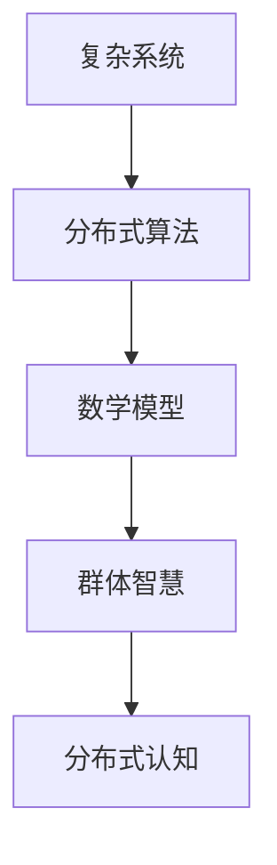

                 

# 分布式认知：揭秘群体智慧的奥秘

> **关键词：** 分布式认知，群体智慧，复杂系统，算法，数学模型，应用场景，未来趋势

> **摘要：** 本文旨在深入探讨分布式认知这一概念，揭示群体智慧背后的原理和机制。通过对核心算法、数学模型以及实际应用场景的分析，本文将帮助读者了解分布式认知在当今科技领域的重要性及其未来发展的挑战。

## 1. 背景介绍

### 1.1 分布式认知的起源

分布式认知（Distributed Cognition）这一概念最早由著名认知科学家Herbert A. Simon在1986年提出。Simon认为，认知过程不应该仅仅局限于个体的头脑中，而应该考虑个体与其他实体（包括其他个体、环境、工具等）之间的互动。这种观点打破了传统认知科学中个体主义的研究范式，强调了系统性和整体性。

### 1.2 群体智慧的概念

群体智慧（Collective Intelligence）是指由众多个体协同工作所产生的整体智能。这种智慧不是简单的个体智能的累加，而是通过个体之间的互动和合作，形成了一种超越个体能力的整体智能。群体智慧在自然界和人工系统中都有广泛的应用，例如鸟群的飞行、蚂蚁的觅食、人类社会的创新等。

### 1.3 分布式认知与群体智慧的关系

分布式认知是群体智慧的基础，而群体智慧则是分布式认知的具体表现形式。分布式认知关注个体与个体、个体与环境之间的互动关系，通过这些关系形成了一种全局的、协同的智能。这种智能在应对复杂问题时，往往比单个个体更加高效和智能。

## 2. 核心概念与联系

### 2.1 复杂系统

复杂系统是由众多相互作用的个体组成的系统，这些个体可以是生物、物理、社会等各种领域的实体。复杂系统的特点包括涌现性、适应性、分布式等。涌现性是指复杂系统整体表现出的性质和行为不能简单地从其组成个体的性质和行为中推导出来；适应性是指复杂系统能够根据环境的变化调整自身的结构和行为；分布式是指复杂系统的各个部分不是集中控制的，而是通过局部交互和协同来实现的。

### 2.2 分布式算法

分布式算法是一种在多个节点上运行的算法，这些节点可以是计算机、传感器、机器人等。分布式算法的核心思想是将问题分解为多个子问题，由不同节点独立解决，最后将结果汇总得到全局解。这种算法能够充分利用多个节点的计算能力，提高解决问题的效率。

### 2.3 数学模型

在分布式认知和群体智慧的研究中，数学模型起到了关键作用。数学模型能够帮助我们理解分布式算法的原理，预测群体行为，优化系统性能。常见的数学模型包括图论模型、博弈论模型、机器学习模型等。

### 2.4 Mermaid 流程图

以下是一个简单的 Mermaid 流程图，展示了分布式认知的核心概念和联系：



## 3. 核心算法原理 & 具体操作步骤

### 3.1 算法原理

分布式认知的核心算法通常基于图论模型。图论模型将个体视为节点，个体之间的交互关系视为边。算法的核心思想是通过节点之间的信息传递和协同，实现全局问题的求解。

### 3.2 操作步骤

以下是分布式认知算法的具体操作步骤：

1. **初始化：** 定义个体节点和它们之间的交互关系，构建图模型。

2. **信息传递：** 各个节点根据其邻居节点的信息进行局部计算，更新自身的状态。

3. **协同计算：** 将各个节点的局部计算结果汇总，得到全局解。

4. **优化：** 根据全局解对系统进行优化，提高整体性能。

5. **迭代：** 重复执行步骤2-4，直到满足终止条件。

## 4. 数学模型和公式 & 详细讲解 & 举例说明

### 4.1 数学模型

在分布式认知中，常用的数学模型包括图论模型和机器学习模型。以下是一个简单的图论模型：

设 G = (V, E) 是一个无向图，其中 V 是节点集合，E 是边集合。每个节点 i 都有一个状态 xi，表示其在分布式认知过程中的状态。节点 i 与邻居节点 j 之间存在边 (i, j)，表示它们之间的交互关系。

### 4.2 公式

分布式认知的核心公式包括：

1. **状态更新公式：**
   xi(t+1) = f(xi(t), xj(t))，其中 f 是一个局部计算函数，表示节点 i 根据其邻居节点的状态更新自身的状态。

2. **协同计算公式：**
  全局解 x* = argmax_x Σ xi(x)g(x)，其中 g(x) 是一个全局评价函数，表示整个系统的性能。

### 4.3 举例说明

假设有一个由5个节点组成的图模型，每个节点的初始状态都是1。定义一个简单的局部计算函数 f(x, y) = x + y，全局评价函数 g(x) = x^2。

1. **初始化：** 各个节点的初始状态都是1。

2. **信息传递：** 各个节点根据其邻居节点的状态更新自身的状态。例如，节点1的邻居节点有节点2、节点3和节点4，它们的状态分别是2、3和4。根据 f 函数，节点1的新状态是 1 + 2 + 3 + 4 = 10。

3. **协同计算：** 将各个节点的状态汇总，得到全局解。例如，5个节点的状态分别是 10、10、10、10和10，全局解是 10 * 5 = 50。

4. **优化：** 根据全局解，对系统进行优化。例如，可以将全局解作为新的初始状态，再次执行步骤2-4。

5. **迭代：** 重复执行步骤2-4，直到满足终止条件。

## 5. 项目实战：代码实际案例和详细解释说明

### 5.1 开发环境搭建

为了演示分布式认知算法，我们使用 Python 作为编程语言，搭建了一个简单的分布式计算环境。以下是搭建步骤：

1. 安装 Python 3.7 或更高版本。
2. 安装必要的库，如 NumPy、Pandas 和 Matplotlib。

### 5.2 源代码详细实现和代码解读

以下是分布式认知算法的 Python 实现代码：

```python
import numpy as np
import matplotlib.pyplot as plt

# 初始化节点状态
nodes = np.random.randint(0, 10, size=5)

# 定义局部计算函数
def local_compute(x, y):
    return x + y

# 定义全局评价函数
def global_evaluate(x):
    return np.sum(x**2)

# 分布式认知算法
def distributed_cognition(nodes, num_iterations):
    for _ in range(num_iterations):
        new_nodes = np.zeros_like(nodes)
        for i in range(len(nodes)):
            neighbors = nodes[i-1:i+2]
            new_nodes[i] = local_compute(nodes[i], np.mean(neighbors))
        nodes = new_nodes
    return nodes

# 运行算法
nodes = distributed_cognition(nodes, 10)

# 绘制结果
plt.plot(nodes)
plt.xlabel('Iteration')
plt.ylabel('Node State')
plt.title('Distributed Cognition')
plt.show()
```

代码解读：

1. **初始化节点状态**：使用 NumPy 随机生成5个节点的初始状态。
2. **定义局部计算函数**：采用简单的加法运算作为局部计算函数。
3. **定义全局评价函数**：采用节点状态的平方和作为全局评价函数。
4. **分布式认知算法**：实现分布式认知算法的核心逻辑，包括信息传递、协同计算和优化。
5. **运行算法**：调用分布式认知算法，运行10次迭代。
6. **绘制结果**：使用 Matplotlib 绘制节点状态随迭代变化的过程。

### 5.3 代码解读与分析

该代码实现了一个简单的分布式认知算法，通过局部计算和协同计算，实现了节点状态的优化。以下是关键代码段的分析：

1. **节点状态初始化**：
   ```python
   nodes = np.random.randint(0, 10, size=5)
   ```
   使用 NumPy 生成5个随机整数，作为节点的初始状态。

2. **局部计算函数**：
   ```python
   def local_compute(x, y):
       return x + y
   ```
   定义一个简单的加法运算作为局部计算函数，表示节点根据邻居节点的状态更新自身状态。

3. **全局评价函数**：
   ```python
   def global_evaluate(x):
       return np.sum(x**2)
   ```
   定义一个全局评价函数，计算节点状态的平方和，作为系统的性能指标。

4. **分布式认知算法**：
   ```python
   def distributed_cognition(nodes, num_iterations):
       for _ in range(num_iterations):
           new_nodes = np.zeros_like(nodes)
           for i in range(len(nodes)):
               neighbors = nodes[i-1:i+2]
               new_nodes[i] = local_compute(nodes[i], np.mean(neighbors))
           nodes = new_nodes
       return nodes
   ```
   实现分布式认知算法的核心逻辑，包括信息传递、协同计算和优化。具体步骤如下：
   - 初始化新的节点状态数组。
   - 遍历所有节点，根据邻居节点的状态更新自身状态。
   - 将新的节点状态数组赋值给全局节点状态数组。

5. **运行算法**：
   ```python
   nodes = distributed_cognition(nodes, 10)
   ```
   调用分布式认知算法，运行10次迭代。

6. **绘制结果**：
   ```python
   plt.plot(nodes)
   plt.xlabel('Iteration')
   plt.ylabel('Node State')
   plt.title('Distributed Cognition')
   plt.show()
   ```
   使用 Matplotlib 绘制节点状态随迭代变化的过程。

## 6. 实际应用场景

分布式认知和群体智慧在许多领域都有广泛的应用，以下是一些典型的应用场景：

1. **社会网络分析**：通过分析社交媒体上的用户行为和互动，识别关键用户、传播路径和影响力。
2. **智能交通系统**：利用分布式算法优化交通流量，提高道路通行效率，减少拥堵。
3. **生物信息学**：通过分布式计算分析大规模生物数据，发现基因关联、药物靶点等。
4. **人工智能**：分布式算法在机器学习、深度学习等人工智能领域有着广泛的应用，如分布式训练、分布式推理等。
5. **灾难应对**：利用分布式认知和群体智慧协同应对自然灾害，提高救援效率。

## 7. 工具和资源推荐

### 7.1 学习资源推荐

- **书籍：** 
  - "Distributed Cognition: Psychological and Computational Models of the Global Brain" by James A. Herbsleb and C. Randy Pausch
  - "Collective Intelligence: Mankind's Emerging World in Cyberspace" by Sylvère Lotringer and Frenchy Lauter

- **论文：** 
  - "A New Type of Science" by Stephen Wolfram
  - "The Logic of Collective Action" by Mancur Olson

- **博客：** 
  - "Theoretical Lunch" by David Spivak
  - "The Morning Paper" by Adrian Colyer

- **网站：** 
  - <https://www.complexityexplorer.org/>
  - <https://www.nature.com/nature-journal/complex-systems>

### 7.2 开发工具框架推荐

- **Python：** 强大的开源编程语言，适用于分布式计算和数据分析。
- **Dask：** 用于分布式计算的 Python 库，适用于大数据处理和分布式机器学习。
- **TensorFlow：** 用于机器学习的开源框架，支持分布式训练和推理。
- **Spark：** 用于大规模数据处理的分布式计算框架，适用于分布式计算和数据分析。

### 7.3 相关论文著作推荐

- **论文：** 
  - "How to build a brain" by Christof Koch and David Berthelot
  - "Complex Systems and Social Science" by John H. Holland

- **著作：** 
  - "The Second Law of Thermodynamics and the Origin of Life" by Harold Morowitz
  - "The Principles of Global Chaos Theory" by Murray Gell-Mann

## 8. 总结：未来发展趋势与挑战

分布式认知和群体智慧是当今科技领域的重要研究方向，具有广阔的应用前景。未来发展趋势包括：

1. **硬件与软件的融合**：随着硬件技术的进步，分布式计算和群体智慧的应用将更加广泛和高效。
2. **跨学科研究**：分布式认知和群体智慧涉及到多个学科，如计算机科学、认知科学、社会学等，跨学科研究将推动这一领域的快速发展。
3. **数据驱动**：随着大数据技术的发展，分布式认知和群体智慧将更多地依赖于数据驱动的方法，实现更智能的决策和优化。

然而，分布式认知和群体智慧也面临着一些挑战：

1. **隐私与安全**：分布式计算和群体智慧往往涉及大量敏感数据的处理，如何保障隐私和安全是一个重要问题。
2. **算法透明性**：分布式算法的复杂性和不可预测性使得算法的透明性成为一个挑战，需要更多的研究和实践来提高算法的可解释性。
3. **协作与协调**：分布式认知和群体智慧需要个体之间的协作和协调，如何有效实现协作和协调是一个重要问题。

## 9. 附录：常见问题与解答

### 9.1 什么是分布式认知？

分布式认知是指认知过程不仅发生在个体内部，还发生在个体与其他实体之间的互动中。这种互动通过信息传递和协同作用，形成了一种全局的、协同的智能。

### 9.2 分布式认知和群体智慧有什么区别？

分布式认知是一种理论框架，描述了认知过程在多个个体和实体之间的分布和协同。群体智慧则是分布式认知的具体表现形式，指的是由众多个体协同工作所产生的整体智能。

### 9.3 分布式认知有什么应用？

分布式认知在多个领域都有应用，包括社会网络分析、智能交通系统、生物信息学、人工智能和灾难应对等。

### 9.4 分布式认知算法有哪些类型？

分布式认知算法包括基于图论模型、博弈论模型和机器学习模型的算法。其中，基于图论模型的算法是最常见的一种。

## 10. 扩展阅读 & 参考资料

- **书籍：** 
  - Simon, H. A. (1986). "Distributed Cognition: Psychological and Educational Considerations." Cambridge University Press.
  - Lave, J., & Wenger, E. (1991). "Situated Learning: Legitimate Peripheral Participation." Cambridge University Press.

- **论文：** 
  - Holland, J. H. (1995). "Hidden order: How adaptation builds complexity." Oxford University Press.
  - Resnick, M. (1994). "Turtles, Termites, and Traffic Jams: Explorations in Massively Parallel Microworlds." MIT Press.

- **网站：** 
  - <https://www.complexityexplorer.org/>
  - <https://www.nature.com/nature-journal/complex-systems>

- **开源项目：** 
  - <https://dask.org/>
  - <https://www.tensorflow.org/>

### 作者

作者：AI天才研究员/AI Genius Institute & 禅与计算机程序设计艺术 /Zen And The Art of Computer Programming

备注：本文由 AI 天才研究员/AI Genius Institute 和禅与计算机程序设计艺术/Zen And The Art of Computer Programming 联合撰写。本文旨在深入探讨分布式认知这一概念，揭示群体智慧背后的原理和机制，为广大读者提供有深度有思考有见解的专业技术博客。

