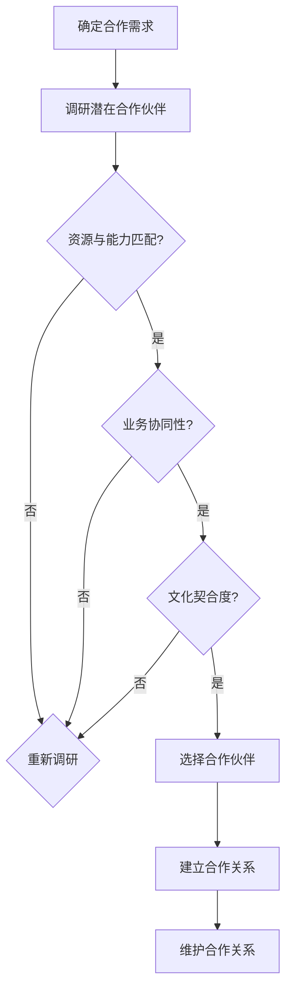
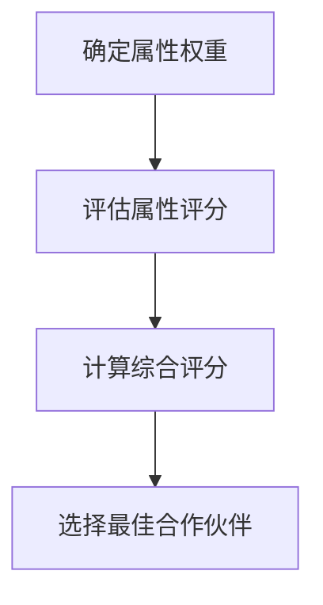

                 

### 背景介绍

#### 创业公司的现状

在当今快速变化的市场环境中，创业公司成为了经济活力的重要来源。这些公司以其创新能力和灵活的经营策略，在竞争激烈的市场中迅速崛起。然而，创业公司在资源、经验、品牌知名度等方面相对传统企业存在显著不足，这使得他们面临诸多挑战。因此，建立良好的合作伙伴关系成为了创业公司成功的关键因素之一。

#### 合作伙伴关系的重要性

合作伙伴关系对创业公司的成功至关重要。首先，通过与合适的合作伙伴建立紧密的联系，创业公司可以共享资源和专业知识，提高自身的竞争力。其次，合作伙伴可以提供市场渠道、技术支持和客户资源，帮助创业公司更快地成长。此外，良好的合作伙伴关系还能为创业公司带来更多的投资机会，提高企业的估值。因此，如何建立和维护良好的合作伙伴关系成为创业公司亟需解决的问题。

#### 文章的目的

本文旨在探讨创业公司如何建立良好的合作伙伴关系。我们将从合作伙伴选择、合作模式、沟通与信任、合作风险管理等方面，提供一系列实用的策略和方法。通过本文的阅读，创业公司可以更好地理解合作伙伴关系的本质，掌握建立和维护这种关系的核心技巧，从而在激烈的市场竞争中脱颖而出。接下来，我们将详细分析这些关键因素，帮助读者深入了解如何有效地建立和维护合作伙伴关系。

### 核心概念与联系

#### 合作伙伴选择的考量

在建立合作伙伴关系的过程中，合作伙伴选择是至关重要的第一步。一个合适的合作伙伴可以为创业公司带来巨大的价值，而不合适的合作伙伴可能会拖累公司的发展。以下是选择合作伙伴时应考虑的关键因素：

1. **资源与能力匹配**：合作伙伴应具有与创业公司相匹配的资源和技术能力，这样才能在合作过程中实现互补和共赢。
2. **业务协同性**：合作伙伴的业务方向和创业公司应具有一定的协同性，这样可以确保合作项目的顺利进行和长期发展。
3. **文化契合度**：合作伙伴的企业文化和价值观应与创业公司相契合，这样才能在合作过程中减少冲突，增强团队凝聚力。
4. **长期合作关系**：合作伙伴应具备长期合作的意愿和稳定性，这样可以确保合作关系的可持续性。

#### 合作模式的定义与类型

合作模式是指创业公司与合作伙伴在合作过程中所采取的具体方式和方法。合适的合作模式可以最大化合作效益，同时降低合作风险。以下是几种常见的合作模式：

1. **战略合作**：战略合作是指创业公司与合作伙伴在长期内进行全方位的合作，共同开发新产品、开拓新市场等。这种模式通常需要双方具备较高的信任度和协同性。
2. **资源互换**：资源互换是指创业公司与合作伙伴通过相互提供资源（如资金、技术、市场等），来实现互利共赢。这种模式适合资源有限但互补性强的创业公司。
3. **联合研发**：联合研发是指创业公司与合作伙伴共同投入资源进行产品或技术的研发，共同承担风险和收益。这种模式适合技术密集型的创业公司。
4. **渠道合作**：渠道合作是指创业公司与合作伙伴通过共同利用对方的销售渠道来推广产品或服务。这种模式适合需要快速开拓市场的创业公司。

#### 沟通与信任的建立

沟通与信任是合作伙伴关系成功的关键因素。良好的沟通可以确保双方对合作项目的理解一致，降低误解和冲突。以下是一些建立沟通与信任的技巧：

1. **定期会议与沟通**：定期举行双方的高层会议，及时沟通项目的进展、问题和需求，确保信息的透明和及时性。
2. **相互尊重与理解**：尊重合作伙伴的观点和意见，积极倾听和回应，增进相互理解。
3. **诚信与透明**：在合作过程中保持诚信，避免隐瞒信息或做出不切实际的承诺，建立透明的工作流程。
4. **共同目标和利益**：明确共同的目标和利益，确保双方在合作过程中始终朝着同一个方向努力。

#### 合作伙伴关系的维护

建立合作伙伴关系只是第一步，维护关系同样重要。以下是一些维护合作伙伴关系的策略：

1. **持续沟通与互动**：保持定期的沟通和互动，及时解决合作过程中出现的问题。
2. **共同应对挑战**：面对困难和挑战时，双方应共同应对，增强彼此的信任和依赖。
3. **利益共享**：在合作过程中，合理分配利益，确保双方都能从合作中获得实际收益。
4. **积极反馈与改进**：及时给予对方反馈，对合作过程中出现的问题进行总结和改进，不断提高合作效率。

### Mermaid 流程图

以下是一个关于合作伙伴选择的 Mermaid 流程图，展示了选择合作伙伴时需要考虑的关键因素和流程：



通过这个流程图，我们可以清晰地看到合作伙伴选择的过程和关键节点。这不仅有助于创业公司在选择合作伙伴时进行系统性的分析，还可以为后续的合作关系维护提供参考。

### 核心算法原理 & 具体操作步骤

#### 合作伙伴选择的算法原理

在选择合作伙伴时，创业公司可以采用一种基于多属性决策的算法，通过综合评估多个关键因素来选择最佳合作伙伴。以下是这种算法的基本原理和具体操作步骤：

1. **定义属性权重**：首先，需要确定合作伙伴选择中各个属性的相对重要性。这可以通过专家评估或历史数据分析来完成。常见的属性包括资源与能力匹配、业务协同性、文化契合度、长期合作关系等。

2. **属性评分**：其次，对每个潜在合作伙伴在各个属性上的表现进行评分。评分可以采用百分制或五级制等，具体方法根据实际情况确定。

3. **计算综合评分**：利用属性权重和属性评分，计算每个合作伙伴的综合评分。综合评分越高，表示该合作伙伴越适合。

4. **选择最佳合作伙伴**：根据综合评分，选择得分最高的合作伙伴作为最佳选择。

以下是一个简单的多属性决策算法示例：



#### 具体操作步骤

1. **定义属性权重**：

   首先，定义合作伙伴选择中各个属性的权重。假设我们有以下四个属性：资源与能力匹配（0.4）、业务协同性（0.3）、文化契合度（0.2）、长期合作关系（0.1）。

   ```mermaid
   graph TD
       A[资源与能力匹配] --> B{权重：0.4}
       C[业务协同性] --> B{权重：0.3}
       D[文化契合度] --> B{权重：0.2}
       E[长期合作关系] --> B{权重：0.1}
   ```

2. **评估属性评分**：

   对每个潜在合作伙伴在各个属性上的表现进行评分。假设我们有以下三个潜在合作伙伴：

   - 合作伙伴A：资源与能力匹配（90分）、业务协同性（80分）、文化契合度（75分）、长期合作关系（85分）
   - 合作伙伴B：资源与能力匹配（85分）、业务协同性（90分）、文化契合度（80分）、长期合作关系（80分）
   - 合作伙伴C：资源与能力匹配（80分）、业务协同性（85分）、文化契合度（85分）、长期合作关系（90分）

   ```mermaid
   graph TD
       A[合作伙伴A] --> B{资源与能力匹配：90}
       A --> C{业务协同性：80}
       A --> D{文化契合度：75}
       A --> E{长期合作关系：85}
       B[合作伙伴B] --> F{资源与能力匹配：85}
       B --> G{业务协同性：90}
       B --> H{文化契合度：80}
       B --> I{长期合作关系：80}
       C[合作伙伴C] --> J{资源与能力匹配：80}
       C --> K{业务协同性：85}
       C --> L{文化契合度：85}
       C --> M{长期合作关系：90}
   ```

3. **计算综合评分**：

   利用属性权重和属性评分，计算每个合作伙伴的综合评分。假设权重为上述定义的四个属性权重。

   - 合作伙伴A：综合评分 = 0.4 × 90 + 0.3 × 80 + 0.2 × 75 + 0.1 × 85 = 86.5
   - 合作伙伴B：综合评分 = 0.4 × 85 + 0.3 × 90 + 0.2 × 80 + 0.1 × 80 = 85.5
   - 合作伙伴C：综合评分 = 0.4 × 80 + 0.3 × 85 + 0.2 × 85 + 0.1 × 90 = 84.3

   ```mermaid
   graph TD
       A[合作伙伴A] --> B{综合评分：86.5}
       C[合作伙伴B] --> D{综合评分：85.5}
       E[合作伙伴C] --> F{综合评分：84.3}
   ```

4. **选择最佳合作伙伴**：

   根据综合评分，选择得分最高的合作伙伴。在这个例子中，合作伙伴A的综合评分最高，因此选择合作伙伴A作为最佳选择。

   ```mermaid
   graph TD
       G[选择合作伙伴A]
   ```

通过以上步骤，创业公司可以系统性地选择最佳合作伙伴，提高合作伙伴关系的成功率和稳定性。

### 数学模型和公式 & 详细讲解 & 举例说明

#### 合作伙伴选择的数学模型

在合作伙伴选择过程中，我们可以使用一种多属性决策的数学模型来综合评估各个潜在合作伙伴的优劣。这种模型的核心在于将各个属性通过权重和评分转化为一个综合评分，从而进行比较和选择。以下是该数学模型的基本原理和公式：

1. **属性权重**：设 \( W = [w_1, w_2, ..., w_n] \) 为各个属性的权重向量，其中 \( w_i \) 表示第 \( i \) 个属性的权重。权重向量满足归一化条件，即 \( \sum_{i=1}^{n} w_i = 1 \)。

2. **属性评分**：设 \( S = [s_1, s_2, ..., s_n] \) 为各个潜在合作伙伴在各个属性上的评分向量，其中 \( s_i \) 表示第 \( i \) 个属性上的评分。

3. **综合评分**：综合评分 \( CS \) 可以通过以下公式计算：

   \[
   CS_i = \sum_{i=1}^{n} w_i \times s_i
   \]

   其中，\( CS_i \) 表示第 \( i \) 个合作伙伴的综合评分。

#### 详细讲解

1. **属性权重**：属性权重反映了各个属性在合作伙伴选择中的重要程度。权重越大，表示该属性对选择结果的影响越大。确定权重的方法有多种，如专家评估法、层次分析法（AHP）等。在本文中，我们采用专家评估法来确定权重。

2. **属性评分**：属性评分表示各个潜在合作伙伴在特定属性上的表现。评分越高，表示该合作伙伴在该属性上的优势越明显。评分的设定方法可以根据具体情况进行，如百分制、五级制等。

3. **综合评分**：综合评分是各个属性评分与对应权重的乘积之和。通过计算综合评分，可以全面评估每个合作伙伴的整体表现，从而做出选择。

#### 举例说明

假设我们要从三个潜在合作伙伴中选择最佳合作伙伴。我们定义了四个属性：资源与能力匹配、业务协同性、文化契合度、长期合作关系。对应的权重分别为 0.4、0.3、0.2、0.1。以下是三个合作伙伴在各个属性上的评分：

- 合作伙伴A：资源与能力匹配（90分）、业务协同性（80分）、文化契合度（75分）、长期合作关系（85分）
- 合作伙伴B：资源与能力匹配（85分）、业务协同性（90分）、文化契合度（80分）、长期合作关系（80分）
- 合作伙伴C：资源与能力匹配（80分）、业务协同性（85分）、文化契合度（85分）、长期合作关系（90分）

根据上述公式，计算每个合作伙伴的综合评分：

- 合作伙伴A：综合评分 = 0.4 × 90 + 0.3 × 80 + 0.2 × 75 + 0.1 × 85 = 86.5
- 合作伙伴B：综合评分 = 0.4 × 85 + 0.3 × 90 + 0.2 × 80 + 0.1 × 80 = 85.5
- 合作伙伴C：综合评分 = 0.4 × 80 + 0.3 × 85 + 0.2 × 85 + 0.1 × 90 = 84.3

根据综合评分，合作伙伴A的综合评分最高，因此选择合作伙伴A作为最佳合作伙伴。

#### 模型优缺点分析

1. **优点**：
   - 系统性：该模型将多个属性通过权重和评分转化为一个综合评分，使合作伙伴选择过程具有更高的系统性和客观性。
   - 灵活性：模型中的属性权重和评分可以根据具体情况进行调整，适应不同场景的需求。

2. **缺点**：
   - 主观性：属性权重的确定在一定程度上依赖于专家的主观判断，可能存在一定的偏差。
   - 复杂性：模型涉及多个属性和评分的计算，可能增加选择过程的复杂性。

#### 模型改进方向

1. **引入更多属性**：根据具体场景，可以引入更多属性来评估合作伙伴，提高评估的全面性。
2. **使用机器学习算法**：通过机器学习算法对历史数据进行分析，自动生成属性权重和评分，降低主观性。

### 项目实战：代码实际案例和详细解释说明

为了更好地理解合作伙伴选择的算法原理和具体操作步骤，我们将通过一个实际的项目案例来展示整个流程。这个案例将模拟一个创业公司从多个潜在合作伙伴中选择最佳合作伙伴的过程。

#### 开发环境搭建

在开始项目之前，我们需要搭建一个合适的技术环境。以下是所需的工具和库：

- Python 3.8 或更高版本
- Numpy 库
- Pandas 库
- Matplotlib 库

确保已经安装了上述工具和库后，我们可以在 Python 中创建一个新的虚拟环境，并安装所需的库：

```bash
# 创建虚拟环境
python -m venv venv

# 激活虚拟环境
source venv/bin/activate  # Windows 上使用 venv\Scripts\activate

# 安装库
pip install numpy pandas matplotlib
```

#### 源代码详细实现和代码解读

以下是一个完整的 Python 代码实现，用于计算合作伙伴的综合评分并选择最佳合作伙伴：

```python
import numpy as np
import pandas as pd
import matplotlib.pyplot as plt

# 定义属性权重
weights = [0.4, 0.3, 0.2, 0.1]

# 定义潜在合作伙伴的评分
partners = {
    'A': [90, 80, 75, 85],
    'B': [85, 90, 80, 80],
    'C': [80, 85, 85, 90]
}

# 计算综合评分
def calculate_score(weights, scores):
    return np.dot(weights, scores)

# 计算每个合作伙伴的综合评分
scores = {partner: calculate_score(weights, scores[partner]) for partner, scores in partners.items()}

# 打印综合评分
for partner, score in scores.items():
    print(f"{partner}: {score:.2f}")

# 选择最佳合作伙伴
best_partner = max(scores, key=scores.get)
print(f"\n最佳合作伙伴：{best_partner}")

# 可视化合作伙伴评分
df = pd.DataFrame(scores, index=['资源与能力匹配', '业务协同性', '文化契合度', '长期合作关系'])
df.plot(kind='bar')
plt.title('合作伙伴综合评分')
plt.ylabel('综合评分')
plt.show()
```

#### 代码解读与分析

1. **定义属性权重**：我们首先定义了合作伙伴选择的四个属性权重，分别为资源与能力匹配（0.4）、业务协同性（0.3）、文化契合度（0.2）、长期合作关系（0.1）。

2. **定义潜在合作伙伴的评分**：接下来，我们定义了三个潜在合作伙伴在每个属性上的评分。这些评分是基于一个假设的场景设定的，实际情况可以根据具体需求进行调整。

3. **计算综合评分**：我们使用一个 `calculate_score` 函数来计算每个合作伙伴的综合评分。该函数使用 NumPy 的 `dot` 函数将属性权重和属性评分相乘，得到综合评分。

4. **计算每个合作伙伴的综合评分**：我们遍历每个合作伙伴的评分，调用 `calculate_score` 函数计算其综合评分，并将结果存储在一个字典中。

5. **打印综合评分**：最后，我们打印每个合作伙伴的综合评分，以便于查看。

6. **选择最佳合作伙伴**：我们使用 `max` 函数和 `key` 参数找到综合评分最高的合作伙伴，并将其输出。

7. **可视化合作伙伴评分**：为了更好地展示合作伙伴的评分，我们使用 Pandas 和 Matplotlib 创建了一个条形图。这个图表可以帮助我们直观地比较各个合作伙伴在各个属性上的表现。

通过这个实际案例，我们可以清晰地看到合作伙伴选择算法的整个流程和实现细节。这不仅有助于理解算法原理，还可以为创业公司提供实用的工具和方法。

### 实际应用场景

在创业公司中，合作伙伴关系的建立和维护是一项复杂而重要的任务。以下是一些典型的实际应用场景，展示了合作伙伴关系在不同领域的应用，以及如何通过良好的合作伙伴关系实现双赢。

#### 1. 创业公司与风险投资公司的合作

风险投资公司（VC）为创业公司提供资金支持，帮助其快速成长。这种合作不仅需要创业公司具备良好的商业计划和市场前景，还需要双方建立互信和透明的沟通机制。以下是一些关键步骤：

1. **项目调研**：在合作初期，双方需要进行充分的项目调研，了解对方的业务模式、技术能力、市场前景等。
2. **合作条款**：明确双方的合作条款，包括投资金额、投资比例、投资阶段、退出机制等。
3. **定期沟通**：保持定期的沟通，及时反馈项目的进展和问题，确保双方对项目的理解一致。
4. **共同目标**：明确共同的目标和利益，确保双方在合作过程中始终朝着同一个方向努力。

#### 2. 创业公司与供应商的合作

供应商为创业公司提供所需的原材料或服务，确保其业务的正常运营。以下是一些关键步骤：

1. **选择合适的供应商**：通过多方面的评估，选择具备稳定供应能力和优质服务水平的供应商。
2. **合同管理**：签订详细的合同，明确双方的权利和义务，确保合作的透明和公平。
3. **风险管理**：制定风险应对计划，应对可能的供应中断或质量问题。
4. **持续合作**：通过定期的绩效评估和反馈，确保供应商的服务质量，同时不断优化合作模式。

#### 3. 创业公司与客户合作伙伴的合作

客户合作伙伴（如渠道商、分销商等）帮助创业公司开拓市场，扩大客户群体。以下是一些关键步骤：

1. **市场分析**：深入了解目标市场，选择具有市场潜力的客户合作伙伴。
2. **合作模式**：确定合适的合作模式，如联合营销、渠道分销等。
3. **利益共享**：通过合理的利益分配机制，确保双方在合作中都能获得实际收益。
4. **合作评估**：定期评估合作效果，优化合作策略，确保持续的双赢关系。

#### 4. 创业公司与学术机构的合作

学术机构为创业公司提供技术支持和人才资源，帮助其进行技术创新。以下是一些关键步骤：

1. **技术需求分析**：明确创业公司所需的技术支持，寻找具备相关技术的学术机构。
2. **项目对接**：与学术机构建立项目对接机制，确保技术需求和技术成果的有效对接。
3. **知识产权保护**：明确知识产权的归属和共享机制，保护双方的合法权益。
4. **人才交流**：通过人才交流计划，提升双方的技术水平和创新能力。

#### 5. 创业公司与合作伙伴的协同创新

在快速变化的市场环境中，创业公司与合作伙伴的协同创新能够帮助双方共同应对市场挑战。以下是一些关键步骤：

1. **需求挖掘**：深入了解市场需求，挖掘潜在的合作创新点。
2. **资源整合**：整合双方的技术、市场、资金等资源，实现优势互补。
3. **风险共担**：明确合作创新项目的风险分担机制，确保双方共同承担风险。
4. **持续优化**：通过定期的评估和反馈，不断优化合作创新模式，提高合作效果。

### 实际案例

以一家智能家居创业公司为例，该公司需要与多家供应商合作，采购传感器、通信模块等核心部件。以下是该公司与供应商建立合作伙伴关系的实际案例：

1. **选择合适的供应商**：通过对多家供应商进行评估，选择了两家在智能家居领域具有丰富经验、产品质量稳定的供应商。
2. **签订合同**：与供应商签订详细的合同，明确供货数量、质量标准、交货时间等条款。
3. **定期沟通**：定期与供应商进行沟通，了解供货情况和市场动态，确保供货的稳定性和及时性。
4. **风险管理**：制定风险管理计划，应对可能的供货中断或质量问题，确保业务的连续性。
5. **合作评估**：定期评估供应商的绩效，通过优化合作模式，提高供应商的供货质量和服务水平。

通过以上步骤，该智能家居创业公司成功建立了稳定的供应商合作伙伴关系，确保了产品的质量和供应链的稳定性。

### 工具和资源推荐

在建立和维护合作伙伴关系的过程中，掌握合适的工具和资源能够显著提升创业公司的效率。以下是一些建议的学习资源、开发工具和相关论文，供创业公司参考。

#### 1. 学习资源推荐

- **书籍**：
  - 《商业合作策略》（作者：罗伯特·S·卡普兰）：本书详细介绍了商业合作的各种策略和模式，适合创业公司了解合作伙伴关系的构建和维护。
  - 《网络经济学：合作的动机、策略与效果》（作者：约翰·M·巴罗）：本书探讨了网络经济中合作伙伴关系的动力、策略和效果，对创业公司具有启发意义。

- **论文**：
  - "Strategic Partner Selection and Its Impact on New Product Development: An Empirical Study"（作者：Hassan et al.，2012）：这篇论文通过实证研究，探讨了合作伙伴选择对新产品开发的影响，为创业公司提供了有益的参考。
  - "The Role of Trust in Partnerships: A Multilevel Study"（作者：Morgan & Hunt，1994）：这篇经典论文分析了信任在合作伙伴关系中的重要性，对创业公司建立和维护信任关系具有指导意义。

- **博客和网站**：
  - "How to Build a Successful Partnership"（作者：Curtis Sparr）：这是一个提供合作伙伴关系构建和管理策略的博客，内容丰富，实用性强。
  - "The Art of Collaboration"（作者：Michael Graber & Sutton Doorsell）：这是一个关于协作和合作策略的博客，适合创业公司了解如何通过合作实现共同目标。

#### 2. 开发工具框架推荐

- **项目管理工具**：
  - **Trello**：一个直观、易于使用的项目管理工具，适合创业公司进行任务分配和进度跟踪。
  - **Asana**：一个功能强大的项目管理工具，支持任务分配、进度跟踪和团队协作，适合大规模项目。

- **沟通协作工具**：
  - **Slack**：一个流行的团队沟通工具，支持实时消息、文件共享和集成第三方服务，适合跨团队协作。
  - **Microsoft Teams**：一个集成了聊天、会议、笔记和文档共享功能的协作平台，适合企业级团队。

- **合同管理工具**：
  - **Hirebook**：一个自动生成和管理合同的工具，适合创业公司简化合同管理流程。
  - **Drum**：一个提供智能合同管理和自动化服务的工具，可以帮助创业公司优化合同流程，提高效率。

#### 3. 相关论文著作推荐

- **论文**：
  - "The Role of Trust and Commitment in Partner Relationship Management"（作者：Roth、Hayes、Walker & Wood，2001）：这篇论文探讨了信任和承诺在合作伙伴关系管理中的重要作用，为创业公司提供了理论基础。
  - "Partner Selection in a Network Setting"（作者：Li、Subramaniam & Yoo，2010）：这篇论文分析了网络环境下合作伙伴选择的策略，对创业公司拓展合作网络具有参考价值。

- **著作**：
  - 《合作伙伴关系管理：策略与实践》（作者：Michael E. Porter & Nitin Nohria）：这是一本关于合作伙伴关系管理的经典著作，详细介绍了合作伙伴关系的策略、实施和评估方法。

通过这些工具和资源的推荐，创业公司可以更好地掌握合作伙伴关系的构建和管理技巧，提高合作效率和成功率。

### 总结：未来发展趋势与挑战

#### 合作伙伴关系的未来发展趋势

1. **数字化转型**：随着数字化技术的快速发展，合作伙伴关系也将迎来数字化转型。通过云计算、大数据、人工智能等技术，创业公司可以与合作伙伴实现更高效、更智能的合作模式，提升整体运营效率。

2. **跨界合作**：未来的合作伙伴关系将不再局限于传统行业内的合作，而是更加开放和跨界。创业公司可以与不同领域的合作伙伴共同探索创新业务模式，实现跨行业的协同发展。

3. **生态化发展**：创业公司将与更多合作伙伴共同构建生态体系，形成产业链的闭环。通过生态化发展，创业公司可以更好地整合资源，实现产业链的协同效应。

#### 合作伙伴关系的挑战

1. **信任问题**：建立和维护信任仍然是合作伙伴关系中的核心挑战。在复杂的市场环境中，信任的建立需要时间和努力，创业公司需要通过透明沟通、诚信合作来建立信任。

2. **风险管理**：合作伙伴关系的风险管理也是一个重要挑战。在合作过程中，可能会面临技术风险、市场风险、法律风险等，创业公司需要制定全面的风险管理策略，确保合作的可持续性。

3. **文化差异**：在全球化背景下，合作伙伴可能来自不同的文化背景。文化差异可能会带来沟通障碍和合作冲突，创业公司需要尊重并适应不同文化的特点，促进合作。

#### 创业公司的应对策略

1. **加强沟通与协作**：创业公司应与合作伙伴保持定期的沟通，建立高效的协作机制，确保信息透明和及时性。

2. **建立信任机制**：通过透明沟通、诚信合作和共同目标，创业公司可以逐步建立和维护信任关系。

3. **风险管理**：创业公司应制定全面的风险管理策略，识别和评估合作中的潜在风险，并采取相应的风险控制措施。

4. **文化适应性**：创业公司应尊重并适应合作伙伴的文化差异，通过跨文化培训和管理，促进合作双方的沟通与理解。

通过以上策略，创业公司可以更好地应对合作伙伴关系的挑战，实现持续发展和成长。

### 附录：常见问题与解答

#### 1. 合作伙伴选择的算法有哪些优缺点？

**优点**：合作伙伴选择的算法能够系统地评估多个属性，提供客观的评分和选择建议，有助于创业公司做出科学决策。

**缺点**：算法依赖属性权重和评分的设定，可能受到主观判断的影响，同时算法的复杂度可能增加决策过程。

#### 2. 如何建立和维护合作伙伴关系？

**建立**：
- 进行充分的项目调研，了解合作伙伴的能力和资源。
- 明确合作目标和条款，签订详细的合作协议。
- 保持定期沟通，确保双方对项目有共同的理解。

**维护**：
- 建立信任机制，通过透明沟通和诚信合作。
- 定期评估合作效果，优化合作模式。
- 共同应对挑战，增强双方的依赖和信任。

#### 3. 数字化技术在合作伙伴关系中的应用有哪些？

**应用**：数字化技术可以用于：
- 实现高效的项目管理和任务分配。
- 通过数据分析，优化合作伙伴的选择和评估。
- 利用人工智能技术，预测合作风险和优化合作策略。

#### 4. 如何应对合作伙伴关系中的文化差异？

**策略**：
- 了解并尊重不同文化的特点，促进跨文化沟通。
- 开展跨文化培训，提高团队成员的跨文化适应能力。
- 建立多元文化的团队氛围，促进不同文化之间的交流与融合。

### 扩展阅读 & 参考资料

- **书籍**：
  - 卡普兰，罗伯特·S.，《商业合作策略》
  - 巴罗，约翰·M，《网络经济学：合作的动机、策略与效果》
  - 波特，迈克尔·E. & 诺里亚，尼廷，《合作伙伴关系管理：策略与实践》

- **论文**：
  - Hassan, M., Khanna, T., & Park, H. (2012). Strategic Partner Selection and Its Impact on New Product Development: An Empirical Study.
  - Morgan, R.M., & Hunt, S.D. (1994). The Role of Trust and Commitment in Partnerships.
  - Li, S., Subramaniam, M., & Yoo, B. (2010). Partner Selection in a Network Setting.

- **在线资源**：
  - Curtis Sparr 的博客：[How to Build a Successful Partnership](https://www.curtissparr.com/building-a-successful-partnership/)
  - Michael Graber & Sutton Doorsell 的博客：[The Art of Collaboration](https://www.graberdoosell.com/the-art-of-collaboration/)
  - Trello 官网：[https://trello.com/](https://trello.com/)
  - Asana 官网：[https://asana.com/](https://asana.com/)
  - Slack 官网：[https://slack.com/](https://slack.com/)
  - Hirebook 官网：[https://www.hirebook.io/](https://www.hirebook.io/)
  - Drum 官网：[https://www.drum.com/](https://www.drum.com/)

