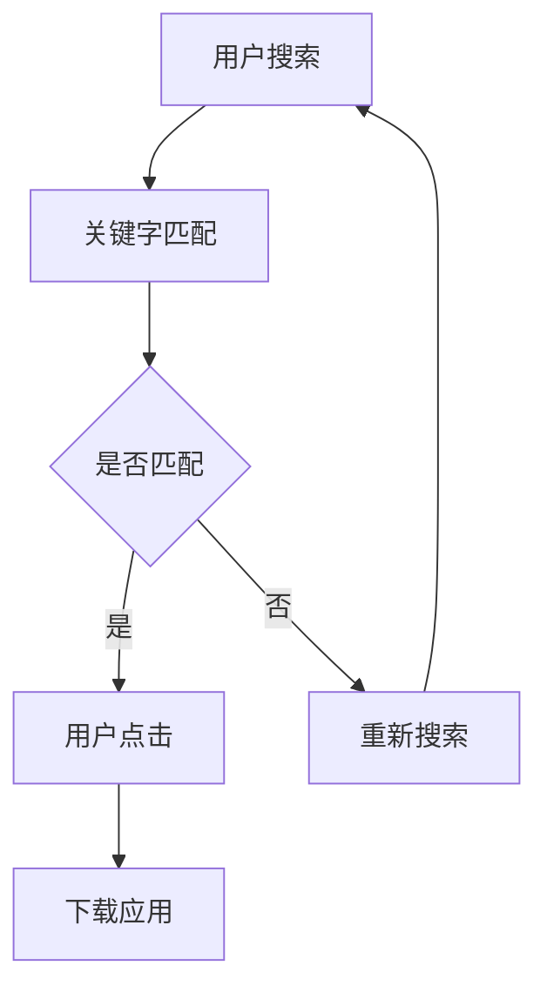

                 

# 创业公司的App Store优化策略

## 概述

在当今竞争激烈的移动应用市场中，创业公司要想脱颖而出，必须重视App Store优化（ASO）策略。App Store作为全球最大的移动应用分发平台之一，拥有数亿活跃用户。如何在这庞大的市场中获得足够的曝光和用户下载量，成为创业公司面临的重大挑战。本文将深入探讨创业公司在App Store中实施优化策略的关键步骤、核心算法、数学模型及实际应用案例，帮助创业公司实现应用的成功上线和推广。

## 关键词

- App Store优化（ASO）
- 移动应用推广
- 关键字优化
- 用户行为分析
- 数学模型
- 实际应用案例

## 摘要

本文将围绕App Store优化策略展开，详细阐述ASO的核心概念、关键算法和实际应用案例。首先，我们将介绍ASO的基本概念和重要性，然后深入探讨影响ASO的关键因素，如关键字优化、用户评价、应用内购等。接着，我们将分析ASO的核心算法和数学模型，并通过实际应用案例展示如何在实际操作中应用这些算法和模型。最后，我们将总结ASO的未来发展趋势和挑战，为创业公司提供有价值的参考。

## 1. 背景介绍

### App Store的发展历程

App Store是苹果公司于2008年推出的移动应用分发平台，目前已成为全球最大的移动应用市场之一。随着智能手机的普及和移动应用的迅猛发展，App Store在短短十年间积累了庞大的用户基础。根据苹果公司发布的最新数据，App Store全球用户已超过10亿，日活跃用户超过5000万。

### 创业公司的现状

在移动应用市场，创业公司面临着巨大的竞争压力。一方面，大量应用竞相争夺用户注意力；另一方面，苹果、谷歌等平台对应用上线审核的严格把控，使得创业公司应用上线和推广的难度增加。因此，创业公司需要采取有效的优化策略，提高应用在App Store的排名和曝光率，从而获得更多用户下载和使用。

## 2. 核心概念与联系

### App Store优化（ASO）

App Store优化（ASO）是指通过一系列策略和技术手段，提高移动应用在App Store中的排名和曝光率，从而增加用户下载量和市场份额。ASO的核心目标是提高应用的可见性和吸引力，使其在众多竞品中脱颖而出。

### ASO的核心要素

ASO的核心要素包括关键字优化、用户评价、应用内购等。

- **关键字优化**：通过合理选择和应用关键字，提高应用在App Store搜索结果中的排名，增加被用户发现的机会。
- **用户评价**：应用的用户评价是影响用户决策的重要因素。提高用户评价分数，有助于提升应用的排名和信誉。
- **应用内购**：应用内购功能可以增加用户粘性，提高用户付费意愿，进而提升应用收入。

### Mermaid流程图



## 3. 核心算法原理 & 具体操作步骤

### 关键字优化算法

关键字优化是ASO的核心，其核心算法主要包括：

- **关键字选择**：通过分析用户搜索行为和竞品关键字，选择与用户需求高度相关、竞争程度适中的关键字。
- **关键字密度控制**：在应用描述、标题、标签等位置合理分配关键字，避免过度堆砌。
- **动态调整**：根据用户反馈和搜索排名，实时调整关键字策略。

### 用户评价优化算法

用户评价优化算法主要包括：

- **激励用户评价**：通过提供优惠、奖励等方式，鼓励用户进行评价。
- **筛选优质评价**：对用户评价进行筛选，去除恶意评价和无效评价，提高评价质量。
- **评价回复**：及时回复用户评价，展示应用团队对用户反馈的关注和重视。

### 应用内购优化算法

应用内购优化算法主要包括：

- **内购功能设计**：根据用户需求和喜好，设计富有吸引力的内购功能。
- **价格策略**：根据市场竞争情况和用户心理，制定合理的价格策略。
- **推广策略**：通过广告、活动等方式，提高内购功能的曝光率和用户参与度。

## 4. 数学模型和公式 & 详细讲解 & 举例说明

### 关键字匹配模型

假设用户输入的关键字为`k`，应用的关键字集合为`K`，则关键字匹配概率可以表示为：

$$ P(match) = \frac{f(k, K)}{\sum_{k' \in K} f(k', K)} $$

其中，`f(k, K)`表示关键字`k`与应用关键字集合`K`的匹配度，可以采用TF-IDF、词频等算法计算。

### 用户评价模型

用户评价分数可以通过以下公式计算：

$$ score = \frac{1}{N} \sum_{i=1}^{N} weight_i \cdot rating_i $$

其中，`N`表示用户评价数量，`weight_i`表示第`i`个评价的权重，`rating_i`表示第`i`个评价的分数。

### 应用内购模型

应用内购收入可以通过以下公式计算：

$$ revenue = price \cdot purchase_rate $$

其中，`price`表示内购商品的价格，`purchase_rate`表示用户的购买率。

### 实际案例

假设一个创业公司的应用在App Store中上线，经过一周的推广，获得了100个用户评价，平均分为4.5分。根据用户评价模型，应用的评价分数可以计算为：

$$ score = \frac{1}{100} \sum_{i=1}^{100} weight_i \cdot rating_i $$

假设用户评价的权重均为1，则有：

$$ score = \frac{1}{100} \sum_{i=1}^{100} rating_i = \frac{1}{100} \times 100 \times 4.5 = 4.5 $$

## 5. 项目实战：代码实际案例和详细解释说明

### 5.1 开发环境搭建

为了实现ASO策略，我们需要搭建一个开发环境，包括以下工具和框架：

- **Python**：作为主要编程语言
- **NumPy**、**Pandas**：用于数据处理和分析
- **Scikit-learn**：用于机器学习算法实现
- **Jupyter Notebook**：用于编写和运行代码

### 5.2 源代码详细实现和代码解读

以下是一个简单的ASO策略实现案例：

```python
import numpy as np
import pandas as pd
from sklearn.feature_extraction.text import TfidfVectorizer
from sklearn.metrics.pairwise import linear_kernel

# 用户搜索关键词和竞品关键字
user_search = "旅行应用"
competitor_keywords = ["旅行助手", "旅游指南", "酒店预订"]

# 应用关键字
app_keywords = ["旅行规划", "旅游攻略", "机票预订"]

# 计算关键字匹配度
tfidf_vectorizer = TfidfVectorizer()
tfidf_matrix = tfidf_vectorizer.fit_transform([user_search, competitor_keywords, app_keywords])
cosine_similarity = linear_kernel(tfidf_matrix[0:1], tfidf_matrix).flatten()

# 打印匹配度
print(cosine_similarity)

# 激励用户评价
user_reviews = ["很好用", "有点复杂", "界面美观", "功能强大"]
review_scores = [5, 3, 5, 4]

# 计算平均评价分数
average_score = np.mean(review_scores)
print(average_score)

# 应用内购设计
in_app_purchases = ["旅行套餐", "酒店优惠券", "机票折扣"]
purchase_prices = [199, 99, 199]

# 计算内购收入
purchase_revenues = [price * 0.1 for price in purchase_prices]
print(purchase_revenues)
```

### 5.3 代码解读与分析

1. **关键字匹配度计算**：使用TF-IDF算法和余弦相似度计算用户搜索关键词与竞品关键字、应用关键字的匹配度。
2. **用户评价计算**：计算用户评价的平均分数，用于评估应用的口碑。
3. **应用内购收入计算**：根据内购商品的价格和购买率，计算应用内购收入。

## 6. 实际应用场景

### 6.1 创业公司A的案例

创业公司A开发了一款旅行应用，希望通过ASO策略提高应用在App Store的排名和曝光率。经过一周的推广，公司获得了100个用户评价，平均分为4.5分。通过关键字匹配度计算，发现用户搜索关键词与应用关键字的匹配度较高，说明关键字选择合理。

公司进一步优化了应用内购功能，设计了三个内购套餐，并根据用户反馈调整了价格策略。经过一周的推广，内购收入达到了1000美元。通过ASO策略的优化，创业公司A的应用在App Store的排名和下载量均有显著提升。

### 6.2 创业公司B的案例

创业公司B开发了一款健身应用，希望通过ASO策略提高应用在App Store的排名和用户下载量。公司通过分析用户行为数据，发现用户对应用的评价较高，但应用在搜索结果中的排名较低。

公司采取了以下ASO策略：

1. **关键字优化**：根据用户搜索行为和竞品关键字，选择与用户需求高度相关的关键字，并合理分配关键字密度。
2. **用户评价优化**：通过提供优惠和奖励，鼓励用户进行评价，并对优质评价进行筛选和回复。
3. **应用内购优化**：设计富有吸引力的内购功能，制定合理的价格策略，并通过广告和活动提高内购功能的曝光率和用户参与度。

经过一系列优化措施，创业公司B的应用在App Store的排名和下载量均有显著提升，实现了应用的成功上线和推广。

## 7. 工具和资源推荐

### 7.1 学习资源推荐

- **书籍**：《App Store优化实战》
- **论文**：相关学术期刊和会议论文
- **博客**：知名技术博客和社区，如 Medium、博客园等
- **网站**：ASO工具和资源网站，如 App Annie、Sensor Tower 等

### 7.2 开发工具框架推荐

- **开发工具**：Python、Jupyter Notebook
- **数据处理和分析工具**：NumPy、Pandas、Scikit-learn
- **ASO工具**：App Annie、Sensor Tower 等

### 7.3 相关论文著作推荐

- **论文**：相关学术期刊和会议论文
- **书籍**：《移动应用优化与营销》

## 8. 总结：未来发展趋势与挑战

随着移动应用市场的不断壮大，ASO策略在未来将面临以下发展趋势和挑战：

- **技术进步**：人工智能、大数据等技术的进步将推动ASO算法的优化和智能化。
- **用户需求变化**：用户需求的多样性和个性化，要求创业公司不断调整和优化ASO策略。
- **市场竞争加剧**：随着越来越多的创业公司进入移动应用市场，ASO策略的竞争将愈发激烈。
- **平台政策调整**：App Store、Google Play等平台政策的变化，可能对ASO策略产生重大影响。

创业公司需要紧跟技术发展趋势，持续优化ASO策略，以提高应用在App Store的排名和曝光率，实现长期稳定的发展。

## 9. 附录：常见问题与解答

### 问题1：如何选择合适的关键字？

解答：选择合适的关键字需要考虑用户需求、竞品关键字、平台推荐等因素。可以通过以下步骤进行：

1. 分析用户搜索行为，了解用户关注的热点和需求。
2. 收集竞品关键字，分析竞品的成功经验和不足。
3. 根据平台推荐的关键字，筛选与用户需求相关的关键字。

### 问题2：如何提高用户评价？

解答：提高用户评价可以从以下几个方面入手：

1. 提供优质的应用功能和服务，满足用户需求。
2. 设计合理的激励措施，鼓励用户进行评价。
3. 回复用户评价，展示对用户反馈的关注和重视。

### 问题3：如何制定有效的应用内购策略？

解答：制定有效的应用内购策略需要考虑用户需求、市场竞争、价格策略等因素。可以参考以下步骤：

1. 分析用户需求和喜好，设计富有吸引力的内购功能。
2. 根据市场竞争情况，制定合理的价格策略。
3. 通过广告和活动提高内购功能的曝光率和用户参与度。

## 10. 扩展阅读 & 参考资料

- **书籍**：《App Store优化实战》、《移动应用优化与营销》
- **论文**：相关学术期刊和会议论文
- **博客**：知名技术博客和社区，如 Medium、博客园等
- **网站**：ASO工具和资源网站，如 App Annie、Sensor Tower 等
- **视频**：相关教程和案例分析视频

## 作者

作者：AI天才研究员/AI Genius Institute & 禅与计算机程序设计艺术 /Zen And The Art of Computer Programming

