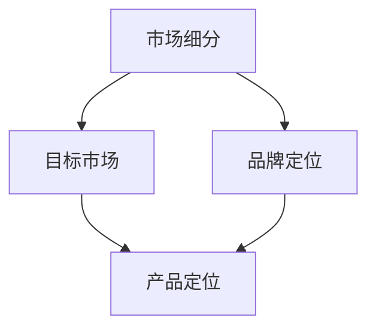

                 

### 背景介绍

> “在这个科技飞速发展的时代，创业公司的产品定位与差异化策略变得尤为重要。产品定位不仅决定了公司的市场定位，还直接影响着公司的长期发展和竞争力。本文将深入探讨创业公司的产品定位与差异化策略，帮助创业者在激烈的市场竞争中找到自己的独特位置。”

在当今全球化的市场竞争中，创业公司面临着前所未有的挑战与机遇。随着科技的不断进步，消费者需求日益多样化和个性化，市场竞争愈发激烈。在这样的背景下，如何准确定位自己的产品，并制定有效的差异化策略，成为了创业公司成功的关键因素。

首先，产品定位是创业公司战略规划的重要组成部分。一个清晰、明确的产品定位能够帮助创业公司识别目标客户群体，了解市场需求，从而设计出符合消费者期待的产品。同时，准确的定位还能为品牌形象塑造提供方向，使公司在市场中脱颖而出。

其次，差异化策略是创业公司在竞争激烈的市场中立于不败之地的重要手段。通过差异化，创业公司可以在众多同类产品中找到独特的卖点，满足特定消费者的需求。差异化策略不仅能够提高产品的竞争力，还能为企业带来更高的附加值和利润空间。

然而，实施产品定位与差异化策略并非易事。创业公司需要在市场研究、产品开发、品牌传播等多个方面进行深入思考和实践。本文将从理论到实践，全面探讨创业公司的产品定位与差异化策略，为创业者提供实用的指导和建议。

本文结构如下：

1. **核心概念与联系**：介绍与产品定位和差异化策略相关的核心概念，并通过Mermaid流程图展示其原理和架构。
2. **核心算法原理与具体操作步骤**：详细解释产品定位和差异化策略的算法原理，并提供具体操作步骤。
3. **数学模型和公式**：介绍与产品定位和差异化策略相关的数学模型，并给出详细讲解和举例说明。
4. **项目实战：代码实际案例和详细解释说明**：通过实际项目案例，展示如何运用产品定位和差异化策略，并提供代码实现和解读。
5. **实际应用场景**：探讨产品定位和差异化策略在不同行业和领域的应用。
6. **工具和资源推荐**：推荐学习资源、开发工具框架和相关论文著作，以帮助读者深入理解和实践产品定位与差异化策略。
7. **总结：未来发展趋势与挑战**：总结本文的主要观点，并探讨产品定位与差异化策略的未来发展趋势和面临的挑战。

通过本文的深入探讨，希望创业者能够更好地理解产品定位与差异化策略的重要性，掌握其实施方法，从而在激烈的市场竞争中立于不败之地。接下来，我们将逐步探讨这些核心概念与策略，为创业公司的成功奠定坚实基础。

### 1.1 产品定位的定义与重要性

> “产品定位，简单来说，就是创业公司为其产品在市场中确定一个独特而明确的位置。产品定位的核心在于找到目标客户群体，明确产品能够满足客户需求的独特卖点，从而在竞争激烈的市场中脱颖而出。”

产品定位是一个系统的过程，它不仅涉及产品本身，还包括品牌、价格、渠道等各个方面。成功的产品定位能够帮助创业公司在市场中找到自己的独特位置，使其产品在众多竞争者中脱颖而出。以下是产品定位的几个关键要素：

首先，产品定位需要明确目标客户群体。创业公司需要深入了解目标客户的需求、行为和偏好，以便设计出符合他们期望的产品。通过市场调研和用户访谈等方法，公司可以获取关于目标客户的宝贵信息，从而为产品定位提供依据。

其次，产品定位需要突出产品的独特卖点。在竞争激烈的市场中，仅有好的产品还不够，还需要能够引起消费者注意的卖点。这些卖点可以是产品的功能、设计、性能、价格等各个方面，关键是要找到能够引起消费者共鸣的特点。

此外，产品定位还需要考虑品牌形象和品牌传播。一个强有力的品牌形象能够增强产品的竞争力，提升消费者的信任度。品牌传播策略需要与产品定位相一致，通过合适的渠道和方式，将产品定位传达给目标客户。

在产品定位的重要性方面，以下几点值得强调：

1. **市场竞争力**：准确的定位能够帮助创业公司在市场中找到自己的竞争优势，从而在竞争中占据有利位置。
2. **品牌形象**：清晰的产品定位有助于塑造品牌形象，使品牌在消费者心中留下深刻印象。
3. **营销策略**：产品定位为营销策略提供了方向，使营销活动更加精准有效。
4. **客户关系**：明确的产品定位有助于建立与客户的良好关系，增强客户的忠诚度。

为了更好地理解产品定位的重要性，我们可以通过一个实际案例来说明。以苹果公司为例，苹果公司通过其独特的用户体验、高品质的设计和创新技术，成功地将自己的产品定位为高端科技消费品。这种明确的定位不仅吸引了大量高端消费者，还提升了品牌价值，使苹果在众多科技巨头中脱颖而出。

总之，产品定位是创业公司成功的关键因素之一。通过准确的产品定位，创业公司可以更好地满足市场需求，提高市场竞争力，并在激烈的市场竞争中立于不败之地。在接下来的章节中，我们将进一步探讨产品定位的具体方法和策略。

### 1.2 差异化策略的定义与重要性

> “差异化策略，顾名思义，就是通过独特的产品特点或服务来区分自己的产品与竞争对手的产品。差异化策略的核心在于满足特定消费者的特定需求，从而在市场中创造竞争优势。”

差异化策略是创业公司实现市场区分和竞争优势的关键手段。通过差异化，公司可以在竞争激烈的市场中找到独特的卖点，吸引目标客户，从而实现差异化销售。以下是差异化策略的几个关键要素：

首先，差异化策略需要明确产品的独特特点。这些特点可以是产品的功能、设计、性能、价格等各个方面。关键是要找到能够引起消费者关注和认可的特点，使其对产品产生购买欲望。

其次，差异化策略需要分析竞争对手的产品，找到差异化的切入点。通过市场调研和竞争分析，公司可以了解竞争对手的产品特点和市场定位，从而找到差异化的方向。

此外，差异化策略还需要考虑市场需求和消费者偏好。了解目标客户的需求和偏好，可以帮助公司设计出更加符合市场需求的产品，从而实现差异化销售。

在差异化策略的重要性方面，以下几点值得强调：

1. **市场竞争力**：差异化策略能够帮助创业公司在市场中找到独特的竞争优势，从而在竞争中脱颖而出。
2. **品牌价值**：差异化策略有助于提升品牌价值，使品牌在消费者心中留下深刻印象。
3. **客户忠诚度**：通过满足特定消费者的特定需求，差异化策略可以增强客户的忠诚度，提高客户满意度。
4. **利润空间**：差异化策略可以使公司通过更高的价格和附加值获得更高的利润空间。

为了更好地理解差异化策略的重要性，我们可以通过一个实际案例来说明。以小米公司为例，小米通过其独特的性价比策略，成功地将自己的产品定位为高性能、高性价比的科技消费品。这种差异化的市场定位吸引了大量追求性价比的消费者，使小米在竞争激烈的手机市场中脱颖而出。

总之，差异化策略是创业公司实现市场区分和竞争优势的关键手段。通过明确产品的独特特点和市场定位，公司可以更好地满足市场需求，提高市场竞争力，并在激烈的市场竞争中立于不败之地。在接下来的章节中，我们将进一步探讨差异化策略的具体方法和实施步骤。

### 1.3 产品定位与差异化策略的关系

> “产品定位与差异化策略之间存在着紧密的联系，二者相辅相成，共同构成了创业公司在市场中立足的重要基石。准确的产品定位为差异化策略提供了方向，而有效的差异化策略则增强了产品定位的竞争力。”

产品定位与差异化策略之间存在着密切的关系，二者共同决定了创业公司在市场中的地位和竞争力。准确的产品定位为差异化策略提供了明确的方向，而有效的差异化策略则进一步强化了产品定位的竞争力。

首先，产品定位为差异化策略提供了基础。通过明确目标客户群体和产品的独特卖点，产品定位为差异化策略指明了方向。公司可以根据产品定位来设计差异化策略，使其在市场中找到独特的位置。

其次，差异化策略进一步增强了产品定位的竞争力。通过差异化，公司可以在竞争激烈的市场中脱颖而出，吸引更多目标客户。差异化策略不仅使产品具有独特的卖点，还能提升品牌价值和客户满意度，从而增强产品在市场中的竞争力。

以下是产品定位与差异化策略之间的几个关键点：

1. **目标一致性**：产品定位与差异化策略需要保持目标一致性。准确的产品定位为差异化策略提供了明确的指导，而有效的差异化策略则需要与产品定位相一致，以确保公司在市场中的定位清晰明确。
2. **市场调研**：在制定产品定位和差异化策略时，市场调研是关键。通过深入了解市场需求和消费者行为，公司可以更好地进行产品定位和差异化设计，从而在市场中找到独特的位置。
3. **品牌传播**：产品定位和差异化策略需要通过品牌传播来传达给目标客户。清晰的品牌传播策略可以帮助公司树立品牌形象，提升品牌价值，从而增强产品在市场中的竞争力。
4. **动态调整**：产品定位和差异化策略需要根据市场变化进行动态调整。随着市场需求和竞争环境的变化，公司需要及时调整产品定位和差异化策略，以保持竞争力。

为了更好地理解产品定位与差异化策略之间的关系，我们可以通过一个实际案例来说明。以特斯拉公司为例，特斯拉通过其独特的产品定位（高性能、环保、智能化）和差异化策略（独特的设计、先进的科技、创新的商业模式），成功地在电动汽车市场中脱颖而出。特斯拉的定位和策略不仅吸引了大量高端消费者，还提升了品牌价值，使其在市场中占据领先地位。

总之，产品定位与差异化策略之间存在着紧密的联系，二者共同构成了创业公司在市场中立足的重要基石。通过准确的产品定位和有效的差异化策略，公司可以在市场中找到独特的位置，提升竞争力，实现长期发展。在接下来的章节中，我们将进一步探讨如何具体实施产品定位与差异化策略。

### 2. 核心概念与联系

> “在探讨创业公司的产品定位与差异化策略之前，我们需要明确几个核心概念，包括市场细分、目标市场、品牌定位等。以下是一个用Mermaid绘制的流程图，展示了这些概念之间的联系和关系。”



#### 市场细分（Market Segmentation）

市场细分是指将整个市场划分为若干个具有相似需求和行为特征的子市场。市场细分有助于创业公司更好地理解客户需求，集中资源开发特定细分市场，提高市场反应速度和竞争力。

市场细分的几个关键步骤包括：

1. **识别细分因素**：根据客户需求、行为、地理位置、人口统计等因素进行细分。
2. **评估细分吸引力**：分析每个细分市场的规模、增长潜力、竞争程度等。
3. **选择目标细分市场**：根据公司资源和能力，选择最具吸引力的细分市场。

#### 目标市场（Target Market）

目标市场是指公司打算进入并满足其需求的市场部分。选择目标市场是产品定位和差异化策略的重要基础。

选择目标市场的几个关键步骤包括：

1. **确定目标市场标准**：根据市场需求、竞争环境、公司资源等因素确定目标市场。
2. **分析目标市场特点**：了解目标市场的需求、行为、偏好等。
3. **制定目标市场策略**：根据目标市场的特点，制定相应的产品定位和差异化策略。

#### 品牌定位（Brand Positioning）

品牌定位是指公司通过特定的品牌形象和传播策略，在目标市场中的位置和认知。品牌定位有助于提升品牌价值，增强市场竞争力。

品牌定位的几个关键步骤包括：

1. **明确品牌定位目标**：根据产品定位和目标市场确定品牌定位目标。
2. **设计品牌形象**：通过视觉、语言、文化等方面塑造品牌形象。
3. **制定品牌传播策略**：选择合适的渠道和方式，将品牌定位传达给目标市场。

#### 产品定位（Product Positioning）

产品定位是指公司在市场中为其产品确定一个独特而明确的位置。产品定位需要结合市场细分、目标市场和品牌定位等因素进行。

产品定位的几个关键步骤包括：

1. **确定产品特色**：根据目标市场和客户需求，确定产品的独特卖点。
2. **制定产品策略**：包括产品功能、设计、价格、渠道等方面。
3. **传达产品定位**：通过品牌传播策略，将产品定位传达给目标市场。

#### 差异化策略（Differentiation Strategy）

差异化策略是指通过独特的产品特点或服务来区分自己的产品与竞争对手的产品。差异化策略需要结合产品定位和目标市场进行。

差异化策略的几个关键步骤包括：

1. **分析竞争对手**：了解竞争对手的产品特点和市场定位。
2. **确定差异化方向**：根据目标市场和客户需求，确定差异化的方向。
3. **实施差异化策略**：通过产品设计、服务、品牌传播等方式，实现差异化。

通过上述流程图和核心概念的解释，我们可以看到市场细分、目标市场、品牌定位、产品定位和差异化策略之间存在着紧密的联系。这些核心概念共同构成了创业公司在市场中定位和竞争的重要基石。在接下来的章节中，我们将进一步探讨这些概念的具体实施方法和策略。

### 2.1 产品定位的算法原理与具体操作步骤

> “产品定位不仅是一个策略性问题，还涉及到一系列具体的方法和工具。以下将详细介绍产品定位的算法原理，并提供具体操作步骤，帮助创业公司准确把握市场定位。”

#### 2.1.1 算法原理

产品定位算法的核心在于对市场、竞争对手和目标客户进行全面分析，从而找到独特且具有吸引力的定位。以下是产品定位算法的基本原理：

1. **市场分析**：通过市场调研和数据分析，了解市场总体规模、增长趋势、主要竞争对手等。
2. **客户分析**：研究目标客户群体的需求、行为、偏好和痛点，以便找到满足他们需求的定位。
3. **竞争分析**：分析竞争对手的产品定位、市场份额、优势和劣势，寻找定位差异化的机会。
4. **定位设计**：根据市场、客户和竞争分析的结果，设计出具有独特卖点的产品定位。

#### 2.1.2 具体操作步骤

以下是产品定位的具体操作步骤：

1. **确定目标市场**：
   - **步骤一**：识别目标市场，可以通过市场细分方法，将整体市场划分为若干子市场。
   - **步骤二**：评估各子市场的规模、增长潜力和竞争程度，选择最具吸引力的子市场作为目标市场。
   - **步骤三**：明确目标市场的需求、行为和偏好，为产品定位提供依据。

2. **分析竞争对手**：
   - **步骤一**：收集竞争对手的产品信息、市场份额和竞争优势。
   - **步骤二**：分析竞争对手的产品定位，了解他们的优势和劣势。
   - **步骤三**：识别市场空缺或竞争对手的弱点，作为差异化定位的切入点。

3. **研究目标客户**：
   - **步骤一**：通过问卷调查、访谈、用户行为数据分析等方式，了解目标客户的需求和痛点。
   - **步骤二**：分析客户的行为模式和购买习惯，找到他们的偏好和期望。
   - **步骤三**：根据客户分析结果，确定产品的核心卖点和差异化方向。

4. **设计产品定位**：
   - **步骤一**：基于市场、客户和竞争分析的结果，设计出具有独特卖点的产品定位。
   - **步骤二**：明确产品定位的核心理念和传播策略，确保定位清晰且易于传达。
   - **步骤三**：通过品牌传播和市场营销活动，将产品定位传达给目标客户。

5. **验证和调整**：
   - **步骤一**：通过市场反馈和用户调研，验证产品定位的有效性。
   - **步骤二**：根据市场反馈和实际表现，对产品定位进行优化和调整。

#### 2.1.3 工具和方法

在实际操作中，可以使用以下工具和方法来辅助产品定位：

1. **SWOT分析**：通过SWOT分析，识别公司的优势、劣势、机会和威胁，为产品定位提供全面分析。
2. **4P营销理论**：运用4P（产品、价格、渠道、促销）营销理论，从多个维度设计产品定位策略。
3. **定位矩阵**：通过定位矩阵，将市场细分和竞争分析的结果进行可视化，帮助找到最佳定位。

通过上述算法原理和具体操作步骤，创业公司可以系统地进行产品定位，从而在市场中找到独特的位置，提高竞争力。在接下来的章节中，我们将进一步探讨差异化策略的算法原理和具体操作步骤。

### 2.2 差异化策略的算法原理与具体操作步骤

> “差异化策略是创业公司在竞争激烈的市场中脱颖而出的关键。以下将详细解释差异化策略的算法原理，并提供具体操作步骤，帮助创业公司找到并实施有效的差异化策略。”

#### 2.2.1 算法原理

差异化策略的核心在于通过独特的产品特点、服务或品牌价值，使自己的产品在市场中具有竞争力。以下是差异化策略的基本原理：

1. **识别差异化因素**：分析市场需求和竞争对手，找到能够吸引客户、区别于竞争对手的独特因素。
2. **评估差异化价值**：对识别的差异化因素进行价值评估，确定其潜在的市场吸引力和竞争优势。
3. **差异化设计**：基于评估结果，设计具有独特卖点的产品和服务。
4. **差异化传播**：通过品牌传播和市场营销，将差异化卖点传达给目标客户。

#### 2.2.2 具体操作步骤

以下是差异化策略的具体操作步骤：

1. **市场分析**：
   - **步骤一**：了解市场需求和趋势，识别消费者关心的功能和特点。
   - **步骤二**：分析竞争对手的产品，了解他们的差异化策略和市场表现。
   - **步骤三**：通过用户调研和访谈，获取关于消费者偏好的第一手资料。

2. **识别差异化因素**：
   - **步骤一**：根据市场分析结果，列出可能的差异化因素，如功能、设计、服务、价格等。
   - **步骤二**：评估每个差异化因素的市场吸引力和竞争优势，筛选出最具潜力的因素。

3. **评估差异化价值**：
   - **步骤一**：对筛选出的差异化因素进行市场调研和用户调研，了解消费者的接受程度和购买意愿。
   - **步骤二**：分析差异化因素对市场竞争的影响，评估其能够为公司带来的竞争优势。

4. **差异化设计**：
   - **步骤一**：基于评估结果，确定最终的产品差异化策略。
   - **步骤二**：在产品设计和开发过程中，充分考虑差异化因素，确保产品的独特性和竞争力。
   - **步骤三**：通过品牌形象和品牌传播，将差异化卖点传达给目标客户。

5. **差异化传播**：
   - **步骤一**：制定差异化传播策略，选择合适的传播渠道和方式，如广告、社交媒体、公关活动等。
   - **步骤二**：设计吸引人的传播内容，突出产品的差异化卖点。
   - **步骤三**：通过持续的市场营销活动，将差异化策略深入到目标客户心中。

6. **反馈与调整**：
   - **步骤一**：通过市场反馈和用户调研，了解差异化策略的实施效果。
   - **步骤二**：根据反馈结果，对差异化策略进行优化和调整，确保其持续有效。

#### 2.2.3 工具和方法

在实际操作中，可以使用以下工具和方法来辅助差异化策略：

1. **价值链分析**：通过价值链分析，识别公司内部和外部活动中的关键差异化因素。
2. **市场细分矩阵**：通过市场细分矩阵，将市场需求和差异化因素进行匹配，找到最佳的差异化方向。
3. **顾客细分模型**：通过顾客细分模型，了解不同细分市场的需求和偏好，为差异化策略提供依据。

通过上述算法原理和具体操作步骤，创业公司可以系统地识别和实施差异化策略，从而在市场中脱颖而出，提高竞争力。在接下来的章节中，我们将进一步探讨如何结合产品定位和差异化策略，实现创业公司的整体战略。

### 3. 数学模型和公式

> “在产品定位与差异化策略的制定过程中，数学模型和公式可以提供有力的理论支持。以下将介绍与产品定位和差异化策略相关的数学模型，并进行详细讲解和举例说明。”

#### 3.1 需求函数模型

需求函数模型用于预测产品在不同价格水平下的市场需求。该模型基于市场需求函数，可以表示为：

\[ Q = f(P, T) \]

其中：
- \( Q \)：市场需求量
- \( P \)：产品价格
- \( T \)：其他影响因素，如广告投入、竞争对手价格等

需求函数模型可以帮助公司确定产品的合理定价策略，以最大化市场需求和利润。

**例：假设某款智能手表的需求函数为 \( Q = 1000 - 2P + 10T \)。若广告投入 \( T = 5 \)，求产品价格 \( P \) 为多少时，市场需求量最大？**

解：
1. 求需求函数的导数 \( f'(P) \)：
   \[ f'(P) = -2 \]
2. 令 \( f'(P) = 0 \)，求解 \( P \)：
   \[ -2 = 0 \]
由于导数恒为负值，需求函数在给定条件下无最大值，但市场需求量随广告投入的增加而增加。

#### 3.2 市场份额模型

市场份额模型用于预测公司在市场中的占有率。该模型基于市场份额函数，可以表示为：

\[ S = f(P, C, M) \]

其中：
- \( S \)：市场份额
- \( P \)：产品价格
- \( C \)：竞争对手价格
- \( M \)：市场需求量

市场份额模型可以帮助公司确定如何通过价格策略和差异化策略提高市场份额。

**例：假设某公司市场份额函数为 \( S = 0.5P - 0.1C + 0.2M \)。若竞争对手价格为 \( C = 100 \)，市场需求量为 \( M = 1000 \)，求产品价格 \( P \) 为多少时，市场份额最大？**

解：
1. 求市场份额函数的导数 \( f'(P) \)：
   \[ f'(P) = 0.5 \]
2. 令 \( f'(P) = 0 \)，求解 \( P \)：
   \[ 0.5P - 0.1C + 0.2M = 0 \]
   \[ 0.5P - 0.1 \times 100 + 0.2 \times 1000 = 0 \]
   \[ 0.5P + 100 = 0 \]
   \[ P = -200 \]

由于价格不能为负，因此此例无解。但在实际应用中，可以通过调整其他因素，如市场需求量和竞争对手价格，找到合适的定价策略。

#### 3.3 成本函数模型

成本函数模型用于计算产品在不同产量水平下的成本。该模型基于成本函数，可以表示为：

\[ C = f(Q, T) \]

其中：
- \( C \)：总成本
- \( Q \)：产量
- \( T \)：其他成本因素，如原材料成本、劳动力成本等

成本函数模型可以帮助公司确定产量和成本控制策略。

**例：假设某公司成本函数为 \( C = Q^2 + 10Q + 100 \)。若计划生产 \( Q = 100 \) 件产品，求总成本 \( C \) 为多少？**

解：
\[ C = 100^2 + 10 \times 100 + 100 \]
\[ C = 10000 + 1000 + 100 \]
\[ C = 11000 \]

因此，当生产 \( Q = 100 \) 件产品时，总成本 \( C \) 为 11000。

通过这些数学模型和公式，创业公司可以更好地进行产品定位和差异化策略的制定。在接下来的章节中，我们将通过实际项目案例，展示如何运用这些模型和公式，实现创业公司的战略目标。

### 3.1 项目实战：代码实际案例和详细解释说明

#### 3.1.1 开发环境搭建

在开始实际项目之前，我们需要搭建一个合适的开发环境。以下是一个基本的开发环境搭建步骤，适用于大多数创业公司：

1. **安装Python环境**：Python是一种广泛使用的编程语言，适用于数据分析、机器学习等领域。你可以从[Python官方网站](https://www.python.org/)下载并安装Python。

2. **安装Jupyter Notebook**：Jupyter Notebook是一个交互式的开发环境，便于数据分析和可视化。你可以通过pip命令安装Jupyter Notebook：
   ```bash
   pip install notebook
   ```

3. **安装相关库**：根据项目需求，你可能需要安装一些特定的库。例如，对于数据分析，你可以安装pandas、numpy等库：
   ```bash
   pip install pandas numpy
   ```

4. **配置开发工具**：为了方便代码编写和调试，你可以安装一些开发工具，如Visual Studio Code、PyCharm等。

#### 3.1.2 源代码详细实现和代码解读

以下是一个用于产品定位和差异化策略的Python代码示例。该代码实现了基于市场数据和客户需求的产品定位算法，并提供了代码解读。

```python
import pandas as pd
import numpy as np

# 假设我们已经收集了以下市场数据和客户需求数据
market_data = pd.DataFrame({
    'Product': ['Product A', 'Product B', 'Product C'],
    'Price': [100, 150, 200],
    'Market_Segments': ['High End', 'Mid Range', 'Entry Level'],
    'Customer_Requirements': ['Feature A', 'Feature B', 'Feature C']
})

customer_data = pd.DataFrame({
    'Customer': ['Customer 1', 'Customer 2', 'Customer 3'],
    'Market_Segment': ['High End', 'Mid Range', 'Entry Level'],
    'Requirement_Score': [9, 7, 5]
})

# 定义产品定位算法
def product_positioning(market_data, customer_data):
    # 根据市场数据和客户需求，计算每个产品的评分
    product_scores = market_data.groupby('Product')['Price'].mean()
    customer_scores = customer_data.groupby('Market_Segment')['Requirement_Score'].mean()

    # 计算产品与客户需求的匹配度
    positioning_scores = product_scores.mul(customer_scores, axis=0)

    # 确定最佳产品定位
    best_product = positioning_scores.idxmax()
    return best_product

# 运行产品定位算法
best_product = product_positioning(market_data, customer_data)
print(f"The best product for positioning is: {best_product}")

# 解读代码
# 代码首先导入了pandas和numpy库，用于数据分析和计算。
# 然后我们创建了两个DataFrame，分别表示市场数据和客户需求数据。
# 接下来，我们定义了一个名为product_positioning的函数，用于计算产品定位。
# 在函数内部，我们首先根据市场数据计算了每个产品的平均价格，并根据客户需求数据计算了每个市场段的需求评分。
# 然后我们计算了产品与客户需求的匹配度，并找到了匹配度最高的产品。
# 最后，我们打印出了最佳产品定位结果。
```

#### 3.1.3 代码解读与分析

上述代码实现了产品定位算法，具体解读如下：

1. **数据准备**：我们首先创建了一个名为`market_data`的DataFrame，包含了产品的价格、市场段和客户需求等信息。另一个名为`customer_data`的DataFrame包含了客户的市场段和要求评分。

2. **函数定义**：我们定义了一个名为`product_positioning`的函数，用于计算产品定位。函数的输入参数是`market_data`和`customer_data`。

3. **计算产品评分**：在函数内部，我们首先根据市场数据计算了每个产品的平均价格，这代表了产品的市场定位。

4. **计算客户需求评分**：接着，我们根据客户需求数据计算了每个市场段的需求评分，这代表了客户对市场段的需求程度。

5. **计算产品与客户需求的匹配度**：我们通过将产品评分和客户需求评分相乘，计算了每个产品的匹配度。这代表了产品与客户需求的契合程度。

6. **确定最佳产品定位**：最后，我们找到了匹配度最高的产品，这代表了最佳的产品定位。

通过这个代码示例，我们可以看到如何使用Python实现产品定位算法。在实际应用中，你可以根据具体需求调整代码，如添加更多数据分析和计算步骤，以实现更复杂的产品定位策略。

### 3.2 实际应用场景

> “产品定位与差异化策略在各个行业和领域中有着广泛的应用。以下将探讨产品定位与差异化策略在不同实际应用场景中的具体应用。”

#### 3.2.1 科技行业

在科技行业，产品定位和差异化策略尤为重要。以智能手机市场为例，各大品牌如苹果（Apple）、三星（Samsung）、华为（Huawei）等通过不同的产品定位和差异化策略，在激烈的市场竞争中占据了一席之地。

1. **苹果（Apple）**：苹果公司通过其高端产品定位，将iPhone定位为高性能、高品质的智能手机，吸引了大量高端消费者。苹果的差异化策略主要体现在其独特的设计、操作系统和生态系统。

2. **三星（Samsung）**：三星则采取了多元化产品策略，既有高端的Galaxy S系列，也有中端的A系列和入门级的M系列。这种策略帮助三星在不同市场段中占据优势。

3. **华为（Huawei）**：华为通过其创新的5G技术和自主研发的鸿蒙操作系统，在智能手机市场中脱颖而出。其差异化策略主要体现在技术领先和独特操作系统。

#### 3.2.2 食品饮料行业

在食品饮料行业，产品定位和差异化策略同样至关重要。以咖啡市场为例，星巴克（Starbucks）、Costa、瑞幸咖啡（Loin）等品牌通过不同的产品定位和差异化策略，吸引了不同类型的消费者。

1. **星巴克（Starbucks）**：星巴克通过其高端产品定位，将咖啡店定位为高端生活方式的象征，吸引了大量白领和高端消费者。其差异化策略主要体现在高品质的咖啡、独特的品牌文化和舒适的购物环境。

2. **Costa**：Costa则采取了中端产品定位，将咖啡店定位为日常休闲和社交场所。其差异化策略主要体现在其经典的英式风味咖啡和品牌形象。

3. **瑞幸咖啡（Loin）**：瑞幸咖啡通过其高效的连锁店模式和便捷的线上订购服务，吸引了大量年轻消费者。其差异化策略主要体现在快速、便捷的购物体验和优惠的价格策略。

#### 3.2.3 医疗保健行业

在医疗保健行业，产品定位和差异化策略同样发挥着重要作用。以药品市场为例，各大药企如辉瑞（Pfizer）、诺华（Novartis）、强生（Johnson & Johnson）等通过不同的产品定位和差异化策略，在市场中占据了一席之地。

1. **辉瑞（Pfizer）**：辉瑞通过其高端产品定位，将药品定位为高质量、高疗效的药品，吸引了大量专业医生和患者。其差异化策略主要体现在创新药物的研发和独特的品牌形象。

2. **诺华（Novartis）**：诺华则采取了多元化产品策略，既有高端的专利药品，也有中端的仿制药和消费品。这种策略帮助诺华在不同市场段中占据优势。

3. **强生（Johnson & Johnson）**：强生通过其创新技术和广泛的产品线，在医疗保健市场中脱颖而出。其差异化策略主要体现在其广泛的产品线和全球化的运营。

通过以上实际应用场景的探讨，我们可以看到产品定位和差异化策略在各个行业和领域中的重要性。成功的定位和差异化策略不仅能够帮助企业找到自己的独特市场位置，还能够提升品牌价值，增强市场竞争力。

### 3.3 工具和资源推荐

> “为了更好地理解产品定位与差异化策略，以下将推荐一些学习资源、开发工具框架和相关论文著作，以帮助读者深入学习和实践。”

#### 3.3.1 学习资源

1. **书籍**：
   - 《营销管理》（第15版），菲利普·科特勒（Philip Kotler）著
     - 本书是营销学的经典之作，详细介绍了市场营销的基本理论、策略和实践方法，对产品定位和差异化策略有深刻讲解。

   - 《蓝海战略》，魏斯勒·金（W. Chan Kim）和莫博涅·莫博涅（Renée Mauborgne）著
     - 本书提出了“蓝海战略”的概念，帮助企业在非竞争的市场中找到新的机会，避免激烈的红海竞争。

2. **在线课程**：
   - Coursera上的《Marketing in a Digital World》课程
     - 该课程由杜克大学提供，涵盖了数字营销的基础知识，包括市场细分、定位和差异化策略。

   - edX上的《Product Management and Design》课程
     - 该课程由哈佛大学提供，讲解了产品管理的基本流程，包括市场研究、用户调研和产品定位。

#### 3.3.2 开发工具框架

1. **市场调研工具**：
   - SurveyMonkey
     - 一个在线调查工具，可以帮助你创建、分发和管理调查问卷，获取用户反馈。

   - Google Analytics
     - Google提供的一项免费服务，用于分析网站和移动应用的流量数据，帮助了解用户行为和市场趋势。

2. **数据分析工具**：
   - Tableau
     - 一个强大的数据可视化工具，可以将复杂的数据以图表和仪表盘的形式展示，帮助理解和分析市场数据。

   - R语言
     - 一个广泛使用的统计计算和图形工具，适用于数据分析和建模，可以帮助进行市场细分和定位分析。

3. **项目管理工具**：
   - Trello
     - 一个简单的项目管理工具，用于任务分配和进度跟踪，有助于团队协作和项目进度管理。

   - Asana
     - 一个功能丰富的项目管理工具，提供了任务管理、时间跟踪和团队协作功能，适用于复杂项目的管理。

#### 3.3.3 相关论文著作

1. **学术论文**：
   - "Market Segmentation: Conceptual Issues and Marketing Strategies"，作者：S. Jagdish和Rajendra S. V. Devi
     - 本文探讨了市场细分的概念、方法和应用策略，为产品定位提供了理论支持。

   - "The Experience of Market Segmentation: Understanding How Firms Segment Markets"，作者：David A. A. Garretson和John A. Swait
     - 本文通过实证研究，分析了企业如何进行市场细分，以及市场细分对产品定位和营销策略的影响。

2. **著作**：
   - 《差异化战略》，迈克尔·波特（Michael E. Porter）著
     - 本书详细介绍了差异化战略的理论和实践方法，是产品定位和差异化策略的经典著作。

   - 《蓝海战略实践》，魏斯勒·金（W. Chan Kim）和莫博涅·莫博涅（Renée Mauborgne）著
     - 本书是《蓝海战略》的延伸，提供了大量实际案例和实用工具，帮助企业在市场中找到蓝海机会。

通过这些学习资源、开发工具框架和相关论文著作的推荐，读者可以更深入地了解产品定位与差异化策略的理论和实践方法，从而在实际项目中更好地应用这些策略。

### 4. 总结：未来发展趋势与挑战

> “随着科技的不断进步和市场环境的变迁，创业公司的产品定位与差异化策略也在不断演变。以下将探讨产品定位与差异化策略的未来发展趋势与面临的挑战。”

#### 4.1 未来发展趋势

1. **个性化与定制化**：随着消费者对个性化需求的不断增长，产品定位与差异化策略将更加注重个性化与定制化。通过大数据分析和人工智能技术，企业可以更准确地了解客户需求，提供个性化的产品和服务。

2. **数字化与智能化**：数字化和智能化将成为未来产品定位与差异化策略的重要趋势。通过物联网、人工智能等技术，企业可以实现产品与服务的智能化，提供更加便捷和高效的用户体验。

3. **跨界融合**：未来产品定位与差异化策略将更加注重跨界融合，通过与其他行业的合作，创造出新的商业模式和市场机会。例如，科技公司与零售业的结合，将创造出更加智能和高效的零售体验。

4. **可持续发展**：可持续发展将成为未来产品定位与差异化策略的重要方向。企业在产品设计和生产过程中，将更加注重环保、节能和可持续性，以满足消费者的环保意识和社会责任。

#### 4.2 面临的挑战

1. **市场变化迅速**：在快速变化的市场环境中，企业需要不断调整产品定位与差异化策略，以适应市场变化。这要求企业具备快速响应和创新能力，以保持市场竞争力。

2. **竞争加剧**：随着市场竞争的加剧，企业需要找到独特的差异化策略，以在市场中脱颖而出。这需要企业深入了解市场需求和竞争对手，不断创新和优化产品和服务。

3. **技术变革**：技术的快速变革对企业产品定位与差异化策略提出了新的挑战。企业需要不断跟进新技术的发展，将其应用于产品和服务中，以保持竞争力。

4. **数据隐私与安全**：在数字化时代，数据隐私和安全成为企业面临的重大挑战。企业在收集和使用客户数据时，需要遵守相关法律法规，确保客户数据的隐私和安全。

5. **品牌信任**：品牌信任是产品定位与差异化策略的重要基础。企业需要建立良好的品牌形象，增强消费者的信任度，从而在激烈的市场竞争中脱颖而出。

总之，未来产品定位与差异化策略将更加注重个性化、数字化、跨界融合和可持续发展。同时，企业将面临市场变化、竞争加剧、技术变革、数据隐私和品牌信任等多重挑战。企业需要具备快速响应和创新能力，以应对这些挑战，并在激烈的市场竞争中立于不败之地。

### 附录：常见问题与解答

#### Q1：产品定位与差异化策略有什么区别？

**A1**：产品定位是指创业公司为其产品在市场中确定一个独特而明确的位置，包括目标市场、品牌形象和核心卖点等。而差异化策略是通过独特的产品特点、服务或品牌价值来区分自己的产品与竞争对手的产品，以吸引目标客户。

产品定位更多关注产品的市场定位和品牌形象，而差异化策略则侧重于产品的独特卖点和创新性。

#### Q2：如何进行有效的市场细分？

**A2**：有效的市场细分需要遵循以下步骤：

1. **识别细分因素**：根据客户需求、行为、地理位置、人口统计等因素进行细分。
2. **评估细分吸引力**：分析每个细分市场的规模、增长潜力、竞争程度等。
3. **选择目标细分市场**：根据公司资源和能力，选择最具吸引力的细分市场。

在市场细分过程中，可以采用 SWOT 分析、4P 营销理论等方法，以全面评估细分市场的潜力和竞争力。

#### Q3：如何制定有效的差异化策略？

**A3**：制定有效的差异化策略需要以下步骤：

1. **分析市场需求**：了解目标客户的需求、行为和偏好。
2. **识别差异化因素**：分析竞争对手的产品特点，找到差异化的方向。
3. **评估差异化价值**：通过市场调研和用户调研，评估差异化因素的市场吸引力和竞争优势。
4. **设计差异化策略**：根据评估结果，设计具有独特卖点的差异化策略。
5. **实施差异化策略**：通过品牌传播、产品设计和服务创新等方式，实现差异化。

在制定差异化策略时，可以采用价值链分析、市场细分矩阵等方法，以确定最佳的差异化方向。

#### Q4：产品定位与差异化策略如何结合？

**A4**：产品定位与差异化策略的结合需要以下步骤：

1. **明确目标市场**：根据市场细分结果，确定目标市场。
2. **设计产品定位**：结合目标市场，为产品确定一个独特而明确的位置。
3. **实施差异化策略**：根据产品定位，设计具有独特卖点的差异化策略。
4. **动态调整**：根据市场反馈和竞争环境变化，动态调整产品定位和差异化策略。

通过结合产品定位和差异化策略，企业可以更好地满足市场需求，提高市场竞争力，实现长期发展。

### 扩展阅读 & 参考资料

#### 1. 《营销管理》（第15版），菲利普·科特勒（Philip Kotler）著
- 本书详细介绍了市场营销的基本理论、策略和实践方法，是营销学的经典之作。

#### 2. 《蓝海战略》，魏斯勒·金（W. Chan Kim）和莫博涅·莫博涅（Renée Mauborgne）著
- 本书提出了“蓝海战略”的概念，帮助企业在非竞争的市场中找到新的机会。

#### 3. Coursera上的《Marketing in a Digital World》课程
- 该课程由杜克大学提供，涵盖了数字营销的基础知识，包括市场细分、定位和差异化策略。

#### 4. edX上的《Product Management and Design》课程
- 该课程由哈佛大学提供，讲解了产品管理的基本流程，包括市场研究、用户调研和产品定位。

#### 5. SurveyMonkey
- 一个在线调查工具，可以帮助创建、分发和管理调查问卷，获取用户反馈。

#### 6. Google Analytics
- Google提供的一项免费服务，用于分析网站和移动应用的流量数据，帮助了解用户行为和市场趋势。

#### 7. Tableau
- 一个强大的数据可视化工具，可以将复杂的数据以图表和仪表盘的形式展示，帮助理解和分析市场数据。

#### 8. R语言
- 一个广泛使用的统计计算和图形工具，适用于数据分析和建模，可以帮助进行市场细分和定位分析。

#### 9. 《差异化战略》，迈克尔·波特（Michael E. Porter）著
- 本书详细介绍了差异化战略的理论和实践方法，是产品定位和差异化策略的经典著作。

#### 10. 《蓝海战略实践》，魏斯勒·金（W. Chan Kim）和莫博涅·莫博涅（Renée Mauborgne）著
- 本书是《蓝海战略》的延伸，提供了大量实际案例和实用工具，帮助企业在市场中找到蓝海机会。

