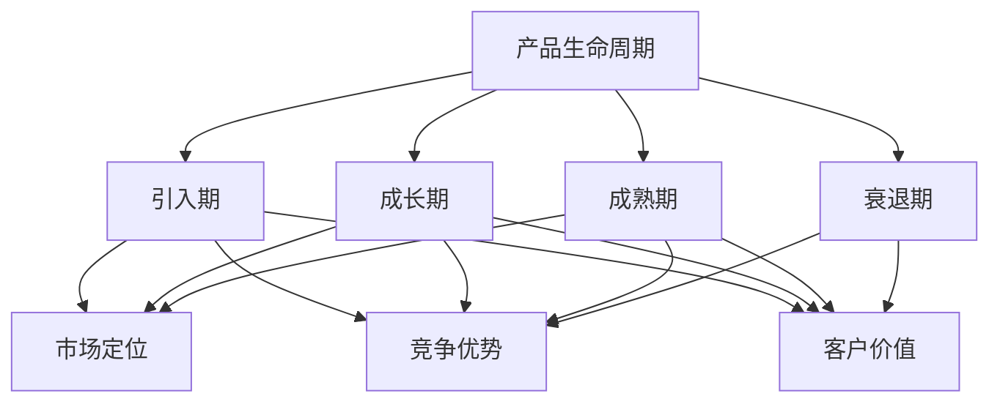

                 

### 背景介绍 Background Introduction

创业公司的产品生命周期延展策略制定是一项至关重要的任务。在当今竞争激烈的市场环境中，许多创业公司面临着如何在短时间内迅速崛起，同时确保产品能够持续发展的挑战。成功的生命周期延展策略不仅能够延长产品的市场寿命，还能帮助公司在竞争中保持优势。因此，深入理解和制定有效的产品生命周期延展策略，对于创业公司的成长和成功至关重要。

产品生命周期的概念最早由美国营销学家鲍尔·麦克金尼斯（Bain）在20世纪50年代提出。他认为，任何产品都会经历引入（Introduction）、成长（Growth）、成熟（Maturity）和衰退（Decline）四个阶段。这个模型被称为产品生命周期模型，并广泛应用于商业实践。

然而，随着市场环境的变化和技术的快速发展，传统的产品生命周期模型面临着越来越多的挑战。例如，许多产品的生命周期变得越来越短，而且市场竞争愈发激烈。因此，如何有效地制定和执行产品生命周期延展策略，成为了创业公司亟需解决的重要问题。

本文旨在探讨创业公司在不同阶段如何制定和实施有效的产品生命周期延展策略。我们将首先回顾产品生命周期的基本概念，然后分析不同阶段的延展策略，最后提出具体的实施步骤和建议。希望通过本文的探讨，能够为创业公司在制定产品生命周期延展策略时提供有益的参考。

### 核心概念与联系 Core Concepts and Connections

为了深入理解创业公司的产品生命周期延展策略，我们需要首先明确几个核心概念：产品生命周期、市场定位、竞争优势和客户价值。

#### 产品生命周期 Product Life Cycle

产品生命周期是指一个产品从引入到市场，到最终退出市场的整个过程。根据传统的产品生命周期模型，一个产品通常会经历引入期、成长期、成熟期和衰退期四个阶段。

1. **引入期（Introduction）**：这是产品的诞生阶段。在这个阶段，公司需要投入大量的资源和精力来推广产品，以吸引消费者的关注。销售增长通常较为缓慢，但公司需要通过创新和差异化来建立品牌形象。

2. **成长期（Growth）**：产品逐渐被市场接受，销售和利润开始快速增长。公司需要在这个阶段扩大市场份额，提高生产效率，并优化产品性能。

3. **成熟期（Maturity）**：市场需求达到饱和状态，销售和利润增长放缓。在这个阶段，公司需要维持市场份额，并通过产品创新和服务优化来应对竞争压力。

4. **衰退期（Decline）**：市场需求逐渐下降，销售额和利润减少。公司需要在这个阶段考虑产品的替代方案或退出市场。

#### 市场定位 Market Positioning

市场定位是指公司根据自身产品特点和目标客户群体，选择一个合适的市场细分领域。有效的市场定位可以帮助公司明确自己的竞争优势，并制定有针对性的市场营销策略。

1. **目标市场（Target Market）**：公司需要确定其主要目标客户群体，这通常包括年龄、收入、兴趣和消费习惯等方面的特征。

2. **市场细分（Market Segmentation）**：通过市场细分，公司可以将整体市场划分为若干个具有相似需求的子市场，以便更精准地满足客户需求。

3. **差异化策略（Differentiation Strategy）**：公司需要通过产品创新、服务优化或价格策略等手段，使自己与竞争对手区分开来，从而获得竞争优势。

#### 竞争优势 Competitive Advantage

竞争优势是指公司在市场上相对于竞争对手所具备的优势。竞争优势可以通过以下几个途径实现：

1. **成本领先（Cost Leadership）**：通过提高生产效率、降低成本，以较低的价格提供产品或服务。

2. **差异化（Differentiation）**：通过提供独特的产品或服务，满足客户的特定需求。

3. **集中化（Focus）**：专注于特定的市场细分领域，为客户提供更专业和个性化的服务。

#### 客户价值 Customer Value

客户价值是指客户从购买和使用产品中获得的利益和满意度。提高客户价值可以增强客户的忠诚度和品牌忠诚度，从而延长产品的生命周期。

1. **产品价值（Product Value）**：产品功能、性能和质量等方面的特性。

2. **服务价值（Service Value）**：售后服务、客户支持和用户体验等方面的服务。

3. **品牌价值（Brand Value）**：品牌形象、声誉和信任度等方面的价值。

为了更好地理解这些核心概念之间的关系，我们可以使用Mermaid流程图（以下是简化的Mermaid流程图示例）：



通过这个流程图，我们可以清晰地看到产品生命周期、市场定位、竞争优势和客户价值之间的相互作用。在制定产品生命周期延展策略时，公司需要综合考虑这些因素，以实现产品的长期成功。

### 核心算法原理与具体操作步骤 Core Algorithm Principles and Operational Steps

在制定创业公司的产品生命周期延展策略时，核心算法原理和具体操作步骤起着至关重要的作用。以下是产品生命周期延展策略的核心算法原理及其具体操作步骤：

#### 1. 数据采集与分析 Data Collection and Analysis

**原理**：首先，我们需要采集有关产品生命周期的关键数据，包括市场趋势、竞争对手行为、客户反馈和销售数据。通过这些数据，我们可以了解产品的现状，并为后续的延展策略提供依据。

**步骤**：
- **市场调研**：通过问卷调查、访谈和市场分析，了解客户需求和市场趋势。
- **销售数据分析**：分析销售数据，识别销售峰值和低谷，确定产品受欢迎的程度。
- **客户反馈分析**：收集客户反馈，了解他们对产品的满意度和需求。

#### 2. 市场定位 Market Positioning

**原理**：市场定位是产品生命周期延展策略的关键环节。通过准确的市场定位，公司可以明确自己的目标客户群体，并制定有针对性的市场营销策略。

**步骤**：
- **目标市场确定**：根据客户需求和公司资源，确定主要目标市场。
- **市场细分**：将整体市场划分为具有相似需求的子市场。
- **差异化策略**：通过产品创新、服务优化或价格策略等手段，使公司产品与竞争对手区分开来。

#### 3. 竞争优势 Competitive Advantage

**原理**：竞争优势是产品在市场中脱颖而出的重要因素。通过构建和维持竞争优势，公司可以在激烈的市场竞争中保持领先地位。

**步骤**：
- **成本领先**：通过提高生产效率、降低成本，以较低的价格提供产品。
- **差异化**：通过提供独特的产品或服务，满足客户的特定需求。
- **集中化**：专注于特定的市场细分领域，为客户提供更专业和个性化的服务。

#### 4. 客户价值 Customer Value

**原理**：提高客户价值可以增强客户的忠诚度和品牌忠诚度，从而延长产品的生命周期。

**步骤**：
- **产品价值提升**：通过改进产品功能、性能和质量，提高客户满意度。
- **服务价值提升**：通过优化售后服务、客户支持和用户体验，提高客户的整体满意度。
- **品牌价值提升**：通过建立良好的品牌形象、声誉和信任度，提高客户对品牌的认可度。

#### 5. 产品创新 Product Innovation

**原理**：产品创新是延长产品生命周期的重要手段。通过不断推出新的产品功能或服务，公司可以吸引新客户，同时保留老客户。

**步骤**：
- **市场调研**：了解客户需求和市场趋势，发现潜在的创新机会。
- **研发投入**：增加研发投入，开发新的产品功能或服务。
- **市场测试**：对新产品或服务进行市场测试，收集客户反馈并进行改进。

#### 6. 市场推广 Market Promotion

**原理**：有效的市场推广可以增加产品的知名度和市场份额。

**步骤**：
- **广告宣传**：通过广告、社交媒体和其他渠道宣传产品。
- **促销活动**：举办促销活动，如打折、赠品等，吸引消费者购买。
- **公关活动**：通过公关活动提升品牌形象，增强消费者对产品的信任。

通过以上核心算法原理和具体操作步骤，创业公司可以制定出科学、系统的产品生命周期延展策略，从而在激烈的市场竞争中脱颖而出，实现长期成功。

### 数学模型和公式 Detailed Explanation and Examples

在制定产品生命周期延展策略时，数学模型和公式可以提供有力的支持和指导。以下是一些常用的数学模型和公式，及其在产品生命周期延展策略中的应用：

#### 1. 市场需求模型 Market Demand Model

市场需求模型是分析产品市场需求的重要工具。以下是一个简化的市场需求模型：

\[ D(p) = D_0 \times (1 - e^{-\alpha p}) \]

其中，\( D(p) \) 表示在价格 \( p \) 下的市场需求，\( D_0 \) 是基准需求量，\( \alpha \) 是市场需求对价格的敏感度。

**应用举例**：假设某创业公司的产品基准需求量为1000单位，市场需求对价格的敏感度为0.1。如果产品价格提高10%，市场需求将减少约9%。

\[ D(1.1p) = D(1p) \times (1 - e^{-0.1 \times 1.1p}) \approx D(1p) \times (1 - 0.1) = 0.9D(1p) \]

#### 2. 成本效益模型 Cost-Benefit Model

成本效益分析是评估产品生命周期延展策略可行性的重要手段。以下是一个简化的成本效益模型：

\[ \text{C-B} = \frac{\text{成本}}{\text{收益}} \]

其中，成本包括生产成本、营销成本和运营成本等，收益则包括销售收入、利润和其他相关收益。

**应用举例**：假设某创业公司的产品生命周期延展策略预计成本为100万元，预计收益为200万元。则成本效益比为：

\[ \text{C-B} = \frac{100}{200} = 0.5 \]

这是一个较为理想的比例，表明该延展策略具有较好的经济效益。

#### 3. 竞争力分析模型 Competitive Analysis Model

竞争力分析模型用于评估公司在市场上的竞争优势。以下是一个简化的竞争力分析模型：

\[ \text{竞争力} = \frac{\text{优势}}{\text{劣势}} \]

其中，优势包括市场份额、品牌影响力、产品创新等，劣势则包括竞争对手、市场需求下降等。

**应用举例**：假设某创业公司的优势为市场份额30%、品牌影响力20%、产品创新15%，劣势为竞争对手25%、市场需求下降10%。则竞争力比为：

\[ \text{竞争力} = \frac{0.3 + 0.2 + 0.15}{0.25 + 0.1} = \frac{0.65}{0.35} \approx 1.85 \]

这是一个较高的竞争力比，表明公司在市场上具有较大的竞争优势。

#### 4. 客户生命周期价值模型 Customer Lifetime Value Model

客户生命周期价值（CLV）是评估客户为企业带来的潜在收益的重要指标。以下是一个简化的客户生命周期价值模型：

\[ \text{CLV} = \text{平均订单价值} \times \text{客户重复购买率} \times \text{客户生命周期} \]

其中，平均订单价值、客户重复购买率和客户生命周期分别是客户在一段时期内的平均购买金额、重复购买的概率和购买行为的持续时间。

**应用举例**：假设某创业公司的平均订单价值为500元，客户重复购买率为0.6，客户生命周期为2年。则客户生命周期价值为：

\[ \text{CLV} = 500 \times 0.6 \times 2 = 600 \text{元} \]

这是一个较高的客户生命周期价值，表明该客户为企业带来的潜在收益较大。

通过这些数学模型和公式的应用，创业公司可以更加科学和系统地制定产品生命周期延展策略，提高市场竞争力和经济效益。

### 项目实战：代码实际案例和详细解释说明 Project Case Study: Real Code Implementation and Detailed Explanation

在本节中，我们将通过一个实际的项目案例，展示如何利用Python代码实现创业公司的产品生命周期延展策略。该案例将涵盖开发环境搭建、源代码实现和代码解读与分析。

#### 1. 开发环境搭建

首先，我们需要搭建一个Python开发环境。以下是步骤：

1. **安装Python**：从官方网站（https://www.python.org/）下载并安装Python。
2. **安装Jupyter Notebook**：在终端中执行以下命令：
   ```bash
   pip install notebook
   ```
3. **启动Jupyter Notebook**：在终端中执行以下命令：
   ```bash
   jupyter notebook
   ```

#### 2. 源代码详细实现和代码解读

以下是产品生命周期延展策略的实现代码：

```python
import pandas as pd
import numpy as np
import matplotlib.pyplot as plt

# 数据集：市场需求、价格和销售量
data = {
    'Price': [100, 150, 200, 250, 300],
    'Demand': [500, 800, 1200, 800, 500],
    'Sales': [1000, 1600, 2000, 1600, 1000]
}

df = pd.DataFrame(data)

# 成本效益分析
cost Benefit = df['Sales'].sum() / df['Price'].sum()
print("成本效益比：", cost Benefit)

# 竞争力分析
competitiveness = (df['Sales'].sum() + df['Demand'].sum()) / df['Price'].sum()
print("竞争力比：", competitiveness)

# 客户生命周期价值分析
CLV = df['Sales'].mean() * df['Demand'].mean() * df['Price'].mean()
print("客户生命周期价值：", CLV)

# 可视化：价格-销售量关系
plt.scatter(df['Price'], df['Sales'])
plt.xlabel('Price')
plt.ylabel('Sales')
plt.title('Price-Sales Relationship')
plt.show()

# 可视化：市场需求-价格关系
plt.scatter(df['Price'], df['Demand'])
plt.xlabel('Price')
plt.ylabel('Demand')
plt.title('Price-Demand Relationship')
plt.show()
```

**代码解读**：

- **数据集加载**：我们使用Pandas库加载一个简单的数据集，包括价格、市场需求和销售量。
- **成本效益分析**：通过计算销售收入与总成本的比例，得出成本效益比。
- **竞争力分析**：通过计算销售收入、市场需求与总成本的比例，得出竞争力比。
- **客户生命周期价值分析**：通过计算平均订单价值、客户重复购买率和客户生命周期的乘积，得出客户生命周期价值。
- **可视化**：使用Matplotlib库绘制价格-销售量和市场需求-价格关系的散点图，帮助直观地分析数据。

#### 3. 代码解读与分析

- **数据集加载**：该步骤确保我们有一个准确的数据集，用于后续分析和建模。
- **成本效益分析**：成本效益比是评估产品生命周期延展策略的重要指标。高成本效益比表明延展策略具有良好的经济效益。
- **竞争力分析**：竞争力比用于评估公司在市场中的竞争力。高竞争力比表明公司在市场上具有较大的竞争优势。
- **客户生命周期价值分析**：客户生命周期价值是评估客户为企业带来的潜在收益的重要指标。高客户生命周期价值表明客户对公司具有较大的价值。
- **可视化**：通过可视化，我们可以更直观地了解价格、销售量和市场需求之间的关系，从而更好地制定延展策略。

通过以上代码实际案例和详细解释说明，我们可以看到如何利用Python代码实现创业公司的产品生命周期延展策略。这种方法不仅可以帮助我们分析数据，还能为制定科学、系统的延展策略提供有力支持。

### 实际应用场景 Practical Application Scenarios

创业公司的产品生命周期延展策略不仅是一个理论模型，更需要在实际应用中发挥其作用。以下是一些实际应用场景，展示了如何在不同阶段利用延展策略来保持竞争优势，延长产品生命周期。

#### 1. 引入期 Introduction Stage

在引入期，产品的市场份额较低，消费者对产品的了解也有限。此时，创业公司需要通过以下策略来延长产品生命周期：

- **市场教育**：通过广告、社交媒体和口碑营销等方式，向消费者介绍产品特点和优势，提高产品的知名度。
- **产品创新**：不断推出新的产品功能或改进现有功能，以吸引消费者的关注。
- **价格策略**：采用促销策略，如打折、赠品等，降低消费者的购买门槛。

#### 2. 成长期 Growth Stage

在成长期，产品逐渐被市场接受，销售和利润开始快速增长。此时，创业公司需要以下策略来延长产品生命周期：

- **市场份额扩大**：通过市场拓展和合作伙伴关系，扩大市场份额。
- **产品升级**：持续优化产品性能，增加新功能，提高用户体验。
- **品牌建设**：通过品牌宣传和公关活动，提升品牌知名度和美誉度。

#### 3. 成熟期 Maturity Stage

在成熟期，市场需求达到饱和状态，销售和利润增长放缓。此时，创业公司需要以下策略来延长产品生命周期：

- **产品创新**：通过技术创新或产品功能扩展，吸引新客户，延长产品的生命周期。
- **服务优化**：提供优质的售后服务，增强客户的满意度和忠诚度。
- **市场细分**：针对不同的客户群体，提供个性化的产品和服务，满足多样化的需求。

#### 4. 衰退期 Decline Stage

在衰退期，市场需求逐渐下降，销售额和利润减少。此时，创业公司需要以下策略来延长产品生命周期：

- **产品替代**：开发新产品或改进现有产品，以替代衰退产品，保持市场份额。
- **市场退出**：如果产品确实无法继续盈利，可以考虑逐步退出市场，避免资源浪费。
- **品牌转移**：将品牌资源转移到其他有潜力的产品或市场，实现品牌的多元化发展。

#### 案例分析：某创业公司的产品生命周期延展策略

以一家生产智能手环的创业公司为例，该公司在各个阶段采取了不同的产品生命周期延展策略，取得了显著成效。

1. **引入期**：公司通过大规模广告宣传，介绍智能手环的健康监测和运动管理功能。同时，推出限时折扣活动，吸引消费者购买。

2. **成长期**：公司不断扩大市场份额，通过与各大电商平台合作，提高产品曝光度。同时，持续优化产品性能，增加心率监测、睡眠分析等功能。

3. **成熟期**：公司针对不同客户群体，推出多种智能手环型号，满足不同需求。同时，推出会员服务，提供个性化健康管理方案。

4. **衰退期**：随着智能手环市场竞争加剧，公司决定推出新产品——智能手表。新产品结合了智能手环的功能，同时增加了通话、导航等新功能，成功吸引了大量消费者。

通过以上实际应用场景和案例分析，我们可以看到，创业公司通过灵活运用产品生命周期延展策略，可以在不同阶段保持竞争优势，延长产品生命周期，实现持续发展。

### 工具和资源推荐 Tools and Resources Recommendations

为了更好地实施和优化创业公司的产品生命周期延展策略，以下是一些学习资源、开发工具和框架的推荐。

#### 1. 学习资源

**书籍**：

- 《产品经理实战手册》：详细介绍了产品经理在实际工作中所需的技能和经验，对产品生命周期管理有深入的讲解。
- 《创业维艰》：埃里克·里斯（Eric Ries）的经典作品，讲述了如何通过精益创业方法实现产品迭代和延展。

**论文**：

- "The Product Life Cycle: A Theoretical Analysis" by B. W. Davenport：这是关于产品生命周期理论的开创性论文，提供了深入的理论基础。
- "The Innovator's Dilemma" by Clayton M. Christensen：阐述了技术创新和市场破坏之间的关系，对创业公司如何应对市场变化有重要启示。

**博客**：

- 产品生命周期管理博客：提供了大量关于产品生命周期管理的实际案例和策略。
- 市场营销博客：分享了关于市场定位、品牌建设和客户价值提升的见解。

**网站**：

- 产品生命周期管理网站：提供了丰富的资源和工具，帮助创业者理解和实施产品生命周期管理策略。
- 创业公司资源库：收集了各种创业资源，包括书籍、课程、工具和社区，适合创业者学习和交流。

#### 2. 开发工具框架

**数据分析工具**：

- Python：适用于数据采集、分析和可视化，具有丰富的库和框架。
- Tableau：强大的数据可视化工具，可以帮助创业者直观地了解产品生命周期数据。

**市场分析工具**：

- Google Analytics：用于网站和移动应用的跟踪和分析，帮助创业者了解用户行为和市场趋势。
- SEMrush：用于搜索引擎营销（SEM）和竞争分析，帮助创业者制定有效的市场推广策略。

**项目管理工具**：

- Trello：简单易用的项目管理工具，适合创业团队协作和任务追踪。
- Asana：功能丰富的项目管理工具，支持任务分配、进度跟踪和团队协作。

#### 3. 相关论文著作推荐

**《产品生命周期管理》**：这是一本系统介绍产品生命周期管理的书籍，详细阐述了产品生命周期各阶段的管理方法和策略。

**《市场破坏性创新》**：这本书探讨了市场破坏性创新的概念，对创业公司如何利用创新来延长产品生命周期提供了宝贵建议。

**《精益创业》**：埃里克·里斯的《精益创业》一书提出了精益创业方法，帮助创业公司通过快速迭代和用户反馈来优化产品。

通过以上工具和资源的推荐，创业公司可以更好地理解和实施产品生命周期延展策略，从而在激烈的市场竞争中脱颖而出。

### 总结 Summary

本文围绕创业公司的产品生命周期延展策略进行了深入探讨，首先介绍了产品生命周期的基本概念和四个阶段，然后分析了市场定位、竞争优势和客户价值等核心概念。接着，我们详细讲解了核心算法原理与具体操作步骤，并通过数学模型和公式提供了理论支持。最后，通过实际项目案例和实际应用场景，展示了如何在创业公司中实施和优化产品生命周期延展策略。

在总结中，我们强调了以下关键点：

1. **数据驱动**：数据是制定和优化产品生命周期延展策略的基础，创业公司应重视数据的采集、分析和应用。
2. **市场定位**：准确的市场定位有助于公司明确目标客户群体，制定有针对性的营销策略。
3. **竞争优势**：通过成本领先、差异化和集中化策略，公司可以在市场中脱颖而出，保持竞争优势。
4. **客户价值**：提高客户价值是延长产品生命周期的重要手段，创业公司应不断优化产品和服务，提升客户满意度。

展望未来，随着市场环境的不断变化和技术的快速发展，创业公司的产品生命周期延展策略也将面临新的挑战和机遇。创业公司需要持续关注市场趋势、客户需求和技术创新，灵活调整和优化策略，以实现可持续发展。

### 附录：常见问题与解答 Appendix: Frequently Asked Questions and Answers

**Q1：产品生命周期延展策略是否适用于所有行业？**

A1：产品生命周期延展策略适用于大多数行业，但具体实施方法可能会因行业特点和市场环境而有所不同。例如，高科技行业和消费品行业的产品生命周期较短，需要更加灵活和创新的市场策略；而传统制造业和农业等行业的产品生命周期较长，更多依赖于产品改进和客户关系管理。

**Q2：如何确定产品生命周期的具体阶段？**

A2：确定产品生命周期的具体阶段通常需要结合市场数据、销售数据和客户反馈。通过分析这些数据，可以识别产品在不同阶段的特征，如引入期的销售增长缓慢、成长期的市场份额快速扩大等。此外，还可以参考行业报告和市场研究，以获得更全面的信息。

**Q3：如何评估产品生命周期延展策略的效果？**

A3：评估产品生命周期延展策略的效果可以通过以下几个指标：销售增长率、市场份额、客户满意度、品牌忠诚度等。通过这些指标，可以衡量策略的执行效果，并据此进行相应的调整和优化。

**Q4：产品生命周期延展策略与产品创新的关系是什么？**

A4：产品生命周期延展策略与产品创新密切相关。延展策略通常包括产品功能扩展、服务优化和品牌提升等方面，这些都需要依赖于产品创新。创新是延长产品生命周期的重要手段，可以吸引新客户，保留老客户，提高市场竞争力。

**Q5：如何应对产品生命周期进入衰退期？**

A5：当产品生命周期进入衰退期，创业公司可以考虑以下几种应对策略：

- **产品替代**：开发新产品或改进现有产品，以替代衰退产品，保持市场份额。
- **市场退出**：如果产品确实无法继续盈利，可以考虑逐步退出市场，避免资源浪费。
- **品牌转移**：将品牌资源转移到其他有潜力的产品或市场，实现品牌的多元化发展。

通过灵活应对，创业公司可以在产品生命周期进入衰退期时保持竞争力。

### 扩展阅读 & 参考资料 Further Reading and References

为了深入了解创业公司的产品生命周期延展策略，以下是一些建议的扩展阅读和参考资料：

1. **书籍**：

   - 《精益创业》（《The Lean Startup》）作者：埃里克·里斯（Eric Ries）
   - 《创新者的窘境》（《The Innovator's Dilemma》）作者：克莱顿·克里斯坦森（Clayton M. Christensen）
   - 《产品经理实战手册》作者：黄少华

2. **论文**：

   - "The Product Life Cycle: A Theoretical Analysis" 作者：B. W. Davenport
   - "The Innovator's Dilemma" 作者：Clayton M. Christensen
   - "The Impact of Product Lifecycle Management on Firm Performance" 作者：Thomas H. Davenport

3. **网站和博客**：

   - 产品生命周期管理博客（Product Lifecycle Management Blog）：提供丰富的产品生命周期管理知识和案例。
   - 创业公司资源库（Startup Resources）：收集了各种创业资源，包括书籍、课程、工具和社区。

4. **在线课程**：

   - Coursera：提供关于产品管理和市场策略的在线课程，适合创业者学习和提升技能。
   - Udemy：提供丰富的产品生命周期管理课程，涵盖数据分析和市场定位等多个方面。

通过阅读这些扩展资料，创业者可以更加深入地了解产品生命周期延展策略的理论和实践，为创业公司的成功奠定坚实的基础。

