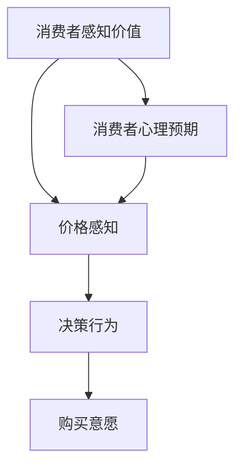
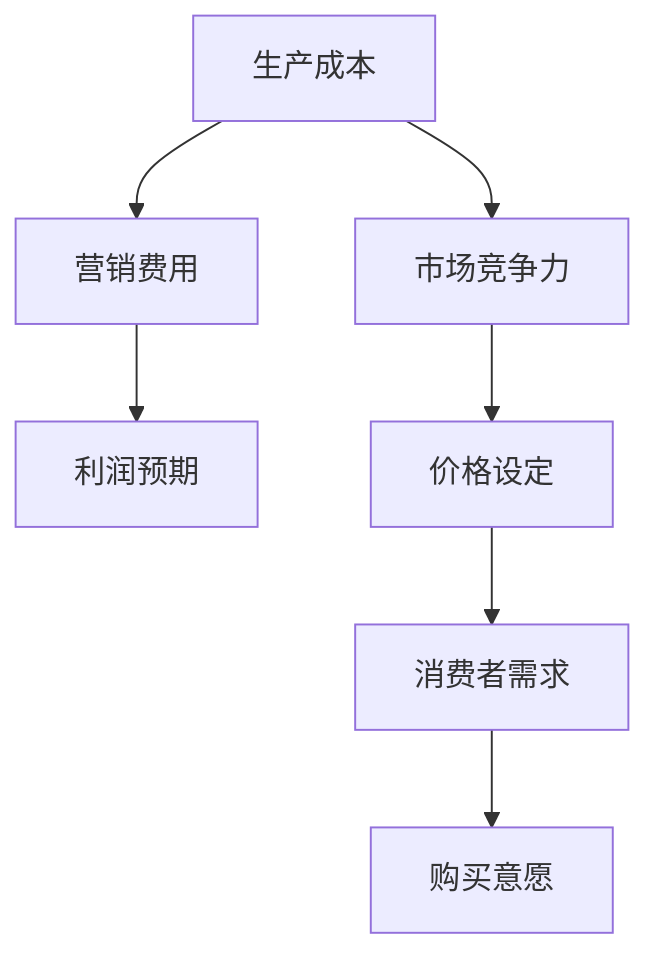
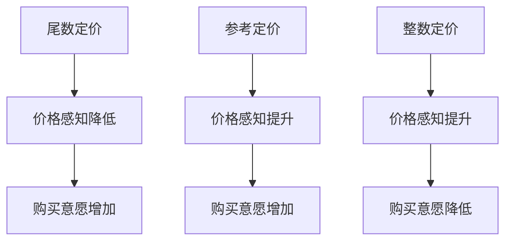
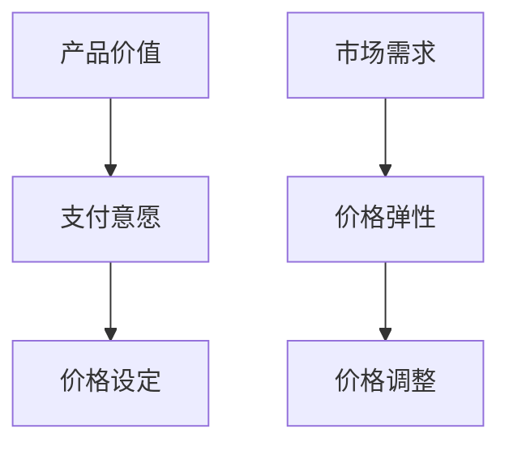

                 

### 背景介绍

创业公司在市场经济中扮演着至关重要的角色。它们不仅带来了创新和就业机会，而且推动了整个经济的增长。然而，对于许多创业公司来说，成功的关键不仅仅在于创造出色的产品或服务，更重要的是如何有效地定价。

在经济学中，定价是一个复杂且微妙的问题。它涉及到市场需求、供给、成本结构以及消费者的心理等多方面因素。错误的定价策略可能导致公司利润下降，甚至破产。因此，了解和利用定价心理学，对于创业公司来说，显得尤为重要。

本文将探讨定价心理学在创业公司中的应用与实践。我们将首先介绍定价心理学的核心概念，然后分析其在创业公司中的具体应用。接下来，我们将探讨如何利用数学模型和算法来制定定价策略。最后，我们将通过实际案例来展示这些策略在现实世界中的效果，并讨论未来发展趋势与挑战。

通过本文的阅读，读者将了解：

1. 定价心理学的基本原理和核心概念。
2. 如何将定价心理学应用于创业公司的定价策略。
3. 如何使用数学模型和算法来制定有效的定价策略。
4. 实际应用案例和未来发展趋势。

让我们一步步深入探讨定价心理学的奥秘，了解它在创业公司中的实际应用，并探索如何通过科学的方法制定出更有效的定价策略。

### 核心概念与联系

#### 1. 价格感知与感知价值
价格感知是消费者对商品或服务的价格的主观评价。它与消费者的心理预期、收入水平、市场环境等因素密切相关。消费者往往会根据产品的功能、品牌、质量等方面来评估其价值，进而影响价格感知。价格感知与感知价值之间的关联可以用以下Mermaid流程图表示：



在这个流程图中，消费者首先评估产品的感知价值，然后形成价格感知，最终影响购买决策。

#### 2. 成本效益分析
成本效益分析是评估项目或产品的成本与收益之间的关系。在定价过程中，创业公司需要综合考虑生产成本、市场竞争力、消费者需求等因素，以确定一个既能覆盖成本又能吸引消费者的价格。成本效益分析的核心概念可以用以下Mermaid流程图表示：



在这个流程图中，生产成本和营销费用共同决定了公司的利润预期，而市场竞争力和消费者需求则影响了价格的设定。

#### 3. 心理定价策略
心理定价策略是利用消费者的心理机制来设定价格，以达到增加销量和利润的目的。常见的心理定价策略包括尾数定价、参考定价、整数定价等。这些策略的核心是通过操纵价格感知来影响消费者的购买决策。心理定价策略的流程可以用以下Mermaid流程图表示：



在这个流程图中，尾数定价和参考定价通过降低价格感知来增加购买意愿，而整数定价则通过提升价格感知来降低购买意愿。

#### 4. 价值定价策略
价值定价策略是基于产品的实际价值和消费者的支付意愿来设定价格。这种策略强调产品对消费者的价值，而不是简单地基于成本或市场竞争。价值定价策略的流程可以用以下Mermaid流程图表示：



在这个流程图中，产品价值和支付意愿共同决定了价格，而市场需求和价格弹性则影响了价格的调整。

通过以上四个核心概念的介绍和Mermaid流程图的分析，我们可以更清晰地理解定价心理学的关键要素及其相互关系。这些概念和策略在创业公司的定价过程中起着至关重要的作用，为制定有效的定价策略提供了理论基础和实践指导。

#### 核心算法原理 & 具体操作步骤

在了解了定价心理学的核心概念之后，接下来我们将探讨如何将这些概念转化为具体的定价策略，并通过算法来优化和实施这些策略。以下是一个简化的定价算法原理及其操作步骤：

##### 1. 算法原理

定价算法的核心目标是基于消费者的行为数据和市场需求，动态调整价格，以达到最大化利润或市场份额。核心原理包括：

- **价格弹性分析**：通过分析不同价格水平下的需求变化，确定价格弹性区间。
- **价值评估**：结合产品的感知价值和消费者的支付意愿，进行综合价值评估。
- **竞争分析**：考虑市场竞争状况，确保价格具有竞争力。
- **动态调整**：根据市场反馈和实时数据，动态调整价格。

##### 2. 具体操作步骤

1. **数据收集**：
   - 收集历史销售数据、市场调研数据、消费者行为数据等。
   - 使用数据挖掘技术，提取有用信息，如价格敏感性、购买频率、消费者偏好等。

2. **市场分析**：
   - 分析竞争对手的定价策略和市场占有率。
   - 确定市场的价格弹性区间，了解不同价格水平下的需求变化。

3. **价值评估**：
   - 结合产品的功能、质量、品牌等因素，评估产品的感知价值。
   - 调查消费者的支付意愿，通过问卷调查、焦点小组等方式获取数据。

4. **价格设定**：
   - 利用价格弹性分析和价值评估结果，确定初步定价区间。
   - 采用整数定价、尾数定价、价值定价等策略，根据市场情况和消费者心理调整价格。

5. **动态调整**：
   - 根据实时销售数据和消费者反馈，动态调整价格。
   - 使用机器学习算法，如线性回归、决策树、神经网络等，预测市场需求和消费者行为，实现价格的最优化调整。

##### 3. 算法实现示例

以下是一个简化的定价算法实现示例，使用Python编程语言：

```python
import pandas as pd
from sklearn.linear_model import LinearRegression

# 加载历史销售数据
sales_data = pd.read_csv('sales_data.csv')

# 数据预处理
X = sales_data[['price', 'market_share', 'consumer_preference']]
y = sales_data['profit']

# 建立线性回归模型
model = LinearRegression()
model.fit(X, y)

# 预测利润
predicted_profit = model.predict(X)

# 确定价格弹性区间
price_elasticity = (predicted_profit / X['price']).mean()

# 动态调整价格
new_price = X['price'].mean() * (1 + price_elasticity)

print(f"新的建议价格：{new_price:.2f}")
```

在这个示例中，我们首先加载历史销售数据，然后使用线性回归模型预测利润。接着，通过计算价格弹性，动态调整价格。这个示例虽然简化，但已经包含了定价算法的核心步骤。

通过上述算法原理和具体操作步骤，创业公司可以更科学地制定定价策略，从而在激烈的市场竞争中脱颖而出。

#### 数学模型和公式 & 详细讲解 & 举例说明

在定价策略的制定过程中，数学模型和公式起着至关重要的作用。以下将详细讲解几个常用的数学模型和公式，并通过具体例子来说明它们的应用。

##### 1. 价格弹性模型

价格弹性是指价格变动对需求量的变动程度。价格弹性模型可以帮助我们理解消费者对价格变化的敏感度。价格弹性的计算公式如下：

$$
E_p = \frac{dQ / Q}{dP / P}
$$

其中，\( E_p \) 是价格弹性，\( Q \) 是需求量，\( P \) 是价格。\( dQ / Q \) 表示需求量的相对变化，\( dP / P \) 表示价格的相对变化。

**例子：**

假设某产品的价格从 \( P_1 = 100 \) 元上涨到 \( P_2 = 110 \) 元，需求量从 \( Q_1 = 1000 \) 下降到 \( Q_2 = 900 \)。计算该产品的价格弹性：

$$
E_p = \frac{(Q_2 - Q_1) / Q_1}{(P_2 - P_1) / P_1} = \frac{(900 - 1000) / 1000}{(110 - 100) / 100} = \frac{-100 / 1000}{10 / 100} = -1
$$

由于 \( E_p \) 为负值，表示这是一个负价格弹性，即价格上涨导致需求量下降。

##### 2. 利润最大化模型

利润最大化模型基于成本和收益的关系，通过数学优化方法确定最优价格。假设固定成本为 \( C_f \)，可变成本为 \( C_v(q) \)，价格为 \( p \)，需求量为 \( q \)，则总成本 \( C(q) \) 和总收益 \( R(q) \) 分别为：

$$
C(q) = C_f + C_v(q)
$$

$$
R(q) = p \times q
$$

利润 \( \pi \) 可以表示为：

$$
\pi = R(q) - C(q) = p \times q - (C_f + C_v(q))
$$

为了最大化利润，需要对 \( \pi \) 关于 \( q \) 求导，并令其导数为零：

$$
\frac{d\pi}{dq} = p - C_v'(q) = 0
$$

解得：

$$
q^* = \frac{p}{C_v'(q)}
$$

其中，\( q^* \) 是最优需求量，\( C_v'(q) \) 是可变成本的边际成本。

**例子：**

假设某产品的固定成本为 \( C_f = 10000 \) 元，可变成本为 \( C_v(q) = 2q \)，价格 \( p = 100 \) 元。计算最优需求量和利润：

$$
q^* = \frac{100}{C_v'(q)} = \frac{100}{2} = 50
$$

$$
\pi = p \times q^* - (C_f + C_v(q^*)) = 100 \times 50 - (10000 + 2 \times 50) = 5000 - 10100 = -500
$$

由于利润为负值，说明当前价格设定不合理，需要调整价格策略。

##### 3. 成本效益分析模型

成本效益分析模型用于评估项目或产品的成本与收益，确定其可行性。成本效益分析的关键公式为：

$$
BE = \frac{B - C}{C}
$$

其中，\( BE \) 是成本效益比，\( B \) 是项目或产品的收益，\( C \) 是成本。

**例子：**

假设某项目的总成本为 \( C = 100000 \) 元，预期收益为 \( B = 150000 \) 元。计算成本效益比：

$$
BE = \frac{150000 - 100000}{100000} = \frac{50000}{100000} = 0.5
$$

由于成本效益比为 0.5，说明该项目的收益不足以覆盖成本，不具有投资价值。

通过以上数学模型和公式的讲解及具体例子，我们可以更好地理解和应用定价策略。这些模型为创业公司在制定定价策略时提供了科学依据和决策支持。

### 项目实战：代码实际案例和详细解释说明

为了更好地理解定价心理学在创业公司中的实际应用，我们将通过一个具体的代码案例来展示如何利用Python实现一个简单的定价策略。这个案例将包括开发环境的搭建、源代码详细实现和代码解读与分析。

#### 1. 开发环境搭建

首先，我们需要搭建一个Python开发环境。以下是所需步骤：

1. **安装Python**：从[Python官网](https://www.python.org/downloads/)下载并安装Python 3.x版本。
2. **安装相关库**：在命令行中执行以下命令安装必要的Python库：
   ```bash
   pip install pandas numpy scikit-learn matplotlib
   ```

#### 2. 源代码详细实现

以下是一个简单的Python脚本，用于实现基于价格弹性的动态定价策略。

```python
import pandas as pd
import numpy as np
from sklearn.linear_model import LinearRegression
import matplotlib.pyplot as plt

# 读取销售数据
sales_data = pd.read_csv('sales_data.csv')

# 数据预处理
X = sales_data[['price', 'market_share', 'consumer_preference']]
y = sales_data['profit']

# 建立线性回归模型
model = LinearRegression()
model.fit(X, y)

# 预测利润
predicted_profit = model.predict(X)

# 计算价格弹性
price_elasticity = (predicted_profit / X['price']).mean()

# 动态调整价格
new_price = X['price'].mean() * (1 + price_elasticity)

# 可视化价格弹性
plt.scatter(X['price'], predicted_profit)
plt.plot([X['price'].min(), X['price'].max()], [X['price'].min(), X['price'].max()], color='red')
plt.xlabel('Price')
plt.ylabel('Predicted Profit')
plt.title('Price Elasticity Visualization')
plt.show()

# 输出新价格
print(f"New suggested price: {new_price:.2f}")
```

#### 3. 代码解读与分析

1. **数据读取**：
   ```python
   sales_data = pd.read_csv('sales_data.csv')
   ```
   使用Pandas库读取销售数据CSV文件。假设文件中包含价格、市场占有率、消费者偏好等数据。

2. **数据预处理**：
   ```python
   X = sales_data[['price', 'market_share', 'consumer_preference']]
   y = sales_data['profit']
   ```
   将价格、市场占有率和消费者偏好作为自变量（特征矩阵X），将利润作为因变量（目标向量y）。

3. **建立模型**：
   ```python
   model = LinearRegression()
   model.fit(X, y)
   ```
   使用线性回归模型对数据集进行训练。线性回归模型试图找到自变量和因变量之间的线性关系。

4. **利润预测**：
   ```python
   predicted_profit = model.predict(X)
   ```
   使用训练好的模型对价格、市场占有率和消费者偏好进行预测，得到预测利润。

5. **计算价格弹性**：
   ```python
   price_elasticity = (predicted_profit / X['price']).mean()
   ```
   通过计算预测利润与价格的比值，得到价格弹性。这反映了价格变动对利润变动的影响程度。

6. **动态调整价格**：
   ```python
   new_price = X['price'].mean() * (1 + price_elasticity)
   ```
   根据价格弹性调整价格，以实现利润最大化。

7. **可视化**：
   ```python
   plt.scatter(X['price'], predicted_profit)
   plt.plot([X['price'].min(), X['price'].max()], [X['price'].min(), X['price'].max()], color='red')
   plt.xlabel('Price')
   plt.ylabel('Predicted Profit')
   plt.title('Price Elasticity Visualization')
   plt.show()
   ```
   使用matplotlib库绘制价格与预测利润的关系图，帮助理解价格弹性的作用。

8. **输出新价格**：
   ```python
   print(f"New suggested price: {new_price:.2f}")
   ```
   输出根据价格弹性调整后的新价格。

通过这个代码案例，我们可以看到如何利用Python实现一个简单的定价策略。该策略基于历史销售数据，通过价格弹性调整价格，以达到利润最大化的目标。在实际应用中，可以根据具体业务需求和市场情况，进一步优化和扩展这个定价策略。

### 实际应用场景

在现实世界中，创业公司的定价策略需要根据不同的应用场景灵活调整。以下是一些常见的实际应用场景及其对应的定价策略：

#### 1. 新产品推广阶段

在产品刚上市时，创业公司通常会采取低价策略以迅速占领市场，增加品牌知名度。这一阶段的主要目标是吸引新客户，提高市场占有率。例如，某智能家居初创公司可能会将新产品定价为市场平均价的60%，以刺激消费者购买。

#### 2. 季节性促销活动

许多产品在特定季节或节假日会有明显的销售高峰。为了抓住这些机会，创业公司可以制定季节性促销策略。例如，在夏季推出打折优惠活动，或者在春节期间提供节日礼包。这种策略旨在通过价格优惠刺激消费者提前购买，增加销售额。

#### 3. 竞争激烈的市场环境

在竞争激烈的市场中，创业公司需要通过定价策略来保持竞争力。一种常见的方法是采用价值定价策略，即通过强调产品的高质量和独特功能，设定一个高于市场平均价格的价格。这样可以向消费者传达产品的高价值，增强品牌形象。

#### 4. 针对特定客户群体

创业公司可以根据不同的客户群体制定个性化的定价策略。例如，针对高端客户群体，可以设定较高的价格以体现产品的稀缺性和独特性；而对于学生或低收入群体，可以提供折扣或优惠套餐，以吸引这一部分消费者。

#### 5. 长期合作伙伴关系

为了维护与长期合作伙伴的关系，创业公司可以采取差异化的定价策略。例如，对重要合作伙伴提供独家优惠或批量购买折扣，以增强合作黏性。

#### 6. 线上与线下销售渠道

在多渠道销售中，创业公司需要考虑线上与线下渠道的定价策略。通常，线上渠道可以采取更加灵活的定价策略，如动态定价和个性化定价，以吸引更多的线上消费者。而线下渠道则可能需要保持一定的价格稳定性，以维护品牌形象。

通过这些实际应用场景，创业公司可以根据自身的情况和市场环境，灵活运用不同的定价策略，以达到最大化收益和市场份额的目标。

### 工具和资源推荐

在定价策略的制定与实施过程中，创业者和技术人员可以借助多种工具和资源，以提高效率和效果。以下是一些推荐的工具和资源：

#### 1. 学习资源推荐

**书籍：**
- 《定价心理学》（ Pricing Psychology ） by Dan Ariely
- 《价值定价》（Value-Based Pricing ） by W. Stephen. Smith

**论文：**
- "The Effect of Price on Consumer Demand: An Empirical Analysis" by Hal R. Varian
- "Pricing Strategies for New Products: An Empirical Analysis" by Raghu Iyengar and John G. Lynch

**博客与网站：**
- [Price Intelligently](https://priceintelligently.com/)
- [Kissmetrics](https://kissmetrics.com/price-optimization/)
- [Price Optimization Blog](https://www.optimizely.com/blog/price-optimization/)

#### 2. 开发工具框架推荐

**数据分析工具：**
- [Tableau](https://www.tableau.com/)
- [Power BI](https://powerbi.microsoft.com/)

**机器学习库：**
- [scikit-learn](https://scikit-learn.org/)
- [TensorFlow](https://www.tensorflow.org/)
- [PyTorch](https://pytorch.org/)

**可视化库：**
- [Matplotlib](https://matplotlib.org/)
- [Plotly](https://plotly.com/)

**定价优化工具：**
- [Optimizely](https://optimizely.com/)
- [Kensho](https://www.kensho.com/)

**经济数据分析平台：**
- [Statista](https://www.statista.com/)
- [IBISWorld](https://www.ibisworld.com/)

#### 3. 相关论文著作推荐

**期刊：**
- "Journal of Marketing Research"
- "Journal of Business Research"
- "International Journal of Research in Marketing"

**论文集：**
- "Price Discrimination and Consumer Behavior" edited by Dennis W. Bovens, David J. Cumming, and John M. Harrison
- "Marketing Models for Strategic Decision Making" by Jagmohan S. Raju and Francis J. Agneessens

通过这些学习和资源工具，创业者和技术人员可以更好地理解和应用定价策略，从而在竞争激烈的市场中取得成功。

### 总结：未来发展趋势与挑战

随着科技的不断进步和市场环境的变化，创业公司的定价策略也在不断演变。以下是未来定价领域的发展趋势与面临的挑战：

#### 1. 个性化定价策略的普及

随着大数据和人工智能技术的不断发展，个性化定价策略将变得越来越普及。通过分析消费者的行为数据和消费习惯，企业可以更精准地制定个性化的定价策略，提高客户满意度和忠诚度。例如，亚马逊和Netflix等公司已经通过个性化推荐和动态定价策略，成功提升了销售额和用户黏性。

#### 2. 动态定价的广泛应用

动态定价是一种根据市场需求和竞争状况实时调整价格的策略。随着算法和实时数据分析技术的发展，动态定价将得到更广泛的应用。特别是在航空、酒店和电子商务等行业，动态定价已经成为了提升利润的重要手段。未来，更多企业将采用动态定价策略，以应对市场变化和竞争压力。

#### 3. 集成多渠道定价策略

随着线上和线下销售渠道的融合，多渠道定价策略将变得越来越重要。企业需要整合线上线下数据，制定统一的定价策略，以实现渠道之间的协同效应。例如，一些零售巨头已经通过线上线下数据共享，实现了全渠道的个性化定价和促销策略。

#### 4. 遵守监管法规的挑战

随着消费者权益保护意识的增强，各国监管机构对定价行为也日益严格。企业需要遵守反垄断法规和消费者保护法规，确保定价策略的公平性和透明度。未来，企业将面临更多的合规挑战，需要加强法律风险管理和内部审计。

#### 5. 技术人才的短缺

随着定价策略的复杂化和技术化，对数据分析师、机器学习工程师和算法专家的需求不断增加。然而，当前市场对这类人才的需求远大于供给，导致企业面临技术人才短缺的挑战。企业需要通过人才培养和引进策略，解决技术人才短缺问题。

总之，未来创业公司的定价策略将更加依赖数据分析和人工智能技术，个性化、动态化和多渠道定价策略将得到广泛应用。同时，企业需要面对监管法规的挑战和人才短缺的困境，不断创新和适应市场变化，以保持竞争优势。

### 附录：常见问题与解答

**Q1：如何确定产品的价格弹性？**

A1：确定产品的价格弹性可以通过历史销售数据和市场调研来计算。首先，收集不同价格水平下的需求量数据，然后使用价格弹性公式 \( E_p = \frac{dQ / Q}{dP / P} \) 进行计算。具体步骤如下：

1. 收集历史销售数据，包括不同价格水平下的需求量。
2. 计算价格变化率 \( \frac{dP}{P} \) 和需求量变化率 \( \frac{dQ}{Q} \)。
3. 将两者相除，得到价格弹性 \( E_p \)。

**Q2：如何根据价格弹性调整定价策略？**

A2：根据价格弹性调整定价策略的关键是理解价格弹性对利润的影响。以下是一些调整策略：

- 如果价格弹性 \( E_p > 1 \)，表明需求对价格敏感，降低价格可以增加销售量，从而提高利润。
- 如果价格弹性 \( E_p < 1 \)，表明需求对价格不敏感，提高价格可能不会显著减少销售量，从而提高利润。
- 如果价格弹性 \( E_p = 1 \)，价格变化不会影响利润，此时可以考虑其他策略，如提升产品价值或改善营销效果。

**Q3：如何通过大数据分析制定个性化定价策略？**

A3：通过大数据分析制定个性化定价策略的步骤如下：

1. 收集消费者数据，包括购买历史、行为偏好、社会经济特征等。
2. 使用数据挖掘技术分析消费者行为，识别关键变量。
3. 建立消费者细分模型，根据消费者的购买行为和偏好，将消费者划分为不同群体。
4. 根据不同群体的特征，制定个性化的定价策略，例如针对高价值客户群体提供折扣，针对价格敏感客户群体提高价格。

**Q4：如何评估定价策略的有效性？**

A4：评估定价策略的有效性可以通过以下指标：

- **销售额**：直接反映定价策略对销售量的影响。
- **利润率**：反映定价策略对成本和收益的影响。
- **市场份额**：反映定价策略对市场占有率的影响。
- **客户满意度**：反映定价策略对消费者满意度和忠诚度的影响。

通过这些指标，企业可以定期评估定价策略的效果，并根据市场反馈进行调整。

**Q5：如何处理价格竞争？**

A5：处理价格竞争的策略包括：

- **差异化定价**：通过提供独特的产品特征或服务，区别于竞争对手，提高产品附加值。
- **成本领先**：通过降低生产成本，保持价格竞争力。
- **市场细分**：针对不同市场细分群体，制定不同的定价策略。
- **价格联动**：根据竞争对手的价格变化，适时调整自身价格，保持市场竞争力。

通过这些策略，企业可以在激烈的市场竞争中保持稳定和增长。

### 扩展阅读 & 参考资料

为了进一步深入了解定价心理学及其在创业公司中的应用，以下是几篇推荐阅读的文章和书籍：

1. **书籍推荐：**
   - 《定价心理学》（ Pricing Psychology ）by Dan Ariely
   - 《价值定价》（Value-Based Pricing ）by W. Stephen. Smith

2. **论文推荐：**
   - "The Effect of Price on Consumer Demand: An Empirical Analysis" by Hal R. Varian
   - "Pricing Strategies for New Products: An Empirical Analysis" by Raghu Iyengar and John G. Lynch

3. **博客与网站推荐：**
   - [Price Intelligently](https://priceintelligently.com/)
   - [Kissmetrics](https://kissmetrics.com/price-optimization/)
   - [Price Optimization Blog](https://www.optimizely.com/blog/price-optimization/)

4. **期刊与论文集推荐：**
   - "Journal of Marketing Research"
   - "Journal of Business Research"
   - "International Journal of Research in Marketing"
   - "Price Discrimination and Consumer Behavior" edited by Dennis W. Bovens, David J. Cumming, and John M. Harrison
   - "Marketing Models for Strategic Decision Making" by Jagmohan S. Raju and Francis J. Agneessens

通过阅读这些资源，读者可以更深入地理解定价心理学的理论和实践，为创业公司的定价策略提供更加坚实的理论基础和实际指导。

