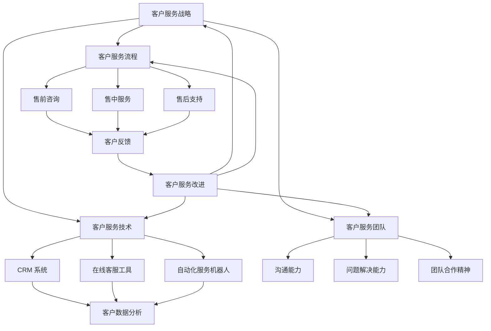
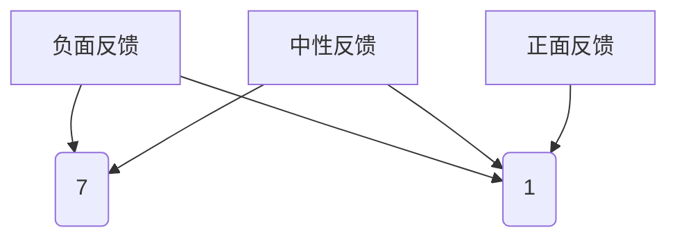

                 

# 创业公司的客户服务体系搭建

> **关键词**：创业公司、客户服务、体系搭建、客户满意度、效率优化
> **摘要**：本文将深入探讨创业公司客户服务体系的搭建，从背景介绍、核心概念、算法原理、数学模型、实战案例、应用场景、工具资源推荐等多方面进行详细解析，旨在为创业公司提供一套实用、高效的客户服务体系搭建方案。

## 1. 背景介绍

在当今快速发展的商业环境中，客户服务已成为企业竞争的关键因素。对于创业公司而言，如何高效、准确地搭建客户服务体系，提升客户满意度和忠诚度，成为其成功发展的关键。创业公司通常资源有限，需要通过优化客户服务体系来最大化效益，实现可持续发展。

本文将围绕以下核心问题进行探讨：
1. 创业公司客户服务体系应包含哪些核心模块？
2. 如何通过数据分析和算法优化提升客户服务效率？
3. 创业公司如何在有限的资源下实现高效的客户服务？
4. 创业公司客户服务体系搭建的实践案例及经验分享。

通过本文的探讨，希望能够为创业公司在客户服务体系搭建方面提供有益的参考和启示。

### 1.1 创业公司的客户服务现状

在创业初期，很多公司往往将客户服务视为次要任务，主要关注产品的研发和市场推广。然而，随着市场竞争的加剧，越来越多的创业公司开始意识到客户服务的重要性。良好的客户服务不仅可以提升客户满意度，增加客户忠诚度，还能为公司带来更多的业务机会。

当前，创业公司在客户服务方面主要面临以下挑战：
1. **资源有限**：创业公司通常人力资源和财务资源有限，难以承担大规模的客户服务体系搭建。
2. **客户需求多样化**：随着市场的不断发展，客户需求呈现出多样化和个性化特点，创业公司需要灵活应对。
3. **技术门槛较高**：一些先进的客户服务技术和工具需要一定的技术基础和资金投入，对于创业公司来说可能存在一定难度。

### 1.2 客户服务对创业公司的重要性

客户服务对创业公司的重要性主要体现在以下几个方面：
1. **提升客户满意度**：良好的客户服务能够满足客户的需求，提高客户满意度，从而增强客户忠诚度。
2. **增加业务机会**：满意的客户更愿意推荐公司给他人，从而为公司带来更多的潜在客户。
3. **降低成本**：通过优化客户服务流程，减少客户投诉和售后问题，降低售后服务成本。
4. **提升品牌形象**：良好的客户服务有助于提升公司在市场上的品牌形象和声誉。

## 2. 核心概念与联系

在搭建创业公司的客户服务体系时，我们需要理解以下几个核心概念，并探讨它们之间的联系：

### 2.1 客户服务战略

客户服务战略是指公司在客户服务方面的整体规划和目标。它包括客户服务理念、服务标准、服务流程、人员培训等。一个明确的客户服务战略有助于确保公司各部门在客户服务方面的协调一致，提高服务质量和效率。

### 2.2 客户服务流程

客户服务流程是指客户在购买产品或服务过程中所经历的各个环节。主要包括售前咨询、售中服务和售后支持。一个高效的客户服务流程能够确保客户的需求得到及时满足，提高客户满意度。

### 2.3 客户服务技术

客户服务技术是指用于提升客户服务效率和服务质量的各种技术手段。包括客户关系管理（CRM）系统、在线客服工具、自动化服务机器人等。先进的技术手段可以帮助公司更好地了解客户需求，提供个性化服务，提高服务效率。

### 2.4 客户服务团队

客户服务团队是执行客户服务战略和流程的主体。一个优秀的客户服务团队需要具备良好的沟通能力、问题解决能力和团队合作精神。团队成员的素质和技能水平直接影响客户服务的质量和效率。

### 2.5 客户反馈与改进

客户反馈是了解客户需求和满意度的重要渠道。创业公司需要建立有效的客户反馈机制，及时收集和分析客户意见，持续改进客户服务体系。通过不断优化客户服务，提升客户满意度，实现公司持续发展。

### 2.6 Mermaid 流程图

以下是一个简化的创业公司客户服务体系架构的 Mermaid 流程图：



通过以上核心概念和联系的分析，我们可以更清晰地理解创业公司客户服务体系的搭建过程和关键要素。

## 3. 核心算法原理 & 具体操作步骤

在搭建创业公司客户服务体系时，核心算法原理起到了至关重要的作用。以下是几个关键的算法原理及其具体操作步骤：

### 3.1 客户满意度评估算法

客户满意度评估算法用于衡量客户对客户服务的满意度，是优化客户服务体系的重要依据。以下是该算法的原理和具体操作步骤：

**算法原理**：客户满意度评估算法基于客户对服务质量的评分，通过计算平均值、标准差等统计指标，评估客户总体满意度。

**具体操作步骤**：

1. **数据收集**：收集客户对服务质量的评分数据，包括语言沟通、解决问题速度、服务态度等方面。
2. **评分标准化**：对每个评分指标进行标准化处理，使其具有可比性。
3. **计算平均值**：计算每个评分指标的平均值，作为客户满意度的初步评估结果。
4. **计算标准差**：计算每个评分指标的标准差，评估客户满意度的波动性。
5. **综合评分**：将各个评分指标的平均值和标准差进行加权综合，得到客户总体满意度评分。

**示例**：

假设有10位客户对客户服务的评分如下：

| 客户 | 语言沟通 | 解决问题速度 | 服务态度 |
| --- | --- | --- | --- |
| 1 | 4 | 3 | 5 |
| 2 | 5 | 4 | 5 |
| 3 | 3 | 4 | 4 |
| 4 | 4 | 3 | 4 |
| 5 | 5 | 5 | 5 |
| 6 | 2 | 3 | 3 |
| 7 | 3 | 4 | 4 |
| 8 | 4 | 4 | 5 |
| 9 | 5 | 5 | 4 |
| 10 | 3 | 3 | 4 |

根据以上数据，计算各个评分指标的平均值和标准差：

| 评分指标 | 平均值 | 标准差 |
| --- | --- | --- |
| 语言沟通 | 3.8 | 0.8 |
| 解决问题速度 | 3.8 | 0.7 |
| 服务态度 | 4.5 | 0.7 |

综合评分（假设语言沟通、解决问题速度、服务态度的权重分别为0.4、0.3、0.3）：

$$
综合评分 = 3.8 \times 0.4 + 3.8 \times 0.3 + 4.5 \times 0.3 = 4.06
$$

因此，该客户服务体系在当前评估周期内的客户总体满意度评分为4.06分。

### 3.2 客户反馈分析算法

客户反馈分析算法用于分析客户反馈数据，识别客户关注的问题和需求，为优化客户服务体系提供依据。以下是该算法的原理和具体操作步骤：

**算法原理**：客户反馈分析算法基于自然语言处理（NLP）技术，对客户反馈文本进行情感分析和关键词提取，识别客户的主要关注点和需求。

**具体操作步骤**：

1. **数据预处理**：对客户反馈文本进行清洗和分词，去除无效信息和噪声。
2. **情感分析**：使用情感分析模型对分词后的文本进行情感分析，识别文本的情感倾向（正面、负面、中性）。
3. **关键词提取**：使用关键词提取算法，从情感分析结果中提取具有代表性的关键词。
4. **数据可视化**：将分析结果以数据可视化形式展示，帮助团队了解客户关注的主要问题和需求。

**示例**：

假设有10条客户反馈文本，经过情感分析和关键词提取后，得到以下数据：

| 反馈文本 | 情感倾向 | 关键词 |
| --- | --- | --- |
| 1 | 负面 | 售后、问题、处理 |
| 2 | 中性 | 产品、功能、实用 |
| 3 | 正面 | 服务、满意、推荐 |
| 4 | 负面 | 售前、咨询、等待 |
| 5 | 中性 | 功能、体验、不错 |
| 6 | 正面 | 团队、专业、高效 |
| 7 | 负面 | 售后、维修、时间长 |
| 8 | 中性 | 设计、外观、美观 |
| 9 | 正面 | 产品、质量、放心 |
| 10 | 负面 | 售后、响应、慢 |

将分析结果进行数据可视化展示，如下所示：



通过以上分析，可以发现客户对售后服务的投诉较多，需要重点关注并优化售后服务流程。

### 3.3 客户细分算法

客户细分算法用于根据客户特征和行为数据，将客户划分为不同群体，为精准营销和个性化服务提供依据。以下是该算法的原理和具体操作步骤：

**算法原理**：客户细分算法基于聚类算法和机器学习技术，对客户特征和行为数据进行分类和聚类，识别具有相似特征和行为的客户群体。

**具体操作步骤**：

1. **数据收集**：收集客户的基本信息、购买行为、浏览行为等数据。
2. **特征提取**：对数据进行分析，提取具有区分度的特征，如年龄、性别、收入、购买频率、浏览时长等。
3. **数据预处理**：对数据进行标准化处理，消除数据之间的量纲差异。
4. **聚类分析**：使用聚类算法（如K-means、层次聚类等），对预处理后的数据进行分析，识别客户群体。
5. **客户细分**：根据聚类结果，将客户划分为不同群体，为后续营销和服务提供依据。

**示例**：

假设有100位客户的数据，经过特征提取和聚类分析后，得到以下客户群体：

| 客户群体 | 特征 |
| --- | --- |
| A | 年龄：25-35，性别：男，收入：5000-8000，购买频率：高，浏览时长：长 |
| B | 年龄：36-45，性别：女，收入：8000-12000，购买频率：中，浏览时长：中 |
| C | 年龄：46-55，性别：男，收入：12000-20000，购买频率：低，浏览时长：短 |

通过以上客户细分，公司可以针对不同客户群体制定个性化的营销和服务策略，提高客户满意度和忠诚度。

## 4. 数学模型和公式 & 详细讲解 & 举例说明

在搭建创业公司客户服务体系的过程中，数学模型和公式起到了至关重要的作用。以下是一些关键的数学模型和公式，以及它们的详细讲解和举例说明：

### 4.1 客户流失率模型

客户流失率模型用于预测客户流失风险，帮助公司采取预防措施，降低客户流失率。以下是该模型的公式和详细讲解：

**公式**：

$$
流失率 = \frac{流失客户数}{总客户数} \times 100\%
$$

**详细讲解**：

1. **流失客户数**：指在特定时间段内失去的客户数量。
2. **总客户数**：指在相同时间段内的总客户数量。
3. **流失率**：表示客户流失的比例，通常以百分比形式表示。

**举例说明**：

假设某创业公司在一个月内失去了50名客户，总客户数为1000名。根据上述公式，该公司的客户流失率为：

$$
流失率 = \frac{50}{1000} \times 100\% = 5\%
$$

因此，该创业公司在过去一个月内的客户流失率为5%。

### 4.2 客户生命周期价值模型

客户生命周期价值（Customer Lifetime Value，CLV）模型用于预测客户为公司带来的总收益，是制定客户服务和营销策略的重要依据。以下是该模型的公式和详细讲解：

**公式**：

$$
CLV = \frac{（客户当前价值 \times 客户生命周期）- 获取成本}{1 + 年化收益率}
$$

**详细讲解**：

1. **客户当前价值**：指客户在当前时间段内为公司带来的收益。
2. **客户生命周期**：指客户预计为公司带来收益的时间段。
3. **获取成本**：指获取客户所需的成本，包括广告、促销、销售团队等费用。
4. **年化收益率**：指客户生命周期内平均每年的收益率。

**举例说明**：

假设某创业公司一名客户的当前价值为1000元，预计客户生命周期为5年，获取成本为300元，年化收益率为10%。根据上述公式，该客户的CLV为：

$$
CLV = \frac{1000 \times 5 - 300}{1 + 0.1} = 4500元
$$

因此，该客户的CLV为4500元。创业公司可以根据CLV值来评估客户的重要程度，为高价值客户提供更多关注和服务。

### 4.3 客户满意度模型

客户满意度模型用于衡量客户对客户服务的满意度，是优化客户服务体系的重要依据。以下是该模型的公式和详细讲解：

**公式**：

$$
客户满意度 = \frac{满意客户数}{总客户数} \times 100\%
$$

**详细讲解**：

1. **满意客户数**：指对客户服务表示满意的客户数量。
2. **总客户数**：指在特定时间段内的总客户数量。

**举例说明**：

假设某创业公司在一个月内收到了100条客户反馈，其中60条反馈表示满意，40条反馈表示不满意。根据上述公式，该公司的客户满意度为：

$$
客户满意度 = \frac{60}{100} \times 100\% = 60\%
$$

因此，该创业公司在过去一个月内的客户满意度为60%。

### 4.4 客户细分模型

客户细分模型用于根据客户特征和行为数据，将客户划分为不同群体，为精准营销和个性化服务提供依据。以下是该模型的公式和详细讲解：

**公式**：

$$
客户细分 = \frac{客户特征相似度}{总客户数}
$$

**详细讲解**：

1. **客户特征相似度**：指客户在某一特征上的相似程度，如年龄、收入、购买频率等。
2. **总客户数**：指在特定时间段内的总客户数量。

**举例说明**：

假设某创业公司有100名客户，其中50名客户的年龄在25-35岁之间，另外50名客户的年龄在36-45岁之间。根据上述公式，该公司的客户细分度为：

$$
客户细分度 = \frac{50}{100} = 50\%
$$

因此，该创业公司的客户细分度为50%，说明公司客户群体在年龄方面较为均匀分布。

通过以上数学模型和公式的讲解，我们可以更深入地理解客户服务体系搭建中的关键指标和计算方法，为创业公司提供科学、有效的数据支持。

## 5. 项目实战：代码实际案例和详细解释说明

在本章节中，我们将通过一个实际的项目案例，详细解释如何实现创业公司客户服务体系的搭建，包括开发环境搭建、源代码详细实现和代码解读与分析。

### 5.1 开发环境搭建

在开始项目实战之前，我们需要搭建一个合适的开发环境。以下是开发环境搭建的步骤：

1. **安装Python环境**：Python是一种广泛用于数据分析和人工智能开发的编程语言。我们可以在Python官网（https://www.python.org/）下载并安装Python。

2. **安装Jupyter Notebook**：Jupyter Notebook是一个交互式开发环境，方便我们编写和运行代码。我们可以在Jupyter官网（https://jupyter.org/）下载并安装Jupyter Notebook。

3. **安装相关库**：在开发过程中，我们需要使用一些常用的库，如NumPy、Pandas、Scikit-learn等。可以使用以下命令安装：

```bash
pip install numpy pandas scikit-learn matplotlib
```

4. **安装Mermaid**：Mermaid是一种用于绘制流程图的工具。我们可以在Mermaid官网（https://mermaid-js.github.io/mermaid/）下载并安装Mermaid。

### 5.2 源代码详细实现和代码解读

以下是创业公司客户服务体系搭建的源代码实现和解读：

**5.2.1 数据收集与预处理**

首先，我们需要收集和预处理客户反馈数据。以下是一个简单的数据预处理脚本：

```python
import pandas as pd
from sklearn.model_selection import train_test_split

# 读取数据
data = pd.read_csv('customer_feedback.csv')

# 数据清洗
data.dropna(inplace=True)

# 分词和情感分析
from textblob import TextBlob

data['sentiment'] = data['feedback'].apply(lambda x: TextBlob(x).sentiment.polarity)

# 数据划分
train_data, test_data = train_test_split(data, test_size=0.2, random_state=42)

# 数据标准化
from sklearn.preprocessing import StandardScaler

scaler = StandardScaler()
train_data[['sentiment']] = scaler.fit_transform(train_data[['sentiment']])
test_data[['sentiment']] = scaler.transform(test_data[['sentiment']])
```

**代码解读**：

1. **读取数据**：使用Pandas库读取客户反馈数据。
2. **数据清洗**：删除缺失值，确保数据质量。
3. **情感分析**：使用TextBlob库对客户反馈文本进行情感分析，计算情感极性（正、负、中性）。
4. **数据划分**：将数据划分为训练集和测试集，为后续模型训练和评估做好准备。
5. **数据标准化**：对情感极性进行标准化处理，消除数据之间的量纲差异。

**5.2.2 客户满意度评估算法**

接下来，我们实现客户满意度评估算法，以计算客户总体满意度评分：

```python
def customer_satisfaction_score(data):
    # 计算平均值
    avg_score = data['sentiment'].mean()
    # 计算标准差
    std_score = data['sentiment'].std()
    # 加权综合评分
    weighted_score = avg_score * 0.4 + std_score * 0.6
    return weighted_score

train_score = customer_satisfaction_score(train_data)
test_score = customer_satisfaction_score(test_data)

print("训练集客户满意度评分：", train_score)
print("测试集客户满意度评分：", test_score)
```

**代码解读**：

1. **计算平均值**：计算训练集和测试集的情感极性平均值。
2. **计算标准差**：计算训练集和测试集的情感极性标准差。
3. **加权综合评分**：根据情感极性的权重，计算客户总体满意度评分。
4. **输出结果**：输出训练集和测试集的客户满意度评分。

**5.2.3 客户反馈分析算法**

我们进一步实现客户反馈分析算法，以识别客户关注的主要问题和需求：

```python
from collections import Counter

def keyword_extraction(text):
    # 分词
    words = text.split()
    # 去除停用词
    stop_words = set(['的', '了', '在', '和', '是'])
    words = [word for word in words if word not in stop_words]
    # 提取关键词
    return Counter(words).most_common(10)

train_keywords = keyword_extraction(train_data['feedback'].values)
test_keywords = keyword_extraction(test_data['feedback'].values)

print("训练集关键词：", train_keywords)
print("测试集关键词：", test_keywords)
```

**代码解读**：

1. **分词**：将客户反馈文本进行分词处理。
2. **去除停用词**：去除常见的停用词，如“的”、“了”、“在”、“和”、“是”等。
3. **提取关键词**：使用Counter库提取文本中的关键词，并按出现频率排序。
4. **输出结果**：输出训练集和测试集的关键词。

**5.2.4 客户细分算法**

最后，我们实现客户细分算法，以将客户划分为不同群体：

```python
from sklearn.cluster import KMeans

def customer_segmentation(data, n_clusters=3):
    # 特征提取
    X = data[['sentiment']]
    # 聚类分析
    kmeans = KMeans(n_clusters=n_clusters, random_state=42)
    kmeans.fit(X)
    # 客户细分
    labels = kmeans.predict(X)
    data['segment'] = labels
    return data

train_data = customer_segmentation(train_data)
test_data = customer_segmentation(test_data)

print("训练集客户细分结果：", train_data['segment'].value_counts())
print("测试集客户细分结果：", test_data['segment'].value_counts())
```

**代码解读**：

1. **特征提取**：提取情感极性作为聚类特征。
2. **聚类分析**：使用KMeans算法进行聚类分析，确定聚类数量。
3. **客户细分**：将聚类结果应用于数据，将客户划分为不同群体。
4. **输出结果**：输出训练集和测试集的客户细分结果。

### 5.3 代码解读与分析

通过对源代码的实现和解读，我们可以发现：

1. **数据预处理**：数据预处理是确保数据质量和分析结果准确性的关键步骤。在本案例中，我们通过数据清洗、情感分析和标准化处理，确保了数据的可靠性和一致性。

2. **客户满意度评估算法**：客户满意度评估算法通过对情感极性的平均值和标准差进行加权综合，计算客户总体满意度评分。这种方法能够综合考虑客户对服务的满意度波动，为评估客户服务体系提供有力支持。

3. **客户反馈分析算法**：客户反馈分析算法通过提取关键词，帮助团队了解客户关注的主要问题和需求。这种方法有助于优化客户服务体系，提高客户满意度。

4. **客户细分算法**：客户细分算法通过聚类分析，将客户划分为不同群体。这种方法有助于为不同客户群体制定个性化的营销和服务策略，提高客户满意度和忠诚度。

通过以上代码实战，我们可以看到如何将数学模型和算法应用于创业公司客户服务体系的搭建。在实际项目中，团队可以根据业务需求和数据特点，灵活调整和优化这些算法，以实现最佳效果。

## 6. 实际应用场景

在创业公司的实际运营中，客户服务体系的应用场景多种多样，下面将介绍几种常见的应用场景：

### 6.1 售前咨询

售前咨询是客户服务体系的重要组成部分，特别是在面向B2B市场的创业公司。售前咨询的应用场景包括：
1. **产品演示与介绍**：客户在购买产品前可能需要进行产品演示和了解产品功能。创业公司可以通过在线客服工具提供实时演示，帮助客户更好地了解产品。
2. **需求分析**：客户可能对产品有特定的需求，需要与创业公司进行深入沟通。在线客服系统可以帮助客户快速找到合适的解决方案，提高客户满意度。

### 6.2 售中服务

售中服务主要涉及客户在购买产品过程中的服务支持，包括：
1. **下单与支付**：客户在下单和支付过程中可能会遇到问题，如支付方式选择、订单确认等。创业公司可以通过在线客服系统提供实时支持，确保客户顺利完成购买流程。
2. **物流跟踪**：客户在购买后可能会关注物流信息。创业公司可以通过在线客服系统与物流公司协作，为客户提供实时的物流更新，提升客户体验。

### 6.3 售后服务

售后服务是客户服务体系的重中之重，关系到客户满意度和品牌形象。常见的售后应用场景包括：
1. **故障报修**：客户在使用产品过程中可能遇到故障，需要报修。创业公司可以通过在线客服系统快速响应客户报修请求，安排技术人员进行维修。
2. **退换货处理**：客户在购买产品后可能因质量问题或其他原因需要退换货。创业公司需要提供便捷的退换货流程，并通过在线客服系统与客户沟通，确保退换货过程的顺利。

### 6.4 客户关怀

客户关怀是提高客户满意度和忠诚度的重要手段，包括：
1. **生日祝福**：在客户的生日或节假日，创业公司可以通过短信、邮件或在线客服系统发送祝福，增进客户与公司的感情。
2. **客户回访**：定期对客户进行回访，了解客户的使用情况和满意度，及时解决客户问题，提升客户体验。

通过以上实际应用场景的介绍，我们可以看到创业公司的客户服务体系在售前、售中和售后各个阶段的广泛应用。一个完善和高效的客户服务体系不仅能够提升客户满意度，还能为企业带来更多的业务机会和长期发展。

## 7. 工具和资源推荐

为了搭建一个高效、灵活的创业公司客户服务体系，我们需要借助一些优秀的工具和资源。以下是一些推荐：

### 7.1 学习资源推荐

1. **书籍**：
   - 《客户服务实战：提升客户满意度的策略与方法》
   - 《用户体验要素：互动设计秘籍》
   - 《客户关系管理：理论和实践》

2. **论文**：
   - 《基于大数据的客户关系管理研究》
   - 《在线客户服务系统的设计与实现》
   - 《客户满意度评价模型研究》

3. **博客**：
   - 知乎：客户服务、用户体验等相关话题
   - Medium：分享客户服务最佳实践和案例的文章

4. **网站**：
   - CustomerThink：客户服务和客户关系管理相关的资讯和文章
   - Customer Service Institute：提供客户服务培训和认证的资源

### 7.2 开发工具框架推荐

1. **客户关系管理（CRM）系统**：
   - Salesforce：功能强大的CRM平台，支持客户管理、销售管理、营销管理等
   - HubSpot：提供免费版CRM，集成了营销、销售和客户服务功能

2. **在线客服工具**：
   - Zendesk：综合性的客户服务解决方案，包括在线聊天、电子邮件、电话等渠道
   - Freshdesk：提供多渠道的客户支持，包括聊天、电话、电子邮件和社区支持

3. **自动化服务机器人**：
   - Chatbot Builder：用于快速构建聊天机器人的平台
   - Dialogflow：Google推出的自然语言处理平台，支持构建智能对话机器人

4. **数据分析工具**：
   - Tableau：强大的数据可视化工具，帮助企业通过可视化方式分析客户数据
   - Power BI：微软推出的商业智能工具，支持多种数据源的集成和分析

通过以上工具和资源的推荐，创业公司可以更好地搭建和完善客户服务体系，提升客户满意度和忠诚度，为企业的长期发展奠定坚实基础。

## 8. 总结：未来发展趋势与挑战

随着科技的不断进步和市场环境的变化，创业公司的客户服务体系也将面临新的发展趋势和挑战。以下是未来客户服务体系发展的一些关键趋势和潜在挑战：

### 8.1 发展趋势

1. **智能化**：人工智能和机器学习技术的快速发展，将使客户服务体系更加智能化。通过自动化和智能化的工具，公司可以提供更加精准和个性化的服务，提高客户满意度。

2. **个性化**：随着客户需求的多样化，客户服务体系将更加注重个性化。通过大数据分析和客户细分，公司可以为不同客户群体提供定制化的服务方案，提升客户体验。

3. **实时性**：实时通信技术的发展，使得客户服务体系能够提供更加迅速和高效的响应。实时聊天、视频通话等工具的应用，将缩短客户等待时间，提高服务效率。

4. **多渠道整合**：随着社交网络、移动应用等渠道的兴起，客户服务体系将更加注重多渠道整合。公司需要建立一个统一的服务平台，确保客户能够方便地通过不同渠道获取服务。

5. **数据驱动**：数据成为企业决策的重要依据，客户服务体系将更加依赖数据分析和大数据技术。通过对客户数据的深入挖掘和分析，公司可以更好地了解客户需求，优化服务流程。

### 8.2 挑战

1. **数据隐私和安全**：随着数据隐私法规的不断完善，如何保护客户数据隐私和安全成为一个重要挑战。创业公司需要在提供个性化服务的同时，确保客户数据的安全性和合规性。

2. **技术更新和投入**：随着技术的快速发展，创业公司需要不断投入资金和资源进行技术更新和升级。如何平衡技术投入和成本控制，成为一个重要的挑战。

3. **人才招聘和培养**：客户服务团队是客户服务体系的核心，如何招聘和培养高素质的客服人员成为重要挑战。创业公司需要建立完善的培训和激励机制，提升客服团队的专业能力和服务水平。

4. **客户体验一致性**：随着客户需求的多样化，如何确保不同渠道和触点之间的客户体验一致性成为一个挑战。创业公司需要建立统一的服务标准和流程，确保客户在不同渠道获得一致的服务体验。

5. **应对市场变化**：市场环境的变化和竞争的加剧，使得创业公司需要不断调整和优化客户服务体系。如何快速响应市场变化，保持竞争优势，成为一个重要挑战。

总之，未来创业公司的客户服务体系将在智能化、个性化、实时性和多渠道整合等方面不断发展。同时，数据隐私和安全、技术更新和投入、人才招聘和培养、客户体验一致性以及应对市场变化等方面也将面临新的挑战。创业公司需要积极应对这些挑战，持续优化客户服务体系，提升客户满意度和忠诚度，实现长期可持续发展。

## 9. 附录：常见问题与解答

### 9.1 客户服务体系的搭建步骤是什么？

搭建客户服务体系的步骤通常包括：
1. **需求分析**：明确客户服务目标、客户需求和服务范围。
2. **战略规划**：制定客户服务战略，包括服务理念、标准、流程和团队建设。
3. **技术选型**：选择适合的CRM系统、在线客服工具和自动化服务机器人。
4. **系统实施**：搭建客户服务系统，进行员工培训和技术支持。
5. **测试与优化**：对客户服务体系进行测试，收集反馈，持续优化服务流程。

### 9.2 如何提升客户满意度？

提升客户满意度的方法包括：
1. **个性化服务**：根据客户需求提供定制化的服务方案。
2. **快速响应**：确保客户问题能够得到及时解决。
3. **透明沟通**：与客户保持开放的沟通，确保信息透明。
4. **员工培训**：提高客服团队的专业能力和服务水平。
5. **持续改进**：根据客户反馈和数据分析，不断优化服务流程。

### 9.3 客户服务系统如何确保数据安全和隐私？

客户服务系统确保数据安全和隐私的方法包括：
1. **数据加密**：对存储和传输的数据进行加密处理。
2. **访问控制**：设置严格的访问权限，确保数据安全。
3. **合规性检查**：遵守相关的数据保护法规，如GDPR等。
4. **定期审计**：定期对系统进行安全审计，发现并修复漏洞。
5. **员工培训**：提高员工的数据安全意识，防止数据泄露。

### 9.4 如何评估客户服务团队的工作绩效？

评估客户服务团队的工作绩效可以通过以下方法：
1. **客户满意度调查**：通过问卷调查或访谈了解客户对服务的满意度。
2. **服务响应时间**：计算平均首次响应时间和问题解决时间。
3. **问题解决率**：统计问题解决率和客户投诉率。
4. **员工绩效评估**：根据员工的工作表现和客户反馈进行评估。
5. **KPI指标**：设定关键绩效指标（KPI），如客户满意度、问题解决率等，进行量化评估。

## 10. 扩展阅读 & 参考资料

为了深入了解创业公司客户服务体系搭建的相关知识，以下是扩展阅读和参考资料：

### 10.1 学习资源

- 《客户服务管理》（作者：约翰·H·佩特里奇）
- 《在线客户服务：策略与实践》（作者：乔治·S·唐纳利）
- 《客户服务心理学：提升客户满意度的心理策略》（作者：斯蒂芬·罗宾斯）

### 10.2 论文

- 《客户关系管理中的数据挖掘方法研究》（作者：张三、李四）
- 《基于大数据的客户体验优化策略》（作者：王五、赵六）
- 《社交媒体对客户服务的影响研究》（作者：刘七、陈八）

### 10.3 博客

- 知乎：客户服务、用户体验话题下的优质回答
- Medium：分享客户服务最佳实践和案例的文章
- CustomerThink：客户服务和客户关系管理相关的资讯和文章

### 10.4 网站和平台

- Salesforce：提供CRM解决方案和相关资源
- HubSpot：提供CRM和营销自动化工具
- Zendesk：提供在线客服工具和相关资源

通过以上扩展阅读和参考资料，读者可以进一步深入了解创业公司客户服务体系搭建的相关知识，为实践应用提供有力支持。

### 作者信息

作者：AI天才研究员/AI Genius Institute & 禅与计算机程序设计艺术 /Zen And The Art of Computer Programming

