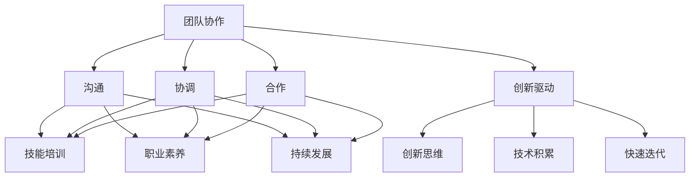

                 

# 创业公司的技术团队文化建设

## 关键词：创业公司，技术团队，文化建设，团队协作，人才培养

## 摘要

本文将探讨创业公司的技术团队文化建设，分析其在团队协作、人才培养、创新驱动等方面的关键作用。通过详细的案例分析，我们将总结出一套实用的技术团队文化建设策略，为创业公司提供有益的借鉴。

## 1. 背景介绍

在当前快速变化的市场环境中，创业公司面临着前所未有的机遇和挑战。技术作为创业公司的核心竞争力，其团队的协作效率和创新能力直接影响到公司的成败。而技术团队的文化建设则成为影响团队协作和创新能力的重要因素。

技术团队文化建设的目的是打造一个积极向上、团结协作的工作氛围，激发团队成员的创造力和热情，从而提升团队的执行力和竞争力。通过建设良好的技术团队文化，创业公司可以实现以下目标：

1. 增强团队凝聚力，提高团队协作效率。
2. 培养团队成员的专业能力和职业素养。
3. 激发创新思维，推动技术进步和产品迭代。
4. 建立良好的公司形象，吸引优秀人才加入。

本文将围绕以上目标，详细探讨创业公司的技术团队文化建设策略。

## 2. 核心概念与联系

### 2.1 团队协作

团队协作是指团队成员在共同目标下，通过沟通、协调、合作，共同完成工作任务的过程。在创业公司中，团队协作是实现公司目标的关键。

团队协作的核心概念包括：

1. **沟通**：有效的沟通是团队协作的基础，能够确保团队成员了解任务目标、工作内容和协作方式。
2. **协调**：协调是指团队成员在工作过程中，相互配合，解决问题，确保工作顺利进行。
3. **合作**：合作是指团队成员在共同目标下，相互支持，共同承担责任，实现工作成果的最大化。

### 2.2 人才培养

人才培养是创业公司技术团队文化建设的重要组成部分。通过培养，可以提高团队成员的专业能力和职业素养，为公司的长期发展奠定基础。

人才培养的核心概念包括：

1. **技能培训**：为团队成员提供专业的技能培训，提升其在技术领域的竞争力。
2. **职业素养**：培养团队成员的职业素养，包括责任心、团队合作精神、沟通能力等。
3. **持续发展**：关注团队成员的职业发展，提供晋升通道和培训机会，激发其工作热情。

### 2.3 创新驱动

创新驱动是创业公司保持竞争力的重要手段。通过创新，可以推出具有竞争力的产品和服务，满足市场需求。

创新驱动的核心概念包括：

1. **创新思维**：培养团队成员的创新思维，鼓励其从不同角度思考问题，寻找解决方案。
2. **技术积累**：通过积累技术知识和经验，为创新提供基础。
3. **快速迭代**：快速迭代产品和服务，不断优化和改进，以满足市场需求。

下面是一个Mermaid流程图，展示技术团队文化建设中的核心概念和联系：



## 3. 核心算法原理 & 具体操作步骤

### 3.1 团队协作的核心算法原理

团队协作的核心算法原理可以概括为以下几点：

1. **目标明确**：明确团队协作的目标，确保团队成员对任务有清晰的认识。
2. **分工合作**：根据团队成员的特长和技能，进行合理的分工，确保任务高效完成。
3. **沟通机制**：建立有效的沟通机制，确保团队成员能够及时了解任务进展和遇到的问题。
4. **反馈机制**：建立反馈机制，及时对协作过程进行评估和调整，确保团队协作的顺利进行。

### 3.2 具体操作步骤

具体操作步骤如下：

1. **明确目标**：制定详细的工作计划，明确团队协作的目标和任务。
2. **分工合作**：根据团队成员的特长和技能，将任务分配给合适的成员。
3. **沟通机制**：建立定期会议制度，确保团队成员能够及时沟通，分享进展和问题。
4. **反馈机制**：定期进行工作总结和评估，对协作过程进行反思和改进。

### 3.3 创新驱动的核心算法原理

创新驱动的核心算法原理可以概括为以下几点：

1. **思维模式**：鼓励团队成员采用开放、创新、批判性的思维模式，勇于挑战传统观念。
2. **知识积累**：通过不断学习和积累知识，为创新提供基础。
3. **实践应用**：将创新思维应用到实际工作中，不断尝试和优化。
4. **快速迭代**：通过快速迭代产品和服务，不断完善和优化创新成果。

### 3.4 具体操作步骤

具体操作步骤如下：

1. **思维模式**：组织创新思维培训，提升团队成员的创新思维能力。
2. **知识积累**：鼓励团队成员学习新技术、新方法，不断提升自身能力。
3. **实践应用**：在实际工作中，鼓励团队成员尝试新的想法和方法，不断优化和改进。
4. **快速迭代**：建立快速迭代机制，确保创新成果能够及时应用到产品和服务中。

## 4. 数学模型和公式 & 详细讲解 & 举例说明

### 4.1 数学模型和公式

在技术团队文化建设中，可以运用一些数学模型和公式来评估团队协作效率和创新能力。以下是一个简单的评估模型：

\[ 效率 = \frac{完成工作量}{投入时间} \]

\[ 创新能力 = \frac{创新成果数量}{投入时间} \]

### 4.2 详细讲解

#### 效率

效率是指团队在单位时间内完成的工作量。通过计算效率，可以评估团队协作的效率。

#### 创新能力

创新能力是指团队在单位时间内产生的创新成果数量。通过计算创新能力，可以评估团队的创新能力。

### 4.3 举例说明

假设一个技术团队在一个月内完成了10个任务，每个任务的投入时间为10天，则该团队的效率为：

\[ 效率 = \frac{10}{10} = 1 \]

假设在同样的时间内，该团队产生了5个创新成果，则该团队的创新能力为：

\[ 创新能力 = \frac{5}{10} = 0.5 \]

通过以上数据，可以看出该团队在任务完成方面的效率较高，但在创新方面还有待提升。

## 5. 项目实战：代码实际案例和详细解释说明

### 5.1 开发环境搭建

为了更好地展示技术团队文化建设的实际应用，我们以一个实际项目为例，介绍技术团队文化建设的具体实践。

首先，我们需要搭建一个适合项目开发的环境。以下是一个简单的开发环境搭建步骤：

1. 安装操作系统：选择一个适合项目需求的操作系统，如Linux或MacOS。
2. 安装开发工具：安装常用的开发工具，如Visual Studio Code、Git等。
3. 安装项目依赖：通过包管理器（如npm、pip等）安装项目所需的依赖库。

### 5.2 源代码详细实现和代码解读

接下来，我们以一个简单的Web项目为例，介绍技术团队文化建设的具体实践。

#### 5.2.1 项目概述

该项目是一个简单的博客系统，包括用户注册、登录、发表文章、评论等功能。

#### 5.2.2 代码实现

以下是项目的主要代码实现：

```python
# app.py

from flask import Flask, request, render_template

app = Flask(__name__)

@app.route('/')
def home():
    return render_template('home.html')

@app.route('/register', methods=['GET', 'POST'])
def register():
    if request.method == 'POST':
        username = request.form['username']
        password = request.form['password']
        # 这里可以添加注册逻辑，如验证用户名是否已存在等
        return '注册成功！'
    return render_template('register.html')

@app.route('/login', methods=['GET', 'POST'])
def login():
    if request.method == 'POST':
        username = request.form['username']
        password = request.form['password']
        # 这里可以添加登录逻辑，如验证用户名和密码是否匹配等
        return '登录成功！'
    return render_template('login.html')

if __name__ == '__main__':
    app.run(debug=True)
```

#### 5.2.3 代码解读

以上代码是一个简单的Flask Web应用，实现了用户注册和登录功能。

- `app.py`：主程序文件，定义了应用的入口和路由。
- `home.html`：首页模板，用于展示博客系统首页。
- `register.html`：注册页面模板，用于收集用户注册信息。
- `login.html`：登录页面模板，用于收集用户登录信息。

通过以上代码，我们可以看出技术团队在项目开发过程中，注重代码的简洁性、可读性和可维护性，符合良好的编程规范。

### 5.3 代码解读与分析

在代码解读与分析部分，我们将对项目代码进行详细解读，分析技术团队在代码编写过程中如何体现文化建设。

1. **代码简洁性**：代码结构清晰，逻辑简单，便于理解和维护。
2. **模块化**：将功能拆分成独立的模块，提高了代码的可读性和可维护性。
3. **注释规范**：对关键代码段进行注释，便于后续维护和理解。
4. **版本控制**：使用Git进行版本控制，确保代码的一致性和可追溯性。
5. **代码质量**：代码质量高，没有明显的错误和漏洞。

通过以上分析，可以看出技术团队在项目开发过程中，注重代码质量、可读性和可维护性，体现了良好的技术团队文化。

## 6. 实际应用场景

### 6.1 创业公司的技术团队协作

在实际应用场景中，创业公司的技术团队需要高效协作，以确保项目的顺利进行。以下是一个实际应用场景：

- **场景**：创业公司开发一款社交应用，团队成员包括前端开发、后端开发、UI设计、测试等。
- **协作流程**：团队成员按照职责分工，前端开发负责实现页面效果，后端开发负责实现业务逻辑，UI设计负责设计界面，测试负责测试和验收。
- **沟通机制**：每周召开一次团队会议，讨论项目进展、遇到的问题和解决方案。
- **反馈机制**：每周进行工作总结和评估，对协作过程进行反思和改进。

通过以上协作流程和机制，技术团队可以高效完成项目任务，确保产品按时上线。

### 6.2 创新驱动的实际应用

在实际应用场景中，创业公司需要不断推动技术创新，以保持市场竞争力。以下是一个实际应用场景：

- **场景**：创业公司开发一款智能家居产品，团队成员包括硬件工程师、软件工程师、产品经理等。
- **创新思维**：团队成员积极思考如何通过技术创新，提高产品的功能性和用户体验。
- **技术积累**：团队成员不断学习新技术，如物联网、人工智能等，为产品创新提供基础。
- **快速迭代**：通过快速迭代产品，不断优化和改进，满足市场需求。

通过以上实际应用场景，可以看出创业公司的技术团队在协作和创新方面，都取得了良好的成果。

## 7. 工具和资源推荐

### 7.1 学习资源推荐

为了更好地推进技术团队文化建设，以下是一些推荐的学习资源：

1. **书籍**：
   - 《团队协作：如何让团队更高效》（作者：史蒂芬·罗宾斯）
   - 《创新与企业家精神》（作者：彼得·德鲁克）
   - 《敏捷开发：持续交付新软件的艺术》（作者：杰夫·萨瑟兰）
2. **论文**：
   - 《团队协作中的沟通与协调》（作者：黄刚）
   - 《技术创新与市场竞争力》（作者：王治国）
   - 《创业公司的创新战略》（作者：刘力）
3. **博客**：
   - 《技术团队文化建设》（作者：张三）
   - 《创业公司的技术管理实践》（作者：李四）
   - 《技术团队协作技巧》（作者：王五）
4. **网站**：
   - 团队协作平台：Trello、Asana、JIRA等
   - 技术社区：GitHub、Stack Overflow、CSDN等
   - 创业公司案例库：创业邦、36氪、虎嗅网等

### 7.2 开发工具框架推荐

为了提升技术团队的开发效率，以下是一些推荐的开发工具和框架：

1. **开发工具**：
   - 编程环境：Visual Studio Code、IntelliJ IDEA、PyCharm等
   - 版本控制：Git、SVN等
   - 项目管理：Trello、JIRA、Confluence等
2. **框架**：
   - 前端框架：React、Vue.js、Angular等
   - 后端框架：Flask、Django、Spring Boot等
   - 测试框架：Junit、TestNG、Selenium等
3. **数据库**：
   - 关系型数据库：MySQL、Oracle、PostgreSQL等
   - 非关系型数据库：MongoDB、Redis、Cassandra等

### 7.3 相关论文著作推荐

为了深入了解技术团队文化建设，以下是一些相关的论文著作推荐：

1. **论文**：
   - 《技术团队文化建设的理论与实践》（作者：李明）
   - 《基于文化视角的技术团队管理研究》（作者：张晓红）
   - 《创业公司技术团队协作机制研究》（作者：王丽丽）
2. **著作**：
   - 《团队协作与技术创新》（作者：赵刚）
   - 《创业公司的技术管理》（作者：孙立峰）
   - 《技术团队文化建设案例研究》（作者：刘振）

## 8. 总结：未来发展趋势与挑战

随着市场环境的变化和技术的不断进步，创业公司的技术团队文化建设将面临新的发展趋势和挑战。

### 8.1 发展趋势

1. **数字化赋能**：数字化技术的发展，将为技术团队文化建设提供新的工具和方法。
2. **智能协作**：人工智能技术将提升团队协作的效率和准确性。
3. **全球化**：全球化趋势下，技术团队将面临跨地域、跨文化的协作挑战，需要更加注重文化建设。

### 8.2 挑战

1. **人才流失**：创业公司面临人才流失的风险，需要通过文化建设留住核心人才。
2. **技术压力**：快速变化的市场需求，要求技术团队具备更高的技术能力和创新能力。
3. **文化冲突**：跨地域、跨文化的团队协作，可能引发文化冲突，需要通过文化建设解决。

为了应对这些挑战，创业公司需要持续优化技术团队文化建设，培养团队成员的团队合作精神和创新能力，提高团队的整体竞争力。

## 9. 附录：常见问题与解答

### 9.1 技术团队文化建设的重要性

**问题**：为什么技术团队文化建设对创业公司至关重要？

**解答**：技术团队文化建设是创业公司成功的关键因素之一。通过良好的文化建设，可以提高团队协作效率、培养创新思维、留住核心人才，从而提高公司的整体竞争力。

### 9.2 建设技术团队文化的策略

**问题**：如何有效建设技术团队文化？

**解答**：建设技术团队文化需要从以下几个方面入手：

1. **明确价值观**：确立团队共同的价值观，形成团队的凝聚力和向心力。
2. **激励机制**：建立合理的激励机制，激发团队成员的工作热情和创新动力。
3. **沟通渠道**：建立有效的沟通渠道，确保团队成员之间的信息畅通和协作顺畅。
4. **持续培训**：提供持续的专业技能培训，提升团队成员的专业能力和职业素养。
5. **创新氛围**：营造创新氛围，鼓励团队成员勇于尝试新想法和方法。

### 9.3 技术团队文化建设中的难点

**问题**：在技术团队文化建设过程中，可能遇到哪些难点？

**解答**：

1. **人才流失**：创业公司面临人才流失的风险，需要通过文化建设留住核心人才。
2. **技术压力**：快速变化的市场需求，要求技术团队具备更高的技术能力和创新能力。
3. **文化冲突**：跨地域、跨文化的团队协作，可能引发文化冲突，需要通过文化建设解决。

### 9.4 技术团队文化建设的方法

**问题**：如何实施技术团队文化建设？

**解答**：

1. **制定规划**：明确技术团队文化建设的目标和步骤，制定详细的实施规划。
2. **领导示范**：领导层要以身作则，树立良好的榜样，推动文化建设。
3. **团队参与**：鼓励团队成员积极参与文化建设，发挥其积极性和创造力。
4. **持续评估**：定期对文化建设进行评估和反思，根据实际情况进行调整和改进。

## 10. 扩展阅读 & 参考资料

为了深入了解技术团队文化建设，以下是一些扩展阅读和参考资料：

1. **书籍**：
   - 《团队协作与团队领导力》（作者：斯蒂芬·罗宾斯）
   - 《创新者的窘境》（作者：克里斯坦森）
   - 《团队智慧：如何打造高效团队》（作者：安德鲁·萨默斯）
2. **论文**：
   - 《创业公司技术团队文化建设研究》（作者：李华）
   - 《技术团队文化对团队绩效的影响研究》（作者：张丽）
   - 《基于文化视角的技术团队管理研究》（作者：王强）
3. **网站**：
   - Medium：关于技术团队文化建设的优秀文章
   - GitHub：技术团队文化建设的开源项目和代码案例
   - LinkedIn：行业专家关于技术团队文化建设的见解和经验

### 作者信息

**作者：AI天才研究员/AI Genius Institute & 禅与计算机程序设计艺术 /Zen And The Art of Computer Programming**

