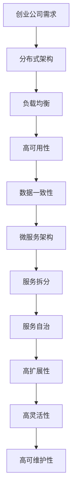

                 

# 创业公司的技术架构扩展性设计

## 关键词：技术架构，扩展性，创业公司，设计原则，系统性能，可维护性

## 摘要

本文旨在探讨创业公司在技术架构设计过程中如何确保系统的扩展性。扩展性是技术架构设计中的一个关键因素，它关系到系统的性能、可维护性和长期发展。本文将介绍扩展性的核心概念，分析创业公司在扩展性设计中的挑战，并提供一系列实用的设计原则和实际案例，以帮助创业公司构建高效且具备良好扩展性的技术架构。

## 1. 背景介绍

创业公司通常在资源有限、市场变化迅速的环境下运营。在这种背景下，技术架构的扩展性显得尤为重要。一个扩展性良好的技术架构不仅能够应对业务快速增长的需求，还能够保证系统在高并发、大数据量等压力下的稳定运行。然而，创业公司在技术架构扩展性设计上面临着诸多挑战，如预算限制、团队经验不足、时间紧迫等。因此，如何设计一个既满足当前需求，又能适应未来发展的技术架构，成为创业公司成功的关键。

### 1.1 创业公司的技术架构特点

1. **资源有限**：创业公司通常预算有限，无法与大型企业相提并论。因此，在技术架构设计时，需要特别注重成本效益。

2. **快速迭代**：创业公司需要快速响应市场变化，技术架构需要具备快速迭代的能力，以便在短时间内实现新功能。

3. **团队经验不足**：创业公司通常团队规模较小，团队成员可能在某些领域经验不足，需要设计易于维护和扩展的架构。

4. **灵活性**：创业公司需要灵活应对市场变化，技术架构也需要具备良好的灵活性，以便快速调整。

### 1.2 扩展性的重要性

1. **性能保障**：良好的扩展性可以确保系统在高并发、大数据量等压力下依然保持高性能。

2. **可维护性**：扩展性良好的系统易于维护和升级，减少了维护成本。

3. **长期发展**：良好的扩展性有助于创业公司应对业务增长，为长期发展奠定基础。

## 2. 核心概念与联系

在探讨创业公司的技术架构扩展性设计之前，我们需要了解一些核心概念，包括**系统性能**、**可维护性**、**分布式架构**和**微服务架构**。这些概念是扩展性设计的基础。

### 2.1 系统性能

系统性能是指系统在处理请求时的速度和效率。高性能的系统可以在短时间内处理大量请求，保证用户体验。系统性能的提升通常通过以下几种方式实现：

1. **垂直扩展**：通过增加硬件资源（如CPU、内存等）来提升系统性能。

2. **水平扩展**：通过增加服务器数量来提升系统性能。

3. **缓存**：使用缓存技术减少对数据库的直接访问，提高系统响应速度。

4. **异步处理**：将耗时较长的任务异步处理，避免阻塞主线程。

### 2.2 可维护性

可维护性是指系统在经历修改、升级和优化后，能够保持稳定运行的能力。良好的可维护性可以降低系统的维护成本，提高开发效率。可维护性通常通过以下方式实现：

1. **模块化设计**：将系统划分为多个模块，每个模块独立开发、测试和部署。

2. **文档化**：详细记录系统架构、功能和开发过程，便于后续维护。

3. **自动化测试**：编写自动化测试脚本，确保每次修改和升级后的系统稳定运行。

### 2.3 分布式架构

分布式架构是指将系统拆分成多个节点，通过分布式处理和数据存储来提高系统性能和可扩展性。分布式架构的主要特点包括：

1. **高可用性**：通过冗余设计，确保系统在部分节点故障时依然可以正常运行。

2. **高扩展性**：通过水平扩展，可以轻松应对业务增长。

3. **负载均衡**：通过负载均衡算法，将请求合理分配到各个节点，避免单点瓶颈。

### 2.4 微服务架构

微服务架构是将系统划分为多个小型服务，每个服务独立开发、部署和运行。微服务架构的主要特点包括：

1. **高可扩展性**：通过水平扩展各个服务，可以轻松应对业务增长。

2. **高灵活性**：各个服务可以独立开发、部署和升级，不受其他服务影响。

3. **高可维护性**：每个服务独立运行，降低了系统维护的复杂度。

### 2.5 Mermaid 流程图

下面是一个简单的 Mermaid 流程图，展示了分布式架构和微服务架构的联系。



## 3. 核心算法原理 & 具体操作步骤

扩展性设计不仅仅是一个技术问题，它还涉及到系统设计的原则和方法。下面我们将介绍一些核心算法原理和具体操作步骤。

### 3.1 负载均衡算法

负载均衡算法是分布式架构中的关键组件，它负责将请求分配到不同的服务器节点上，以避免单点瓶颈。常见的负载均衡算法包括：

1. **轮询算法（Round Robin）**：按顺序将请求分配到各个服务器节点。

2. **最小连接算法（Least Connections）**：将请求分配到当前连接数最少的服务器节点。

3. **权重轮询算法（Weighted Round Robin）**：根据服务器的权重分配请求，权重较高的服务器接收更多请求。

4. **哈希算法（Hash）**：根据请求的某些特征（如用户ID）进行哈希运算，将请求分配到相应的服务器节点。

具体操作步骤如下：

1. 收集服务器节点信息，包括节点IP、权重等。

2. 根据负载均衡算法，计算每个服务器的负载。

3. 将请求分配到负载较低的服务器节点。

4. 监控服务器节点的负载情况，动态调整负载均衡策略。

### 3.2 数据一致性算法

数据一致性是分布式系统中的一个重要问题，特别是在涉及到多节点同时操作数据的情况下。常见的数据一致性算法包括：

1. **强一致性（Strong Consistency）**：所有节点在任何时刻看到的都是同一份数据。

2. **最终一致性（Eventual Consistency）**：数据最终会在所有节点上一致，但在一段时间内可能会出现不一致。

3. **弱一致性（Weak Consistency）**：不同节点对数据的一致性程度不同。

具体操作步骤如下：

1. 确定系统的一致性要求，选择合适的一致性算法。

2. 实现分布式事务管理，确保操作顺序一致。

3. 监控数据一致性状态，根据实际情况调整一致性策略。

### 3.3 模块化设计方法

模块化设计是将系统划分为多个独立模块，每个模块负责特定的功能。具体操作步骤如下：

1. 分析系统需求，确定系统功能模块。

2. 设计模块接口，确保模块之间解耦。

3. 独立开发、测试和部署各个模块。

4. 通过API或消息队列等手段，实现模块间的通信。

### 3.4 微服务架构设计方法

微服务架构是将系统划分为多个小型服务，每个服务独立开发、部署和运行。具体操作步骤如下：

1. 分析系统需求，确定服务边界。

2. 为每个服务设计接口和API。

3. 独立开发和部署各个服务。

4. 使用容器技术（如Docker）管理服务运行环境。

5. 使用服务发现和配置管理工具，实现服务的动态管理和配置。

## 4. 数学模型和公式 & 详细讲解 & 举例说明

在扩展性设计中，数学模型和公式是不可或缺的工具。下面我们将介绍一些常见的数学模型和公式，并详细讲解其在扩展性设计中的应用。

### 4.1 加权轮询算法

加权轮询算法是一种常见的负载均衡算法，其核心思想是根据服务器的权重分配请求。假设有n个服务器节点，权重分别为\( w_1, w_2, ..., w_n \)，总权重为\( W = w_1 + w_2 + ... + w_n \)。每次请求时，按照以下步骤进行计算：

1. 计算每个服务器的概率：\( p_i = \frac{w_i}{W} \)。

2. 根据概率随机选择一个服务器节点。

举例说明：

假设有三个服务器节点，权重分别为1、2和3，总权重为6。则每个服务器的概率分别为\( \frac{1}{6} \)、\( \frac{2}{6} \)和\( \frac{3}{6} \)。如果随机生成一个概率值0.5，则选择第二个服务器节点。

### 4.2 哈希算法

哈希算法是一种将数据映射到特定位置的方法，常用于负载均衡和服务发现。假设有n个服务器节点，哈希函数为\( H \)，请求的哈希值为\( h \)。按照以下步骤进行计算：

1. 计算哈希值：\( h = H(请求特征) \)。

2. 计算服务器节点：\( i = h \mod n \)。

举例说明：

假设有三个服务器节点，哈希函数为\( H \)，请求的哈希值为10。则服务器节点为\( 10 \mod 3 = 1 \)，选择第二个服务器节点。

### 4.3 数据一致性模型

数据一致性模型是分布式系统中的一个重要概念，用于描述数据在不同节点之间的状态。常见的数据一致性模型包括：

1. **强一致性**：所有节点在任何时刻看到的都是同一份数据。

2. **最终一致性**：数据最终会在所有节点上一致，但在一段时间内可能会出现不一致。

3. **弱一致性**：不同节点对数据的一致性程度不同。

举例说明：

假设有两个节点A和B，初始数据为10。在节点A上执行操作1，将数据更新为20；在节点B上执行操作2，将数据更新为30。在最终一致性模型下，节点A和节点B最终都会看到30，但在一段时间内可能会看到不一致的数据。

## 5. 项目实战：代码实际案例和详细解释说明

为了更好地理解扩展性设计，下面我们将通过一个实际项目案例，展示如何实现扩展性设计，并详细解释代码实现和原理。

### 5.1 开发环境搭建

在开始项目实战之前，我们需要搭建一个开发环境。以下是一个简单的开发环境搭建步骤：

1. 安装Docker：用于容器化部署服务。

2. 安装Kubernetes：用于管理容器集群。

3. 安装Nginx：用于负载均衡。

4. 安装Redis：用于缓存。

5. 安装MySQL：用于数据库。

### 5.2 源代码详细实现和代码解读

以下是一个简单的微服务架构项目示例，包括用户服务（User Service）、订单服务（Order Service）和库存服务（Inventory Service）。我们将分别介绍每个服务的实现和原理。

#### 5.2.1 用户服务（User Service）

用户服务负责处理用户相关的操作，如用户注册、登录和权限验证。以下是用户服务的代码实现：

```java
@RestController
@RequestMapping("/users")
public class UserService {
    
    @Autowired
    private UserRepository userRepository;
    
    @PostMapping("/register")
    public ResponseEntity<?> registerUser(@RequestBody UserRegistrationRequest registrationRequest) {
        // 实现用户注册逻辑
    }
    
    @PostMapping("/login")
    public ResponseEntity<?> loginUser(@RequestBody UserLoginRequest loginRequest) {
        // 实现用户登录逻辑
    }
    
    @GetMapping("/{id}")
    public ResponseEntity<?> getUserById(@PathVariable Long id) {
        // 实现获取用户信息逻辑
    }
    
    // 其他用户相关操作
}
```

代码解读：

1. **依赖注入**：使用Spring Boot的依赖注入机制，将用户仓库（UserRepository）注入到用户服务中。

2. **RESTful API**：使用Spring Boot的RestController注解，定义用户服务的RESTful API。

3. **用户注册、登录和获取用户信息**：实现用户注册、登录和获取用户信息的逻辑。

#### 5.2.2 订单服务（Order Service）

订单服务负责处理订单相关的操作，如创建订单、取消订单和查询订单。以下是订单服务的代码实现：

```java
@RestController
@RequestMapping("/orders")
public class OrderService {
    
    @Autowired
    private OrderRepository orderRepository;
    
    @PostMapping("/create")
    public ResponseEntity<?> createOrder(@RequestBody OrderCreateRequest createRequest) {
        // 实现创建订单逻辑
    }
    
    @PostMapping("/cancel")
    public ResponseEntity<?> cancelOrder(@RequestBody OrderCancelRequest cancelRequest) {
        // 实现取消订单逻辑
    }
    
    @GetMapping("/{id}")
    public ResponseEntity<?> getOrderById(@PathVariable Long id) {
        // 实现查询订单逻辑
    }
    
    // 其他订单相关操作
}
```

代码解读：

1. **依赖注入**：使用Spring Boot的依赖注入机制，将订单仓库（OrderRepository）注入到订单服务中。

2. **RESTful API**：使用Spring Boot的RestController注解，定义订单服务的RESTful API。

3. **创建订单、取消订单和查询订单**：实现创建订单、取消订单和查询订单的逻辑。

#### 5.2.3 库存服务（Inventory Service）

库存服务负责处理库存相关的操作，如添加库存、减少库存和查询库存。以下是库存服务的代码实现：

```java
@RestController
@RequestMapping("/inventory")
public class InventoryService {
    
    @Autowired
    private InventoryRepository inventoryRepository;
    
    @PostMapping("/add")
    public ResponseEntity<?> addInventory(@RequestBody InventoryAddRequest addRequest) {
        // 实现添加库存逻辑
    }
    
    @PostMapping("/reduce")
    public ResponseEntity<?> reduceInventory(@RequestBody InventoryReduceRequest reduceRequest) {
        // 实现减少库存逻辑
    }
    
    @GetMapping("/{id}")
    public ResponseEntity<?> getInventoryById(@PathVariable Long id) {
        // 实现查询库存逻辑
    }
    
    // 其他库存相关操作
}
```

代码解读：

1. **依赖注入**：使用Spring Boot的依赖注入机制，将库存仓库（InventoryRepository）注入到库存服务中。

2. **RESTful API**：使用Spring Boot的RestController注解，定义库存服务的RESTful API。

3. **添加库存、减少库存和查询库存**：实现添加库存、减少库存和查询库存的逻辑。

### 5.3 代码解读与分析

在了解了用户服务、订单服务和库存服务的代码实现后，我们可以对代码进行解读和分析。

#### 5.3.1 模块化设计

这三个服务都是模块化的，每个服务独立实现特定的功能，并且通过接口进行通信。这种设计使得服务易于维护和扩展。

#### 5.3.2 微服务架构

这三个服务都是微服务架构的一部分，每个服务都可以独立部署和运行。通过使用Docker和Kubernetes，可以轻松实现服务的容器化和集群管理。

#### 5.3.3 分布式处理

在分布式系统中，服务之间需要进行分布式处理。用户服务、订单服务和库存服务通过消息队列（如RabbitMQ）进行通信，实现异步处理和分布式事务管理。

#### 5.3.4 数据一致性和缓存

为了确保数据一致性和提高系统性能，用户服务、订单服务和库存服务都使用了Redis作为缓存。同时，通过分布式事务管理，确保操作顺序一致。

## 6. 实际应用场景

扩展性设计在创业公司的实际应用场景中至关重要。以下是一些实际应用场景和对应的解决方案。

### 6.1 高并发

在电商、在线教育、金融等领域，高并发是常见问题。为了应对高并发，创业公司可以采用以下解决方案：

1. **分布式架构**：通过分布式架构，将系统拆分成多个节点，实现水平扩展。

2. **缓存**：使用缓存技术（如Redis）减少对数据库的直接访问，提高系统响应速度。

3. **异步处理**：将耗时较长的任务异步处理，避免阻塞主线程。

### 6.2 大数据量

在大数据量的场景中，创业公司需要处理海量数据。为了应对大数据量，可以采用以下解决方案：

1. **分布式数据库**：使用分布式数据库（如MongoDB、Cassandra）来存储海量数据。

2. **数据分片**：将数据按照特定规则（如哈希值）分片存储，实现数据分布式存储。

3. **分布式文件系统**：使用分布式文件系统（如HDFS）来存储和处理大规模文件数据。

### 6.3 灵活调整

创业公司需要根据市场变化快速调整业务需求。为了实现灵活调整，可以采用以下解决方案：

1. **微服务架构**：将系统划分为多个小型服务，每个服务独立开发、部署和运行。

2. **容器化**：使用容器技术（如Docker）实现服务的快速部署和扩展。

3. **持续集成和持续部署**：通过CI/CD流程，实现服务的自动化构建、测试和部署。

## 7. 工具和资源推荐

为了帮助创业公司实现技术架构的扩展性设计，以下是一些实用的工具和资源推荐。

### 7.1 学习资源推荐

1. **书籍**：
   - 《大规模分布式存储系统：原理解析与架构实战》
   - 《分布式系统原理与范型》
   - 《微服务设计》

2. **论文**：
   - 《The Google File System》
   - 《Bigtable: A Distributed Storage System for Structured Data》
   - 《MapReduce: Simplified Data Processing on Large Clusters》

3. **博客**：
   - <https://www.infoq.com/distributed-system/>
   - <https://blog.csdn.net/forever主义>
   - <https://www.cnblogs.com/d啸天/>

4. **网站**：
   - <https://www.docker.com/>
   - <https://kubernetes.io/>
   - <https://redis.io/>

### 7.2 开发工具框架推荐

1. **Docker**：容器化技术，用于快速部署和扩展服务。

2. **Kubernetes**：容器编排和管理工具，用于管理容器集群。

3. **Spring Boot**：开发微服务的框架，提供便捷的构建、部署和运行环境。

4. **RabbitMQ**：消息队列中间件，用于分布式处理和异步通信。

5. **MongoDB**：分布式数据库，用于存储海量数据。

6. **Cassandra**：分布式数据库，适用于数据分片和高可用性。

### 7.3 相关论文著作推荐

1. **《大规模分布式存储系统：原理解析与架构实战》**：详细介绍了分布式存储系统的原理和架构设计。

2. **《分布式系统原理与范型》**：系统性地介绍了分布式系统的基本概念、原理和设计模式。

3. **《微服务设计》**：全面介绍了微服务架构的设计原则、实现方法和最佳实践。

## 8. 总结：未来发展趋势与挑战

随着云计算、大数据和人工智能等技术的发展，创业公司的技术架构扩展性设计将面临新的机遇和挑战。以下是未来发展趋势和挑战：

### 8.1 发展趋势

1. **云计算的普及**：云计算将推动创业公司采用分布式架构，实现弹性扩展和成本优化。

2. **容器化技术的应用**：容器化技术（如Docker和Kubernetes）将进一步提升系统的可扩展性和部署效率。

3. **服务网格的兴起**：服务网格（如Istio和Linkerd）将提供更高效的服务发现、负载均衡和安全性保障。

4. **边缘计算的兴起**：边缘计算将解决数据传输延迟和带宽限制等问题，为创业公司提供更优的网络性能。

### 8.2 挑战

1. **数据安全与隐私保护**：随着数据量的增加，数据安全和隐私保护成为重要挑战。

2. **系统复杂性**：随着分布式架构的复杂度增加，系统的调试和维护难度也将加大。

3. **技术人才短缺**：随着技术的发展，创业公司需要吸引和培养更多的分布式架构和微服务领域的专业人才。

## 9. 附录：常见问题与解答

### 9.1 问题1：什么是分布式架构？

分布式架构是指将系统拆分成多个节点，通过分布式处理和数据存储来提高系统性能和可扩展性。分布式架构的主要特点是高可用性、高扩展性和高灵活性。

### 9.2 问题2：什么是微服务架构？

微服务架构是将系统划分为多个小型服务，每个服务独立开发、部署和运行。微服务架构的主要特点是高可扩展性、高灵活性和高可维护性。

### 9.3 问题3：什么是负载均衡？

负载均衡是指将请求分配到多个服务器节点上，以避免单点瓶颈，提高系统性能。常见的负载均衡算法包括轮询算法、最小连接算法、权重轮询算法和哈希算法。

### 9.4 问题4：什么是数据一致性？

数据一致性是指分布式系统中不同节点对同一份数据的访问状态一致。数据一致性分为强一致性、最终一致性和弱一致性。

## 10. 扩展阅读 & 参考资料

1. **《大规模分布式存储系统：原理解析与架构实战》**：详细介绍了分布式存储系统的原理和架构设计。

2. **《分布式系统原理与范型》**：系统性地介绍了分布式系统的基本概念、原理和设计模式。

3. **《微服务设计》**：全面介绍了微服务架构的设计原则、实现方法和最佳实践。

4. **<https://www.docker.com/>**：Docker 官方网站，提供容器化技术的详细信息和资源。

5. **<https://kubernetes.io/>**：Kubernetes 官方网站，提供容器编排和管理工具的详细信息和资源。

6. **<https://redis.io/>**：Redis 官方网站，提供缓存技术的详细信息和资源。

### 作者信息：

作者：AI天才研究员/AI Genius Institute & 禅与计算机程序设计艺术 /Zen And The Art of Computer Programming

[END]

