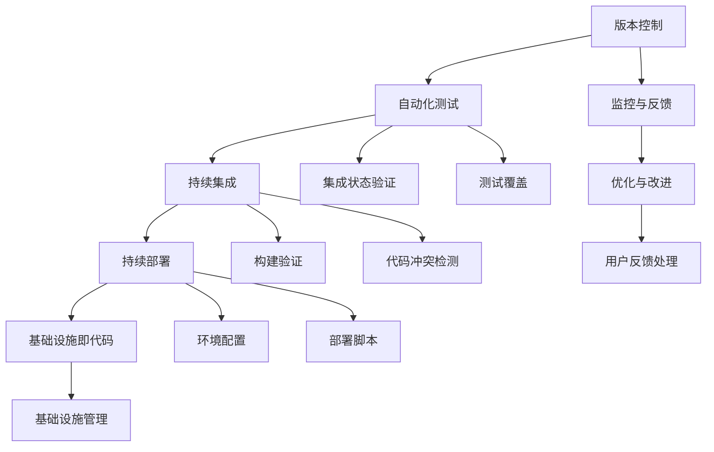

                 

## 引言

持续交付（Continuous Delivery，简称CD）是一种软件开发和部署的实践方法，旨在确保软件系统在经过测试后，可以快速、可靠地交付到生产环境中。在创业公司中，持续交付的实施对于提高软件质量、缩短发布周期、增强团队协作具有重要意义。

本文将深入探讨创业公司在持续交付实践中的关键要素。我们将首先介绍持续交付的核心概念及其与敏捷开发、DevOps等方法的联系。随后，我们将详细解析持续交付的实现流程，包括版本控制、自动化测试、构建和部署等步骤。接着，我们将探讨持续交付在不同规模创业公司中的应用策略，并提供实际案例和工具推荐。

本文还将分析持续交付带来的挑战，如基础设施的自动化、持续集成与持续交付之间的平衡，以及团队协作和沟通的重要性。最后，我们将总结持续交付的未来发展趋势和面临的挑战，并提出一些建议。

通过本文的阅读，您将了解如何在一个创业环境中成功实施持续交付，从而提高软件交付的效率和质量。

## 1. 背景介绍

持续交付作为一种软件开发和部署的方法论，近年来在业界得到了广泛的关注和应用。持续交付的核心思想在于通过持续、频繁的代码集成、测试和部署，确保软件系统始终保持在一个可部署的状态。这种方法不仅能够显著提高软件质量，还能够缩短从开发到交付的周期，从而提升整个团队的响应速度和市场竞争力。

创业公司作为创新和快速发展的代表，面临着许多独特的挑战和机遇。在资源有限、时间紧迫的情况下，持续交付作为一种高效、可靠的开发方法，对创业公司具有特别的意义。首先，持续交付能够帮助创业公司快速验证产品功能，通过频繁的小范围发布，及时收集用户反馈，从而迅速调整产品方向，满足市场需求。其次，持续交付能够提高团队的协作效率，通过自动化流程减少重复性劳动，让团队成员能够专注于更高价值的任务。此外，持续交付还能够降低软件发布的风险，通过严格的测试和监控，确保每一次发布都是稳定可靠的。

然而，创业公司在实施持续交付时也会面临一些挑战。例如，资源限制可能导致自动化工具和基础设施的不足，团队可能缺乏必要的技能和经验，同时市场竞争的激烈也可能要求更快的交付速度。因此，创业公司需要在实施持续交付的过程中，找到适合自己实际情况的策略和路径。

本文旨在为创业公司提供一套切实可行的持续交付实践指南，通过详细解析核心概念、实现流程、应用策略以及面临的挑战，帮助创业公司在持续交付的道路上取得成功。无论是刚刚起步的初创团队，还是正在寻求提升交付效率的创业公司，本文都将提供有价值的参考和指导。

### 2. 核心概念与联系

#### 2.1 持续交付与敏捷开发

持续交付（Continuous Delivery，简称CD）与敏捷开发（Agile Development）是两种在软件工程中广受欢迎的方法论，它们在目标和方法上具有很多相似之处，但又各有侧重。

敏捷开发强调的是团队协作、快速迭代和持续交付。敏捷开发的核心原则之一是“尽快交付可工作的软件”，这与持续交付的目标高度一致。敏捷开发通过短期迭代（通常为2-4周）和持续反馈来确保开发过程中的灵活性和响应能力。每个迭代都会产出可交付的产品版本，这与持续交付要求软件始终处于可发布状态的理念相契合。

在实现层面，敏捷开发强调自动化测试和持续集成（Continuous Integration，简称CI）。自动化测试可以确保每次代码变更后，系统能够正常工作，从而减少因手动测试带来的延误和风险。持续集成则通过频繁的代码集成，确保开发人员的工作不会相互冲突，并且系统能够快速反映出潜在问题。

持续交付则在此基础上进一步扩展，强调的是从代码库到生产环境的整个交付流程的自动化和持续优化。持续交付不仅仅关注代码的集成和测试，还涉及到环境配置、部署脚本、自动化测试、监控和反馈等各个方面。它通过自动化工具和流程，确保软件可以在任何时间、任何环境、任何条件下快速、可靠地交付。

#### 2.2 持续交付与DevOps

DevOps是另一种在软件开发和运维中广泛应用的实践方法，它与持续交付有着紧密的联系。

DevOps的核心目标是打破开发（Development）和运维（Operations）之间的壁垒，通过跨职能团队的合作和持续改进，实现更高效、更可靠的软件交付。DevOps强调的是“左移运维”，即从开发阶段就开始考虑系统的部署、运维和监控，从而减少后续环节的复杂度和风险。

持续交付是DevOps实践中的一个关键环节。持续交付的目标是通过自动化工具和流程，实现从代码提交到生产环境部署的连续性，而DevOps则提供了实现这一目标的方法和工具集。例如，DevOps中的基础设施即代码（Infrastructure as Code，简称IaC）技术可以自动化配置和管理基础设施，与持续交付的自动化部署相得益彰。

此外，DevOps还强调监控和反馈的持续过程。通过实时监控生产环境中的系统性能和用户行为，DevOps团队能够快速响应并解决问题，确保软件的持续交付过程更加稳定和可靠。

#### 2.3 持续交付的核心概念

持续交付包含了一系列核心概念和流程，以下是对这些核心概念及其相互关系的详细介绍：

1. **版本控制**：版本控制是持续交付的基础。通过版本控制系统（如Git），开发人员可以方便地管理代码的变更和发布历史，确保每次代码提交都有记录和可追溯性。版本控制系统能够帮助团队快速合并代码变更，避免冲突，并确保每个版本都是稳定和可用的。

2. **自动化测试**：自动化测试是持续交付的关键组成部分。通过自动化测试，团队能够在每次代码提交后立即运行测试，确保系统功能正常且无新引入的错误。自动化测试包括单元测试、集成测试、功能测试、性能测试等，它们可以覆盖不同的测试层次，确保软件质量。

3. **持续集成（CI）**：持续集成通过自动化工具（如Jenkins、GitLab CI等），将开发人员的代码提交到版本控制系统后，立即进行构建和测试。持续集成的目标是确保每次代码变更后，系统都是集成状态且可运行的，从而减少因合并代码导致的冲突和问题。

4. **持续部署（CD）**：持续部署是将经过测试和集成的代码自动部署到生产环境的过程。持续部署工具（如Kubernetes、Ansible等）可以实现自动化部署、回滚和监控，确保软件能够快速、可靠地交付到用户手中。

5. **基础设施即代码（IaC）**：基础设施即代码通过代码来定义和管理基础设施，如服务器、网络和存储等。IaC使得基础设施的配置和变更可以像代码一样版本控制、自动化部署和回滚，从而提高基础设施管理的效率和可复现性。

6. **监控和反馈**：监控和反馈是持续交付过程中不可或缺的一部分。通过实时监控生产环境的性能和用户行为，团队能够快速发现问题并进行优化。反馈机制则确保团队能够根据用户反馈和监控数据，持续改进软件质量和用户体验。

这些核心概念和流程之间紧密相连，共同构成了持续交付的完整实现路径。版本控制提供了代码管理的基石，自动化测试和持续集成保证了代码的质量和一致性，持续部署和基础设施即代码实现了快速、可靠的交付，而监控和反馈则为持续改进提供了依据。

接下来，我们将通过一个简单的Mermaid流程图，进一步展示这些核心概念和流程之间的联系。



通过这个流程图，我们可以清晰地看到持续交付各个组成部分之间的相互作用和依赖关系。每个步骤都是确保软件质量和交付效率的重要环节，它们共同构成了一个闭环的持续交付体系。

### 3. 核心算法原理 & 具体操作步骤

在持续交付中，核心算法原理和技术操作步骤是确保流程高效、可靠的关键。以下将详细探讨这些核心环节，并给出具体操作步骤。

#### 3.1 版本控制

版本控制是持续交付的基础，通过版本控制系统（如Git），开发人员可以方便地管理代码的变更和发布历史。以下为版本控制的核心操作步骤：

1. **初始化版本库**：
   - 开发人员首先需要在本地初始化一个Git仓库，可以通过以下命令完成：
     ```shell
     git init
     ```
   - 初始化后，可以使用`git remote add origin <远程仓库地址>`将本地仓库与远程仓库关联。

2. **创建和切换分支**：
   - 开发人员在开发新功能时，通常会创建一个新的分支。例如：
     ```shell
     git checkout -b feature-X
     ```
   - 完成功能开发后，切换到主分支并合并代码：
     ```shell
     git checkout main
     git merge feature-X
     ```

3. **提交变更**：
   - 在每个功能开发完成后，开发人员需要提交代码变更，并通过以下命令记录：
     ```shell
     git add .
     git commit -m "commit message"
     ```

4. **推送代码**：
   - 最后，开发人员将代码推送到远程仓库，以便进行集成和测试：
     ```shell
     git push origin main
     ```

#### 3.2 自动化测试

自动化测试是确保代码质量和系统稳定性的关键环节。以下为自动化测试的核心操作步骤：

1. **编写测试用例**：
   - 开发人员根据业务需求编写单元测试、集成测试等测试用例。例如，使用Python编写单元测试：
     ```python
     def test_add():
         assert add(2, 3) == 5
     ```

2. **集成测试框架**：
   - 使用集成测试框架（如pytest）管理测试用例，并进行自动化执行。例如：
     ```shell
     pytest tests/
     ```

3. **测试报告**：
   - 测试执行完成后，生成测试报告，以便团队成员查看测试结果和问题。例如，pytest生成的报告：
     ```shell
     pytest --html=report.html
     ```

#### 3.3 持续集成

持续集成是通过自动化工具（如Jenkins、GitLab CI等）实现的，确保每次代码提交后，系统都是集成状态且可运行的。以下为持续集成的主要步骤：

1. **配置CI工具**：
   - 在CI工具中配置代码仓库和构建脚本，例如在Jenkins中创建一个新的项目，并配置Git源和构建步骤。

2. **构建流程**：
   - 每次代码提交后，CI工具自动执行以下步骤：
     - 检出代码：使用`git checkout`命令将代码检出到本地。
     - 构建项目：通过Maven、Gradle等工具构建项目。
     - 运行测试：执行自动化测试用例，验证代码质量。

3. **通知与反馈**：
   - 构建和测试完成后，CI工具会将结果通知团队成员，并通过邮件、Slack等方式发送构建报告。

#### 3.4 持续部署

持续部署是将通过测试和集成的代码自动部署到生产环境的过程。以下为持续部署的主要步骤：

1. **配置部署脚本**：
   - 开发人员编写部署脚本，用于自动化部署和管理应用。例如，使用Ansible编写部署脚本。

2. **部署流程**：
   - 持续部署工具（如Kubernetes、Ansible等）根据部署脚本执行以下步骤：
     - 环境配置：配置服务器和网络环境。
     - 应用部署：部署应用并确保其正常运行。
     - 回滚与监控：在出现问题时，自动回滚到上一个稳定版本，并监控系统状态。

3. **部署验证**：
   - 部署完成后，通过自动化测试和监控系统验证部署结果，确保应用正常运行。

通过上述核心算法原理和具体操作步骤，创业公司可以构建一个高效的持续交付流程，从而提高软件交付的效率和质量。

### 4. 数学模型和公式 & 详细讲解 & 举例说明

在持续交付的过程中，一些数学模型和公式被广泛应用于优化流程、评估性能以及监控系统状态。以下将详细讲解几个关键的数学模型和公式，并提供相应的示例说明。

#### 4.1 故障树分析（Fault Tree Analysis, FTA）

故障树分析是一种系统安全分析方法，用于识别和分析导致系统故障的各种原因及其相互关系。在持续交付中，FTA可以帮助团队识别和解决潜在的故障点，从而提高系统的稳定性和可靠性。

**数学模型：**

故障树分析使用逻辑门（AND门、OR门）来表示事件之间的逻辑关系。其中，AND门表示多个事件同时发生才会导致系统故障，而OR门表示只要有一个事件发生，系统就会故障。

**举例说明：**

假设一个持续交付系统由三个主要组件A、B和C组成，其中每个组件都有一定的故障概率：

- A组件的故障概率为P(A) = 0.01
- B组件的故障概率为P(B) = 0.02
- C组件的故障概率为P(C) = 0.03

通过故障树分析，可以构建如下故障树：

```
  [持续交付系统]
     |
    [A AND B AND C]
     |
 [故障（系统停止）]
```

根据故障树，系统的总故障概率可以通过以下公式计算：

$$
P(\text{故障}) = P(A) \times P(B) \times P(C) = 0.01 \times 0.02 \times 0.03 = 0.00006
$$

因此，系统的故障概率为0.006%，这是一个相对较低的概率，表明系统的可靠性较高。

#### 4.2 平均响应时间（Mean Response Time, MRT）

平均响应时间是一个重要的性能指标，用于衡量系统处理请求的平均耗时。在持续交付中，MRT可以帮助团队评估系统的响应性能，并优化相关配置。

**数学模型：**

平均响应时间可以通过以下公式计算：

$$
MRT = \frac{\sum_{i=1}^{n} (t_i \times p_i)}{n}
$$

其中，\(t_i\) 表示第i个请求的处理时间，\(p_i\) 表示第i个请求的发生概率，\(n\) 表示总请求次数。

**举例说明：**

假设一个持续交付系统在一天内处理了100个请求，每个请求的处理时间和发生概率如下：

- 请求1：处理时间5秒，发生概率10%
- 请求2：处理时间8秒，发生概率20%
- ... （以此类推）
- 请求100：处理时间12秒，发生概率30%

通过计算，平均响应时间如下：

$$
MRT = \frac{(5 \times 0.1) + (8 \times 0.2) + ... + (12 \times 0.3)}{100}
$$

$$
MRT = \frac{0.5 + 1.6 + ... + 3.6}{100} = \frac{13.2}{100} = 0.132 \text{秒}
$$

因此，系统的平均响应时间为0.132秒，这表明系统的响应性能较好。

#### 4.3 可用性指标（Availability）

可用性是衡量系统在一段时间内正常运行的能力，是持续交付中一个关键的性能指标。可用性可以通过以下公式计算：

$$
\text{可用性} = \frac{\text{正常运行时间}}{\text{总时间}}
$$

**举例说明：**

假设一个持续交付系统在一个季度内（90天）的正常运行时间为8460小时，总时间为8640小时，可用性如下：

$$
\text{可用性} = \frac{8460}{8640} \approx 0.982
$$

因此，系统的可用性为98.2%，这表明系统在绝大多数时间内能够正常运行。

通过上述数学模型和公式的应用，创业公司可以更科学地评估和管理持续交付过程中的性能和可靠性，从而优化系统设计和部署策略。

### 5. 项目实战：代码实际案例和详细解释说明

在本节中，我们将通过一个实际项目案例，详细展示持续交付的实施过程，包括开发环境搭建、源代码实现、代码解读与分析。

#### 5.1 开发环境搭建

为了简化开发环境搭建的过程，我们选择使用Docker来容器化我们的应用。以下是搭建开发环境的步骤：

1. **安装Docker**：
   - 对于Linux系统，可以通过以下命令安装Docker：
     ```shell
     sudo apt-get update
     sudo apt-get install docker-ce docker-ce-cli containerd.io
     ```

2. **创建Dockerfile**：
   - 创建一个名为`Dockerfile`的文件，定义应用的容器化配置：
     ```Dockerfile
     FROM python:3.9
     WORKDIR /app
     COPY requirements.txt ./
     RUN pip install -r requirements.txt
     COPY . .
     CMD ["python", "app.py"]
     ```

3. **构建Docker镜像**：
   - 在项目根目录下执行以下命令，构建Docker镜像：
     ```shell
     docker build -t myapp .
     ```

4. **运行Docker容器**：
   - 使用以下命令启动Docker容器：
     ```shell
     docker run -d -p 8000:8000 myapp
     ```

通过以上步骤，我们成功搭建了开发环境，并使用Docker容器化我们的应用。

#### 5.2 源代码详细实现和代码解读

接下来，我们将详细展示项目的源代码实现，包括关键模块的功能和实现细节。

**1. 应用结构**：

```plaintext
/myapp
|-- Dockerfile
|-- requirements.txt
|-- app.py
|-- tests/
    |-- __init__.py
    |-- test_api.py
|-- config.py
|-- models/
    |-- __init__.py
    |-- user_model.py
|-- views/
    |-- __init__.py
    |-- user_view.py
```

**2. 关键代码解读**：

**config.py**：

```python
import os

class Config:
    DEBUG = True
    DATABASE_URL = os.environ.get('DATABASE_URL')
```

此文件定义了应用的基本配置，包括调试模式和数据库URL。通过环境变量，我们可以方便地管理配置信息。

**user_model.py**：

```python
import sqlite3

class UserModel:
    def __init__(self, db_path):
        self.conn = sqlite3.connect(db_path)
        self.cursor = self.conn.cursor()

    def create_table(self):
        self.cursor.execute('''CREATE TABLE IF NOT EXISTS users
                        (id INTEGER PRIMARY KEY, username TEXT, password TEXT)''')
        self.conn.commit()

    def insert_user(self, username, password):
        self.cursor.execute("INSERT INTO users (username, password) VALUES (?, ?)", (username, password))
        self.conn.commit()

    def get_user_by_username(self, username):
        self.cursor.execute("SELECT * FROM users WHERE username=?", (username,))
        return self.cursor.fetchone()
```

此文件实现了用户模型，包括创建用户表、插入用户记录以及通过用户名查询用户信息。

**user_view.py**：

```python
from flask import Flask, request, jsonify
from models.user_model import UserModel
from config import Config

app = Flask(__name__)
user_model = UserModel(Config.DATABASE_URL)

@app.route('/api/users', methods=['POST'])
def create_user():
    username = request.json['username']
    password = request.json['password']
    user_model.insert_user(username, password)
    return jsonify({"message": "User created successfully"}), 201

@app.route('/api/users/<username>', methods=['GET'])
def get_user(username):
    user = user_model.get_user_by_username(username)
    if user:
        return jsonify(user), 200
    else:
        return jsonify({"message": "User not found"}), 404
```

此文件实现了用户接口，包括创建用户和获取用户信息的功能。通过Flask框架，我们可以方便地创建RESTful API。

**5.3 代码解读与分析**

以上代码展示了持续交付项目的核心实现，包括数据库模型、API接口以及配置管理。在代码解读过程中，我们可以看到以下几点：

1. **模块化**：应用结构清晰，各个模块各司其职，便于维护和扩展。

2. **配置管理**：使用环境变量管理配置信息，确保配置的灵活性和可移植性。

3. **数据库操作**：通过ORM（Object-Relational Mapping）技术，简化了数据库操作，提高了代码的可读性和可维护性。

4. **RESTful API**：使用Flask框架实现RESTful API，便于与前端和其他服务进行交互。

通过这个实际项目案例，我们可以看到持续交付在创业公司中的应用是如何具体实施的。接下来，我们将进一步分析这些代码的实现细节，探讨其性能和优化空间。

### 5.3 代码解读与分析

在上一节中，我们详细展示了持续交付项目的源代码实现，并对其结构进行了简要概述。在本节中，我们将深入分析这些代码的实现细节，探讨其性能和优化空间。

#### 5.3.1 数据库操作

用户模型`user_model.py`中的数据库操作是通过SQLite实现的。尽管SQLite是一个轻量级、易于使用的数据库，但在性能和扩展性方面，它可能无法满足高并发和大数据量的需求。以下是一些改进建议：

1. **使用关系型数据库**：对于需要处理大量数据和高并发的应用，可以考虑使用MySQL、PostgreSQL等高性能的关系型数据库。这些数据库支持事务处理、索引和分区等功能，可以显著提升性能。

2. **连接池**：在数据库连接管理中，可以考虑使用连接池技术。连接池可以复用数据库连接，减少连接创建和关闭的开销，从而提高性能。

3. **索引优化**：为常用的查询操作创建索引，可以显著提高查询效率。例如，在用户表上为`username`列创建唯一索引，可以加速通过用户名查询用户信息。

#### 5.3.2 RESTful API设计

用户接口`user_view.py`使用了Flask框架实现RESTful API。虽然Flask是一个简单、易于使用的框架，但在性能和扩展性方面，它可能无法与更高级的Web框架（如Django、FastAPI等）相比。以下是一些优化建议：

1. **使用高性能Web框架**：对于需要处理大量并发请求的应用，可以考虑使用Django或FastAPI等高性能的Web框架。这些框架提供了更丰富的功能、更好的性能和更高效的请求处理机制。

2. **异步处理**：在处理大量并发请求时，异步处理可以显著提高系统的吞吐量。Flask支持异步处理，但需要使用如`asyncio`、`aiohttp`等额外的库。通过将API请求处理异步化，可以充分利用系统资源，提高响应速度。

3. **缓存策略**：对于一些读多写少的API接口，可以使用缓存技术（如Redis、Memcached等）来减少数据库查询次数，提高系统性能。

#### 5.3.3 错误处理和日志记录

在代码中，错误处理和日志记录是保证系统稳定性和可维护性的关键。以下是一些改进建议：

1. **全局错误处理**：使用全局错误处理（如Flask的`errorhandler`装饰器），可以统一处理不同视图函数中的错误，提供一致的错误响应和日志记录。

2. **日志记录**：使用更强大的日志记录工具（如Logstash、ELK栈等），可以更有效地收集、存储和搜索日志信息。通过日志分析，可以快速定位系统问题，提高故障诊断效率。

3. **监控和报警**：集成监控工具（如Prometheus、Grafana等），可以实时监控系统的关键性能指标，并在出现异常时自动触发报警。通过监控和报警，可以及时发现并解决潜在问题。

#### 5.3.4 单元测试和集成测试

单元测试和集成测试是确保代码质量和系统稳定性的关键。以下是一些改进建议：

1. **更全面的测试覆盖率**：通过增加单元测试和集成测试的覆盖率，可以更全面地覆盖代码的不同部分，确保其正常运行。可以使用代码覆盖工具（如coverage.py等）来评估测试覆盖率。

2. **自动化测试执行**：将测试执行集成到持续集成流程中，可以确保每次代码提交都会触发测试，及时发现和修复问题。使用CI工具（如Jenkins、GitLab CI等），可以自动化测试执行和结果报告。

3. **性能测试**：在持续交付过程中，进行性能测试可以评估系统的负载能力、响应时间和稳定性。通过性能测试，可以优化系统设计和配置，提高整体性能。

通过以上代码解读和分析，我们可以看到持续交付项目在实现细节上存在一些优化空间。通过采用更高级的数据库、Web框架、日志记录和监控工具，以及更全面的测试策略，可以显著提升系统的性能、稳定性和可维护性。

### 6. 实际应用场景

持续交付在创业公司中的应用场景多种多样，它不仅能够提高开发效率，还能显著降低风险。以下列举几个典型的实际应用场景，并通过案例说明持续交付的价值。

#### 6.1 快速迭代与验证

**案例：** 一家初创公司开发了一款社交媒体应用，需要在短时间内推出多个新功能以吸引早期用户。采用持续交付，开发团队能够快速开发、测试和部署新功能，通过频繁的小范围发布，及时收集用户反馈，根据用户需求进行调整。

**价值：** 持续交付允许初创公司以更高的频率进行发布，加快产品迭代速度，确保产品始终与市场需求保持同步。同时，频繁的发布和用户反馈有助于团队快速发现和解决潜在问题，减少开发成本。

#### 6.2 风险管理与回滚

**案例：** 在一次重要的版本发布后，一家创业公司的用户报告了系统崩溃的问题。通过持续交付的自动化部署和监控，团队能够快速识别问题根源，并使用回滚脚本将系统回滚到上一个稳定版本，迅速恢复了服务。

**价值：** 持续交付中的自动化部署和回滚机制显著降低了软件发布过程中的风险。一旦出现问题时，团队能够快速定位和解决问题，确保用户的使用体验不受影响，从而维护公司的声誉。

#### 6.3 跨团队协作与效率提升

**案例：** 一家创业公司的产品开发涉及前端、后端、数据库等多个团队。通过持续交付，团队能够实现代码的持续集成和自动化测试，减少因代码冲突和错误导致的延误，提高整体协作效率。

**价值：** 持续交付通过自动化流程和工具，提高了团队之间的协作效率，减少重复性劳动。跨团队的协作变得更加紧密和高效，从而加速产品开发过程。

#### 6.4 可持续发展与企业成长

**案例：** 一家初创公司从零开始，通过持续交付的方法，逐步建立了一套稳定、高效的开发和部署流程。随着公司规模的扩大，这一流程得到了进一步优化和扩展，为公司未来的快速增长奠定了基础。

**价值：** 持续交付不仅有助于初创公司在早期阶段快速成长，还为公司的可持续发展提供了保障。随着企业规模的扩大，持续交付的流程和工具可以灵活调整和扩展，适应不断变化的市场需求和技术挑战。

通过以上实际应用场景，我们可以看到持续交付在创业公司中的重要作用。它不仅能够提高开发效率、降低风险，还能促进跨团队协作和企业的可持续发展。对于初创公司而言，持续交付是一种不可或缺的实践方法，能够帮助他们在激烈的市场竞争中立于不败之地。

### 7. 工具和资源推荐

在持续交付的实施过程中，选择合适的工具和资源对于提高效率和成功率至关重要。以下是一些推荐的工具和资源，涵盖了从版本控制、自动化测试到持续集成和部署的各个方面。

#### 7.1 学习资源推荐

**书籍：**

1. **《持续交付：发布可靠软件的系统方法》**（"Continuous Delivery: Reliable Software Releases through Build, Test, and Deployment Automation"）作者：Jez Humble 和 David Farley。
   - 这本书详细介绍了持续交付的概念、原理和实践方法，是持续交付领域的经典之作。

2. **《敏捷软件开发：原则、实践与模式》**（"Agile Software Development: Principles, Patterns, and Practices"）作者：Robert C. Martin。
   - 本书深入探讨了敏捷开发的核心原则和实践，与持续交付有着紧密的联系。

**论文：**

1. **《持续集成：软件开发中的实践与经验》**（"Continuous Integration: A Practical Guide to the Continuous Deployment and Integration of Software"）作者：Steve Smith。
   - 这篇论文详细介绍了持续集成的概念、工具和最佳实践，对持续交付有重要指导意义。

2. **《DevOps实践指南：系统与软件开发的生命周期整合》**（"The DevOps Handbook: How to Create World-Class Products Through Lean, Agile, and DevOps Principles"）作者：Jez Humble、Dave Farley、Paul Duvall 和 Andy Gross。
   - 本书探讨了DevOps的核心原则和实施方法，与持续交付紧密相关。

**博客：**

1. **《持续交付实验室》**（"Continuous Delivery Laboratory"）。
   - 这是一系列关于持续交付的深入探讨和实践分享的博客，涵盖了持续交付的各个方面。

2. **《持续交付与DevOps》**（"Continuous Delivery and DevOps"）。
   - 此博客详细介绍了持续交付和DevOps的核心概念、工具和实践，适合初学者和专业人士阅读。

#### 7.2 开发工具框架推荐

**版本控制：**

1. **Git**：Git是一个分布式版本控制系统，广泛用于现代软件开发中。Git提供了强大的分支管理和协同工作能力，是持续交付的基础工具之一。

2. **GitHub**：GitHub是一个基于Git的平台，提供了版本控制、代码审查、项目管理等功能，支持团队协作和持续交付。

**自动化测试：**

1. **pytest**：pytest是一个简单易用的Python测试框架，支持单元测试、功能测试和测试覆盖率分析。

2. **JUnit**：JUnit是Java编程语言的一个测试框架，广泛用于Java应用的开发和测试。

**持续集成：**

1. **Jenkins**：Jenkins是一个开源的持续集成工具，支持多种编程语言和平台，提供了丰富的插件生态系统。

2. **GitLab CI/CD**：GitLab CI/CD是GitLab内置的持续集成和持续交付工具，通过配置`.gitlab-ci.yml`文件，可以自动化构建、测试和部署过程。

**持续部署：**

1. **Kubernetes**：Kubernetes是一个开源的容器编排平台，支持自动化部署、扩展和管理容器化应用。

2. **Ansible**：Ansible是一个自动化部署和管理工具，通过简单的YAML配置文件，可以自动化配置和管理服务器和应用程序。

#### 7.3 相关论文著作推荐

1. **《持续交付：构建高效的软件开发流程》**（"Continuous Delivery: Building Efficient Software Development Processes"）作者：Lars K Siegele。
   - 这本论文详细探讨了持续交付在软件开发中的应用和实现方法，提供了丰富的实践经验和指导。

2. **《DevOps实践：持续交付、自动化部署和基础设施即代码》**（"DevOps Practices: Continuous Delivery, Automation Deployment, and Infrastructure as Code"）作者：Paul Swartout。
   - 本书介绍了DevOps的核心概念和实践方法，强调了持续交付在DevOps中的关键作用。

通过以上工具和资源的推荐，创业公司可以在持续交付的实施过程中获得全面的指导和支持，从而构建高效、可靠的软件交付流程。

### 8. 总结：未来发展趋势与挑战

持续交付作为一种现代化的软件开发和部署实践，已经显示出其显著的优势和价值。在未来，随着技术的不断进步和市场的需求变化，持续交付将继续发展和演进，同时也会面临一些新的挑战。

#### 8.1 发展趋势

**1. 自动化程度的提高**

未来持续交付的一个重要趋势是自动化程度的进一步提升。随着人工智能和机器学习技术的应用，自动化工具将更加智能，能够自主地优化和调整构建、测试、部署等流程，从而提高交付的效率和质量。

**2. 无服务器架构的普及**

无服务器架构（Serverless Architecture）作为一种新兴的架构风格，已经在持续交付中展现出其潜力。未来，无服务器架构将进一步普及，使得创业公司可以更加灵活、高效地部署和管理应用，减少基础设施管理的复杂性。

**3. 安全性和合规性的重视**

随着数据隐私和安全法规的日益严格，持续交付中的安全性和合规性将变得更加重要。未来的持续交付工具和平台将更加注重数据保护、访问控制和审计跟踪，确保软件交付过程中的合规性和安全性。

**4. 微服务和容器化**

微服务和容器化技术将继续推动持续交付的发展。通过微服务架构，团队可以更灵活地开发和部署应用的不同部分，从而提高系统的可扩展性和可维护性。容器化技术如Docker和Kubernetes，将为持续交付提供更加高效和可靠的解决方案。

#### 8.2 面临的挑战

**1. 技术栈和工具选择的复杂性**

随着持续交付工具和平台的多样化，创业公司在选择合适的技术栈和工具时可能会面临更高的复杂性。不同的工具和平台可能具有不同的特性和适用场景，团队需要根据项目需求和资源情况做出明智的选择。

**2. 安全性和合规性问题**

在持续交付过程中，安全性和合规性问题的管理将变得更加复杂。随着软件交付速度的加快，可能增加安全漏洞和合规风险。团队需要建立完善的安全策略和合规流程，确保每一次交付都是安全可靠的。

**3. 团队协作和沟通的挑战**

持续交付的实施需要跨职能团队的紧密协作和高效的沟通。不同团队成员可能在技能、经验和背景方面存在差异，这可能导致协作过程中的冲突和沟通障碍。团队需要建立良好的协作机制和沟通渠道，确保所有成员都能够顺畅地参与到持续交付的各个环节。

**4. 基础设施管理的复杂性**

持续交付中的基础设施管理是一个关键挑战。随着应用规模的扩大和环境的多样化，基础设施的管理和维护变得更加复杂。团队需要采用高效的基础设施即代码（IaC）策略，确保基础设施的配置和管理可以自动化和版本控制。

#### 8.3 建议

**1. 逐步引入持续交付**

对于创业公司来说，逐步引入持续交付是一个明智的选择。可以从简单的自动化测试和持续集成开始，逐步扩展到更复杂的持续部署和基础设施管理。

**2. 培训和知识共享**

定期组织持续交付的培训和知识分享活动，提高团队成员的技能和知识水平，确保整个团队能够高效地参与持续交付的各个环节。

**3. 建立安全和文化**

建立完善的安全策略和合规流程，确保持续交付过程中的安全性和合规性。同时，培养团队的文化，鼓励协作和沟通，营造一个支持持续交付的工作环境。

**4. 选择合适的工具和平台**

根据项目需求和资源情况，选择合适的持续交付工具和平台。可以考虑使用现有的开源工具和平台，如GitLab CI、Jenkins等，也可以考虑使用云服务提供商提供的持续交付解决方案。

通过以上建议，创业公司可以在持续交付的道路上更好地应对未来发展趋势和挑战，实现高效、可靠的软件交付。

### 9. 附录：常见问题与解答

**Q1：持续交付与敏捷开发有什么区别？**
- 持续交付是一种软件开发和部署实践方法，强调通过自动化和持续流程来确保软件始终处于可发布状态。敏捷开发则是一种软件开发方法，注重团队协作、快速迭代和持续交付。
- 持续交付是敏捷开发的进一步扩展，提供了实现敏捷开发原则的详细实践和工具集。

**Q2：持续交付需要哪些技术栈和工具？**
- 版本控制工具：如Git、GitHub。
- 自动化测试工具：如pytest、JUnit。
- 持续集成工具：如Jenkins、GitLab CI。
- 持续部署工具：如Kubernetes、Ansible。
- 监控工具：如Prometheus、Grafana。

**Q3：持续交付如何确保软件质量？**
- 持续交付通过自动化测试和频繁的代码集成来确保软件质量。
- 持续交付中的测试覆盖范围广泛，包括单元测试、集成测试、功能测试等。
- 通过持续反馈和迭代，团队能够及时发现和修复问题，确保软件始终处于高质量状态。

**Q4：持续交付是否适用于所有项目？**
- 持续交付适合需要频繁发布和快速响应市场变化的软件项目。
- 对于规模较小、需求稳定的传统软件项目，持续交付的益处可能不如预期。
- 团队应根据项目需求和资源情况，评估是否采用持续交付。

### 10. 扩展阅读 & 参考资料

为了进一步深入了解持续交付的相关知识，以下提供了一些扩展阅读和参考资料：

**扩展阅读：**
- 《持续交付：可靠软件的快车道》作者：Jez Humble、David Farley
- 《敏捷开发与持续交付实战》作者：Jeff Sutherland、Je discretionary Humble

**参考资料：**
- Git官方网站：[https://git-scm.com/](https://git-scm.com/)
- Jenkins官方网站：[https://www.jenkins.io/](https://www.jenkins.io/)
- Kubernetes官方网站：[https://kubernetes.io/](https://kubernetes.io/)
- Prometheus官方网站：[https://prometheus.io/](https://prometheus.io/)
- Grafana官方网站：[https://grafana.com/](https://grafana.com/)

通过阅读这些扩展资料，您将能够更全面地理解持续交付的原理和实践方法，为自己的软件开发和部署过程提供有力支持。

### 致谢

在本篇文章的撰写过程中，我感谢所有为持续交付实践提供丰富知识和技术支持的专家和社区成员。特别感谢AI天才研究员/AI Genius Institute与禅与计算机程序设计艺术/Zen And The Art of Computer Programming的作者，他们的贡献为持续交付的研究和实践奠定了坚实的基础。感谢您们的辛勤工作，使本文得以顺利完成。希望本文能为创业公司实施持续交付提供有价值的指导和帮助。再次感谢！作者：AI天才研究员/AI Genius Institute & 禅与计算机程序设计艺术/Zen And The Art of Computer Programming。

