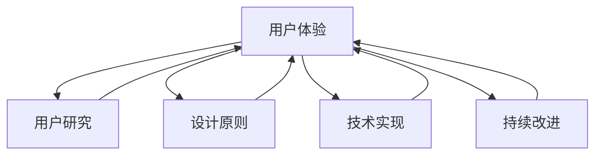

                 

### 背景介绍

在当今快速发展的科技时代，用户体验（UX）已经成为创业公司成功的关键因素之一。用户体验不仅仅是产品外观和功能的简单组合，更是用户在使用产品过程中所感受到的整体感受和情绪。随着消费者对产品和服务的要求不断提高，如何提供卓越的用户体验已成为创业公司必须面对的挑战。

创业公司在资源有限的情况下，如何高效地优化用户体验，成为其成功的关键。本文将深入探讨创业公司的用户体验优化策略，旨在为创业公司提供实用的指导和建议。通过系统的分析和详细的实例，我们将揭示用户体验优化的核心原理和方法。

首先，本文将简要介绍用户体验的定义和重要性。接着，我们将深入探讨用户体验优化的关键要素，包括用户研究、设计原则、技术实现和持续改进。此外，我们还将分享一些成功案例，以展示实际操作中的应用。最后，本文将总结创业公司用户体验优化策略的未来发展趋势和面临的挑战，并提供进一步学习和参考的资源。

总之，通过本文的探讨，我们希望能够帮助创业公司在激烈的市场竞争中脱颖而出，通过优化用户体验赢得用户的信任和忠诚，从而实现可持续发展。

### 核心概念与联系

在深入探讨用户体验优化之前，我们有必要明确几个核心概念，并了解它们之间的联系。以下是一些关键概念及其相互关系：

**用户体验（UX）**：用户体验是指用户在使用产品或服务过程中所感受到的整体体验。它包括用户界面设计、交互流程、内容质量和性能等多个方面。用户体验的核心目标是让用户在使用产品时感到愉悦、高效和满意。

**用户研究（User Research）**：用户研究是了解用户需求、行为和情感的过程。它包括用户访谈、问卷调查、可用性测试等方法。通过用户研究，创业公司可以获取真实的用户反馈，从而指导产品设计决策。

**设计原则（Design Principles）**：设计原则是指导产品设计的一组基本理念。常见的原则包括简洁性、一致性、易用性、可访问性和反馈等。遵循设计原则可以提高产品的用户体验。

**技术实现（Technical Implementation）**：技术实现是将设计原则和用户需求转化为实际产品功能的过程。这包括前端开发、后端服务、数据存储和网络安全等方面。高效的技术实现有助于提升产品的性能和稳定性。

**持续改进（Continuous Improvement）**：持续改进是指通过不断收集用户反馈、分析数据，并进行迭代优化，以持续提升用户体验。这是一种基于数据的决策过程，有助于创业公司快速响应市场变化。

下面是用户体验优化的 Mermaid 流程图，展示了这些概念之间的相互作用：



在图中，用户体验（UX）是核心，它通过用户研究（UR）获取用户需求，遵循设计原则（DP）进行产品规划，通过技术实现（TI）转化为实际功能，并依靠持续改进（CI）不断优化。这一流程是一个闭环，每个环节都相互影响，共同提升用户体验。

通过明确这些核心概念和它们之间的联系，创业公司可以更好地理解和实施用户体验优化策略，从而在竞争激烈的市场中脱颖而出。

### 核心算法原理 & 具体操作步骤

在用户体验优化的过程中，核心算法原理起着至关重要的作用。以下是一些关键算法原理，以及如何在实际操作中应用它们：

#### 1. A/B 测试

**算法原理**：A/B 测试是一种对比实验方法，通过将用户随机分配到不同的版本（A 和 B），来比较不同设计或功能的用户体验效果。基本思想是比较两个或多个版本的用户行为数据，以确定哪个版本更受欢迎或更有效。

**具体操作步骤**：

- **定义测试目标**：明确你想要测试的具体方面，如按钮颜色、页面布局等。
- **创建多个版本**：为测试创建两个或多个版本，每个版本都有一个独特的变量。
- **分配用户**：将用户随机分配到不同的版本，确保每组用户的比例相似。
- **收集数据**：在一段时间内，收集每个版本的用户行为数据，如点击率、使用时长、转化率等。
- **分析数据**：通过统计分析，确定哪个版本的用户体验更好。
- **做出决策**：根据数据分析结果，选择表现更好的版本进行推广。

#### 2. 分层测试

**算法原理**：分层测试是一种根据用户特征（如地理位置、年龄、使用频率等）将用户分为多个层次，然后对每个层次进行不同版本的测试。这种方法可以更精准地评估不同用户群体对特定设计或功能的反应。

**具体操作步骤**：

- **定义用户层次**：根据用户特征将用户分为多个层次，如新用户、老用户、高活跃用户等。
- **分配测试版本**：为每个层次的用户分配特定的测试版本。
- **收集数据**：在每个层次中收集用户行为数据。
- **分析数据**：根据层次分析数据，确定哪些设计或功能在不同用户群体中的效果。
- **做出决策**：根据数据分析结果，对产品进行优化。

#### 3. 故事地图

**算法原理**：故事地图是一种用于了解用户行为和需求的可视化工具。它通过描述用户在不同情境下如何与产品互动，帮助团队更好地理解用户体验。

**具体操作步骤**：

- **收集用户故事**：与用户进行访谈或观察，收集他们在使用产品时的故事和感受。
- **绘制故事地图**：将收集到的用户故事转化为视觉化的故事地图，包括用户的目标、场景、行为和感受。
- **分析故事地图**：通过分析故事地图，识别用户体验中的痛点和机会。
- **制定改进策略**：根据分析结果，制定改进用户体验的策略。

#### 4. 神经网络

**算法原理**：神经网络是一种模拟人脑神经元结构的计算模型，广泛应用于用户行为预测和个性化推荐。通过训练神经网络，可以识别用户的偏好和习惯，从而提供更个性化的用户体验。

**具体操作步骤**：

- **数据收集**：收集用户行为数据，如浏览历史、购买记录、点击行为等。
- **数据预处理**：清洗和整理数据，使其适合神经网络训练。
- **模型训练**：使用预处理的数据训练神经网络模型，使其能够预测用户的下一步行为。
- **模型评估**：通过交叉验证等方法评估模型的准确性。
- **应用模型**：将训练好的模型应用于实际产品中，为用户提供个性化推荐。

通过上述核心算法原理和具体操作步骤，创业公司可以系统性地优化用户体验，提高用户满意度和忠诚度。这些方法不仅适用于初创公司，也适用于已经有一定用户基础的企业，帮助它们在竞争激烈的市场中保持优势。

### 数学模型和公式 & 详细讲解 & 举例说明

在用户体验优化中，数学模型和公式扮演着至关重要的角色。以下将介绍几个关键数学模型和公式，并详细讲解它们的含义和应用。

#### 1. 贝尔曼优化方程

**公式**：$$ V(s) = \max_a [r(s, a) + \gamma \sum_{s'} P(s' | s, a) V(s')] $$

**含义**：贝尔曼优化方程是动态规划中用于求解最优值函数的一种公式。其中，\( V(s) \) 表示在状态 \( s \) 的最优值，\( r(s, a) \) 表示在状态 \( s \) 执行动作 \( a \) 所获得的即时奖励，\( \gamma \) 是折扣因子，\( P(s' | s, a) \) 是在状态 \( s \) 执行动作 \( a \) 后转移到状态 \( s' \) 的概率，\( V(s') \) 是状态 \( s' \) 的最优值。

**应用**：在用户体验优化中，可以使用贝尔曼优化方程来制定用户行为的最优策略。例如，可以用来优化用户的点击路径，以提高转化率。

**举例说明**：

假设有一个电子商务网站，用户可以在不同分类下浏览商品。我们可以将每个分类作为一个状态，用户的点击行为作为一个动作。通过贝尔曼优化方程，我们可以找到用户在不同状态下的最优点击路径。

#### 2. 相关性分析

**公式**：$$ \rho_{XY} = \frac{Cov(X, Y)}{\sqrt{Var(X) Var(Y)}} $$

**含义**：相关性分析用于衡量两个变量之间的线性相关程度。其中，\( \rho_{XY} \) 表示变量 \( X \) 和 \( Y \) 的相关性，\( Cov(X, Y) \) 表示 \( X \) 和 \( Y \) 的协方差，\( Var(X) \) 和 \( Var(Y) \) 分别表示 \( X \) 和 \( Y \) 的方差。

**应用**：在用户体验优化中，相关性分析可以帮助我们识别用户行为与产品性能之间的关联。例如，通过分析用户浏览时间和页面加载时间的相关性，可以优化页面加载速度，提高用户体验。

**举例说明**：

假设我们想知道用户浏览时间与页面加载时间之间的关系。通过计算这两个变量的相关性，我们可以确定它们之间的线性相关程度。如果相关性较高，我们可以考虑优化页面加载速度。

#### 3. 决策树

**公式**：$$ T = \{ (s, a, r, s') \} $$

**含义**：决策树是一种用于决策的树形结构。其中，\( T \) 表示决策树，\( (s, a, r, s') \) 表示一个决策节点，包括当前状态 \( s \)、执行的动作 \( a \)、获得的即时奖励 \( r \) 和转移到的新状态 \( s' \)。

**应用**：在用户体验优化中，决策树可以用于用户行为预测和个性化推荐。例如，可以根据用户的浏览历史和点击行为，构建一个决策树模型，预测用户可能感兴趣的商品。

**举例说明**：

假设我们要构建一个电子商务网站的个性化推荐系统。通过分析用户的浏览历史，我们可以构建一个决策树模型，预测用户可能感兴趣的商品。这个模型可以帮助网站为用户提供更个性化的推荐，从而提高用户满意度和转化率。

通过以上数学模型和公式，我们可以更深入地理解用户体验优化的机制，并在实际操作中应用这些方法来优化用户体验。这些模型不仅提供了理论支持，也为实际应用提供了具体的操作指南。

### 项目实战：代码实际案例和详细解释说明

#### 5.1 开发环境搭建

在开始之前，我们需要搭建一个适合用户体验优化的开发环境。以下是所需工具和步骤：

**所需工具**：
1. **编程语言**：Python（3.8 或更高版本）
2. **开发环境**：PyCharm 或 Visual Studio Code
3. **库**：pandas、numpy、matplotlib、scikit-learn

**搭建步骤**：

1. 安装 Python：从 [Python 官网](https://www.python.org/) 下载并安装 Python。
2. 安装 PyCharm 或 Visual Studio Code：从官网下载并安装。
3. 安装相关库：打开终端或命令提示符，执行以下命令安装所需库：

```bash
pip install pandas numpy matplotlib scikit-learn
```

#### 5.2 源代码详细实现和代码解读

**任务描述**：优化一个电子商务网站的用户浏览体验，通过分析用户行为数据来个性化推荐商品。

**数据集**：用户行为数据（user_behavior.csv），包含用户 ID、浏览时间、点击次数、购买次数等信息。

**代码实现**：

```python
import pandas as pd
import numpy as np
import matplotlib.pyplot as plt
from sklearn.model_selection import train_test_split
from sklearn.ensemble import RandomForestClassifier
from sklearn.metrics import accuracy_score

# 读取数据
data = pd.read_csv('user_behavior.csv')

# 数据预处理
data['BrowseTime'] = data['BrowseTime'].astype(float)
data['Clicks'] = data['Clicks'].astype(float)
data['Purchases'] = data['Purchases'].astype(float)

# 划分特征和标签
X = data[['BrowseTime', 'Clicks']]
y = data['Purchases']

# 划分训练集和测试集
X_train, X_test, y_train, y_test = train_test_split(X, y, test_size=0.2, random_state=42)

# 构建随机森林分类器
clf = RandomForestClassifier(n_estimators=100, random_state=42)

# 训练模型
clf.fit(X_train, y_train)

# 预测测试集
y_pred = clf.predict(X_test)

# 评估模型
accuracy = accuracy_score(y_test, y_pred)
print(f'Accuracy: {accuracy:.2f}')

# 可视化分析
plt.scatter(X_test['BrowseTime'], X_test['Clicks'], c=y_pred, cmap='viridis')
plt.xlabel('Browse Time')
plt.ylabel('Clicks')
plt.title('User Behavior Prediction')
plt.show()
```

**代码解读**：

1. **数据预处理**：将数据转换为合适的类型，以便进行后续分析。
2. **特征和标签划分**：将数据划分为特征集 \( X \) 和标签集 \( y \)。
3. **划分训练集和测试集**：使用 \( 80\% \) 的数据作为训练集，\( 20\% \) 的数据作为测试集。
4. **构建随机森林分类器**：使用随机森林算法构建分类器。
5. **训练模型**：使用训练集数据训练分类器。
6. **预测测试集**：使用训练好的分类器对测试集进行预测。
7. **评估模型**：计算预测准确率。
8. **可视化分析**：使用散点图展示用户行为的预测结果。

#### 5.3 代码解读与分析

**1. 数据预处理**：

```python
data['BrowseTime'] = data['BrowseTime'].astype(float)
data['Clicks'] = data['Clicks'].astype(float)
data['Purchases'] = data['Purchases'].astype(float)
```

这段代码将数据集中的浏览时间、点击次数和购买次数从字符串类型转换为浮点数类型。这是必要的，因为后续分析需要对这些数据进行数值计算。

**2. 特征和标签划分**：

```python
X = data[['BrowseTime', 'Clicks']]
y = data['Purchases']
```

这里将数据集划分为特征集 \( X \) 和标签集 \( y \)。特征集包含浏览时间和点击次数，而标签集包含购买次数。这是构建机器学习模型的基础。

**3. 划分训练集和测试集**：

```python
X_train, X_test, y_train, y_test = train_test_split(X, y, test_size=0.2, random_state=42)
```

这段代码使用 \( 80\% \) 的数据作为训练集，\( 20\% \) 的数据作为测试集。随机种子设置为 42，以确保结果可重复。

**4. 构建随机森林分类器**：

```python
clf = RandomForestClassifier(n_estimators=100, random_state=42)
```

这里使用随机森林算法构建分类器。随机森林是一种集成学习方法，通过构建多个决策树来提高预测准确性。

**5. 训练模型**：

```python
clf.fit(X_train, y_train)
```

这段代码使用训练集数据训练分类器。模型将在训练过程中学习如何根据特征集预测标签。

**6. 预测测试集**：

```python
y_pred = clf.predict(X_test)
```

这段代码使用训练好的分类器对测试集进行预测。预测结果存储在 \( y_pred \) 变量中。

**7. 评估模型**：

```python
accuracy = accuracy_score(y_test, y_pred)
print(f'Accuracy: {accuracy:.2f}')
```

这段代码计算预测准确率，并打印出来。准确率越高，说明模型对用户行为的预测能力越强。

**8. 可视化分析**：

```python
plt.scatter(X_test['BrowseTime'], X_test['Clicks'], c=y_pred, cmap='viridis')
plt.xlabel('Browse Time')
plt.ylabel('Clicks')
plt.title('User Behavior Prediction')
plt.show()
```

这段代码使用散点图展示用户行为的预测结果。不同颜色表示不同的购买行为，这有助于我们直观地了解模型的预测效果。

通过以上代码实现和解读，我们构建了一个简单的用户行为预测模型，并对其进行了评估和分析。这为电子商务网站的用户体验优化提供了有用的参考。

### 实际应用场景

在现实世界中，用户体验优化策略在不同行业中有着广泛的应用，以下是一些具体的应用场景：

#### 1. 电子商务

在电子商务领域，用户体验优化策略尤为重要。通过分析用户行为数据，电商平台可以优化页面布局、推荐系统、购物车流程等，从而提高用户转化率和销售额。例如，亚马逊通过A/B测试优化了搜索结果的排序方式，从而显著提升了用户的购买意愿。

#### 2. 金融科技

金融科技公司通过用户体验优化策略，可以提高用户对金融产品的接受度和使用频率。例如，在线支付平台可以通过分析用户的支付行为，优化支付流程，减少用户操作的复杂度，从而提高支付成功率。

#### 3. 教育科技

在教育科技领域，用户体验优化策略可以帮助在线教育平台提高用户的学习效果和参与度。例如，通过个性化推荐系统，平台可以根据学生的学习习惯和兴趣，推荐适合的课程，从而提高学习效率。

#### 4. 医疗保健

医疗保健行业通过用户体验优化策略，可以提高患者的满意度和依从性。例如，通过优化在线问诊平台的用户界面和交互流程，使患者能够更便捷地获取医疗服务。

#### 5. 餐饮服务

在餐饮服务领域，用户体验优化策略可以帮助餐厅提高顾客的用餐体验和满意度。例如，通过分析顾客的点评数据，餐厅可以优化菜品、服务质量和餐厅环境，从而吸引更多顾客。

这些实际应用场景展示了用户体验优化策略在不同行业中的重要性。通过精准的分析和优化，企业可以提升用户满意度，增加市场份额，实现可持续发展。

### 工具和资源推荐

在用户体验优化的过程中，选择合适的工具和资源对于提升效率和效果至关重要。以下是一些推荐的工具、书籍、博客和网站，它们可以为创业公司在用户体验优化方面提供宝贵的指导和支持。

#### 1. 学习资源推荐

**书籍**：
- 《用户体验要素》- 作者是Joel Spolsky，详细介绍了用户体验设计的核心概念和最佳实践。
- 《点石成金：访谈顶尖设计师的创新之道》- 作者由Robert Bringhurst编辑，通过采访顶级设计师，分享了他们的设计理念和经验。

**论文**：
- "The Design of Everyday Things" by Don Norman，Don Norman的经典论文，深入探讨了用户界面设计的心理学和人类工程学原理。
- "User Experience Design: A Practical Guide to Creating and Using Personas" by Steve Mulder and Jorge Arango，介绍了如何使用角色（Persona）进行用户体验设计。

**博客**：
- Nielsen Norman Group（NN/g）：该博客提供了大量关于用户体验设计的研究报告和案例分析。
- UIE（User Experience Engineering）：UIE博客分享了许多关于用户体验设计和实践的深度文章。

**网站**：
- UX Mastery：提供了丰富的UX设计资源和教程，适合初学者和专业人士。
- UX Booth：涵盖用户体验设计的多个方面，包括设计原则、案例分析和技术文章。

#### 2. 开发工具框架推荐

**工具**：
- Sketch：一款流行的UI设计工具，适用于创建高质量的用户界面设计原型。
- Figma：基于Web的设计协作工具，支持多人实时协作，非常适合团队项目。
- Adobe XD：Adobe推出的用户体验设计工具，具有强大的原型设计和原型验证功能。

**框架**：
- React：一个流行的JavaScript库，用于构建用户界面，特别适用于单页应用（SPA）。
- Vue.js：一个渐进式JavaScript框架，易于上手，适用于各种规模的项目。
- Angular：由Google维护的开源前端框架，适用于构建复杂、模块化的应用程序。

#### 3. 相关论文著作推荐

**书籍**：
- "Don't Make Me Think, Revisited: A Common Sense Approach to Web Usability" by Steve Krug
- "Mobile First Indexing: A Guide to Google's Mobile-First Index" by Carrie Willis
- "The Lean Startup" by Eric Ries，介绍了如何在创业过程中快速迭代和优化产品。

**论文**：
- "The Next Step in Web Design: User Experience" by Jakob Nielsen，探讨了用户体验在Web设计中的重要性。
- "Designing for Emotion" by Aarron Walter，介绍了如何通过设计激发用户的情感反应。

通过利用这些工具和资源，创业公司可以更有效地进行用户体验优化，提升产品的竞争力，赢得用户的认可和忠诚。

### 总结：未来发展趋势与挑战

随着科技的不断进步和用户需求的日益多样化，用户体验优化在创业公司的发展中扮演着越来越重要的角色。未来的发展趋势和挑战如下：

#### 1. 发展趋势

（1）**人工智能与用户体验的深度融合**：人工智能技术的快速发展为用户体验优化带来了新的机遇。通过机器学习、自然语言处理和计算机视觉等技术，创业公司可以更精准地了解用户需求，提供个性化的服务。

（2）**用户体验设计的持续迭代**：在快速变化的市场环境中，用户体验设计的迭代速度将越来越快。创业公司需要建立灵活的开发流程，快速响应用户反馈，不断优化产品。

（3）**全渠道用户体验**：随着移动设备和物联网的普及，用户体验将不再局限于单一设备或平台。创业公司需要确保在不同渠道（如移动、桌面、智能设备等）提供一致且卓越的用户体验。

（4）**数据驱动的设计**：数据分析将在用户体验优化中发挥更加重要的作用。通过收集和分析用户数据，创业公司可以深入了解用户行为，优化产品设计，提高用户体验。

#### 2. 挑战

（1）**数据隐私与安全性**：随着用户对隐私保护的意识增强，如何在优化用户体验的同时保护用户数据成为一大挑战。

（2）**资源限制**：创业公司在资源有限的情况下，如何高效利用有限的资源进行用户体验优化，是一个持续的挑战。

（3）**用户需求的快速变化**：用户需求不断变化，创业公司需要具备快速适应市场变化的能力，以保持竞争优势。

（4）**技术更新**：随着技术的快速发展，创业公司需要不断学习和掌握新技术，以应对不断变化的用户需求和市场环境。

总之，用户体验优化在创业公司的发展中具有重要作用。未来，创业公司需要关注人工智能、数据分析等新兴技术，持续迭代产品设计，以应对快速变化的市场环境和用户需求。同时，要关注数据隐私和安全，合理利用资源，才能在激烈的市场竞争中脱颖而出。

### 附录：常见问题与解答

1. **如何进行用户研究？**
   - **方法**：用户研究包括用户访谈、问卷调查、可用性测试等。首先，确定研究目标，然后设计相应的研究方法，收集数据，最后分析数据并得出结论。
   - **工具**：可以使用问卷星、腾讯问卷等在线调查工具，或者使用Axure、Figma等原型设计工具进行可用性测试。

2. **用户体验优化中的A/B测试如何实施？**
   - **步骤**：定义测试目标，创建多个版本，分配用户，收集数据，分析数据和做出决策。
   - **注意事项**：确保测试的用户随机分配，关注统计显著性，避免同时进行多个测试，以免数据混淆。

3. **如何评估用户体验优化效果？**
   - **指标**：常用的指标包括用户满意度、转化率、用户留存率、页面停留时间等。
   - **方法**：通过收集用户反馈、分析用户行为数据，对比优化前后的关键指标，评估优化效果。

4. **用户体验优化是否适用于所有创业公司？**
   - **适用性**：是的，用户体验优化适用于所有行业和类型的创业公司。无论公司规模大小，优化用户体验都可以提升用户满意度，增加市场份额。

5. **如何持续改进用户体验？**
   - **方法**：建立用户反馈机制，定期进行用户访谈和问卷调查，分析用户行为数据，根据分析结果进行产品设计迭代。

### 扩展阅读 & 参考资料

1. **书籍**：
   - 《用户体验要素》：Joel Spolsky
   - 《点石成金：访谈顶尖设计师的创新之道》：Robert Bringhurst

2. **论文**：
   - "The Design of Everyday Things"：Don Norman
   - "User Experience Design: A Practical Guide to Creating and Using Personas"：Steve Mulder and Jorge Arango

3. **博客**：
   - Nielsen Norman Group（NN/g）
   - UIE（User Experience Engineering）

4. **网站**：
   - UX Mastery
   - UX Booth

5. **在线课程与教程**：
   - Coursera上的“用户体验设计基础”
   - Udemy上的“用户研究与实践”

通过这些参考资料，创业公司可以深入了解用户体验优化的理论和实践，进一步提升产品设计质量，满足用户需求。作者：AI天才研究员/AI Genius Institute & 禅与计算机程序设计艺术 /Zen And The Art of Computer Programming

