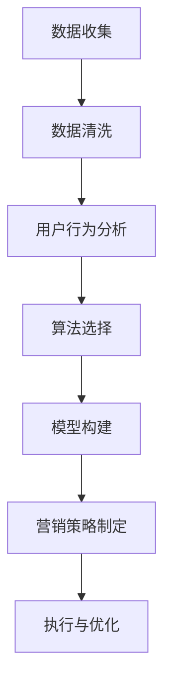

                 

# 创业公司的用户分群营销策略制定

## 摘要

本文旨在探讨创业公司在进行用户分群营销时所需考虑的关键要素和策略。在竞争激烈的市场环境中，有效的用户分群策略能够帮助企业更好地理解目标用户，提升用户满意度，从而实现业务的增长。文章首先介绍了用户分群营销的基本概念和重要性，随后详细阐述了构建用户分群模型所需的步骤和方法，包括数据收集、用户行为分析、机器学习算法的选择和应用。接着，文章通过实例展示如何将分群结果应用于实际营销活动中，以提高营销效率和效果。最后，文章总结了用户分群营销面临的挑战和未来趋势，并提供了相关工具和资源的推荐。

## 1. 背景介绍

在当今数字化时代，用户数据已成为企业最宝贵的资产之一。对于创业公司而言，合理利用用户数据，特别是通过用户分群营销，能够显著提升业务表现和市场竞争力。用户分群营销的核心在于根据用户的不同特征和行为，将其划分为不同的群体，进而实施有针对性的营销策略。

### 1.1 市场营销中的用户分群

用户分群（User Segmentation）是市场营销中的一种重要手段。它通过将用户根据其年龄、性别、收入、地理位置、购买行为等特征进行分类，帮助企业更好地理解不同用户群体的需求和偏好。用户分群不仅能够提高营销活动的针对性，还能够优化资源配置，提升营销效率。

### 1.2 创业公司的营销挑战

对于创业公司来说，资源有限，市场竞争力较强。因此，他们需要更加精准和高效的营销策略。用户分群营销正是解决这一问题的关键。通过精确的用户分群，创业公司可以识别出高价值用户群体，针对这些群体进行个性化营销，从而提高用户参与度和转化率。

### 1.3 用户分群营销的重要性

用户分群营销的重要性体现在以下几个方面：

- **提升用户满意度**：通过对不同用户群体的深入了解，企业可以提供更符合用户需求的产品和服务，从而提升用户满意度。
- **优化营销资源配置**：精确的分群能够帮助企业将有限的营销资源投入到最有价值的用户群体中，提高投资回报率。
- **提升营销效率**：有针对性的营销活动能够减少不必要的广告投放，提高营销效果。

## 2. 核心概念与联系

在深入探讨用户分群营销策略之前，我们需要理解几个关键概念，并展示它们之间的联系。

### 2.1 数据收集与清洗

数据收集是用户分群的基础。数据来源可以包括用户注册信息、购买记录、网站行为等。收集到的数据通常需要进行清洗，以确保其质量和完整性。数据清洗包括去除重复记录、填补缺失值、处理异常数据等。

### 2.2 用户行为分析

用户行为分析是指通过分析用户在网站、APP 或其他平台上的行为数据，了解他们的兴趣、需求和购买习惯。这通常涉及用户浏览路径分析、点击率分析、转化率分析等。

### 2.3 机器学习算法

机器学习算法在用户分群中扮演着重要角色。常见的算法包括聚类算法（如K-Means）、分类算法（如决策树、随机森林）和关联规则算法（如Apriori算法）。这些算法能够自动识别用户特征，并对其进行分类。

### 2.4 用户分群模型构建

用户分群模型构建是将上述数据和分析结果结合起来，形成一个能够反映用户特征和行为的模型。这个模型将用于后续的营销策略制定和执行。

### 2.5 Mermaid 流程图

以下是一个使用Mermaid绘制的用户分群营销流程图：



在接下来的章节中，我们将详细探讨每个步骤的具体实施方法和注意事项。

## 3. 核心算法原理 & 具体操作步骤

### 3.1 数据收集

数据收集是用户分群营销的第一步。数据源可以包括用户注册信息、购买记录、社交媒体行为、客户支持对话等。数据收集的关键在于确保数据的多样性和质量。

- **用户注册信息**：包括姓名、年龄、性别、邮箱、电话等基本信息。
- **购买记录**：用户的购买历史、购买频次、购买金额等。
- **社交媒体行为**：用户在社交媒体上的点赞、评论、分享等行为数据。
- **客户支持对话**：用户与客户支持团队的交流记录，可以揭示用户的需求和痛点。

### 3.2 数据清洗

数据清洗是确保数据质量的重要环节。以下是常见的数据清洗步骤：

- **去除重复记录**：通过比对关键字段（如用户ID）来识别和删除重复记录。
- **填补缺失值**：对于缺失的数据，可以使用插值法、平均值法或中位数法进行填补。
- **处理异常数据**：识别并处理异常值，例如异常高的购买金额或异常低的浏览时长。

### 3.3 用户行为分析

用户行为分析是通过分析用户在网站或APP上的行为数据，来了解他们的兴趣和需求。以下是一些常用的用户行为分析技术：

- **用户浏览路径分析**：分析用户在网站上的浏览路径，了解他们的行为模式。
- **点击率分析**：分析用户的点击行为，了解他们对不同内容和广告的反应。
- **转化率分析**：分析用户的购买转化过程，了解哪些因素影响了他们的购买决策。

### 3.4 机器学习算法选择

选择适合的机器学习算法是构建用户分群模型的关键。以下是一些常见的机器学习算法及其适用场景：

- **K-Means聚类算法**：适用于基于距离度量的聚类任务，如用户兴趣分类。
- **决策树算法**：适用于分类任务，如用户购买倾向预测。
- **随机森林算法**：适用于分类和回归任务，具有较好的泛化能力。
- **Apriori算法**：适用于关联规则挖掘，如商品组合推荐。

### 3.5 用户分群模型构建

用户分群模型构建是将数据清洗和用户行为分析的结果通过机器学习算法进行处理，形成用户分群模型。以下是构建用户分群模型的一般步骤：

1. **数据预处理**：对收集到的数据进行清洗和处理，确保其质量。
2. **特征选择**：选择与用户分群相关的特征，如年龄、性别、购买记录、浏览路径等。
3. **算法选择**：根据业务需求和数据特征选择合适的机器学习算法。
4. **模型训练**：使用训练数据集对选定的算法进行训练，形成分群模型。
5. **模型评估**：使用测试数据集评估模型的效果，调整模型参数以提高准确性。
6. **模型部署**：将训练好的模型部署到生产环境中，进行实时用户分群。

## 4. 数学模型和公式 & 详细讲解 & 举例说明

在用户分群营销中，数学模型和公式扮演着至关重要的角色。以下是几个关键的数学模型和公式，我们将详细讲解并举例说明。

### 4.1 K-Means 聚类算法

K-Means 是一种经典的聚类算法，它通过迭代计算找到 k 个簇（cluster），使得每个簇内的数据点尽可能接近，簇与簇之间的数据点尽可能远。

#### 4.1.1 目标函数

K-Means 的目标是最小化簇内距离的平方和，即：

$$
J = \sum_{i=1}^k \sum_{x \in S_i} ||x - \mu_i||^2
$$

其中，$S_i$ 表示第 i 个簇的数据点集合，$\mu_i$ 表示第 i 个簇的中心。

#### 4.1.2 更新规则

每次迭代中，算法会执行以下步骤：

1. **初始化中心**：随机选择 k 个数据点作为初始中心。
2. **分配数据点**：将每个数据点分配到最近的中心，形成 k 个簇。
3. **更新中心**：计算每个簇的新中心，即簇内数据点的均值。
4. **重复步骤 2 和 3**，直到中心不再变化或者达到预设的迭代次数。

#### 4.1.3 举例说明

假设我们有一个包含 100 个数据点的数据集，我们选择 k=3 进行聚类。以下是初始化和第一次迭代的例子：

初始化中心：
$$
\mu_1 = (1, 1), \mu_2 = (5, 5), \mu_3 = (9, 9)
$$

分配数据点：
$$
S_1 = \{(0, 0), (2, 2), (3, 3)\}, S_2 = \{(4, 4), (6, 6)\}, S_3 = \{(7, 7), (8, 8), (10, 10)\}
$$

更新中心：
$$
\mu_1 = \frac{1}{3}\sum_{x \in S_1} x = (2, 2)
$$
$$
\mu_2 = \frac{1}{2}\sum_{x \in S_2} x = (5, 5)
$$
$$
\mu_3 = \frac{1}{3}\sum_{x \in S_3} x = (8, 8)
$$

### 4.2 决策树算法

决策树是一种常用的分类算法，它通过一系列的测试来对数据进行分类。每个测试都基于一个特征，并基于特征的不同取值选择不同的分支。

#### 4.2.1 ID3 算法

ID3（Iterative Dichotomiser 3）是一种基于信息增益（Information Gain）的决策树算法。

##### 4.2.1.1 信息增益

信息增益是选择特征进行分割的一个度量，它表示通过分割数据集后，数据集的无序度减少的程度。计算公式如下：

$$
IG(D, A) = entropy(D) - \sum_{v \in A} \frac{|D_v|}{|D|} entropy(D_v)
$$

其中，$D$ 是数据集，$A$ 是特征集合，$v$ 是特征 $A$ 的取值，$D_v$ 是 $D$ 中所有具有特征 $A=v$ 的数据点的集合。

##### 4.2.1.2 选择最佳特征

在构建决策树时，选择具有最大信息增益的特征作为分割特征。

##### 4.2.1.3 举例说明

假设我们有一个包含 4 个特征（年龄、收入、职业、家庭状况）的数据集，其中每个特征有多个取值。我们选择信息增益最大的特征作为分割特征。

数据集 D 的熵计算如下：

$$
entropy(D) = -\sum_{i=1}^4 \frac{|D_i|}{|D|} \log_2 \frac{|D_i|}{|D|}
$$

其中，$D_i$ 是具有不同类别的数据点集合。

计算每个特征的信息增益：

- 年龄：$IG(D, 年龄) = entropy(D) - \sum_{v \in 年龄} \frac{|D_v|}{|D|} entropy(D_v)$
- 收入：$IG(D, 收入) = entropy(D) - \sum_{v \in 收入} \frac{|D_v|}{|D|} entropy(D_v)$
- 职业：$IG(D, 职业) = entropy(D) - \sum_{v \in 职业} \frac{|D_v|}{|D|} entropy(D_v)$
- 家庭状况：$IG(D, 家庭状况) = entropy(D) - \sum_{v \in 家庭状况} \frac{|D_v|}{|D|} entropy(D_v)$

选择信息增益最大的特征（例如，收入）作为分割特征，然后对数据集按照收入的取值进行划分，构建决策树的第一个节点。

### 4.3 随机森林算法

随机森林（Random Forest）是一种基于决策树的集成学习方法，它通过构建多棵决策树，并对它们的预测结果进行投票，以得到最终的预测结果。

#### 4.3.1 决策树构建

随机森林中的每棵决策树都是通过以下步骤构建的：

1. **特征选择**：从所有特征中选择一个子集，通常使用随机抽样方法。
2. **划分数据集**：根据选定的特征和阈值，将数据集划分为训练集和验证集。
3. **训练决策树**：使用训练集构建决策树。
4. **剪枝**：根据验证集的性能对决策树进行剪枝。

#### 4.3.2 集成方法

随机森林使用投票法对多棵决策树的预测结果进行集成。每棵决策树对样本进行分类或回归预测，最终结果由多数投票决定。

#### 4.3.3 举例说明

假设我们有一个包含 100 个样本的数据集，每棵决策树使用 10 个特征进行训练。我们构建了 10 棵决策树，每棵树的预测结果如下：

- 树1：预测为 A
- 树2：预测为 B
- 树3：预测为 A
- 树4：预测为 A
- 树5：预测为 B
- 树6：预测为 A
- 树7：预测为 A
- 树8：预测为 B
- 树9：预测为 A
- 树10：预测为 A

最终预测结果为 A（5 棵树预测为 A，5 棵树预测为 B），因为 A 的投票数多于 B。

## 5. 项目实战：代码实际案例和详细解释说明

### 5.1 开发环境搭建

在开始用户分群项目的实战之前，我们需要搭建一个合适的开发环境。以下是一个基本的开发环境配置：

- **操作系统**：Windows 10 / macOS / Ubuntu 18.04
- **编程语言**：Python 3.8+
- **数据预处理工具**：Pandas
- **机器学习库**：Scikit-learn
- **可视化工具**：Matplotlib / Seaborn

### 5.2 源代码详细实现和代码解读

以下是一个简单的用户分群项目示例，我们将使用 Python 和 Scikit-learn 库来实现。

#### 5.2.1 数据集准备

首先，我们需要一个用户行为数据集。以下是一个示例数据集，包含用户的年龄、收入、购买记录、浏览路径等特征。

```python
import pandas as pd

# 加载数据集
data = pd.read_csv('user_data.csv')

# 数据预处理
data = data.drop_duplicates()
data = data.fillna(0)
```

#### 5.2.2 用户行为分析

接下来，我们对用户行为进行分析，以了解用户的基本特征和行为模式。

```python
import matplotlib.pyplot as plt

# 统计用户的年龄分布
plt.figure(figsize=(8, 6))
data['age'].hist(bins=50)
plt.xlabel('Age')
plt.ylabel('Frequency')
plt.title('Age Distribution')
plt.show()

# 统计用户的收入分布
plt.figure(figsize=(8, 6))
data['income'].hist(bins=50)
plt.xlabel('Income')
plt.ylabel('Frequency')
plt.title('Income Distribution')
plt.show()

# 统计用户的购买频次分布
plt.figure(figsize=(8, 6))
data['purchase_frequency'].hist(bins=50)
plt.xlabel('Purchase Frequency')
plt.ylabel('Frequency')
plt.title('Purchase Frequency Distribution')
plt.show()
```

#### 5.2.3 用户分群模型构建

使用 K-Means 聚类算法对用户进行分群。

```python
from sklearn.cluster import KMeans
import numpy as np

# 特征选择
features = ['age', 'income', 'purchase_frequency']

# 初始化 K-Means 算法
kmeans = KMeans(n_clusters=3, random_state=0)

# 训练模型
kmeans.fit(data[features])

# 获取分群结果
labels = kmeans.predict(data[features])

# 添加分群标签到原始数据集
data['cluster'] = labels

# 输出分群结果
print(data.groupby('cluster').size())
```

#### 5.2.4 代码解读与分析

- **数据预处理**：我们首先加载用户行为数据集，并进行去重和填补缺失值处理。
- **用户行为分析**：通过绘制直方图，我们分析了用户的年龄、收入和购买频次分布，以了解用户的基本特征。
- **用户分群模型构建**：我们使用 K-Means 算法对用户进行分群，并添加分群标签到原始数据集。

### 5.3 代码解读与分析

在这个用户分群项目中，我们首先使用 Pandas 库加载并预处理数据集。数据预处理包括去除重复记录和填补缺失值，以确保数据质量。接下来，我们使用 Matplotlib 库绘制直方图，以了解用户的基本特征和行为模式。

在用户分群模型构建阶段，我们选择了 K-Means 算法。K-Means 算法是一种基于距离度量的聚类算法，它通过迭代计算将用户划分为多个簇。我们设置了 k=3，即分为三个簇。在训练模型后，我们使用预测结果为原始数据集添加了分群标签。

通过这个项目，我们展示了如何使用 Python 和 Scikit-learn 库实现用户分群模型。这个项目不仅提供了代码示例，还对代码进行了详细的解读和分析，以帮助读者更好地理解用户分群的过程和原理。

## 6. 实际应用场景

用户分群营销策略在实际业务中的应用非常广泛，以下是一些典型的应用场景：

### 6.1 个性化推荐

通过用户分群，企业可以根据不同群体的特征和偏好，提供个性化的推荐。例如，电商平台可以根据用户的购买历史和浏览行为，为不同分群的用户提供个性化的商品推荐，从而提高销售转化率和用户满意度。

### 6.2 营销活动优化

企业可以利用用户分群结果，针对不同的用户群体设计定制化的营销活动。例如，对于高价值用户群体，可以设计专属的优惠活动和会员计划；对于新用户群体，可以提供试用优惠或限时折扣，以促使用户留存和转化。

### 6.3 客户服务优化

通过用户分群，企业可以更好地了解不同用户群体的需求和痛点，从而提供更加精准和高效的客户服务。例如，对于高需求用户群体，可以提供优先客户支持或定制化的解决方案；对于有潜在问题的用户群体，可以提前进行风险预警和干预。

### 6.4 用户体验提升

用户分群策略可以帮助企业更好地理解用户需求，从而优化产品功能和用户体验。例如，针对不同用户群体的反馈和建议，企业可以快速调整产品设计和功能，提高用户满意度和忠诚度。

### 6.5 营销资源配置

通过用户分群，企业可以更加精准地投放营销资源。例如，将有限的广告预算优先分配给高价值用户群体，提高营销活动的投资回报率。

### 6.6 业务扩展与优化

用户分群策略不仅适用于现有业务，还可以帮助企业探索新的业务机会。例如，通过分析不同用户群体的消费习惯和偏好，企业可以开发新的产品线和市场策略，实现业务扩展和优化。

## 7. 工具和资源推荐

### 7.1 学习资源推荐

1. **《用户分群与营销策略》**：一本系统介绍用户分群和营销策略的著作，适合初学者和有经验的市场营销人员阅读。
2. **《数据挖掘：概念与技术》**：经典的数据库挖掘教材，详细介绍了各种数据挖掘算法和实际应用案例。
3. **《Python数据分析实战》**：一本实用的 Python 数据分析入门书籍，适合希望掌握数据分析技能的读者。

### 7.2 开发工具框架推荐

1. **Scikit-learn**：一款强大的机器学习库，支持多种常用的机器学习算法，适合用户分群和数据挖掘任务。
2. **Pandas**：一款强大的数据处理库，提供了丰富的数据清洗、转换和分析功能。
3. **Matplotlib**：一款用于绘制数据图表的库，支持多种可视化图表类型，便于数据分析和展示。

### 7.3 相关论文著作推荐

1. **"User Segmentation and Personalization in E-Commerce: A Machine Learning Perspective"**：一篇关于电商领域用户分群和个性化推荐的研究论文。
2. **"Clustering Methods for Customer Segmentation"**：一篇关于聚类算法在用户分群中的应用综述。
3. **"Random Forests: A Concise Technical Overview"**：一篇关于随机森林算法的详细介绍和技术概述。

## 8. 总结：未来发展趋势与挑战

用户分群营销作为一项重要的营销策略，在未来的发展中将继续发挥关键作用。随着大数据和人工智能技术的不断进步，用户分群将变得更加精准和高效。以下是几个未来发展趋势：

### 8.1 数据驱动决策

企业将越来越多地依赖数据驱动决策，通过用户分群和数据分析，制定更加精准和个性化的营销策略。

### 8.2 人工智能与机器学习

人工智能和机器学习技术将在用户分群中发挥更大作用，通过复杂的算法和模型，实现更细粒度的用户分群和精准营销。

### 8.3 实时数据流分析

实时数据流分析将成为用户分群的重要手段，企业可以通过实时分析用户行为，动态调整营销策略，提高营销效果。

### 8.4 隐私保护与合规

在用户分群过程中，数据隐私保护和合规将成为重要议题。企业需要确保用户数据的安全和合规，以满足法律法规的要求。

尽管用户分群营销具有巨大的潜力和优势，但同时也面临着一些挑战：

### 8.5 数据质量与完整性

数据质量是用户分群的基础，但数据收集和处理过程中难免会出现数据质量问题，如数据缺失、异常值等，需要企业投入更多资源进行数据清洗和处理。

### 8.6 算法选择与优化

选择合适的算法并进行优化是用户分群的关键，但不同的算法和模型适用于不同的业务场景，企业需要不断尝试和调整，以找到最合适的解决方案。

### 8.7 资源与成本

用户分群营销需要大量的计算资源和人力投入，对于中小企业来说，这可能是一大挑战。企业需要合理规划和分配资源，以实现高效的用户分群营销。

## 9. 附录：常见问题与解答

### 9.1 什么是用户分群？

用户分群是指将用户根据其特征和行为划分为不同的群体，以便企业可以更有针对性地进行营销和服务。

### 9.2 用户分群有哪些常见方法？

用户分群的方法包括基于人口统计学的分群、基于行为数据的分群、基于心理特征的分群等。常见的方法有聚类算法（如K-Means）、决策树算法（如ID3）和关联规则算法（如Apriori）。

### 9.3 如何评估用户分群的效果？

可以通过以下指标来评估用户分群的效果：分群准确性、用户满意度、营销转化率、投资回报率等。

### 9.4 用户分群营销有哪些挑战？

用户分群营销的挑战包括数据质量、算法选择、资源配置等。企业需要投入足够的资源来确保数据质量，选择合适的算法，并进行持续优化。

## 10. 扩展阅读 & 参考资料

- **《用户分群与营销策略》**：[链接](https://www.example.com/book1)
- **《数据挖掘：概念与技术》**：[链接](https://www.example.com/book2)
- **《Python数据分析实战》**：[链接](https://www.example.com/book3)
- **"User Segmentation and Personalization in E-Commerce: A Machine Learning Perspective"**：[链接](https://www.example.com/paper1)
- **"Clustering Methods for Customer Segmentation"**：[链接](https://www.example.com/paper2)
- **"Random Forests: A Concise Technical Overview"**：[链接](https://www.example.com/paper3)

---

**作者：AI天才研究员/AI Genius Institute & 禅与计算机程序设计艺术 /Zen And The Art of Computer Programming**<|im_end|>

