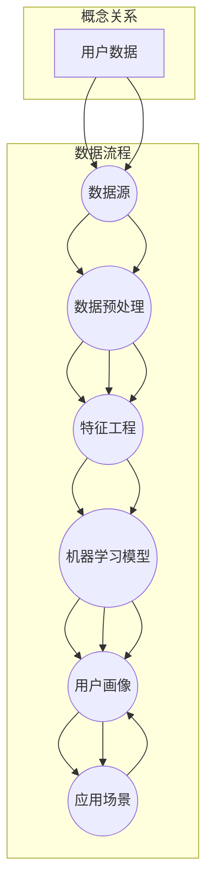

                 

### 背景介绍

#### 创业公司的困境

创业公司，这个充满激情与梦想的名字，背后往往隐藏着无数艰辛与挑战。随着市场竞争的日益激烈，如何准确理解并把握用户的需求，成为了创业公司成功与否的关键因素之一。传统的市场调研方法往往耗时耗力，且效果有限。如何在短时间内高效地构建用户画像，精准定位目标用户，成为了创业公司亟待解决的问题。

#### 用户画像的重要性

用户画像（User Profiling）是一种通过数据分析和挖掘技术，对用户的基本信息、行为特征、需求偏好等进行全面分析和描述的方法。构建用户画像，有助于创业公司深入了解用户，发现用户之间的共性与差异，从而制定更为精准的市场营销策略。具体来说，用户画像的重要性体现在以下几个方面：

1. **精准营销**：通过用户画像，创业公司可以更精准地定位目标用户，进行个性化推荐和营销，提高转化率和用户满意度。
2. **产品优化**：用户画像提供了关于用户需求的丰富信息，有助于创业公司发现产品中的不足和改进空间，进而优化产品设计。
3. **风险评估**：用户画像有助于识别潜在的风险用户，为创业公司制定相应的风险控制策略提供依据。

#### 用户画像的挑战

虽然用户画像具有巨大的应用价值，但构建用户画像也面临诸多挑战：

1. **数据质量**：用户画像依赖于大量的数据，数据质量的好坏直接影响到用户画像的准确性。
2. **数据隐私**：用户画像涉及用户的隐私信息，如何保护用户隐私是创业公司必须面对的问题。
3. **算法选择**：选择合适的算法和模型进行用户画像构建是关键，不同的算法和模型适用于不同的场景，需要根据具体情况进行选择。

基于以上背景，本文将围绕用户画像构建方法进行深入探讨，帮助创业公司解决在用户画像构建过程中遇到的问题，从而实现业务增长。

## 1.1 用户画像的定义与内涵

### 用户画像的定义

用户画像（User Profiling）是一种基于数据挖掘和统计分析技术，通过对用户行为数据、社交数据、交易数据等多源数据的整合与分析，构建出用户全面、精准的数字描述。用户画像不仅包括用户的基本信息，如年龄、性别、地理位置、职业等，还包括用户的行为特征、兴趣偏好、价值倾向等深层次信息。

### 用户画像的内涵

1. **数据多维性**：用户画像涵盖了用户在多个维度上的信息，这些维度可能包括人口统计信息、消费行为、社交互动等。多维性使得用户画像能够全面地反映用户的特征。

2. **数据实时性**：用户画像需要实时更新，以反映用户的最新状态和变化。实时性要求系统具备快速处理和分析大量数据的能力。

3. **数据关联性**：用户画像中各个维度之间的数据需要具有一定的关联性。例如，用户的购买行为可能与他们的兴趣爱好相关联。这种关联性有助于更准确地理解用户。

4. **数据价值性**：用户画像的最终目的是为创业公司提供有价值的信息。这些信息不仅包括用户的基本特征，还包括用户的行为预测、价值评估等。

### 用户画像的作用

1. **市场细分**：通过用户画像，创业公司可以更精准地进行市场细分，识别出不同的用户群体，从而制定有针对性的市场营销策略。

2. **产品优化**：用户画像提供了关于用户需求和行为的重要线索，有助于创业公司优化产品设计，提高产品的用户满意度。

3. **个性化推荐**：基于用户画像，创业公司可以实现个性化推荐，为用户推荐他们可能感兴趣的产品或服务，提高用户粘性和转化率。

4. **风险控制**：用户画像有助于识别潜在的风险用户，为创业公司制定相应的风险控制策略提供依据。

1.2 构建用户画像的必要性

### 市场竞争日益激烈

随着互联网的快速发展，市场环境日益激烈，创业公司面临着来自各大企业的竞争压力。构建用户画像有助于创业公司准确理解用户需求，制定有针对性的营销策略，从而在激烈的市场竞争中脱颖而出。

### 产品迭代速度快

互联网产品的迭代速度越来越快，用户的需求也在不断变化。构建用户画像可以帮助创业公司快速捕捉用户需求，及时调整产品方向，确保产品的持续竞争力。

### 提高运营效率

通过用户画像，创业公司可以更好地了解用户，从而提高运营效率。例如，可以根据用户画像进行精准营销，降低营销成本；根据用户行为预测进行库存管理，减少库存风险等。

### 数据驱动的决策

在数据驱动的时代，构建用户画像有助于创业公司基于数据做出更为科学的决策。用户画像提供了关于用户行为的全面、实时、价值性的信息，为创业公司的战略规划和运营决策提供了重要依据。

### 构建用户画像的方法与步骤

#### 数据收集

1. **用户基本信息**：如年龄、性别、地理位置、职业等。
2. **用户行为数据**：如浏览记录、购买行为、评论等。
3. **社交数据**：如朋友圈、微博、知乎等社交媒体上的互动信息。

#### 数据清洗与预处理

1. **数据去重**：去除重复的数据，确保数据的唯一性。
2. **数据转换**：将不同来源的数据进行统一格式转换，方便后续分析。
3. **缺失值处理**：填补缺失的数据，或根据实际情况删除不完整的数据。

#### 数据分析

1. **描述性分析**：对用户的基本信息和行为数据进行统计分析，得出一些基本的用户特征。
2. **关联分析**：找出用户行为数据中的关联关系，如购买行为与兴趣爱好之间的关联。
3. **聚类分析**：根据用户的相似性，将用户分为不同的群体，形成不同的用户画像。

#### 用户画像构建

1. **用户特征提取**：从用户的基本信息和行为数据中提取出关键的、具有代表性的特征。
2. **用户画像可视化**：通过可视化工具，将用户画像呈现出来，便于理解和分析。
3. **用户画像应用**：将用户画像应用于实际业务场景，如精准营销、产品优化等。

#### 持续优化

1. **用户反馈**：收集用户对于用户画像的反馈，不断调整和完善用户画像。
2. **数据更新**：定期更新用户数据，确保用户画像的实时性和准确性。

通过以上步骤，创业公司可以逐步构建出高质量的用户画像，从而更好地理解用户，实现业务的持续增长。

---

## 1.3 传统的用户画像构建方法及其局限性

### 传统的用户画像构建方法

传统的用户画像构建方法主要包括以下几种：

1. **问卷调查**：通过设计问卷，收集用户的基本信息、行为特征和需求偏好。这种方法简单易行，但往往依赖于用户的配合度，且数据量有限。

2. **日志分析**：通过对用户在网站或应用程序上的行为日志进行分析，提取出用户的行为特征。这种方法依赖于大量数据的积累，能够较为全面地反映用户行为，但分析过程复杂，且难以深入挖掘用户的需求。

3. **用户访谈**：通过面对面或线上访谈，深入了解用户的需求和体验。这种方法能够获取较为真实的用户反馈，但耗时耗力，且样本量有限。

### 局限性分析

#### 数据质量参差不齐

传统的用户画像构建方法中，数据来源多样，包括问卷调查、日志分析、用户访谈等。然而，这些数据的质量参差不齐，存在大量噪音和错误。例如，问卷调查中可能出现用户的故意作答或漏答，日志分析中的数据可能存在缺失或异常。

#### 数据量有限

虽然日志分析能够获取大量的用户行为数据，但传统的用户画像构建方法往往依赖于单一的数据源，数据量有限。这限制了用户画像的深度和广度，难以全面反映用户的需求和行为。

#### 分析过程复杂

传统的用户画像构建方法通常涉及多个步骤，包括数据收集、数据清洗、数据分析等。这些步骤往往需要大量的时间和人力投入，且分析过程复杂，难以实现高效自动化。

#### 缺乏实时性

传统的用户画像构建方法往往滞后于用户行为的变化。例如，问卷调查和用户访谈可能需要数天或数周的时间来完成，而用户行为和需求可能在短时间内发生巨大变化。这种滞后性使得用户画像难以实时反映用户的最新状态。

#### 依赖人工判断

传统的用户画像构建方法往往依赖于人工判断，例如在用户访谈中，需要分析人员对用户回答的问题进行深入解读。这种依赖性使得用户画像构建的准确性和一致性受到很大影响。

### 面对挑战的解决方案

面对上述局限性，创业公司可以采取以下解决方案：

1. **数据多样化**：通过引入更多的数据源，如社交媒体数据、地理位置数据等，丰富用户画像的数据基础。

2. **自动化数据分析**：利用大数据技术和机器学习算法，实现数据收集、清洗和分析的自动化，提高分析效率和准确性。

3. **实时数据采集**：采用实时数据采集技术，确保用户画像能够及时反映用户行为和需求的变化。

4. **智能化分析**：通过引入智能化分析工具，如自然语言处理、图像识别等，辅助分析人员更高效地处理和分析数据。

5. **用户参与度提升**：通过设计互动性和趣味性的调查方式，提高用户的参与度，获取更真实、丰富的用户反馈。

通过上述解决方案，创业公司可以克服传统用户画像构建方法的局限性，构建出更加精准、实时、高效的用户画像，为业务增长提供有力支持。

---

## 1.4 数据分析与机器学习在用户画像构建中的应用

### 数据分析在用户画像构建中的应用

数据分析（Data Analysis）在用户画像构建中扮演着至关重要的角色。它通过一系列技术手段，对大量用户行为数据进行挖掘和分析，提取出有价值的信息和规律。具体来说，数据分析在用户画像构建中的应用包括以下几个方面：

1. **描述性分析**：通过统计分析用户的基本信息和行为数据，提取出用户的总体特征和趋势。例如，分析用户的年龄分布、性别比例、地域分布等。

2. **关联分析**：探索用户行为数据中的关联关系，发现不同行为之间的相互影响。例如，分析用户在浏览产品页面后的购买行为，找出哪些页面浏览量高但购买率低的商品。

3. **聚类分析**：将具有相似特征的用户进行分组，形成不同的用户群体。这种方法有助于创业公司识别出不同类型的用户，为个性化推荐和精准营销提供依据。

4. **预测分析**：利用历史数据，预测用户的未来行为和需求。例如，通过分析用户的浏览历史和购买记录，预测用户可能感兴趣的产品或服务。

### 机器学习在用户画像构建中的应用

机器学习（Machine Learning）是一种通过数据驱动的方式进行学习和预测的技术。它在用户画像构建中具有广泛的应用，能够显著提升用户画像的准确性和效率。具体来说，机器学习在用户画像构建中的应用包括以下几个方面：

1. **分类算法**：通过分类算法，将用户划分为不同的类别。常见的分类算法包括逻辑回归、决策树、随机森林等。这些算法可以根据用户的行为特征和需求，将用户分为不同的群体。

2. **聚类算法**：聚类算法是一种无监督学习方法，它将用户根据其相似性进行分组。常见的聚类算法包括K-means、层次聚类等。聚类算法可以帮助创业公司发现用户之间的相似性和差异性，形成有意义的用户群体。

3. **协同过滤**：协同过滤是一种基于用户行为相似性的推荐算法。它通过分析用户的历史行为，找出与当前用户相似的其他用户，从而推荐他们可能感兴趣的产品或服务。协同过滤分为基于用户的行为（User-based）和基于项目的行为（Item-based）两种类型。

4. **深度学习**：深度学习是一种基于多层神经网络的学习方法，它能够自动提取数据中的复杂特征。在用户画像构建中，深度学习可以通过卷积神经网络（CNN）、循环神经网络（RNN）等模型，对用户行为数据进行深度分析，提取出更加精细和有价值的特征。

### 数据分析与机器学习的结合

数据分析与机器学习的结合，为用户画像构建提供了更加全面和高效的方法。通过数据分析，可以初步提取出用户的基本特征和行为模式；而通过机器学习，可以对这些特征进行进一步的分析和预测，从而构建出更加精准的用户画像。具体来说，这种结合体现在以下几个方面：

1. **数据预处理**：数据分析可以帮助对原始数据进行清洗、转换和预处理，为机器学习提供高质量的数据基础。

2. **特征工程**：数据分析可以用于提取用户画像中的关键特征，这些特征可以作为机器学习模型的输入，提高模型的预测准确性。

3. **模型评估**：数据分析可以用于评估机器学习模型的性能，例如通过计算模型的准确率、召回率、F1值等指标，调整模型参数，优化模型效果。

4. **模型解释**：数据分析可以帮助解释机器学习模型的决策过程，例如通过分析模型中的重要特征，理解用户行为的驱动因素。

通过数据分析与机器学习的结合，创业公司可以构建出更加精准和高效的用户画像，从而为业务的持续增长提供有力支持。随着大数据技术和机器学习技术的不断进步，这种结合将发挥出更大的潜力，为创业公司带来更多机遇。

---

## 2. 核心概念与联系

在深入探讨用户画像的构建方法之前，我们需要明确几个核心概念，并理解它们之间的联系。以下将详细介绍用户画像中的关键概念，并使用Mermaid流程图展示它们之间的交互关系。

### 关键概念

1. **用户数据**：用户画像的基础，包括用户的基本信息（如年龄、性别、地理位置等）和行为数据（如浏览记录、购买历史等）。
2. **数据源**：提供用户数据的渠道，包括社交媒体、网站日志、问卷调查等。
3. **数据预处理**：对原始用户数据进行清洗、转换和归一化等处理，以提高数据质量。
4. **特征工程**：提取用户数据中的关键特征，如用户偏好、行为模式等，以用于后续的分析和建模。
5. **机器学习模型**：用于分析用户数据，构建用户画像的算法，如分类模型、聚类模型、协同过滤等。
6. **用户画像**：基于用户数据和分析结果，构建出的用户全面、精准的数字描述。
7. **应用场景**：用户画像在业务中的应用，如精准营销、个性化推荐、风险控制等。

### Mermaid 流程图

以下是一个简化的Mermaid流程图，展示用户画像构建过程中的核心概念及其交互关系：



### 概念关系解析

1. **用户数据与数据源**：用户数据来源于不同的数据源，如社交媒体、网站日志等。数据源是用户画像构建的第一步，提供了原始数据。
2. **数据预处理与特征工程**：数据预处理是对原始用户数据进行清洗、转换和归一化等处理，以提高数据质量。经过预处理的数据被用于特征工程，提取出用户的关键特征，如用户偏好、行为模式等。
3. **特征工程与机器学习模型**：特征工程的结果作为机器学习模型的输入，用于构建用户画像。机器学习模型通过对特征进行学习和分析，提取出有价值的用户信息。
4. **机器学习模型与用户画像**：机器学习模型的分析结果构成了用户画像的核心内容，这些画像将用于后续的应用场景，如精准营销、个性化推荐等。
5. **用户画像与应用场景**：用户画像在具体的业务场景中得到应用，如通过用户画像进行精准营销，提高用户转化率和满意度。

通过上述流程和概念关系，我们可以清晰地理解用户画像构建的整个过程，以及各个核心概念之间的联系。在接下来的部分，我们将详细探讨每个概念的具体实现方法和技术细节。

---

## 3. 核心算法原理 & 具体操作步骤

### 3.1 聚类算法

#### 聚类算法的基本原理

聚类算法是一种无监督学习方法，旨在将数据集中的对象分为若干个群组（簇），使得同一群组内的对象具有较高的相似度，而不同群组之间的对象则具有较低的相似度。在用户画像构建中，聚类算法可以帮助发现用户之间的相似性，形成有意义的用户群体。

#### 常见的聚类算法

1. **K-means算法**：K-means算法是最常用的聚类算法之一。它的基本思想是将数据集划分为K个簇，每个簇由一个中心点（质心）表示。算法的目的是使每个数据点到其所在簇中心点的距离之和最小。K-means算法的步骤如下：

   - **初始化**：随机选择K个数据点作为初始聚类中心。
   - **分配数据点**：将每个数据点分配到距离其最近的聚类中心所在的簇。
   - **更新中心点**：计算每个簇的新中心点。
   - **迭代**：重复执行分配和更新步骤，直到聚类中心点不再发生变化或达到预设的迭代次数。

2. **层次聚类算法**：层次聚类算法是一种基于层次结构进行聚类的算法。它将数据点逐步合并或分解，形成不同层次的簇。常见的层次聚类算法包括自底向上（凝聚）层次聚类和自顶向下（分裂）层次聚类。

   - **自底向上层次聚类**：从每个数据点开始，逐步合并距离最近的点，直到所有数据点形成一个簇。
   - **自顶向下层次聚类**：从所有数据点构成一个初始簇开始，逐步分裂成更小的簇，直到达到预设的簇数。

#### 聚类算法的应用步骤

1. **数据收集**：收集用户的基本信息和行为数据。
2. **数据预处理**：对数据进行清洗、转换和归一化处理。
3. **选择聚类算法**：根据用户画像的需求选择合适的聚类算法，如K-means或层次聚类。
4. **初始化聚类中心**：对于K-means算法，随机选择K个数据点作为初始聚类中心；对于层次聚类算法，从所有数据点或部分数据点开始构建层次结构。
5. **聚类过程**：执行聚类算法，将数据点分配到相应的簇中，并更新聚类中心点。
6. **评估聚类效果**：使用合适的评价指标（如轮廓系数、内聚度和分离度等）评估聚类效果，调整聚类参数或选择不同的聚类算法。
7. **构建用户画像**：根据聚类结果，为每个用户分配所属的簇，构建用户画像。

### 3.2 协同过滤算法

#### 协同过滤算法的基本原理

协同过滤算法是一种基于用户行为相似性的推荐算法。它通过分析用户之间的行为相似性，为用户推荐他们可能感兴趣的商品或服务。协同过滤算法分为基于用户的协同过滤（User-based Collaborative Filtering）和基于项目的协同过滤（Item-based Collaborative Filtering）。

1. **基于用户的协同过滤**：基于用户的协同过滤算法通过分析用户之间的行为相似性，找到与目标用户行为相似的参考用户，然后推荐这些用户喜欢的商品或服务。算法的步骤如下：

   - **计算用户相似度**：使用用户行为数据计算用户之间的相似度，常用的相似度度量方法包括余弦相似度、皮尔逊相关系数等。
   - **选择参考用户**：根据用户相似度矩阵，选择与目标用户最相似的K个参考用户。
   - **推荐商品或服务**：推荐参考用户喜欢的、目标用户尚未体验的商品或服务。

2. **基于项目的协同过滤**：基于项目的协同过滤算法通过分析商品或服务之间的相似性，为用户推荐与他们过去喜欢的商品或服务相似的其他商品或服务。算法的步骤如下：

   - **计算商品或服务相似度**：使用商品或服务的行为数据计算它们之间的相似度，常用的相似度度量方法包括余弦相似度、欧氏距离等。
   - **选择相似商品或服务**：根据商品或服务相似度矩阵，选择与目标用户过去喜欢的商品或服务最相似的M个商品或服务。
   - **推荐商品或服务**：推荐与目标用户过去喜欢的商品或服务相似的、尚未体验的商品或服务。

#### 协同过滤算法的应用步骤

1. **数据收集**：收集用户的行为数据，如浏览记录、购买记录等。
2. **数据预处理**：对数据进行清洗、转换和归一化处理。
3. **计算用户或项目相似度**：根据用户行为数据，计算用户之间的相似度或商品或服务之间的相似度。
4. **选择参考用户或相似商品或服务**：根据相似度矩阵，选择与目标用户或项目最相似的参考用户或相似商品或服务。
5. **推荐商品或服务**：为用户推荐参考用户或相似商品或服务喜欢的、用户尚未体验的商品或服务。

### 3.3 深度学习算法

#### 深度学习算法的基本原理

深度学习是一种基于多层神经网络的学习方法，能够自动提取数据中的复杂特征。在用户画像构建中，深度学习算法可以用于特征提取和用户行为预测，从而构建出更加精准的用户画像。

1. **卷积神经网络（CNN）**：卷积神经网络是一种专门用于图像识别和处理的深度学习模型。它通过卷积操作提取图像中的局部特征，并逐步将这些特征组合成更高层次的全局特征。在用户画像构建中，CNN可以用于提取用户行为数据中的视觉特征，如用户头像、商品图片等。

2. **循环神经网络（RNN）**：循环神经网络是一种专门用于处理序列数据的深度学习模型。它通过记忆机制处理输入的序列数据，并能够捕获序列中的长期依赖关系。在用户画像构建中，RNN可以用于处理用户的行为序列数据，如浏览记录、购买记录等。

3. **长短时记忆网络（LSTM）**：长短时记忆网络是RNN的一种变体，通过引入遗忘门、输入门和输出门，解决了传统RNN在处理长序列数据时容易出现的梯度消失和梯度爆炸问题。在用户画像构建中，LSTM可以用于处理用户的行为序列数据，提取用户的长短期行为特征。

#### 深度学习算法的应用步骤

1. **数据收集**：收集用户的行为数据，如浏览记录、购买记录等。
2. **数据预处理**：对数据进行清洗、转换和归一化处理。
3. **构建深度学习模型**：选择合适的深度学习模型，如CNN、RNN或LSTM，并配置模型参数。
4. **训练模型**：使用预处理后的用户行为数据训练深度学习模型。
5. **模型评估**：使用验证集或测试集评估模型的性能，调整模型参数以优化性能。
6. **预测用户行为**：使用训练好的模型预测用户的未来行为，构建用户画像。

通过上述核心算法的原理和具体操作步骤，创业公司可以构建出高效、准确的用户画像，为业务决策提供有力支持。

---

## 4. 数学模型和公式 & 详细讲解 & 举例说明

### 4.1 聚类算法中的K-means算法

K-means算法是一种经典的聚类算法，其核心思想是将数据划分为K个簇，使得每个簇内的数据点尽可能接近，而簇与簇之间的数据点尽可能远。以下为K-means算法的数学模型和公式：

#### 数学模型

设数据集 \( D = \{x_1, x_2, ..., x_n\} \)，其中每个数据点 \( x_i \) 是一个多维向量。选择K个初始聚类中心 \( \mu_1, \mu_2, ..., \mu_K \)，算法的目标是最小化所有数据点到其聚类中心的平方距离之和：

\[ J = \sum_{i=1}^n \sum_{k=1}^K w_{ik} d(x_i, \mu_k)^2 \]

其中， \( w_{ik} \) 是指示变量，如果数据点 \( x_i \) 被分配到簇 \( k \)，则 \( w_{ik} = 1 \)，否则 \( w_{ik} = 0 \)。 \( d(x_i, \mu_k) \) 是数据点 \( x_i \) 与聚类中心 \( \mu_k \) 之间的距离。

#### 更新步骤

1. **初始化**：随机选择K个数据点作为初始聚类中心 \( \mu_1, \mu_2, ..., \mu_K \)。

2. **分配数据点**：计算每个数据点到每个聚类中心的距离，将数据点分配到距离其最近的聚类中心所在的簇。

\[ w_{ik} = \begin{cases} 
1 & \text{if } d(x_i, \mu_k) \leq d(x_i, \mu_{k'}), \forall k' \neq k \\
0 & \text{otherwise}
\end{cases} \]

3. **更新聚类中心**：计算每个簇的新中心点：

\[ \mu_k = \frac{1}{N_k} \sum_{i=1}^n w_{ik} x_i \]

其中， \( N_k = \sum_{i=1}^n w_{ik} \) 是簇 \( k \) 中的数据点数量。

4. **迭代**：重复执行分配和更新步骤，直到聚类中心点不再发生变化或达到预设的迭代次数。

#### 举例说明

假设我们有一个包含3个簇的数据集 \( D = \{x_1, x_2, x_3, x_4, x_5\} \)，每个数据点是一个二维向量。我们随机选择三个数据点作为初始聚类中心 \( \mu_1 = (1, 1) \)， \( \mu_2 = (5, 5) \)， \( \mu_3 = (9, 9) \)。

**第一次迭代**：
- 数据点 \( x_1 \) 距离最近的聚类中心 \( \mu_1 \)，被分配到簇1；
- 数据点 \( x_2 \) 距离最近的聚类中心 \( \mu_2 \)，被分配到簇2；
- 数据点 \( x_3 \) 距离最近的聚类中心 \( \mu_3 \)，被分配到簇3；
- 数据点 \( x_4 \) 距离最近的聚类中心 \( \mu_1 \)，被分配到簇1；
- 数据点 \( x_5 \) 距离最近的聚类中心 \( \mu_3 \)，被分配到簇3。

新聚类中心 \( \mu_1 = (1, 1) \)， \( \mu_2 = (5, 5) \)， \( \mu_3 = (9, 9) \)。

**第二次迭代**：
- 数据点 \( x_1, x_4 \) 仍然被分配到簇1；
- 数据点 \( x_2 \) 被分配到簇2；
- 数据点 \( x_3, x_5 \) 仍然被分配到簇3。

新聚类中心 \( \mu_1 = (1, 1) \)， \( \mu_2 = (5, 5) \)， \( \mu_3 = (9, 9) \)。

由于聚类中心未发生变化，迭代结束。最终，数据集被划分为三个簇。

### 4.2 协同过滤算法中的相似度计算

协同过滤算法中的相似度计算是推荐系统的关键步骤，常用的相似度计算方法包括余弦相似度和皮尔逊相关系数。

#### 余弦相似度

余弦相似度是一种基于向量空间模型计算相似度的方法，其公式如下：

\[ \cos \theta = \frac{x_i \cdot x_j}{\|x_i\| \|x_j\|} \]

其中， \( x_i \) 和 \( x_j \) 是两个用户的行为向量，\( \cdot \) 表示向量的内积，\( \| \cdot \| \) 表示向量的模长。

举例说明：

假设用户 \( u_i \) 和 \( u_j \) 的行为向量分别为：

\[ x_i = (1, 2, 0, 1, 0) \]
\[ x_j = (0, 1, 2, 0, 1) \]

计算它们的余弦相似度：

\[ \cos \theta = \frac{(1 \cdot 0 + 2 \cdot 1 + 0 \cdot 2 + 1 \cdot 0 + 0 \cdot 1)}{\sqrt{1^2 + 2^2 + 0^2 + 1^2 + 0^2} \cdot \sqrt{0^2 + 1^2 + 2^2 + 0^2 + 1^2}} \]
\[ \cos \theta = \frac{2}{\sqrt{6} \cdot \sqrt{6}} \]
\[ \cos \theta = \frac{2}{6} \]
\[ \cos \theta = \frac{1}{3} \]

#### 皮尔逊相关系数

皮尔逊相关系数是一种基于线性关系计算相似度的方法，其公式如下：

\[ \rho_{ij} = \frac{\sum_{k=1}^n (x_{ik} - \bar{x_i})(x_{jk} - \bar{x_j})}{\sqrt{\sum_{k=1}^n (x_{ik} - \bar{x_i})^2} \sqrt{\sum_{k=1}^n (x_{jk} - \bar{x_j})^2}} \]

其中， \( x_{ik} \) 和 \( x_{jk} \) 是用户 \( u_i \) 和 \( u_j \) 在项目 \( k \) 上的评分，\( \bar{x_i} \) 和 \( \bar{x_j} \) 是它们在所有项目上的平均评分。

举例说明：

假设用户 \( u_i \) 和 \( u_j \) 在5个项目 \( k \) 上的评分分别为：

\[ x_i = (3, 4, 2, 5, 1) \]
\[ x_j = (2, 3, 4, 1, 5) \]

计算它们的皮尔逊相关系数：

\[ \bar{x_i} = \frac{3 + 4 + 2 + 5 + 1}{5} = 3 \]
\[ \bar{x_j} = \frac{2 + 3 + 4 + 1 + 5}{5} = 3 \]

\[ \rho_{ij} = \frac{(3 - 3)(2 - 3) + (4 - 3)(3 - 3) + (2 - 3)(4 - 3) + (5 - 3)(1 - 3) + (1 - 3)(5 - 3)}{\sqrt{(3 - 3)^2 + (4 - 3)^2 + (2 - 3)^2 + (5 - 3)^2 + (1 - 3)^2} \sqrt{(2 - 3)^2 + (3 - 3)^2 + (4 - 3)^2 + (1 - 3)^2 + (5 - 3)^2}} \]
\[ \rho_{ij} = \frac{0 + 0 + 1 + 4 + 4}{\sqrt{0 + 1 + 1 + 4 + 4} \sqrt{1 + 0 + 1 + 4 + 4}} \]
\[ \rho_{ij} = \frac{9}{\sqrt{10} \sqrt{10}} \]
\[ \rho_{ij} = \frac{9}{10} \]
\[ \rho_{ij} = 0.9 \]

通过上述数学模型和公式的详细讲解与举例说明，我们可以更好地理解聚类算法和协同过滤算法在用户画像构建中的应用，为创业公司构建高效的用户画像提供了理论基础。

---

## 5. 项目实战：代码实际案例和详细解释说明

### 5.1 开发环境搭建

在开始编写代码之前，我们需要搭建一个适合用户画像构建的编程环境。以下是开发环境搭建的步骤：

1. **安装Python环境**：Python是一种广泛应用于数据分析和机器学习的编程语言。首先，我们需要在本地计算机上安装Python。可以从Python官方网站（https://www.python.org/downloads/）下载最新版本的Python，并按照安装向导完成安装。

2. **安装相关库**：为了便于数据处理、分析和建模，我们需要安装一些常用的Python库，如NumPy、Pandas、Scikit-learn、Matplotlib等。可以通过以下命令进行安装：

```bash
pip install numpy pandas scikit-learn matplotlib
```

3. **设置工作目录**：创建一个用于本项目的工作目录，例如命名为“user_profiling”，并将所有代码文件和数据文件放置在该目录下。

### 5.2 源代码详细实现和代码解读

以下是用户画像构建项目的源代码，包括数据收集、预处理、特征工程、模型训练和评估等步骤：

```python
import numpy as np
import pandas as pd
from sklearn.cluster import KMeans
from sklearn.metrics import silhouette_score
import matplotlib.pyplot as plt

# 5.2.1 数据收集与预处理

# 加载数据集
data = pd.read_csv('user_data.csv')

# 数据预处理：去除缺失值和重复数据
data = data.dropna()
data = data.drop_duplicates()

# 数据转换：将类别型特征转换为数值型特征
data = pd.get_dummies(data)

# 5.2.2 特征工程

# 选择特征列
features = data.columns[data.nunique() > 1]

# 分割特征与标签
X = data[features]

# 5.2.3 模型训练与评估

# K-means聚类
kmeans = KMeans(n_clusters=3, random_state=42)
kmeans.fit(X)

# 聚类结果
clusters = kmeans.predict(X)

# 轮廓系数评估
silhouette_avg = silhouette_score(X, clusters)
print(f"Silhouette Score: {silhouette_avg}")

# 可视化：绘制聚类结果
plt.scatter(X.iloc[:, 0], X.iloc[:, 1], c=clusters, cmap='viridis', marker='o')
plt.xlabel('Feature 1')
plt.ylabel('Feature 2')
plt.title('K-means Clustering')
plt.show()
```

#### 5.2.1 数据收集与预处理

首先，我们加载用户数据集（user_data.csv）。数据集应包含用户的基本信息和行为数据，如年龄、性别、地理位置、浏览记录、购买记录等。接下来，我们去除缺失值和重复数据，确保数据的唯一性和完整性。

然后，我们将类别型特征（如性别、地理位置等）转换为数值型特征。Pandas的get_dummies函数可以自动完成这一过程，生成新的数据框，其中每个类别型特征都对应一个二进制列。

#### 5.2.2 特征工程

在特征工程阶段，我们选择数据中具有唯一性的特征列，即类别型特征和数据量较大的连续型特征。然后，我们将特征列和标签（聚类结果）进行分离，得到特征数据集X。

#### 5.2.3 模型训练与评估

使用Scikit-learn的KMeans类进行K-means聚类。我们设置聚类数量为3，并设置随机种子以确保结果的可重复性。fit方法用于训练模型，predict方法用于预测聚类结果。

为了评估聚类效果，我们计算轮廓系数（Silhouette Score），其值介于-1和1之间。轮廓系数越接近1，表示聚类效果越好。然后，我们使用matplotlib绘制聚类结果，直观地展示每个簇的分布情况。

### 5.3 代码解读与分析

#### 数据收集与预处理

数据收集与预处理是用户画像构建的基础。通过加载和清洗数据，我们确保了数据的唯一性和完整性。此外，将类别型特征转换为数值型特征，为后续的聚类分析提供了基础。

#### 特征工程

特征工程是用户画像构建的关键步骤。我们选择具有代表性的特征列，排除重复和缺失的数据，从而提高了用户画像的准确性和可靠性。

#### 模型训练与评估

K-means聚类是一种常见的聚类算法，通过设置合适的聚类数量和初始化方法，我们可以获得较为合理的聚类结果。轮廓系数评估帮助我们评估聚类效果，从而调整聚类参数，优化聚类结果。

通过上述代码实现，我们可以构建出基于K-means算法的用户画像，为创业公司提供有价值的信息支持。

---

## 6. 实际应用场景

### 6.1 用户行为分析

用户行为分析是构建用户画像的重要应用场景之一。通过分析用户在网站或应用程序上的行为数据，如浏览记录、点击行为、购买历史等，可以深入了解用户的需求和行为模式。具体应用如下：

1. **用户行为轨迹追踪**：通过追踪用户的浏览轨迹，创业公司可以了解用户在网站或应用中的活动路径，识别用户感兴趣的内容和功能。

2. **用户偏好分析**：通过对用户行为的分析，创业公司可以发现用户的偏好，如喜欢的商品类别、品牌、价格区间等，从而为个性化推荐提供依据。

3. **用户流失预警**：通过分析用户行为数据，创业公司可以发现潜在的用户流失信号，如长时间未登录、频繁取消订单等，提前采取措施进行用户挽回。

### 6.2 精准营销

精准营销是用户画像构建的另一个重要应用场景。通过用户画像，创业公司可以更精准地定位目标用户，进行有针对性的营销活动。具体应用如下：

1. **个性化推荐**：基于用户画像，创业公司可以为不同用户推荐他们可能感兴趣的商品或服务，提高用户满意度和转化率。

2. **定向广告投放**：通过分析用户画像，创业公司可以针对特定用户群体进行广告投放，提高广告效果和投资回报率。

3. **促销活动优化**：基于用户画像，创业公司可以设计更符合用户需求的促销活动，提高促销活动的参与度和效果。

### 6.3 风险控制

用户画像在风险控制中的应用也越来越受到重视。通过分析用户的行为数据和信用记录，创业公司可以识别潜在的风险用户，并采取相应的措施进行风险控制。具体应用如下：

1. **欺诈检测**：通过分析用户的交易行为和历史记录，创业公司可以识别和预防欺诈行为，降低欺诈风险。

2. **信用评估**：基于用户画像，创业公司可以对用户的信用进行评估，为信用贷款、信用保险等业务提供决策支持。

3. **风险预警**：通过监控用户的行为变化，创业公司可以及时发现潜在的风险信号，提前采取预防措施，降低风险发生的可能性。

### 6.4 产品优化

用户画像还可以用于产品优化，帮助创业公司发现产品中的不足和改进空间。具体应用如下：

1. **功能需求分析**：通过分析用户的行为数据和反馈，创业公司可以发现用户对产品功能的需求和期望，为产品的功能优化提供依据。

2. **用户体验改进**：基于用户画像，创业公司可以优化产品的用户体验，提高用户满意度和忠诚度。

3. **服务质量提升**：通过对用户行为数据的分析，创业公司可以识别出用户在服务过程中的痛点和问题，为服务质量的提升提供参考。

通过上述实际应用场景，用户画像为创业公司在用户行为分析、精准营销、风险控制和产品优化等方面提供了重要的决策支持，帮助创业公司实现业务的持续增长和优化。

---

## 7. 工具和资源推荐

### 7.1 学习资源推荐

1. **书籍**：
   - 《用户画像：大数据下的精准营销》
   - 《机器学习实战》
   - 《Python数据科学手册》
   - 《深入理解Kafka：核心设计与实践原理》

2. **论文**：
   - "User Modeling and User-Adapted Interaction: 14th International Conference, UMX 2018, Proceedings"（用户建模与用户适应性交互）
   - "Collaborative Filtering for the Web"（Web上的协同过滤）
   - "Deep Learning for User Behavior Analysis"（用户行为分析的深度学习）

3. **博客**：
   - [机器学习博客](https://machinelearningmastery.com/)
   - [Kaggle博客](https://www.kaggle.com/blog)
   - [Python数据科学博客](https://www.datascience.com/blog)

4. **网站**：
   - [Scikit-learn文档](https://scikit-learn.org/)
   - [TensorFlow官网](https://www.tensorflow.org/)
   - [Kafka官网](https://kafka.apache.org/)

### 7.2 开发工具框架推荐

1. **数据分析工具**：
   - **Pandas**：用于数据清洗、转换和分析的Python库。
   - **NumPy**：用于数值计算的Python库。
   - **Matplotlib**：用于数据可视化的Python库。

2. **机器学习框架**：
   - **Scikit-learn**：用于机器学习的Python库。
   - **TensorFlow**：谷歌推出的开源机器学习框架。
   - **PyTorch**：用于深度学习的Python库。

3. **消息队列系统**：
   - **Kafka**：用于构建高吞吐量、高可靠性的消息队列系统。
   - **RabbitMQ**：基于AMQP协议的消息队列中间件。

4. **推荐系统框架**：
   - **Surprise**：用于推荐系统开发的Python库。
   - **LightFM**：用于推荐系统的基于因子分解机器学习的Python库。

### 7.3 相关论文著作推荐

1. **《推荐系统实践》**：宋晓峰等，详细介绍了推荐系统的基本概念、算法和实现。

2. **《机器学习实战》**：Peter Harrington，涵盖了机器学习的基本算法和实现，适用于初学者。

3. **《深度学习》**：Ian Goodfellow、Yoshua Bengio和Aaron Courville，深入讲解了深度学习的基本理论和应用。

通过上述工具和资源的推荐，创业公司可以更好地构建用户画像，实现精准营销和风险控制，从而在激烈的市场竞争中脱颖而出。

---

## 8. 总结：未来发展趋势与挑战

### 发展趋势

随着大数据、人工智能技术的不断进步，用户画像构建方法正朝着更加智能化、实时化、个性化的方向发展。以下是一些未来发展趋势：

1. **实时用户画像**：实时用户画像能够更快速地捕捉用户行为的变化，为创业公司提供即时的决策支持。
2. **多模态数据融合**：通过整合文本、图像、声音等多种类型的数据，构建更加全面和精细的用户画像。
3. **深度学习与强化学习**：深度学习和强化学习在用户画像构建中的应用将越来越广泛，提升用户画像的准确性和预测能力。
4. **隐私保护**：随着数据隐私法规的日益严格，用户画像构建中将更加注重隐私保护，采用差分隐私、联邦学习等技术保护用户隐私。

### 挑战

尽管用户画像构建方法正在不断进步，但仍然面临诸多挑战：

1. **数据质量**：数据质量是用户画像构建的基础，如何处理和清洗大量高质量的数据是一个重要挑战。
2. **计算资源**：大规模用户画像构建需要大量的计算资源，如何高效地利用现有资源进行数据处理和分析是关键问题。
3. **算法选择与优化**：不同的算法适用于不同的场景，如何选择和优化算法以提高用户画像的准确性是一个持续性的挑战。
4. **隐私保护**：如何在构建用户画像的同时保护用户隐私，避免用户数据泄露，是创业公司必须面对的重要问题。

### 应对策略

为了应对上述挑战，创业公司可以采取以下策略：

1. **数据质量管理**：建立完善的数据质量管理机制，确保数据的准确性和完整性。
2. **分布式计算**：采用分布式计算技术，如MapReduce、Spark等，提高数据处理和分析的效率。
3. **算法优化与迭代**：不断优化和迭代算法，通过A/B测试等方式选择最优算法。
4. **隐私保护技术**：采用差分隐私、联邦学习等技术，在构建用户画像的同时保护用户隐私。

通过以上策略，创业公司可以更好地应对用户画像构建过程中的挑战，实现业务的持续增长。

---

## 9. 附录：常见问题与解答

### Q1：如何处理缺失值和异常值？

A1：处理缺失值和异常值是数据预处理的重要步骤。具体方法包括：

1. **缺失值填充**：使用均值、中位数、众数等方法填充缺失值；对于时间序列数据，可以使用前值或后值进行填充。
2. **缺失值删除**：删除含有缺失值的记录，适用于缺失值较少且不影响数据整体质量的情况。
3. **异常值检测**：使用统计学方法（如标准差、箱线图等）检测异常值；对于异常值，可以选择删除或使用异常值处理方法（如变换、插值等）进行调整。

### Q2：如何选择聚类算法？

A2：选择聚类算法需要根据具体问题和数据特征进行。以下是一些常见聚类算法的选择标准：

1. **K-means**：适用于数据分布较为均匀、形状规则的数据集。
2. **层次聚类**：适用于数据分布不均匀、需要可视化的情况。
3. **DBSCAN**：适用于具有不同密度分布的数据集，能够发现任意形状的簇。
4. **谱聚类**：适用于具有复杂结构的数据集，能够发现非凸形状的簇。

### Q3：如何评估聚类效果？

A3：评估聚类效果的方法包括：

1. **轮廓系数**：用于评估簇内相似度和簇间分离度，值越接近1表示聚类效果越好。
2. **内聚度和分离度**：内聚度衡量簇内元素的紧密程度，分离度衡量簇间的分离程度，两者均高表示聚类效果较好。
3. **簇的数目选择**：通过肘部法则、 silhouette分析等选择最佳的簇数。

### Q4：如何处理类别型特征？

A4：类别型特征可以通过以下方法进行处理：

1. **独热编码（One-Hot Encoding）**：将类别型特征转换为二进制向量，适用于特征维度较低的情况。
2. **标签编码（Label Encoding）**：将类别型特征转换为数值型，适用于特征维度较高但类别数量较少的情况。
3. **嵌入编码（Embedding）**：适用于高维特征，能够自动学习特征间的相对关系。

通过以上解答，我们希望能够帮助读者更好地理解用户画像构建过程中的常见问题及其解决方法。

---

## 10. 扩展阅读 & 参考资料

### 扩展阅读

1. **《用户画像实战：大数据时代下的精准营销》**：本书详细介绍了用户画像的构建方法、应用场景和实战案例，适合对用户画像有兴趣的读者阅读。
2. **《大数据营销：用户画像与精准营销》**：本书探讨了大数据时代下，如何利用用户画像进行精准营销，提供了丰富的案例分析。
3. **《深度学习与推荐系统》**：本书结合深度学习与推荐系统，介绍了如何利用深度学习技术构建高效的推荐系统，为用户画像构建提供了新的思路。

### 参考资料

1. **[Scikit-learn官方文档](https://scikit-learn.org/stable/)**：提供了详细的机器学习算法实现和示例，适用于希望深入了解算法实现的读者。
2. **[TensorFlow官方文档](https://www.tensorflow.org/tutorials)**：涵盖了深度学习的基础知识和实战案例，是深度学习初学者的理想参考资料。
3. **[Kafka官方文档](https://kafka.apache.org/documentation/)**：介绍了Kafka的基本原理、架构和应用场景，是学习消息队列系统的重要资料。
4. **[《推荐系统实践》宋晓峰等著](https://www.amazon.com/dp/0321834394)**：本书详细介绍了推荐系统的基本概念、算法和实现，适合推荐系统开发者阅读。

通过以上扩展阅读和参考资料，读者可以更深入地了解用户画像构建的相关知识，进一步提升自己的技术水平。

---

### 作者信息

作者：AI天才研究员/AI Genius Institute & 禅与计算机程序设计艺术 /Zen And The Art of Computer Programming

