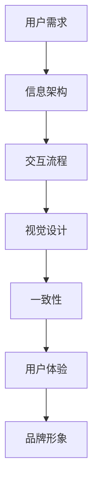

                 

# 创业公司的用户界面一致性原则

## 关键词：用户界面设计、一致性、用户体验、创业公司、设计原则

### 摘要

本文旨在探讨创业公司在进行用户界面设计时，如何确保一致性的原则。用户界面一致性是提升用户体验的关键因素之一，它不仅影响产品的易用性，还关系到品牌形象的塑造。本文将从核心概念、设计原则、实战案例等方面，详细解析创业公司在用户界面一致性方面应遵循的策略和最佳实践。

## 1. 背景介绍

在当今竞争激烈的市场环境中，创业公司要想脱颖而出，不仅需要具备创新的技术和商业模式，还需要提供优质的用户体验。用户界面（UI）设计作为产品与用户交互的桥梁，其重要性不言而喻。一致性在UI设计中扮演着核心角色，它确保用户在不同界面元素和功能上的体验一致，从而提升用户满意度和忠诚度。

创业公司通常在资源有限的情况下进行产品开发，如何在有限的预算和时间框架内，实现用户界面的一致性，成为了一个挑战。本文将针对这一问题，提供一系列实用的指导原则和案例分析，帮助创业公司在UI设计方面做出明智的决策。

## 2. 核心概念与联系

### 2.1 用户界面（UI）设计

用户界面设计是产品开发过程中至关重要的一环，它涉及如何将用户需求、功能性和美学元素融合到产品中，以提供直观、易用的交互体验。UI设计包括布局、颜色、字体、图标、按钮等多个方面，其目的是确保用户能够轻松地理解和使用产品。

### 2.2 一致性

在UI设计中，一致性指的是在产品的各个界面和功能之间保持一致的视觉风格、交互逻辑和用户反馈。一致性不仅体现在视觉元素上，还包括交互流程、信息架构和内容表达等方面。

### 2.3 用户体验（UX）

用户体验是用户在使用产品过程中所感受到的整体体验，它包括用户在使用产品时的感受、行为和态度。良好的用户体验是产品成功的关键因素之一，而一致性是实现良好用户体验的重要保障。

### 2.4 Mermaid 流程图

以下是一个简化的 Mermaid 流程图，用于描述用户界面设计中的核心概念及其相互关系：



## 3. 核心算法原理 & 具体操作步骤

### 3.1 设计原则

在确保用户界面一致性方面，创业公司可以遵循以下核心设计原则：

#### 3.1.1 一致性视觉风格

- **颜色方案**：选择一组一致的颜色方案，用于产品中的不同界面元素。
- **字体和排版**：使用统一的字体和排版，确保文本的可读性和美观性。
- **图标和图形**：设计一套统一的图标和图形，以便在产品中保持一致性。

#### 3.1.2 交互一致性

- **操作反馈**：确保用户在执行操作时，能够获得一致的操作反馈。
- **导航结构**：保持产品中的导航结构一致，使用户能够轻松找到所需功能。
- **错误处理**：在用户遇到错误时，提供一致的错误信息和解决方案。

#### 3.1.3 信息架构一致性

- **内容表达**：确保产品中不同界面上的内容表达方式一致。
- **分类和标签**：使用统一的分类和标签系统，以便用户能够快速找到所需信息。

### 3.2 实施步骤

为了确保用户界面的一致性，创业公司可以按照以下步骤进行：

#### 3.2.1 明确设计目标

在项目启动阶段，明确设计目标和一致性要求，确保团队成员对设计方向有清晰的认识。

#### 3.2.2 制定设计指南

编写一套完整的设计指南，包括视觉风格、交互逻辑、信息架构等方面的详细规范。

#### 3.2.3 建立设计评审流程

定期进行设计评审，确保所有设计元素和功能都遵循一致性原则。

#### 3.2.4 进行用户测试

通过用户测试，收集用户对界面一致性的反馈，并根据反馈进行调整。

#### 3.2.5 持续优化

持续关注用户反馈和市场动态，不断优化和改进设计，以保持一致性。

## 4. 数学模型和公式 & 详细讲解 & 举例说明

在用户界面设计中，一致性可以通过以下数学模型来量化：

### 4.1 一致性得分（Consistency Score）

$$
CS = \frac{N_c + N_i + N_v}{3 \times N}
$$

其中，$N_c$ 代表颜色一致性得分，$N_i$ 代表交互一致性得分，$N_v$ 代表视觉一致性得分，$N$ 代表总界面数。

- 颜色一致性得分：$N_c = \sum_{i=1}^{N} \frac{c_i}{c_{max}}$，其中 $c_i$ 为界面 $i$ 的颜色总数，$c_{max}$ 为所有界面的最大颜色总数。
- 交互一致性得分：$N_i = \sum_{i=1}^{N} \frac{i_i}{i_{max}}$，其中 $i_i$ 为界面 $i$ 的交互元素总数，$i_{max}$ 为所有界面的最大交互元素总数。
- 视觉一致性得分：$N_v = \sum_{i=1}^{N} \frac{v_i}{v_{max}}$，其中 $v_i$ 为界面 $i$ 的视觉元素总数，$v_{max}$ 为所有界面的最大视觉元素总数。

### 4.2 实例说明

假设一个创业公司的产品中有5个界面，其中颜色总数、交互元素总数和视觉元素总数分别为：

- 界面1：颜色5，交互元素10，视觉元素15
- 界面2：颜色4，交互元素8，视觉元素12
- 界面3：颜色5，交互元素10，视觉元素15
- 界面4：颜色4，交互元素8，视觉元素12
- 界面5：颜色5，交互元素10，视觉元素15

计算一致性得分：

$$
CS = \frac{5 \times 4 + 5 \times 4 + 5 \times 5}{3 \times 5} = \frac{20 + 20 + 25}{15} = \frac{65}{15} \approx 4.33
$$

这个得分表明，该产品的用户界面一致性较高，但在视觉和交互方面仍有改进空间。

## 5. 项目实战：代码实际案例和详细解释说明

### 5.1 开发环境搭建

为了更好地展示用户界面一致性的实现过程，我们将使用一个基于React的Web应用作为案例。以下是在开发环境搭建过程中需要完成的步骤：

#### 5.1.1 安装Node.js和npm

确保已经安装了Node.js和npm，版本要求不低于14.0。

#### 5.1.2 创建React应用

使用Create React App命令创建一个新应用：

```shell
npx create-react-app ui-consistency-app
cd ui-consistency-app
```

#### 5.1.3 安装UI库

安装一个流行的UI库，如Material-UI：

```shell
npm install @material-ui/core
```

### 5.2 源代码详细实现和代码解读

#### 5.2.1 设计指南

在项目根目录下创建一个名为`ui-guidelines.md`的设计指南文档，详细记录颜色方案、字体、图标等设计规范。

#### 5.2.2 视觉一致性

在`src`目录下创建一个名为`styles`的文件夹，用于存放全局样式文件。例如，创建一个名为`styles.css`的文件，定义全局的颜色和字体：

```css
:root {
  --primary-color: #007bff;
  --secondary-color: #6c757d;
  --font-family: 'Roboto', sans-serif;
}
```

#### 5.2.3 交互一致性

在React组件中使用Material-UI的组件，如`Button`和`Select`，确保交互效果一致。以下是一个示例组件：

```jsx
import React from 'react';
import { Button, Select } from '@material-ui/core';

const MyComponent = () => {
  const [selectedValue, setSelectedValue] = React.useState('');

  const handleChange = (event) => {
    setSelectedValue(event.target.value);
  };

  return (
    <div>
      <Button variant="contained" color="primary">
        Primary
      </Button>
      <Button variant="contained" color="secondary">
        Secondary
      </Button>
      <Select
        value={selectedValue}
        onChange={handleChange}
        inputProps={{ 'aria-label': 'simple select example' }}
      >
        <option value={''}>None</option>
        <option value={'option1'}>Option 1</option>
        <option value={'option2'}>Option 2</option>
      </Select>
    </div>
  );
};

export default MyComponent;
```

#### 5.2.4 信息架构一致性

在组件设计中，确保不同界面上的内容表达方式一致。以下是一个示例组件，展示了一个常见的表单布局：

```jsx
import React from 'react';
import { TextField, Button } from '@material-ui/core';

const MyForm = () => {
  const [formData, setFormData] = React.useState({
    username: '',
    email: '',
  });

  const handleChange = (event) => {
    const { name, value } = event.target;
    setFormData({
      ...formData,
      [name]: value,
    });
  };

  const handleSubmit = (event) => {
    event.preventDefault();
    console.log('Form submitted:', formData);
  };

  return (
    <form onSubmit={handleSubmit}>
      <TextField
        label="Username"
        name="username"
        value={formData.username}
        onChange={handleChange}
        fullWidth
      />
      <TextField
        label="Email"
        name="email"
        value={formData.email}
        onChange={handleChange}
        fullWidth
        margin="normal"
      />
      <Button type="submit" variant="contained" color="primary">
        Submit
      </Button>
    </form>
  );
};

export default MyForm;
```

### 5.3 代码解读与分析

在上面的代码示例中，我们使用了Material-UI的组件，确保了视觉和交互的一致性。以下是对关键部分的解读：

- **样式文件**：通过`styles.css`定义了全局的颜色和字体，确保了视觉一致性。
- **Button组件**：使用了Material-UI的`Button`组件，确保了交互效果的统一性。
- **Select组件**：使用了Material-UI的`Select`组件，提供了一个统一的下拉选择框交互体验。
- **Form组件**：通过控制表单状态和事件处理函数，确保了信息架构的一致性。

这些组件共同作用，保证了用户界面的一致性，提升了用户体验。

## 6. 实际应用场景

### 6.1 社交媒体平台

在社交媒体平台上，用户界面一致性至关重要。例如，每个按钮、图标和文本都应该遵循统一的颜色方案、字体和交互效果。这样，用户在不同应用模块之间切换时，能够保持一致的操作习惯，提升使用体验。

### 6.2 电子商务平台

电子商务平台需要确保购物车、产品详情页、结算页面等关键功能界面的一致性。一致的视觉风格和交互逻辑，可以帮助用户快速找到所需信息，提高购买转化率。

### 6.3 健康与健身应用

健康与健身应用需要提供清晰、一致的界面，以便用户轻松追踪健身数据、制定健身计划。一致性可以确保用户在应用中找到所需功能，提高用户满意度。

## 7. 工具和资源推荐

### 7.1 学习资源推荐

- **《用户体验要素》（书名：The Elements of User Experience）**
- **《用户界面设计模式：创建简单、易用、富有吸引力的软件》（书名：Design Patterns: Elements of Elegant Software Design）**
- **《响应式Web设计》（书名：Responsive Web Design）**

### 7.2 开发工具框架推荐

- **Material-UI（https://material-ui.com/）**
- **Ant Design（https://ant.design/）**
- **Tailwind CSS（https://tailwindcss.com/）**

### 7.3 相关论文著作推荐

- **"Consistency in User Interface Design"（论文：Consistency in User Interface Design）**
- **"Design Principles for User Interface Consistency"（论文：Design Principles for User Interface Consistency）**
- **"The Importance of Consistency in User Interface Design"（论文：The Importance of Consistency in User Interface Design）**

## 8. 总结：未来发展趋势与挑战

随着人工智能和大数据技术的不断发展，用户界面设计将变得更加智能化和个性化。未来，创业公司在用户界面一致性方面将面临以下挑战：

- 如何在个性化与一致性之间找到平衡点。
- 如何应对不断变化的用户需求和期望。
- 如何在有限的资源下，实现高质量的界面设计。

创业公司需要不断学习、实践和创新，以应对这些挑战，为用户提供优质的用户体验。

## 9. 附录：常见问题与解答

### 9.1 为什么要关注用户界面一致性？

用户界面一致性可以提升用户体验，降低用户的学习成本，增强用户对品牌的认知和信任。

### 9.2 如何在有限资源下实现用户界面一致性？

可以通过制定明确的设计指南、进行有效的团队合作和用户测试，确保在有限资源下实现用户界面一致性。

### 9.3 一致性得分如何计算？

一致性得分可以通过计算颜色一致性得分、交互一致性得分和视觉一致性得分，并取其平均值得到。

## 10. 扩展阅读 & 参考资料

- **《UI设计：原则与方法》**
- **《用户界面设计：艺术与科学》**
- **《用户体验设计：方法与实践》**
- **《Material-UI 官方文档》**
- **《Ant Design 官方文档》**

